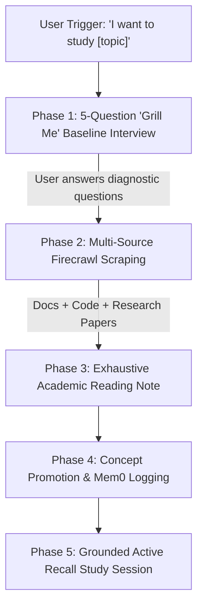

# Study Partner & Knowledge Ingestion Skill (`study-partner-ingest`)

## Trigger
Activated whenever the user says:
- *"I want to study/learn about [topic]"*
- *"Help me study [topic]"*
- *"Deep dive into [topic] for my vault"*

---

## 5-Phase Workflow Protocol

### Phase 1: 5-Question "Grill Me" Baseline Assessment Interview
**Do not skip this phase.** Conduct an interactive diagnostic interview ("Grill Me" style) asking **at most 5 target questions** to calibrate depth before any research or writing begins:

1. **Current Exposure & Baseline**: *"What is your current familiarity with [topic]? Have you worked with or implemented related concepts before?"*
2. **Target Technical Depth**: *"What level of detail do you need? (e.g., high-level conceptual, mathematical/formal proof, production-grade code implementation)"*
3. **Primary Use Case**: *"What will you apply this knowledge to? (e.g., building a feature, exam prep, academic research, system optimization)"*
4. **Key Sub-topics & Failure Modes**: *"Are there specific edge cases, trade-offs, or sub-topics you want heavily emphasized?"*
5. **Prerequisites & Blindspots**: *"Are there any related concepts or prerequisites you'd like a quick refresher on within the reading?"*

---

### Phase 2: Multi-Source Scraping & Research (Firecrawl MCP)
1. Execute `firecrawl_search` to discover:
   - Official documentation & specifications.
   - Production GitHub implementations or code guides.
   - Academic papers / technical blogs.
2. Use `firecrawl_scrape` across **3+ distinct sources** to collect deep technical details, mathematical formulas, code blocks, and architectural diagrams.

---

### Phase 3: Exhaustive Academic Reading Note
Write the generated reading to `20_Brain_Atlas/10_Library/Generated_Readings/<Subject>/<Topic_Title>.md`.

#### Quality Standard (Exhaustive & Self-Contained):
- **Length**: Long-form textbook treatment (1,500+ words). No brief summaries or shallow bullet points.
- **Frontmatter**: Include `type: generated_reading`, `subject`, `source_url`, `source_hash: "<md5>"`, `date_created`, `status: done`, `user_baseline`.
- **Structure**:
  1. **Executive Summary & Fundamental Intuition**: Clear mental model of the core concept.
  2. **Rigorous Theory & Internal Mechanics**: Mathematical formulations, protocol specifications, data flows, and state machines.
  3. **Production-Grade Code Implementation**: Full, working code examples (Python/Rust/JS/C++) with line-by-line annotations—not partial pseudocode snippets.
  4. **Trade-offs, Edge Cases & Failure Modes**: Comparative analysis against alternative solutions, performance overhead, security implications.
  5. **Complete Source Map & Citations**: List of all scraped URLs and external references.

---

### Phase 4: Atomic Concept Promotion & Memory Retention
1. Extract single-idea concepts into `20_Brain_Atlas/20_Concepts/<Subject>/<Concept_Name>.md`.
2. Compute source MD5 hash for frontmatter `source_hash`.
3. Log key learnings into `mem0` using `remember` tool.

---

### Phase 5: Grounded Active Recall Session
Switch to **Grounded Mode**:
1. Present 3–5 targeted active recall diagnostic questions based directly on the newly created reading note.
2. Evaluate user responses, pinpoint knowledge gaps, and update the note if necessary.
