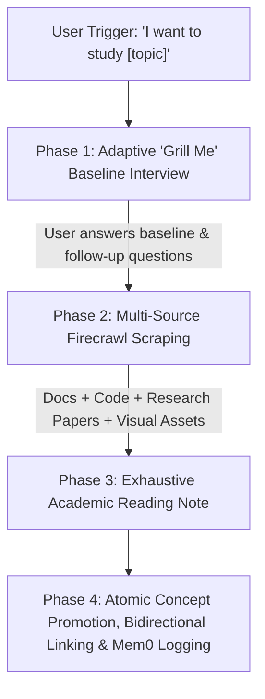

# Study Partner & Knowledge Ingestion Skill (`study-partner-ingest`)

## Trigger
Activated whenever the user says:
- *"I want to study/learn about [topic]"*
- *"Help me study [topic]"*
- *"Deep dive into [topic] for my vault"*

---

## 4-Phase Workflow Protocol

---

### Phase 1: Adaptive "Grill Me" Baseline Assessment Interview
**Do not skip this phase.** Conduct an interactive diagnostic interview ("Grill Me" style) using the `ask_question` tool. Start with 2 mandatory core questions and conditionally branch into targeted follow-up questions:

#### Mandatory Core Questions:
1. **Current Exposure & Baseline**: *"What is your current familiarity with [topic]? Have you worked with or implemented related concepts before?"*
2. **Target Depth & Primary Use Case**: *"What level of technical detail do you need (e.g., high-level mental model, mathematical proofs, production code) and what will you apply it to?"*

#### Conditional Follow-up Questions (Ask as needed based on baseline answers):
- **Edge Cases & Specific Mechanics**: Ask if the user indicated intermediate/advanced familiarity to identify specific edge cases, failure modes, or performance trade-offs to emphasize.
- **Prerequisites & Refresher Scope**: Ask if the user indicated beginner level to determine prerequisite math/code concepts that require explicit refresher sections.

---

### Phase 2: Multi-Source Scraping & Research (Firecrawl MCP)
1. Execute `firecrawl_search` to discover:
   - Official documentation & specifications.
   - Production GitHub implementations or code guides.
   - Academic papers / technical blogs.
2. Use `firecrawl_scrape` across **3+ distinct sources** to collect deep technical details, mathematical formulas, code blocks, and architectural patterns.

---

### Phase 3: Exhaustive Academic Reading Note & Visual Generation
Write the generated reading to `20_Brain_Atlas/10_Library/Generated_Readings/<Subject>/<Topic_Title>.md`.

#### Quality Standard (Exhaustive & Self-Contained):
- **Length**: Long-form textbook treatment (1,500+ words per `99_Configs/Depth_Standard.md`). No brief summaries or shallow bullet points.
- **Visual & Diagram Policy**: Generate custom vector diagram assets using `generate_image` saved to `30_Assets/<type>_<subject>_<topic>_<descriptor>.ext` (e.g. `diagram_cs_raft_consensus_state_machine.png`) using Clean Light / Academic Mode aesthetic. Embed in note using Obsidian wikilink syntax (`![[filename.ext]]`). Do not use ASCII art or Mermaid diagrams for concept illustrations in notes.
- **Mathematical Rigor**: Formulate equations and theoretical proofs using explicit LaTeX notation (`\(...\)` for inline, `\[...\]` for display blocks).
- **Frontmatter**: Include `type: generated_reading`, `subject`, `source_url`, `source_hash: "<md5>"`, `date_created`, `status: done`, `user_baseline`, `promoted_to: []`.
- **Structure**:
  1. **Executive Summary & Fundamental Intuition**: Clear mental model of the core concept.
  2. **Rigorous Theory & Internal Mechanics**: Mathematical formulations, protocol specifications, state diagrams (`![[diagram_...]]`).
  3. **Production-Grade Code Implementation**: Full, annotated, runnable code examples (Python/Rust/JS/C++)—not partial pseudocode snippets.
  4. **Trade-offs, Edge Cases & Failure Modes**: Comparative analysis against alternative solutions, performance overhead, security implications.
  5. **Complete Source Map & Citations**: List of all scraped URLs and external references.

---

### Phase 4: Atomic Concept Promotion & Memory Retention
1. Extract single-idea concepts into `20_Brain_Atlas/20_Concepts/<Subject>/<Concept_Name>.md`.
2. **MD5 Staleness Protocol**: Compute source MD5 hash of the generated reading note and set `source_hash: "<md5>"` in YAML frontmatter of both the Library note and promoted Concept notes.
3. **Bidirectional Wikilinks**:
   - In Library Note frontmatter: update `promoted_to: ["[[Concept_Name]]"]`.
   - In Concept Note frontmatter: set `source: "[[Library_Note_Name]]"`.
4. **Memory Retention**: Log key insights, architecture trade-offs, and user preferences into `mem0` using `remember` tool.
