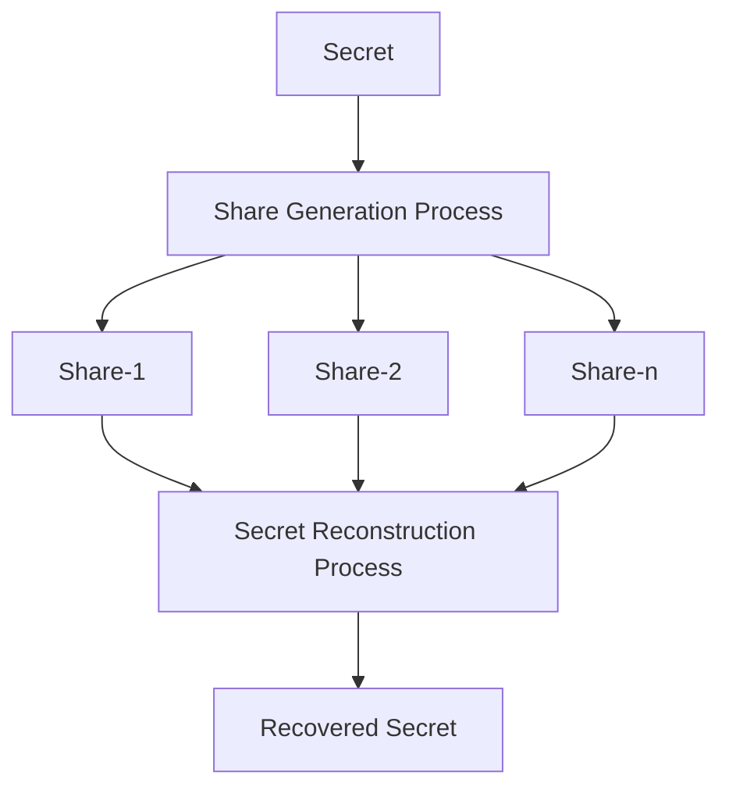
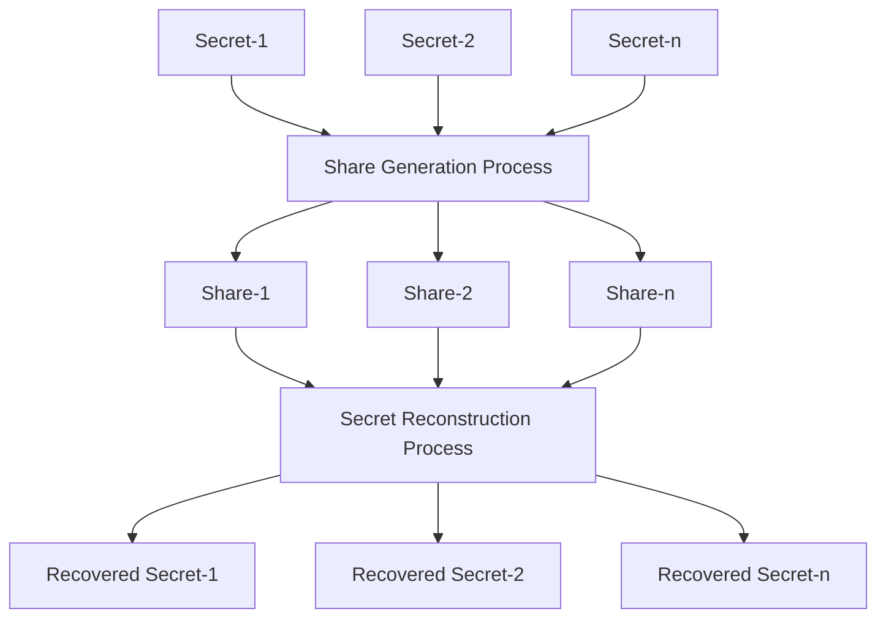

Wireless Personal Communications (2023) 130:957–985
[https://doi.org/10.1007/s11277-023-10315-5](https://doi.org/10.1007/s11277-023-10315-5)

Check for updates

# Single Secret Sharing Scheme Using Chinese Remainder Theorem, Modified Shamir’s Scheme and XOR Operation

Dinesh Pande1 · Arjun Singh Rawat1 · Maroti Deshmukh1 · Maheep Singh1

Accepted: 25 February 2023 / Published online: 31 March 2023
© The Author(s), under exclusive licence to Springer Science+Business Media, LLC, part of Springer Nature 2023

## Abstract

The existing scheme uses lightweight modular arithmetic and Boolean operations for the secret sharing scheme by compromising minor degradation in security with less computation overhead. In this paper, we proposed the computation efficient ($n, n$)-single secret sharing scheme using the Chinese Remainder Theorem (CRT), modified Shamir’s scheme, and Boolean XOR operation with perfect security. The share generation process follows the lightweight, computationally efficient reverse CRT, modified Shamir’s scheme, and XOR operation, which generates the highly randomized shares and does not reveal any information. The secret reconstruction process follows the CRT, modified Shamir’s scheme, and XOR operation. To reconstruct the secret, all $n$ distributed shares are required. The proposed scheme is attack resistant to an attack on any shares. The estimated values of NPCR and UACI, which are 99.99 and 33.33 respectively, demonstrate that the proposed approach is significantly more secure against differential attack than the existing schemes. Additional statistical measures, such as correlation, RMSE, and PSNR, with better approximate values compared to existing schemes, respectively as 0, 97, and 8 dB, are used to evaluate an algorithm’s performance in terms of similarity. To check th robustness of an algorithm, different levels of salt and pepper noise are performed on distributed shares. The experiment results show that the approach is more efficient and secure than existing schemes. The experimental findings demonstrate that the shared images are more randomized, do not reveal any sensitive information, and can be recovered without introducing any loss to the original image. The limitation of the proposed scheme is that it is suitable for a single secret.

**Keywords** Chinese Remainder Theorem · Shamir’s scheme · Secret sharing scheme · Boolean operation · Randomized share · Modular arithmetic · Robustness

\* Maroti Deshmukh
marotideshmukh@nituk.ac.in

Dinesh Pande
dineshpande6002@gmail.com

Arjun Singh Rawat
arjunsinghrawat005@gmail.com

Maheep Singh
maheepsingh@nituk.ac.in

1 National Institute of Technology, Uttarakhand, Srinagar, India

Springer logo

958 D. Pande et al.

# 1 Introduction

The availability of network services has significantly risen over the last several years, which has had an impact on how much data is shared and stored. The difficulties therefore relate to the security of shared and received data. Researchers employed symmetric key cryptography [1, 2] in the past to assure secure data transfer by using the same key on both the sender and recipient sides. When dealing with multimedia applications that deal with data like images, video, music, and text, symmetric key cryptography performs inefficiently. The symmetric key cryptography is relevant with few and little amounts of data. The main difficulty with symmetric key cryptography is transferring a private key across a public channel. The public and private key pair-based asymmetric key cryptography scheme was developed by researchers by expanding the functionality of symmetric key cryptography. In public key cryptography [1], public key is used for encryption and private key for decryption, and sharing the public key over a public channel is not a security concern. Later on different asymmetric key cryptography schemes have improvised [3–6]. However, the inefficiencies of sharing multimedia data, such as images, videos, music, and texts, remained the same. If a malicious third party intervenes, the security may be jeopardized, opening the door to an attack discussed in [7]. Therefore, a system is required in which, rather than concentrating on a single trusted authority, researchers go to more number of trusted third parties, leading to secure data transit and storage. A secret is encoded using a certain method into encrypted shares and distributed through a public channel to various trustworthy third authorities in the secret sharing scheme [8–13]. Single and multiple secret sharing schemes are the two forms of secret sharing schemes. The single secret sharing scheme is depicted in Fig. 1a, where the secret is converted into numerous encrypted shares using the share generation process, and the secret reconstruction process uses the shares as an input and produces the recovered secret as an output. The multi secret sharing scheme is depicted in Fig. 1b, where secrets are converted into numerous encrypted shares using the share generation process, and where shares are used as an input by the secret reconstruction process, which reconstructs the recovered secrets as output.

(a) Single Secret Sharing Scheme

(b) Multi Secret Sharing Scheme

Fig. 1 Secret sharing scheme

Springer logo

<page_number>3</page_number>

Single Secret Sharing Scheme Using Chinese Remainder Theorem,... 959

The purpose of a secret sharing scheme is to pass out confidential information among several participants in the form of shares, with the intention of combining a sufficient number of shares to reconstruct the secrets. Secret information is encoded in the form of shares during share generation, but it is decoded during secret reconstruction to reveal the secrets. The ideal secret-sharing technique is based on the access structure of a permitted subset that is capable of recovering the secrets because any undetermined subset is incapable of doing so. Boolean and modulo operation-based secret sharing schemes [14–22] polynomial-based secret sharing schemes [23–30], elliptic curve-based secret sharing schemes [31, 32], Chinese Remainder Theorem (CRT)-based secret sharing schemes [22, 31, 33–37], cellular automata-based secret sharing schemes [38, 39], neural cryptography-based secret sharing schemes [40], lattice-based secret sharing schemes [41], and random grid based secret sharing schemes [42–50] are the different categories of secret sharing schemes.

Here is how the remaining portions of the document are portrayed. Section 2 described the literature review, Sect. 3 proposed approach, Sect. 4 experimental results and analysis, Sect. 5 conclusion.

# 2 Literature Survey

Naor and Shamir’s fundamental visual secret sharing scheme [51] makes the assumption that the message is made up of a collection of black and white pixels. Every pixel is dealt with individually. Every original pixel from the hidden image was present in the *n* modified version, commonly known as shares. The share is made up of *m* sub-pixels in black and white. The millions of black and white pixels are printed close together so that the human visual system can distinguish each black and white contribution. Based on the number of secrets, there are two types of secret sharing schemes for multimedia images and videos: single secret sharing schemes, where only single secret distributed in the form of encrypted shares with different strategies. Multi-secret sharing scheme, where multiple secrets are distributed in the form encrypted shares with different strategies. To share and recover the secrets, numerous algorithms have been proposed. Some approaches in the literature utilized the Boolean XOR operation, while others were based on modular arithmetic operations and others on the Chinese Remainder Theorem. There is no key used in these schemes, only secret images are used to create shares, and all of the shares are then used to recover the secrets. The single secret sharing scheme with different techniques discussed in the literature [14–17, 32, 40, 42, 43] and The multi-secret sharing scheme (MSSS) with different techniques discussed in the literature [15, 19, 21, 22, 52–57]. The single secret sharing scheme for binary, grayscale, and color secret images is presented in Table 1, where the approach employs a variety of sharing and recovery strategies, including random gird, Boolean operation-based, neural cryptography, Shamir’s scheme, and Elliptic Curve Cryptography (ECC), with their advantages and disadvantages.

The multi secret sharing scheme for binary, grayscale, and color secret images is presented in Table 2, where the approach employs a variety of sharing and recovery strategies, including Lagrange’s interpolation based, Boolean operation-based, CRT based, additive modulo based approaches, with their advantages and disadvantages.

The main drawback of single and multi schemes is that they either provide better security while increasing computation and storage overhead or they give less security while lowering computation and storage overhead. Our contribution is to provide better security with less computation and storage overhead, there is no pixel expansion, no partial reveal original secret’s information, to provide highly randomized shares, provides highly attack resistive approach toward any kind of attack, and provides lossless secret reconstruction.

Springer logo

960

D. Pande et al.

Table 1 Existing single secret sharing schemes

<table>
  <thead>
    <tr>
        <th>References</th>
        <th>Type of scheme</th>
        <th>Sharing and recovery strategy</th>
        <th>Advantages</th>
        <th>Disadvantages</th>
    </tr>
  </thead>
  <tbody>
    <tr>
        <td>Chen et al. [43]</td>
        <td>(n, n) and (2, n)</td>
        <td>Random grid</td>
        <td>1. Recovered secret with less quality, recognizable through human eyes 2. No pixel expansion 3. No partial reveal of original secret's information 4. Progressive visual quality</td>
        <td>1. Additional code-book is required 2. Average randomized shares 3. Lossy secret recovery approach 4. Average attack resistive</td>
    </tr>
    <tr>
        <td>Chen et al. [42]</td>
        <td>(t, n)-threshold</td>
        <td>Random grid</td>
        <td>1. Better visual quality secret reconstruction without violating the security 2. Progressive visual quality 3. Wide image format 4. No pixel expansion</td>
        <td>1. Partially reveal of original secret's information 2. Average randomized shares 3. Lossy secret recovery approach 4. Average attack resistive</td>
    </tr>
    <tr>
        <td>Wang et al. [14]</td>
        <td>(n, n) and (2, n)</td>
        <td>Boolean AND and Boolean XOR</td>
        <td>1. Better visual quality secret reconstruction without violating the security 2. Progressive visual quality 3. Wide image format 4. No pixel expansion 5. low computation and storage complexity</td>
        <td>1. Partially reveal of original secret's information 2. Average randomized shares 3. Lossy secret recovery approach for binary secret image, lossless secret recovery approach for grayscale and color secret image 4. Average attack resistive</td>
    </tr>
    <tr>
        <td>Deshmukh et al. [15]</td>
        <td>(2h, 2h)</td>
        <td>Boolean XOR and Binary Tree</td>
        <td>1. Lossless secret reconstruction without violating the security 2. No pixel expansion 3. low computation and high storage complexity 4. No partial reveal of original secret's information 5. Highly randomized shares</td>
        <td>1. Number of shares depend on the height of the binary tree 2. Average attack resistive</td>
    </tr>
    <tr>
        <td>Gupta et al. [40]</td>
        <td>(t, n)-threshold</td>
        <td>Neural cryptography and Shamir's scheme</td>
        <td>1. Lossless secret reconstruction without violating the security 2. No pixel expansion 3. No partial reveal of original secret's information 4. Highly randomized shares</td>
        <td>1. High computation and high storage complexity 2. Average attack resistive</td>
    </tr>
  </tbody>
</table>

Springer logo

<page_number>3</page_number>

Single Secret Sharing Scheme Using Chinese Remainder Theorem,...

Table 1 (continued)

<table>
  <thead>
    <tr>
        <th>References</th>
        <th>Type of scheme</th>
        <th>Sharing and recovery strategy</th>
        <th>Advantages</th>
        <th>Disadvantages</th>
    </tr>
  </thead>
  <tbody>
    <tr>
        <td>Prasetyo et al. [16]</td>
        <td>($t, n$)-threshold</td>
        <td>Bitwise and Boolean XOR</td>
        <td>1. Lossless secret reconstruction without violating the security 2. No pixel expansion 3. Progressive visual quality 4. low computation and low storage complexity 5. No partial reveal original secret's information 6. Highly randomized shares</td>
        <td>1. Average attack resistive</td>
    </tr>
    <tr>
        <td>Kannojia et al. [17]</td>
        <td>($n, n$)</td>
        <td>Boolean XOR</td>
        <td>1. No pixel expansion 2. low computation and low storage complexity 3. No partial reveal of original secret's information 4. Highly randomized shares 5. No overhead for storing codebook</td>
        <td>1. Additional codebook Required 2. Lossy Recovery 3. Average attack resistive</td>
    </tr>
    <tr>
        <td>Chattopadhyay et al. [32]</td>
        <td>($t, n$)-threshold</td>
        <td>Boolean XOR and ECC</td>
        <td>1. Lossless secret reconstruction without violating the security 2. Provide verification of the share during secret reconstruction 3. No pixel expansion 4. No partial reveal of original secret's information 5. Highly randomized shares 6. No overhead for storing codebook 7. Highly attack resistive 8. Additional codebook is not Required</td>
        <td>1. High computation and storage complexity</td>
    </tr>
  </tbody>
</table>

1 3

<page_number>961</page_number>

962

D. Pande et al.

# 3 Proposed Model

The proposed approach is designed to provide the single secret sharing mechanism using CRT, modified Shamir scheme, and XOR operation. The block diagram of proposed single secret image sharing scheme is represented in Fig. 2. Figure 2a shows the share generation process, before that the primary and intermediate shares are generated. To generate the primary shares {$PS_1, PS_2, \dots, PS_n$} the secret along with co-prime set performs the Inverse CRT operation. To generate the intermediate shares {$IS_1, IS_2, \dots, IS_n$}, the primary shares along with co-prime set performs the modified Shamir’s scheme. To get a randomized image $R$, every shares performs the XOR operation. To generate the shares {$S_1, S_2, \dots, S_n$}, every share performs the XOR operation with transpose of Randomized image $R^T$. Figure 2b shows the secret reconstruction process, before that the Randomized image, intermediate shares and primary shares are reconstructed. To reconstruct the randomized image $R$, all the shares {$S_1, S_2, \dots, S_n$} performs the XOR operation. To reconstruct the intermediate shares {$IS_1, IS_2, \dots, IS_n$}, every share performs the XOR operation with transpose of randomized image $R^T$. To reconstruct the primary shares {$PS_1, PS_2, \dots, PS_n$}, the intermediate shares along with co-prime set perform the modified Shamir’s scheme. To reconstruct the secret image, the primary shares along with co-prime set perform the CRT operation.

## 3.1 Share Generation Process

The shares are generated by using Reverse Chinese Reminder Theorem (RCRT), modified Shamir scheme, and boolean XOR operation. The detailed steps for share generations are discussed in Algorithm 1 in the following sections. The primary shares generation shown in Algorithm 1 (i), where the primary shares {$PS_1, PS_2, \dots, PS_n$} generation process with inputs as secret $I$ and co-prime set {$P_1, P_2, \dots, P_n$}. To get primary shares as output, the input secret image and co-prime set perform the reverse CRT. The reverse Chinese Remainder Theorem shown in Algorithm 1 (ii), where the primary shares {$PS_1, PS_2, \dots, PS_n$} generation process using RCRT with inputs as secret $I$ and co-prime set {$P_1, P_2, \dots, P_n$}. The intermediate share generation shown in Algorithm 1 (iii), where the intermediate shares {$IS_1, IS_2, \dots, IS_n$} generation process with inputs as primary shares {$PS_1, PS_2, \dots, PS_n$} and co-prime set {$P_1, P_2, \dots, P_n$}. To get intermediate shares as output, the input primary shares and co-prime set perform the modified Shamir scheme (MShamir). The modified Shamir’s scheme shown in Algorithm 1 (iv), where the intermediate shares {$IS_1, IS_2, \dots, IS_n$} generation process using modified Shamir’s scheme with inputs as primary shares {$PS_1, PS_2, \dots, PS_n$} and co-prime set {$P_1, P_2, \dots, P_n$}. The Randomized image generation process shown in Algorithm 1 (v), where the randomized image $R$ generation process with inputs as intermediate shares {$IS_1, IS_2, \dots, IS_n$}. To get a randomized image as output, the input intermediate shares perform the XOR operation. The share generation shown in Algorithm 1 (vi), where The shares {$IS_1, IS_2, \dots, IS_n$} generation process with inputs as intermediate shares {$IS_1, IS_2, \dots, IS_n$} and randomized image $R$. To get shares as output, the input intermediate shares and transpose of randomized image $R^T$ perform the XOR operation.

Springer logo

Single Secret Sharing Scheme Using Chinese Remainder Theorem,...

963

Table 2 Existing multi secret sharing schemes

<table>
  <thead>
    <tr>
        <th>References</th>
        <th>Type of scheme</th>
        <th>Sharing and recovery strategy</th>
        <th>Advantages</th>
        <th>Disadvantages</th>
    </tr>
  </thead>
  <tbody>
    <tr>
        <td>[Feng et al. [25]](https://doi.org/10.1007/s11042-018-6584-y)</td>
        <td>(t, n)-threshold</td>
        <td>Lagrange's interpolation</td>
        <td>1. Recovered secret with good visual quality, recognizable by human eyes 2. Meaningful shares distribution 3. Large secret hiding capacity 4. Low computational complexity 5. No extra codebook required</td>
        <td>1. Additional code-book is required 2. Lossy secret recovery approach 3. Lossy shadow with good visual quality 4. Additional meaningful cover images required 5. Partially reveal of original secret's information 6. Average attack resistive</td>
    </tr>
    <tr>
        <td>[Guo et al. [52]](https://doi.org/10.1007/s11042-018-6584-y)</td>
        <td>(t, n)-threshold</td>
        <td>Monotone span programs and LSB stuffing</td>
        <td>1. Lossless secret reconstruction without violating the security 2. Meaningful shares distribution 3. Large secret hiding capacity 4. Low computational complexity 5. No extra codebook required</td>
        <td>1. Lossy shadow with good visual quality 2. Additional meaningful cover images required 3. Partially reveal of original secret's information 4. Average attack resistive</td>
    </tr>
    <tr>
        <td>[Guo et al. [33]](https://doi.org/10.1007/s11042-018-6584-y)</td>
        <td>(t, n)-threshold</td>
        <td>CRT</td>
        <td>1. Lossless secret reconstruction without violating the security 2. Meaningful shares distribution 3. Large secret hiding capacity 4. Low computational complexity 5. Visual quality of binary image giving the better embedding capacity compare to grayscale and color image. 6. No extra codebook required</td>
        <td>1. Lossy shadow with good visual quality 2. Additional meaningful cover images required 3. Partially reveal of original secret's information 4. Average attack resistive</td>
    </tr>
  </tbody>
</table>

Springer logo

964

D. Pande et al.

Table 2 (continued)

<table>
  <thead>
    <tr>
        <th>References</th>
        <th>Type of scheme</th>
        <th>Sharing and recovery strategy</th>
        <th>Advantages</th>
        <th>Disadvantages</th>
    </tr>
  </thead>
  <tbody>
    <tr>
        <td>Deshmukh et al. [19]</td>
        <td>(n, n)</td>
        <td>Boolean XOR and arithmetic modulo</td>
        <td>1. Lossless secret reconstruction without violating the security 2. No pixel expansion 3. No partial reveal original secret's information 4. Low computational and storage complexity 5. Highly randomized shares 6. No extra codebook required</td>
        <td>1. The scheme is not applicable for the secret of different dimension 2. Average attack resistive</td>
    </tr>
    <tr>
        <td>Deshmukh et al. [54]</td>
        <td>(n, n)</td>
        <td>CRT</td>
        <td>1. Lossless secret reconstruction without violating the security 2. No pixel expansion 3. No partial reveal of original secret's information 4. Low storage complexity 5. Highly randomized shares 6. highly attack resistive 7. No extra codebook required</td>
        <td>1. The scheme is not applicable for the secret of different dimension 2. High computation complexity</td>
    </tr>
    <tr>
        <td>Rajput et al. [20]</td>
        <td>(n, n + 1)</td>
        <td>Additive Modulo</td>
        <td>1. Lossless secret reconstruction without violating the security 2. No pixel expansion 3. No partial reveal original secret's information 4. Low computational and storage complexity 5. Highly randomized shares 6. No extra codebook required</td>
        <td>1. The scheme is not applicable for the secret of different dimension 2. Average attack resistive</td>
    </tr>
  </tbody>
</table>

Springer logo 1 3

Single Secret Sharing Scheme Using Chinese Remainder Theorem,...

965

Table 2 (continued)

<table>
  <thead>
    <tr>
        <th>References</th>
        <th>Type of scheme</th>
        <th>Sharing and recovery strategy</th>
        <th>Advantages</th>
        <th>Disadvantages</th>
    </tr>
  </thead>
  <tbody>
    <tr>
        <td>Deshmukh et al. [22]</td>
        <td>(n, n)</td>
        <td>Additive Modulo and Reverse Bit operation</td>
        <td>1. Lossless secret reconstruction without violating the security 2. No pixel expansion 3. No partial reveal of original secret's information 4. Low computational and storage complexity 5. No extra codebook required 6. Highly randomized shares</td>
        <td>1. The scheme is not applicable for the secret of different dimension 2. Average attack resistive</td>
    </tr>
    <tr>
        <td>Bisht et al. [56]</td>
        <td>(n, n + 1, l) and (n, m, l)</td>
        <td>Boolean and modulo arithmetic</td>
        <td>1. Lossless secret reconstruction without violating the security 2. No pixel expansion 3. No partial reveal of original secret's information 4. Highly randomized shares 5. Highly attack resistive 6. No extra codebook required</td>
        <td>1. The scheme is not applicable for the secret of different dimension 2. High computational and storage complexity due to the usage of multilevel secret sharing scheme 3. It requires a specific order of the shares to be maintained at each level for proper secret reconstruction</td>
    </tr>
    <tr>
        <td>Chattopadhyay et al. [58]</td>
        <td>(n, n)</td>
        <td>Boolean XOR operation and hash function</td>
        <td>1. Provide verification of the share during secret reconstruction 2. Lossless secret reconstruction without violating the security 3. No pixel expansion 4. No partial reveal of original secret's information 5. Highly randomized shares 6. Highly attack resistive 7. No extra codebook required 8. Low computation and storage complexity</td>
        <td>1. The scheme is not applicable for the secret of different dimension 2. It requires a specific order of the shares to be maintained at each level for proper secret reconstruction</td>
    </tr>
  </tbody>
</table>

Springer logo

1 3

966

D. Pande et al.

# Algorithm 1: Share Generation Process

**(i) Primary Share Generation::**
**Input:** Secret $I$ and coprimes' set $P \in \{P_1, P_2, \dots, P_n\}$
**Output:** Primary Shares' set $PS \in \{PS_1, PS_2, \dots, PS_n\}$
$PS \leftarrow ICRT(I, P)$

**(ii) Reverse Chinese Remainder Theorem::**
**Input:** Secret $I$ and $\{P_1, P_2, \dots, P_n\}$ be the set of co-primes
**Output:** Primary Shares $\{PS_1, PS_2, \dots, PS_n\}$
$PS_1 \equiv I \pmod{P_1}$
$PS_2 \equiv I \pmod{P_2}$
$\dots$
$PS_{n-1} \equiv I \pmod{P_{n-1}}$
$PS_n \equiv I \pmod{P_n}$

**(iii) Intermediate Share Generation::**
**Input:** Primary Shares' set $PS \in \{PS_1, PS_2, \dots, PS_n\}$, and coprimes' set $P \in \{P_1, P_2, \dots, P_n\}$
**Output:** Intermediate Shares' set $IS \in \{IS_1, IS_2, \dots, IS_n\}$
$IS \leftarrow MShamir(PS, P)$

**(iv) Modified Shamir's Scheme::**
**Input:** Primary shares $\{PS_1, PS_2, \dots, PS_n\}$ and co-primes set $\{P_1, P_2, \dots, P_n\}$
**Output:** Intermediate shares $\{IS_1, IS_2, \dots, IS_n\}$
$IS_1 \leftarrow (PS_1 + PS_2 \times P_1 + PS_3 \times P_1^2 + \dots + PS_n \times P_1^{n-1}) \pmod{251}$
$IS_2 \leftarrow (PS_1 + PS_2 \times P_2 + PS_3 \times P_2^2 + \dots + PS_n \times P_2^{n-1}) \pmod{251}$
$\dots$
$IS_{n-1} \leftarrow (PS_1 + PS_2 \times P_{n-1} + PS_3 \times P_{n-1}^2 + \dots + PS_n \times P_{n-1}^{n-1}) \pmod{251}$
$IS_n \leftarrow (PS_1 + PS_2 \times P_n + PS_3 \times P_n^2 + \dots + PS_n \times P_n^{n-1}) \pmod{251}$

**(v) Randomized Image Generation::**
**Input:** Intermediate Shares' set $IS \in \{IS_1, IS_2, \dots, IS_n\}$
**Output:** Randomized image $R$
$R \leftarrow IS_1 \oplus IS_2 \oplus \dots \oplus IS_n$

**(vi) Share Generation::**
**Input:** Intermediate Shares' set $IS \in \{IS_1, IS_2, \dots, IS_n\}$, and Randomized image $R$
**Output:** Shares' set $S \in \{S_1, S_2, \dots, S_n\}$
$S \leftarrow IS \oplus R^T$

## 3.2 Secret Reconstruction Process

The secret reconstruction is the reverse process of share generation. The detailed steps for secret reconstruction are discussed in Algorithm 2 int the following sections. The randomized image reconstruction shown in Algorithm 2 (i), where the randomized image $R$ reconstruction process with input as shares $\{S_1, S_2, \dots, S_n\}$. To get a randomized image as output, the input shares perform the XOR operation. The intermediate share reconstruction shown in Algorithm 2 (ii), where the intermediate shares $\{IS_1, IS_2, \dots, IS_n\}$ reconstruction process with inputs as shares $\{S_1, S_2, \dots, S_n\}$ and randomized image $R$. To get intermediate shares as output, the input shares and transpose of randomized image $R^T$ perform

Springer logo

<page_number>1 3</page_number>

Single Secret Sharing Scheme Using Chinese Remainder Theorem,...

967

XOR operation. The primary share reconstruction shown in Algorithm 2 (iii), where the primary shares {$PS_1, PS_2, \dots, PS_n$} reconstruction process with inputs as intermediate shares {$IS_1, IS_2, \dots, IS_n$} and co-prime set {$P_1, P_2, \dots, P_n$}. To get primary shares as output, the input intermediate shares {$IS_1, IS_2, \dots, IS_n$} and co-prime set perform reverse modified Shamir scheme. The reverse modified Shamir's scheme shown in Algorithm 2 (iv), where the intermediate shares {$IS_1, IS_2, \dots, IS_n$} generation process using reverse modified Shamir's scheme with inputs as primary shares {$PS_1, PS_2, \dots, PS_n$} and co-prime set {$P_1, P_2, \dots, P_n$}. All the coefficient in polynomial $F(P)$ are the reconstructed primary shares. The secret image reconstruction shown in Algorithm 2 (v), where the secret reconstruction process with inputs as primary shares {$PS_1, PS_2, \dots, PS_n$} and co-prime set {$P_1, P_2, \dots, P_n$}. To recover the secret as output, the input primary shares and co-prime set perform CRT. The Chinese Remainder Theorem shown in Algorithm 2 (vi), where the primary shares {$PS_1, PS_2, \dots, PS_n$} generation process using CRT with inputs as secret $I$ and co-prime set {$P_1, P_2, \dots, P_n$}.

Fig. 2 Block diagram of proposed single secret image sharing scheme

Springer logo

968

D. Pande et al.

# Algorithm 2: Secret Reconstruction Process

**(i) Randomized Image Reconstruction::**

**Input:** Shares' set $S \in \{S_1, S_2, \dots, S_n\}$

**Output:** Randomized image $R$

$R \leftarrow S_1 \oplus S_2 \oplus \dots \oplus S_n$

**(ii) Intermediate Share Reconstruction::**
**Input:** Shares' set $S \in \{S_1, S_2, \dots, S_n\}$, and Randomized image $R$
**Output:** Intermediate Shares' set $IS \in \{IS_1, IS_2, \dots, IS_n\}$

$IS \leftarrow S \oplus R^T$

**(iii) Primary Share Reconstruction::**

**Input:** Intermediate Shares' set $IS \in \{IS_1, IS_2, \dots, IS_n\}$ and coprimes' set

$P \in \{P_1, P_2, \dots, P_n\}$

**Output:** Primary Shares' set $PS \in \{PS_1, PS_2, \dots, PS_n\}$

$PS \leftarrow RMShamir(IS, P)$

**(iv) Reverse Modified Shamir's Scheme::**

**Input:** Intermediate share and co-primes pairs $(IS_1, P_1), (IS_2, P_2), \dots, (IS_n, P_n)$

**Output:** Primary shares $\{PS_1, PS_2, \dots, PS_n\}$

$Z_1(P) \leftarrow \left( \frac{P-P_2}{P_1-P_2} \right) \times \left( \frac{P-P_3}{P_1-P_3} \right) \times \dots \times \left( \frac{P-P_n}{P_1-P_n} \right)$

$Z_2(P) \leftarrow \left( \frac{P-P_1}{P_2-P_1} \right) \times \left( \frac{P-P_3}{P_2-P_3} \right) \times \dots \times \left( \frac{P-P_n}{P_2-P_n} \right)$
$\dots$

$Z_n(P) \leftarrow \left( \frac{P-P_1}{P_n-P_1} \right) \times \left( \frac{P-P_2}{P_n-P_2} \right) \times \dots \times \left( \frac{P-P_{n-1}}{P_n-P_{n-1}} \right)$

$F(P) \leftarrow \sum_{i=1}^n (Z_i(P) \times IS_i) \cong PS_1 + PS_2 \times P + PS_3 \times P^2 + \dots + PS_n \times P^{n-1}$

**(v) Secret Image Reconstruction**

**Input:** Primary Shares' set $PS \in \{PS_1, PS_2, \dots, PS_n\}$ and coprimes' set

$P \in \{P_1, P_2, \dots, P_n\}$

**Output:** Secret $I$

$I \leftarrow CRT(PS, P)$

**(vi) Chinese Remainder Theorem**

**Input:** $\{PS_1, PS_2, \dots, PS_n\}$, be any set of integers and $\{P_1, P_2, \dots, P_n\}$

**Output:** Recovered Secret $I$

Product of co-prime numbers as $M \leftarrow (P_1 \times P_2 \times \dots \times P_n)$

Compute divisor as $m_i \leftarrow \frac{M}{P_i}, i \in \{1, 2, 3, \dots n\}$
$m_i^{-1}$ is multiplicative inverse of $m_i \bmod P_i$

The common solution of CRT,

$I \leftarrow (PS_1 \times m_1 \times m_1^{-1} + PS_2 \times m_2 \times m_2^{-1} + \dots + PS_n \times m_n \times m_n^{-1}) \bmod M$

# 4 Experimental Results and Analysis

The experiment findings and an analysis of the proposed model are presented in this section. The studies were carried out using a Python 3.8-configured Pycharm IDE and an Intel Pentium 4417U CPU with 4 GB of RAM. For the experiment, several coloured and grayscale images are used. The proposed approach effectively handles a single secret sharing scheme.

Springer logo

<page_number>1 3</page_number>

Single Secret Sharing Scheme Using Chinese Remainder Theorem,...

969

The single secret sharing strategy outcomes for grayscale images are shown in Fig. 3. The original secret is shown in Fig. 3a as a Baboon. The shares in Fig. 3b–e are generated using the CRT and Shamir’s secret sharing scheme. Figure 3f shows the recovered secret after reconstruction process. The secret is reconstructed without any loss, hence the original and recovered secrets are identical.

The recovery of the proposed secret sharing scheme, which includes either attacked shares or fewer shares for the grayscale image, is shown in Fig. 4.

The Fig. 4a depicts Barbara as the original secret. The shares, generated using the CRT and Shamir’s secret sharing schemes are shown in Fig. 4b–e. Figure 4f depicts the attacked share, while Fig. 4g, which features Leena as the hostile image, is used to depict the attacked share.

In Fig. 4h, the secret is recovered by combining shares *S*1, *S*2, and *S*3. In Fig. 4i, the secret is recovered by combining shares *S*1, *S*2, and *S*4. The secret is recovered in Fig. 4j by combining shares *S*1, *S*3, and *S*4. The secret is recovered in Fig. 4k by combining shares *S*2, *S*3, and *S*4. The secret is recovered in Fig. 4l by combining shares *S*2, *S*3, and *S*4 with the attacked share *A*. Figure 4m recovers the secret by combining shares *S*2, *S*3, and *S*4 with a hostile image *H*.

Figure 4n shows the recovered secret after adding noise density at level 0.01 to any of the shares. Figure 4o shows the recovered secret after applying noise density at level 0.05 to any of the shares. The recovered secret is shown in Fig. 4p, which is generated by applying noise density at a level of 0.10 to any of the shares.

The single secret sharing strategy outcomes for color images are shown in Fig. 5. The original secret is shown in Fig. 5a as Baboon. The shares in Fig. 5b–e are generated using the CRT and Shamir secret sharing scheme. Figure 5f shows the recovered secret after reconstruction process. The secret is recovered without any loss, so the original and recovered secrets are identical.

The recovery of the proposed secret sharing scheme, which includes either attacked shares or fewer shares for the color image, is shown in Fig. 6.

The Fig. 6a depicts Barbara as the original secret. The shares, generated using the CRT and Shamir secret sharing schemes are shown in Fig. 6b–e. Figure 6f depicts the attacked share, while Fig. 6g, which features Leena as the hostile image, is used to depict the attacked share.

In Fig. 6h, the secret is recovered by combining shares *S*1, *S*2, and *S*3. In Fig. 6i, the secret is recovered by combining shares *S*1, *S*2, and *S*4. The secret is recovered in Fig. 6j by combining shares *S*1, *S*3, and *S*4. The secret is recovered in Fig. 6k by combining shares *S*2, *S*3, and *S*4. The secret is recovered in Fig. 6l by combining shares *S*2, *S*3, and *S*4 with the attacked share *A*. Figure 6m recovered the secret by combining shares *S*2, *S*3, and *S*4 with a hostile image *H*.

Figure 6n shows the recovered secret after adding noise density at level 0.01 to any of the shares. Figure 6o shows the recovered secret after applying noise density at level 0.05 to any of the shares. The recovered secret is shown in Fig. 6p, which is generated by applying noise density at a level of 0.10 to any of the shares.

Springer logo

970 D. Pande et al.

## 4.1 Histogram Analysis

The histogram of the image shows the intensity distribution. The x-axis reflects the intensity values of grayscale image in the range 0–255, whereas the y-axis for a grayscale image refers to the frequency of intensity values.

The Fig. 7 represents the histogram analysis of the proposed scheme for grayscale image. Figure 7a depicts the secret as Baboon. Figure 7b, c and g, h depict the shares. Figure 7i represents the recovered secret. The histogram of the secret is shown in Fig. 7d. The histogram of the shares are shown in Fig. 7e, f and j, k. The histogram of the recovered secret is shown in Fig. 7l. The histogram of the shares has a uniform distribution and does not statistically resemble the histogram of the secret, both the recovered secret and the original secret show huge sharp spikes followed by sharp drops.

The Fig. 8 represents the histogram analysis of the proposed scheme for color image. Figure 8a depicts the secret as Baboon. Figure 8b, c and g, h depict the shares. Figure 8i represents the recovered secret. The histogram of the secret is shown in Fig. 8d. The histogram of the shares are shown in Fig. 8e, f and j, k. The histogram of the recovered secret is shown in Fig. 8l. The histogram of the shares has a uniform distribution and does not statistically resemble the histogram of the secret, both the recovered secret and the secret show huge sharp spikes followed by sharp drops.

## 4.2 Statistical Measures

Statistical metrics are the measurements that help in evaluating and analyzing an image encryption scheme’s effectiveness with perfect security. These statistical measurements assess the efficacy of an image-based encryption or decryption technique. We have employed correlation, PSNR, RMSE, NPCR, and UACI as statistical measurements to assess the efficacy of our proposed scheme. These measurements were calculated over two images, and they are described below:

1. **Correlation** Correlation is a measure of similarity that indicates how closely connected and similar the provided pair of images are to one another. It is typically used to evaluate the effectiveness of recovered secret.

The range of the correlation’s value is [−1, 1]. The correlation between the original secret and the recovered secret, corr(*I*, *R*), must be close to one in order for the SIS scheme to be effective, whereas corr(*I*, *S*), or the correlation between the pair of secret and share, must be close to zero. While a correlation value of 0 indicates no correlation at all and total differences between the two images, a correlation value of 1 indicates a significant correlation and identical similarity between the two images.

The Eq. 1 is used to assess the correlation between the two images *A* and *B*.

$$ Corr(A, B) = \frac{\frac{1}{N} \sum_{u=1}^{N} (A_u - \bar{A})(B_u - \bar{B})}{\sqrt{(\frac{1}{N} \sum_{u=1}^{N} (A_u - \bar{A})^2)(\frac{1}{N} \sum_{u=1}^{N} (B_u - \bar{B})^2)}} \quad (1) $$

2. **RMSE** The RMSE can be used to quantify the unpredictability of shares. An effective reconstruction technique should result in almost zero percent error in the image, in contrast to an effective SIS scheme that will produce huge RMSE values between the image-share pair, or (*I*, *S*).

Springer logo Springer
<page_number>

3
</page_number>

Single Secret Sharing Scheme Using Chinese Remainder Theorem,... 971

The RMSE between the two images *A* and *B* is calculated using the Eq. 2 where the image dimension is represented by the pair (*N*, *M*).

$$ RMSE = \sqrt{\frac{1}{(N \times M)} \sum_{u=1}^{N} \sum_{v=1}^{M} (A(u, v) - B(u, v))^2} $$ (2)

3. **PSNR** Typically, PSNR is used to gauge how well a reconstruction was done. The PSNR of the original secret and the recovered secret are same for a perfect lossless method.

The PSNR is also employed as a metric for share randomness. The share's unpredictability is inversely correlated with the PSNR value for a pair of secret and shares.

The Eq. 3 can be used to calculate PSNR, which is expressed in decibels (dB), where the highest possible value for a pixel is 255.

$$ PSNR = 10log_{10} \left( \frac{255 \times 255}{(MSE)} \right) $$ (3)

where, MSE stands for mean square error, and 255 is highest intensity in the image.

4. **NPCR** The NPCR is used to measure the randomness. If there is a minor difference between two images, NPCR measures the absolute pixel change rate. Additionally, the

![[page_15_image_2_v2.jpg]]

secret I
(a) *I*

share S1
(b) $S_1$

share S2
(c) $S_2$

share S3
(d) $S_3$

share S4
(e) $S_4$

recovered secret R
(f) *R*

**Fig. 3** Proposed secret sharing scheme for grayscale images: **a** secret *I*, **b–e** shares {$S_1, S_2, S_3, S_4$}, **f** recovered secret *R*

Springer logo

972

D. Pande et al.

<table>
    <tr>
        <td>secret I</td>
        <td>share S1</td>
        <td>share S2</td>
        <td>share S3</td>
    </tr>
    <tr>
        <td>(a) $I$</td>
        <td>(b) $S_1$</td>
        <td>(c) $S_2$</td>
        <td>(d) $S_3$</td>
    </tr>
    <tr>
        <td>share S4</td>
        <td>attacked share A</td>
        <td>hostile image H</td>
        <td>partial recovered secret R(S1, S2, S3)</td>
    </tr>
    <tr>
        <td>(e) $S_4$</td>
        <td>(f) $A$</td>
        <td>(g) $H$</td>
        <td>(h) $R(S_1, S_2, S_3)$</td>
    </tr>
    <tr>
        <td>partial recovered secret R(S1, S2, S4)</td>
        <td>partial recovered secret R(S1, S3, S4)</td>
        <td>partial recovered secret R(S2, S3, S4)</td>
        <td>attacked recover secret R(A, S2, S3, S4)</td>
    </tr>
    <tr>
        <td>(i) $R(S_1, S_2, S_4)$</td>
        <td>(j) $R(S_1, S_3, S_4)$</td>
        <td>(k) $R(S_2, S_3, S_4)$</td>
        <td>(l) $R(A, S_2, S_3, S_4)$</td>
    </tr>
    <tr>
        <td>recovered secret R(H, S2, S3, S4)</td>
        <td>Noisy recovered secret RN01</td>
        <td>Noisy recovered secret RN05</td>
        <td>Noisy recovered secret RN10</td>
    </tr>
    <tr>
        <td>(m) $R(H, S_2, S_3, S_4)$</td>
        <td>(n) $RN01$</td>
        <td>(o) $RN05$</td>
        <td>(p) $RN10$</td>
    </tr>
</table>

![[page_16_table_1_v2.jpg]]

**Fig. 4** Recovery of proposed secret sharing scheme, which includes either attacked shares or fewer shares for the grayscale images: **a** secret $I$, **b–e** shares $\{S_1, S_2, S_3, S_4\}$, **f** attacked share $A$, **g** hostile image $H$, **h–k** partial recovered secrets $\{R(S_1, S_2, S_3), R(S_1, S_2, S_4), R(S_1, S_3, S_4), R(S_2, S_3, S_4)\}$, **l** attacked recover secret $R(A, S_2, S_3, S_4)$, **m** recovered secret $R(H, S_2, S_3, S_4)$, **n–p** Noisy recovered secret $\{RN01, RN05, RN10\}$

robustness of encryption methods against differential assaults is evaluated using this quantitative measurement.

The Eq. 4 is used to evaluate the NPCR value between the two images $A$ and $B$.

$$ NPCR(A, B) = \frac{\sum_{u,v} W(u, v)}{(N \times M)} \times 100\% \quad (4) $$

where, $(A, B)$ is the image pair, where the image dimension is represented by the pair $(N, M)$.

The Eq. 5 is used to evaluate the value of $W(u, v)$.

Springer logo

Single Secret Sharing Scheme Using Chinese Remainder Theorem,...

973

secret image I
(a) *I*

share image S1
(b) *S*1

share image S2
(c) *S*2

share image S3
(d) *S*3

share image S4
(e) *S*4

recovered secret image R
(f) *R*

![[page_17_image_2_v2.jpg]]

**Fig. 5** Proposed secret sharing scheme for color images: **a** secret *I*, **b–e** shares {$S_1, S_2, S_3, S_4$}, **f** recovered secret *R*

$$
W(u, v) = \begin{cases} 1, & \text{if } A(u, v) \neq B(u, v). \\ 0, & \text{if } A(u, v) = B(u, v). \end{cases} \eqno(5)
$$

5. **UACI** The UACI is used to measure the randomness. If there is a minor difference between two images, UACI measures average colour intensity fluctuations. Additionally, the robustness of encryption methods against differential assaults is evaluated using this quantitative measurement.

The Eq. 6 is used to evaluate the value of UACI, where (*A*, *B*) is the image pair, where the image dimension is represented by the pair (*N*, *M*) and 255 is highest intensity in the image.

$$
UACI(A, B) = \left[ \frac{1}{(N \times M)} \sum_{u,v} \frac{|A(u, v) - B(u, v)|}{255} \right] \times 100\% \eqno(6)
$$

### 4.2.1 Statistical Results

Table 3 compares secret and shared images statistically using correlation, RMSE, and PSNR. The statistical comparison of the proposed approach to existing schemes [14, 15,

Springer logo

974

D. Pande et al.

<table>
    <tr>
        <td>secret CI</td>
        <td>share S1</td>
        <td>share S2</td>
        <td>share S3</td>
    </tr>
    <tr>
        <td>(a) $CI$</td>
        <td>(b) $S_1$</td>
        <td>(c) $S_2$</td>
        <td>(d) $S_3$</td>
    </tr>
    <tr>
        <td>share S4</td>
        <td>attacked share A</td>
        <td>hostile image H</td>
        <td>partial recovered secret R(S1, S2, S3)</td>
    </tr>
    <tr>
        <td>(e) $S_4$</td>
        <td>(f) $A$</td>
        <td>(g) $H$</td>
        <td>(h) $R(S_1, S_2, S_3)$</td>
    </tr>
    <tr>
        <td>partial recovered secret R(S1, S2, S4)</td>
        <td>partial recovered secret R(S1, S3, S4)</td>
        <td>partial recovered secret R(S2, S3, S4)</td>
        <td>attacked recovered secret R(A, S2, S3, S4)</td>
    </tr>
    <tr>
        <td>(i) $R(S_1, S_2, S_4)$</td>
        <td>(j) $R(S_1, S_3, S_4)$</td>
        <td>(k) $R(S_2, S_3, S_4)$</td>
        <td>(l) $R(A, S_2, S_3, S_4)$</td>
    </tr>
    <tr>
        <td>recovered secret R(H, S2, S3, S4)</td>
        <td>noisy recovered secret RN01</td>
        <td>noisy recovered secret RN05</td>
        <td>noisy recovered secret RN10</td>
    </tr>
    <tr>
        <td>(m) $R(H, S_2, S_3, S_4)$</td>
        <td>(n) $RN01$</td>
        <td>(o) $RN05$</td>
        <td>(p) $RN10$</td>
    </tr>
</table>

![[page_18_table_1_v2.jpg]]

**Fig. 6** Recovery of proposed secret sharing scheme, which includes either attacked shares or fewer shares for the color images: **a** secret $CI$, **b–e** shares {$S_1, S_2, S_3, S_4$}, **f** attacked share $A$, **g** hostile image $H$, **h–k** partial recovered secret {$R(S_1, S_2, S_3), R(S_1, S_2, S_4), R(S_1, S_3, S_4), R(S_2, S_3, S_4)$}, **l** attacked recovered secret $R(A, S_2, S_3, S_4)$, **m** recovered secret $R(H, S_2, S_3, S_4)$, **n–p** noisy recovered secret {$RN01, RN05, RN10$}

40, 42, 43] yields a better result. The dissimilarity between secret and shares is indicated by the correlation value being near to 0, and the PSNR value being less than 27 dB indicates the visual quality difference between the two images. The larger RMSE indicates that shares and secret have a higher error rate. In comparison to existing schemes, the average PSNR value for the proposed scheme is around 9, which is better. The suggested scheme’s results outperform to those of earlier ones by an average RMSE value of close to 85. The recommended approach outperforms with existing methods in terms of average correlation value, which is near to zero.

Springer logo

Single Secret Sharing Scheme Using Chinese Remainder Theorem,... 975

Secret image I
(a) $I$

Share image S1
(b) $S_1$

Share image S2
(c) $S_2$

Histogram of secret image HI
(d) $HI$

Histogram of share HS1
(e) $HS_1$

Histogram of share HS2
(f) $HS_2$

Share image S3
(g) $S_3$

Share image S4
(h) $S_4$

Recovered secret image R
(i) $R$

Histogram of share HS3
(j) $HS_3$

Histogram of share HS4
(k) $HS_4$

Histogram of recovered secret HR
(l) $HR$

![[page_19_chart_1_v2.jpg]]

**Fig. 7** Histogram analysis of proposed scheme for grayscale image: **a** secret $I$, **b**, **c** and **g**, **h** shares {$S_1, S_2, S_3, S_4$}, **i** recovered secret $R$, **d** histogram of secret $HI$, **e**, **f** and **j**, **k** histogram of shares {$HS_1, HS_2, HS_3, HS_4$}, **l** histogram of recovered secret

Table 4 compares the shares statistically using correlation, RMSE, and PSNR. The statistical comparison of the proposed approach to existing schemes [14, 15, 40, 42, 43] yields a better result. The dissimilarity of the shares is indicated by the correlation value

Springer logo

976 D. Pande et al.

Histogram analysis of proposed scheme for color image: (a) secret I, (b) share S1, (c) share S2, (d) histogram of secret HI, (e) histogram of share HS1, (f) histogram of share HS2, (g) share S3, (h) share S4, (i) recovered secret R, (j) histogram of share HS3, (k) histogram of share HS4, (l) histogram of recovered secret HR

![[page_20_chart_1_v2.jpg]]

**Fig. 8** Histogram analysis of proposed scheme for color image: **a** secret *I*, **b**, **c** and **g**, **h** shares {$S_1, S_2, S_3, S_4$}, **i** recovered secret *R*, **d** histogram of secret *HI*, **e**, **f** and **j**, **k** histogram of shares {$HS_1, HS_2, HS_3, HS_4$}, **l** histogram of recovered secret

Springer logo

Single Secret Sharing Scheme Using Chinese Remainder Theorem,...

977

being near to 0, and the PSNR value being less than 27 dB indicates the visual quality of the shares’ dissimilarity. The more RMSE value there is, the higher the error rate between the shares and produces highly randomized shares. In comparison to existing schemes, the average PSNR value for the proposed scheme is around 7, which is better than existing schemes. The proposed scheme’s results outperform to those of earlier ones by an average RMSE value of close to 102. The approach outperforms with existing methods in terms of average correlation value, which is near to zero.

The comparison of shared images utilizing NPCR and UACI is shown in Table 5. The differential analysis of the proposed approach yields a better outcome when compared to existing schemes [14, 15, 40, 42, 43]. The shares are secure against differential attack and highly randomized, as evidenced by the NPCR value close to 100 and the UACI value close to 33.

Until and unless all shares are stacked as depicted in Table 6, where all possible share combinations $S_1, S_2, S_3, S_4$ are matched to the secret $I$. The proposed secret scheme and shares have a correlation value close to 0 and only reach a correlation of 1 when all shares are stacked. The proposed secret sharing scheme has RMSE and PSNR values that are close to 123 and 6, respectively. The suggested scheme only expose the lossless secret when all shares are stacked, with PSNR and RMSE values of $\infty$ and 0.

# 4.3 Parameter Comparison

The parameter comparison between the proposed and current schemes [14, 15, 25, 32, 33, 42, 43, 52] is shown in Table 7.

Table 3 Statistics comparing secret and shared images ($I$: secret; {$S_1, S_2, S_3, S_4$}: Shares), using correlation, MSE, and PSNR

<table>
  <thead>
    <tr>
        <th>Measure</th>
        <th>Method</th>
        <th>$I, S_1$</th>
        <th>$I, S_2$</th>
        <th>$I, S_3$</th>
        <th>$I, S_4$</th>
    </tr>
  </thead>
  <tbody>
    <tr>
        <td rowspan="6">Correlation</td>
        <td>Chen and Tsao [43]</td>
        <td>0.0028</td>
        <td>0.0014</td>
        <td>0.0036</td>
        <td>0.0005</td>
    </tr>
    <tr>
        <td>Chen et al. [42]</td>
        <td>0.0028</td>
        <td>0.0014</td>
        <td>0.0036</td>
        <td>0.0005</td>
    </tr>
    <tr>
        <td>Wang et al. [14]</td>
        <td>0.0028</td>
        <td>0.0014</td>
        <td>0.0036</td>
        <td>0.0005</td>
    </tr>
    <tr>
        <td>Deshmukh et al. [15]</td>
        <td>0.0008</td>
        <td>0.0002</td>
        <td>0.0011</td>
        <td>0.0012</td>
    </tr>
    <tr>
        <td>Gupta et al. [40]</td>
        <td>0.3347</td>
        <td>0.3391</td>
        <td>0.3419</td>
        <td>0.3419</td>
    </tr>
    <tr>
        <td>Proposed</td>
        <td>0.0045</td>
        <td>- 0.0048</td>
        <td>- 0.0084</td>
        <td>0.0001</td>
    </tr>
    <tr>
        <td rowspan="6">RMSE</td>
        <td>Chen and Tsao [43]</td>
        <td>0.50</td>
        <td>0.50</td>
        <td>0.50</td>
        <td>0.50</td>
    </tr>
    <tr>
        <td>Chen et al. [42]</td>
        <td>0.51</td>
        <td>0.51</td>
        <td>0.51</td>
        <td>0.51</td>
    </tr>
    <tr>
        <td>Wang et al. [14]</td>
        <td>0.50</td>
        <td>0.50</td>
        <td>0.50</td>
        <td>0.50</td>
    </tr>
    <tr>
        <td>Deshmukh et al. [15]</td>
        <td>0.50</td>
        <td>0.50</td>
        <td>0.50</td>
        <td>0.50</td>
    </tr>
    <tr>
        <td>Gupta et al. [40]</td>
        <td>10</td>
        <td>10.07</td>
        <td>10.05</td>
        <td>10.02</td>
    </tr>
    <tr>
        <td>Proposed</td>
        <td>84.7894</td>
        <td>85.2877</td>
        <td>85.4143</td>
        <td>85.1378</td>
    </tr>
    <tr>
        <td rowspan="6">PSNR</td>
        <td>Chen and Tsao [43]</td>
        <td>51.18</td>
        <td>51.19</td>
        <td>51.18</td>
        <td>51.18</td>
    </tr>
    <tr>
        <td>Chen et al. [42]</td>
        <td>51.12</td>
        <td>51.12</td>
        <td>51.11</td>
        <td>51.13</td>
    </tr>
    <tr>
        <td>Wang et al. [14]</td>
        <td>51.17</td>
        <td>51.17</td>
        <td>51.17</td>
        <td>51.17</td>
    </tr>
    <tr>
        <td>Deshmukh et al. [15]</td>
        <td>51.17</td>
        <td>51.18</td>
        <td>51.17</td>
        <td>51.17</td>
    </tr>
    <tr>
        <td>Gupta et al. [40]</td>
        <td>28.16</td>
        <td>28.10</td>
        <td>28.12</td>
        <td>28.15</td>
    </tr>
    <tr>
        <td>Proposed</td>
        <td>9.5640</td>
        <td>9.5131</td>
        <td>9.5002</td>
        <td>9.5284</td>
    </tr>
  </tbody>
</table>

Springer logo

<page_number>3</page_number>

978 D. Pande et al.

**Table 4** Statistical measurement between shares ({$S_1, S_2, S_3, S_4$}: Shares), using correlation, MSE, and PSNR

<table>
  <thead>
    <tr>
        <th>Measure</th>
        <th>Method</th>
        <th>$S_1, S_2$</th>
        <th>$S_1, S_3$</th>
        <th>$S_1, S_4$</th>
        <th>$S_2, S_3$</th>
        <th>$S_2, S_4$</th>
        <th>$S_3, S_4$</th>
    </tr>
  </thead>
  <tbody>
    <tr>
        <td rowspan="6">Correlation</td>
        <td>Chen and Tsao [43]</td>
        <td>0.0014</td>
        <td>0.0014</td>
        <td>0.0009</td>
        <td>0.0065</td>
        <td>0.0012</td>
        <td>0.0029</td>
    </tr>
    <tr>
        <td>Chen et al. [42]</td>
        <td>0.3201</td>
        <td>0.3218</td>
        <td>0.3194</td>
        <td>0.3208</td>
        <td>0.3184</td>
        <td>0.3201</td>
    </tr>
    <tr>
        <td>Wang et al. [14]</td>
        <td>0.0017</td>
        <td>0.0007</td>
        <td>0.0013</td>
        <td>0.0005</td>
        <td>0.0003</td>
        <td>0.0006</td>
    </tr>
    <tr>
        <td>Deshmukh et al. [15]</td>
        <td>0.0002</td>
        <td>0.0025</td>
        <td>0.0006</td>
        <td>0.0002</td>
        <td>0.0038</td>
        <td>0.0017</td>
    </tr>
    <tr>
        <td>Gupta et al. [40]</td>
        <td>0.6597</td>
        <td>0.4601</td>
        <td>0.4511</td>
        <td>0.6574</td>
        <td>0.6822</td>
        <td>0.9195</td>
    </tr>
    <tr>
        <td>Proposed</td>
        <td>0.0258</td>
        <td>0.0106</td>
        <td>0.0571</td>
        <td>- 0.0202</td>
        <td>- 0.0376</td>
        <td>- 0.0369</td>
    </tr>
    <tr>
        <td rowspan="6">RMSE</td>
        <td>Chen and Tsao [43]</td>
        <td>0.50</td>
        <td>0.50</td>
        <td>0.50</td>
        <td>0.50</td>
        <td>0.50</td>
        <td>0.50</td>
    </tr>
    <tr>
        <td>Chen et al. [42]</td>
        <td>0.26</td>
        <td>0.25</td>
        <td>0.26</td>
        <td>0.26</td>
        <td>0.26</td>
        <td>0.26</td>
    </tr>
    <tr>
        <td>Wang et al. [14]</td>
        <td>0.50</td>
        <td>0.50</td>
        <td>0.50</td>
        <td>0.50</td>
        <td>0.50</td>
        <td>0.50</td>
    </tr>
    <tr>
        <td>Deshmukh et al. [15]</td>
        <td>0.50</td>
        <td>0.50</td>
        <td>0.50</td>
        <td>0.50</td>
        <td>0.50</td>
        <td>0.50</td>
    </tr>
    <tr>
        <td>Gupta et al. [40]</td>
        <td>5.1010</td>
        <td>5.4015</td>
        <td>5.4733</td>
        <td>5.5638</td>
        <td>5.4851</td>
        <td>4.5148</td>
    </tr>
    <tr>
        <td>Proposed</td>
        <td>102.8805</td>
        <td>109.6515</td>
        <td>101.2383</td>
        <td>105.4132</td>
        <td>106.3458</td>
        <td>106.2978</td>
    </tr>
    <tr>
        <td rowspan="6">PSNR</td>
        <td>Chen and Tsao [43]</td>
        <td>51.17</td>
        <td>51.18</td>
        <td>51.18</td>
        <td>51.15</td>
        <td>51.17</td>
        <td>51.16</td>
    </tr>
    <tr>
        <td>Chen et al. [42]</td>
        <td>54.09</td>
        <td>54.11</td>
        <td>54.08</td>
        <td>54.10</td>
        <td>54.07</td>
        <td>54.09</td>
    </tr>
    <tr>
        <td>Wang et al. [14]</td>
        <td>51.17</td>
        <td>51.18</td>
        <td>51.17</td>
        <td>51.17</td>
        <td>51.18</td>
        <td>51.17</td>
    </tr>
    <tr>
        <td>Deshmukh et al. [15]</td>
        <td>51.18</td>
        <td>51.19</td>
        <td>51.17</td>
        <td>51.18</td>
        <td>51.16</td>
        <td>51.17</td>
    </tr>
    <tr>
        <td>Gupta et al. [40]</td>
        <td>17.7345</td>
        <td>15.0741</td>
        <td>14.6357</td>
        <td>16.5915</td>
        <td>16.5645</td>
        <td>22.1658</td>
    </tr>
    <tr>
        <td>Proposed</td>
        <td>7.8841</td>
        <td>7.3305</td>
        <td>8.0239</td>
        <td>7.6729</td>
        <td>7.5964</td>
        <td>7.6003</td>
    </tr>
  </tbody>
</table>

1. **Secret Sharing** The proposed scheme is based on the ($n, n$) single secret sharing method, where $n$ denotes the number of shares to be distributed and $n$ the number of shares needed to recover the secret. The current implemented schemes support ($n, n$) secret sharing scheme, [25, 32, 33, 42, 52] a support ($k, n$) single secret sharing method, [15] supports ($2^h, 2^h$) single secret sharing method.

2. **Information Reveal** No discernible information regarding the secret is disclosed by the proposed scheme. The current schemes [15, 32, 43] don't disclose any kind of secret information, whereas [14, 25, 33, 42, 52] disclose only a portion of the secret.

3. **Randomness** By comparing the statistical measurements of correlation, RMSE, and PSNR to the present scheme, it can be seen that the proposed method has a very high randomness level.

**Table 5** Differential analysis between shares using NPCR and UACI

<table>
  <thead>
    <tr>
        <th rowspan="2">Shares</th>
        <th colspan="2">Chen et al. [43]</th>
        <th colspan="2">Chen and Tsao [42]</th>
        <th colspan="2">Wang et al. [14]</th>
        <th colspan="2">Deshmukh et al. [15]</th>
        <th colspan="2">Gupta et al. [40]</th>
        <th colspan="2">Proposed</th>
    </tr>
    <tr>
        <th>NPCR</th>
        <th>UACI</th>
        <th>NPCR</th>
        <th>UACI</th>
        <th>NPCR</th>
        <th>UACI</th>
        <th>NPCR</th>
        <th>UACI</th>
        <th>NPCR</th>
        <th>UACI</th>
        <th>NPCR</th>
        <th>UACI</th>
    </tr>
  </thead>
  <tbody>
    <tr>
        <td>$S_1, S_2$</td>
        <td>50.07</td>
        <td>50.07</td>
        <td>25.55</td>
        <td>25.55</td>
        <td>50.08</td>
        <td>50.08</td>
        <td>49.98</td>
        <td>24.99</td>
        <td>1.6811</td>
        <td>0.1698</td>
        <td>99.99</td>
        <td>32.97</td>
    </tr>
    <tr>
        <td>$S_1, S_3$</td>
        <td>49.93</td>
        <td>49.93</td>
        <td>25.45</td>
        <td>25.45</td>
        <td>49.96</td>
        <td>49.96</td>
        <td>49.87</td>
        <td>24.93</td>
        <td>1.6861</td>
        <td>0.2395</td>
        <td>99.88</td>
        <td>35.12</td>
    </tr>
    <tr>
        <td>$S_1, S_4$</td>
        <td>49.95</td>
        <td>49.95</td>
        <td>25.59</td>
        <td>25.59</td>
        <td>50.06</td>
        <td>50.06</td>
        <td>50.00</td>
        <td>25.00</td>
        <td>1.6861</td>
        <td>0.2495</td>
        <td>99.89</td>
        <td>31.95</td>
    </tr>
    <tr>
        <td>$S_2, S_3$</td>
        <td>50.32</td>
        <td>50.32</td>
        <td>25.51</td>
        <td>25.51</td>
        <td>50.02</td>
        <td>50.02</td>
        <td>49.98</td>
        <td>24.99</td>
        <td>1.6834</td>
        <td>0.1989</td>
        <td>99.99</td>
        <td>33.75</td>
    </tr>
    <tr>
        <td>$S_2, S_4$</td>
        <td>50.05</td>
        <td>50.05</td>
        <td>25.65</td>
        <td>25.65</td>
        <td>49.99</td>
        <td>49.99</td>
        <td>50.18</td>
        <td>25.09</td>
        <td>1.6933</td>
        <td>0.1951</td>
        <td>98.22</td>
        <td>33.90</td>
    </tr>
    <tr>
        <td>$S_3, S_4$</td>
        <td>50.14</td>
        <td>50.14</td>
        <td>25.55</td>
        <td>25.55</td>
        <td>50.03</td>
        <td>50.03</td>
        <td>50.08</td>
        <td>25.04</td>
        <td>1.6297</td>
        <td>0.0904</td>
        <td>99.98</td>
        <td>34.35</td>
    </tr>
  </tbody>
</table>

Springer logo

<page_number>3</page_number>

Single Secret Sharing Scheme Using Chinese Remainder Theorem,...

979

Table 6 Revealing effect of secret (I: Secret, R: Recovered secret)

<table>
  <thead>
    <tr>
        <th> </th>
        <th colspan="5">Correlation</th>
        <th colspan="5">RMSE</th>
        <th colspan="5">PSNR</th>
    </tr>
    <tr>
        <th>(I, R)</th>
        <th>[43]</th>
        <th>[42]</th>
        <th>[14]</th>
        <th>[15]</th>
        <th>Proposed</th>
        <th>[43]</th>
        <th>[42]</th>
        <th>[14]</th>
        <th>[15]</th>
        <th>Proposed</th>
        <th>[43]</th>
        <th>[42]</th>
        <th>[14]</th>
        <th>[15]</th>
        <th>Proposed</th>
    </tr>
  </thead>
  <tbody>
    <tr>
        <td>(I, R(S1,S2))</td>
        <td>0.0029</td>
        <td>0.5730</td>
        <td>0.0006</td>
        <td>0.0017</td>
        <td>0.0026</td>
        <td>0.50</td>
        <td>0.26</td>
        <td>0.50</td>
        <td>0.50</td>
        <td>123.3009</td>
        <td>51.16</td>
        <td>54.09</td>
        <td>51.17</td>
        <td>51.17</td>
        <td>6.3115</td>
    </tr>
    <tr>
        <td>(I, R(S1,S3))</td>
        <td>0.0011</td>
        <td>0.5715</td>
        <td>0.0005</td>
        <td>0.0037</td>
        <td>0.0113</td>
        <td>0.50</td>
        <td>0.26</td>
        <td>0.50</td>
        <td>0.50</td>
        <td>123.2019</td>
        <td>51.17</td>
        <td>54.07</td>
        <td>51.18</td>
        <td>51.16</td>
        <td>6.3185</td>
    </tr>
    <tr>
        <td>(I, R(S1,S4))</td>
        <td>0.0065</td>
        <td>0.5736</td>
        <td>0.0006</td>
        <td>0.0002</td>
        <td>-0.0181</td>
        <td>0.50</td>
        <td>0.26</td>
        <td>0.50</td>
        <td>0.50</td>
        <td>124.0269</td>
        <td>51.15</td>
        <td>54.10</td>
        <td>51.17</td>
        <td>51.18</td>
        <td>6.2605</td>
    </tr>
    <tr>
        <td>(I, R(S2,S3))</td>
        <td>0.0008</td>
        <td>0.5724</td>
        <td>0.0014</td>
        <td>0.0006</td>
        <td>-0.0022</td>
        <td>0.50</td>
        <td>0.26</td>
        <td>0.50</td>
        <td>0.50</td>
        <td>123.6177</td>
        <td>51.18</td>
        <td>54.08</td>
        <td>51.17</td>
        <td>51.17</td>
        <td>6.2892</td>
    </tr>
    <tr>
        <td>(I, R(S2,S4))</td>
        <td>0.0014</td>
        <td>0.5745</td>
        <td>0.0007</td>
        <td>0.0024</td>
        <td>-0.0046</td>
        <td>0.50</td>
        <td>0.25</td>
        <td>0.50</td>
        <td>0.50</td>
        <td>123.8114</td>
        <td>51.18</td>
        <td>54.11</td>
        <td>51.18</td>
        <td>51.19</td>
        <td>6.2756</td>
    </tr>
    <tr>
        <td>(I, R(S3,S4))</td>
        <td>0.0015</td>
        <td>0.5730</td>
        <td>0.0017</td>
        <td>0.0001</td>
        <td>-0.0008</td>
        <td>0.50</td>
        <td>0.26</td>
        <td>0.50</td>
        <td>0.50</td>
        <td>123.1516</td>
        <td>51.17</td>
        <td>54.09</td>
        <td>51.17</td>
        <td>51.18</td>
        <td>6.3220</td>
    </tr>
    <tr>
        <td>(I, R(S1,S2,S3))</td>
        <td>0.0006</td>
        <td>0.7700</td>
        <td>0.0008</td>
        <td>0.0004</td>
        <td>0.0013</td>
        <td>0.50</td>
        <td>0.13</td>
        <td>0.50</td>
        <td>0.50</td>
        <td>123.3789</td>
        <td>51.17</td>
        <td>57.08</td>
        <td>51.18</td>
        <td>51.18</td>
        <td>6.3060</td>
    </tr>
    <tr>
        <td>(I, R(S1,S2,S4))</td>
        <td>0.0020</td>
        <td>0.7722</td>
        <td>0.0011</td>
        <td>0.0020</td>
        <td>0.0041</td>
        <td>0.50</td>
        <td>0.13</td>
        <td>0.50</td>
        <td>0.50</td>
        <td>123.2954</td>
        <td>51.18</td>
        <td>57.12</td>
        <td>51.17</td>
        <td>51.18</td>
        <td>6.3119</td>
    </tr>
    <tr>
        <td>(I, R(S1,S3,S4))</td>
        <td>0.0011</td>
        <td>0.7706</td>
        <td>0.0008</td>
        <td>0.0038</td>
        <td>0.0023</td>
        <td>0.50</td>
        <td>0.13</td>
        <td>0.50</td>
        <td>0.50</td>
        <td>123.4149</td>
        <td>51.18</td>
        <td>57.09</td>
        <td>51.17</td>
        <td>51.16</td>
        <td>6.3034</td>
    </tr>
    <tr>
        <td>(I, R(S2,S3,S4))</td>
        <td>0.0009</td>
        <td>0.7716</td>
        <td>0.0009</td>
        <td>0.0001</td>
        <td>-0.0039</td>
        <td>0.50</td>
        <td>0.13</td>
        <td>0.50</td>
        <td>0.50</td>
        <td>123.3905</td>
        <td>51.18</td>
        <td>57.11</td>
        <td>51.17</td>
        <td>51.18</td>
        <td>6.3052</td>
    </tr>
    <tr>
        <td>(I, R(S1,S2,S3,S4))</td>
        <td>1.0000</td>
        <td>1.0000</td>
        <td>1.0000</td>
        <td>1.0000</td>
        <td>1.0000</td>
        <td>0.00</td>
        <td>0.00</td>
        <td>0.00</td>
        <td>0.00</td>
        <td>0.00</td>
        <td>∞</td>
        <td>∞</td>
        <td>∞</td>
        <td>∞</td>
        <td>∞</td>
    </tr>
  </tbody>
</table>

Springer logo

<page_number>3</page_number>

980

D. Pande et al.

**Table 7** Parameters comparison between proposed and existing schemes

<table>
  <thead>
    <tr>
        <th>Parameters</th>
        <th>[43]</th>
        <th>[42]</th>
        <th>[14]</th>
        <th>[25]</th>
        <th>[52]</th>
        <th>[33]</th>
        <th>[15]</th>
        <th>[40]</th>
        <th>[32]</th>
        <th>Proposed</th>
    </tr>
  </thead>
  <tbody>
    <tr>
        <td>Type</td>
        <td>(n, n) and (2, n)</td>
        <td>(k, n)</td>
        <td>(n, n) and (2, n)</td>
        <td>(k, n)</td>
        <td>(k, n)</td>
        <td>(k, n)</td>
        <td>(2h, 2h)</td>
        <td>(k, n)</td>
        <td>(k, n)</td>
        <td>(n, n)</td>
    </tr>
    <tr>
        <td>Information reveal</td>
        <td>No</td>
        <td>Partial</td>
        <td>Partial</td>
        <td>Partial</td>
        <td>Partial</td>
        <td>Partial</td>
        <td>No</td>
        <td>No</td>
        <td>No</td>
        <td>No</td>
    </tr>
    <tr>
        <td>Randomness</td>
        <td>Average</td>
        <td>Average</td>
        <td>Average</td>
        <td>—</td>
        <td>—</td>
        <td>—</td>
        <td>High</td>
        <td>High</td>
        <td>High</td>
        <td>High</td>
    </tr>
    <tr>
        <td>Recovery strategy</td>
        <td>RG</td>
        <td>RG</td>
        <td>Boolean</td>
        <td>Lagrange</td>
        <td>CRT</td>
        <td>Lagrange</td>
        <td>BT and XOR</td>
        <td>Neural Cryptography</td>
        <td>XOR, ECC</td>
        <td>XOR, CRT, Lagrange</td>
    </tr>
    <tr>
        <td>Image type</td>
        <td>C, G, B</td>
        <td>C, G, B</td>
        <td>C, G, B</td>
        <td>C, G, B</td>
        <td>C, G, B</td>
        <td>C, G, B</td>
        <td>C, G, B</td>
        <td>C, G, B</td>
        <td>C, G, B</td>
        <td>C, G, B</td>
    </tr>
    <tr>
        <td>Sharing capacity</td>
        <td>1/n</td>
        <td>1/n</td>
        <td>1/n</td>
        <td>1/n</td>
        <td>1/n</td>
        <td>1/n</td>
        <td>1/2h</td>
        <td>1/n</td>
        <td>1/n</td>
        <td>1/n</td>
    </tr>
    <tr>
        <td>Multi-threshold</td>
        <td>No</td>
        <td>Yes</td>
        <td>No</td>
        <td>Yes</td>
        <td>Yes</td>
        <td>Yes</td>
        <td>No</td>
        <td>Yes</td>
        <td>No</td>
        <td>No</td>
    </tr>
    <tr>
        <td>Meaningful shares</td>
        <td>No</td>
        <td>No</td>
        <td>No</td>
        <td>Yes</td>
        <td>Yes</td>
        <td>Yes</td>
        <td>Yes</td>
        <td>No</td>
        <td>No</td>
        <td>No</td>
    </tr>
    <tr>
        <td>Time</td>
        <td>s</td>
        <td>s</td>
        <td>s</td>
        <td>s</td>
        <td>s</td>
        <td>s</td>
        <td>ms</td>
        <td>mint</td>
        <td>s</td>
        <td>s</td>
    </tr>
  </tbody>
</table>

Springer logo

Single Secret Sharing Scheme Using Chinese Remainder Theorem,...

981

4. **Recovery Strategy** The proposed method reconstructs the secret using a simple XOR, CRT and Lagrange interpolation methods.

5. **Image Type** The proposed method supports color, grayscale, and binary secret.

6. **Sharing Capacity** The number of secrets divided by the number of shares represents the sharing capacity. The proposed scheme has a $\frac{1}{n}$ shareable capacity. The current schemes [[14, 25, 32, 33, 42, 43, 52]](https://example.com) compatible with $\frac{1}{n}$ sharing capacity, [[15]](https://example.com) compatible with $\frac{1}{2^h}$ sharing capacity.

7. **Multi-threshold** The proposed solution does not support multiple threshold values and requires the $n$ shares in order to reconstruct the secret. The current schemes [[25, 32, 33, 42, 52]](https://example.com) compatible with the multi threshold secret sharing scheme, [[14, 15, 43]](https://example.com) is not compatible with multiple threshold values.

8. **Meaningful Shares** The proposed strategy does not utilize meaningful shares; nevertheless, [[15, 25, 52]](https://example.com) recommends the use of meaningful shares.

9. **Time** The use of Boolean operations, CRT operations, and Lagrange operations in place of more expensive operations like exponential results in the proposed solution having approximately the same processing overhead as current schemes.

# 5 Conclusion

In this study, we proposed a single secret image sharing technique that makes use of the Chinese remainder, a modified Shamir's scheme, and the Boolean XOR operation. The method uses modified Shamir's Secret sharing system, Boolean XOR operation, and invert CRT for share generation and reconstruction. Through histogram analysis, we were able to distinguish between shares that were evenly distributed and shares that were highly randomized. The experiment's outcome illustrates the flawlessly recovered secret. When performing a randomized attack on any of the shares, the proposed technique is extremely robust to any level of salt and pepper noise. The study of the experiment's findings demonstrates that the secret reconstruction using fewer shares does not disclose any partial information about the secret. When compared to current schemes, statistical measures such as NPCR and UACI produce a favorable result for differential attack. In comparison to current schemes, the results from additional statistical metrics like as correlation, RMSE, PSNR are better and more favorable. Binary, grayscale, and color images can all be used with the proposed approach. Due to less complicated mathematical operations, this technique takes less computing time.

**Funding** This research received no specific grant from any funding agency in the public, commercial, or not-for-profit sectors.

**Data availability** Data available on request from the authors.

**Code availability** Code available on request from the authors.

# Declarations

**Conflict of interest** The authors declare that they have no conflict of interest.

Springer logo

982 D. Pande et al.

# References

1. Forouzan, B. A., & Mukhopadhyay, D. (2015). *Cryptography and network security* (Vol. 12). New York: McGraw Hill Education (India) Private Limited.

2. Karchmer, M., & Wigderson, A. (1993). On span programs. In *[1993] proceedings of the eigth annual structure in complexity theory conference* (pp. 102–111). IEEE.

3. Rawat, A. S., & Deshmukh, M. (2021). Computation and communication efficient secure group key exchange protocol for low configuration system. *International Journal of Information Technology*, 13(3), 839–843.

4. Rawat, A. S., & Deshmukh, M. (2019). Efficient extended Diffie–Hellman key exchange protocol. In *International conference on computing, power and communication technologies (GUCON)* (pp. 447–451). IEEE.

5. Rawat, A., & Deshmukh, M. (2020). Tree and elliptic curve based efficient and secure group key agreement protocol. *Journal of Information Security and Applications*, 55, 102599.

6. Rawat, A. S., & Deshmukh, M. (2021). Computation and communication efficient Chinese Remainder Theorem based multi-party key generation using modified RSA. *Security and Privacy: Select Proceedings of ICSP 2020* (pp. 25–32). Springer.

7. Wu, Y., Noonan, J. P., & Agaian, S. (2011). NPCR and UACI randomness tests for image encryption. *Cyber Journals: Multidisciplinary Journals in Science and Technology Journal of Selected Areas in Telecommunications (JSAT)*, 1(2), 31–38.

8. Tuncer, T., & Avci, E. (2016). A reversible data hiding algorithm based on probabilistic DNA-XOR secret sharing scheme for color images. *Displays*, 41, 1–8.

9. Jarecki, S., Kiayias, A., Krawczyk, H., & Xu, J. (2016). Highly-efficient and composable password-protected secret sharing (or: How to protect your bitcoin wallet online). In *2016 IEEE European symposium on security and privacy (EuroS & P)* (pp. 276–291). IEEE.

10. Beimel, A. (2011). Secret-sharing schemes: A survey. In *International conference on coding and cryptology* (pp. 11–46). Springer.

11. Csirmaz, L., & Tardos, G. (2009). Secret sharing on trees: Problem solved. *IACR Cryptology ePrint Archive*, 71.

12. Thien, C.-C., & Lin, J.-C. (2002). Secret image sharing. *Computers & Graphics*, 26(5), 765–770.

13. Mignotte, M. (1982) How to share a secret. *Workshop on cryptography* (pp. 371–375). Springer, Berlin, Heidelberg.

14. Wang, D., Zhang, L., Ma, N., & Li, X. (2007). Two secret sharing schemes based on Boolean operations. *Pattern Recognition*, 40(10), 2776–2785.

15. Deshmukh, M., Nain, N., & Ahmed, M. (2019). Secret sharing scheme based on binary trees and Boolean operation. *Knowledge and Information Systems*, 60(3), 1377–1396.

16. Prasetyo, H., Hsia, C.-H., & Wicaksono Hari Prayuda, A. (2021). Progressive secret sharing with adaptive priority and perfect reconstruction. *Journal of Imaging*, 7(4), 70.

17. Kannojia, S. P., & Kumar, J. (2021). XOR-based visual secret sharing scheme using pixel vectorization. *Multimedia Tools and Applications*, 80(10), 14609–14635.

18. Chen, T.-H., & Wu, C.-S. (2011). Efficient multi-secret image sharing based on Boolean operations. *Signal Processing*, 91(1), 90–97.

19. Deshmukh, M., Nain, N., & Ahmed, M. (2018). Efficient and secure multi secret sharing schemes based on boolean XOR and arithmetic modulo. *Multimedia Tools and Applications*, 77(1), 89–107.

20. Rajput, M., & Deshmukh, M. (2016). Secure (n, n+ 1)-multi secret image sharing scheme using additive modulo. *Procedia Computer Science*, 89, 677–683.

21. Deshmukh, M., Nain, N., & Ahmed, M. (2016). An (n, n)-multi secret image sharing scheme using boolean XOR and modular arithmetic. In *2016 IEEE 30th international conference on advanced information networking and applications (AINA)* (pp. 690–697). IEEE.

22. Deshmukh, M., Nain, N., & Ahmed, M. (2017). A novel approach of an (n, n) multi-secret image sharing scheme using additive modulo. In *Proceedings of international conference on computer vision and image processing* (pp. 149–158). Springer.

23. Shamir, A. (1979). How to share a secret. *Communications of the ACM*, 22(11), 612–613.

24. Blakley, G. (1979). Safeguarding cryptographic keys 48 proceedings of the national computer conference. In *AFIPS conference proceedings*.

25. Feng, J. B., Wu, H. C., Tsai, C. S., & Chu, Y. P. (2005). A new multi-secret images sharing scheme using Largrange’s interpolation. *Journal of Systems and Software*, 76(3), 327–339.

26. Sun, H.-M., & Shieh, S.-P. (1996). An efficient construction of perfect secret sharing schemes for graph-based structures. *Computers & Mathematics with Applications*, 31(7), 129–135.

Springer logo

Single Secret Sharing Scheme Using Chinese Remainder Theorem,... 983

27. Asmuth, C., & Bloom, J. (1983). A modular approach to key safeguarding. *IEEE Transactions on Information Theory*, 29(2), 208–210.

28. Feng, J. B., Wu, H. C., Tsai, C. S., & Chu, Y. P. (2005). A new multi-secret images sharing scheme using Largrange’s interpolation. *Journal of Systems and Software*, 76(3), 327–339.

29. Liu, S., Fu, Z., & Yu, B. (2019). A two-level QR code scheme based on polynomial secret sharing. *Multimedia Tools and Applications*, 78(15), 21291–21308.

30. Sun, Y., Lu, Y., Yan, X., Liu, L., & Li, L. (2021). Robust secret image sharing scheme against noise in shadow images. *IEEE Access*, 9, 23284–23300.

31. Sheikhi-Garjan, M., Bahramian, M., & Doche, C. (2019). Threshold verifiable multi-secret sharing based on elliptic curves and Chinese Remainder Theorem. *IET Information Security*, 13(3), 278–284.

32. Chattopadhyay, A. K., Nag, A., & Singh, J. P. (2022). An efficient verifiable (t, n)-threshold secret image sharing scheme with ultralight shares. *Multimedia Tools and Applications*, 81(24), 34969–34999.

33. Guo, C., Zhang, H., Song, Q., & Li, M. (2016). A multi-threshold secret image sharing scheme based on the generalized Chinese Reminder Theorem. *Multimedia Tools and Applications*, 75(18), 11577–11594.

34. Yan, X., Lu, Y., Liu, L., Liu, J., & Yang, G. (2018). Chinese Remainder Theorem-based two-in-one image secret sharing with three decoding options. *Digital Signal Processing*, 82, 80–90.

35. He, Q., Yu, S., Xu, H., Liu, J., Huang, D., Liu, G., Xu, F., & Du, Y. (2019). A weighted threshold secret sharing scheme for remote sensing images based on Chinese Remainder Theorem. *Computers, Materials & Continua*, 58(2), 349–361.

36. Meng, K., Miao, F., Xiong, Y., & Chang, C. C. (2021). A reversible extended secret image sharing scheme based on Chinese Remainder Theorem. *Signal Processing: Image Communication*, 95, 116221.

37. Jia, X., Guo, Y., Luo, X., Wang, D., & Zhang, C. (2022). A perfect secret sharing scheme for general access structures. *Information Sciences*, 595, 54–69.

38. Del Rey, A. M., Mateus, J. P., & Sánchez, G. R. (2005). A secret sharing scheme based on cellular automata. *Applied Mathematics and Computation*, 170(2), 1356–1364.

39. Zarepour-Ahmadabadi, J., Shiri-Ahmadabadi, M. E., & Latif, A. (2018). A cellular automata-based multi-stage secret image sharing scheme. *Multimedia Tools and Applications*, 77(18), 24073–24096.

40. Gupta, M., Gupta, M., & Deshmukh, M. (2020). Single secret image sharing scheme using neural cryptography. *Multimedia Tools and Applications*, 79(17), 12183–12204.

41. Pilaram, H., & Eghlidos, T. (2015). An efficient lattice based multi-stage secret sharing scheme. *IEEE Transactions on Dependable and Secure Computing*, 14(1), 2–6.

42. Chen, T. H., Lee, Y. S., Huang, W. L., Juan, J. S., Chen, Y. Y., & Li, M. J. (2013). Quality-adaptive visual secret sharing by random grids. *Journal of Systems and Software*, 86(5), 1267–1274.

43. Chen, T.-H., & Tsao, K.-H. (2009). Visual secret sharing by random grids revisited. *Pattern Recognition*, 42(9), 2203–2217.

44. Kafri, O., & Keren, E. (1987). Encryption of pictures and shapes by random grids. *Optics Letters*, 12(6), 377–379.

45. Guo, T., Liu, F., & Wu, C. K. (2014). K out of k extended visual cryptography scheme by random grids. *Signal Processing*, 94, 90–101.

46. Shyu, S. J. (2007). Image encryption by random grids. *Pattern recognition*, 40(3), 1014–1031.

47. Wang, R. Z., Lan, Y. C., Lee, Y. K., Huang, S. Y., Shyu, S. J., & Chia, T. L. (2010). Incrementing visual cryptography using random grids. *Optics Communications*, 283(21), 4242–4249.

48. Chen, T.-H., & Tsao, K.-H. (2011). Threshold visual secret sharing by random grids. *Journal of Systems and Software*, 84(7), 1197–1208.

49. Hu, H., Shen, G., Liu, Y., Fu, Z., & Yu, B. (2019). Improved schemes for visual secret sharing based on random grids. *Multimedia Tools and Applications*, 78(9), 12055–12082.

50. Liu, X., Wang, S., Yan, X., & Zhang, W. (2018). Random grid-based threshold visual secret sharing with improved visual quality and lossless recovery ability. *Multimedia Tools and Applications*, 77(16), 20673–20696.

51. Naor, M., & Shamir, A. (1996). Visual cryptography II: Improving the contrast via the cover base. *International workshop on security protocols* (pp. 197–202). Springer.

52. Guo, C., Chang, C.-C., & Qin, C. (2012). A multi-threshold secret image sharing scheme based on MSP. *Pattern Recognition Letters*, 33(12), 1594–1600.

53. Deshmukh, M., Nain, N., & Ahmed, M. (2016). Enhanced modulo based multi secret image sharing scheme. In *International conference on information systems security* (pp. 212–224). Springer.

Springer logo

984 D. Pande et al.

54. Deshmukh, M., Nain, N., & Ahmed, M. (2017). A novel approach for sharing multiple color images by employing Chinese Remainder Theorem. *Journal of Visual Communication and Image Representation*, 49, 291–302.

55. Bisht, K., & Deshmukh, M. (2020). Encryption algorithm based on knight’s tour and n-neighbourhood addition. In *2020 7th international conference on signal processing and integrated networks (SPIN)* (pp. 31–36). IEEE.

56. Bisht, K., & Deshmukh, M. (2021). A novel approach for multilevel multi-secret image sharing scheme. *The Journal of Supercomputing*, 77(10), 12157–12191.

57. Patil, S. M., & Purushothama, B. R. (2021). Pixel co-ordinate-based secret image sharing scheme with constant size shadow images. *Computers & Electrical Engineering*, 89, 106937.

58. Chattopadhyay, A. K., Nag, A., Singh, J. P., & Singh, A. K. (2021). A verifiable multi-secret image sharing scheme using XOR operation and hash function. *Multimedia Tools and Applications*, 80(28), 35051–35080.

**Publisher’s Note** Springer Nature remains neutral with regard to jurisdictional claims in published maps and institutional affiliations.

Springer Nature or its licensor (e.g. a society or other partner) holds exclusive rights to this article under a publishing agreement with the author(s) or other rightsholder(s); author self-archiving of the accepted manuscript version of this article is solely governed by the terms of such publishing agreement and applicable law.

Photograph of Dinesh Pande

**Dinesh Pande** is currently pursuing a M.Tech. in Computer Science and Engineering at the National Institute of Technology, Uttarakhand. His area of interest is in Cryptography, Secret Sharing Schemes, and Machine Learning.

Photograph of Arjun Singh Rawat

**Arjun Singh Rawat** is currently pursuing a Ph.D. in Computer Science and Engineering at the National Institute of Technology, Uttarakhand. His area of interest is in Cryptography, Secret Sharing Schemes, Machine Learning, Deep neural networks, Medical Data Analysis, and Blockchain. He has technical skills in programming languages like Matlab, C, C++, Java, Python, and PHP. He has published more than five publications in reputed international journals and conferences.

Springer logo

Single Secret Sharing Scheme Using Chinese Remainder Theorem,... 985

Photograph of Maroti Deshmukh

**Maroti Deshmukh** is an Assistant Professor in Computer Science and Engineering at the National Institute of Technology, Uttarakhand. He received his Ph.D. from MNIT Jaipur, M.Tech. degree from Hyderabad Central University and B.Tech degree from SGGSIE&T Govt. Engg. College Maharashtra. His research area includes Secret sharing schemes, Cryptography, and Machine Learning. Currently, he is working in the area Deep neural networks, Machine Learning. He published his work in more than 14 reputed international journals, and 25 international conferences. He has more than 8 years of teaching and research experience.

Photograph of Maheep Singh

**Maheep Singh** is an Assistant Professor in Computer Science and Engineering at National Institute of Technology, Uttarakhand. He received his Ph.D. from MNIT Jaipur. His research area includes Salient Object detection, Image Processing, Machine Learning, and Security. He has more than 17 years of teaching and research experience. He has published 16 research publications in international journals and conferences.

Springer logo