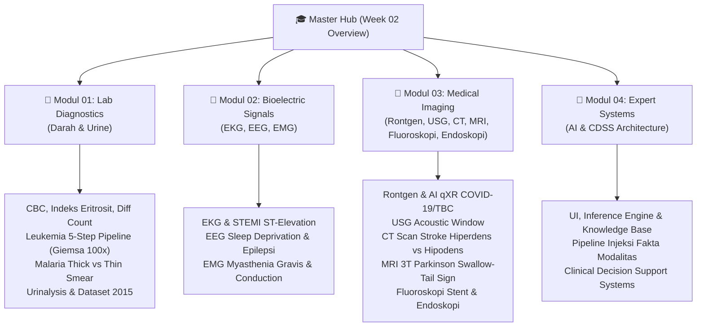

# 🎓 Week 02 Overview: Modalitas Diagnostik & Akuisisi Data Biomedis

> [!info] **Course Overview:** [[Semester 5 Prep]] | **Syllabus:** **Biomedical Computing**
> **Topics Covered:** Laboratorium Klinik (Darah & Urine), Sinyal Bioelektrik (EKG, EEG, EMG), Pencitraan Medis 2D/3D (Rontgen, USG, CT Scan, MRI 3T, Fluoroskopi, Endoskopi), dan Sistem Pakar Biomedik (Expert Systems & CDSS).

---

## 📌 1. Executive Overview & Core Context

Penyelenggaraan **Komputasi Biomedik** pada dasarnya bergantung pada kualitas dan karakteristik **akuisisi data mentah biomedis** (*raw biomedical data acquisition*) yang ditransformasikan dari fenotipe fisiologis pasien. Data medis diklasifikasikan berdasarkan domain fisika dan sifat matematisnya:

1. **Data Biokimia & Seluler (1D Tabular / 2D Digital Pathology):** Mengukur parameter kuantitatif sel dan zat kimia cair (darah & urine) serta citra mikroskopis sediaan selular.
2. **Sinyal Bioelektrik (1D Time Series):** Perekaman kontinu grafik tegangan terhadap waktu ($V(t)$) dari kelistrikan sel yang terangsang (*excitable cells*) pada organ jantung, otak, dan otot.
3. **Pencitraan Medis & Intervensi Real-Time (2D/3D Spatial & Video):** Perekaman representasi spasial internal tubuh menggunakan radiasi pengion (Sinar-X), gelombang akustik (USG), medan magnetik tinggi (MRI 3T), atau optik serat (Endoskopi).
4. **Sistem Pakar Integratif (AI Decision Support):** Mengintegrasikan fakta spasial/sinyal/tabular ke dalam *Inference Engine* dan *Knowledge Base* untuk menghasilkan diagnostik otomatis.

---

## 🗺️ 2. Navigasi Modul Pembelajaran (Modular Suite)

Materi Pertemuan ke-2 dipecah secara terstruktur ke dalam **4 Berkas Modul**

### 📄 [[01_Lab_Diagnostics_Blood_Urine|Modul 01: Pemeriksaan Darah & Urine (Lab Diagnostics)]]
- **Fokus Utama:** Parameter Hematologi Darah Lengkap (CBC), Indeks Eritrosit (MCV, MCH, MCHC), WBC Differential Count, dan analisis urinalisis lengkap.
- **Sorotan Komputasi:** Pipeline 5-tahap pembuatan citra apusan darah leukemia (sudut $30^\circ-45^\circ$ *monolayer*, Giemsa, mikroskop 100x *oil immersion*), pembedaan visual ALL vs AML, komparasi apusan malaria tebal vs tipis, dan dataset spesimen urine 12 Maret 2015.

### 📄 [[02_Bioelectric_Signals_ECG_EEG_EMG|Modul 02: Sinyal Bioelektrik (EKG, EEG, EMG)]]
- **Fokus Utama:** Elektrofisiologi jantung (EKG), korteks otak (EEG), serta sistem saraf tepi & neuromuscular junction (EMG).
- **Sorotan Komputasi:** Elemen gelombang P-QRS-T dan indikator STEMI pada EKG; *Sleep Deprivation Protocol* (begadang) dan pembedaan *True Seizure* vs *Pseudoseizure* pada EEG; serta larangan edema jaringan dan respons dekrementil ($> 10\%$) pada Myasthenia Gravis pada EMG.

### 📄 [[03_Medical_Imaging_Radiology|Modul 03: Pencitraan Medis & Intervensi (Medical Imaging & Radiology)]]
- **Fokus Utama:** Modalitas pencitraan radiologi berbasis pengion (Rontgen, CT Scan, Fluoroskopi), akustik (USG), magnetik (MRI 3T), dan optik direct (Endoskopi).
- **Sorotan Komputasi:** Fitur AI qXR pada Foto Rontgen COVID-19/TBC; *Acoustic Window* USG; CT Scan Otak Pendarahan (Hiperdens/Putih) vs Stroke Infark (Hipodens/Gelap); Hilangnya **"Swallow-Tail Sign"** pada MRI 3T Parkinson; Arteriografi koroner Fluoroskopi; dan inspeksi Endoskopi.

### 📄 [[04_Biomedical_Expert_Systems|Modul 04: Sistem Pakar & Kecerdasan Buatan Biomedik (Expert Systems)]]
- **Fokus Utama:** Arsitektur Sistem Pakar Medis (*Clinical Decision Support Systems* / CDSS).
- **Sorotan Komputasi:** Alur interaksi `User Interface` $\rightarrow$ `Inference Engine` $\leftrightarrow$ `Knowledge Base` (dirumuskan oleh *Knowledge Engineer* dari *Human Expert* / Dokter Spesialis) $\rightarrow$ `Advice`, serta matriks integrasi saluran modalitas biomedis ke dalam mesin penalaran AI.

---

## 📊 3. Matriks Komparatif Seluruh Modalitas Diagnostik Biomedis

| Modalitas Medis | Jenis Sinyal / Data | Prinsip Fisika / Bio-Fenomena | Indikasi & Fitur Patognomonik Utama | Format Data AI / Machine Learning |
| :--- | :--- | :--- | :--- | :--- |
| **CBC (Darah Lengkap)** | 1D Tabular Kuantitatif | Impedansi Coulter / Laser Flow Cytometry | Anemia (MCV/MCH), Leukemia (WBC/PLT), Infeksi (Diff Count) | Vektor Fitur Tabular ($X \in \mathbb{R}^{d}$) |
| **Apusan Darah Digital**| 2D RGB Digital Pathology | Absorpsi pewarnaan Giemsa mikroskop 100x | Sel Blast ALL vs AML (Auer Rods), Parasit Malaria (Ring/Skizon) | Patch Citra ($224 \times 224$ PNG/TIFF), CNN |
| **Urinalysis (Urine)** | 1D Tabular & Citra Sedimen | Reaksi Reagen Dipstick & Sentrifugasi | Glukosuria ($>1000\text{ mg/dL}$), Bilirubinuria, Piuria, Casts | Fitur Kategori/Tabular & Citra Sedimen |
| **EKG (ECG)** | 1D Time Series Sinyal | Biopotensial listrik jantung ($0.05-100\text{ Hz}$) | STEMI (ST Elevation $\ge 1\text{ mm}$), Aritmia, Interval QT | Sinyal Waktu $V(t)$, FFT, Wavelet, LSTM |
| **EEG** | 1D Multi-channel Series | Biopotensial neuron kortikal ($\mu\text{V}, 0.5-50\text{ Hz}$) | Epilepsi (*Spike-and-Wave*), PNES, Sleep Disorders | Time-Frequency Spectrogram, Wavelet, GNN |
| **EMG** | 1D Sinyal Bioelektrik | Biopotensial unit motorik otot ($10-500\text{ Hz}$) | Myasthenia Gravis (Dekrementil RNS $>10\%$), Neuropati, HNP | Power Spectral Density (PSD), RMS, SVM/CNN |
| **Foto Rontgen** | 2D Spatial Radiografi | Atenuasi foton Sinar-X (Hukum Beer-Lambert) | Pneumonia, TBC (Kavitas), Fraktur, qXR COVID-19 | Citra DICOM 16-bit Grayscale, U-Net, ResNet |
| **USG** | 2D Real-time Acoustic | Refleksi gelombang akustik ($2-18\text{ MHz}$) | Organ Abdomen, Janin, Jendela Akustik Kandung Kemih | Citra/Video Ultrasound B-Mode, Real-time CNN |
| **CT Scan** | 2D/3D Cross-sectional | Rotasi $360^\circ$ Sinar-X, Skala Hounsfield (HU) | Stroke Pendarahan (Hiperdens) vs Stroke Infark (Hipodens) | Volume DICOM 3D ($512 \times 512 \times Z$), 3D CNN |
| **MRI (3 Tesla)** | 2D/3D Multi-planar | Presesi Larmor magnetik $3.0\text{ T}$ & pulsa RF | Parkinson (Hilang penanda *Swallow-Tail Sign* Nigrosome-1) | Citra $T_1/T_2/FLAIR$ DICOM, Vision Transformers |
| **Fluoroskopi** | 2D Real-time Video X-Ray| Sinar-X kontinu dosis rendah + Zat Kontras | Arteriografi Koroner, Multi-vessel Stenosis, Panduan Stent | Streaming Video Radiografi, Tracking Model |
| **Endoskopi** | 2D Video Optik Direct | Serat optik & kamera CCD/CMOS organ berongga | Gastritis, Tukak Lambung, GERD, Kanker Lambung | Frame Video RGB High-Definition, YOLO/Segmentasi |
| **Expert System** | Decision Rules / Graph | Penalaran inferensi logika (*Forward/Backward*) | Sistem Pendukung Keputusan Klinis (CDSS) / Diagnostik | Knowledge Graph, Production Rules ($IF-THEN$) |

---

## 🔗 4. Promosi Konsep Abadi (`20 Brain Atlas/20 Concepts/`)

Catatan suite minggu ke-2 ini menghasilkan 5 kandidat konsep abadi yang layak dipromosikan ke basis pengetahuan permanen `20 Brain Atlas/20 Concepts/`:

- `Complete Blood Count`: Fundamental biosinyal kuantitatif hematologi.
- `Electroencephalography`: Konsep utama neurofisiologi dan analisis sinyal kortikal.
- `Electromyography`: Fundamental konduksi saraf dan kelainan neuromuskular.
- `Swallow-Tail Sign`: Biomarker neuro-imaging spesifik untuk diagnosis Parkinson pada MRI 3T.
- `Biomedical Expert System`: Konsep fundamental sistem pendukung keputusan klinis (CDSS) berbasis AI.

---

## 🔗 Referensi Berkas Sumber

- Document Source: **biocomp-pertemuan-2**
- Course Directory: `10 Spaces/11 College/Biomedical_Computing/Week_02_Diagnostic_Modalities_Data_Acquisition/`
