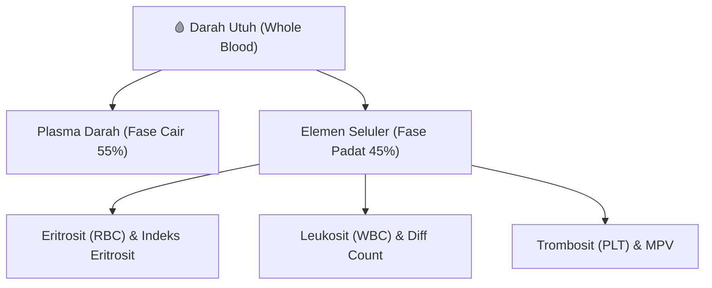
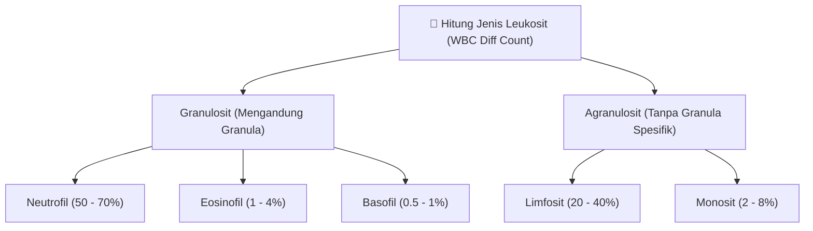
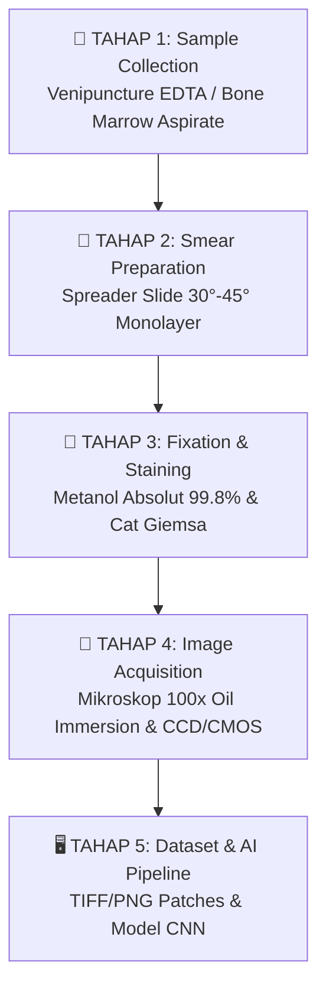
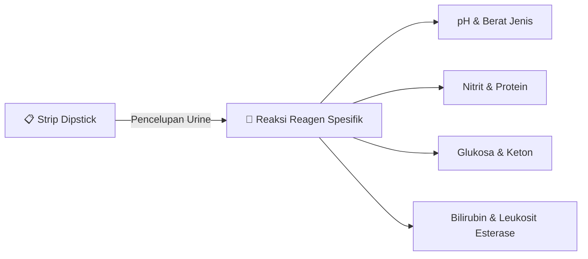

# Pemeriksaan Darah & Urine (Lab Diagnostics)

Pemeriksaan laboratorium kuantitatif pada sampel darah dan urine merupakan modalitas diagnostik awal paling vital dalam pelayanan kesehatan modern, yang mentransformasikan fenotipe biologis pasien menjadi data numerik, matriks parameter, dan citra mikroskopis beresolusi tinggi. Dalam konteks **Komputasi Biomedik**, data hasil **Complete Blood Count** (CBC), sediaan apusan darah tepi, tes molekuler/serologi malaria, serta analisis fisik-kimia-mikroskopis **Urinalysis** berfungsi sebagai input mentah (*raw feature vectors*) untuk pemrosesan sinyal biologis, algoritma pencitraan digital (*digital pathology*), penambangan data klinis (*clinical data mining*), dan pengembangan sistem pendukung keputusan klinis berbasis **Kecerdasan Buatan**. Catatan ini menyajikan pembahasan komprehensif mengenai parameter hematologi, alur akuisisi pencitraan leukemia 5-tahap, komparasi diagnosis malaria, serta evaluasi urinalisis lengkap beserta implikasi klinis dan komputasionalnya.

---

## 1. Pemeriksaan Darah Lengkap (Complete Blood Count / CBC / PDL)

**Complete Blood Count** (CBC) atau **Pemeriksaan Darah Lengkap (PDL)** adalah prosedur laboratorium standar untuk mengevaluasi secara kuantitatif dan kualitatif komponen seluler yang tersuspensi di dalam plasma darah.

Selain komponen seluler, pemeriksaan darah penunjang secara umum juga memantau:
- **Zat Kimia Darah**: Gula darah (glukosa), kolesterol, asam urat, zat besi, dan elektrolit ($\text{Na}^+, \text{K}^+, \text{Cl}^-$).
- **Analisis Gas Darah (AGD)**: Mengukur $pO_2, pCO_2, \text{pH}$, dan bikarbonat ($\text{HCO}_3^-$).
- **Fungsi Organ Spesifik**: Evaluasi fungsi ginjal (ureum/kreatinin), hati (SGOT/SGPT), pankreas (amilase/lipase), empedu (bilirubin), dan kelenjar tiroid (T3/T4/TSH).
- **Tumor Marker**: Biomarker spesifik untuk deteksi keganasan.

> [!NOTE]
> **Dasar Biosinyal & Data**: Dalam pengujian hematologi otomatis (*Automated Hematology Analyzer*), sel-sel darah dihitung menggunakan prinsip **Coulter Impedance** (perubahan hambatan listrik saat sel melewati celah mikro) atau **Flow Cytometry** berbasis hamburan cahaya laser (*light scattering*).
> 
> *Catatan Persiapan Pasien*: Sebelum pengambilan sampel darah, pasien harus berkonsultasi dengan dokter mengenai instruksi puasa ($8-12\text{ jam}$) dan penghentian obat-obatan tertentu.



---

### A. Sel Darah Merah (Eritrosit) & Indeks Eritrosit

Eritrosit berfungsi sebagai transpor oksigen dari paru-paru ke jaringan tubuh via molekul **Hemoglobin**. Parameter eritrosit memberikan profil morfologis yang sangat sensitif terhadap gangguan metabolik dan nutrisional.

1. **Hemoglobin (Hb)**: Protein tetramer kaya zat besi yang mengikat $O_2$. Diukur dalam satuan $g/dL$. Penurunan kadar Hb secara signifikan mengindikasikan kondisi anemia.
2. **Hematokrit (Ht / PCV - Packed Cell Volume)**: Persentase volume sel darah merah terhadap total volume darah utuh. Diukur dalam persentase ($\%$).
   $$\text{Ht} = \frac{V_{\text{RBC}}}{V_{\text{total}}} \times 100\%$$
3. **Jumlah Eritrosit (RBC Count)**: Total konsentrasi sel darah merah per unit volume darah, diukur dalam satuan $10^6/\mu L$ (atau $10^{12}/L$).

#### Indeks Eritrosit (Erythrocyte Indices)
Indeks eritrosit dihitung secara matematis dari nilai Hb, Ht, dan RBC untuk mengklasifikasikan etiologi anemia secara kualitatif berdasarkan ukuran sel dan konsentrasi hemoglobin.

- **Mean Corpuscular Volume (MCV)**: Mengukur volume atau ukuran rata-rata dari satu sel eritrosit. Satuan diukur dalam **femtoliter** ($1\text{ fL} = 10^{-15}\text{ L}$).
  $$\text{MCV} = \frac{\text{Ht } (\%) \times 10}{\text{RBC } (10^6/\mu L)}$$
  - **Mikrositik** ($\text{MCV} < 80\text{ fL}$): Ukuran eritrosit lebih kecil dari normal (misal: Anemia Defisiensi Besi, Thalassemia).
  - **Normositik** ($80 \le \text{MCV} \le 100\text{ fL}$): Ukuran eritrosit normal (misal: Anemia Akibat Perdarahan Akut, Anemia Penyakit Kronis).
  - **Makrositik** ($\text{MCV} > 100\text{ fL}$): Ukuran eritrosit lebih besar dari normal (misal: Anemia Defisiensi Vitamin B12 / Asam Folat).

- **Mean Corpuscular Hemoglobin (MCH)**: Mengukur massa atau bobot rata-rata hemoglobin di dalam satu sel eritrosit. Satuan diukur dalam **pikogram** ($1\text{ pg} = 10^{-12}\text{ g}$).
  $$\text{MCH} = \frac{\text{Hb } (g/dL) \times 10}{\text{RBC } (10^6/\mu L)}$$
  - **Hipokromik** ($\text{MCH} < 27\text{ pg}$): Warna eritrosit tampak pucat karena kekurangan Hb.
  - **Normokromik** ($27 \le \text{MCH} \le 32\text{ pg}$): Konsentrasi Hb per sel dalam batas normal.

- **Mean Corpuscular Hemoglobin Concentration (MCHC)**: Mengukur konsentrasi rata-rata hemoglobin dalam suatu volume eritrosit yang dipadatkan (bukan per sel tunggal). Satuan diukur dalam $g/dL$ atau persentase ($\%$).
  $$\text{MCHC} = \frac{\text{Hb } (g/dL) \times 100}{\text{Ht } (\%)} = \frac{\text{MCH}}{\text{MCV}} \times 100$$
  - Rentang normal MCHC berkisar antara $32 - 36\text{ g/dL}$. Nilai MCHC yang sangat tinggi amat jarang terjadi secara fisiologis dan sering mengindikasikan adanya sferositosis herediter atau *cold agglutinin artifacts* pada penganalisis otomatis.

---

### B. Sel Darah Putih (Leukosit) & WBC Differential Count

**Leukosit** adalah unit pertahanan imunitas tubuh terhadap agen patogen, benda asing, dan transformasi sel keganasan.

1. **Jumlah Leukosit Total (WBC Count)**: Total sel darah putih dalam satuan $10^3/\mu L$ (normal: $4.0 - 11.0 \times 10^3/\mu L$).
   - **Leukositosis** ($\text{WBC} > 11.0 \times 10^3/\mu L$): Mengindikasikan infeksi bakteri akut, respon inflamasi sistemik, nekrosis jaringan, atau neoplasma hematologi (**Leukemia**).
   - **Leukopenia** ($\text{WBC} < 4.0 \times 10^3/\mu L$): Mengindikasikan supresi sumsum tulang, infeksi berat (sepsis berat/tifoid), infeksi virus (DHF, HIV), atau efek kemoterapi.

2. **Hitung Jenis Leukosit (WBC Differential Count)**: Rincian proporsi relatif ($\%$) atau absolut ($/\mu L$) dari 5 subtipe leukosit utama:



- **Neutrofil** ($50 - 70\%$): Granulosit bertiup multipel (polimorfonuklear/PMN). Berfungsi sebagai lini pertama fasilitator fagositosis terhadap infeksi bakteri akut.
  - *Shift to the left* (pergeseran ke kiri): Peningkatan bentuk neutrofil muda (*band/batang*) yang mengindikasikan infeksi bakteri berat atau krisis imunitas.
- **Limfosit** ($20 - 40\%$): Agranulosit berinti bulat padat. Berperan dalam sistem imunitas adaptif:
  - **Sel T**: Imunitas seluler (*cell-mediated immunity*).
  - **Sel B**: Produksi antibodi humoral.
  - **Sel NK (Natural Killer)**: Lisis sel terinfeksi virus dan sel kanker.
  - Peningkatan limfosit (**Limfositosis**) dominan pada infeksi virus (seperti mononukleosis, hepatitis, campak) atau leukemia limfositik.
- **Monosit** ($2 - 8\%$): Leukosit terbesar dengan inti berbentuk ginjal/biji kacang. Berada di darah perifer sebelum bermigrasi ke jaringan untuk berdiferensiasi menjadi **makrofag** dan sel dendritik yang membersihkan debris seluler serta antigen patogen.
- **Eosinofil** ($1 - 4\%$): Granulosit berinti dua lobus dengan granula kemerahan/oranye. Berperan dalam destruksi parasit bermultiselular (seperti cacing/helminths) dan modulasi reaksi alergi atau asma bronkial.
- **Basofil** ($0.5 - 1\%$): Granulosit paling langka dengan granula biru-tua kehitaman penutup inti. Mengandung **histamin** dan **heparin** yang memicu vasodilatasi dan peradangan pada reaksi anafilaksis.

---

### C. Trombosit & Parameter Tambahan

1. **Jumlah Trombosit (Platelet Count / PLT)**: Keping darah tanpa inti berukuran $2 - 4\text{ }\mu m$ (normal: $150 - 450 \times 10^3/\mu L$). Berperan utama pada proses hemostasis primer, pembentukan *platelet plug*, dan akumulasi faktor pembekuan darah.
   - **Trombositopenia** ($\text{PLT} < 150 \times 10^3/\mu L$): Berisiko memicu pendarahan spontan, petekie, dan ekimosis (misal pada DBD/DHF, ITP, atau leukemia).
   - **Trombositosis** ($\text{PLT} > 450 \times 10^3/\mu L$): Berisiko memicu trombosis intravascular (misal pada sindrom mieloproliferatif atau respon fase akut).
2. **Mean Platelet Volume (MPV)**: Ukuran rata-rata trombosit dalam femtoliter ($fL$). MPV tinggi menandakan ditemukannya trombosit muda berukuran besar (*giant platelets*) yang dilepaskan secara cepat oleh sumsum tulang sebagai respon terhadap destruksi trombosit perifer.
3. **Laju Endap Darah (LED / Erythrocyte Sedimentation Rate - ESR)**: Mengukur kecepatan presipitasi eritrosit mengendap di dasar tabung standar (Westergren/Wintrobe) dalam satuan $mm/\text{jam}$.
   - Mekanisme: Dipengaruhi oleh terbentuknya *rouleaux* (tumpukan eritrosit). Protein fase akut seperti **fibrinogen** dan **globulin** neutralisasi muatan negatif eritrosit (potensial Zeta), mempercepat laju pengendapan. LED merupakan indikator non-spesifik adanya inflamasi, infeksi kronis, atau penyakit autoimun.

---

### D. Tabel Ringkasan Parameter Darah Lengkap (CBC)

| Parameter | Nama Lengkap | Nilai Rujukan Standar | Satuan | Implikasi Klinis Utama | Indikator Komputasi / ML |
| :--- | :--- | :--- | :--- | :--- | :--- |
| **Hb** | Hemoglobin | $13.5 - 17.5$ (Pria)<br>$12.0 - 15.5$ (Wanita) | $g/dL$ | Anemia ($<12$), Polisitemia ($>18$) | Fitur kontinua prediksi kapasitas oksigen |
| **Ht** | Hematokrit | $41 - 50\%$ (Pria)<br>$36 - 48\%$ (Wanita) | $\%$ | Dehidrasi (tinggi), Perdarahan (rendah) | Rasio hemokonsentrasi |
| **RBC** | Red Blood Cell Count | $4.5 - 5.9 \times 10^6$ (Pria)<br>$4.1 - 5.1 \times 10^6$ (Wanita) | $/\mu L$ | Evaluasi eritropoiesis | Fitur kontras ukuran populasi sel |
| **MCV** | Mean Corpuscular Volume | $80 - 100$ | $fL$ | Anemia Mikrositik / Makrositik | Fitur penentu klastering jenis anemia |
| **MCH** | Mean Corpuscular Hemoglobin | $27 - 32$ | $pg$ | Anemia Hipokromik | Fitur rasio massa selular |
| **MCHC**| Mean Corpuscular Hb Conc.| $32 - 36$ | $g/dL$ | Sferositosis, Kerusakan Membran | Fitur validasi error instrumen |
| **WBC** | White Blood Cell Count | $4.0 - 11.0 \times 10^3$ | $/\mu L$ | Infeksi, Inflammation, Leukemia | Fitur utama deteksi respons imun |
| **Neutrofil**| Neutrophil Relative | $50 - 70\%$ | $\%$ | Infeksi Bakteri Akut | Rasio Neutrofil-ke-Limfosit (NLR) |
| **Limfosit**| Lymphocyte Relative | $20 - 40\%$ | $\%$ | Infeksi Virus, ALL | Biomarker inflamasi sistemik |
| **Monosit** | Monocyte Relative | $2 - 8\%$ | $\%$ | Infeksi Kronis, Fagositosis | Penanda inflamasi progresif |
| **Eosinofil**| Eosinophil Relative | $1 - 4\%$ | $\%$ | Alergi, Infeksi Parasit | Klasifikasi atopik |
| **Basofil** | Basophil Relative | $0.5 - 1\%$ | $\%$ | Reaksi Anafilaksis, CML | Penanda pro-inflamasi |
| **PLT** | Platelet Count | $150 - 450 \times 10^3$ | $/\mu L$ | Trombositopenia, Risiko Perdarahan| Fitur kaskade hemostasis |
| **MPV** | Mean Platelet Volume | $7.5 - 11.5$ | $fL$ | Trombopoiesis sumsum tulang | Indikator turnover trombosit |
| **LED** | Laju Endap Darah | $0 - 15$ (Pria)<br>$0 - 20$ (Wanita) | $mm/\text{jam}$| Inflamasi Sistemik Non-spesifik | Fitur penanda reaksi fase akut |

---

## 2. Pipeline Pembuatan Citra Darah & Diagnosis Leukemia

**Leukemia** adalah keganasan hematologi yang ditandai oleh proliferasi tidak terkontrol dari sel-sel hematopoietik abnormal (sel *blast* prekursor) di dalam sumsum tulang yang kemudian terkonflikasi melimpah ke sirkulasi darah tepi.

> [!IMPORTANT]
> **Profil CBC pada Diagnosis Leukemia**:
> 1. **Hiperleukositosis** (WBC melonjak ekstrim $> 50.000/\mu L$ hingga $> 100.000/\mu L$) atau kadang leukopenia akibat kegagalan pelepasan sel matang.
> 2. **Anemia Berat** ($Hb < 8\text{ g/dL}$) akibat impaksi desakan (*crowding out*) populasi sel blast yang menekan garis keturunan eritroid.
> 3. **Trombositopenia Berat** ($\text{PLT} < 20.000 - 50.000/\mu L$), memicu perdarahan mukosa dan petekie.

---

### Pipeline 5 Tahap Pengolahan & Akuisisi Citra Darah

Untuk analisis kuantitatif berakurasi tinggi berbasis **Computer Vision** dan **Machine Learning**, pembuatan citra digital apusan darah harus mengikuti kriteria preparasi sitomorfologis standar sebagai berikut:



#### Tahap 1: Pengambilan Sampel Pasien (Sample Collection)
- **Darah Tepi (Peripheral Blood)**: Diambil via pencoblosan pembuluh darah vena (*venipuncture*) menggunakan jarum steril dan ditampung dalam tabung vakum ber-antikoagulan **EDTA (Ethylenediaminetetraacetic acid)**. EDTA mengkelat kalsium ($Ca^{2+}$) untuk mencegah pembekuan darah tanpa merusak morfologi selular leukosit.
- **Aspirasi Sumsum Tulang (Bone Marrow Aspirate)**: Dilakukan pengambilan spesimen jaringan cair dari rongga medula tulang panggul (*iliac crest*) menggunakan spuit khusus. Ini merupakan *gold standard* untuk mengevaluasi secara langsung persentase sel prekursor immature (*blast count*) pada pusat hematopoiesis.

#### Tahap 2: Pembuatan Sediaan Apusan (Blood Smear Preparation)
- Satu tetes darah kecil ($\approx 5 - 10\text{ }\mu L$) diletakkan dekat batas tepi kaca objek steril (*glass slide*).
- Kaca pendorong (*spreader slide*) diposisikan menyentuh tetesan darah dengan sudut kemiringan konstan $30^\circ - 45^\circ$.
- Darah dibiarkan menyebar di sepanjang garis kontak *spreader slide*, kemudian didorong maju dengan kecepatan dan tekanan yang halus dan konstan.
- Hasil dorongan membentuk apusan berbentuk lidah dengan area **monolayer** (lapisan setebal satu sel tunggal di mana sel-sel darah merah tidak saling bertumpuk). Sediaan kemudian dikeringkan di udara terbuka (*air-drying*).

#### Tahap 3: Fiksasi dan Pewarnaan (Fixation & Staining)
- **Fiksasi**: Sediaan apusan direndam dalam larutan **metanol absolut (99.8%)** selama $3 - 5\text{ menit}$. Fiksasi ini menghentikan proses autolisis, mendenaturasi protein secara presisi, dan merekatkan sel-sel darah pada permukaan kaca objek agar tidak terlepas saat pencucian.
- **Pewarnaan Hematologi (Giemsa / Wright-Giemsa)**:
  - Zat warna asam (**Eosin**) mewarnai komponen alkalis/basa seperti hemoglobin dan granula eosinofilik menjadi merah muda/oranye.
  - Zat warna basa (**Azur B / Metilen Biru**) mengikat asam nukleat (DNA/RNA) pada inti sel dan granula basofilik, memberikan warna ungu-kebiruan yang intens.
  - Kontras warna ini krusial untuk memisahkan batas jaringan inti (*nucleus*) dan sitoplasma (*cytoplasm*) pada pemrosesan citra digital.

#### Tahap 4: Akuisisi Citra Mikroskopis (Image Acquisition)
- **Peralatan**: Sediaan diletakkan pada stage mikroskop cahaya digital berdaya tinggi (*brightfield microscopy*) atau alat pemindai sediaan digital (*Digital Pathology Whole Slide Scanner / WSI*).
- **Perbesaran & Imersi**: Pengamatan sel darah leukemia membutuhkan detail resolusi tinggi pada struktur internal inti sel, sehingga menggunakan lensa objektif **40x** (skrining) dan **100x** dengan **minyak imersi (oil immersion)**.
  - *Prinsip Imersi*: Minyak imersi memiliki indeks bias ($n \approx 1.518$) yang setara dengan kaca slide, mencegah refraksi/pembelokan cahaya di udara sehingga *Numerical Aperture* (NA) maksimal tercapai dan resolusi citra meningkat dramatis.
- **Sensor Digital**: Citra ditangkap menggunakan kamera digital berbasis sensor **CCD (Charge-Coupled Device)** atau **CMOS** beresolusi tinggi dengan pencahayaan LED yang terkalibrasi warna (*white balance*).

#### Tahap 5: Pembentukan Dataset Citra Digital
- Citra digital disimpan dalam format *lossless* atau kompresi minimal beresolusi tinggi (TIFF, PNG, JPEG2000).
- **Pra-pemrosesan Data AI**: Citra sediaan apusan dipotong menjadi *single-cell patches* (misal ukuran $224 \times 224$ atau $512 \times 512$ piksel), dilakukan normalisasi warna (*color normalization*), dan di-anotasi oleh Dokter Spesialis Patologi Klinik. Dataset ter-anotasi ini siap digunakan untuk pelatihan model **Machine Learning** / Convolutional Neural Networks (CNN) untuk tugas segmentasi sel dan klasifikasi jenis leukemia.

---

### Perbedaan Morfologi Visual Sediaan Citra Darah

![[diagram_college_biocomp_leukemia_morphology.webp]]

| Parameter Morfologi | Darah Normal (Sehat) | Leukemia ALL (Acute Lymphoblastic) | Leukemia AML (Acute Myeloblastic) |
| :--- | :--- | :--- | :--- |
| **Dominasi Sel** | Eritrosit diskus bikonkaf seragam, leukosit matang berimbang. | Kelimpahan sel **Lymphoblast** (sel prekursor limfoid immature). | Kelimpahan sel **Myeloblast** (sel prekursor mieloid immature). |
| **Ukuran Sel** | Sel darah putih matang: $10 - 15\text{ }\mu m$. | Berukuran kecil hingga sedang ($10 - 20\text{ }\mu m$). | Berukuran besar ($15 - 25\text{ }\mu m$), batas sel lebih tegas. |
| **Inti Sel (Nucleus)**| Inti sel terfragmentasi berlobus (PMN) atau bundar padat matang. | Inti sangat besar memadati sel, kromatin halus terdistribusi homogen. | Inti sel besar berlekuk/oval, membran inti terlihat sangat jelas. |
| **N:C Ratio** | Rendah hingga Sedang (volume sitoplasma cukup luas). | **Sangat Tinggi (High N:C Ratio)**; sitoplasma terdesak menjadi garis tipis di tepi. | Sedang hingga Tinggi; sitoplasma lebih luas dibanding ALL. |
| **Nukleoli (Anak Inti)**| Tidak tampak atau samar pada leukosit matang. | Tidak tampak jelas atau hanya 1-2 anak inti samar. | **Tampak sangat jelas (2 - 5 nukleoli)** di dalam struktur inti. |
| **Ciri Patognomonik** | Tidak ada bentuk atipikal. | Sel blast homogen tanpa granulasi sitoplasma. | Ditemukan **Auer Rods** (garis kristal merah-keunguan tajam di sitoplasma). |

> [!TIP]
> **Metode Lanjutan Diagnostik Leukemia & Anemia**:
> 1. **Flow Cytometry (Imunofenotipe)**: Analisis sinar laser terhadap marker antigen permukaan sel untuk membedakan lineage limfoid vs mieloid.
> 2. **Pemeriksaan Genetik & Sitogenetik**: Analisis DNA/kromosom untuk menemukan translokasi abnormal, seperti **Kromosom Philadelphia** (fusi gen `BCR-ABL1` pada $t(9;22)$) khas **Chronic Myeloid Leukemia (CML)**.
> 3. **Indikator Apusan Darah Anemia**: Pada sediaan apusan anemia, ditemukan komponen morfologis spesifik seperti limfosit, **eritroblast** (prekursor RBC berinti), **sel target** (*target cells/codocytes*), **mikrositik**, dan fragmentasi sel kecil (*small fragments/schistocytes*).

---

## 3. Diagnostik Laboratorium Malaria

**Malaria** adalah penyakit infeksi sistemik yang disebabkan oleh protozoa genus *Plasmodium* (seperti *P. falciparum, P. vivax, P. malariae, P. ovale, P. knowlesi*) yang ditularkan melalui gigitan nyamuk *Anopheles* betina. Protozoa ini menginvasi dan merusak sel darah merah secara siklik.

---

### A. Gold Standard: Mikroskopis Apusan Darah (Tebal vs Tipis)

Pemeriksaan mikroskopis apusan darah tepi dengan pewarnaan Giemsa tetap menjadi **Gold Standard** (standar emas) internasional untuk diagnosis malaria.

```
                                  +-----------------------------------+
                                  |    APUSAN DARAH TEPI MALARIA      |
                                  +-----------------+-----------------+
                                                    |
                 +----------------------------------+----------------------------------+
                 |                                                                     |
      +----------v----------+                                               +----------v----------+
      |  APUSAN DARAH TEBAL |                                               |  APUSAN DARAH TIPIS |
      |  (THICK BLOOD SMEAR)|                                               |  (THIN BLOOD SMEAR) |
      +----------+----------+                                               +----------+----------+
                 |                                                                     |
      +----------v----------+                                               +----------v----------+
      |   FUNGSI UTAMA:     |                                               |   FUNGSI UTAMA:     |
      |   Skrining Cepat &  |                                               |  Identifikasi Spesies|
      | Deteksi Parasitemia |                                               | & Kepadatan Parasit |
      |    Sensitivitas High|                                               | (Monolayer Intact)  |
      +---------------------+                                               +---------------------+
```

| Parameter Evaluasi | Apusan Darah Tebal (*Thick Blood Smear*) | Apusan Darah Tipis (*Thin Blood Smear*) |
| :--- | :--- | :--- |
| **Fungsi Utama** | **Skrining / Deteksi Awal**: Menentukan ada/tidaknya parasit malaria dalam sediaan darah (*Parasite Detection*). | **Identifikasi Spesies & Morfologi**: Menentukan spesies *Plasmodium* dan menghitung kepadatan parasit (*Parasite Density*). |
| **Volume Darah** | Menggunakan volume darah lebih banyak ($2 - 3$ tetes darah ditumpuk $\approx 10\text{ }\mu L$). | Menggunakan 1 tetes darah kecil ($\approx 2 - 3\text{ }\mu L$) yang diusap membentuk monolayer. |
| **Kondisi Eritrosit** | **Hemolisis Akibat Dehemoglobinisasi**: Eritrosit sengaja di-lisiskan saat pewarnaan tanpa fiksasi metanol. | **Eritrosit Utuh (Intact Monolayer)**: Sediaan difiksasi metanol terlebih dahulu sehingga struktur eritrosit tetap utuh. |
| **Sensitivitas** | **Sangat Tinggi ($11 - 20 \times$ lebih sensitif)** dibanding apusan tipis. Mampu mendeteksi parasitemia tingkat sangat rendah ($< 10\text{ parasit}/\mu L$). | **Sedang / Kuantitatif**: Lebih sulit menemukan parasit jika konsentrasinya rendah, tetapi memberikan struktur visual morfologi parasit di dalam eritrosit. |
| **Analisis Citra AI** | Ideal untuk tugas deteksi keberadaan obyek (*Object Detection/Binary Classification*). | Ideal untuk tugas klasifikasi multi-kelas (*Species Classification*) dan pengukuran fitur luas area parasit. |

---

### B. Rapid Diagnostic Test (RDT) Malaria

RDT malaria adalah uji imunokromatografi cepat menggunakan sampel darah kapiler dari pencoblosan ujung jari.

- **Prinsip Kerja**: Memanfaatkan membran nitroselulosa yang dilapisi antibodi monoklonal untuk menangkap antigen spesifik parasit malaria.
- **Target Antigen**:
  1. **Histidine-Rich Protein II (HRP-2)**: Protein berlimpah yang disekresikan secara spesifik oleh *Plasmodium falciparum*.
  2. **Parasite Lactate Dehydrogenase (pLDH)** atau **Aldolase**: Enzim metabolik esensial parasit yang ditemukan pada seluruh spesies malaria (*Pan-malaria antigen*).
- **Keunggulan & Keterbatasan**: Menyajikan hasil dalam waktu $15 - 20\text{ menit}$ tanpa memerlukan peralatan mikroskop. Sangat ideal untuk skrining lapangan di daerah terpencil. Namun, RDT HRP-2 dapat memberikan hasil positif palsu pasca-pengobatan karena antigen masih bertahan di darah beberapa minggu setelah parasit mati.

---

### C. Polymerase Chain Reaction (PCR) Malaria

PCR adalah teknik amplifikasi asam nukleat berbasis molekuler untuk mendeteksi DNA gen 18S rRNA dari *Plasmodium*.
- **Sensitivitas & Spesifisitas**: Paling tinggi di antara seluruh modalitas diagnostik (mampu mendeteksi parasitemia hingga $< 1 - 5\text{ parasit}/\mu L$).
- **Indikasi**: Digunakan untuk konfirmasi infeksi campuran (*mixed infections*), verifikasi spesies yang sulit diidentifikasi secara mikroskopis, serta riset epidemiologi dan pengujian subklinis.

---

### D. Indikator Tambahan pada Darah Lengkap (CBC)

Meskipun CBC tidak mengisolasi parasit secara spesifik, pola biomarker berikut sangat memperkuat kecurigaan klinis malaria:
1. **Trombositopenia Signifikan** ($\text{PLT} < 100 \times 10^3/\mu L$): Terjadi pada $> 80\%$ penderita malaria akibat sekuestrasi trombosit di organ limpa dan destruksi imunologis.
2. **Anemia Hemolitik**: Penurunan signifikan kadar Hemoglobin ($Hb$) dan Eritrosit ($RBC$) akibat lisis eritrosit yang diinduksi oleh pelepasan merozoit secara periodik.

---

## 4. Pemeriksaan Urine (Urinalysis)

**Urinalysis** (pemeriksaan urine) adalah analisis spesimen cairan yang diekskresikan oleh ginjal. Modalitas diagnostik ini memberikan informasi non-invasif mengenai fungsi filtrasi sistem urogenital serta sta```mermaid
graph TD
    UA["🧪 Analisis Urine Lengkap (Urinalysis)"] --> M["Evaluasi Makroskopis (Fisik)"]
    UA --> C["Evaluasi Kimia (Dipstick)"]
    UA --> S["Evaluasi Sedimen Mikroskopis"]
    
    M --> M1["Warna & Kejernihan"]
    M --> M2["Bau & Volume"]
    
    C --> C1["pH, SG, Nitrit, Protein"]
    C --> C2["Glukosa, Keton, Bilirubin, Leukosit Esterase"]
    
    S --> S1["Leukosit, Eritrosit, Epitel, Jamur"]
    S --> S2["Kristal & Mukus"]
    S --> S3["Silinder (Protein Tamm-Horsfall)"]
```

---

### A. Evaluasi Makroskopis (Fisik Urine)

1. **Warna**:
   - **Kuning Jernih / Straw Yellow**: Normal, akibat pigmen **urokrom**.
   - **Kuning Pekat / Kecokelatan (Teh Tua)**: Mengindikasikan peningkatan bilirubin terkonjugasi (penyakit hati/obstruksi saluran empedu) atau dehidrasi berat.
   - **Merah / Merah Kecokelatan**: Mengindikasikan keberadaan darah utuh (**hematuria**), hemoglobin terlarut (**hemoglobinuria**), atau mioglobin.
   - **Keruh / White Cloudy**: Mengindikasikan penumpukan pus/leukosit (**piuria**), infeksi bakteri, atau presipitasi kristal amorf urat/fosfat.
2. **Kejernihan (Clarity / Turbidity)**: Dikategorikan menjadi *Clear* (Jernih), *Slightly Cloudy* (Agak Keruh), *Cloudy* (Keruh), atau *Turbid* (Sangat Keruh).

---

### B. Evaluasi Kimia Urine (Dipstick / Reagen Strip)

Pengujian kimia menggunakan strip reagen dipstick kuantitatif/semi-kuantitatif yang memberikan perubahan warna berdasarkan reaksi kimia spesifik:



1. **pH Urine**: Mengukur derajat keasaman urine (normal: $4.5 - 8.0$). Dipengaruhi oleh diet, gangguan asam-basa sistemik, dan presipitasi jenis batu ginjal tertentu.
2. **Berat Jenis (Specific Gravity / SG)**: Rasio massa jenis urine dibandingkan air murni (normal: $1.005 - 1.030$). Menilai kemampuan tubulus ginjal dalam melepaskan atau mengonsentrasikan cairan.
3. **Nitrit**: Uji spesifik untuk infeksi saluran kemih (ISK). Bakteri Gram-negatif (seperti *Escherichia coli*) menghasilkan enzim **nitrat reduktase** yang mereduksi nitrat organik menjadi nitrit.
4. **Protein (Proteinuria)**: Mendeteksi keberadaan protein (terutama **albumin**). Pada ginjal sehat, membran basalis glomerulus mencegah filtrasi molekul besar. Adanya protein ($+1$ hingga $+4$) menandakan gangguan permeabilitas glomerulus.
5. **Glukosa (Glukosuria)**: Terdeteksi ketika konsentrasi glukosa darah melampaui kapasitas reabsorpsi maksimum tubulus ginjal (*renal threshold* $\approx 160 - 180\text{ mg/dL}$).
6. **Keton (Ketonuria)**: Produk sampingan metabolisme asam lemak (asam asetoasetat, betahidroksibutirat, aseton) yang muncul saat terjadi lipolisis masif akibat ketoasidosis diabetik (DKA), kelaparan (*starvation*), atau diet ketogenik.
7. **Bilirubin & Urobilinogen**: Bilirubin terkonjugasi bersifat larut dalam air. Keberadaannya dalam urine (**bilirubinuria**) selalu bersifat patologis, menandakan adanya penyakit hepatoseluler atau obstruksi bilier ekstrahepatik.
8. **Darah / Hemoglobin**: Uji aktivitas pseudoperoksidase hemoglobin yang menandakan adanya hematuria atau hemolisis intravascular.
9. **Leukosit Esterase**: Enzim yang dilepaskan oleh granulosit (neutrofil); indikator kuat peradangan atau infeksi di sepanjang saluran kemih.

---

### C. Evaluasi Sedimen Mikroskopis Urine

Pemeriksaan dilakukan dengan mengendapkan sampel urine via **sentrifugasi** (1500 - 2000 RPM selama 5 menit). Sedimen dialokasikan ke slide dan diamati di bawah mikroskop per Lapangan Pandang Besar (LPB / 400x) atau Lapangan Pandang Kecil (LPK / 100x).

```mermaid
graph TD
    SM["🔬 Komponen Sedimen Mikroskopis"] --> ES["Elemen Sel (Leukosit, Eritrosit, Epitel, Jamur)"]
    SM --> KM["Kristal & Mukus (Amorf, Ca-Oksalat, Asam Urat)"]
    SM --> SL["Silinder / Casts (Hyaline, Granular, WBC/RBC)"]
```|
+---------------+---------------+                 +---------------+
```

1. **Leukosit**: Normal $0 - 5/\text{LPB}$. Nilai $> 10/\text{LPB}$ mengindikasikan **piuria** (infeksi/inflamasi aktif pada sistem urogenital).
2. **Eritrosit**: Normal $0 - 3/\text{LPB}$. Nilai $> 5/\text{LPB}$ menandakan **hematuria** (trauma, kalkulus/batu ginjal, glomerulonefritis, atau keganasan urothelial).
3. **Sel Epitel**:
   - **Epitel Skuamosa**: Berukuran besar dengan inti kecil. Merupakan hasil peluruhan sel superficial uretra distal/vagina (sering dianggap kontaminasi spesimen).
   - **Epitel Transisional**: Berasal dari pelvis renalis, ureter, atau kandung kemih.
   - **Epitel Tubulus Ginjal (RTE)**: Kehadirannya menandakan nekrosis tubulus akut (ATN) atau kerusakan ginjal berat.
4. **Benang Mukus (Mucus Threads)**: Struktur helai transparan yang disekresikan oleh kelenjar mukosa saluran kemih bawah.
5. **Kristal**:
   - **Kristal Amorf (Urat/Fosfat)**: Endapan non-spesifik akibat perubahan pH atau suhu spesimen.
   - **Kristal Kalsium Oksalat**: Berbentuk amplop/dumble, terkait nefrolitiasis (batu ginjal).
   - **Kristal Asam Urat**: Berbentuk belah ketupat/mawar pada urine asam.
6. **Jamur / Yeast**: Misal *Candida albicans* (tampak sebagai sel bertunas/budding yeast atau pseudohifa). Sangat dominan pada pasien penderita **Diabetes Mellitus** atau kondisi imunokompromatis.
7. **Silinder Urine (Casts)**: Cetakan protein berbentuk silindris yang terbentuk di dalam lumen tubulus distal dan duktus koligentes ginjal berbasis matriks **protein Tamm-Horsfall**:
   - **Silinder Hialin (Hyaline Cast)**: Transparan, dapat ditemukan secara fisiologis pasca-olahraga berat.
   - **Silinder Granular**: Menandakan degenerasi seluler tubulus ginjal.
   - **Silinder Leukosit / Eritrosit**: Menandakan pielonefritis aktif atau glomerulonefritis berat.

---

### D. Kondisi Klinis & Aplikasi Spesifik Cek Urine

#### 1. Diabetes Mellitus & Penyakit Metabolik
- **Glukosuria & Ketonuria**: Menunjukkan saturasi transportasi glukosa tubular akibat hiperglikemia masif ($\text{Glukosa Urine} > 1000\text{ mg/dL}$).
- *Keterbatasan Klinis*: Cek urine **tidak dapat** menggantikan pemeriksaan kadar gula darah *real-time* (seperti GDS/GDP atau HbA1c) untuk pemantauan dosis insulin, karena glukosuria hanya merefleksikan filtrasi kumulatif masa lalu saat ambang ginjal terlampaui.

#### 2. Penyakit Hati (Liver Diseases)
- **Bilirubinuria**: Hati yang mengalami kerusakan parenkim (seperti pada hepatitis atau sirosis) atau obstruksi saluran empedu (kolesistitis/karsinoma ampula Vater) menyebabkan kebocoran bilirubin terkonjugasi (direk) yang larut dalam air ke sirkulasi darah dan diekskresikan via urine.

#### 3. Penyakit Ginjal & Tes Protein 24 Jam (24-Hour Urine Protein Test)
- **Tes Urine Kuantitatif 24 Jam**: Merupakan standar baku untuk mengevaluasi **proteinuria**. Seluruh urine pasien ditampung selama 24 jam penuh untuk menghitung laju ekskresi protein total per hari.
  - Normal: $< 150\text{ mg/24 jam}$.
  - Microalbuminuria: $30 - 300\text{ mg/24 jam}$ (indikator awal nefropati diabetik).
  - Proteinuria Tingkat Berat (Nefrotik): $> 3.5\text{ g/24 jam}$ (terjadi pada Sindrom Nefrotik).

#### 4. Uji Kehamilan (Pregnancy Test)
- Mendeteksi hormon **human Chorionic Gonadotropin (hCG)** yang disekresikan oleh sisotrofoblas plasenta pasca-implantasi.
- **Skrining Komplikasi Preeklamsia**: Evaluasi berkala proteinuria pada wanita hamil trimester 2 dan 3 untuk mendeteksi dini preeklamsia (kombinasi hipertensi gestasional dan kebocoran protein urine).

#### 5. Skrining Narkoba & Toksikologi (Drug Screening)
- Pemeriksaan immuno-assay pada urine untuk mengidentifikasi konsumsi dan metabolit obat-obatan terlarang atau zat psikotropika (seperti THC/Ganja, Amphetamine, Methamphetamine, Opioid, Cocaine, dan Benzodiazepine) untuk keperluan investigasi medis-legal, rekrutmen kerja, dan pengujian atletik.

---

### E. Studi Kasus Data Hasil Laporan Urin Rutin (Spesimen 12 Maret 2015)

Sebagai contoh kasus integrasi fitur tabular laboratorium medis, berikut adalah dataset sampel hasil laporan laboratorium urinalisis rutin:

- **Makroskopis**:
  - Warna: *Yellow* (Kuning)
  - Kejernihan: *Cloudy* (Keruh)
- **Kimia Urin (Dipstick)**:
  - Berat Jenis: $1.019$
  - $\text{pH}$: $5.5$
  - Nitrit: Negatif
  - Protein: Negatif
  - Glukosa: $1000\text{ mg/dL}$ (Abnormal Tinggi / Glukosuria $+4$)
  - Keton: $5$ (Ketonuria $+1$)
  - Urobilinogen: Normal
  - Bilirubin: Negatif
  - Eritrosit (Kimia): Negatif
  - Leukosit (Kimia): Negatif
- **Sedimen Mikroskopis**:
  - Leukosit: $23.0/\text{LPB}$ (atau berkisar $23-24/\text{LPB}$, Piuria)
  - Eritrosit: $1 - 2/\text{LPB}$
  - Epitel Skuamosa: $0 - 1/\text{LPB}$
  - Epitel Bulat / Transisional: Negatif
  - Benang Mukus: $(+)$
  - Kristal Amorf: $(+)$
  - Jamur (*Yeast*): $(++++)$ (Sangat Tinggi / Infeksi Jamur Berat)
- **Silinder & Konduktivitas**:
  - Silinder Hialin: $0$, Granular/Leukosit: Negatif
  - Sperma: $0$
  - Konduktivitas: $11.6\text{ mS/cm}$

---

## 5. Integrasi Komputasi Biomedik & AI (Biomedical Computing Context)

Dalam domain **Komputasi Biomedik**, data laboratorium hematologi dan urinalisis ditransformasikan menjadi representasi komputasional:

1. **Vektor Fitur Tabular (Tabular Feature Vectors)**: Nilai kuantitatif CBC dan Dipstick dikomposisikan menjadi matriks input $X \in \mathbb{R}^{n \times d}$ untuk algoritma pemodelan prediktif berbasis *Gradient Boosted Decision Trees* (XGBoost, LightGBM) atau *Random Forest* guna mengklasifikasikan risiko sepsis, tipe anemia, atau prognosis gagal ginjal.
2. **Pengolahan Citra Digital Selular (Digital Pathology & Microscopic Image Analysis)**:
   - **Segmentasi**: Menggunakan arsitektur jaringan saraf konvolusi seperti **U-Net** atau **Mask R-CNN** untuk memisahkan batas jaringan inti sel (*nucleus*) dan sitoplasma dari citra apusan darah/sedimen urine.
   - **Klasifikasi Sel**: Menggunakan jaringan **Convolutional Neural Networks (CNN)** (seperti ResNet, EfficientNet, atau Vision Transformers) untuk mengklasifikasikan leukosit normal vs sel blast ALL/AML, atau mendeteksi jamur dan jenis kristal pada sedimen urine.
3. **Sistem Pakar Berbasis Aturan (Rule-Based Expert Systems)**: Pemanfaatan *Inference Engine* dan *Knowledge Base* laboratorium untuk menerjemahkan kombinasi korelasi parameter (misalnya rasio NLR, indeks MCV/MCH, dan temuan nitrit/leukosit esterase) menjadi saran diagnosis otomatis (*Automated Diagnostic Advice*).

---

## 6. Referensi & Catatan Terkait

- **Complete Blood Count**
- **Hemoglobin**
- **Leukemia**
- **Malaria**
- **Urinalysis**
- **Machine Learning**
- **Computer Vision**
- **Komputasi Biomedik**
