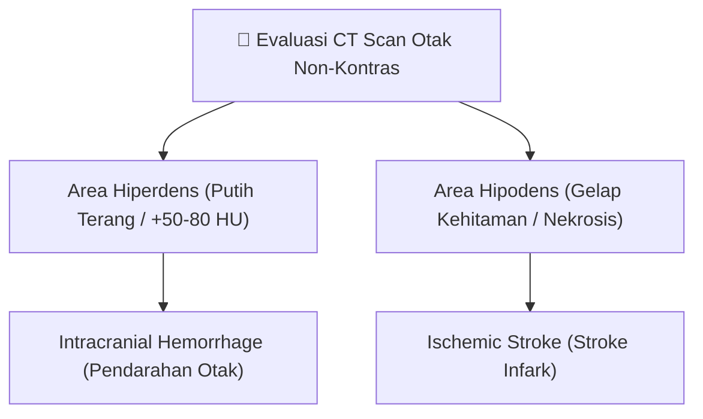

# Pencitraan Medis & Intervensi (Medical Imaging)

## 1. Pendahuluan & Taksonomi Modalitas Pencitraan Medis

Pencitraan medis (*medical imaging*) merupakan salah satu fondasi utama dalam [[Komputasi Biomedis]] dan radiologi modern. Modalitas pencitraan berfungsi sebagai teknik akuisisi data non-invasif (atau minimal invasif) untuk memetakan struktur anatomi, menilai fungsi fisiologis, serta memandu tindakan intervensi medis. Dalam hierarki diagnostik, pemilihan modalitas pencitraan didasarkan pada karakteristik fisik gelombang yang digunakan, tingkat densitas jaringan target, serta resolusi spasial dan temporal yang dibutuhkan.

Secara umum, modalitas pencitraan medis dapat diklasifikasikan berdasarkan jenis gelombang atau energi fisik yang digunakan:

1. **Radiasi Pengion (*Ionizing Radiation*):** Menggunakan foton berenergi tinggi yang mampu mengionisasi atom. Contoh: [[Foto Rontgen]], [[CT Scan]], dan [[Fluoroskopi]].
2. **Gelombang Akustik Non-Pengion (*Non-Ionizing Acoustic Waves*):** Menggunakan gelombang suara berfrekuensi tinggi. Contoh: [[Ultrasonografi]].
3. **Gelombang Elektromagnetik & Medan Magnet Non-Pengion:** Menggunakan interaksi medan magnet kuat dan radiofrekuensi. Contoh: [[MRI]].
4. **Inspeksi Optik Langsung (*Direct Optical Inspection*):** Menggunakan transmisi cahaya tampak melalui serat optik fleksibel. Contoh: [[Endoskopi]].

---

## 2. Foto Rontgen (X-Ray Radiography)

### A. Prinsip Fisika & Akuisisi Sinar-X
[[Foto Rontgen]] adalah modalitas pencitraan radiografi konvensional berbasis radiasi pengion berupa gelombang elektromagnetik Sinar-X (panjang gelombang $10^{-8} \text{ m}$ hingga $10^{-11} \text{ m}$). Prinsip dasarnya berlandaskan pada transmisi dan penyerapan (atenuasi) foton Sinar-X saat menembus berbagai lapisan jaringan tubuh dengan tingkat kerapatan (*density*) yang bervariasi.

Persamaan atenuasi foton Sinar-X mengikuti Hukum Beer-Lambert:

$$I = I_0 \cdot e^{-\mu x}$$

Di mana:
- $I$ = Intensitas foton Sinar-X yang lolos menembus jaringan dan mencapai detektor/film.
- $I_0$ = Intensitas awal foton Sinar-X yang dipancarkan dari tabung Rontgen.
- $\mu$ = Koefisien atenuasi linier jaringan ($\text{cm}^{-1}$), berbanding lurus dengan nomor atom dan densitas massa jaringan.
- $x$ = Ketebalan jaringan yang dilalui ($\text{cm}$).

Perbedaan nilai $\mu$ menghasilkan kontras visual pada citra radiografi:
- **Jaringan Berdensitas Tinggi (Tulang/Kalsifikasi):** Menyerap mayoritas foton ($\mu$ tinggi), sehingga foton yang sampai ke film sangat sedikit. Menghasilkan gambaran putih (*radiopaque*).
- **Jaringan Berdensitas Rendah (Udara/Paru-paru):** Meneruskan mayoritas foton ($\mu$ rendah), sehingga merangsang emulsi film secara maksimal. Menghasilkan gambaran hitam (*radiolucent*).
- **Jaringan Lunak & Cairan (Otot, Lemak, Darah):** Menghasilkan derajat keabuan intermediate (*intermediate attenuation*).

---

### B. Indikasi Klinis Diagnostik
Foto Rontgen merupakan pemeriksaan lini pertama (*first-line screening*) untuk berbagai kondisi klinis:
1. **Kelainan Muskoloskeletal:** Deteksi diskontinuitas struktur tulang (patah tulang/fraktur), evaluasi penyempitan celah sendi dan osteofit (radang sendi/artritis), serta pergeseran posisi sendi (dislokasi).
2. **Kelainan Dental:** Identifikasi karies gigi, impaksi gigi bungsu, dan struktur akar tulang rahang.
3. **Obstruksi Traktus:** Deteksi sumbatan mekanis pada saluran napas atau saluran pencernaan.
4. **Nefrolitiasis/Urolitiasis:** Identifikasi batu saluran kemih berdensitas kalsium tinggi.
5. **Infeksi & Inflamasi Parenkim Paru / Abdomen:** Deteksi infiltrat pada [[Pneumonia]], kavitas dan fibrosis akibat *Mycobacterium tuberculosis* ([[Tuberkulosis|TBC]]), efusi pleura, serta infeksi usus buntu (appendicitis/apendisitis).

---

### C. Penggunaan Zat Kontras & Efek Samping
Pada organ berongga atau jaringan lunak yang memiliki kontras alami rendah, diberikan **[[Zat Kontras]]** untuk meningkatkan diferensiasi visual:

- **Jenis Media Kontras:**
  1. **Kontras Barium (Barium Sulfat / $\text{BaSO}_4$):** Diberikan secara per oral atau per rektal untuk memetakan traktus gastrointestinal (misal *barium swallow* atau *barium enema*).
  2. **Kontras Berbasis Iodium (*Iodinated Contrast Media*):** Diberikan secara intravaskular (intraveda/IV) untuk memetakan pembuluh darah, ginjal, atau traktus urinarius.

- **Profil Efek Samping Klinis Zat Kontras:**
  Meskipun sangat efektif memperjelas batas organ, zat kontras berpotensi menimbulkan efek samping berupa:
  - Reaksi alergi/hipersensitivitas (urtikaria, gatal-gatal, bronkospasme, hingga syok anafilaksis).
  - Gangguan neurosensori ringan (pusing, mual, muntah, dan rasa pahit/logam pada lidah).
  - **Nefropati Terinduksi Kontras (*Contrast-Induced Nephropathy* / CIN):** Penurunan fungsi ginjal akut akibat vasokonstriksi pembuluh darah ginjal dan toksisitas tubular langsung dari media kontras berosmolalitas tinggi.

---

### D. Interpretasi Citra AI untuk COVID-19 (qXR / qure.ai)
Pengembangan sistem kecerdasan buatan (*Artificial Intelligence*) seperti **qXR** (dikembangkan oleh Qure.ai) memanfaatkan jaringan saraf tiruan dalam (*Deep Convolutional Neural Networks*) untuk melakukan interpretasi otomatis citra Foto Rontgen dada (*Chest X-Ray* / CXR), terutama pada skrining pasien [[COVID-19]] dan penyakit paru lainnya.

Sistem qXR mengekstrak dan memetakan fitur temuan abnormal ke dalam 5 kategori zona anatomis:

#### 1. Paru-Paru (*Lungs*)
- **Opacity (Kekeruhan):** Area berdensitas meningkat yang mengaburkan pembuluh darah paru di sekitarnya.
- **Consolidation (Konsolidasi):** Pengantian udara alveoli oleh eksudat/cairan infeksius, terlihat sebagai gambaran putih homogen.
- **Atelectasis (Atelektasis):** Kolaps parsial atau total pada segmen/lobus paru akibat penyumbatan bronkus.
- **Calcification (Kalsifikasi):** Deposit kalsium nodular berdensitas tinggi pasca-infeksi kronis.
- **Cavity (Rongga):** Lesi bergaris tegas berisi udara di dalam parenkim paru (khas pada TBC aktif).
- **Fibrosis:** Jaringan parut retikular yang kaku akibat kerusakan jaringan paru yang ireversibel.
- **Nodule:** Lesi bulat berdiameter $< 3 \text{ cm}$.
- **Emphysema:** Hiperinflasi paru dengan destruksi dinding alveoli (tampak sangat radiolusen/hitam).

#### 2. Pleura
- **Blunted Costophrenic Angle (Sudut Kostofrenikus Tumpul):** Hilangnya sudut tajam antara diafragma dan dinding dada akibat akumulasi cairan minimal.
- **Pleural Effusion (Efusi Pleura):** Penumpukan cairan abnormal di dalam rongga pleura.
- **Pneumothorax:** Keberadaan udara bebas di rongga pleura yang menekan jaringan paru hingga kolaps.

#### 3. Mediastinum
- **Tracheal Deviation (Deviasi Trakea):** Pergeseran posisi trakea dari garis tengah akibat dorongan pneumotoraks ventil atau penarikan atelektasis berat.
- **Hilar Enlargement (Pembesaran Hilus):** Pembesaran kelenjar getah bening atau pembuluh darah utama pada hilus paru.

#### 4. Jantung (*Heart*)
- **Cardiomegaly (Pembesaran Jantung):** Pembesaran rasio kardiotoraks (*Cardiothoracic Ratio* / CTR) melebihi $50\%$ ($\text{CTR} > 0.5$) pada posisi foto Posteroanterior (PA).

#### 5. Tulang (*Bones*)
- **Scoliosis:** Kelengkungan lateral abnormal pada tulang belakang torakal/lumbal yang terekam pada pencitraan dada.

---

## 3. Ultrasonografi (USG / Ultrasonography)

### A. Prinsip Fisika & Fenomena Akustik
[[Ultrasonografi]] (USG) menggunakan gelombang suara longitudinal berfrekuensi tinggi di atas rentang pendengaran manusia (umumnya $2 \text{ MHz}$ hingga $18 \text{ MHz}$).

1. **Efek Piezoelektrik:** Kristal piezoelektrik (seperti *Lead Zirconate Titanate* / PZT) di dalam transduser mengubah pulsa energi listrik menjadi getaran mekanis (gelombang ultrasonik).
2. **Propagasi & Impedansi Akustik:** Gelombang ultrasonik merambat melalui jaringan tubuh. Pada perbatasan antara dua jaringan dengan **Impedansi Akustik** ($Z$) yang berbeda, sebagian gelombang akan dipantulkan kembali (*echo*) menuju transduser.

Nilai impedansi akustik dirumuskan sebagai:

$$Z = \rho \cdot c$$

Di mana:
- $\rho$ = Densitas massa jaringan ($\text{kg/m}^3$).
- $c$ = Kecepatan rambat gelombang suara dalam jaringan ($\text{m/s}$, rata-rata pada jaringan lunak $\approx 1540 \text{ m/s}$).

Bila terdapat perbedaan $Z_1$ dan $Z_2$ yang signifikan, koefisien refleksi intensitas ($R$) menjadi tinggi:

$$R = \left( \frac{Z_2 - Z_1}{Z_2 + Z_1} \right)^2$$

Pantulan gelombang ini ditangkap kembali oleh transduser, diubah menjadi sinyal listrik, dan diolah oleh algoritma rekonstruksi untuk menampilkan citra berskala abu-abu (*B-mode / Brightness mode*) secara *real-time*.

---

### B. Aplikasi Klinis Diagnostik & Intervensi
- **Organ Abdomen:** Deteksi massa tumor, kista, abses, atau pembentukan batu (*calculi*) pada ginjal, pankreas, hati, dan kandung empedu.
- **Obstetri & Ginekologi:** Pemantauan kondisi perkembangan janin, usia kehamilan, kecukupan cairan ketuban (amnio), serta evaluasi organ reproduksi wanita.
- **Panduan Biopsi (*Biopsy Guide*):** Visualisasi *real-time* posisi jarum biopsi saat mengambil sampel jaringan target (seperti tumor payudara atau nodul tiroid) untuk meminimalkan trauma jaringan sehat di sekitarnya.

---

### C. Persiapan Pasien & Window Akustik (*Acoustic Window*)
Gelombang ultrasonik mengalami atenuasi dan pemantulan total saat melewati udara/gas usus ($Z_{\text{udara}} \ll Z_{\text{jaringan}}$) dan tulang. Oleh karena itu, prosedur USG membutuhkan persiapan khusus:

1. **Berpuasa ($6-8 \text{ jam}$):** Mengurangi pembentukan gas intraluminal usus dan mengosongkan perut agar kantung empedu terisi penuh (*distended*).
2. **Minum Air & Menahan Buang Air Kecil:** Pengisian penuh kandung kemih (*full bladder*) berfungsi sebagai **Acoustic Window (Jendela Akustik)** yang jernih dan homogen. Kandung kemih yang terisi cairan mentransmisikan gelombang akustik tanpa hambatan menuju organ panggul (*pelvic organs*) seperti rahim, ovarium, dan prostat.

---

### D. Indikator Real-Time pada Monitor USG
Sistem USG modern (seperti sistem pencitraan Philips) menampilkan parameter keselamatan dan operasional secara *real-time* pada layar monitor:

| Indikator | Nama Panjang / Parameter | Fungsi & Makna Klinis |
| :--- | :--- | :--- |
| **TIS** | *Thermal Index Soft Tissue* | Indeks estimasi kenaikan suhu lokal pada jaringan lunak akibat penyerapan energi akustik. Menjamin keselamatan paparan thermal ($\text{TIS} < 1.0$). |
| **MI** | *Mechanical Index* | Indeks potensial efek mekanis nonthermal seperti kavitasi akustik (pembentukan gelembung mikro) pada jaringan ($\text{MI} < 1.9$). |
| **Hz** | *Frequency / Frame Rate* | Frekuensi kerja transduser ($\text{MHz}$) atau laju pembaruan bingkai citra per detik ($\text{Hz}$ / *fps*) untuk visualisasi *real-time*. |
| **bpm** | *Beats Per Minute* | Indikator laju detak jantung (misal detak jantung janin / *Fetal Heart Rate* yang diukur via *M-mode* atau *Doppler*). |

---

## 4. Computed Tomography Scan (CT Scan)

### A. Prinsip Fisika & Mekanisme Rotasi Gantry
[[CT Scan]] (Computed Tomography) menggabungkan penggunaan radiasi Sinar-X dengan komputasi rekonstruksi digital. Berbeda dengan Rontgen 2D yang memproyeksikan seluruh jaringan secara tumpang tindih (*overlapping*), CT scan memanfaatkan tabung Sinar-X dan larik detektor (*detector array*) yang dipasang berhadapan di dalam *gantry* yang berputar $360^\circ$ mengelilingi aksial tubuh pasien.

Selama rotasi, tabung memancarkan berkas Sinar-X berbentuk kipas (*fan-beam*) atau kerucut (*cone-beam*). Detektor mencatat ribuan profil atenuasi dari berbagai sudut proyeksi. Data mentah proyeksi (*sinogram*) diubah menjadi citra irisan melintang 2D/3D menggunakan algoritma matematika **Transformasi Radon** dan **Filtered Back-Projection (FBP)** atau **Iterative Reconstruction**.

Densitas kuantitatif jaringan pada CT scan diukur dalam skala **Hounsfield Unit (HU)**:

$$\text{HU} = 1000 \times \frac{\mu_{\text{jaringan}} - \mu_{\text{air}}}{\mu_{\text{air}} - \mu_{\text{udara}}}$$

- Air murni = $0 \text{ HU}$
- Udara = $-1000 \text{ HU}$
- Tulang kortikal = $+1000 \text{ HU}$ hingga $+3000 \text{ HU}$
- Darah segar (hematoma) = $+50 \text{ HU}$ hingga $+80 \text{ HU}$
- Jaringan otak (gray matter) = $+35 \text{ HU}$ hingga $+45 \text{ HU}$

---

### B. Karakteristik & Keunggulan Akses Diagnostik
1. **Resolusi Kontras Tinggi:** Mampu membedakan densitas jaringan lunak yang hanya berbeda $0.5\%$.
2. **Pencitraan Potongan Melintang (*Cross-Sectional*):** Menghilangkan superimposisi struktur organ.
3. **Durasi Pemindaian:** Berlangsung cepat ($20 - 60 \text{ menit}$ total durasi persiapan hingga akuisisi).
4. **Penggunaan Kontras Intravaskular:** Penggunaan zat kontras berbasis iodium memperjelas batas vaskular, serta mendeteksi neovaskularisasi tumor dan karsinoma.

---

### C. Aplikasi Klinis & Interpretasi CT Scan Otak
CT scan non-kontras pada kepala merupakan *gold standard* diagnostik darurat untuk kasus trauma kepala dan kecurigaan [[Stroke]].



#### 1. CT Scan Otak Normal
Menampilkan struktur serebral yang simetris dengan batas tegas antara substansia grisia dan alba. Visualisasi penanda anatomis mencakup:
- *Superior Sagittal Sinus*
- *Corpus Callosum*
- *Anterior Horn of Lateral Ventricle* (ventrikel lateral simetris tanpa penekanan)
- Tulang tengkorak (*Left Parietal Bone*) yang tampak sangat radiopak (putih padat).

#### 2. Pendarahan Otak (*Intracranial Hemorrhage*)
- **Gambaran Citra:** Terlihat area **Hiperdens (Warna Putih Terang)** secara fokal atau diffuse di dalam parenkim otak, ruang subaraknoid, epidural, atau subdural.
- **Patofisiologi:** Akumulasi hemoglobin terdeoksigenasi berdensitas tinggi ($+50 \text{ s/d } +80 \text{ HU}$) akibat pecahnya pembuluh darah serebral (misal akibat ruptur aneurisma atau krisis hipertensi). Dapat menimbulkan *mass effect* berupa pendorongan garis tengah (*midline shift*).

#### 3. Stroke Infark / Iskemik (*Ischemic Stroke*)
- **Gambaran Citra:** Terlihat area **Hipodens (Warna Gelap / Kehitaman)** pada daerah vaskularisasi arteri serebral tertentu.
- **Patofisiologi:** Penyumbatan trombus/embolus pada pembuluh darah serebral yang mengakibatkan kematian sel otak (nekrosis sitotoksik) dan pembengkakan sel (edema). Kepadatan jaringan menurun melemahkan atenuasi Sinar-X (skala HU merosot rendah).
- *Catatan Alat:* Pemindaian presisi tinggi pada unit darurat umumnya menggunakan perangkat seperti HiSpeed Dual CT.

---

## 5. Magnetic Resonance Imaging (MRI 3 Tesla)

### A. Prinsip Fisika & Resonansi Magnetik
[[MRI]] (Magnetic Resonance Imaging) adalah modalitas pencitraan canggih tanpa memanfaatkan radiasi pengion (Sinar-X). MRI mengandalkan kelimpahan inti atom Hidrogen ($^1\text{H}$) di dalam jaringan tubuh (terutama air dan lemak) yang memiliki momen magnetik spin.

1. **Magnetisasi Eksternal ($B_0$):** Pasien ditempatkan di dalam medan magnet kuat searah (misal $3.0 \text{ Tesla}$). Spin proton hidrogen berpresesi searah dengan medan magnet $B_0$ pada **Frekuensi Larmor** ($\omega_0$):

$$\omega_0 = \gamma \cdot B_0$$

Di mana:
- $\omega_0$ = Frekuensi presesi Larmor ($\text{MHz}$).
- $\gamma$ = Rasio giromagnetik inti hidrogen ($42.58 \text{ MHz/Tesla}$).
- $B_0$ = Kekuatan medan magnet eksternal ($3.0 \text{ Tesla}$).

2. **Eksitasi Radiofrekuensi (RF):** Pulsa gelombang radio dipancarkan pada frekuensi $\omega_0$, mereposisi kesetimbangan medan magnet proton.
3. **Relaksasi Sinyal & Pembentukan Citra:** Saat pulsa RF dimatikan, proton kembali ke posisi semula (relaksasi) sambil memancarkan sinyal radio. Sinyal ditangkap oleh *receiver coil*:
   - **Relaksasi $T_1$ (Spin-Lattice):** Pemulihan magnetisasi longitudinal.
   - **Relaksasi $T_2$ (Spin-Spin):** Peluruhan magnetisasi transversal.

Durasi prosedur MRI berkisar antara $15$ hingga $90 \text{ menit}$. Untuk kontras vaskular atau tumor, digunakan media kontras paramagnetic berbasis **[[Gadolinium]]**.

---

### B. Diagnosis Penyakit Parkinson pada MRI Otak 3 Tesla
Pemindaian MRI berkekuatan medan tinggi ($3 \text{ Tesla}$) beresolusi spasial mikro memungkinkan evaluasi terperinci terhadap struktur **Otak Tengah (*Midbrain*)** dan **Substantia Nigra**, yang menjadi standar diagnostik untuk [[Penyakit Parkinson]].

![[diagram_college_biocomp_mri_parkinson_swallowtail.webp]]

#### 1. MRI Otak Sehat
- **Tanda "Swallow-Tail Sign" (Tanda Ekor Burung Walet):** Pada citra berbobot $T_2^*$-weighted atau *Susceptibility Weighted Imaging* (SWI), penanda anatomis berupa gambaran hyperintense bersisi ganda memanjang menyerupai ekor burung walet (*swallow-tail*) terlihat jelas pada region **Nigrosome-1** di dalam Substantia Nigra pars compacta.
- Jaringan Substantia Nigra (terbagi atas *pars compacta* dan *pars reticulata*) tampak utuh dengan sinyal homogen.

#### 2. MRI Otak Penderita Penyakit Parkinson
- **Loss of "Swallow-Tail Sign":** Terjadi hilangnya sinyal hiperintens (*signal loss*) pada Nigrosome-1, sehingga pola ekor burung walet lenyap dan digantikan oleh gambaran memudar atau pola silang (*X-Mark*).
- **Atrofi Substantia Nigra:** Penyusutan volume parenkim pada *substantia nigra pars compacta* akibat hilangnya sel-sel neuron dopaminergik secara progresif.
- **Akumulasi Zat Besi (*Iron Accumulation*):** Terjadi akumulasi deposit zat besi abnormal pada area basal ganglia dan nigrosome, meningkatkan efek susseptibilitas magnetik yang mempercepat kehilangan sinyal.
- **Degenerasi Umum:** Kerusakan ireversibel pada jalur nigrostriatal.

---

## 6. Fluoroskopi (Real-Time X-Ray Cine-Radiography)

### A. Prinsip Kerja & Mekanisme Fluoroskopi
[[Fluoroskopi]] adalah teknik pencitraan radiologi berbasis Sinar-X yang menghasilkan rekaman citra bergerak (*real-time video radiography*) secara kontinu.

Sinar-X dipancarkan secara terus-menerus dengan laju dosis rendah melewati tubuh pasien menuju penguat citra (*image intensifier*) atau detektor panel datar (*flat-panel detector*). Penguat citra mengubah foton Sinar-X menjadi foton cahaya tampak yang kemudian ditangkap kamera video digital kecepatan tinggi untuk ditampilkan langsung pada layar monitor medis.

---

### B. Indikasi & Panduan Intervensi Medis
Fluoroskopi umumnya dikombinasikan dengan injeksi kontras intravaskular untuk:
1. Evaluasi dinamika gerakan sistem organ internal (pencernaan, kemih, dan pembuluh darah).
2. **Panduan Visual Intervensi Medis (*Interventional Guidance*):** Memandu navigator cateter dokter spesialis jantung secara *real-time* saat melakukan **Kateterisasi Jantung** dan **Pemasangan Ring Jantung (Stent / Balloon Angioplasty)**.

---

### C. Studi Kasus Koroner Arteriografi (Coronary Angiography)

```
                       [ Arteriografi Koroner Fluoroskopi ]
                                        |
     +----------------------------------+----------------------------------+
     |                                  |                                  |
[ Jantung Sehat ]               [ Jantung Sakit (CAD) ]            [ Pasca-Intervensi (Post-Op) ]
     |                                  |                                  |
- LCA & RCA Normal              - Injeksi Kontras Aorta            - Pemasangan Balloon / Stent
- Tanpa Penyempitan             - Multiple Stenosis Areas          - Aliran Darah Pulih
  (No Stenosis)                 - Multi-vessel Stenosis              (Blood Flow Restored)
```

1. **Jantung Sehat (*Healthy Heart*):**
   - Arteri koroner kiri (*Left Coronary Artery* / LCA) dan arteri koroner kanan (*Right Coronary Artery* / RCA) terisi zat kontras secara merata.
   - Pembuluh darah menunjukkan lumen yang utuh, licin, dan mengalirkan darah secara lancar tanpa adanya penyempitan (*Normal, No Stenosis*).

2. **Jantung Sakit — Penyakit Jantung Koroner (*Diseased Heart - Coronary Artery Disease / CAD*):**
   - Kateter dimasukkan melintasi aorta melalui titik akses arteri femoralis (lipat paha) atau radialis (pergelangan tangan).
   - Media kontras diinjeksikan pada *Contrast Injection Point*.
   - Fluoroskopi merekam adanya **Area Stenosis Ganda (*Multiple Stenosis Areas*)**, yaitu penyempitan lumen pembuluh darah akibat plak aterosklerosis yang memblokir aliran darah (*Blood Flow Blockage*).
   - Diagnosis klinis: *Multi-vessel Stenosis*.

3. **Hasil Pasca-Operasi Intervensi (*Post-Op / Post-Intervention Result*):**
   - Setelah dilakukan dilatasi balon (*balloon angioplasty*) dan pemasangan *stent* (ring jantung), lumen pembuluh darah yang menyempit berhasil diregangkan.
   - Hasil fluoroskopi mengonfirmasi bahwa penyumbatan telah teratasi dan aliran darah koroner pulih penuh (*Blood Flow Restored*).

---

## 7. Endoskopi (Direct Optical Inspection)

### A. Prinsip Kerja & Instrumentasi Optik
[[Endoskopi]] adalah metode inspeksi visual langsung terhadap bagian dalam organ berongga atau rongga tubuh menggunakan instrumen medis fleksibel bernama **Endoskop**.

- **Konstruksi Alat:** Selang fleksibel berdiameter kecil yang dilengkapi dengan:
  1. *Fiber Optic Bundle:* Memancarkan cahaya terang dari sumber cahaya eksternal untuk menerangi organ berongga.
  2. *Sensor Kamera Digital:* Sensor mikro $\text{CCD}$ atau $\text{CMOS}$ di ujung distalis selang untuk menangkap citra warna beresolusi tinggi.
  3. *Working Channel:* Saluran khusus untuk memasukkan instrumen biopsi, kauterisasi, atau aspirasi cairan.
- Citra permukaan mukosa diproyeksikan secara *real-time* ke monitor High-Definition (HD).

---

### B. Indikasi Diagnostik Saluran Pencernaan Atas (*Upper GI Track*)
Endoskopi saluran cerna atas (Esofagogastroduodenoskopi / EGD) dilakukan untuk mendiagnosis:
1. **[[Gastritis]]:** Inflamasi, eritema, atau edema pada lapisan mukosa lambung.
2. **[[Tukak Lambung]] (*Peptic Ulcer*):** Defek/luka terbuka berbatas tegas pada mukosa lambung atau duodenum akibat infeksi *Helicobacter pylori* atau akumulasi asam lambung.
3. **Perdarahan Lambung:** Identifikasi titik perdarahan aktif akibat erosi vaskular.
4. **[[GERD]] (*Gastroesophageal Reflux Disease*):** Evaluasi erosi atau striktur mukosa esofagus akibat paparan asam lambung berulang.
5. **[[Disfagia]]:** Evaluasi kesulitan menelan akibat penyempitan lumen atau massa intraluminal esofagus.
6. **Perdarahan Gastrointestinal:** Identifikasi sumber perdarahan samar atau masif pada traktus cerna.
7. **[[Kanker Lambung]]:** Deteksi dini lesi displastik, polipoid, atau massa karsinoma lambung disertai pengambilan sampel jaringan (*biopsi*).

---

## 8. Matriks Perbandingan Modalitas Pencitraan Medis

Berikut adalah perbandingan komprehensif antara keenam modalitas pencitraan medis yang dipelajari:

| Parameter | Foto Rontgen | USG | CT Scan | MRI (3 Tesla) | Fluoroskopi | Endoskopi |
| :--- | :--- | :--- | :--- | :--- | :--- | :--- |
| **Prinsip Fisika / Energi** | Sinar-X foton ($10^{-8} - 10^{-11} \text{ m}$) | Gelombang Akustik ($2 - 18 \text{ MHz}$) | Sinar-X Rotasional $360^\circ$ | Medan Magnet ($3\text{T}$) + Radiofrekuensi | Sinar-X Kontinu *Real-Time* | Optik Tampak (*Fiber Optics*) |
| **Kategori Radiasi** | Radiasi Pengion | Non-Pengion | Radiasi Pengion | Non-Pengion | Radiasi Pengion | Non-Pengion |
| **Dimensi & Tipe Citra** | Proyeksi 2D Statis | 2D/3D *Real-Time* | Irisan Melintang 2D/3D | Irisan Multiplanar 2D/3D | Video 2D *Real-Time* | Citra Optik 2D Direct |
| **Media Kontras** | [[Barium]], [[Iodium]] | *Microbubbles* (opsional) | [[Iodium]] Intravaskular | [[Gadolinium]] Paramagnetik | [[Iodium]] / [[Barium]] | Pewarna Mukosa (Chromoscopy) |
| **Keunggulan Utama** | Cepat, murah, aksesibilitas luas, ideal untuk tulang. | Tanpa radiasi, *real-time*, aman untuk janin, portabel. | Resolusi spasial tinggi, detail rekonstruksi jaringan padat. | Kontras jaringan lunak luar biasa, tanpa radiasi. | Pemandu intervensi dinamis secara *real-time*. | Inspeksi permukaan mukosa langsung & kapabilitas biopsi. |
| **Keterbatasan / Risiko** | Radiasi pengion, superimposisi 2D. | Terhalang udara/tulang, tergantung keahlian operator. | Dosis radiasi lebih tinggi, risiko kontras CIN. | Biaya mahal, durasi lama ($15-90\text{ min}$), implan logam. | Paparan radiasi akumulatif pada pasien & dokter. | Invasif ringan, terbatas pada organ berongga. |
| **Indikasi Utama** | Fraktur, [[Tuberkulosis|TBC]], [[Pneumonia]], artritis. | Evaluasi abdomen, obstetri (janin), biopsi guide. | [[Stroke]], trauma kapitis, staging kanker. | [[Penyakit Parkinson]], tumor otak, ligamen/otot. | Kateterisasi jantung, stent koroner, barium swallow. | [[Gastritis]], [[Tukak Lambung]], [[GERD]], [[Disfagia]]. |

---

## 9. Referensi & Catatan Kuliah

- **Mata Kuliah:** Komputasi Biomedik (BIOCOMP) — Minggu 2
- **Dosen:** Wiharto
- **Program Studi:** Informatika, Universitas Sebelas Maret (UNS)
- **Tanggal Sesi:** 27 Agustus 2026

### Catatan Kaitan Sistem Pembelajaran:
- [[Komputasi Biomedis]]
- [[STEMI]]
- [[Stroke Iskemik]]
- [[Pendarahan Intrakranial]]
- [[Penyakit Parkinson]]
- [[COVID-19]]
