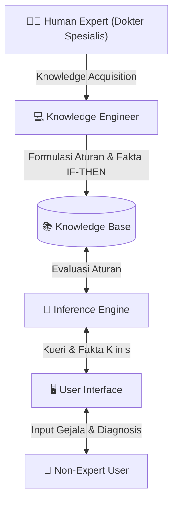
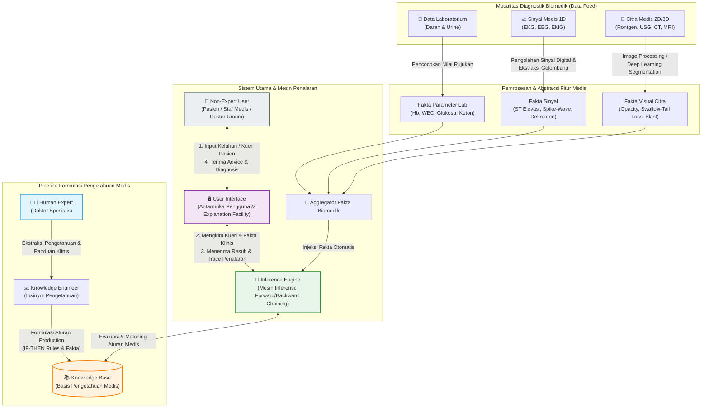
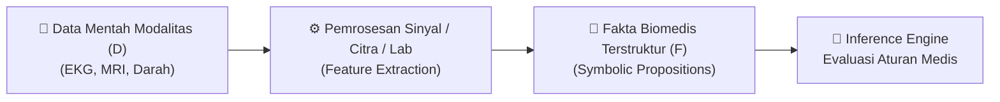

# Sistem Pakar & Kecerdasan Buatan Biomedik

Sistem Pakar Biomedik (*Biomedical Expert System*) merupakan cabang utama [[Kecerdasan Buatan]] (*Artificial Intelligence*) dalam domain [[Komputasi Biomedis]] yang dirancang untuk meniru kemampuan penalaran medis dan pengambilan keputusan klinis dari seorang dokter spesialis (*human expert*). Sistem ini mengintegrasikan komponen utama yang meliputi **Antarmuka Pengguna** (*User Interface*), **Mesin Inferensi** (*Inference Engine*), dan **Basis Pengetahuan** (*Knowledge Base*) yang dirumuskan oleh seorang *Knowledge Engineer* dari keahlian medis pakar, guna memberikan saran atau diagnosis klinis (*advice/clinical diagnosis*) kepada pengguna non-pakar (*non-expert user*). Dalam lanskap layanan kesehatan modern, Sistem Pakar berfungsi sebagai fondasi dari *Clinical Decision Support System* (CDSS) yang menerima masukan terstruktur dari berbagai modalitas diagnostik—mulai dari data laboratorium darah dan urine, sinyal medis 1D (EKG, EEG, EMG), hingga citra medis 2D/3D (Foto Rontgen, USG, CT Scan, MRI, Endoskopi)—untuk secara otomatis melakukan abstraksi fitur, evaluasi aturan medis, dan menghasilkan rekomendasi diagnostik berbasis bukti (*evidence-based diagnosis*).

---

## 1. Arsitektur Utama Sistem Pakar Biomedik

### 1.1 Komponen Fondasional dan Interaksi Sistem
Sistem pakar medis dirancang dengan pemisahan yang jelas antara pengetahuan domain (*domain knowledge*) dan mekanisme penalaran (*reasoning engine*). Pemisahan ini memungkinkan basis pengetahuan medis untuk terus diperbarui dan diperluas tanpa harus mengubah algoritma dasar pencocokan aturan (*rule-matching algorithm*).



### 1.2 Rincian Peran dan Mekanisme Komponen Arsitektur

#### A. Non-Expert User (Pengguna Non-Pakar)
- **Definisi & Peran:** Merupakan pihak yang menginteraksi sistem untuk mendapatkan konsultasi atau keputusan medis, meliputi pasien, perawat, atau dokter umum (*general practitioner*) yang membutuhkan saran pertimbangan klinis dari domain spesialisasi tertentu.
- **Interaksi:** Pengguna memasukkan data awal berupa gejala klinis (*symptoms*), keluhan utama, atau data hasil analisis sampel laboratorium melalui antarmuka sistem. 
- **Output yang Diterima:** Memperoleh gambaran saran (*advice*), diagnosis presumtif, rekomendasi tindakan medis darurat, atau rujukan uji laboratorium lanjutan.

#### B. User Interface (Antarmuka Pengguna / UI)
- **Definisi & Peran:** Komponen perangkat lunak yang menjembatani komunikasi dua arah antara pengguna non-pakar dan mesin penalaran internal.
- **Karakteristik Biomedik:** Harus intuitif dan ramah pengguna klinis, mampu menerima input dalam bentuk formulir terstruktur, kuesioner gejala interaktif, maupun unggahan file data mentah (misalnya nilai laboratorium JSON/CSV atau format citra medis DICOM).
- **Fungsi Penjelasan (*Explanation Facility*):** UI tidak hanya menyajikan hasil diagnosis akhir, tetapi juga mampu menampilkan alasan (*reasoning trace*) mengapa sistem mengambil kesimpulan tersebut (misalnya menampilkan aturan *IF-THEN* yang terpicu).

#### C. Inference Engine (Mesin Inferensi / Reasoning Engine)
- **Definisi & Peran:** Bertindak sebagai "otak" atau pemproses logika utama dari Sistem Pakar. Mesin ini mengevaluasi fakta-fakta yang diberikan oleh pengguna atau data modalitas diagnostik terhadap aturan-aturan yang tersimpan di dalam [[Knowledge Base]].
- **Metode Penalaran Utama:**
  1. **Forward Chaining (Penalaran Maju / Data-Driven):** Dimulai dari fakta-fakta klinis yang ada (misal: Hb rendah, leukosit sangat tinggi, ditemukan sel blas) untuk bergerak maju menyimpulkan diagnosis penyakit (misal: [[Acute Lymphoblastic Leukemia]]). Metode ini sangat cocok untuk sistem diagnostik medis otomatis berbasis data sensor/laboratorium.
  2. **Backward Chaining (Penalaran Mundur / Goal-Driven):** Dimulai dari hipotesis diagnosis tertentu (misal: Hipotesis "Pasien Menderita STEMI") lalu bergerak mundur memeriksa apakah fakta-fakta klinis pendukung (ST Elevasi pada [[Elektrokardiogram]], nyeri dada khas) terpenuhi.
- **Penanganan Ketidakpastian (*Uncertainty Handling*):** Mengingat data medis sering kali bersifat samar atau tidak pasti, *Inference Engine* canggih memanfaatkan logika kabur (*Fuzzy Logic*), *Certainty Factors* (CF), atau jaringan probabilitas Bayes (*Bayesian Belief Networks*) untuk menghitung derajat keyakinan diagnosis.

#### D. Knowledge Base (Basis Pengetahuan) & Knowledge Engineering Pipeline
- **Knowledge Base (Basis Pengetahuan):** Repositori digital yang menyimpan seluruh pengetahuan spesialis dalam bentuk terstruktur. Struktur umum pengetahuan disimpan dalam format aturan implikasi logika (*Production Rules*):
  $$\text{IF } \langle \text{Kondisi Klinis / Fakta} \rangle \text{ THEN } \langle \text{Diagnosis / Kesimpulan} \rangle$$
- **Human Expert (Dokter Spesialis):** Dokter spesialis senior (misal: Dokter Spesialis Patologi Klinik, Dokter Spesialis Kardiologi, Dokter Spesialis Neurologi) yang memiliki penguasaan mendalam atas pengetahuan klinis, pengalaman diagnostik, serta penanganan kasus kompleks.
- **Knowledge Engineer (Insinyur Pengetahuan):** Spesialis [[Kecerdasan Buatan]] atau pakar [[Komputasi Biomedis]] yang bertugas mengekstrak pengetahuan dari *Human Expert* melalui wawancara, literatur panduan praktik klinis (*clinical practice guidelines*), dan studi kasus, kemudian menerjemahkannya ke dalam sintaksis aturan komputasional yang valid.

#### E. Advice / Clinical Diagnosis (Saran & Output Diagnosis Klinis)
- **Definisi & Output:** Hasil pemrosesan inferensi yang disajikan kembali kepada pengguna.
- **Cakupan Keluaran:**
  - Kombinasi kemungkinan diagnosis beserta tingkat kepastian (misal: "Probabilitas Malaria *Plasmodium falciparum*: 92%").
  - Rekomendasi obat atau protokol terapi awal.
  - Peringatan dini (*early warnings*) kondisi krisis (misal: "Indikasi STEMI - Diperlukan tindakan kateterisasi jantung segera").
  - Anjuran pemeriksaan penunjang konfirmasi tambahan.

---

## 2. Diagram Arsitektur Sistem Pakar Biomedik

Berikut adalah visualisasi diagram aliran data dan penalaran pada arsitektur Sistem Pakar Biomedik (*Biomedical Expert System*):



---

## 3. Integrasi Pipeline Modalitas Diagnostik ke dalam Sistem Pakar (CDSS)

### 3.1 Kerangka Kerja Transduksi Data Biomedik ke Basis Pengetahuan
Modalitas diagnostik medis modern menghasilkan heterogenitas data yang tinggi, meliputi data kuantitatif kontinu (sinyal 1D), data matriks piksel/voksel (citra 2D/3D), serta data tabel kuantitatif-kualitatif (laboratorium). Agar data mentah tersebut dapat digunakan oleh *Inference Engine*, sistem membutuhkan **Pipeline Abstraksi Fitur Biomedik** (*Biomedical Feature Abstraction Pipeline*) untuk mengonversi data mentah menjadi proposisi logika atau fakta biomedis terstruktur.

$$\text{Data Mentah Modalitas } (\mathcal{D}) \xrightarrow{\text{Preproses \& Ekstraksi}} \text{Vektor Fitur } (\mathbf{x}) \xrightarrow{\text{Diskretisasi \& Rule-Bound}} \text{Fakta Logika Medis } (\mathcal{F})$$



---

### 3.2 Modalitas Laboratorium Medis (Darah & Urine)

Data laboratorium medis merupakan data terstruktur yang paling mudah diintegrasikan ke dalam Sistem Pakar karena nilainya dapat langsung dipetakan terhadap ambang batas baku (*thresholding*).

#### A. [[Pemeriksaan Darah]]
1. **Darah Lengkap (Complete Blood Count / CBC):**
   - **Parameter:** Hemoglobin (Hb), Hematokrit (Ht), Leukosit (WBC), Trombosit (PLT), dan Hitung Jenis Leukosit (*Diff Count*).
   - **Formulasi Fakta ke Inference Engine:**
     - Jika $\text{WBC} > 11.000/\mu\text{L}$ dan $\text{Neutrofil} > 70\% \implies \text{Fakta: Infeksi Bakteri Akut}$.
     - Jika $\text{Hb} < 10\text{ g/dL}$, $\text{WBC} > 50.000/\mu\text{L}$, dan $\text{PLT} < 100.000/\mu\text{L} \implies \text{Fakta: Indikasi Kuat Leukemia}$.
2. **Pemeriksaan Malaria:**
   - **Parameter:** Mikroskopis apusan darah tebal/tipis, RDT (HRP-2 / pLDH), dan PCR Malaria.
   - **Aturan Penalaran CDSS:**
     $$\text{IF } \text{Apusan Tebal} = \text{Positif Parasit} \text{ AND } \text{Morfologi Apusan Tipis} = \text{Ring Form / Gametosit} \implies \text{Diagnosis: Malaria } \textit{Plasmodium falciparum}$$

#### B. [[Pemeriksaan Urine]]
- **Parameter Dipantau:** Kimia urine (Glukosa, Keton, Bilirubin, Protein, Nitrit) dan Mikroskopis (Leukosit/LPB, Kristal, Jamur).
- **Ekstraksi Aturan Diagnostik Medis:**
  - **Penyakit Diabetes & Komplikasi:** Jika $\text{Glukosa Urine} = 1000\text{ mg/dL}$ dan $\text{Keton} \ge 5 \implies \text{Fakta: Risiko Ketoasidosis Diabetik}$.
  - **Penyakit Hati (Liver):** Jika $\text{Bilirubin Urine} = \text{Positif} \implies \text{Fakta: Gangguan Ekskresi Hati / Obstruksi Biliaris}$.
  - **Kerusakan Ginjal:** Jika $\text{Protein Urine 24 Jam} > 150\text{ mg/hari} \implies \text{Fakta: Proteinuria (Kebocoran Glomerulus Ginjal)}$.

---

### 3.3 Modalitas Sinyal Biomedik 1D (EKG, EEG, EMG)

Sinyal medis 1D memerlukan pemrosesan sinyal digital (*Digital Signal Processing* / DSP) terlebih dahulu untuk menyaring bising (*noise removal*), mengidentifikasi kompleks gelombang, dan mengekstraksi fitur waktu-frekuensi.

```
Sinyal 1D Mentah ──> Filter Bandpass ──> Ekstraksi Gelombang (P-QRS-T) ──> Derivasi Parameter ──> Aturan Logic
```

#### A. [[Elektrokardiogram]] (EKG)
- **Ekstraksi Fitur:** Pemrosesan sinyal EKG untuk mendeteksi Puncak R (*R-peak detection*), mengukur Interval RR, Interval PR, Durasi QRS, serta elevasi/depresi Segmen ST.
- **Integrasi Aturan CDSS:**
  $$\text{IF } \text{Segmen ST} > 0.1\text{ mV (ST Elevation)} \text{ pada } \ge 2\text{ Lead Berurutan} \implies \text{Diagnosis: STEMI (Alert Kateterisasi Segera)}$$
  $$\text{IF } \text{Interval RR Tidak Teratur} \text{ AND } \text{Gelombang P Hilang} \implies \text{Diagnosis: Atrial Fibrilasi}$$

#### B. [[Elektroensefalografi]] (EEG)
- **Ekstraksi Fitur:** Transformasi Fourier / Wavelet untuk memisahkan gelombang ($\delta, \theta, \alpha, \beta$) dan mendeteksi pola transient abnormal seperti gelombang paku-cakram (*spike-and-wave complexes*).
- **Integrasi Aturan CDSS:**
  - Jika terekam kompleks *Spike-Wave* berfrekuensi $3\text{ Hz}$ secara simetris $\implies \text{Diagnosis: Epilepsi Absans (Absence Seizure)}$.
  - Membantu pembedaan diagnostik otomatis antara *True Seizure* (terdeteksi pembuangan impuls abnormal pada elektrodeda) dan *Pseudoseizure* (aktivitas elektroensefalogram normal saat serangan gerak).

#### C. [[Elektromiografi]] (EMG)
- **Ekstraksi Fitur:** Pengukuran amplitudo *Motor Unit Action Potential* (MUAP) dan analisis penurunan amplitudo pada stimulasi saraf berulang (*Repetitive Nerve Stimulation* / RNS).
- **Integrasi Aturan CDSS:**
  - Jika terjadi penurunan amplitudo progresif (dekrementil) pada RNS $\implies \text{Diagnosis: Myasthenia Gravis}$.
  - Jika pola interferensi kasar dan amplitudo MUAP meningkat abnormal $\implies \text{Fakta: Neuropati / Neurogenic Disorder}$.

---

### 3.4 Modalitas Citra Medis 2D dan 3D (Rontgen, USG, CT Scan, MRI, Endoskopi)

Integrasi citra medis ke dalam Sistem Pakar memanfaatkan model *Convolutional Neural Network* (CNN) atau *Vision Transformer* (ViT) sebagai modul abstraksi fitur visual, yang kemudian hasilnya dikonversi menjadi fakta simbolik untuk dievaluasi oleh *Inference Engine*.

```
Citra Medis 2D/3D ──> Segmen Deep Learning (CNN/ViT) ──> Deteksi Abnormalitas Visual ──> Injeksi Aturan IF-THEN
```

#### A. Foto Rontgen Dada & Perangkat Lunak AI (misal: qXR)
- **Pengolahan Citra:** Pembacaan abnormalitas paru-paru dan struktur toraks secara digital.
- **Pemetaan Aturan Sistem Pakar:**
  - Jika $\text{Visual Feature} = \text{Infiltrat / Opacity}$ dan $\text{Gejala Pasien} = \text{Demam, Batuk Produktif} \implies \text{Diagnosis: Pneumonia}$.
  - Jika terdeteksi $\text{Kavitas Apikal}$ pada Rontgen dan $\text{Uji BTA} = \text{Positif} \implies \text{Diagnosis: Tuberkulosis (TBC) Paru}$.

#### B. [[Magnetic Resonance Imaging]] (MRI) Otak 3 Tesla - Deteksi Parkinson
- **Pengolahan Citra:** Pemindaian potongan aksial berkekuatan $3\text{ Tesla}$ pada area *Midbrain* (Otak Tengah) dan *Substantia Nigra* (Nigrosome-1).
- **Aturan Evaluasi Diagnostik:**
  $$\text{IF } \text{Sinyal Nigrosome-1} = \text{Loss of Swallow-Tail Sign (X-Mark)} \text{ AND } \text{Atrofi Pars Compacta} = \text{True} \implies \text{Diagnosis: Penyakit Parkinson}$$

#### C. Computed Tomography Scan (CT Scan) Otak
- **Pengolahan Citra:** Analisis nilai Unit Hounsfield (HU) untuk membedakan lesi hiperdens dan hipodens.
- **Aturan Evaluasi Diagnostik:**
  - Jika terdeteksi area **Hiperdens (Terang)** pada Parenkim Otak $\implies \text{Diagnosis: Stroke Hemoragik (Pendarahan Intrakranial)}$.
  - Jika terdeteksi area **Hipodens (Gelap)** sesuai vaskularisasi $\implies \text{Diagnosis: Stroke Infark (Iskemik)}$.

#### D. Cytology Smear Images (Citra Mikroskopis Darah)
- **Pengolahan Citra:** Segmentasi sel darah menggunakan algoritma pengolahan citra digital untuk menghitung rasio inti-sitoplasma (*nuclear-cytoplasmic ratio*).
- **Aturan Evaluasi Diagnostik:**
  - Jika $\text{Rasio Inti/Sitoplasma} \approx 90\%$ dan $\text{Morfolgi} = \text{Lymphoblast} \implies \text{Diagnosis: Acute Lymphoblastic Leukemia (ALL)}$.
  - Jika ditemukan struktur garis tajam $\text{Auer Rods}$ pada sitoplasma myeloblast $\implies \text{Diagnosis: Acute Myeloid Leukemia (AML)}$.

---

### 3.5 Matriks Rangkuman Integrasi Pipeline Modalitas Biomedik

| Modalitas Medis | Jenis Data | Teknik Ekstraksi Fitur / AI | Fakta Biomedis yang Dihasilkan | Output Recommendation / Advice |
| :--- | :--- | :--- | :--- | :--- |
| **Pemeriksaan Darah (CBC)** | Kuantitatif Tabel | Thresholding & Rule Bounds | Anemia, Leukositosis, Trombositopenia | Indikasi [[Leukemia]] / Infeksi Sistemik |
| **Apusan Darah Mikroskopis** | Citra 2D (40x/100x) | CNN Cell Segmentation | Sel Blas, Auer Rods, Parasit *Plasmodium* | Subtipe ALL/AML, Diagnosis Malaria |
| **Pemeriksaan Urine** | Kuantitatif/Kualitatif | Reflektansi / Strip Test Automata | Glukosuria, Ketonuria, Bilirubinuria | Risiko Ketoasidosis Diabetik, Gangguan Hati |
| **EKG** | Sinyal 1D | Wavelet Transform / Peak Detection | ST-Elevation, Absence of P-Wave, Arrhythmia | Alert STEMI (Rujukan Kateterisasi Jantung) |
| **EEG** | Sinyal 1D Multi-Channel | Spectral Analysis / Spike Detection | Generalized 3Hz Spike-and-Wave | Konfirmasi Epilepsi True Seizure vs Pseudoseizure |
| **EMG** | Sinyal 1D | MUAP Amplitude & RNS Decay | Decremental Response, Axon Disruption | Diagnosis Myasthenia Gravis / Neuropati |
| **Foto Rontgen Dada** | Citra Radiografi 2D | Deep Learning (misal: qXR) | Lung Opacity, Consolidation, Cavity | Diagnosis Pneumonia, TBC, Skrining COVID-19 |
| **MRI Otak 3 Tesla** | Citra Volumetric 3D | High-Field Substantia Nigra Mapping | Loss of Swallow-Tail Sign (Nigrosome-1) | Diagnosis Penyakit Parkinson |
| **CT Scan Otak** | Citra Tomografi 3D | Hounsfield Unit Thresholding | Area Hiperdens (Darah) / Hipodens (Infark) | Stroke Hemoragik vs Stroke Iskemik |
| **Fluoroskopi / Angiografi** | Citra Video Real-time | Vessel Tracking / Stenosis Detection | Multi-vessel Coronary Stenosis | Panduan Intervensi Ring Jantung (Stent) |
| **Endoskopi** | Citra Video 2D | Mucosa Texture Analysis | Eritema Mukosa Lambung, Ulserasi | Diagnosis Gastritis, GERD, Tukak Lambung |

---

## 4. Evaluasi, Keunggulan, dan Tantangan Sistem Pakar Biomedik

### 4.1 Keunggulan Klinis
1. **Konsistensi dan Objektivitas:** Mengeliminasi kelelahan manusia (*human fatigue*) dan bias subjektif dalam interpretasi data medis yang kompleks.
2. **Penyebaran Kepakaran (*Democratization of Expertise*):** Memungkinkan fasilitas kesehatan sekunder atau daerah terpencil (tanpa dokter spesialis) untuk mengakses standar diagnostik tingkat spesialis.
3. **Dukungan Keputusan Real-Time:** Mempercepat waktu tanggap (*response time*) pada kondisi gawat darurat medis seperti STEMI atau stroke akut.

### 4.2 Tantangan dan Batasan Sistem Pakar Medis
1. ***Knowledge Acquisition Bottleneck*:** Proses mengekstrak pengetahuan tersirat (*tacit knowledge*) dari dokter spesialis menjadi aturan formal memerlukan waktu dan usaha yang sangat besar.
2. **Ambiguitas dan Kasus Langka:** Aturan statistik atau implikasi logika dapat mengalami kegagalan penalaran apabila pasien menghadirkan komorbiditas kompleks yang belum terpeta dalam basis pengetahuan.
3. **Kebutuhan *Explainable AI* (XAI):** Dalam dunia medis, rekomendasi sistem pakar wajib menyertakan fasilitasi penjelasan (*Explanation Facility*) untuk memenuhi standar etika dan hukum akuntabilitas medis (*medical accountability*).

---

## 5. Ringkasan & Implikasi Praktis

Sistem Pakar Biomedik menyatukan keahlian klinis spesialis dengan keunggulan pemrosesan data komputasional. Dengan mengintegrasikan masukan dari berbagai modalitas diagnostik—mulai dari uji spesimen laboratorium hingga pemindaian canggih 3D—Sistem Pakar berperan sebagai mitra berpikir (*thinking partner*) bagi klinisi, meningkatkan akurasi diagnostik, dan mengoptimalkan luaran kesehatan pasien (*patient outcomes*).

---
## Referensi & Note Terkait
- [[Biomedical Computing]]
- [[Inference Engine]]
- [[Knowledge Base]]
- [[Clinical Decision Support System]]
- [[Elektrokardiogram]]
- [[Magnetic Resonance Imaging]]
- [[Pemeriksaan Darah]]
- [[Pemeriksaan Urine]]
