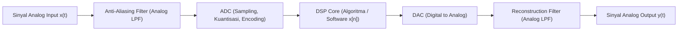

# 🎓 Week 01: Pengenalan Pemrosesan Sinyal Digital (DSP) — Modul Induk

> [!info] **Course Overview:** [[Digital Signal Processing Overview]] | **Syllabus:** [[SigPro Syllabus]]
> **Topics Covered:** Taksonomi Sinyal & Frekuensi, Arsitektur Blok Sistem DSP (ADC-DSP-DAC), serta Penerapan DSP di Industri Modern.

---

## 📌 1. Overview & Core Context

- **Latar Belakang & Motivasi:**
  Sinyal di alam nyata (seperti gelombang suara, detak jantung ECG, atau sinyal radio) bersifat kontinu terhadap waktu dan analog. Namun, sistem komputasi modern (komputer, smartphone, prosesor embedded) bekerja dalam domain biner dan waktu-diskrit. **Pengolahan Sinyal Digital (DSP)** adalah disiplin ilmu yang menjembatani fenomena fisika analog dengan kekuatan pemrosesan algoritma digital, memungkinkan penyaringan (*filtering*), kompresi, ekstraksi fitur, dan pengenalan pola yang presisi, fleksibel, serta bebas dari noise komponen hardware.

- **High-Level Takeaway (Standar Ujian Universiter):**
  1. **Dualitas Domain:** Memahami perbedaan fundamental antara sinyal kontinu $x(t)$ dan sinyal diskrit $x[n]$, serta transformasi frekuensi analog $\Omega$ (rad/s) ke frekuensi digital $\omega$ (rad/sample).
  2. **Pipeline Hardware DSP:** Memahami rantai blok fisika dari input analog ke output analog: $\text{Sinyal Analog} \to \text{Anti-Aliasing Filter} \to \text{ADC (Sampling, Quantization, Encoding)} \to \text{DSP Core} \to \text{DAC} \to \text{Reconstruction Filter} \to \text{Output Analog}$.
  3. **Keunggulan DSP vs Analog:** Fleksibilitas pemrosesan berbasis perangkat lunak, tidak terpengaruh oleh temperatur/toleransi komponen pasif, dan kemampuan implementasi algoritma kompleks (seperti FFT dan filter adaptif).

---

## 📖 2. Structure & Sub-Module Navigation

Karena luasnya cakupan materi pengenalan DSP, materi dikelompokkan ke dalam 3 sub-catatan terpisah berikut untuk pendalaman materi:

> [!abstract] **Modul Terpisah (Sub-Notes):**
> 1. 📄 **[[01 Konsep Sinyal dan Frekuensi]]**: Definisi sinyal, klasifikasi (CT vs DT, Analog vs Digital, Deterministik vs Acak), dan hubungan frekuensi analog vs digital.
> 2. 📄 **[[02 Elemen Dasar Sistem DSP]]**: Rantai blok arsitektur DSP, prinsip kerja Anti-Aliasing Filter, mekanisme ADC (Sampling, Kuantisasi, Encoding), DSP Core, DAC, dan Reconstruction Filter.
> 3. 📄 **[[03 Bidang Aplikasi DSP]]**: Studi kasus penerapan DSP dalam pengolahan audio, pengolahan citra digital, telekomunikasi nirkabel, biomedis (ECG/EEG), dan radar.

---

## ⚡ 3. Ringkasan Sintesis Elemen Sistem DSP

| Komponen Blok | Fungsi Utama | Bahaya Jika Ditiadakan |
| :--- | :--- | :--- |
| **Anti-Aliasing Filter** | Mencegah frekuensi di atas $f_s / 2$ masuk ke ADC | Terjadi distorsi *aliasing* (frekuensi tinggi menyamar jadi frekuensi rendah) |
| **Sampler (C/D)** | Mengambil sampel sinyal pada interval periodik $T_s$ | Kehilangan informasi waktu kontinu |
| **Quantizer** | Membulatkan nilai amplitudo kontinu ke level diskrit $L = 2^B$ | Memicu *quantization noise* |
| **DSP Core** | Eksekusi fungsi matematis ($x[n] * h[n]$, FFT, filtering) | Sinyal tidak terproses |
| **Reconstruction Filter** | Menghaluskan tangga gelombang hasil output DAC | Output mengandung spektrum *mirroring* / harmonisa tinggi |

---

## 🧠 4. Active Recall & Practice Drills

Untuk menguji pemahaman dan persiapan ujian, gunakan modul latihan soal terdedikasi:
- 📄 **[[Week 01 Introduction to DSP Drills]]**

Untuk kartu referensi cepat dan formula kunci:
- 📄 **[[Week 01 Introduction to DSP Cheatsheet]]**

---

## 🔗 Vault Linkage & Brain Atlas Promotion

> [!tip] **Promotable Concepts for Permanent Vault (`20_Brain_Atlas/`)**
> Catatan ini mereferensikan konsep-konsep fundamental yang dipromosikan ke `20_Brain_Atlas/20_Concepts/`:
> - `Sinyal Waktu Diskrit`: Representasi matematika dan notasi deret $x[n]$.
> - `Konversi Analog ke Digital ADC`: Mekanisme sampling, kuantisasi $B$-bit, dan frekuensi Nyquist.
> - `Aliasing Sinyal`: Fenomena lipatan frekuensi akibat pelanggaran kriteria Nyquist.
