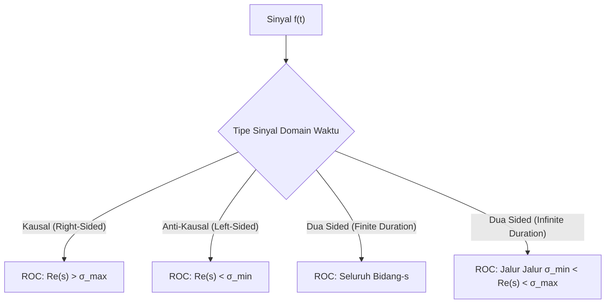

# 🎓 Week 05: Transformasi Laplace — Analisis Domain Kompleks s & Pemodelan Sistem LTI

> [!info] **Course Overview:** [[Digital Signal Processing Overview]] | **Syllabus:** [[SigPro Syllabus]]
> **Topics Covered:** Definisi Transformasi Laplace (Unilateral & Bilateral), Region of Convergence (ROC) & Stabilitas Sistem, Sifat-Sifat Utama Transformasi Laplace, Invers Transformasi Laplace (Ekspansi Pecahan Parsial), Transfer Function $H(s)$ & Respon Frekuensi.

---

## 📌 1. Overview & Core Context

- **Latar Belakang & Motivasi:**
  Dalam analisis sinyal waktu-kontinu, Transformasi Fourier Kontinu (CTFT) memberikan gambaran domain frekuensi $\omega$. Namun, CTFT memiliki keterbatasan fundamental: tidak mampu menangani sinyal yang tumbuh secara eksponensial (seperti $e^{at} u(t)$ untuk $a > 0$) karena integralnya tidak konvergen. **Transformasi Laplace** memecahkan masalah ini dengan memperkenalkan faktor pembobot eksponensial $e^{-\sigma t}$, menskalakan sinyal ke dalam domain frekuensi kompleks $s = \sigma + j\omega$. Dalam konteks [[Digital Signal Processing Overview|Pengolahan Sinyal Digital (DSP)]], Transformasi Laplace merupakan pondasi utama perancangan filter analog (Butterworth, Chebyshev) sebelum ditransformasikan ke filter digital $Z$-domain melalui metode *Bilinear Transform*.

- **High-Level Takeaway (Standar Ujian Universiter):**
  1. **Konvergensialitas & ROC:** Transformasi Laplace tidak hanya ditentukan oleh ekspresi aljabar $X(s)$, tetapi *wajib* disertai [[Region of Convergence ROC|Region of Convergence (ROC)]].
  2. **Kausalitas & Stabilitas:** Sistem LTI kontinu bersifat kausal jika ROC berada di sebelah kanan pole paling kanan ($\text{Re}(s) > \sigma_{\max}$), dan stabil jika ROC mencakup sumbu imajiner $j\omega$ ($\text{Re}(s) = 0$).
  3. **Analisis LTI & Fungsi Alih:** Persamaan diferensial linear dengan koefisien konstan dapat diubah menjadi persamaan aljabar linier dalam domain $s$, di mana respon total sistem adalah penjumlahan dari *Zero-Input Response* (ZIR) dan *Zero-State Response* (ZSR).
  4. **Jembatan Analog ke Digital:** Pemahaman domain $s$ memungkinkan pemetaan kutub/nol ke domain $z$ melalui hubungan $z = e^{s T_s}$.

![[diagram dsp laplace transform intuition.webp]]

---

## 📖 2. Detailed Lecture Notes & Technical Deep-Dive

### 2.1 Definisi Matematis Transformasi Laplace

Transformasi Laplace memetakan sinyal domain waktu $f(t)$ ke domain frekuensi kompleks $s = \sigma + j\omega$, di mana $\sigma = \text{Re}(s)$ merepresentasikan redaman/pertumbuhan eksponensial dan $\omega = \text{Im}(s)$ merepresentasikan frekuensi sudut.

#### 1. Transformasi Laplace Bilateral (Dua Sisi)
Digunakan untuk analisis sinyal teoritis umum (termasuk sinyal non-kausal):
$$
F(s) = \mathcal{L}\{f(t)\} = \int_{-\infty}^{\infty} f(t) e^{-st} \, dt
$$

#### 2. Transformasi Laplace Unilateral (Satu Sisi)
Digunakan khusus untuk analisis sistem fisik kausal dengan syarat awal (*initial conditions*) pada $t = 0^-$:
$$
F(s) = \mathcal{L}\{f(t)\} = \int_{0^-}^{\infty} f(t) e^{-st} \, dt
$$

---

### 2.2 Region of Convergence (ROC) & Bidang Kompleks s

[[Region of Convergence ROC|Region of Convergence (ROC)]] adalah himpunan nilai $s$ pada [[Bidang S Complex Plane|Bidang Complex s]] yang membuat integral Transformasi Laplace konvergen secara absolut, yaitu:
$$
\int_{-\infty}^{\infty} |f(t)| e^{-\sigma t} \, dt < \infty
$$



#### Sifat-Sifat Penting ROC:
1. ROC tidak pernah memuat kutub (*pole*). Poles adalah nilai $s$ yang menyebabkan $X(s) \to \infty$.
2. Jika $f(t)$ berdurasi terhingga (*finite duration*) dan mempunyai nilai terintegralkan, ROC mencakup seluruh bidang-$s$, kecuali mungkin pada $s = 0$ atau $s = \infty$.
3. **Kausalitas Sistem LTI:** ROC berupa setengah bidang kanan (*right-half plane*) yang dibatasi oleh pole paling kanan: $\text{Re}(s) > \max(\text{Re}(p_i))$.
4. **Stabilitas Sistem LTI:** Sistem LTI stabil terikat-masukan terikat-keluaran (BIBO) jika dan hanya jika ROC mencakup sumbu imajiner ($\text{Re}(s) = 0$).

---

### 2.3 Sifat-Sifat Utama Transformasi Laplace

Misalkan $\mathcal{L}\{f_1(t)\} = F_1(s)$ dengan ROC $R_1$, dan $\mathcal{L}\{f_2(t)\} = F_2(s)$ dengan ROC $R_2$:

| Sifat | Domain Waktu $f(t)$ | Domain-$s$ $F(s)$ | ROC |
| :--- | :--- | :--- | :--- |
| **Linearitas** | $a f_1(t) + b f_2(t)$ | $a F_1(s) + b F_2(s)$ | Menciut ke $R_1 \cap R_2$ |
| **Pergeseran Waktu** | $f(t - t_0) u(t - t_0)$ | $e^{-s t_0} F(s)$ | $R$ |
| **Pergeseran Frekuensi** | $e^{s_0 t} f(t)$ | $F(s - s_0)$ | Shift ROC sebesar $\text{Re}(s_0)$ |
| **Penskalaan Waktu** | $f(at)$ | $\frac{1}{|a|} F\left(\frac{s}{a}\right)$ | Scaled ROC |
| **Diferensiasi Waktu (Unilateral)** | $\frac{df(t)}{dt}$ | $s F(s) - f(0^-)$ | $\supseteq R$ |
| **Diferensiasi Orde-$n$** | $\frac{d^n f(t)}{dt^n}$ | $s^n F(s) - \sum_{k=1}^{n} s^{n-k} f^{(k-1)}(0^-)$ | $\supseteq R$ |
| **Integrasi Waktu** | $\int_{0^-}^{t} f(\tau) \, d\tau$ | $\frac{1}{s} F(s)$ | $R \cap \{\text{Re}(s) > 0\}$ |
| **Perkalian dengan $t$** | $t f(t)$ | $-\frac{dF(s)}{ds}$ | $R$ |
| **Konvolusi** | $f_1(t) * f_2(t)$ | $F_1(s) \cdot F_2(s)$ | $\supseteq R_1 \cap R_2$ |

---

### 2.4 Invers Transformasi Laplace & Partial Fraction Expansion (PFE)

Secara teoritis, Invers Transformasi Laplace dihitung melalui Integral Inversi Mellin:
$$
f(t) = \frac{1}{2\pi j} \int_{\gamma - j\infty}^{\gamma + j\infty} F(s) e^{st} \, ds
$$
Namun dalam praktiknya, kita menggunakan **Ekspansi Pecahan Parsial (Partial Fraction Expansion / PFE)** dikombinasikan dengan tabel pasangan transformasi dasar.

Diberikan fungsi rasional:
$$
F(s) = \frac{B(s)}{A(s)} = \frac{b_m s^m + b_{m-1} s^{m-1} + \dots + b_0}{s^n + a_{n-1} s^{n-1} + \dots + a_0} \quad (m < n)
$$

#### Kasus 1: Pole Real & Berbeda (*Real Distinct Poles*)
$$
F(s) = \sum_{i=1}^{n} \frac{A_i}{s - p_i} \implies A_i = \left. (s - p_i) F(s) \right|_{s = p_i}
$$
Solusi domain waktu: $f(t) = \sum_{i=1}^{n} A_i e^{p_i t} u(t)$.

#### Kasus 2: Pole Konjugat Kompleks (*Complex Conjugate Poles*)
Pole berupa pasangan $p_{1,2} = -\alpha \pm j\beta$:
$$
F(s) = \frac{A s + B}{(s + \alpha)^2 + \beta^2} = \frac{A(s + \alpha) + (B - A\alpha)}{(s + \alpha)^2 + \beta^2}
$$
Solusi domain waktu: $f(t) = A e^{-\alpha t} \cos(\beta t) u(t) + \frac{B - A\alpha}{\beta} e^{-\alpha t} \sin(\beta t) u(t)$.

#### Kasus 3: Pole Berulang (*Repeated Poles*)
Pole $p_1$ berulang sebanyak $r$ kali:
$$
F(s) = \frac{C_1}{s - p_1} + \frac{C_2}{(s - p_1)^2} + \dots + \frac{C_r}{(s - p_1)^r}
$$
Di mana koefisien dihitung dengan rumus:
$$
C_k = \frac{1}{(r - k)!} \left. \frac{d^{r-k}}{ds^{r-k}} \left[ (s - p_1)^r F(s) \right] \right|_{s = p_1}
$$

---

### 2.5 Transfer Function $H(s)$ & Simulasi Python

Fungsi alih (*Transfer Function*) sistem LTI kontinu didefinisikan sebagai rasio Transformasi Laplace dari output terhadap input dengan syarat awal nol:
$$
H(s) = \frac{Y(s)}{X(s)}
$$

```python
import numpy as np
import scipy.signal as signal
import matplotlib.pyplot as plt

# Definisi Transfer Function H(s) = (s + 2) / (s^2 + 3s + 10)
num = [1, 2]         # Pembilang: s + 2
den = [1, 3, 10]     # Penyebut: s^2 + 3s + 10

system = signal.lti(num, den)

# 1. Hitung Poles dan Zeros
poles = system.poles
zeros = system.zeros
print(f"Poles: {poles}")
print(f"Zeros: {zeros}")

# 2. Simulasi Respon Impuls h(t)
t, h = signal.impulse(system)

# Plot Respon Impuls
plt.figure(figsize=(8, 4))
plt.plot(t, h, 'b-', linewidth=2, label='Impulse Response h(t)')
plt.title('Respon Impuls Sistem LTI Orde-2')
plt.xlabel('Waktu t (detik)')
plt.ylabel('Amplitudo h(t)')
plt.grid(True)
plt.legend()
plt.tight_layout()
plt.savefig('/mnt/data/life-hub/10_Knowledge_OS/30_Assets/plot_laplace_impulse_response.png')
print("Plot impulse response berhasil disimpan ke 30_Assets.")
```

---

## ⚡ 3. Formulas, Key Theorems, & Algorithms

### Tabel Pasangan Transformasi Laplace Dasar

| Sinyal Domain Waktu $f(t)$ | Transformasi Laplace $F(s)$ | Region of Convergence (ROC) |
| :--- | :--- | :--- |
| $\delta(t)$ (Impuls Dirac) | $1$ | Seluruh bidang-$s$ |
| $u(t)$ (Tahap Satuan) | $\frac{1}{s}$ | $\text{Re}(s) > 0$ |
| $t u(t)$ (Ramp) | $\frac{1}{s^2}$ | $\text{Re}(s) > 0$ |
| $t^n u(t)$ | $\frac{n!}{s^{n+1}}$ | $\text{Re}(s) > 0$ |
| $e^{-at} u(t)$ | $\frac{1}{s + a}$ | $\text{Re}(s) > -a$ |
| $-e^{-at} u(-t)$ | $\frac{1}{s + a}$ | $\text{Re}(s) < -a$ |
| $t e^{-at} u(t)$ | $\frac{1}{(s + a)^2}$ | $\text{Re}(s) > -a$ |
| $\sin(\omega_0 t) u(t)$ | $\frac{\omega_0}{s^2 + \omega_0^2}$ | $\text{Re}(s) > 0$ |
| $\cos(\omega_0 t) u(t)$ | $\frac{s}{s^2 + \omega_0^2}$ | $\text{Re}(s) > 0$ |
| $e^{-at} \sin(\omega_0 t) u(t)$ | $\frac{\omega_0}{(s + a)^2 + \omega_0^2}$ | $\text{Re}(s) > -a$ |
| $e^{-at} \cos(\omega_0 t) u(t)$ | $\frac{s + a}{(s + a)^2 + \omega_0^2}$ | $\text{Re}(s) > -a$ |

---

## 🧠 4. Active Recall & Practice Drills

### Q1: Derivasi & Membedakan ROC Sinyal Kausal vs Anti-Kausal
Hitung Transformasi Laplace dan tentukan ROC dari dua sinyal berikut:
a) $x_1(t) = e^{-3t} u(t)$  
b) $x_2(t) = -e^{-3t} u(-t)$

<details>
<summary>💡 Lihat Jawaban & Step-by-Step Pembahasan</summary>

**Pembahasan:**

1. **Untuk $x_1(t) = e^{-3t} u(t)$ (Sinyal Kausal):**
   $$
   X_1(s) = \int_{0}^{\infty} e^{-3t} e^{-st} \, dt = \int_{0}^{\infty} e^{-(s+3)t} \, dt = \left. \frac{-1}{s+3} e^{-(s+3)t} \right|_{0}^{\infty}
   $$
   Batas $\lim_{t \to \infty} e^{-(s+3)t} = 0$ terjadi jika dan hanya jika $\text{Re}(s+3) > 0 \implies \text{Re}(s) > -3$.
   Maka:
   $$
   X_1(s) = \frac{1}{s+3}, \quad \text{ROC: } \text{Re}(s) > -3
   $$

2. **Untuk $x_2(t) = -e^{-3t} u(-t)$ (Sinyal Anti-Kausal):**
   $$
   X_2(s) = \int_{-\infty}^{0} -e^{-3t} e^{-st} \, dt = -\int_{-\infty}^{0} e^{-(s+3)t} \, dt = \left. \frac{1}{s+3} e^{-(s+3)t} \right|_{-\infty}^{0}
   $$
   Batas $\lim_{t \to -\infty} e^{-(s+3)t} = 0$ terjadi jika dan hanya jika $\text{Re}(s+3) < 0 \implies \text{Re}(s) < -3$.
   Maka:
   $$
   X_2(s) = \frac{1}{s+3}, \quad \text{ROC: } \text{Re}(s) < -3
   $$

**Kesimpulan:** Ekspresi aljabar $X(s) = \frac{1}{s+3}$ identik untuk kedua sinyal. Yang membedakan sinyal secara unik adalah **ROC-nya**.
</details>

---

### Q2: Penyelesaian Persamaan Diferensial Kausal dengan Syarat Awal
Sumbu sistem LTI diwakili oleh persamaan diferensial:
$$
\frac{d^2 y(t)}{dt^2} + 5 \frac{dy(t)}{dt} + 6 y(t) = x(t)
$$
Dengan syarat awal $y(0^-) = 1$, $y'(0^-) = 0$, dan input $x(t) = e^{-t} u(t)$. Tentukan respon total $y(t)$ untuk $t \ge 0$.

<details>
<summary>💡 Lihat Jawaban & Step-by-Step Pembahasan</summary>

**Pembahasan:**

1. **Transformasikan kedua sisi menggunakan Laplace Unilateral:**
   $$
   [s^2 Y(s) - s y(0^-) - y'(0^-)] + 5 [s Y(s) - y(0^-)] + 6 Y(s) = X(s)
   $$
   Substitusi $y(0^-) = 1$, $y'(0^-) = 0$, dan $X(s) = \frac{1}{s+1}$:
   $$
   [s^2 Y(s) - s] + 5 [s Y(s) - 1] + 6 Y(s) = \frac{1}{s+1}
   $$

2. **Kelompokkan suku $Y(s)$:**
   $$
   Y(s) (s^2 + 5s + 6) - s - 5 = \frac{1}{s+1}
   $$
   $$
   Y(s) (s+2)(s+3) = s + 5 + \frac{1}{s+1} = \frac{(s+5)(s+1) + 1}{s+1} = \frac{s^2 + 6s + 6}{s+1}
   $$
   $$
   Y(s) = \frac{s^2 + 6s + 6}{(s+1)(s+2)(s+3)}
   $$

3. **Ekspansi Pecahan Parsial (PFE):**
   $$
   Y(s) = \frac{A}{s+1} + \frac{B}{s+2} + \frac{C}{s+3}
   $$
   - Hitung $A$:
     $$
     A = \left. \frac{s^2 + 6s + 6}{(s+2)(s+3)} \right|_{s = -1} = \frac{1 - 6 + 6}{(1)(2)} = \frac{1}{2}
     $$
   - Hitung $B$:
     $$
     B = \left. \frac{s^2 + 6s + 6}{(s+1)(s+3)} \right|_{s = -2} = \frac{4 - 12 + 6}{(-1)(1)} = \frac{-2}{-1} = 2
     $$
   - Hitung $C$:
     $$
     C = \left. \frac{s^2 + 6s + 6}{(s+1)(s+2)} \right|_{s = -3} = \frac{9 - 18 + 6}{(-2)(-1)} = \frac{-3}{2}
     $$

4. **Invers Transformasi Laplace:**
   $$
   y(t) = \left( \frac{1}{2} e^{-t} + 2 e^{-2t} - \frac{3}{2} e^{-3t} \right) u(t)
   $$
</details>

---

## 🔗 Vault Linkage & Brain Atlas Promotion

> [!tip] **Promotable Concepts for Permanent Vault (`20_Brain_Atlas/`)**
> Catatan ini mereferensikan konsep-konsep fundamental yang dipromosikan ke `20_Brain_Atlas/20_Concepts/`:
> - `[[Transformasi Laplace]]`: Pengertian mendalam pemetaan $t \to s$ dan representasi sinyal eksponensial kompleks.
> - `[[Bidang S Complex Plane]]`: Pemetaan bidang s, poles, zeros, serta dinamika frekuensi-redaman.
> - `[[Region of Convergence ROC]]`: Konsep ketiadaan pole dalam ROC serta kriteria kausalitas dan stabilitas BIBO.
