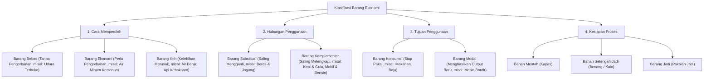
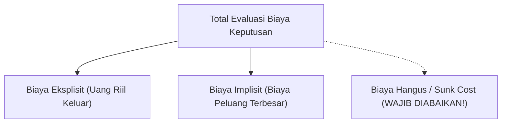
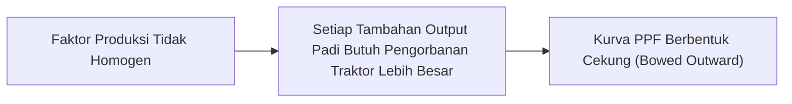

[[Konsep_Dasar_Ekonomi_SMA|🏠 Master Dashboard]] | **Modul 1: Kelangkaan & Biaya Peluang** | [[Metodologi_dan_Prinsip_Ekonomi_SMA|Modul 2: Metodologi & Prinsip ➡️]] | [[Soal_Konsep_Dasar_Ekonomi_SMA|📝 Bank Soal]]

---

# Kelangkaan & Biaya Peluang — Pilihan Hidup & Trade-Off Pengorbanan! ⏳💡

> [!abstract] **Ringkasan Inti Modul (Core Summary)**
> Inti dari seluruh permasalahan ekonomi bermuara pada satu realitas tak terelakkan: **kelangkaan (*scarcity*)**. Kelangkaan terjadi ketika kebutuhan dan keinginan manusia yang tak terbatas berhadapan dengan ketersediaan sumber daya pemuas yang terbatas. Kondisi ini mewajibkan setiap pelaku ekonomi untuk menentukan **pilihan (*choice*)** dan menyusun skala prioritas. Konsekuensi langsung dari setiap pilihan adalah timbulnya **biaya peluang (*opportunity cost*)**, yakni nilai manfaat dari alternatif terbaik berikutnya yang harus dikorbankan. Memahami biaya peluang serta dinamika kurva *Production Possibility Frontier* (PPF) merupakan fondasi utama dalam menganalisis trade-off rasional baik pada level individu, korporasi, hingga kebijakan publik nasional.

---

## 1. Hakikat Ilmu Ekonomi & Masalah Kelangkaan (*The Scarcity Problem*)

Secara etimologis, istilah **ekonomi** berakar dari bahasa Yunani, yaitu ***Oikonomia***, yang tersusun dari dua kata:
* ***Oikos:*** Rumah tangga atau keluarga.
* ***Nomos:*** Aturan, hukum, atau tata kelola.

Secara harfiah, *oikonomia* bermakna **aturan atau tata kelola rumah tangga**. Seiring perkembangan peradaban, konsep pengelolaan rumah tangga diperluas menjadi tata kelola sumber daya masyarakat dan negara.

```
       [ KEBUTUHAN MANUSIA ]                  [ SUMBER DAYA EKONOMI ]
        Tak Terbatas (Wants)                    Terbatas (Resources)
                 \                                       /
                  \                                     /
                   ▼                                   ▼
             =================================================
             💥 KELANGKAAN FUNDAMENTAL (ECONOMIC SCARCITY) 💥
             =================================================
                                     │
                                     ▼
                          [ KEHARUSAN MEMILIH ]
                           (Rational Choices)
                                     │
                                     ▼
                       [ BIAYA PELUANG DIKORBANKAN ]
                          (Next-Best Opportunity Cost)
```

### A. Definisi Presisi Kelangkaan (*Scarcity*)
Dalam kacamata ekonomi modern, **kelangkaan BUKAN berarti barang tersebut musnah atau tidak ada di alam**, melainkan kondisi di mana:
1. Jumlah barang/jasa yang tersedia tidak mencukupi untuk memenuhi seluruh kebutuhan manusia pada tingkat harga nol ($P = 0$).
2. Untuk memperoleh barang tersebut, diperlukan pengorbanan sumber daya lain (waktu, tenaga, atau uang).

> [!important] **Pembeda Kritis: Kebutuhan (*Needs*) vs Keinginan (*Wants*)**
> * **Kebutuhan (*Needs*):** Hal-hal esensial yang mutlak diperlukan manusia untuk mempertahankan kelangsungan hidup dan kesehatan fisik/mental dasar (pangan bergizi, pakaian layak, papan, layanan kesehatan). Kebutuhan memiliki batasan biologis.
> * **Keinginan (*Wants*):** Hasrat atau preferensi spesifik mengenai bagaimana kebutuhan tersebut dipenuhi, yang dipengaruhi oleh gaya hidup, status sosial, dan teknologi. Keinginan bersifat dinamis dan **tidak pernah memiliki batas akhir**.

### B. Faktor Produksi yang Terbatas (*Factors of Production*)
Kelangkaan barang dan jasa berakar dari terbatasnya 4 faktor produksi utama:
1. **Sumber Daya Alam (*Land / Natural Resources*):** Tanah, air, mineral, minyak bumi, dan iklim yang kuantitas fisiknya terbatas. Imbalan: **Sewa (*Rent* / $r$)**.
2. **Tenaga Kerja (*Labor*):** Waktu, kapasitas fisik, dan keahlian kognitif manusia yang tersedia dalam angkatan kerja. Imbalan: **Upah (*Wage* / $w$)**.
3. **Modal (*Capital*):** Barang-barang tahan lama buatan manusia yang digunakan untuk memproduksi barang/jasa lain (mesin pabrik, infrastruktur jalan, perangkat lunak, gedung). Imbalan: **Bunga (*Interest* / $i$)**.
4. **Kewirausahaan (*Entrepreneurship*):** Kemampuan manajerial, inovasi, dan keberanian mengambil risiko untuk mengombinasikan ketiga faktor produksi lainnya secara efisien. Imbalan: **Laba (*Profit* / $p$ atau $\pi$)**.

---

## 2. Taksonomi & Klasifikasi Barang Pemenuh Kebutuhan

Untuk menganalisis sifat kelangkaan secara objektif, ilmu ekonomi mengklasifikasikan barang (*goods*) ke dalam berbagai kategori:



### Tabel Rincian Karakteristik Barang

| Kategori Klasifikasi | Jenis Barang | Definisi & Karakteristik Kunci | Contoh Nyata |
| :--- | :--- | :--- | :--- |
| **Berdasarkan Pengorbanan** | **Barang Bebas** | Tersedia melimpah melebihi kebutuhan, diperoleh tanpa biaya/pengorbanan moneter ($P=0$). | Sinar matahari di pantai, udara bebas di alam terbuka. |
| | **Barang Ekonomi** | Jumlahnya terbatas dibandingkan kebutuhan, membutuhkan pengorbanan untuk memperolehnya. | Air mineral galon, pulsa seluler, rumah tinggal. |
| | **Barang Illith** | Jumlahnya jika terlalu berlebihan justru membahayakan dan merugikan kehidupan manusia. | Air saat banjir bandang, api saat kebakaran hutan. |
| **Berdasarkan Hubungan Penggunaan** | **Barang Substitusi** | Barang yang fungsinya dapat menggantikan barang lain dengan utilitas sepadan (Cross Elasticity $E_c > 0$). | Kopi instan menggantikan teh; beras digantikan singkong. |
| | **Barang Komplementer** | Barang yang nilai gunanya optimal jika dikonsumsi bersamaan dengan barang pasangannya ($E_c < 0$). | Printer dan tinta; mobil berbahan bakar minyak dan bensin. |
| **Berdasarkan Tujuan Penggunaan** | **Barang Konsumsi** | Langsung memenuhi kebutuhan akhir konsumen tanpa proses industri lanjutan. | Makanan cepat saji, sepatu olahraga, laptop pribadi. |
| | **Barang Modal (*Capital*)** | Digunakan oleh produsen untuk menciptakan output barang/jasa lain. | Mesin bubut, traktor pertanian, server komputasi. |

---

## 3. Skala Prioritas & Pengambilan Keputusan Rasional

Karena keterbatasan anggaran dan waktu, manusia dituntut menyusun **skala prioritas**, yaitu urutan daftar kebutuhan yang disusun secara sistematis berdasarkan tingkat kepentingan dan urgensinya.

### Prinsip Penyusunan Skala Prioritas:
1. **Tingkat Urgensi Mutlak:** Memprioritaskan kebutuhan primer dan darurat sebelum kebutuhan sekunder dan tersier.
2. **Kesesuaian Kemampuan Finansial:** Memastikan pengeluaran tidak melebihi kapasitas pendapatan/anggaran riil.
3. **Nilai Manfaat Jangka Panjang (*Future Value*):** Menimbang dampak pilihan terhadap produktivitas dan kualitas hidup masa depan (misal: investasi pendidikan vs konsumsi hiburan sesaat).

```
         URGENSI TINGGI                URGENSI RENDAH
     ┌──────────────────────────┬──────────────────────────┐
  P  │   KUADRAN I (SEGERA)     │  KUADRAN II (RENCANA)    │
  E  │ • Pangan harian keluarga │ • Investasi pendidikan   │
  N  │ • Biaya berobat darurat  │ • Pembelian laptop studi │
  T  ├──────────────────────────┼──────────────────────────┤
  I  │   KUADRAN III (DELEGASI) │  KUADRAN IV (HINDARI)    │
  N  │ • Tagihan langganan non- │ • Belanja impulsif FOMO  │
  G  │   esensial               │ • Spekulasi konsumtif    │
     └──────────────────────────┴──────────────────────────┘
```

---

## 4. Biaya Peluang (*Opportunity Cost*) & Analisis Biaya Rasional

### A. Definisi Operasional & Miskonsepsi Fatal
> [!important] **Definisi Emas Biaya Peluang:**
> **Biaya Peluang (*Opportunity Cost*)** adalah **nilai manfaat tertinggi dari SATU alternatif terbaik berikutnya yang harus dikorbankan** (*the value of the next-best alternative forgone*) ketika suatu keputusan diambil.

> [!warning] **Miskonsepsi Umum yang Sering Muncul di Ujian:**
> **BIAYA PELUANG BUKANLAH PENJUMLAHAN TOTAL DARI SEMUA ALTERNATIF YANG TIDAK DIPILIH!**  
> Manusia tidak bisa berada di lima tempat sekaligus. Jika Anda memiliki 3 opsi alternatif yang ditinggalkan, biaya peluang Anda adalah nilai dari **satu alternatif terbaik (bernilai tertinggi)** di antara ketiga opsi tersebut.

### B. Dekonstruksi 3 Jenis Biaya: Explicit, Implicit, dan Sunk Cost

1. **Biaya Eksplisit (*Explicit / Accounting Cost*):**
   Biaya moneter riil yang keluar secara kas dari dompet/rekening untuk membayar faktor produksi atau barang tertentu.
   * *Contoh:* Membayar uang kuliah tunggal (UKT) Rp8.000.000/semester, membeli buku teks Rp500.000.
2. **Biaya Implisit (*Implicit / Opportunity Cost*):**
   Nilai moneter atau manfaat potensial yang hilang dari aset/waktu milik sendiri yang tidak disewakan atau tidak digunakan untuk alternatif terbaik lainnya.
   * *Contoh:* Gaji Rp4.500.000/bulan yang tidak jadi diterima karena memutuskan kuliah purna waktu.
3. **Biaya Hangus (*Sunk Cost*):**
   Pengeluaran yang sudah terjadi di masa lampau dan **tidak dapat ditarik atau dipulihkan kembali**, terlepas dari apa pun keputusan yang diambil sekarang atau di masa depan.
   * *Prinsip Rasional:* **Abaikan Sunk Cost!** (*Sunk costs are irrelevant for future decision-making*).



### C. Studi Kasus Komparasi: Laba Akuntansi vs Laba Ekonomi

Seorang lulusan universitas bernama Rian memiliki modal tabungan Rp100.000.000. Rian memutuskan membuka kedai kopi sendiri. Selama tahun pertama, diperoleh data:
* **Total Pendapatan Penjualan (*Total Revenue*):** Rp350.000.000
* **Pengeluaran Operasional Riil (*Explicit Costs*):**
  * Sewa tempat & bahan baku: Rp180.000.000
  * Gaji barista: Rp60.000.000
  * Listrik, air, izin: Rp20.000.000
  * *Total Biaya Eksplisit:* Rp260.000.000

Jika Rian **tidak** membuka kedai kopi, ia memiliki dua tawaran lain:
1. Bekerja sebagai manajer kafe di perusahaan multinasional dengan gaji **Rp70.000.000/tahun**.
2. Bekerja sebagai staf konsultan dengan gaji **Rp55.000.000/tahun**.
3. Selain itu, tabungan Rp100.000.000 miliknya jika didepositokan di bank akan menghasilkan bunga **Rp6.000.000/tahun**.

#### 🧮 Perhitungan Biaya Peluang & Laba:
* **Alternatif Terbaik yang Dikorbankan:** Bekerja sebagai manajer kafe (Rp70.000.000) + Bunga deposito yang hilang (Rp6.000.000) = **Rp76.000.000/tahun**. (Opsi staf konsultan Rp55.000.000 diabaikan karena nilainya di bawah manajer kafe).
* **Total Biaya Implisit (*Opportunity Cost*):** Rp76.000.000.

$$
\begin{aligned}
\text{Laba Akuntansi} &= \text{Total Revenue} - \text{Explicit Costs} \\
&= \text{Rp350.000.000} - \text{Rp260.000.000} = \mathbf{+\text{Rp90.000.000}} \\[8pt]
\text{Laba Ekonomi} &= \text{Total Revenue} - (\text{Explicit Costs} + \text{Implicit Costs}) \\
&= \text{Rp350.000.000} - (\text{Rp260.000.000} + \text{Rp76.000.000}) \\
&= \text{Rp350.000.000} - \text{Rp336.000.000} = \mathbf{+\text{Rp14.000.000}}
\end{aligned}
$$

> [!note] **Kesimpulan Keputusan:**
> Secara akuntansi, Rian untung Rp90 juta. Secara ekonomi, Rian tetap mencetak **laba ekonomi positif (+Rp14 juta)**, yang menandakan keputusannya membuka kedai kopi lebih menguntungkan daripada menjadi karyawan profesional dan mendepositokan uangnya.

---

## 5. Kurva Kemungkinan Produksi (*Production Possibility Frontier* / PPF)

Model **PPF** adalah representasi grafis yang menunjukkan kombinasi output maksimum dua jenis barang yang dapat diproduksi oleh suatu perekonomian dengan menggunakan seluruh sumber daya dan teknologi yang tersedia secara efisien.

### A. Asumsi Dasar Model PPF:
1. Perekonomian hanya memproduksi **2 jenis komoditas** (misalnya: Pangan/Beras vs Peralatan Industri/Traktor).
2. Kuantitas dan kualitas faktor produksi bersifat tetap (*fixed supply*).
3. Tingkat teknologi bersifat konstan (*fixed technology*).
4. Seluruh sumber daya digunakan secara penuh (*full employment*) dan efisien.

```
 Output Barang Modal (Traktor)
      │
   A  ├───────● (Semua sumber daya untuk Traktor)
      │        \
      │         \   ● D (Titik Efisien di sepanjang kurva PPF)
      │          \
      │   ● C     \         ● E (Unattainable / Mustahil saat ini)
      │ (Inefisien)\
      │             \
      └──────────────●─────── Output Barang Konsumsi (Beras)
                     B (Semua sumber daya untuk Beras)
```

### B. Analisis Titik-Titik Koordinat pada PPF:

| Posisi Titik | Status Perekonomian | Implikasi Sumber Daya & Efisiensi |
| :---: | :--- | :--- |
| **Titik pada Kurva (Titik A, B, D)** | **Efisien Maksimal (*Efficient*)** | Seluruh faktor produksi terserap penuh (*Full Employment*). Tidak ada sumber daya yang menganggur. Menambah produksi satu barang harus mengurangi barang lain (*Trade-off*). |
| **Titik di Dalam Kurva (Titik C)** | **Inefisien (*Inefficient*)** | Terjadi pengangguran sumber daya (*underemployment*) atau inefisiensi alokasi. Output dapat ditambah tanpa perlu mengorbankan barang lain. |
| **Titik di Luar Kurva (Titik E)** | **Mustahil Dicapai (*Unattainable*)** | Kapasitas sumber daya dan teknologi saat ini tidak mencukupi untuk memproduksi kombinasi output tersebut. |

### C. *Law of Increasing Opportunity Cost* & Bentuk Kurva Cekung
Kurva PPF umumnya berbentuk **cekung terhadap titik origin (titik nol) / *bowed-outward***. Hal ini disebabkan oleh **Hukum Kenaikan Biaya Peluang (*Law of Increasing Opportunity Cost*)**:
> Faktor produksi tidak dapat saling menggantikan secara sempurna (*imperfect factor substitutability*). Tanah dan tenaga kerja yang sangat ahli dalam menanam padi tidak serta merta memiliki produktivitas yang sama saat dialihkan untuk merakit mesin traktor. Akibatnya, setiap penambahan unit barang X membutuhkan pengorbanan barang Y yang semakin lama semakin besar.

$$\text{Opportunity Cost Marginal of Good X} = \left| \frac{\Delta Y}{\Delta X} \right|$$



### D. Pergeseran Kurva PPF (*Economic Shifts*)
Kurva PPF dapat bergeser ke kanan (*Economic Growth*) atau ke kiri (*Economic Contraction*):
1. **Pergeseran ke Luar (Kanan):** Pertumbuhan kapasitas ekonomi yang disebabkan oleh:
   * Penemuan teknologi baru yang lebih efisien (misal: otomatisasi AI, bibit unggul rekayasa genetik).
   * Penambahan jumlah angkatan kerja terdidik atau penemuan ladang tambang/energi baru.
2. **Pergeseran ke Dalam (Kiri):** Penurunan kapasitas produksi akibat:
   * Bencana alam dahsyat, perang berskala luas, atau kehancuran infrastruktur fisik.

---

## 6. Rangkuman Intisari & Tips Menghadapi Soal HOTS

> [!tip] **Formula Emas Ujian:**
> 1. **Biaya Peluang = Nilai 1 Pilihan Terbaik yang Ditinggalkan (BUKAN dijumlahkan seluruhnya).**
> 2. **Sunk Cost = Biaya hangus masa lalu yang harus diabaikan dalam evaluasi keputusan masa depan.**
> 3. **PPF Efisien = Berada tepat di garis kurva.** Menambah satu barang PASTI mengurangi barang lain.
> 4. **PPF Inefisien = Berada di dalam area kurva.** Menambah barang TIDAK menimbulkan biaya peluang karena menyerap sumber daya yang menganggur.

---

[[Konsep_Dasar_Ekonomi_SMA|🏠 Master Dashboard]] | **Modul 1: Kelangkaan & Biaya Peluang** | [[Metodologi_dan_Prinsip_Ekonomi_SMA|Modul 2: Metodologi & Prinsip ➡️]] | [[Soal_Konsep_Dasar_Ekonomi_SMA|📝 Bank Soal]]
