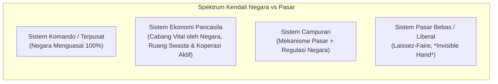

# Konsep Dasar Ilmu Ekonomi — Fondasi Pengambilan Keputusan & Alokasi Sumber Daya! 📊💡

> [!abstract] **Executive Overview (Ringkasan Eksekutif)**
> Ilmu ekonomi pada hakikatnya bukan semata-mata tentang uang atau pasar modal, melainkan studi tentang **perilaku manusia dalam menghadapi kelangkaan (*scarcity*)**. Manusia memiliki kebutuhan dan keinginan yang tidak terbatas (*unlimited wants*), sementara sumber daya (*resources*) yang tersedia untuk memenuhinya bersifat terbatas. Kesenjangan fundamental inilah yang memaksa setiap individu, perusahaan, hingga negara untuk melakukan **pilihan (*choice*)** dan menanggung **biaya peluang (*opportunity cost*)**. Master Dashboard ini menjadi pusat navigasi terpadu untuk menguasai fondasi ekonomi mikro-makro, metodologi berpikir kritis ekonomis, hingga komparasi sistem perekonomian dunia dan Indonesia.

---

## 🗺️ Peta Konsep & Navigasi Modul Pembelajaran

![[mindmap_economics_basic_concepts_dashboard.webp]]

---

## 📚 Akses Modul & Sumber Belajar

| No | Modul Pembelajaran | Fokus & Pokok Bahasan Utama | Tautan Akses |
| :---: | :--- | :--- | :---: |
| **01** | **Kelangkaan, Pilihan, & Biaya Peluang** | Definisi kelangkaan riil, klasifikasi barang, skala prioritas, kalkulasi *Opportunity Cost* vs *Explicit/Sunk Cost*, serta analisis *Production Possibility Frontier* (PPF). | [[Kelangkaan_dan_Biaya_Peluang_SMA\|📖 Buka Modul 1]] |
| **02** | **Metodologi & Prinsip Berpikir Ekonomis** | Pembagian ilmu ekonomi (Deskriptif, Teori, Terapan), Mikro vs Makro, Analisis Positif vs Normatif, dan 10 Prinsip Dasar Ekonomi (*Marginal Thinking* & Insentif). | [[Metodologi_dan_Prinsip_Ekonomi_SMA\|📖 Buka Modul 2]] |
| **03** | **Masalah Pokok & Sistem Perekonomian** | Masalah pokok Klasik vs Modern (*What, How, For Whom*), komparasi 4 sistem ekonomi dunia, serta karakteristik Demokrasi Ekonomi Pancasila (Pasal 33 UUD 1945). | [[Masalah_Pokok_dan_Sistem_Ekonomi_SMA\|📖 Buka Modul 3]] |
| **04** | **Bank Soal Evaluasi HOTS (UTBK-SNBT)** | 30 Soal bertingkat (Level Fondasi, Level Analisis & Hitungan, Level HOTS Penalaran, dan Studi Kasus Esai) dilengkapi kunci jawaban & pembahasan mendalam. | [[Soal_Konsep_Dasar_Ekonomi_SMA\|📝 Buka Bank Soal]] |

---

## 🧮 Cheatsheet Fondasi Konsep & Matriks Inti

### 1. Klasifikasi Biaya dalam Pengambilan Keputusan (*Decision Making*)

| Jenis Biaya | Definisi Operasional | Perlakuan dalam Keputusan Rasional | Contoh Kontekstual |
| :--- | :--- | :--- | :--- |
| **Explicit Cost** (Biaya Riil/Akuntansi) | Pengeluaran moneter aktual yang dibayarkan secara langsung melalui transaksi kas. | Wajib diperhitungkan dalam laba akuntansi dan laba ekonomi. | Membayar uang kuliah Rp10.000.000/semester atau sewa ruko. |
| **Implicit / Opportunity Cost** (Biaya Peluang) | Nilai manfaat dari **alternatif terbaik berikutnya** yang dikorbankan ketika memilih suatu tindakan. | **Wajib** diperhitungkan dalam evaluasi laba ekonomi (*Economic Profit*). | Gaji Rp5.000.000/bulan yang hilang karena memilih kuliah purna waktu. |
| **Sunk Cost** (Biaya Hangus) | Biaya masa lalu yang telah terjadi dan **tidak dapat dipulihkan kembali** apa pun keputusan yang diambil. | **Wajib diabaikan** (*irrelevant cost*) agar tidak terjebak bias psikologis (*Sunk Cost Fallacy*). | Tiket konser non-refundable Rp1.500.000 saat kondisi badan mendadak sakit parah. |

$$\text{Economic Profit} = \text{Total Revenue} - (\text{Explicit Costs} + \text{Implicit Costs})$$
$$\text{Accounting Profit} = \text{Total Revenue} - \text{Explicit Costs}$$

---

### 2. Matriks Komparasi Ruang Lingkup: Mikro vs Makro

| Dimensi Pembeda | Ekonomi Mikro (*Microeconomics*) | Ekonomi Makro (*Macroeconomics*) |
| :--- | :--- | :--- |
| **Unit Analisis** | Unit individual (konsumen, rumah tangga keluarga, satu perusahaan, pasar satu komoditas). | Agregat / perekonomian nasional & global secara keseluruhan. |
| **Fokus Utama** | Alokasi sumber daya secara efisien dan mekanisme pembentukan harga pasar. | Tingkat penggunaan kapasitas produksi, stabilitas harga umum, dan pertumbuhan ekonomi. |
| **Variabel Kunci** | Harga barang $P$, kuantitas $Q$, elastisitas, biaya produksi perusahaan $TC$, upah sektor tertentu. | Pendapatan Nasional ($GDP/GNP$), Inflasi ($\pi$), Pengangguran ($u$), Neraca Pembayaran ($BOP$), Kebijakan Fiskal & Moneter. |
| **Asumsi Utama** | Kondisi pasar lainnya konstan (*Ceteris Paribus*). | Mengakui adanya efek *feedbacks* dan interaksi antar-pasar agregat. |

---

### 3. Matriks Masalah Pokok Ekonomi: Klasik vs Modern

| Paradigma | Pertanyaan / Fokus Masalah | Inti Tantangan Ekonomi |
| :--- | :--- | :--- |
| **Klasik** *(Adam Smith, David Ricardo)* | **1. Produksi:** Bagaimana barang diciptakan. **2. Distribusi:** Bagaimana barang sampai ke konsumen. **3. Konsumsi:** Apakah barang dikonsumsi tepat guna. | Menjamin arus barang dan jasa mengalir lancar dari produsen hingga habis dikonsumsi. |
| **Modern** *(Paul A. Samuelson)* | **1. What:** Komoditas apa yang harus diproduksi dan berapa jumlahnya ($Q$)? **2. How:** Bagaimana teknik dan kombinasi faktor produksi yang digunakan (Padat Modal vs Padat Karya)? **3. For Whom:** Siapa yang menikmati hasil produksi dan bagaimana distribusi pendapatannya? | Mengatasi masalah alokasi efisiensi teknis dan distribusi keadilan sosial di tengah kelangkaan sumber daya. |

---

### 4. Ringkasan Ciri 5 Sistem Perekonomian

| Sistem Ekonomi | Hak Milik Sumber Daya | Penentu Alokasi & Harga | Peran Pemerintah | Kelemahan Utama |
| :--- | :--- | :--- | :--- | :--- |
| **Tradisional** | Komunal / adat setempat | Kebiasaan turun-temurun & barter | Sangat terbatas / penegak adat | Produktivitas sangat rendah, sulit berkembang |
| **Komando / Terpusat** | Milik mutlak negara | Perencanaan terpusat (*Central Planning*) | Dominan dan absolut | Matinya inisiatif individu, inefisiensi birokrasi |
| **Pasar Bebas / Liberal** | Milik swasta / individu penuh | Mekanisme pasar bebas (*Invisible Hand*) | Sangat minimal (*Night-watchman state*) | Ketimpangan pendapatan tajam, rawan monopoli |
| **Campuran (*Mixed*)** | Kolaborasi pemerintah & swasta | Interaksi pasar yang dikontrol regulasi | Regulator, stabilisator, & penyedia *public goods* | Batasan peran negara dan pasar terkadang rawan korupsi |
| **Pancasila (Indonesia)** | Usaha bersama berasas kekeluargaan (Pasal 33 UUD 1945) | Mekanisme pasar berkeadilan sosial | Menguasai cabang produksi vital & hajat hidup orang banyak | Memerlukan tata kelola BUMN yang transparan dan bebas rente |

---

> [!tip] **Panduan Belajar:**
> Mulailah dari **[[Kelangkaan_dan_Biaya_Peluang_SMA|Modul 1]]** untuk membangun intuisi matematis dan grafis mengenai biaya peluang dan kurva PPF, lanjutkan ke **[[Metodologi_dan_Prinsip_Ekonomi_SMA|Modul 2]]** untuk mengasah pola pikir ekonom, pelajari **[[Masalah_Pokok_dan_Sistem_Ekonomi_SMA|Modul 3]]** untuk melihat spektrum kebijakan makro, dan uji pemahamanmu di **[[Soal_Konsep_Dasar_Ekonomi_SMA|Bank Soal HOTS]]**.
