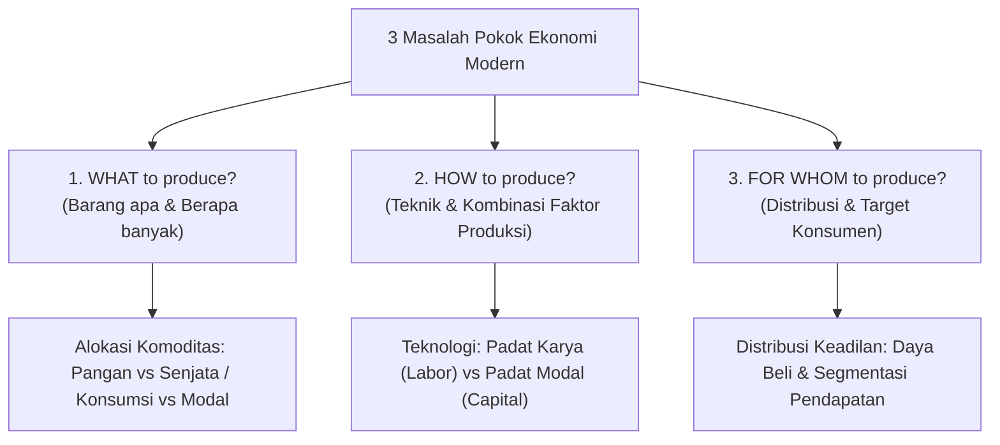
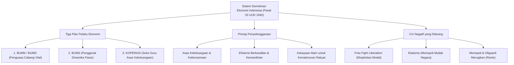

[[Konsep_Dasar_Ekonomi_SMA|🏠 Master Dashboard]] | [[Metodologi_dan_Prinsip_Ekonomi_SMA|⬅️ Modul 2: Metodologi & Prinsip]] | **Modul 3: Masalah & Sistem Ekonomi** | [[Soal_Konsep_Dasar_Ekonomi_SMA|📝 Bank Soal ➡️]]

---

# Masalah Pokok Ekonomi & Sistem Perekonomian — Menjawab What, How, & For Whom! 🌍⚙️

> [!abstract] **Ringkasan Inti Modul (Core Summary)**
> Setiap peradaban manusia menghadapi tantangan mendasar yang sama: bagaimana mengalokasikan sumber daya yang langka untuk memenuhi kebutuhan warganya. Modul ini menelaah evolusi **Masalah Pokok Ekonomi**, mulai dari pandangan Klasik (Produksi, Distribusi, Konsumsi) hingga perumusan Modern Paul Samuelson (**What, How, For Whom**). Untuk menjawab ketiga pertanyaan tersebut, berbagai negara mengadopsi **Sistem Perekonomian** yang berbeda—mulai dari Tradisional, Komando, Pasar Bebas, hingga Campuran. Modul ini secara khusus mengkaji **Sistem Ekonomi Pancasila / Demokrasi Ekonomi Indonesia** berdasarkan UUD 1945 Pasal 33 dan sinergi tiga pilar (BUMN, BUMS, Koperasi).

---

## 1. Evolusi Masalah Pokok Ekonomi: Klasik vs Modern

Dalam sejarah pemikiran ekonomi, perumusan mengenai apa yang menjadi "masalah utama" mengalami pergeseran dari proses fisik arus barang (Klasik) ke masalah alokasi efisiensi dan keadilan (Modern).

```
 ┌────────────────────────────────────────┐     ┌────────────────────────────────────────┐
 │      PARADIGMA EKONOMI KLASIK          │     │        PARADIGMA EKONOMI MODERN        │
 │     (Fokus: Alur Fisik Komoditas)      │     │    (Fokus: Alokasi Sumber Daya & Nilai)│
 ├────────────────────────────────────────┤     ├────────────────────────────────────────┤
 │ 1. PRODUKSI: Cara menciptakan barang.  │     │ 1. WHAT: Komoditas apa & berapa banyak?│
 │ 2. DISTRIBUSI: Penyaluran ke konsumen. │ ──► │ 2. HOW: Metode & kombinasi teknologi? │
 │ 3. KONSUMSI: Penggunaan nilai guna.    │     │ 3. FOR WHOM: Siapa penikmat & pembagian│
 └────────────────────────────────────────┘     └────────────────────────────────────────┘
```

---

### A. Masalah Pokok Ekonomi Klasik (Mazhab Naturalis/Klasik)
Dipelopori oleh Adam Smith dan David Ricardo, mazhab klasik memandang perekonomian berjalan lancar jika tiga tahapan aktivitas ekonomi tidak mengalami hambatan fisik:
1. **Masalah Produksi:** Bagaimana produsen dapat menghasilkan barang dan jasa yang dibutuhkan masyarakat menggunakan faktor produksi yang tersedia.
2. **Masalah Distribusi:** Bagaimana barang yang telah diproduksi dapat tersalurkan hingga ke tangan konsumen akhir secara tepat waktu, tepat lokasi, dan tidak rusak (melalui saluran distribusi langsung, semi-langsung, atau perantara).
3. **Masalah Konsumsi:** Apakah barang dan jasa yang telah sampai benar-benar dikonsumsi dan mampu memuaskan kebutuhan konsumen atau justru terbuang percuma (*waste*).

---

### B. Masalah Pokok Ekonomi Modern (Paul A. Samuelson Framework)
Ekonom peraih Nobel, Paul Samuelson, merumuskan bahwa di tengah kelangkaan sumber daya, setiap masyarakat modern harus menjawab **Tiga Pertanyaan Fundamental**:



#### 1. *What to Produce and How Much?* (Barang Apa dan Berapa Banyak?)
* **Substansi:** Menentukan jenis komoditas yang harus diproduksi dan skala volumenya. Mengingat sumber daya terbatas, memproduksi lebih banyak satu barang berarti mengurangi barang lain (*Trade-off PPF*).
* **Mekanisme Penentu:** Ditentukan oleh interaksi preferensi konsumen (*consumer sovereignty*) dan sinyal harga di pasar.
* *Contoh Riil:* Apakah lahan pertanian di Karawang harus dipertahankan untuk memproduksi padi atau dialihfungsikan menjadi kawasan pabrik cip semikonduktor?

#### 2. *How to Produce?* (Bagaimana Cara Memproduksinya?)
* **Substansi:** Memilih teknik produksi, efisiensi biaya, kombinasi input faktor produksi, dan standar keberlanjutan lingkungan.
* **Dilema Utama:**
  * **Padat Karya (*Labor-Intensive*):** Menggunakan proporsi tenaga kerja manusia lebih besar. Keunggulan: Menyerap banyak lapangan kerja dan mengurangi pengangguran. Kelemahan: Kecepatan dan presisi terbatas.
  * **Padat Modal (*Capital-Intensive*):** Menggunakan mesin berteknologi tinggi, otomasi, dan robotika. Keunggulan: Skala ekonomi (*economies of scale*), biaya per unit murah, presisi tinggi. Kelemahan: Membutuhkan investasi modal raksasa dan berpotensi memicu PHK pekerja manual.
* *Contoh Riil:* Industri rokok kretek di Indonesia yang menyeimbangkan antara sigaret kretek tangan (SKT - padat karya) dengan sigaret kretek mesin (SKM - padat modal).

#### 3. *For Whom to Produce?* (Untuk Siapa Barang Diproduksi?)
* **Substansi:** Menentukan bagaimana output nasional didistribusikan kepada anggota masyarakat; siapa yang berhak menikmati barang/jasa dan bagaimana keadilan distribusi pendapatan tercapai.
* **Mekanisme Penentu:** Bergantung pada distribusi pendapatan, daya beli, kepemilikan faktor produksi, serta program redistribusi pemerintah (pajak progresif, bantuan sosial, subsidi).
* *Contoh Riil:* Apakah perumahan yang dibangun oleh pengembang ditujukan untuk masyarakat berpenghasilan rendah (KPR Bersubsidi) atau kondominium mewah untuk ekspatriat dan investor?

---

## 2. Komparasi Sistem Perekonomian Dunia

Sistem ekonomi adalah seperangkat institusi, norma, aturan hukum, dan mekanisme yang digunakan oleh suatu negara untuk mengorganisasi dan mengalokasikan sumber daya dalam menjawab masalah pokok *What, How,* dan *For Whom*.

```
   KONTROL NEGARA MUTLAK                                              MEKANISME PASAR BEBAS
 ◄─────────────────────────────────────────────────────────────────────────────────────────►
   Sistem Komando / Sosialis          Sistem Campuran / Pancasila          Sistem Pasar Bebas / Liberal
   (Korea Utara, Eks Uni Soviet)      (Indonesia, Prancis, Skandinavia)   (Hong Kong, AS, Singapura)
```

### Tabel Matriks Analisis Sistem Ekonomi

| Karakteristik | 1. Sistem Tradisional | 2. Sistem Komando (Sosialis/Terpusat) | 3. Sistem Pasar Bebas (Liberal/Kapitalis) | 4. Sistem Campuran (*Mixed Economy*) |
| :--- | :--- | :--- | :--- | :--- |
| **Tokoh / Landasan** | Norma adat, tradisi suku | Karl Marx (*Das Kapital*) | Adam Smith (*Wealth of Nations*) | J.M. Keynes, Paul Samuelson |
| **Kepemilikan Sumber Daya** | Milik bersama / komunal adat | Dikuasai 100% mutlak oleh negara | Hak milik pribadi/swasta diakui mutlak | Swasta & Negara berbagi kepemilikan |
| **Penentu *What, How, For Whom*** | Adat istiadat & kebutuhan subsisten | Badan Perencana Pusat (*Gosplan/State*) | Interaksi penawaran-permintaan (*Invisible Hand*) | Mekanisme pasar dengan pengawasan/regulasi negara |
| **Peran Pemerintah** | Tidak ada peran formal negara | Mengatur seluruh harga, produksi, & distribusi | Sangat minim (*Laissez-faire, night-watchman state*) | Regulator, stabilisator, & produsen barang publik |
| **Kelebihan Utama** | - Hubungan sosial erat<br/>- Tidak ada ketimpangan tajam | - Mudah mengontrol inflasi & krisis<br/>- Distribusi pendapatan merata | - Inovasi & efisiensi sangat tinggi<br/>- Kebebasan ekonomi individu terjamin | - Menggabungkan efisiensi pasar & perlindungan sosial<br/>- Mencegah monopoli liar |
| **Kelemahan Kritis** | - Produktivitas sangat rendah<br/>- Menolak inovasi teknologi | - Mematikan inisiatif & kreativitas individu<br/>- Rawan inefisiensi birokrasi & kelangkaan | - Ketimpangan kaya-miskin ekstrem<br/>- Rawan monopoli & eksternalitas negatif (polusi) | - Risiko tarik-menarik kepentingan politik dalam penetapan subsidi/regulasi |
| **Contoh Riil** | Masyarakat pedalaman terisolasi | Korea Utara, Kuba | Swasta AS, Hong Kong, Singapura (relatif) | Mayoritas negara dunia (Jerman, Inggris, Jepang) |

---

## 3. Sistem Perekonomian Indonesia: Demokrasi Ekonomi Pancasila

Sistem perekonomian yang berlaku di Indonesia bukanlah kapitalisme liberal murni dan bukan pula sosialisme komando, melainkan **Sistem Demokrasi Ekonomi yang berlandaskan Pancasila dan UUD 1945**.



---

### A. Landasan Konstitusional: UUD 1945 Pasal 33

Pasal 33 UUD 1945 merupakan roh utama arsitektur perekonomian nasional Indonesia:

> **UUD 1945 Pasal 33:**
> 1. *Perekonomian disusun sebagai usaha bersama berdasar atas asas kekeluargaan.*
> 2. *Cabang-cabang produksi yang penting bagi negara dan yang menguasai hajat hidup orang banyak dikuasai oleh negara.*
> 3. *Bumi dan air dan kekayaan alam yang terkandung di dalamnya dikuasai oleh negara dan dipergunakan untuk sebesar-besar kemakmuran rakyat.*
> 4. *Perekonomian nasional diselenggarakan berdasar atas demokrasi ekonomi dengan prinsip kebersamaan, efisiensi berkeadilan, berkelanjutan, berwawasan lingkungan, kemandirian, serta dengan menjaga keseimbangan kemajuan dan kesatuan ekonomi nasional.*

---

### B. Sinergi Tiga Pilar Pelaku Ekonomi Indonesia

```
 ┌──────────────────────────┬──────────────────────────┬──────────────────────────┐
 │       BUMN / BUMD        │          KOPERASI        │          BUMS            │
 ├──────────────────────────┼──────────────────────────┼──────────────────────────┤
 │ • Pengelola cabang vital │ • Soko guru ekonomi      │ • Penggerak inovasi,     │
 │   & sumber daya strategis│ • Berasas kekeluargaan   │   efisiensi pasar, &     │
 │ • *Agent of Development* │ • Menyejahterakan anggota│   investasi swasta       │
 │ • (PLN, Pertamina, KAI)  │ • (KUD, KSP, Koperasi)   │ • (PT, CV, Firma, UD)    │
 └──────────────────────────┴──────────────────────────┴──────────────────────────┘
```

1. **Badan Usaha Milik Negara / Daerah (BUMN/BUMD):**
   * Berperan sebagai perintis sektor-sektor usaha yang belum diminati swasta, penyedia layanan publik vital (*public service obligation*), dan stabilisator harga barang strategis (contoh: pasokan listrik oleh PLN, BBM oleh Pertamina, logistik beras oleh Perum Bulog).
2. **Koperasi:**
   * Dirancang oleh Mohammad Hatta sebagai **soko guru (tiang penyangga utama)** perekonomian nasional karena strukturnya yang demokratis (*one member, one vote*) dan berorientasi pada kesejahteraan anggota bersama, bukan sekadar memburu dividen modal.
3. **Badan Usaha Milik Swasta (BUMS):**
   * Membuka lapangan kerja massal, mendorong alih teknologi, meningkatkan daya saing ekspor, dan menciptakan penerimaan pajak bagi kas negara.

---

### C. Karakteristik Positif vs Hal-Hal Tabu (Negatif) dalam Demokrasi Ekonomi

#### Karakteristik Positif yang Wajib Dikembangkan:
* Perekonomian disusun secara partisipatif demi kemakmuran bersama (*welfare state*).
* Warga negara memiliki kebebasan memilih pekerjaan dan penghidupan yang layak.
* Hak milik perorangan diakui secara sah oleh hukum selama pemanfaatannya tidak bertentangan dengan kepentingan umum.
* Fakir miskin dan anak-anak terlantar dipelihara oleh negara (Pasal 34 UUD 1945).

#### Tiga Ciri Negatif yang Wajib Dihindari (*Economic Traps*):
1. ***Free Fight Liberalism:*** Sistem persaingan bebas tanpa batas yang menumbuhkan eksploitasi manusia dan penindasan terhadap kaum ekonomi lemah oleh pemodal besar.
2. ***Etatisme:*** Dominasi negara yang terlalu kaku dan absolut sehingga mematikan inisiatif, daya kreasi, dan ruang gerak unit-unit ekonomi swasta.
3. ***Pemusatan Kekuatan Ekonomi (Monopoli & Kartel Rente):** Penguasaan pasar oleh segelintir kelompok konglomerasi yang mendikte harga dan menindas konsumen (dilarang dalam UU No. 5 Tahun 1999 tentang Larangan Praktek Monopoli dan Persaingan Usaha Tidak Sehat).

---

[[Konsep_Dasar_Ekonomi_SMA|🏠 Master Dashboard]] | [[Metodologi_dan_Prinsip_Ekonomi_SMA|⬅️ Modul 2: Metodologi & Prinsip]] | **Modul 3: Masalah & Sistem Ekonomi** | [[Soal_Konsep_Dasar_Ekonomi_SMA|📝 Bank Soal ➡️]]
