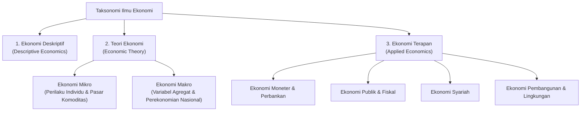
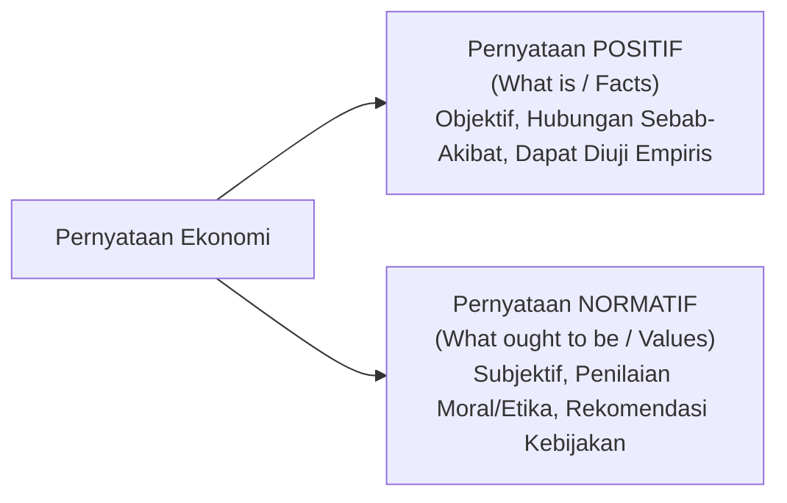

[[Konsep_Dasar_Ekonomi_SMA|🏠 Master Dashboard]] | [[Kelangkaan_dan_Biaya_Peluang_SMA|⬅️ Modul 1: Kelangkaan & Biaya Peluang]] | **Modul 2: Metodologi & Prinsip** | [[Masalah_Pokok_dan_Sistem_Ekonomi_SMA|Modul 3: Masalah & Sistem Ekonomi ➡️]] | [[Soal_Konsep_Dasar_Ekonomi_SMA|📝 Bank Soal]]

---

# Metodologi, Cabang, dan Prinsip Berpikir Ekonomis — Membedah Cara Kerja Pikiran Ekonom 🧠🔍

> [!abstract] **Ringkasan Inti Modul (Core Summary)**
> Menjadi pembelajar ekonomi bukan hanya menghafal definisi, melainkan melatih cara berpikir analitis (*thinking like an economist*). Modul ini mengulas pembagian cabang keilmuan ekonomi (Deskriptif, Teori, dan Terapan), membedah dikotomi klasik antara **Ekonomi Mikro** (analisis perilaku individual dan mekanisme pasar) dan **Ekonomi Makro** (analisis kinerja perekonomian agregat nasional), serta membedakan secara tegas antara analisis fakta objektif (**Ekonomi Positif**) dan pertimbangan nilai/kebijakan (**Ekonomi Normatif**). Selain itu, modul ini membedah **10 Prinsip Dasar Ekonomi Mankiw** dengan penekanan khusus pada *Marginal Thinking* ($MB \ge MC$) dan respons rasional terhadap insentif.

---

## 1. Taksonomi Pembagian Ilmu Ekonomi

Ilmu ekonomi dikelompokkan ke dalam tiga pilar utama berdasarkan fungsi metodologisnya:



### A. Tiga Pilar Keilmuan:
1. **Ekonomi Deskriptif (*Descriptive Economics*):**
   * Mengumpulkan, mendeskripsikan, dan memaparkan fakta atau data empiris riil mengenai kondisi perekonomian tanpa menarik kesimpulan teoritis.
   * *Contoh:* Data publikasi Badan Pusat Statistik (BPS) tentang tingkat pengangguran terbuka Indonesia sebesar 4,82% pada 2024, atau laporan neraca perdagangan migas Indonesia.
2. **Teori Ekonomi (*Economic Theory / Economic Analysis*):**
   * Menyusun kerangka konseptual, model matematis, dan generalisasi hubungan sebab-akibat (*cause and effect*) yang disederhanakan dari realitas dunia nyata.
   * Terbagi menjadi **Ekonomi Mikro** dan **Ekonomi Makro**.
3. **Ekonomi Terapan (*Applied Economics*):**
   * Memanfaatkan prinsip dan model teori ekonomi untuk merumuskan solusi praktis, pedoman tindakan, atau perumusan kebijakan publik (*public policy*) dalam bidang-bidang khusus.
   * *Contoh:* Ekonomi Moneter (analisis BI-Rate), Ekonomi Lingkungan (kebijakan pajak karbon), Ekonomi Syariah, Ekonomi Internasional (kebijakan tarif impor).

---

## 2. Komparasi Mendalam: Ekonomi Mikro vs Ekonomi Makro

```
                     EKONOMI MIKRO                            EKONOMI MAKRO
          ┌───────────────────────────────────┐    ┌───────────────────────────────────┐
          │  🔍 Analisis Satuan Individual   │    │  🔭 Analisis Agregat Nasional    │
          │  • Keputusan Konsumen & Produsen  │    │  • Total Output PDB Nasional      │
          │  • Harga Keseimbangan Pasar Kopi  │    │  • Laju Inflasi & Daya Beli Riil  │
          │  • Struktur Pasar Monopoli/Oligopoli│  │  • Kebijakan Suku Bunga & Pajak   │
          │  • Asumsi Utama: Ceteris Paribus  │    │  • Interaksi Multi-Sektor Global  │
          └───────────────────────────────────┘    └───────────────────────────────────┘
```

### Tabel Matriks Perbandingan Parameter

| Dimensi Komparasi | Ekonomi Mikro (*Microeconomics*) | Ekonomi Makro (*Macroeconomics*) |
| :--- | :--- | :--- |
| **Tokoh Pelopor Utama** | Adam Smith, Alfred Marshall | John Maynard Keynes |
| **Unit Analisis** | Pelaku ekonomi individu (satu konsumen, satu rumah tangga, satu perusahaan, atau pasar untuk satu barang spesifik). | Perekonomian secara agregat/menyeluruh (seluruh industri, total masyarakat, perekonomian antar-negara). |
| **Fokus Masalah** | Alokasi sumber daya yang efisien dan pembentukan harga relatif suatu komoditas. | Penggunaan penuh kapasitas produksi nasional, kestabilan moneter, dan laju pertumbuhan ekonomi jangka panjang. |
| **Variabel Kunci** | - Harga barang spesifik ($P_x$)<br/>- Kuantitas permintaan/penawaran ($Q_d, Q_s$)<br/>- Biaya produksi marjinal ($MC$)<br/>- Elastisitas harga dan pendapatan. | - Produk Domestik Bruto ($GDP/GNP$)<br/>- Laju Inflasi umum ($\pi$)<br/>- Tingkat Pengangguran Terbuka ($u$)<br/>- Neraca Pembayaran ($BOP$) & Nilai Tukar ($Kurs$). |
| **Instrumen Analisis** | Teori Perilaku Konsumen (Utilitas), Teori Produksi & Biaya, Struktur Pasar (Persaingan Sempurna vs Tidak Sempurna). | Model Pendapatan Nasional ($Y = C + I + G + NX$), Kebijakan Fiskal (APBN), Kebijakan Moneter (BI-Rate, GWM, Operasi Pasar Terbuka). |
| **Asumsi Metodologis** | ***Ceteris Paribus*** (faktor-faktor lain di luar variabel yang sedang diamati dianggap konstan/tetap). | Memperhitungkan efek umpan balik (*multiplier effect*, efek *crowding-out*, transmisi moneter). |

---

## 3. Metodologi Analisis: Pernyataan Positif vs Normatif

Salah satu keahlian esensial dalam analisis ekonomi adalah memisahkan fakta ilmiah yang objektif dari preferensi kebijakan yang subjektif.



### A. Dekonstruksi Karakteristik:
1. **Ekonomi Positif (*Positive Economics*):**
   * Mengkaji fenomena ekonomi sebagaimana adanya di dunia nyata berdasarkan logika sebab-akibat ilmiah (*cause-and-effect relationships*).
   * **Bebas Nilai (*Value-Free*):** Tidak memuat penilaian moral atau opini baik-buruk.
   * **Dapat Diuji (*Falsifiable / Testable*):** Kebenaran pernyataannya dapat diverifikasi atau dibantah menggunakan data statistik riil.
   * *Ciri Linguistik:* Menggunakan kata kerja deskriptif (*meningkatkan*, *menurunkan*, *menyebabkan*, *apabila... maka...*).
2. **Ekonomi Normatif (*Normative Economics*):**
   * Mengkaji apa yang **seharusnya terjadi** (*what ought to be / what should be*).
   * **Sarat Nilai (*Value-Laden*):** Didasarkan pada pertimbangan etika, keadilan sosial, ideologi politik, atau visi moral pembuat kebijakan.
   * **Tidak Dapat Diuji Secara Statistik:** Pernyataan normatif tidak bisa dibuktikan benar/salah hanya dengan data, melainkan disepakati melalui konsensus sosial atau politik.
   * *Ciri Linguistik:* Mengandung kata persuasif/keharusan (*sebaiknya*, *seharusnya*, *harus*, *tidak adil*, *terlalu tinggi*).

### B. Studi Kasus Komparasi Kontekstual Indonesia

| Topik Kebijakan | Pernyataan Positif (Fakta / Sebab-Akibat) | Pernyataan Normatif (Opini / Nilai / Kebijakan) |
| :--- | :--- | :--- |
| **Kenaikan Tarif PPN (12%)** | *"Kenaikan tarif PPN dari 11% menjadi 12% akan meningkatkan penerimaan pajak negara sebesar Rp80 triliun, namun berpotensi menekan daya beli masyarakat desil menengah ke bawah."* | *"Pemerintah seharusnya membatalkan kenaikan tarif PPN 12% karena kebijakan tersebut sangat tidak adil bagi kelas pekerja menengah."* |
| **Subsidi Energi (BBM)** | *"Pencabutan subsidi BBM jenis pertalite akan memicu kenaikan inflasi bulanan sebesar 0,6% akibat lonjakan biaya logistik."* | *"Anggaran subsidi energi sebaiknya dialihkan seluruhnya untuk subsidi pendidikan vokasi dan pembangunan rumah sakit gratis di pelosok."* |
| **Upah Minimum (UMR/UMP)** | *"Peningkatan Upah Minimum Provinsi sebesar 15% di atas produktivitas tenaga kerja akan meningkatkan pengangguran pada pekerja muda non-terampil."* | *"Setiap pekerja layak menerima upah minimum yang manusiawi agar kesenjangan ekonomi tidak semakin melebar."* |

---

## 4. Sepuluh Prinsip Dasar Ekonomi (N. Gregory Mankiw)

Ekonom Harvard University, N. Gregory Mankiw, merumuskan 10 prinsip fundamental yang menjelaskan bagaimana perekonomian beroperasi:

```
                  ┌─────────────────────────────────────────────────────────┐
                  │            10 PRINSIP DASAR EKONOMI MANKIW             │
                  └─────────────────────────────────────────────────────────┘
                                               │
       ┌───────────────────────────────────────┼───────────────────────────────────────┐
       ▼                                       ▼                                       ▼
[ PENGAMBILAN KEPUTUSAN ]             [ INTERAKSI DI PASAR ]             [ PEREKONOMIAN AGREGAT ]
1. Trade-offs (Pilihan)               5. Perdagangan Menguntungkan       8. Standar Hidup = Produktivitas
2. Biaya = Opportunity Cost           6. Pasar Mengatur Aktivitas         9. Cetak Uang = Inflasi
3. Berpikir Marjinal (MB vs MC)       7. Intervensi Saat Market Failure 10. Trade-off Inflasi vs Pengangguran
4. Respon Terhadap Insentif
```

### Kategori I: Bagaimana Individu Mengambil Keputusan (*How People Make Decisions*)

1. **Prinsip 1: Setiap Orang Menghadapi *Trade-Off* (*People Face Trade-offs*)**
   * *"There is no such thing as a free lunch."* Untuk mendapatkan sesuatu yang kita sukai, kita harus mengorbankan hal lain yang juga bernilai.
   * *Trade-off Nasional:* **Efisiensi (*Efficiency*) vs Keadilan/Pemerataan (*Equity*)**. Efisiensi berarti ukuran kue ekonomi maksimal; pemerataan berarti bagaimana potongan kue dibagi rata ke seluruh masyarakat.
2. **Prinsip 2: Biaya Suatu Barang adalah Apa yang Dikorbankan untuk Mendapatkannya**
   * Keputusan rasional mensyaratkan perbandingan antara biaya riil dan biaya peluang (*Opportunity Cost*).
3. **Prinsip 3: Orang Rasional Berpikir pada Batas Marjinal (*Rational People Think at the Margin*)**
   * Keputusan dalam hidup jarang bersifat ekstrem "hitam-putih" (misal: belajar 24 jam nonstop vs tidak belajar sama sekali), melainkan berupa perubahan bertahap (*marginal changes*).
   * **Kaidah Keputusan Rasional:** Suatu tindakan hanya akan diambil jika dan hanya jika:
     $$\text{Marginal Benefit (MB)} \ge \text{Marginal Cost (MC)}$$
4. **Prinsip 4: Orang Tanggap Terhadap Insentif (*People Respond to Incentives*)**
   * Insentif adalah imbalan atau hukuman (prospek keuntungan/kerugian) yang mendorong seseorang bertindak.
   * *Contoh:* Ketika harga bensin melonjak tinggi, masyarakat beralih menggunakan transportasi umum atau membeli kendaraan listrik.

---

### Kategori II: Bagaimana Manusia Berinteraksi (*How People Interact*)

5. **Prinsip 5: Perdagangan Menguntungkan Semua Pihak (*Trade Can Make Everyone Better Off*)**
   * Perdagangan antar-individu atau antar-negara bukan permainan *zero-sum* (satu pihak untung, pihak lain rugi), melainkan menciptakan spesialisasi berdasarkan **Keunggulan Komparatif (*Comparative Advantage*)**.
6. **Prinsip 6: Pasar Biasanya Merupakan Cara yang Baik untuk Mengorganisasi Kegiatan Ekonomi**
   * Dalam perekonomian pasar, jutaan keputusan produsen dan konsumen dikoordinasikan secara otomatis oleh harga melalui mekanisme **"Tangan Tak Terlihat" (*The Invisible Hand*)** yang digagas Adam Smith (1776).
7. **Prinsip 7: Pemerintah Kadang Kala Mampu Meningkatkan Hasil Pasar**
   * Pasar bebas tidak sempurna dan dapat mengalami **Kegagalan Pasar (*Market Failure*)**, yang disebabkan oleh:
     * **Eksternalitas (*Externality*):** Dampak tindakan satu pihak terhadap pihak ketiga tanpa kompensasi (contoh: polusi pabrik tekstil).
     * **Kekuatan Pasar (*Market Power / Monopoly*):** Satu pelaku usaha mampu mendikte harga secara sepihak dan merugikan konsumen.
   * Pemerintah melakukan intervensi melalui regulasi antimonopoli, pajak pencemaran, atau penyediaan barang publik (*public goods*).

---

### Kategori III: Bagaimana Perekonomian Bekerja Secara Agregat (*How the Economy as a Whole Works*)

8. **Prinsip 8: Standar Hidup Suatu Negara Bergantung pada Kemampuannya Memproduksi Barang dan Jasa**
   * Perbedaan standar hidup dan pendapatan per kapita antar-negara berakar dari perbedaan **Produktivitas (*Productivity*)**, yaitu jumlah barang dan jasa yang dihasilkan dari setiap satu jam kerja tenaga kerja.
9. **Prinsip 9: Harga-Harga Meningkat Jika Pemerintah Mencetak Uang Terlalu Banyak**
   * Laju pencetakan uang yang melampaui pertumbuhan output riil barang/jasa akan menurunkan nilai tukar uang tersebut dan memicu **Inflasi (*Inflation*)**.
10. **Prinsip 10: Masyarakat Menghadapi *Trade-Off* Jangka Pendek Antara Inflasi dan Pengangguran**
    * Dalam jangka pendek (1–3 tahun), peningkatan jumlah uang beredar menstimulasi belanja, meningkatkan permintaan agregat, mendorong perekrutan tenaga kerja, namun memicu kenaikan inflasi (**Kurva Phillips Jangka Pendek**).

---

## 5. Aplikasi Matematis: Marginal Thinking ($MB \ge MC$)

Konsep *marginalism* adalah pembeda utama antara pola pikir awam dengan pola pikir ekonom.

$$\Delta \text{Net Benefit} = MB - MC$$

### Contoh Kasus Maskapai Penerbangan:
Sebuah pesawat komersial berkapasitas 200 kursi terbang rute Jakarta–Bali dengan total biaya operasional Rp100.000.000.
* **Biaya Rata-Rata per Kursi (*Average Cost*):** $\frac{\text{Rp100.000.000}}{200} = \text{Rp500.000}$.
* Sesaat sebelum pintu pesawat ditutup, tersisa 2 kursi kosong. Ada calon penumpang di *gate* yang menawar tiket seharga **Rp300.000**.
* **Pertanyaan:** Apakah maskapai harus menolak karena Rp300.000 lebih rendah dari biaya rata-rata Rp500.000?
* **Analisis Ekonom Rasional:**
  * Biaya Marjinal (*Marginal Cost*) untuk mengangkut 1 penumpang tambahan di kursi yang sudah kosong hanyalah biaya 1 porsi makanan ringan dan sedikit bahan bakar tambahan (misal: Rp50.000).
  * Manfaat Marjinal (*Marginal Benefit*): Tambahan uang kas Rp300.000.
  * Karena $MB (\text{Rp300.000}) > MC (\text{Rp50.000})$, maskapai **harus menjual tiket tersebut** karena menghasilkan tambahan laba bersih Rp250.000.

---

[[Konsep_Dasar_Ekonomi_SMA|🏠 Master Dashboard]] | [[Kelangkaan_dan_Biaya_Peluang_SMA|⬅️ Modul 1: Kelangkaan & Biaya Peluang]] | **Modul 2: Metodologi & Prinsip** | [[Masalah_Pokok_dan_Sistem_Ekonomi_SMA|Modul 3: Masalah & Sistem Ekonomi ➡️]] | [[Soal_Konsep_Dasar_Ekonomi_SMA|📝 Bank Soal]]
