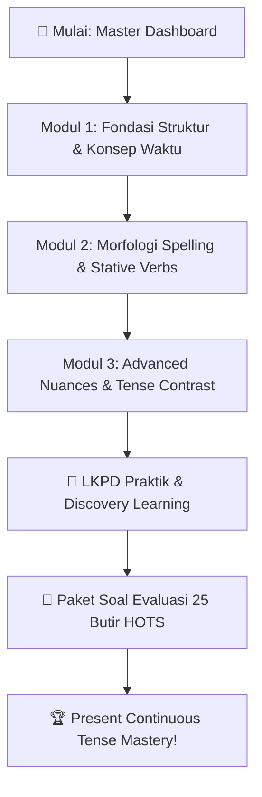

# Present Continuous Tense — Menangkap Dinamika Aksi Saat Ini, Tren Terkini, & Rencana Masa Depan! ⏳⚡

> **Welcome to the Master Hub of Present Continuous Tense!** 👋
> Jika *Simple Present Tense* menggambarkan fondasi hidup yang permanen, rutin, dan statis (*timeless facts & habits*), maka *Present Continuous Tense* adalah lensa kamera dinamis yang menangkap hal-hal yang sedang bergerak, berubah, berlangsung sementara, atau bahkan telah terjadwal rapi untuk masa depan.
>
> Dashboard ini dirancang sebagai pusat komando belajar terpadu. Di sini kamu dapat menavigasi seluruh sub-modul materi inti, melihat peta konsep visual berstandar akademik, mengecek ringkasan rumus kilat (*cheatsheet*), dan langsung mengakses instrumen latihan interaktif (LKPD & Paket Soal HOTS). *Let's capture the action in progress!* 🚀

---

## 🧭 Bilah Navigasi Modul (Quick Navigation)

> [!TIP]
> **Navigasi Cepat Antar Berkas:**
> **🏠 Master Dashboard** · [[Fondasi_Struktur_dan_Waktu_SMA|Modul 1: Fondasi Struktur & Konsep Waktu]] · [[Kaidah_Spelling_dan_Stative_Verbs_SMA|Modul 2: Morfologi Spelling & Stative Verbs]] · [[Advanced_Usage_dan_Nuansa_Khusus_SMA|Modul 3: Advanced Nuances & Tense Contrast]] · [[LKPD_Present_Continuous_Tense_SMA|📝 LKPD Praktik]] · [[Soal_Present_Continuous_Tense_SMA|🎯 Paket Soal Evaluasi]]

---

## 🗺️ Master Concept Map (Peta Konsep Visual)

Berikut adalah ringkasan visual arsitektur dan ekosistem aturan Present Continuous Tense:

![[infographic_languages_present_continuous_master.webp]]

---

## 📚 Struktur & Direktori Sub-Modul Pembelajaran

Paket belajar komprehensif ini dibagi menjadi 3 sub-modul materi inti yang berjenjang dan 2 berkas instrumen evaluasi terstandarisasi di folder `40 Practice/`:

| No | Modul / Dokumen | Fokus Bahasan Utama | Target Kompetensi |
| :---: | :--- | :--- | :--- |
| **01** | [[Fondasi_Struktur_dan_Waktu_SMA\|Modul 1: Fondasi Struktur & Konsep Waktu]] | Hakikat aksi progresif, rumus dasar ($S + \text{be} + V\text{-ing}$), polaritas (+, -, ?), formulasi *Yes/No* & *Wh- Questions*, perbedaan *Subject Question* vs *Object Question*, dan pemetaan 3 dimensi waktu (*Right Now*, *Extended Present / Around Now*, *Temporary Habits*). | Mampu menyusun kalimat kontinu positif, negatif, dan tanya tanpa menghilangkan auxiliary *be* serta membedakan konteks aksi nyata vs aksi sementara. |
| **02** | [[Kaidah_Spelling_dan_Stative_Verbs_SMA\|Modul 2: Morfologi Spelling & Stative Verbs]] | Kaidah ortografi penambahan akhiran *-ing* (*Silent -e drop*, *CVC 1-1-1 doubling rule*, *syllable stress*, *-ie $\to$ -ying*, *-c $\to$ -cking*), taksonomi 5 kelompok *Stative Verbs*, dan analisis verba bermakna ganda (*Dual-Nature / Mixed Verbs*). | Menuliskan ejaan kata kerja bentuk *-ing* dengan nol kesalahan ketik (*zero spelling errors*) dan mahir membedakan verba statis vs dinamis dalam berbagai konteks makna. |
| **03** | [[Advanced_Usage_dan_Nuansa_Khusus_SMA\|Modul 3: Advanced Nuances & Tense Contrast]] | Penggunaan masa depan terencana (*Definite Future Arrangements* vs *Will* vs *Be Going To*), kejengkelan emosional (*Annoying Habits with 'Always'*), tren transisi (*Changing States*), latar adegan naratif (*Scene Setting*), dan matriks komparasi *Simple Present* vs *Present Continuous*. | Menguasai analisis wacana tingkat lanjut, membedakan nuansa pragmatis dan nada bicara (*tone*), serta menaklukkan soal-soal penalaran HOTS level ujian standar (UTBK/TOEFL/IELTS). |
| **04** | [[LKPD_Present_Continuous_Tense_SMA\|Lembar Kerja Peserta Didik (LKPD)]] | 5 Aktivitas Penjelajahan: *Guided Discovery & Text Mining*, *Morpho-Spelling & Stative Matrix*, *Sentence Transformation Challenge*, *Detektif Jebakan Batman (Error Spotting)*, dan *Authentic Micro-Writing Task*. | Mengasah daya analisis gramatikal melalui pendekatan *discovery learning*, penalaran kritis, dan produksi teks kreatif autentik. |
| **05** | [[Soal_Present_Continuous_Tense_SMA\|Paket Soal Evaluasi & Pembahasan]] | 25 Butir Soal Bertingkat (Level 1 Fondasi & Mekanika Dasar, Level 2 Kontekstual & Stative Nuances, Level 3 HOTS Reasoning & Editing) + Kunci Jawaban & Pembahasan Analitis Mendalam. | Mengukur tingkat penguasaan materi secara menyeluruh, terukur, objektif, dan terstandarisasi. |

---

## ⚡ Master Cheatsheet: Rumus & Aturan Kilat

Simpan dan pahami matriks ringkasan rumus di bawah ini sebagai rujukan kilat saat belajar atau mengerjakan soal:

### 1. Matriks Struktur Kalimat ($S + \text{To Be} + V\text{-ing}$)

| Subjek Kalimat | Auxiliary *To Be* | Bentuk Positif (+) | Bentuk Negatif (-) | Bentuk Tanya (Yes/No ?) |
| :--- | :---: | :--- | :--- | :--- |
| **I** | **am** | $I + \text{am} + V\text{-ing}$ 👉 *I **am studying** AI.* | $I + \text{am not} + V\text{-ing}$ 👉 *I **am not sleeping**.* | $\text{Am} + I + V\text{-ing}?$ 👉 ***Am I speaking** clearly?* |
| **He / She / It / Singular Noun** | **is** | $\text{Subj} + \text{is} + V\text{-ing}$ 👉 *She **is writing** code.* | $\text{Subj} + \text{is not (isn't)} + V\text{-ing}$ 👉 *He **isn't listening**.* | $\text{Is} + \text{Subj} + V\text{-ing}?$ 👉 ***Is it raining** outside?* |
| **You / We / They / Plural Noun** | **are** | $\text{Subj} + \text{are} + V\text{-ing}$ 👉 *They **are discussing**.* | $\text{Subj} + \text{are not (aren't)} + V\text{-ing}$ 👉 *We **aren't playing**.* | $\text{Are} + \text{Subj} + V\text{-ing}?$ 👉 ***Are you joining** us?* |

---

### 2. Time Signals (Keterangan Waktu Khas Present Continuous)

Ciri utama Present Continuous Tense adalah keberadaan titik waktu atau rentang waktu yang menekankan **progresivitas atau kesementaraan**:

| Kategori Sinyal Waktu | Anggota Keterangan Waktu | Contoh Penggunaan Kalimat |
| :--- | :--- | :--- |
| **Saat Berbicara (*Right Now*)** | • *now / right now* • *at the moment* • *at present* • *currently* • *Look! / Listen! (Imperative Alerts)* | • *Listen! Someone **is knocking** on the front door.* • *She **is currently analyzing** the dataset.* |
| **Rentang Waktu Sementara (*Around Now*)** | • *these days* • *nowadays* • *this week / this semester* • *for the time being / temporarily* | • *I **am living** in a dormitory this semester.* • *He **is reading** a fascinating novel these days.* |
| **Masa Depan Terencana (*Definite Future*)** | • *tonight* • *tomorrow morning* • *this weekend* • *next Monday / next month* | • *We **are meeting** the venture capital team tomorrow morning.* |
| **Tren & Perubahan (*Gradual Changes*)** | • *day by day* • *gradually* • *more and more* • *step by step* | • *The global climate **is getting** warmer year by year.* |

---

### 3. Golden Rules Anti-Blunder

> [!CAUTION]
> 🔥 **Tiga Aturan Emas Anti-Blunder Present Continuous:**
> 1. **Dilarang Menghilangkan *To Be*:**  
>    - ❌ *She cooking dinner.* $\longrightarrow$ ✅ **She is cooking dinner.**
> 2. **Dilarang Menggunakan Kata Bantu *Do/Does* untuk Kalimat Kontinu:**  
>    - ❌ *Does he working now?* $\longrightarrow$ ✅ **Is he working now?**
>    - ❌ *They don't playing.* $\longrightarrow$ ✅ **They are not playing.**
> 3. **Stative Verbs Pantang Ber-ing (Kecuali Maknanya Bergeser ke Aksi Fisik/Mental Aktif):**  
>    - ❌ *I am knowing the answer.* $\longrightarrow$ ✅ **I know the answer.** (Kognisi = Statis)
>    - ❌ *She is having a luxury sports car.* $\longrightarrow$ ✅ **She has a luxury sports car.** (Kepemilikan = Statis)
>    - ✅ *She **is having** lunch with her mentor.* (Benar! Di sini *have* bermakna *makan* = Aksi Dinamis).

---

## 🎯 Panduan Rekomendasi Alur Belajar

---

> **Ready to dive deep?** Langsung buka tautan [[Fondasi_Struktur_dan_Waktu_SMA|Modul 1: Fondasi Struktur & Konsep Waktu]] untuk menancapkan pemahaman dasar struktur kalimat progresif! 📖✨
