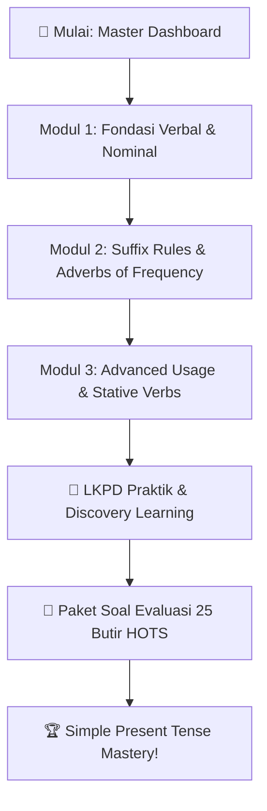

# Simple Present Tense — Fondasi Utama Bahasa Inggris dari Habit Sampai Advanced! ⏰✨

> **Welcome to the Master Hub of Simple Present Tense!** 👋
> Kalau dalam dunia gaming, *Simple Present Tense* itu ibarat skill *Basic Attack*: paling sering dipakai, kelihatannya simpel, tapi kalau salah eksekusi atau kurang paham mekaniknya, komunikasi bahasa Inggrismu bisa langsung berantakan.
>
> Dashboard ini adalah pusat kendali belajar kamu. Di sini kamu bisa melihat peta konsep menyeluruh, melompat ke sub-modul spesifik sesuai kebutuhan, mengecek ringkasan rumus kilat (*cheatsheet*), dan langsung menuju berkas latihan mandiri (LKPD & Paket Soal). *Let's master it once and for all!* 🚀

---

## 🧭 Bilah Navigasi Modul (Quick Navigation)

> [!TIP]
> **Navigasi Cepat Antar Berkas:**
> **🏠 Master Dashboard** · [[Fondasi_Verbal_dan_Nominal_SMA|Modul 1: Fondasi Verbal & Nominal]] · [[Suffix_Rules_dan_Adverbs_of_Frequency_SMA|Modul 2: Suffix & Adverbs of Frequency]] · [[Advanced_Usage_dan_Nuansa_Khusus_SMA|Modul 3: Advanced Usage & Nuances]] · [[LKPD_Simple_Present_Tense_SMA|📝 LKPD Praktik]] · [[Soal_Simple_Present_Tense_SMA|🎯 Paket Soal Evaluasi]]

---

## 🗺️ Master Concept Map (Peta Konsep Visual)

Berikut adalah ringkasan visual arsitektur Simple Present Tense:

![[infographic_languages_simple_present_master.webp]]

---

## 📚 Struktur & Direktori Sub-Modul Pembelajaran

Paket belajar ini dibagi menjadi 3 sub-modul materi inti yang berjenjang dan 2 berkas instrumen praktik di folder `40 Practice/`:

| No | Modul / Dokumen | Fokus Bahasan Utama | Target Kompetensi |
| :---: | :--- | :--- | :--- |
| **01** | [[Fondasi_Verbal_dan_Nominal_SMA\|Modul 1: Fondasi Verbal & Nominal]] | Rumus Kalimat Verbal ($V_1$, $-s/-es$, Auxiliary *Do/Does*) vs Nominal (*To Be: is/am/are*), Konsep Waktu (Habit, General Truth, State), Time Signals dasar. | Mampu membedakan aksi nyata vs kondisi identitas tanpa mencampuradukkan *To Be* dan *Verb 1*. |
| **02** | [[Suffix_Rules_dan_Adverbs_of_Frequency_SMA\|Modul 2: Suffix Rules & Adverbs]] | Mekanika ortografi penambahan akhiran subjek tunggal ($-s, -es, -ies$), panduan fonetik ($/s/, /z/, /ɪz/$), posisi sintaksis *Adverbs of Frequency* (100% *Always* $\to$ 0% *Never*). | Menulis dan mengucapkan kata kerja subjek orang ketiga tunggal dengan presisi serta menempatkan adverb secara alami. |
| **03** | [[Advanced_Usage_dan_Nuansa_Khusus_SMA\|Modul 3: Advanced Usage & Nuances]] | *Stative Verbs* (Emosi, Kepemilikan, Kognisi, Persepsi) & Verba Berarti Ganda, *Timetabled Future Events*, *Zero Conditional*, *Performative Verbs*, gaya *Headlines & Live Commentary*. | Menguasai nuansa pragmatis tingkat mahir, memahami konteks formal, dan menghindari jebakan verba non-kontinu. |
| **04** | [[LKPD_Simple_Present_Tense_SMA\|Lembar Kerja Peserta Didik (LKPD)]] | 5 Aktivitas: *Guided Text Mining*, *Transformation Matrix*, *Frequency Puzzle*, *Detektif Jebakan Batman (Error Spotting)*, dan *Authentic Creative Writing*. | Melatih pemahaman konsep melalui pendekatan *discovery learning* dan analisis kesalahan aktif. |
| **05** | [[Soal_Simple_Present_Tense_SMA\|Paket Soal Evaluasi & Pembahasan]] | 25 Butir Soal Bertingkat (Level 1 Fondasi Mekanika, Level 2 Penerapan Kontekstual, Level 3 HOTS Reasoning & Editing) + Kunci & Pembahasan Mendalam. | Mengukur tingkat penguasaan materi secara komprehensif dan terstandarisasi. |

---

## ⚡ Master Cheatsheet: Rumus & Aturan Kilat

Simpan ringkasan rumus ini di ingatanmu sebagai referensi cepat:

### 1. Verbal Sentences (Ada Tindakan / Aksi Fisik-Mental)
* **Positive (+):** 
  * $I / You / We / They + \text{Verb 1 (Base Form)} + \text{Object/Complement}$
  * $He / She / It + \text{Verb 1 (-s / -es / -ies)} + \text{Object/Complement}$
* **Negative (-):**
  * $I / You / We / They + \text{do not (don't)} + \text{Verb 1 (Kembali ke Base!)} + \text{Object/Complement}$
  * $He / She / It + \text{does not (doesn't)} + \text{Verb 1 (Kembali ke Base!)} + \text{Object/Complement}$
* **Interrogative (?):**
  * $\text{Do} + I / You / We / They + \text{Verb 1} + \text{Object/Complement}?$
  * $\text{Does} + He / She / It + \text{Verb 1} + \text{Object/Complement}?$

### 2. Nominal Sentences (Kondisi, Sifat, Identitas, Lokasi — Tanpa Kata Kerja Aksi)
* **Formula (+):** $\text{Subject} + \text{am / is / are} + \text{Complement (Adjective / Noun / Adverb)}$
* **Formula (-):** $\text{Subject} + \text{am / is / are} + \text{not} + \text{Complement}$
* **Formula (?):** $\text{Am / Is / Are} + \text{Subject} + \text{Complement}?$

> [!CAUTION]
> 🔥 **Golden Rule Anti-Blunder:**
> **JANGAN PERNAH** menggabungkan *To Be (am/is/are)* langsung dengan *Verb 1*!
> - ❌ *I am agree with you.* $\longrightarrow$ ✅ **I agree with you.** (Verbal)
> - ❌ *She is work at Google.* $\longrightarrow$ ✅ **She works at Google.** (Verbal)
> - ❌ *He does handsome.* $\longrightarrow$ ✅ **He is handsome.** (Nominal)

---

## 🎯 Panduan Rekomendasi Alur Belajar

---

> **Ready to dive deep?** Langsung klik tautan [[Fondasi_Verbal_dan_Nominal_SMA|Modul 1: Fondasi Verbal & Nominal]] untuk memulai eksplorasimu! 📖✨
