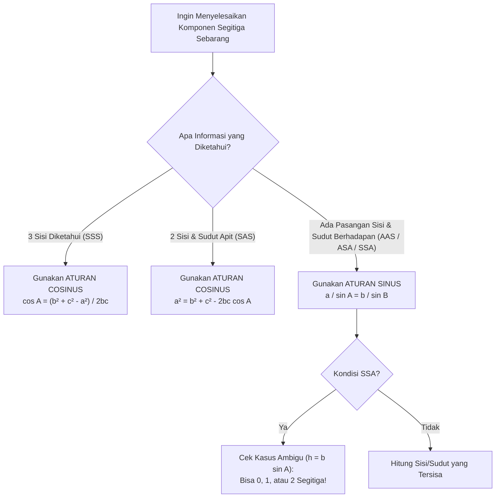

> **Bilah Navigasi:**
> [[Trigonometri_SMA|🏠 Master Dashboard]] | [[Identitas_dan_Rumus_Jumlah_Selisih_Sudut_SMA|⬅️ Modul 3: Identitas Analitik]] | **Modul 4: Segitiga Sebarang** | [[Grafik_Fungsi_dan_Persamaan_Trigonometri_SMA|Modul 5: Grafik & Persamaan ➡️]] | [[LKPD_Trigonometri_SMA|📝 LKPD]]

---

# Aturan Sinus, Cosinus, dan Luas Segitiga — Memecahkan Segitiga Sebarang di Alam Terbuka 🗺️📐

Di dunia nyata, tanah kavling perumahan, jalur rute penerbangan pesawat, dan konstelasi sinyal triangulasi satelit GPS hampir **tidak pernah membentuk segitiga siku-siku yang rapi**. Sebagian besar berbentuk segitiga sebarang (lancip atau tumpul).

Bagaimana cara kita menghitung jarak antar-dua pulau atau luas lahan segitiga jika tidak ada sudut $90^\circ$? Dua hukum fundamental geometri analitik hadir sebagai jawabannya: **Aturan Sinus** dan **Aturan Cosinus**.

---

## 1. Konvensi Nomenklatur Segitiga Sebarang

Untuk sembarang segitiga $\triangle ABC$:
* Sudut-sudut dinyatakan dengan huruf kapital: $A, B, C$ (atau $\alpha, \beta, \gamma$).
* Sisi-sisi di hadapan sudut dinyatakan dengan huruf kecil yang bersesuaian:
  * Sisi $a$ berhadapan langsung dengan sudut $A$ ($a = BC$).
  * Sisi $b$ berhadapan langsung dengan sudut $B$ ($b = AC$).
  * Sisi $c$ berhadapan langsung dengan sudut $C$ ($c = AB$).

![[diagram_mathematics_trigonometry_oblique_triangle.webp]]

---

## 2. Aturan Sinus (*The Law of Sines*)

Aturan Sinus menyatakan bahwa rasio antara panjang sisi dengan nilai sinus sudut di hadapannya selalu bernilai konstan, dan sama dengan diameter lingkaran luar segitiga ($2R$).

$$\mathbf{\frac{a}{\sin A} = \frac{b}{\sin B} = \frac{c}{\sin C} = 2R}$$

*(dengan $R =$ jari-jari lingkaran luar segitiga / circumcircle).*

### Kapan Menggunakan Aturan Sinus?
Gunakan Aturan Sinus jika diketahui **setidaknya satu pasangan sisi dan sudut yang saling berhadapan**:
1. **Sisi - Sudut - Sudut (SAA)** atau **Sudut - Sisi - Sudut (ASA)**.
2. **Sisi - Sisi - Sudut (SSA)** $\to$ *Waspada Kasus Ambigu!*

---

### ⚠️ Kasus Ambigu pada Kondisi SSA (*The Ambiguous Case*)

Jika diketahui dua sisi dan satu sudut yang **bukan sudut apit** ($a, b, \angle A$ di mana $\angle A$ lancip):
Tinggi tegak segitiga dari titik $C$ adalah $h = b \sin A$.

1. Jika $a < h$: **Tidak ada segitiga yang dapat terbentuk** ($0$ solusi).
2. Jika $a = h$: Terbentuk **tepat $1$ segitiga siku-siku** di $B$.
3. Jika $h < a < b$: Terbentuk **$2$ kemungkinan segitiga berbeda** (satu segitiga dengan $\angle B$ lancip, dan satu segitiga dengan $\angle B$ tumpul: $B_2 = 180^\circ - B_1$).
4. Jika $a \ge b$: Terbentuk **tepat $1$ segitiga**.

---

## 3. Aturan Cosinus (*The Law of Cosines*)

Aturan Cosinus adalah perluasan dari Teorema Pythagoras untuk segitiga yang tidak memiliki sudut siku-siku. Suku pengurang $-2bc \cos A$ berfungsi sebagai faktor koreksi non-$90^\circ$.

### Bentuk Mencari Panjang Sisi:
$$\mathbf{a^2 = b^2 + c^2 - 2bc \cos A}$$
$$\mathbf{b^2 = a^2 + c^2 - 2ac \cos B}$$
$$\mathbf{c^2 = a^2 + b^2 - 2ab \cos C}$$

### Bentuk Mencari Besar Sudut:
$$\mathbf{\cos A = \frac{b^2 + c^2 - a^2}{2bc}}$$
$$\mathbf{\cos B = \frac{a^2 + c^2 - b^2}{2ac}}$$
$$\mathbf{\cos C = \frac{a^2 + b^2 - c^2}{2ab}}$$

### Kapan Menggunakan Aturan Cosinus?
1. **Sisi - Sudut - Sisi (SAS):** Diketahui dua sisi dan **satu sudut apit di antara keduanya**.
2. **Sisi - Sisi - Sisi (SSS):** Diketahui **ketiga panjang sisi**, ingin mencari besar salah satu sudutnya.

> [!NOTE]
> Jika $\angle A = 90^\circ$, maka $\cos 90^\circ = 0$, sehingga $a^2 = b^2 + c^2 - 2bc(0) = b^2 + c^2$ (kembali persis menjadi Teorema Pythagoras biasa!).

---

## 4. Diagram Pengambilan Keputusan Taktis

---

## 5. Variasi Formula Luas Segitiga

### A. Luas dengan Dua Sisi dan Sudut Apit (Trigonometri)
Jika alas dan tinggi tidak diketahui secara langsung:
$$\mathbf{L = \frac{1}{2} a b \sin C = \frac{1}{2} a c \sin B = \frac{1}{2} b c \sin A}$$

---

### B. Luas dengan Ketiga Sisi (Rumus Heron)
Jika ketiga sisi $a, b, c$ diketahui tanpa informasi sudut apa pun:
Hitung setengah keliling segitiga (semi-perimeter) $s$:
$$s = \frac{a + b + c}{2}$$
$$\mathbf{L = \sqrt{s(s-a)(s-b)(s-c)}}$$

---

### C. Hubungan Luas dengan Jari-Jari Lingkaran
1. **Jari-jari Lingkaran Luar Segitiga ($R$):**
   $$R = \frac{abc}{4L}$$
2. **Jari-jari Lingkaran Dalam Segitiga ($r$):**
   $$r = \frac{L}{s}$$

---

## 6. Contoh Soal Berpola & Pembahasan Tuntas

### Contoh 1: Aplikasi Aturan Cosinus pada Navigasi Kapal
**Soal:** Sebuah kapal berlayar dari pelabuhan $A$ ke arah timur menuju pelabuhan $B$ sejauh $40\text{ mil}$. Dari pelabuhan $B$, kapal memutar haluan dengan jurusan tiga angka $120^\circ$ (membentuk sudut dalam $60^\circ$ terhadap garis $AB$) dan berlayar sejauh $60\text{ mil}$ menuju pelabuhan $C$. Berapa jarak lurus dari pelabuhan awal $A$ ke pelabuhan $C$?

**Langkah Pembahasan:**
1. Sketsa segitiga $\triangle ABC$:
   * Panjang sisi $c = AB = 40\text{ mil}$
   * Panjang sisi $a = BC = 60\text{ mil}$
   * Sudut apit $\angle B = 60^\circ$ (kondisi SAS)
2. Gunakan Aturan Cosinus untuk mencari jarak $b = AC$:
   $$b^2 = a^2 + c^2 - 2ac \cos B$$
   $$b^2 = 60^2 + 40^2 - 2(60)(40) \cos 60^\circ$$
   $$b^2 = 3600 + 1600 - 4800 \left(\frac{1}{2}\right)$$
   $$b^2 = 5200 - 2400 = 2800$$
3. Sederhanakan bentuk akar:
   $$b = \sqrt{2800} = \sqrt{400 \times 7} = \mathbf{20\sqrt{7}\text{ mil}} \approx 52,92\text{ mil}$$

---

### Contoh 2: Menghitung Luas Segiempat dengan Kombinasi Luas Segitiga
**Soal:** Hitung luas segitiga $\triangle PQR$ jika diketahui panjang $p = 7\text{ cm}$, $q = 8\text{ cm}$, dan $r = 9\text{ cm}$.

**Langkah Pembahasan:**
1. Karena ketiga sisi diketahui (SSS), gunakan Rumus Heron:
2. Hitung semi-perimeter $s$:
   $$s = \frac{7 + 8 + 9}{2} = \frac{24}{2} = 12\text{ cm}$$
3. Hitung faktor selisih:
   * $s - p = 12 - 7 = 5$
   * $s - q = 12 - 8 = 4$
   * $s - r = 12 - 9 = 3$
4. Masukkan ke rumus Heron:
   $$L = \sqrt{12 \times 5 \times 4 \times 3} = \sqrt{720} = \sqrt{144 \times 5} = \mathbf{12\sqrt{5}\text{ cm}^2}$$

---

## 7. Rangkuman Kaidah Utama

* **Aturan Sinus** mengaitkan pasangan sisi dan sudut yang saling berhadapan; ingat kasus ambigu pada pola SSA.
* **Aturan Cosinus** adalah senjata utama untuk kondisi SAS (mencari sisi ketiga) dan SSS (mencari besar sudut).
* Luas segitiga dapat ditentukan secara instan dengan satu sudut apit ($L = \frac{1}{2}ab\sin C$) atau dengan ketiga sisi melalui Rumus Heron.

---

> **Bilah Navigasi:**
> [[Trigonometri_SMA|🏠 Master Dashboard]] | [[Identitas_dan_Rumus_Jumlah_Selisih_Sudut_SMA|⬅️ Modul 3: Identitas Analitik]] | **Modul 4: Segitiga Sebarang** | [[Grafik_Fungsi_dan_Persamaan_Trigonometri_SMA|Modul 5: Grafik & Persamaan ➡️]] | [[LKPD_Trigonometri_SMA|📝 LKPD]]
