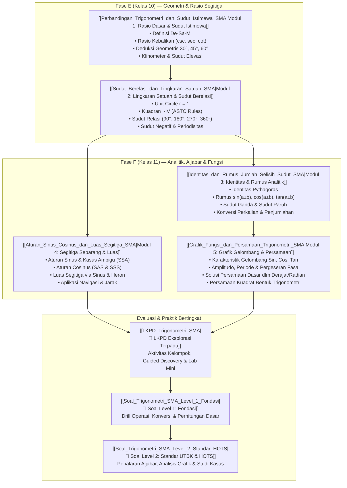

# Trigonometri SMA — Master Hub & Roadmap Petualangan Sudut 📐✨

> "Trigonometri bukan sekadar hafalan $\sin, \cos, \tan$. Ini adalah bahasa geometri tentang bagaimana sudut berputar menciptakan jarak, gelombang, dan proyeksi di alam semesta — mulai dari mengukur tinggi gunung tanpa mendakinya, merancang sinyal Wi-Fi, hingga rotasi grafis 3D di game favoritmu!"

---

## 🗺️ Peta Navigasi & Arsitektur Belajar

Paket materi ini disusun bertingkat dari fondasi geometris segitiga siku-siku (Fase E), perluasan ke sistem koordinat kartesius lingkaran satuan, manipulasi aljabar rumus analitik, hingga pemodelan fungsi periodik dan persamaan trigonometri (Fase F).

---

## 📚 Modul Materi Ajar

![[diagram_mathematics_trigonometry_unit_circle.webp]]

| No | Modul | Fokus Bahasan | File Link |
| :--- | :--- | :--- | :--- |
| **01** | **Rasio Dasar & Sudut Istimewa** | Konsep rasio sisi segitiga siku-siku ($\text{De/Mi, Sa/Mi, De/Sa}$), kebalikan ($\csc, \sec, \cot$), pembuktian nilai eksak sudut $0^\circ, 30^\circ, 45^\circ, 60^\circ, 90^\circ$, dan penggunaan klinometer. | [[Perbandingan_Trigonometri_dan_Sudut_Istimewa_SMA|Buka Modul 01 📖]] |
| **02** | **Lingkaran Satuan & Sudut Berelasi** | Koordinat titik $(x, y) = (\cos \theta, \sin \theta)$, aturan kuadran I–IV (*All-Sin-Tan-Cos*), sudut berelasi patokan sumbu X ($180^\circ, 360^\circ$) vs sumbu Y ($90^\circ, 270^\circ$), sudut negatif, dan sudut $> 360^\circ$. | [[Sudut_Berelasi_dan_Lingkaran_Satuan_SMA|Buka Modul 02 📖]] |
| **03** | **Identitas & Rumus Analitik** | Identitas Pythagoras dasar, penurunan rumus jumlah & selisih dua sudut $\sin(A \pm B)$, $\cos(A \pm B)$, $\tan(A \pm B)$, sudut rangkap ($2A$), sudut paruh ($A/2$), dan rumus konversi perkalian-penjumlahan. | [[Identitas_dan_Rumus_Jumlah_Selisih_Sudut_SMA|Buka Modul 03 📖]] |
| **04** | **Segitiga Sebarang & Luas** | Memecahkan sisi & sudut segitiga non-siku-siku dengan Aturan Sinus (sisi-sudut berhadapan) dan Aturan Cosinus (SAS/SSS), analisis kasus ambigu SSA, serta variasi formula luas segitiga (sinus dan rumus Heron). | [[Aturan_Sinus_Cosinus_dan_Luas_Segitiga_SMA|Buka Modul 04 📖]] |
| **05** | **Grafik Fungsi & Persamaan** | Anatomi gelombang harmonik $y = A \sin(k(x \pm b)) \pm c$, analisis amplitudo, periode, asimtot $\tan x$, serta metode sistematis penyelesaian persamaan trigonometri dasar dan persamaan tipe kuadrat. | [[Grafik_Fungsi_dan_Persamaan_Trigonometri_SMA|Buka Modul 05 📖]] |

---

## ⚡ Cheatsheet Formula & Identitas Kunci

### 1. Tabel Sudut Istimewa Kuadran I

| Sudut ($\theta$) | $0^\circ \ (0)$ | $30^\circ \ (\frac{\pi}{6})$ | $45^\circ \ (\frac{\pi}{4})$ | $60^\circ \ (\frac{\pi}{3})$ | $90^\circ \ (\frac{\pi}{2})$ |
| :---: | :---: | :---: | :---: | :---: | :---: |
| **$\sin \theta$** | $0 = \frac{1}{2}\sqrt{0}$ | $\frac{1}{2} = \frac{1}{2}\sqrt{1}$ | $\frac{1}{2}\sqrt{2}$ | $\frac{1}{2}\sqrt{3}$ | $1 = \frac{1}{2}\sqrt{4}$ |
| **$\cos \theta$** | $1 = \frac{1}{2}\sqrt{4}$ | $\frac{1}{2}\sqrt{3}$ | $\frac{1}{2}\sqrt{2}$ | $\frac{1}{2} = \frac{1}{2}\sqrt{1}$ | $0 = \frac{1}{2}\sqrt{0}$ |
| **$\tan \theta$** | $0$ | $\frac{1}{3}\sqrt{3}$ | $1$ | $\sqrt{3}$ | $\text{Tak Terdefinisi} \ (\infty)$ |
| **$\csc \theta$** | $\text{Tak Terdefinisi}$ | $2$ | $\sqrt{2}$ | $\frac{2}{3}\sqrt{3}$ | $1$ |
| **$\sec \theta$** | $1$ | $\frac{2}{3}\sqrt{3}$ | $\sqrt{2}$ | $2$ | $\text{Tak Terdefinisi}$ |
| **$\cot \theta$** | $\text{Tak Terdefinisi}$ | $\sqrt{3}$ | $1$ | $\frac{1}{3}\sqrt{3}$ | $0$ |

### 2. Tanda Kuadran & Sudut Relasi Utama

$$\text{Kuadran I: Semua Positif} \quad | \quad \text{Kuadran II: Hanya Sinus (+)}$$
$$\text{Kuadran III: Hanya Tangen (+)} \quad | \quad \text{Kuadran IV: Hanya Cosinus (+)}$$

* **Patokan Sumbu X ($180^\circ \pm \alpha$ atau $360^\circ \pm \alpha$):** Fungsi **TETAP** ($\sin \to \sin$, $\cos \to \cos$, $\tan \to \tan$). Tanda $+/-$ disesuaikan dengan posisi kuadran.
* **Patokan Sumbu Y ($90^\circ \pm \alpha$ atau $270^\circ \pm \alpha$):** Fungsi **BERUBAH** ($\sin \leftrightarrow \cos$, $\tan \leftrightarrow \cot$, $\sec \leftrightarrow \csc$). Tanda $+/-$ ditentukan oleh tanda fungsi asal di kuadran tersebut.

### 3. Identitas Pythagoras & Hubungan Rasio

$$1. \quad \sin^2 \alpha + \cos^2 \alpha = 1$$
$$2. \quad 1 + \tan^2 \alpha = \sec^2 \alpha$$
$$3. \quad 1 + \cot^2 \alpha = \csc^2 \alpha$$
$$4. \quad \tan \alpha = \frac{\sin \alpha}{\cos \alpha}, \quad \cot \alpha = \frac{\cos \alpha}{\sin \alpha}$$

### 4. Rumus Jumlah, Selisih & Sudut Rangkap

* **Jumlah & Selisih Sudut:**
  $$\sin(\alpha \pm \beta) = \sin \alpha \cos \beta \pm \cos \alpha \sin \beta$$
  $$\cos(\alpha \pm \beta) = \cos \alpha \cos \beta \mp \sin \alpha \sin \beta$$
  $$\tan(\alpha \pm \beta) = \frac{\tan \alpha \pm \tan \beta}{1 \mp \tan \alpha \tan \beta}$$
* **Sudut Rangkap (Double Angle):**
  $$\sin(2\alpha) = 2 \sin \alpha \cos \alpha$$
  $$\cos(2\alpha) = \cos^2 \alpha - \sin^2 \alpha = 2\cos^2 \alpha - 1 = 1 - 2\sin^2 \alpha$$
  $$\tan(2\alpha) = \frac{2\tan \alpha}{1 - \tan^2 \alpha}$$

### 5. Aturan Segitiga Sebarang & Luas

* **Aturan Sinus:**
  $$\frac{a}{\sin A} = \frac{b}{\sin B} = \frac{c}{\sin C} = 2R \quad (R = \text{jari-jari lingkaran luar})$$
* **Aturan Cosinus:**
  $$a^2 = b^2 + c^2 - 2bc \cos A \implies \cos A = \frac{b^2 + c^2 - a^2}{2bc}$$
* **Formula Luas Segitiga:**
  $$L = \frac{1}{2} a b \sin C = \frac{1}{2} a c \sin B = \frac{1}{2} b c \sin A$$
  $$L = \sqrt{s(s-a)(s-b)(s-c)}, \quad \text{dengan } s = \frac{a+b+c}{2}$$

---

## 🎯 Pusat Evaluasi & Lembar Latihan

* 📝 [[LKPD_Trigonometri_SMA|LKPD Eksplorasi Terpadu]] — 4 set aktivitas kolaboratif: simulasi klinometer, investigasi roda putar lingkaran satuan, pembuktian identitas bertahap, dan pemodelan pasang surut air laut.
* 🎯 [[Soal_Trigonometri_SMA_Level_1_Fondasi|Paket Soal Level 1: Fondasi]] — 15 butir soal pilihan ganda & esai drill konsep dasar + kunci & pembahasan lengkap.
* 🚀 [[Soal_Trigonometri_SMA_Level_2_Standar_HOTS|Paket Soal Level 2: Standar UTBK & HOTS]] — 15 butir soal penalaran tinggi, pembuktian analitis, analisis grafik gelombang, dan soal kontekstual UTBK/SNBT.
