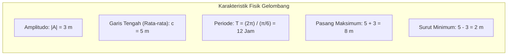

> **Bilah Navigasi Modul:**
> [[Trigonometri_SMA|🏠 Master Dashboard]] | [[Perbandingan_Trigonometri_dan_Sudut_Istimewa_SMA|Modul 1]] | [[Sudut_Berelasi_dan_Lingkaran_Satuan_SMA|Modul 2]] | [[Identitas_dan_Rumus_Jumlah_Selisih_Sudut_SMA|Modul 3]] | [[Aturan_Sinus_Cosinus_dan_Luas_Segitiga_SMA|Modul 4]] | [[Grafik_Fungsi_dan_Persamaan_Trigonometri_SMA|Modul 5]] | [[Soal_Trigonometri_SMA_Level_1_Fondasi|🎯 Soal Level 1]] | [[Soal_Trigonometri_SMA_Level_2_Standar_HOTS|🚀 Soal Level 2]]

---

# Lembar Kerja Peserta Didik (LKPD): Eksplorasi Terpadu Trigonometri SMA 📐🔍

**Nama Kelompok / Anggota:**
1. _______________________________
2. _______________________________
3. _______________________________
4. _______________________________

**Kelas / Semester:** X / XI — Fase E / F  
**Mata Pelajaran:** Matematika (Trigonometri)  
**Alokasi Waktu:** $2 \times 45\text{ Menit}$

---

## 🎯 Capaian & Tujuan Pembelajaran

Setelah menyelesaikan LKPD ini, kelompok kalian diharapkan mampu:
1. Menemukan dan menerapkan rasio trigonometri segitiga siku-siku dalam memecahkan masalah pengukuran dunia nyata.
2. Mengonstruksi pemahaman tanda fungsi trigonometri pada 4 kuadran melalui investigasi koordinat lingkaran satuan.
3. Membuktikan kebenaran identitas trigonometri secara logis dan runtut.
4. Memodelkan fenomena alam periodik ke dalam persamaan fungsi gelombang sinus/kosinus.

---

## 🧭 AKTIVITAS 1: Ekspedisi Pengukuran Lapangan (Klinometer Sederhana)

### 📌 Konteks Masalah
Kelompokmu diminta oleh pihak sekolah untuk mengukur **tinggi tiang bendera utama** di lapangan sekolah tanpa memanjatnya dan tanpa menurunkan tiang tersebut. Kalian dibekali sebuah busur derajat klinometer, pita meteran, dan kalkulator scientific.

![[diagram_mathematics_trigonometry_elevation_depression.webp]]

### 🔬 Langkah Kerja & Pengumpulan Data:
1. Berdirilah pada jarak $d = 12\text{ meter}$ dari kaki tiang bendera.
2. Arahkan klinometer ke puncak tiang bendera. Jarum klinometer menunjukkan sudut elevasi $\theta = 45^\circ$.
3. Ukur tinggi mata salah satu anggota pengamat dari atas tanah: $h_{\text{mata}} = 155\text{ cm} = 1,55\text{ meter}$.

### 📝 Lembar Analisis & Perhitungan:
1. Tuliskan perbandingan trigonometri yang menghubungkan sisi depan ($y$), sisi samping ($d$), dan sudut $\theta$:
   $$\dots\dots\dots\dots\dots = \frac{\text{Depan}}{\text{Samping}}$$

2. Hitung panjang sisi depan segitiga ($y$):
   $$y = d \times \dots\dots\dots\dots\dots = 12 \times \dots\dots\dots\dots\dots = \dots\dots\dots\dots\dots\text{ meter}$$

3. Hitung tinggi total tiang bendera ($H_{\text{total}}$):
   $$H_{\text{total}} = y + h_{\text{mata}} = \dots\dots\dots\dots\dots + \dots\dots\dots\dots\dots = \dots\dots\dots\dots\dots\text{ meter}$$

4. **Tantangan Diskusi:** Jika pengamat mundur sejauh $8\text{ meter}$ lagi ke belakang (sehingga jarak total menjadi $20\text{ meter}$), apakah sudut elevasinya akan membesar atau mengecil? Mengapa demikian? Berikan penjelasan matematisnya!
   > *Ruang Jawaban:*
   > 
   > 

---

## 🔄 AKTIVITAS 2: Laboratorium Visual Lingkaran Satuan & Aturan ASTC

### 📌 Konteks Masalah
Pada lingkaran satuan ($r = 1$), titik $P(x,y)$ bergerak berputar mengelilingi pusat $(0,0)$. Kalian akan menganalisis bagaimana tanda koordinat $(x,y)$ menentukan tanda dari $\sin \theta, \cos \theta,$ dan $\tan \theta$.

![[diagram_mathematics_trigonometry_unit_circle.webp]]

### 📝 Isilah Matriks Tanda & Nilai Berikut:

| Kuadran | Rentang Sudut ($\theta$) | Tanda $x$ ($\cos \theta$) | Tanda $y$ ($\sin \theta$) | Tanda $\frac{y}{x}$ ($\tan \theta$) | Fungsi yang Bernilai POSITIF |
| :---: | :---: | :---: | :---: | :---: | :---: |
| **I** | $0^\circ < \theta < 90^\circ$ | $+$ | $+$ | $+$ | **Semua (All)** |
| **II** | $90^\circ < \theta < 180^\circ$ | $\dots$ | $\dots$ | $\dots$ | $\dots\dots\dots\dots$ |
| **III** | $180^\circ < \theta < 270^\circ$ | $\dots$ | $\dots$ | $\dots$ | $\dots\dots\dots\dots$ |
| **IV** | $270^\circ < \theta < 360^\circ$ | $\dots$ | $\dots$ | $\dots$ | $\dots\dots\dots\dots$ |

### 🔍 Uji Penemuan Sudut Berelasi:
Diberikan sudut $\theta = 210^\circ$:
1. Berada di Kuadran keberapakah sudut $210^\circ$? $\dots\dots\dots\dots$
2. Hubungkan dengan sudut lancip $\alpha$ di Kuadran I menggunakan relasi $(180^\circ + \alpha)$:
   $$210^\circ = 180^\circ + \dots\dots^\circ$$
3. Tentukan nilai eksak trigonometrinya:
   * $\sin 210^\circ = \dots\dots\dots\dots$
   * $\cos 210^\circ = \dots\dots\dots\dots$
   * $\tan 210^\circ = \dots\dots\dots\dots$

---

## 🧪 AKTIVITAS 3: Detektif Pembuktian Identitas Aljabar

### 📌 Tantangan
Buktikan bahwa untuk setiap nilai $x$ yang terdefinisi, persamaan berikut selalu berlaku:

$$\frac{1 - \cos(2x)}{\sin(2x)} = \tan x$$

### 🛠️ Petunjuk Langkah Demi Langkah (*Scaffolding*):
1. **Langkah 1:** Tuliskan bentuk sudut rangkap dari pembilang $1 - \cos(2x)$. Ingat wujud $\cos(2x) = 1 - 2\sin^2 x$:
   $$1 - \cos(2x) = 1 - (1 - 2\sin^2 x) = \dots\dots\dots\dots\dots$$

2. **Langkah 2:** Tuliskan bentuk sudut rangkap dari penyebut $\sin(2x)$:
   $$\sin(2x) = \dots\dots\dots\dots\dots$$

3. **Langkah 3:** Gabungkan ke dalam pecahan dan sederhanakan:
   $$\frac{1 - \cos(2x)}{\sin(2x)} = \frac{\dots\dots\dots\dots\dots}{\dots\dots\dots\dots\dots} = \dots\dots\dots\dots\dots = \tan x \quad [\text{TERBUKTI}]$$

---

## 🌊 AKTIVITAS 4: Pemodelan Matematika Gelombang Pasang Surut

### 📌 Studi Kasus
Ketinggian air laut $h(t)$ (dalam meter) di sebuah dermaga pelabuhan pada waktu $t$ jam setelah tengah malam ($t = 0$) dimodelkan oleh persamaan gelombang harmonik:

$$h(t) = 3 \sin\left(\frac{\pi}{6} t\right) + 5$$

### 📝 Analisis Bersama Kelompok:
1. Berapakah nilai **Amplitudo ($A$)** dan **Ketinggian Rata-rata ($c$)** air laut tersebut?
   * Amplitudo = $\dots\dots\dots\dots\text{ meter}$
   * Garis Rata-rata ($c$) = $\dots\dots\dots\dots\text{ meter}$

2. Tentukan **Ketinggian Maksimum (Pasang Tertinggi)** dan **Ketinggian Minimum (Surut Terendah)**:
   * $h_{\max} = \dots\dots\dots\dots\text{ meter}$
   * $h_{\min} = \dots\dots\dots\dots\text{ meter}$

3. Berapakah **Periode Pasang Surut ($T$)** siklus gelombang tersebut?
   $$T = \frac{2\pi}{k} = \frac{2\pi}{\pi/6} = \dots\dots\dots\dots\text{ jam}$$

4. Sebuah kapal kargo besar hanya dapat bersandar dengan aman jika kedalaman air laut **minimal $6,5\text{ meter}$**. Pada rentang waktu $0 \le t \le 12$ jam, pada jam keberapakah kapal kargo tersebut pertama kali bisa mulai bersandar?
   > *Tunjukkan perhitungan aljabar persamaan trigonometrinya di bawah ini:*
   > 
   > 
   > 

---

## 📊 Rubrik Penilaian Kelompok

| Aspek Penilaian | Skor 4 (Sangat Baik) | Skor 3 (Baik) | Skor 2 (Cukup) | Skor 1 (Perlu Bimbingan) |
| :--- | :--- | :--- | :--- | :--- |
| **Pemahaman Konsep** | Mampu mengidentifikasi rumus dan relasi trigonometri dengan akurat di semua aktivitas. | Ada kesalahan minor pada 1 rumus tetapi konsep utama benar. | Kesalahan konseptual pada 2 aktivitas. | Belum memahami definisi dasar rasio dan kuadran. |
| **Akurasi Perhitungan** | Semua nilai eksak, substitusi, dan aljabar diselesaikan dengan benar. | 1-2 kesalahan komputasi kecil/tanda negatif. | Beberapa kesalahan komputasi yang memengaruhi hasil akhir. | Sebagian besar perhitungan salah. |
| **Kolaborasi & Komunikasi** | Diskusi aktif, pembagian tugas merata, argumen tertulis runtut dan jelas. | Kerjasama baik, argumen cukup runtut. | Hanya 1-2 anggota yang mendominasi pengerjaan. | Tidak ada kerjasama kelompok yang terlihat. |
