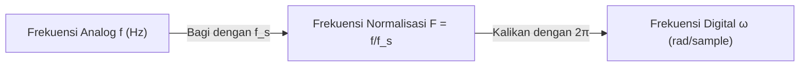

# 📖 Sub-Note 1: Klasifikasi Sinyal & Konsep Frekuensi Domain Diskrit

> [!info] **Master Overview:** [[Week_01_Introduction_to_DSP_Notes]] | **Syllabus:** [[SigPro Syllabus]]

---

## 📌 1. Definisi & Klasifikasi Sinyal

Sinyal adalah fungsi dari satu atau lebih variabel bebas yang membawa informasi tentang fenomena fisik.

### 1.1 Sinyal Waktu-Kontinu (CT) vs Sinyal Waktu-Diskrit (DT)
- **Continuous-Time (CT) Signal $x(t)$:** Didefinisikan untuk setiap titik waktu kontinu $t \in \mathbb{R}$. Contoh: Gelombang suara akustik di udara.
- **Discrete-Time (DT) Signal $x[n]$:** Didefinisikan hanya pada indeks waktu diskrit $n \in \mathbb{Z}$ (di mana $n$ adalah bilangan bulat). Sinyal $x[n]$ diperoleh dari sampling sinyal analog pada interval periodik $T_s$:
  $$
  x[n] = x(n T_s)
  $$
  di mana $T_s$ adalah *sampling period* (detik/sampel), dan $f_s = \frac{1}{T_s}$ adalah *sampling rate* (sampel/detik atau Hz).

### 1.2 Amplitudo Analog vs Digital
- **Sinyal Analog:** Amplitudo mengambil nilai kontinu dalam rentang tertentu.
- **Sinyal Digital:** Amplitudo terkuantisasi ke dalam jumlah level diskrit terbatas (misalnya $2^B$ level untuk sistem $B$-bit).

| Jenis Sinyal | Domain Waktu ($t$ atau $n$) | Domain Amplitudo | Contoh Nyata |
| :--- | :--- | :--- | :--- |
| **Analog** | Kontinu ($t \in \mathbb{R}$) | Kontinu ($A \in \mathbb{R}$) | Sinyal output mikrofon |
| **Sampled Data** | Diskrit ($n \in \mathbb{Z}$) | Kontinu ($A \in \mathbb{R}$) | Output ideal dari *Sample-and-Hold* |
| **Quantized CT** | Kontinu ($t \in \mathbb{R}$) | Diskrit ($A \in \mathbb{Q}$) | Output kuantisator waktu kontinu |
| **Digital (DSP)** | Diskrit ($n \in \mathbb{Z}$) | Diskrit ($A \in \mathbb{Q}$) | File audio WAV / MP3 di memori komputer |

---

## 📐 2. Karakteristik & Klasifikasi Khusus Sinyal Diskrit

### 2.1 Sinyal Periodik vs Aperiodik
Sinyal diskrit $x[n]$ dikatakan periodik jika terdapat bilangan bulat positif $N > 0$ sedemikian rupa sehingga:
$$
x[n + N] = x[n] \quad \forall n \in \mathbb{Z}
$$
Nilai $N$ terkecil disebut **periode fundamental** (sampel).

### 2.2 Sinyal Energi vs Sinyal Daya
- **Energi Total Sinyal Diskrit $E$:**
  $$
  E = \sum_{n=-\infty}^{\infty} |x[n]|^2
  $$
  Sinyal disebut *Sinyal Energi* jika $0 < E < \infty$.
- **Daya Rata-Rata Sinyal Diskrit $P$:**
  $$
  P = \lim_{N \to \infty} \frac{1}{2N + 1} \sum_{n=-N}^{N} |x[n]|^2
  $$
  Sinyal disebut *Sinyal Daya* jika $0 < P < \infty$ (misalnya sinyal periodik).

---

## 🔄 3. Hubungan Frekuensi Analog vs Frekuensi Digital

Terdapat perbedaan krusial antara frekuensi pada sinyal waktu-kontinu dan waktu-diskrit.

### 3.1 Frekuensi Analog ($\Omega$ dan $f$)
Untuk sinyal kontinu sinusoidal $x(t) = A \cos(\Omega t + \theta) = A \cos(2\pi f t + \theta)$:
- $f$: Frekuensi dalam Hertz (siklus/detik), di mana $-\infty < f < \infty$.
- $\Omega$: Frekuensi sudut analog dalam radian/detik ($\Omega = 2\pi f$), di mana $-\infty < \Omega < \infty$.

### 3.2 Frekuensi Digital ($\omega$ dan $F$)
Ketika $x(t)$ disampling dengan $t = n T_s = \frac{n}{f_s}$:
$$
x[n] = x(n T_s) = A \cos\left(\Omega n T_s + \theta\right) = A \cos\left(\frac{\Omega}{f_s} n + \theta\right) = A \cos(\omega n + \theta)
$$
Di mana **frekuensi sudut digital $\omega$** didefinisikan sebagai:
$$
\omega = \Omega T_s = \frac{\Omega}{f_s} = 2\pi \frac{f}{f_s} \quad \text{(rad/sample)}
$$
Dan **frekuensi ter-normalisasi $F$** didefinisikan sebagai:
$$
F = \frac{f}{f_s} \quad \text{(siklus/sample)}
$$

---

## ⚠️ 4. Sifat Unik Sinusoid Diskrit (Periodisitas & Keunikan Frekuensi)

Tidak seperti sinusoidal kontinu, sinusoidal diskrit memiliki dua sifat unik yang sangat penting dalam DSP:

### Sifat 1: Periodisitas Sinusoid Diskrit
Sinusoid diskrit $x[n] = e^{j\omega n}$ **hanya periodik** jika rasio $\frac{\omega}{2\pi}$ merupakan **bilangan rasional** (rasio dua bilangan bulat $\frac{k}{N}$):
$$
\frac{\omega}{2\pi} = \frac{f}{f_s} = \frac{k}{N} \implies \text{Periode } N = \frac{k \cdot 2\pi}{\omega}
$$

### Sifat 2: Rentang Keunikan Frekuensi Digital
Sinusoid diskrit dengan frekuensi $\omega_2 = \omega_1 + 2\pi k$ ($k \in \mathbb{Z}$) **tidak dapat dibedakan** satu sama lain:
$$
e^{j(\omega + 2\pi k)n} = e^{j\omega n} \cdot e^{j 2\pi k n} = e^{j\omega n} \cdot 1 = e^{j\omega n}
$$
Oleh karena itu, frekuensi unik pada sinyal diskrit hanya terbatas pada rentang lebar $2\pi$:
$$
-\pi \le \omega < \pi \quad \text{atau} \quad 0 \le \omega < 2\pi
$$
Hal ini berhubungan langsung dengan batasan frekuensi analog $|f| \le \frac{f_s}{2}$ (Frekuensi Nyquist).

---

## 🔗 Navigasi Modul
- [[Week_01_Introduction_to_DSP_Notes|Master Overview Week 01]]
- [[02_Elemen_Dasar_Sistem_DSP|Sub-Note 2: Elemen Dasar Sistem DSP]]
- [[03_Bidang_Aplikasi_DSP|Sub-Note 3: Bidang Aplikasi DSP]]
