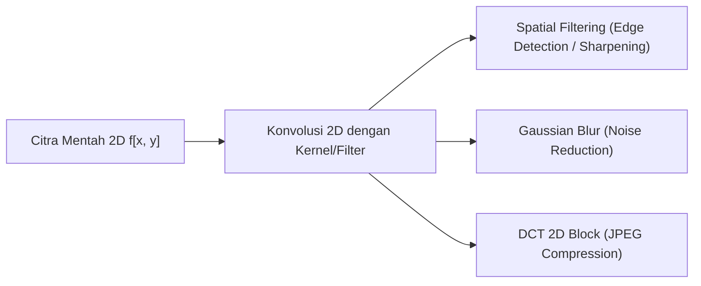

# 📖 Sub-Note 3: Penerapan & Aplikasi Industri Pengolahan Sinyal Digital

> [!info] **Master Overview:** [[Week_01_Introduction_to_DSP_Notes]] | **Sub-Note 2:** [[02_Elemen_Dasar_Sistem_DSP]]

---

## 📌 1. Domain Pemrosesan Audio & Musik

DSP adalah pondasi utama dari seluruh teknologi rekaman, transmisi, dan pemutaran suara modern.

### 1.1 Active Noise Cancellation (ANC)
- **Prinsip Kerja:** Mikrofon eksternal menangkap noise lingkungan $n(t)$. DSP menghitung sinyal fasa terbalik $-n(t)$ secara real-time dan memutarkannya melalui speaker headphone untuk menghasilkan *destructive interference*.
- **Algoritma Utama:** Filter adaptif LMS (Least Mean Squares).

### 1.2 Kompresi Audio Digital (MP3 / AAC / FLAC)
- **Prinsip Kerja:** Memanfaatkan sifat pendengaran manusia (*Psychoacoustics*) dan *Spectral Masking*. Frekuensi yang tidak terdengar oleh telinga manusia dibuang menggunakan **Modified Discrete Cosine Transform (MDCT)**.

---

## 🖼️ 2. Domain Pengolahan Citra & Video (Digital Image Processing)

Citra digital adalah sinyal diskrit 2D $f[x, y]$, di mana $x$ dan $y$ merepresentasikan koordinat spasial piksel.

- **Filtering Spasial:** Konvolusi 2D untuk *blurring* (Gaussian Filter) dan *edge detection* (Sobel / Laplacian Operator).
- **Kompresi Gambar (JPEG):** Mengubah blok piksel $8 \times 8$ ke domain frekuensi spasial menggunakan **2D Discrete Cosine Transform (2D-DCT)**, diikuti kuantisasi matriks frekuensi tinggi.

---

## 📡 3. Domain Telekomunikasi Nirkabel & Komunikasi Digital

Dalam sistem komunikasi bergerak (4G LTE, 5G, Wi-Fi 6), data digital ditransmisikan melalui gelombang elektromagnetik.

- **OFDM (Orthogonal Frequency Division Multiplexing):** Mebagi saluran frekuensi tinggi menjadi ratusan sub-carrier saling tegak lurus (orthogonal) menggunakan algoritma **Inverse Fast Fourier Transform (IFFT)** di pemancar dan **FFT** di penerima.
- **Equalization Saluran (Channel Equalization):** Filter DSP pada receiver yang mengompensasi distorsi multipath (gema sinyal radio yang memantul di gedung).
- **Software Defined Radio (SDR):** Mengganti komponen pembagi frekuensi dan mixer radio hardware dengan pemrosesan algoritma DSP pada komputer/FPGA.

---

## 🏥 4. Domain Teknik Biomedis (Biomedical Engineering)

Sinyal bio-potensial tubuh manusia (seperti ECG jantung, EEG otak, dan EMG otot) memiliki amplitudo sangat rendah ($\mu\text{V}$ hingga $\text{mV}$) dan rentan terdistorsi noise.

- **Pemfilteran Noise Listrik PLN ($50/60 \text{ Hz}$ Notch Filter):** Menggunakan IIR Notch Filter untuk menghapus noise interferensi kabel listrik tanpa merusak gelombang QRS pada ECG.
- **Pencitraan Medis (CT-Scan & MRI):** Menggunakan rekonstruksi sinyal **Radon Transform** dan **Inverse Fourier Transform 2D/3D** untuk mengubah sampel pemindaian medan magnet/sinar-X menjadi gambar irisan organ manusia.

---

## 🚘 5. Domain Radar, Sonar, & Sistem Kontrol Otomotif

- **Estimasi Kecepatan Radar (Doppler Effect):** Mengukur pergeseran frekuensi sinyal pantulan radar untuk menghitung kecepatan objek bergerak.
- **Predictive Maintenance & Vibrometer IoT:** Analisis spektrum frekuensi (FFT) dari sensor akselerometer pada mesin pabrik atau mesin mobil untuk mendeteksi kerusakan bantalan (*bearing fault*) sebelum terjadi kegagalan fatal.

---

## 🔗 Navigasi Modul
- [[Week_01_Introduction_to_DSP_Notes|Master Overview Week 01]]
- [[01_Konsep_Sinyal_dan_Frekuensi|Sub-Note 1: Konsep Sinyal & Frekuensi]]
- [[02_Elemen_Dasar_Sistem_DSP|Sub-Note 2: Elemen Dasar Sistem DSP]]
