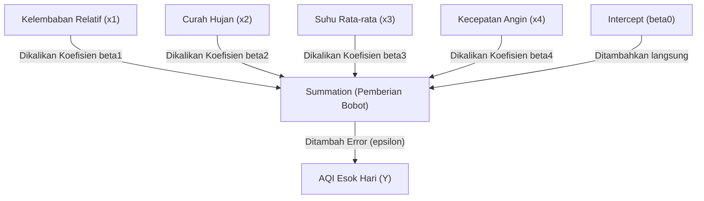

# Pengantar Multiple Linear Regression (MLR): Menembus Batas Satu Dimensi!

Halo gaes! Kali ini kita bakal **bongkar** konsep dasar dari **Multiple Linear Regression (MLR)** atau Regresi Linear Berganda. Kalau sebelumnya kita cuma melihat hubungan satu-ke-satu di regresi linear sederhana, di dunia nyata masalahnya jauh lebih kompleks, lho. 

Misalnya, pas kita lagi ngerjain tugas besar prediksi kualitas udara Jakarta di [[../Prediksi Kualitas Udara Harian Berbasis Faktor Cuaca di Jakarta Menggunakan Multiple Linear Regression.md|Laporan Prediksi Kualitas Udara Jakarta]], kita tahu kalau *Air Quality Index* (AQI) nggak cuma dipengaruhi oleh satu hal aja. Ada suhu, kelembaban, kecepatan angin, sampai curah hujan yang barengan memengaruhi kebersihan udara kita. Makanya, model MLR ini kudu kita pahami biar bisa nangkep interaksi banyak faktor cuaca sekaligus!

Biar dapet gambaran lengkapnya, yuk kita ceki-ceki penjelasan detail di bawah ini!

---

## 1. Intuisi & Model Mental MLR

Sebelum masuk ke rumus matematika yang bikin pusing, mari kita bangun *mental model*-nya dulu. 

> [!INFO]
> **Analogi Resep Koki:**
> Bayangkan kamu adalah seorang koki yang pengen bikin sup dengan tingkat keasinan tertentu (Target $Y$: Nilai AQI). 
> Untuk menentukan rasa sup tersebut, kamu memasukkan beberapa jenis bumbu (Fitur $X$: garam, kecap asin, kaldu bubuk, dsb.).
> Tugas dari algoritma MLR adalah mencari **ukuran sendok yang pas (Bobot/Koefisien $\beta$)** untuk masing-masing bumbu, biar rasa sup yang dihasilkan bener-bener pas mendekati rasa target. Ada bumbu yang bikin asinnya naik pesat (koefisien positif), dan ada bumbu penetral seperti air yang malah mengurangi keasinan (koefisien negatif).

Secara alur logika, model MLR menggabungkan semua fitur input secara linear untuk menghasilkan satu nilai prediksi seperti diagram berikut:

---

## 2. Formulasi Matematis MLR

Secara matematis, persamaan regresi linear berganda dituliskan sebagai berikut:

$$Y = \beta_0 + \beta_1 X_1 + \beta_2 X_2 + \dots + \beta_k X_k + \epsilon$$

Di mana:
* $Y$: **Variabel Dependen** (Target yang ingin diprediksi, contoh: AQI esok hari).
* $X_1, X_2, \dots, X_k$: **Variabel Independen** (Fitur cuaca/prediktor, contoh: suhu, angin).
* $\beta_0$: **Intercept** (Konstanta / Titik potong y). Nilai dasar target $Y$ jika semua fitur independen bernilai nol.
* $\beta_1, \beta_2, \dots, \beta_k$: **Koefisien Regresi** (Bobot pengaruh masing-masing fitur).
* $\epsilon$: **Error / Residual** (Selisih antara nilai riil di lapangan dengan hasil prediksi model).

---

## 3. Memahami Intercept ($\beta_0$) dan Koefisien ($\beta_i$)

Biar lebih paham, kita kudu bedah arti fisis dari $\beta_0$ dan $\beta_i$ ini, gaes:

### A. Intercept ($\beta_0$)
Intercept adalah *baseline value*. Ini menunjukkan perkiraan nilai target $Y$ ketika seluruh nilai prediktor ($X_1, \dots, X_k$) bernilai $0$. 
* Di dunia nyata, kadang kondisi semua fitur bernilai $0$ itu nggak masuk akal (misalnya suhu udara $0 ^\circ\text{C}$ di Jakarta). 
* Tapi secara matematis, $\beta_0$ sangat krusial sebagai jangkar (*anchor*) agar garis regresi kita berada di posisi ketinggian yang tepat pada grafik multidimensi.

### B. Koefisien Regresi ($\beta_i$)
Koefisien regresi mengukur tingkat sensitivitas target terhadap satu variabel prediktor tertentu.
* **Arah Pengaruh (Tanda +/-):**
  * Jika $\beta_i > 0$ (Positif): Berarti ada hubungan searah. Kalau fitur $X_i$ naik, nilai target $Y$ ikut naik.
  * Jika $\beta_i < 0$ (Negatif): Berarti ada hubungan berlawanan. Kalau fitur $X_i$ naik, nilai target $Y$ justru turun.
* **Syarat Utama (Ceteris Paribus):**
  Koefisien $\beta_i$ menunjukkan perubahan pada $Y$ untuk setiap kenaikan $1$ unit variabel $X_i$, **dengan asumsi seluruh variabel prediktor lainnya tidak berubah (konstan)**. 

---

## 4. Contoh Kasus dengan Angka (Worked Example)

Sekarang kita coba simulasikan model MLR buatan kita yang sudah terlatih untuk memprediksi AQI berdasarkan dua parameter cuaca saja: **Kecepatan Angin ($X_1$ dalam m/s)** dan **Suhu Rata-rata ($X_2$ dalam $^\circ\text{C}$)**.

> [!EXAMPLE]
> **Persamaan Hasil Training:**
> Katakanlah dari hasil latih model, kita dapet persamaan regresi berikut:
> $$\widehat{\text{AQI}} = 80 - 5X_1 + 3X_2$$
> 
> Mari kita bedah angkanya satu per satu:
> 1. **Intercept ($\beta_0 = 80$):**
>    Jika kecepatan angin bernilai $0 \text{ m/s}$ and suhu rata-rata bernilai $0 ^\circ\text{C}$, maka nilai AQI dasar diprediksi sebesar $80$.
> 2. **Koefisien Kecepatan Angin ($\beta_1 = -5$):**
>    Jika kecepatan angin naik sebesar $1 \text{ m/s}$ (dan suhu konstan), maka nilai AQI diprediksi akan **turun sebesar 5 poin**. Ini pas banget dengan logika fisik: angin kencang membantu pembersihan polutan via dispersi!
> 3. **Koefisien Suhu ($\beta_2 = 3$):**
>    Jika suhu naik sebesar $1 ^\circ\text{C}$ (dan kecepatan angin konstan), maka nilai AQI diprediksi akan **naik sebesar 3 poin**. Logikanya, suhu panas memicu reaksi kimia pembentukan ozon permukaan yang mengotori udara.

### Menghitung Prediksi Hari Ini
Misalkan pada hari ini, stasiun cuaca mencatat data berikut:
* Kecepatan angin ($X_1$) = $4 \text{ m/s}$
* Suhu rata-rata ($X_2$) = $30 ^\circ\text{C}$

Mari kita hitung prediksi AQI esok hari ($\widehat{\text{AQI}}$):
$$\widehat{\text{AQI}} = 80 - 5(4) + 3(30)$$
$$\widehat{\text{AQI}} = 80 - 20 + 90$$
$$\widehat{\text{AQI}} = 150$$

Model kita memperkirakan nilai AQI besok adalah **150** (kategori udara tidak sehat).

### Menghitung Residual ($\epsilon$)
Keesokan harinya, alat sensor kualitas udara ternyata menunjukkan nilai aktual AQI adalah **153**.
Berapa error prediksinya? Kita ceki-ceki rumus residual:
$$\epsilon = Y_{\text{aktual}} - \widehat{Y}_{\text{prediksi}}$$
$$\epsilon = 153 - 150 = 3$$

Artinya, tebakan model kita meleset tipis sebesar $3$ poin AQI.

---

## 5. Cara Model Belajar: Ordinary Least Squares (OLS)

Gimana sih cara algoritma MLR dapet nilai $\beta_0, \beta_1, \dots$ yang paling optimal? 
Metode paling standar yang dipakai adalah **Ordinary Least Squares (OLS)**.

> [!IMPORTANT]
> **Prinsip Dasar OLS:**
> OLS mencari nilai koefisien $\boldsymbol{\beta}$ yang meminimalkan jumlah kuadrat dari seluruh residual (*Sum of Squared Residuals* - SSR):
> $$\text{Minimize } \text{SSR} = \sum_{i=1}^{n} \epsilon_i^2 = \sum_{i=1}^{n} (y_i - \hat{y}_i)^2$$
> Dengan menggunakan kalkulus (menurunkan fungsi SSR terhadap masing-masing $\beta$ dan menyamakannya dengan nol), kita dapet solusi bentuk tertutup (*closed-form solution*) dalam bentuk operasi matriks:
> $$\boldsymbol{\beta} = (\mathbf{X}^T\mathbf{X})^{-1}\mathbf{X}^T\mathbf{y}$$

> [!TIP]
> **Pentingnya Feature Scaling sebelum Membaca Koefisien!**
> Ingat gaes, jika data cuaca kita satuannya beda jauh (misalnya Tekanan Udara sekitar $1010 \text{ hPa}$ vs Curah Hujan $2 \text{ mm}$), nilai koefisien $\beta$ yang dihasilkan OLS bakal ikut terpengaruh satuan tersebut. 
> 
> Supaya kita bisa membandingkan secara adil mana fitur cuaca yang paling dominan memengaruhi AQI, kita wajib melakukan **Z-Score Standardization** terlebih dahulu, persis seperti yang kita bahas di [[../Air_Quality_Prediction_MLR_Complete_Guide.md|Air Quality Prediction MLR Complete Guide]]. Setelah data disamakan skalanya (mean = 0, std = 1), barulah koefisien $\beta$ yang angkanya paling besar (baik positif maupun negatif) bisa diklaim sebagai fitur yang paling penting bagi model!

---

## 6. Uji Asumsi dan Hambatan MLR

Walaupun MLR ini simpel, cepat, dan gampang dibaca, ada beberapa jebakan Batman yang kudu kita perhatikan:
1. **Multikolinearitas:** Kejadian di mana variabel independen saling bertabrakan karena berkorelasi kuat (misalnya suhu dan kelembaban). OLS bakal kesulitan menentukan koefisien yang stabil kalau ini terjadi.
2. **Concept Drift:** Pergeseran hubungan pola data akibat faktor eksternal di luar cuaca (seperti masa pembatasan kendaraan saat pandemi COVID-19). Di [[../Prediksi Kualitas Udara Harian Berbasis Faktor Cuaca di Jakarta Menggunakan Multiple Linear Regression.md|Laporan Prediksi Kualitas Udara Jakarta]], kita udah membuktikan kalau data lama era pandemi justru memperburuk performa model karena pola hubungannya telah bergeser (*concept drift*). Makanya kebaruan data (*data recency*) itu sangat krusial!

Nah, itu dia pengantar dasar mengenai Multiple Linear Regression! Sekarang kita udah paham kan gimana matematika sederhana bisa dipakai untuk melacak pergerakan polusi udara kota kita? Semoga bermanfaat buat ngerjain Tubes AI kita ya!
