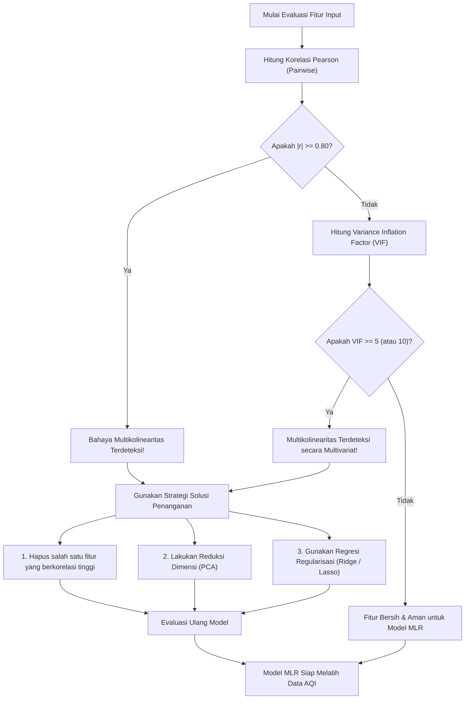

# Multicollinearity Guide: Mengapa Fitur yang "Saling Cinta" Bisa Merusak Model Regresi Kita?

Halo gaes! Kali ini kita bakal bongkar satu fenomena menyebalkan tapi super penting dalam dunia pemodelan statistik, khususnya waktu kita ngerjain model **Multiple Linear Regression (MLR)** untuk tugas besar prediksi kualitas udara Jakarta. Fenomena ini namanya **Multicollinearity** (Multikolinearitas). 

Waktu kita nyiapin fitur cuaca kayak suhu, kelembaban, kecepatan angin, dan lain-lain di [[../Air_Quality_Prediction_MLR_Complete_Guide|Complete Guide: Prediksi Kualitas Udara]], kita kudu ceki-ceki dulu apakah fitur-fitur tersebut aman dari multikolinearitas. Yuk, kita kupas tuntas biar model MLR kita nggak gampang eror dan hasil prediksinya tetap stabil!

---

## 1. Apa sih Multikolinearitas itu? (Intuisi & Analogi)

Sebelum pusing lihat rumus matematika, kita bangun dulu mental modelnya. 

> [!INFO]
> **Analogi Dua Saksi Mata di Pengadilan:**
> Bayangkan kita adalah seorang hakim yang sedang menyidangkan kasus kualitas udara (Target: Nilai AQI). Kita memanggil beberapa saksi (Variabel Independen / Fitur: Suhu, Kelembaban, Curah Hujan, dsb.) untuk memberikan kesaksian.
> 
> * **Kondisi Ideal (Tanpa Multikolinearitas):** Setiap saksi membawa informasi unik yang berbeda. Saksi A bercerita tentang suhu, saksi B tentang hujan, saksi C tentang kecepatan angin. Informasi mereka saling melengkapi, sehingga kita bisa dengan jelas menentukan bobot kepercayaan (Koefisien $\beta$) masing-masing saksi.
> * **Kondisi Multikolinearitas:** Saksi A dan saksi B ternyata adalah anak kembar yang selalu bersama dan selalu berbisik satu sama lain sebelum bersaksi. Kesaksian mereka persis sama (berkorelasi sangat kuat). Sebagai hakim, kita bakal bingung: *"Siapa sih sebenarnya yang memberikan informasi berharga ini? Apakah si A atau si B?"* Kita tidak bisa membedakan kontribusi independen dari masing-masing saksi.

Secara formal di dunia machine learning:

> [!IMPORTANT]
> **Definisi Multikolinearitas:**
> Multikolinearitas adalah kondisi statistik di mana dua atau lebih variabel independen (fitur input) dalam model regresi berganda memiliki hubungan linear yang sangat kuat atau korelasi yang sangat tinggi satu sama lain. 

Artinya, satu variabel independen dapat diprediksi secara akurat oleh variabel independen lainnya menggunakan fungsi linear sederhana.

---

## 2. Mengapa Multikolinearitas Sangat Berbahaya bagi MLR?

Kalau kita sekadar pengen bikin prediksi asal tebak, mungkin multikolinearitas nggak terlalu kelihatan efeknya. Tapi untuk model ilmiah seperti [[../Prediksi Kualitas Udara Harian Berbasis Faktor Cuaca di Jakarta Menggunakan Multiple Linear Regression|Laporan Tugas Besar MLR kita]], efeknya bisa fatal lho! Ada dua bahaya utama yang wajib kita pahami:

### A. Koefisien Regresi Menjadi Tidak Stabil (*Unstable Coefficients*)
Pada algoritma MLR, tujuan kita adalah mencari nilai koefisien $\beta$ yang optimal menggunakan metode **Ordinary Least Squares (OLS)**. Nilai $\beta_j$ merepresentasikan efek marjinal dari variabel $X_j$ terhadap target $Y$, dengan asumsi variabel independen lainnya bernilai konstan (*ceteris paribus*).

Jika terjadi multikolinearitas, asumsi *ceteris paribus* ini hancur total. Kenapa? Karena jika $X_1$ berkorelasi kuat dengan $X_2$, maka mustahil kita bisa menaikkan nilai $X_1$ tanpa ikut mengubah nilai $X_2$. Akibatnya:
* Estimasi koefisien $\beta$ menjadi sangat sensitif terhadap perubahan kecil pada data latihan (*training data*).
* Jika kita menambahkan atau menghapus beberapa baris data saja, nilai $\beta$ bisa melompat liar (misalnya, dari $+4.5$ mendadak jadi $-3.2$). Ini membuat interpretasi model kita menjadi tidak valid secara ilmiah.

### B. Standard Error Membesar secara Eksponensial (*Biased Standard Errors*)
Mari kita bedah secara matematis. Secara formal, rumus varians (dan standard error) dari koefisien estimasi $\hat{\beta}_j$ dalam MLR adalah:

$$\text{Var}(\hat{\beta}_j) = \frac{\sigma^2}{\sum_{i=1}^{n} (X_{ij} - \bar{X}_j)^2} \times \frac{1}{1 - R_j^2}$$

$$\text{SE}(\hat{\beta}_j) = \sqrt{\text{Var}(\hat{\beta}_j)}$$

*Di mana:*
* $\sigma^2$ adalah varians dari residual error model.
* $\sum_{i=1}^{n} (X_{ij} - \bar{X}_j)^2$ adalah variabilitas dari fitur $X_j$ itu sendiri.
* $R_j^2$ adalah koefisien determinasi ($R^2$) ketika kita meregresikan variabel independen $X_j$ terhadap **seluruh variabel independen lainnya** (regresi bantu/auxiliary regression).

Coba kita perhatikan suku $\frac{1}{1 - R_j^2}$. Suku inilah yang disebut sebagai pengali varians. 
* Jika variabel $X_j$ tidak berkorelasi dengan variabel lainnya, maka $R_j^2 = 0$, sehingga pengalinya adalah $1$. Standard error bernilai normal.
* Tapi, jika $X_j$ berkorelasi sangat kuat dengan variabel lain (misalnya $R_j^2 = 0.95$), maka penyebutnya menjadi sangat kecil: $1 - 0.95 = 0.05$.
* Pengalinya meledak menjadi $\frac{1}{0.05} = 20$ kali lipat!

Standard error ($\text{SE}$) yang meledak besar ini berdampak langsung pada pengujian signifikansi fitur menggunakan uji-$t$ ($t$-test):

$$t_{\text{stat}} = \frac{\hat{\beta}_j}{\text{SE}(\hat{\beta}_j)}$$

Karena $\text{SE}(\hat{\beta}_j)$ sangat besar, maka nilai $t_{\text{stat}}$ akan mengecil drastis menuju $0$. Akibatnya, nilai **$p$-value** untuk variabel tersebut menjadi sangat besar ($p > 0.05$). Model akan menganggap variabel tersebut **tidak signifikan secara statistik**, padahal sebenarnya variabel itu sangat penting untuk memprediksi target $Y$. Ini namanya jebakan batman statistik!

---

## 3. Cara Mendeteksi Multikolinearitas

Untuk menyelamatkan model MLR kita, ada dua metode deteksi utama yang kudu kita jalankan saat tahap *data preprocessing*:

### A. Uji Korelasi Pearson (*Pairwise Correlation*)
Langkah paling sederhana adalah membuat matriks korelasi antar-fitur menggunakan koefisien **Pearson Correlation Coefficient ($r$)**. Rumus matematis korelasi Pearson antara variabel $X$ dan $Y$ adalah:

$$r_{XY} = \frac{\sum_{i=1}^{n} (X_i - \bar{X})(Y_i - \bar{Y})}{\sqrt{\sum_{i=1}^{n} (X_i - \bar{X})^2 \sum_{i=1}^{n} (Y_i - \bar{Y})^2}}$$

Nilai $r$ berkisar antara $-1$ hingga $+1$. 

> [!IMPORTANT]
> **Threshold Batas Kritis $0.80$:**
> Dalam analisis regresi praktis, jika korelasi absolut antara dua variabel independen bernilai **$\ge 0.80$** ($|r| \ge 0.80$), maka ini adalah tanda bahaya merah (*red flag*) bahwa multikolinearitas serius sedang terjadi.

* **Kasus di Dataset Kita:**
  Di tugas besar kualitas udara Jakarta, kita punya fitur Suhu Udara ($T$) dan Kelembaban Relatif ($RH$). Hasil kalkulasi korelasi Pearson menunjukkan $r = -0.75$. Nilai ini menunjukkan hubungan negatif yang sangat kuat (suhu naik, kelembaban turun), tapi karena nilainya masih di bawah threshold $0.80$, secara teoritis kedua fitur ini **masih cukup aman** untuk dilatih bersama di model MLR kita.

### B. Variance Inflation Factor (VIF)
Meskipun korelasi Pearson itu gampang, dia punya kelemahan: dia cuma bisa mendeteksi hubungan antar dua variabel (*pairwise*). Bagaimana jika variabel $X_1$ tidak berkorelasi kuat dengan $X_2$ sendirian, tapi merupakan kombinasi linear dari $X_2$ dan $X_3$ sekaligus? Korelasi Pearson biasa tidak akan bisa mendeteksinya!

Oleh karena itu, kita butuh alat uji yang lebih canggih bernama **Variance Inflation Factor (VIF)**. 

> [!INFO]
> **Cara Kerja VIF:**
> Untuk menghitung VIF untuk variabel $X_j$, kita melakukan *auxiliary regression* (regresi bantu) dengan menjadikan $X_j$ sebagai target, dan sisa fitur independen lainnya sebagai prediktor:
> $$X_j = \alpha_0 + \alpha_1 X_1 + \alpha_2 X_2 + \dots + \alpha_k X_k + e$$
> Dari regresi ini, kita ambil nilai $R^2$-nya (sebut saja $R_j^2$). Lalu kita masukkan ke rumus VIF:
> $$\text{VIF}_j = \frac{1}{1 - R_j^2}$$

Interpretasi nilai VIF adalah sebagai berikut:
* $\text{VIF} = 1$: Bersih total (tidak ada korelasi sama sekali dengan fitur lain).
* $1 < \text{VIF} < 5$: Korelasi moderat, masih sangat aman untuk digunakan.
* $\text{VIF} \ge 5$ atau $\text{VIF} \ge 10$: Terjadi multikolinearitas yang parah. Fitur ini kudu segera diatasi karena sudah merusak estimasi standard error model.

---

## 4. Alur Kerja Deteksi & Penanganan Multikolinearitas

Agar pengerjaan tubes kita terstruktur, kita bisa ikuti diagram alur di bawah ini untuk mendeteksi dan menyelesaikan masalah multikolinearitas:

---

## 5. Contoh Kasus Riil & Solusinya

Biar makin mantap pemahamannya, mari kita ceki-ceki contoh simulasi numerik di bawah ini.

> [!EXAMPLE]
> **Simulasi Fitur Cuaca Jakarta yang Duplikatif**
> Misalkan kita sedang melatih model MLR dengan 3 fitur untuk memprediksi AQI ($Y$):
> 1. Suhu Udara ($X_1$, dalam $^\circ\text{C}$)
> 2. Kelembaban Relatif ($X_2$, dalam $\%$)
> 3. Indeks Kenyamanan Termal / Humidex ($X_3$)
> 
> Karena $X_3$ dihitung langsung dari rumus matematika berbasis $X_1$ and $X_2$, maka hubungan linear mereka sangat tinggi:
> $$X_3 \approx 1.2 X_1 + 0.8 X_2$$
> 
> Waktu kita hitung matriks korelasi Pearson dan VIF, hasilnya adalah:
> * $r$ antara $X_1$ dan $X_3 = 0.94$ (Melebihi threshold $0.80$).
> * $\text{VIF}_3 = 12.5$ (Melebihi threshold kritis $10.0$).
> 
> **Bagaimana Cara Kita Mengatasinya?**
> 
> * **Solusi 1: Feature Elimination (Penghapusan Fitur)**
>   Karena $X_3$ (Humidex) tidak memberikan informasi baru di luar apa yang sudah diwakili oleh $X_1$ (Suhu) dan $X_2$ (Kelembaban), langkah paling logis adalah **menghapus $X_3$** dari dataset kita. Setelah $X_3$ dibuang, nilai VIF untuk $X_1$ dan $X_2$ langsung turun drastis ke angka $2.1$ (sangat aman).
> 
> * **Solusi 2: Ridge Regression ($L_2$ Regularization)**
>   Jika secara teori fisika atmosfer kita *kudu* mempertahankan ketiga variabel tersebut, kita tidak bisa memakai MLR biasa dengan estimasi OLS. Kita harus beralih ke **Ridge Regression**. 
>   Ridge menambahkan penalti kuadrat dari bobot koefisien ke dalam loss function:
>   $$\text{Loss} = \sum_{i=1}^{n} \left( y_i - \beta_0 - \sum_{j=1}^{k} \beta_j X_{ij} \right)^2 + \lambda \sum_{j=1}^{k} \beta_j^2$$
>   Penalti $\lambda \sum \beta_j^2$ ini secara matematis menekan varians koefisien agar tidak meledak besar, sehingga model tetap stabil meskipun ada fitur yang saling berkorelasi erat.

Nah, sekarang kita sudah paham kan kenapa multikolinearitas itu berbahaya dan bagaimana cara mendeteksinya? Jangan lupa selalu jalankan uji korelasi dan cek nilai VIF di *code* preprocessing kita sebelum memicu fungsi `.fit()` pada model regresi linear berganda ya! Semangat ngerjain tugas besarnya!
