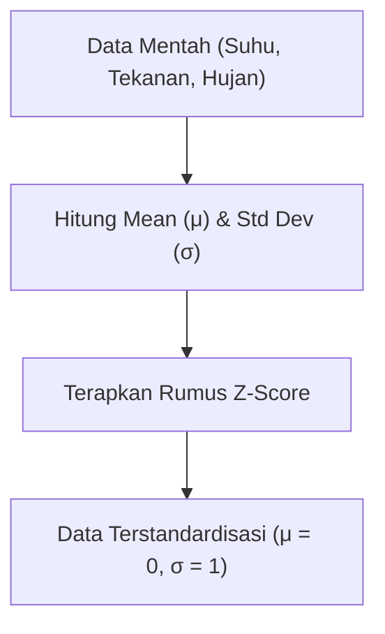
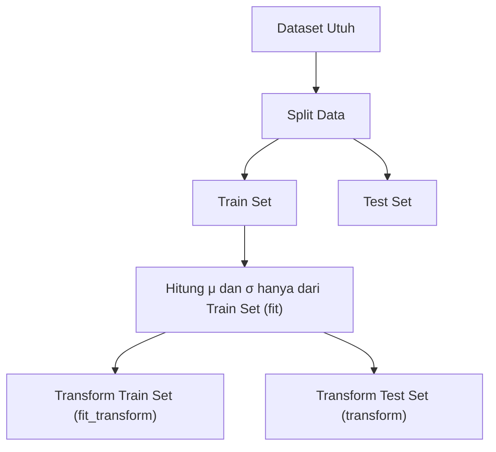

# Z-Score Scaling (Standardization): Panduan Lengkap Anti-Pusing

Halo gaes! Kali ini kita bakal bongkar salah satu tahap paling krusial dalam pra-pemrosesan data (*data preprocessing*) sebelum data kita siap dilahap oleh model *Machine Learning*, yaitu **Z-Score Scaling** atau biasa disebut **Standardization** (Standardisasi).

Materi ini super penting buat kesuksesan tugas besar kita di [[../Prediksi Kualitas Udara Harian Berbasis Faktor Cuaca di Jakarta Menggunakan Multiple Linear Regression|Laporan Utama Tubes]] dan [[../Air_Quality_Prediction_MLR_Complete_Guide|Panduan Lengkap MLR]]. Yuk, kita bahas santai tapi tetap detail!

---

## 1. Intuisi: Mengapa Kita Kudu Melakukan Scaling?

Bayangkan kita lagi ngerjain dataset cuaca Jakarta untuk memprediksi kualitas udara (AQI). Kita punya bermacam-macam parameter cuaca (fitur) dengan satuan dan rentang nilai (*magnitudo*) yang beda jauh:
* **Suhu Udara ($T$):** berkisar antara $25^\circ\text{C}$ sampai $35^\circ\text{C}$.
* **Curah Hujan ($P$):** berkisar antara $0\text{ mm}$ (gak hujan) sampai $50\text{ mm}$ (hujan lebat).
* **Tekanan Udara Permukaan ($SP$):** berkisar antara $1005\text{ hPa}$ sampai $1015\text{ hPa}$.

> [!WARNING]
> **Analogi Si Raksasa dan Si Liliput**
> Kalau kita langsung masukin data mentah ini ke model *Machine Learning*, model kita bakal kena bias magnitudo. Angka $1010$ pada Tekanan Udara bakal terlihat "raksasa" di mata algoritma dibanding angka $30$ pada Suhu Udara atau $2$ pada Wind Speed. 
> 
> Akibatnya, model bakal menganggap Tekanan Udara jauh lebih penting daripada fitur lainnya, cuma gara-gara ukuran angkanya yang gede! Padahal secara fisis, kenaikan suhu sedikit saja atau hembusan angin kecil bisa berpengaruh jauh lebih besar terhadap kebersihan udara Jakarta dibanding perubahan kecil pada tekanan udara.

Dengan **Z-Score Scaling**, kita menyamakan "lapangan bermain" untuk semua fitur. Kita mengubah skala data sehingga semua fitur berada di rentang yang sebanding tanpa merusak distribusi asli datanya.

Berikut alur kerja transformasi datanya:



---

## 2. Dampak Scaling pada Algoritma Machine Learning

Kenapa sih scaling ini berpengaruh banget ke kinerja model? Ini beberapa alasan utamanya:

* **Gradient Descent (Optimasi Regresi Linear / Neural Networks):**
  Jika kita memakai optimasi berbasis gradien, fitur yang tidak di-scale bakal bikin fungsi loss-nya berbentuk elips yang super lonjong dan pipih. Akibatnya, proses training (pencarian bobot $\beta$) bakal memantul-mantul gak karuan dan butuh waktu lama untuk konvergen. Dengan scaling, fungsi loss jadi lebih bulat (simetris), bikin gradien meluncur lurus dan cepat ke titik optimal (minimum).
* **Algoritma Berbasis Jarak (SVR, KNN, KMeans):**
  Algoritma seperti [[../Air_Quality_Prediction_MLR_Complete_Guide#Bab 5 Benchmarking Algoritma (MLR vs SVR vs XGBoost)|Support Vector Regression (SVR)]] menghitung kemiripan data memakai jarak Euclidean. Kalau fiturnya gak di-scale, jarak ini bakal didominasi habis-habisan oleh fitur berangka besar.
* **Regularisasi (Ridge & Lasso Regression):**
  Regularisasi menambahkan penalti pada ukuran koefisien $\beta$. Kalau fitur gak di-scale, fitur yang nilainya kecil (misal $0.01$) secara otomatis butuh koefisien $\beta$ yang super besar untuk memengaruhi target. Koefisien besar ini bakal langsung kena "hukuman" penalti dari Ridge/Lasso secara tidak adil. Makanya, sebelum pakai regularisasi, wajib hukumnya buat nge-scale data!

---

## 3. Rumus Matematika Z-Score Scaling

Secara formal, rumus Z-score scaling adalah:

$$Z = \frac{x - \mu}{\sigma}$$

*Di mana:*
* $x$: Nilai fitur asli sebelum di-scale.
* $\mu$: Rata-rata (*mean*) dari fitur tersebut pada seluruh data latihan.
* $\sigma$: Standar deviasi (*standard deviation*) dari fitur tersebut.
* $Z$: Nilai fitur baru yang sudah di-scale (Z-score).

> [!IMPORTANT]
> **Karakteristik Output Standardisasi Z-Score:**
> Setelah seluruh nilai fitur kita transformasikan menggunakan rumus di atas, maka variabel baru tersebut dijamin memiliki sifat:
> 1. **Rata-rata baru ($\mu_Z$) = $0$**
> 2. **Standar deviasi baru ($\sigma_Z$) = $1$**
> 3. **Varians baru ($\sigma_Z^2$) = $1$**

### Pembuktian Matematika Sederhana:
Kenapa rata-ratanya bisa jadi $0$ dan standar deviasinya jadi $1$? Yuk kita bongkar pembuktiannya!

**A. Pembuktian Rata-Rata ($\mu_Z = 0$):**
Misalkan kita mengambil nilai harapan (expected value) dari $Z$:

$$E[Z] = E\left[\frac{x - \mu}{\sigma}\right]$$

Karena $\mu$ dan $\sigma$ adalah konstanta yang dihitung dari data, kita bisa keluarkan mereka dari operator ekspektasi:

$$E[Z] = \frac{1}{\sigma} (E[x] - E[\mu])$$

Karena $E[x] = \mu$ (ekspektasi nilai asli adalah rata-ratanya sendiri) dan $E[\mu] = \mu$ (ekspektasi dari konstanta rata-rata adalah konstanta itu sendiri):

$$E[Z] = \frac{1}{\sigma} (\mu - \mu) = \frac{0}{\sigma} = 0$$

**B. Pembuktian Varians ($\sigma_Z^2 = 1$):**
Sekarang kita cari varians dari $Z$:

$$\text{Var}(Z) = \text{Var}\left[\frac{x - \mu}{\sigma}\right]$$

Berdasarkan sifat varians $\text{Var}(aX + b) = a^2\text{Var}(X)$, kita bisa keluarkan pembagi $\sigma$ (menjadi kuadrat) dan abaikan konstanta pergeseran $-\mu$:

$$\text{Var}(Z) = \frac{1}{\sigma^2} \text{Var}(x)$$

Karena $\text{Var}(x) = \sigma^2$ (varians data asli adalah kuadrat standar deviasinya):

$$\text{Var}(Z) = \frac{\sigma^2}{\sigma^2} = 1$$

Karena standar deviasi adalah akar dari varians, maka standar deviasi baru $\sigma_Z = \sqrt{1} = 1$. Terbukti gaes!

---

## 4. Contoh Perhitungan Manual (Tracing)

Supaya makin kebayang cara kerjanya di balik layar, mari kita coba ngerjain contoh kasus kecil secara manual.

Bayangkan kita punya data sederhana untuk **Suhu ($T$)** dan **Tekanan Udara ($P$)** dari 3 hari pengamatan:

| Hari | Suhu ($T$ - $^\circ\text{C}$) | Tekanan ($P$ - $\text{hPa}$) |
| :--- | :--- | :--- |
| Hari 1 | 25 | 1000 |
| Hari 2 | 30 | 1010 |
| Hari 3 | 35 | 1020 |

Yuk kita scaling kedua fitur ini!

### Langkah 1: Scaling Fitur Suhu ($T$)
1. **Cari rata-rata ($\mu_T$):**
   $$\mu_T = \frac{25 + 30 + 35}{3} = 30$$
2. **Cari standar deviasi populasi ($\sigma_T$):**
   $$\sigma_T = \sqrt{\frac{(25-30)^2 + (30-30)^2 + (35-30)^2}{3}} = \sqrt{\frac{25 + 0 + 25}{3}} = \sqrt{\frac{50}{3}} \approx 4.082$$
3. **Hitung Z-Score untuk setiap data:**
   * **Hari 1:** $Z_1 = \frac{25 - 30}{4.082} = \frac{-5}{4.082} \approx -1.22$
   * **Hari 2:** $Z_2 = \frac{30 - 30}{4.082} = 0$
   * **Hari 3:** $Z_3 = \frac{35 - 30}{4.082} = \frac{5}{4.082} \approx 1.22$

### Langkah 2: Scaling Fitur Tekanan ($P$)
1. **Cari rata-rata ($\mu_P$):**
   $$\mu_P = \frac{1000 + 1010 + 1020}{3} = 1010$$
2. **Cari standar deviasi populasi ($\sigma_P$):**
   $$\sigma_P = \sqrt{\frac{(1000-1010)^2 + (1010-1010)^2 + (1020-1010)^2}{3}} = \sqrt{\frac{100 + 0 + 100}{3}} = \sqrt{\frac{200}{3}} \approx 8.165$$
3. **Hitung Z-Score untuk setiap data:**
   * **Hari 1:** $Z_1 = \frac{1000 - 1010}{8.165} = \frac{-10}{8.165} \approx -1.22$
   * **Hari 2:** $Z_2 = \frac{1010 - 1010}{8.165} = 0$
   * **Hari 3:** $Z_3 = \frac{1020 - 1010}{8.165} = \frac{10}{8.165} \approx 1.22$

> [!EXAMPLE]
> **Hasil Akhir Setelah Scaling:**
> 
> | Hari | Suhu Ter-scale ($Z_T$) | Tekanan Ter-scale ($Z_P$) |
> | :--- | :---: | :---: |
> | Hari 1 | -1.22 | -1.22 |
> | Hari 2 | 0.00 | 0.00 |
> | Hari 3 | 1.22 | 1.22 |
> 
> Ceki-ceki deh hasilnya! Nilai Suhu dan Tekanan yang tadinya satuannya beda jauh sekarang punya angka representasi yang persis sama. Model Machine Learning kita sekarang bisa menilai pergerakan kedua fitur ini secara adil tanpa terpengaruh perbedaan satuan lagi.

---

## 5. Z-Score Scaling vs Min-Max Scaling: Kapan Kudu Pakai yang Mana?

Ada alternatif scaling lain yang terkenal, yaitu **Min-Max Scaling (Normalization)** yang mengubah range data menjadi mutlak $[0, 1]$ dengan rumus:
$$X_{new} = \frac{X - X_{min}}{X_{max} - X_{min}}$$

Lalu kapan kita kudu pakai Z-Score Scaling dibanding Min-Max Scaling?

> [!TIP]
> **Gunakan Z-Score Scaling jika:**
> 1. **Terdapat Outliers (Pencilan):** Min-Max Scaling sangat sensitif terhadap pencilan. Jika ada satu data bernilai ekstrem besar (misalnya curah hujan mendadak $200\text{ mm}$ akibat badai), maka data normal lainnya akan terkompresi di area yang sangat sempit dekat angka $0$. Z-Score scaling tidak memiliki batas atas/bawah yang kaku, sehingga efek *outlier* tidak akan merusak penyebaran data normal secara ekstrem.
> 2. **Algoritma mengasumsikan distribusi normal:** Banyak model statistik dan machine learning (seperti Linear Regression, SVR, dan Logistic Regression) bekerja lebih optimal jika fiturnya berpusat di angka 0 dan mengikuti distribusi lonceng (*bell curve*).

---

## 6. Aturan Emas (Golden Rule) Menggunakan Scaler di Python

Ketika kita mengimplementasikan scaling pada proyek Machine Learning asli menggunakan library `scikit-learn`, ada jebakan fatal yang sering menjebak pemula: **Data Leakage (Kebocoran Data)**.



> [!IMPORTANT]
> **Aturan Emas Pembagian Data & Scaling:**
> * **Train Set:** Lakukan `fit_transform()`. Di sini, scaler akan menghitung $\mu_{train}$ and $\sigma_{train}$ lalu men-scale data train.
> * **Test / Validation Set:** Lakukan `transform()` SAJA (jangan di-`fit` lagi!). Kita kudu men-scale data uji menggunakan rata-rata dan standar deviasi yang diperoleh dari **data training**, bukan data uji itu sendiri.
> 
> Kenapa begitu? Karena di dunia nyata, model kita gak pernah tahu data uji di masa depan. Kalau kita menghitung rata-rata dan standar deviasi memakai gabungan seluruh data (atau me-`fit` ulang scaler pada test set), informasi dari masa depan bocor (*data leakage*) ke dalam model kita, membuat evaluasi performa model jadi tidak objektif lagi.

Berikut contoh kode Python yang aman dan benar:

```python
from sklearn.model_selection import train_test_split
from sklearn.preprocessing import StandardScaler
import pandas as pd

# 1. Asumsikan kita punya DataFrame df dengan fitur dan target
X = df[['RH', 'Precipitation', 'Temperature', 'WindSpeed', 'SurfacePressure', 'CloudCover', 'ShortwaveRadiation']]
y = df['AQI']

# 2. Split data menjadi Train dan Test
X_train, X_test, y_train, y_test = train_test_split(X, y, test_size=0.2, random_state=42)

# 3. Inisialisasi StandardScaler
scaler = StandardScaler()

# 4. Fit & Transform pada TRAIN SET (belajar dan ubah)
X_train_scaled = scaler.fit_transform(X_train)

# 5. Transform SAJA pada TEST SET (ubah pakai info dari train set)
X_test_scaled = scaler.transform(X_test)

# Sekarang data aman dilatih tanpa takut kebocoran data!
```

---

Sip! Itu dia panduan ringkas tapi lengkap mengenai Z-Score Scaling untuk membantu proyek machine learning kita. Kalau ada bagian yang masih membingungkan atau perlu dibongkar kodenya, langsung tanyakan aja ya gaes! Semangat ngerjain tugas besarnya!
