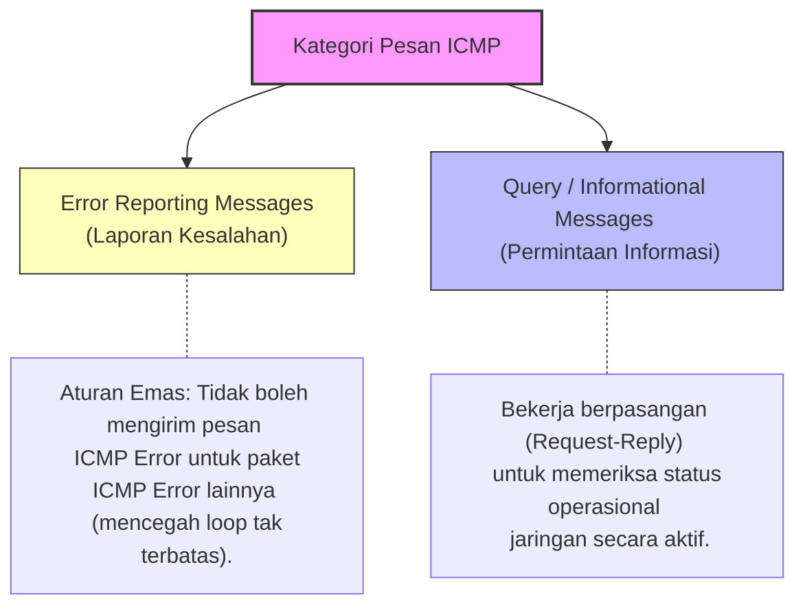
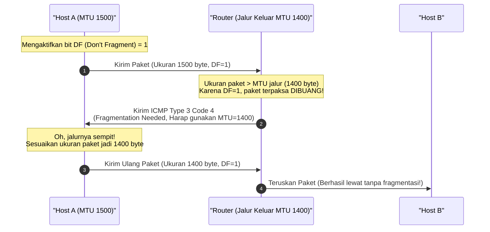
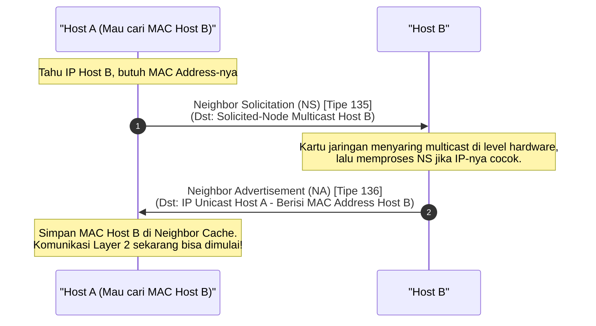

# ICMP Complete Guide: Mengupas Sistem Umpan Balik & Diagnostik Layer 3 di IPv4 dan IPv6 (Week 10)

Halo! Selamat datang kembali di seri catatan belajar **Jaringan Komputer**. Setelah pada materi sebelumnya kita sudah menguasai [[(Week 9a) IPv6 Complete Guide|IPv6 Complete Guide (Week 9)]] dan [[(Week 9b) IPv6 Subnetting Complete Guide|IPv6 Subnetting Complete Guide (Week 9)]], sekarang kita bakal masuk ke sebuah protokol krusial yang bekerja di balik layar untuk memastikan kesehatan pengiriman data kita: **ICMP (Internet Control Message Protocol)**!

Banyak orang mengira ICMP itu cuma urusan "ping-pingan" doang buat ceki-ceki internet konek atau tidak. Padahal, peran ICMP jauh lebih besar dari itu lho! ICMP adalah detak jantung diagnostik internet. Tanpa ICMP, router tidak akan tahu kalau ada paket yang nyasar, komputer kita tidak akan tahu kalau paketnya terlalu besar untuk dilewati, dan kita tidak akan pernah bisa melakukan `traceroute` untuk melacak rute paket.

Di panduan lengkap ini, kita bakal bongkar habis cara kerja ICMP dari nol, membedah struktur header-nya, memahami perbedaan versi IPv4 dan IPv6 (termasuk Neighbor Discovery Protocol yang menggantikan ARP), melacak algoritma alat diagnostik secara langkah-demi-langkah, hingga membahas aspek keamanan yang sering jadi dilema para administrator jaringan.

Yuk, kita mulai petualangannya! 🚀

---

## 1. Analogi & Mental Model: Mengapa IP Butuh ICMP?

Sebelum kita masuk ke spesifikasi teknis, mari kita bangun *mental model*-nya dulu lewat sebuah analogi sederhana.

Bayangkan protokol **IP (Internet Protocol)** itu seperti sebuah **Perusahaan Ekspedisi Kurir Murah Meriah**. Prinsip kerja kurir ini adalah **Best-Effort Delivery** (kirim sebisanya, tanpa garansi). 
* Kurir menerima paket, melihat alamat tujuan, lalu buru-buru membawanya. 
* Dia tidak peduli apakah alamatnya benar-benar ada, jalanannya putus karena longsor, atau rumah tujuannya sudah roboh. 
* Tugas dia cuma *mengantarkan*. Jika di tengah jalan ada masalah, si kurir ini pada dasarnya "bisu" dan "tidak punya ingatan"—dia tidak bisa langsung menelepon Anda (si pengirim) untuk mengabarkan bahwa paketnya gagal sampai.

Karena sistem logistik seperti ini sangat rawan kekacauan, didirikanlah **Layanan Customer Service Umpan Balik (Feedback)** yang bernama **ICMP**. 
* Tugas ICMP adalah mendampingi operasional kurir IP.
* Jika kurir IP menemukan jalanan longsor sehingga paketnya kedaluwarsa (Time Exceeded), atau jika alamat rumah tujuan ternyata fiktif (Destination Unreachable), router atau perangkat yang menemukan masalah tersebut akan mengirimkan **surat laporan kesalahan (ICMP Error Message)** kembali ke alamat rumah Anda.
* Dengan menerima surat dari ICMP ini, Anda sebagai pengirim jadi tahu: *"Oh, ternyata paket saya kemarin tidak sampai karena alamatnya salah, saya kudu kirim ulang dengan alamat baru."*

> [!info] **Poin Kunci Eksistensi ICMP**
> Protokol IP itu bersifat *unreliable* (tidak andal) dan *connectionless* (tidak berorientasi koneksi). IP tidak memiliki mekanisme bawaan untuk mendeteksi atau melaporkan kesalahan pengiriman paket. Di sinilah **ICMP hadir sebagai protokol pembantu** untuk memberikan laporan kesalahan (*error reporting*) dan informasi diagnostik jaringan balik ke sumber pengirim.

---

## 2. Posisi & Enkapsulasi ICMP dalam Arsitektur Jaringan

Meskipun secara konseptual ICMP bertugas menangani masalah di Layer 3 (Network Layer), secara teknis implementasinya agak unik lho. Pesan-pesan ICMP sebenarnya **dibungkus (dienkapsulasi) di dalam payload paket IP**, sama seperti protokol Layer 4 (seperti TCP atau UDP).

Mari kita lihat struktur pembungkusannya:

```text
+-------------------------------------------------------------+
|                     IP Header (Layer 3)                     |
|  - Source IP Address                                        |
|  - Destination IP Address                                   |
|  - Protocol Field (1 = ICMPv4, 58 = ICMPv6)                 |
+-------------------------------------------------------------+
|                     ICMP Header & Payload                   |
|  - Type (8-bit)                                             |
|  - Code (8-bit)                                             |
|  - Checksum (16-bit)                                        |
|  - Message Body (Tergantung tipe pesan)                    |
+-------------------------------------------------------------+
```

> [!important] **Kenapa ICMP Tetap Dianggap Protokol Layer 3?**
> Walaupun dienkapsulasi di dalam paket IP, ICMP diklasifikasikan sebagai protokol Network Layer karena fungsinya sangat erat dengan IP. ICMP tidak menyediakan layanan transportasi data aplikasi pengguna (*user data transport*), melainkan digunakan oleh sistem operasi dan peralatan jaringan untuk mengendalikan dan memantau status pengiriman di Layer 3 itu sendiri.

Pada header IP (baik IPv4 maupun IPv6), ada field bernama **Protocol** (pada IPv4) atau **Next Header** (pada IPv6). Nilai ini memberi tahu sistem operasi jenis payload apa yang ada di dalam paket tersebut:
* **ICMPv4:** Diidentifikasi dengan nilai protokol **`1`** pada header IPv4.
* **ICMPv6:** Diidentifikasi dengan nilai protokol **`58`** pada header IPv6.

---

## 3. Struktur Header Dasar ICMP

Semua pesan ICMP (baik v4 maupun v6) memiliki format header 4-byte pertama yang seragam. Field ini mendefinisikan jenis informasi atau kesalahan apa yang sedang dilaporkan:

1. **Type (8-bit):** Menentukan kategori pesan secara garis besar (misalnya, apakah pesan ini berupa laporan kesalahan atau sekadar permintaan informasi).
2. **Code (8-bit):** Memberikan detail lebih spesifik mengenai alasan dari tipe pesan yang dikirimkan. Satu nilai `Type` bisa memiliki beberapa variasi `Code`.
3. **Checksum (16-bit):** Digunakan untuk mendeteksi jika terjadi kerusakan data pada pesan ICMP selama proses transmisi di jaringan.

```text
 0                   1                   2                   3
 0 1 2 3 4 5 6 7 8 9 0 1 2 3 4 5 6 7 8 9 0 1 2 3 4 5 6 7 8 9 0 1
+-+-+-+-+-+-+-+-+-+-+-+-+-+-+-+-+-+-+-+-+-+-+-+-+-+-+-+-+-+-+-+-+
|   Type (8)    |   Code (8)    |          Checksum (16)        |
+-+-+-+-+-+-+-+-+-+-+-+-+-+-+-+-+-+-+-+-+-+-+-+-+-+-+-+-+-+-+-+-+
|                                                               |
|                 Rest of Header (32-bit / 4 bytes)             |
|                 (Formatnya berbeda tergantung Type)           |
+-+-+-+-+-+-+-+-+-+-+-+-+-+-+-+-+-+-+-+-+-+-+-+-+-+-+-+-+-+-+-+-+
|                                                               |
|                        Payload Data                           |
|                 (Berisi potongan header paket asli)           |
|                                                               |
+-+-+-+-+-+-+-+-+-+-+-+-+-+-+-+-+-+-+-+-+-+-+-+-+-+-+-+-+-+-+-+-+
```

> [!info] **Mengapa Ada Payload Data pada Laporan Error ICMP?**
> Ketika terjadi error, ICMP tidak cuma mengirim kode error kosong. Payload data pada pesan ICMP error biasanya menyertakan **seluruh IP header dari paket asli yang memicu error** ditambah dengan **8-byte pertama dari payload paket asli** tersebut (biasanya berisi nomor port TCP/UDP atau nomor sequence). 
> 
> *Tujuannya buat apa?* Supaya komputer pengirim yang menerima pesan ICMP error ini bisa mencocokkan laporan error tersebut dengan aplikasi atau soket koneksi spesifik mana yang mengirimkannya!

---

## 4. Klasifikasi Pesan ICMP: Error Reporting vs. Query

Secara umum, pesan ICMP dibagi menjadi dua kategori besar berdasarkan tujuannya:



### A. Error Reporting Messages (Laporan Kesalahan)
Pesan ini bersifat satu arah dan dikirim secara reaktif oleh router atau host tujuan ketika mereka gagal memproses paket IP karena masalah tertentu. 

> [!important] **Aturan Emas Pencegahan Loop ICMP**
> Untuk menghindari penumpukan trafik sampah di jaringan (*network congestion*), pesan ICMP Error **dilarang keras** dikirim sebagai respons terhadap:
> 1. Paket pesan ICMP Error lainnya.
> 2. Paket multicast atau broadcast.
> 3. Paket dengan alamat IP sumber khusus (seperti loopback `127.0.0.1` atau biner nol).
> 
> Jika aturan ini dilanggar, bisa terjadi efek domino di mana pesan error memicu pesan error baru tanpa henti, menciptakan badai trafik yang bisa melumpuhkan router!

### B. Query / Informational Messages (Permintaan Informasi)
Pesan ini digunakan secara aktif untuk mengumpulkan informasi diagnostik dari perangkat jaringan. Polanya selalu berpasangan: satu perangkat mengirimkan permintaan (*Request*), dan perangkat tujuan mengembalikan jawaban (*Reply*). 

Contoh paling klasiknya adalah **ICMP Echo Request** dan **ICMP Echo Reply** yang digunakan oleh aplikasi `ping`.

---

## 5. Bedah Detail Kode Error & Mekanisme Path MTU Discovery

Mari kita bedah jenis-jenis pesan ICMP Error yang paling sering muncul di lapangan serta kode-kode penjelasnya.

### A. Destination Unreachable (Tujuan Tidak Dapat Dijangkau)
Pesan ini dikirim ketika paket tidak bisa diantarkan ke tujuan akhirnya. Alasan ketidakjangkauan ini didefinisikan secara rinci lewat nilai `Code`:

#### ICMPv4 Destination Unreachable (`Type 3`):
* **`Code 0` - Net Unreachable:** Router tidak memiliki rute (*routing entry*) untuk jaringan tujuan di tabel routingnya.
* **`Code 1` - Host Unreachable:** Router tahu rute ke jaringan tujuan, tetapi saat mencoba mengirim paket ke host spesifik menggunakan ARP, host tersebut tidak memberikan respons (mungkin komputer mati atau kabel dicabut).
* **`Code 2` - Protocol Unreachable:** Paket sampai di host tujuan, tetapi protokol transport (misalnya jenis protokol Layer 4 yang tidak umum) tidak didukung oleh tumpukan protokol (*protocol stack*) OS penerima.
* **`Code 3` - Port Unreachable:** Port transport (TCP/UDP) pada host tujuan tidak sedang didengarkan (*listening*) oleh aplikasi apa pun.
* **`Code 4` - Fragmentation Needed and DF Set:** Router menerima paket yang ukurannya melebihi kapasitas MTU (*Maximum Transmission Unit*) jalur keluar, tetapi bit *Don't Fragment* (DF) pada header IP bernilai 1. Router terpaksa membuang paket tersebut.

#### ICMPv6 Destination Unreachable (`Type 1`):
* **`Code 0` - No route to destination:** Sama seperti Net Unreachable pada IPv4.
* **`Code 1` - Communication with destination administratively prohibited:** Paket diblokir oleh kebijakan keamanan (misalnya aturan ACL pada firewall).
* **`Code 2` - Beyond scope of source address:** Mencoba mengirim paket ke luar link menggunakan alamat IP lokal (Link-Local Address).
* **`Code 3` - Address unreachable:** Kegagalan resolusi alamat IP ke MAC address pada IPv6.
* **`Code 4` - Port unreachable:** Port tujuan pada host penerima ditutup.

---

### B. Studi Kasus: Cara Kerja Path MTU Discovery (PMTUD)

Di sinilah peran luar biasa dari pesan **ICMP Type 3 Code 4** (atau pesan **Packet Too Big - Type 2** pada ICMPv6) dimanfaatkan untuk mengoptimalkan pengiriman data tanpa fragmentasi.

Secara default, jika sebuah komputer mengirimkan paket data berukuran besar (misalnya 1500 byte) melewati serangkaian router yang memiliki kapasitas jalur bervariasi (MTU berbeda-beda), router-router tersebut normalnya akan memotong-motong paket tersebut (*fragmentation*) agar bisa lewat. Namun, fragmentasi ini membebani CPU router dan memperlambat transmisi.

Untuk menghindarinya, sistem operasi modern menggunakan teknik **Path MTU Discovery (PMTUD)**:



> [!important] **Dampak Buruk Memblokir ICMP Terhadap PMTUD (Black Hole)**
> Banyak administrator jaringan memblokir semua pesan ICMP pada firewall karena alasan keamanan. Ketika hal ini dilakukan, pesan ICMP Type 3 Code 4 dari router tidak akan pernah sampai ke Host A. 
> 
> Akibatnya, Host A akan terus mengirimkan paket berukuran 1500 byte dengan bit DF=1, router akan terus membuang paket tersebut secara diam-diam, dan koneksi akan mengalami *hang* atau *timeout* tanpa pesan kesalahan yang jelas. Fenomena ini disebut dengan istilah **Black Hole Router**!

---

### C. Time Exceeded (Waktu Habis)
Pesan ini dikirim jika paket dibuang karena batas umurnya telah habis. 

* **ICMPv4 Time Exceeded (`Type 11, Code 0`):** Terjadi ketika router mengurangi nilai field **TTL (Time to Live)** pada header IPv4 menjadi `0`. Ini adalah mekanisme krusial untuk mencegah paket berputar-putar selamanya di dalam jaringan jika terjadi kesalahan konfigurasi tabel routing (*routing loop*).
* **ICMPv6 Time Exceeded (`Type 3, Code 0`):** Memiliki fungsi yang sama persis, tetapi dipicu oleh field **Hop Limit** pada header IPv6 yang menyusut hingga bernilai `0`.

---

## 6. ICMPv6 Neighbor Discovery Protocol (NDP): Pengganti ARP

Pada protokol IPv6, fungsionalitas ICMP ditingkatkan secara signifikan. Beberapa protokol utilitas penting yang sebelumnya berdiri sendiri atau menggunakan broadcast (seperti ARP pada IPv4) kini dilebur langsung ke dalam protokol **ICMPv6** melalui mekanisme bernama **Neighbor Discovery Protocol (NDP)**.

NDP menggunakan 4 jenis pesan ICMPv6 khusus untuk memanajeman interaksi lokal antar host dan router:

### A. Router Messaging (Untuk Alokasi Alamat Dinamis)
1. **Router Solicitation (RS - Type 133):** Dikirim oleh host yang baru aktif untuk mendeteksi keberadaan router di link lokal tersebut. Pesan ini dikirim ke alamat multicast khusus *All-Routers Multicast* (`ff02::2`).
2. **Router Advertisement (RA - Type 134):** Dikirim oleh router secara periodik (setiap 200 detik) atau langsung sebagai respons instan atas pesan RS. RA berisi prefix jaringan lokal, panjang prefix, dns, serta instruksi apakah host harus menggunakan konfigurasi otomatis **SLAAC** atau meminta alamat ke server **DHCPv6**.

---

### B. Device Messaging (Untuk Resolusi Alamat & Deteksi Bentrokan)
1. **Neighbor Solicitation (NS - Type 135):** Memiliki dua fungsi utama:
   * **Address Resolution (Pengganti ARP):** Ketika Host A tahu IP milik Host B tetapi tidak tahu MAC address-nya, Host A mengirim pesan NS ke alamat *Solicited-Node Multicast* milik Host B untuk menanyakannya.
   * **Duplicate Address Detection (DAD):** Saat sebuah host baru saja mengonfigurasi IP address barunya (baik manual maupun otomatis), ia mengirim NS ke alamat IP barunya itu sendiri. Jika ada perangkat lain yang menjawab, artinya IP tersebut bentrok dan tidak boleh digunakan!
2. **Neighbor Advertisement (NA - Type 136):** Dikirim sebagai balasan atas pesan NS, berisi informasi MAC address dari perangkat pengirim untuk memperbarui tabel cache tetangga (*neighbor cache*) pada perangkat peminta.



---

## 7. Bedah Cara Kerja Alat Diagnostik: Ping & Traceroute

Aplikasi utilitas diagnostik jaringan yang paling sering kita gunakan sehari-hari, yaitu `ping` dan `traceroute`, sepenuhnya mengandalkan manipulasi pesan ICMP untuk menjalankan fungsinya.

### A. Ping (Testing Connectivity)

Aplikasi `ping` bekerja menggunakan pola pesan Query yang sangat lugas:

1. Komputer Anda mengirimkan pesan **ICMP Echo Request** (`Type 8` pada IPv4, `Type 128` pada IPv6) ke IP tujuan.
2. Jika host tujuan aktif dan konfigurasinya mengizinkan, host tersebut wajib membalas dengan mengirimkan pesan **ICMP Echo Reply** (`Type 0` pada IPv4, `Type 129` pada IPv6) kembali ke komputer Anda.
3. Selisih waktu dari saat Echo Request dikirim hingga Echo Reply diterima dihitung sebagai **RTT (Round-Trip Time)** dalam satuan milidetik (ms).

> [!tip] **Mengapa Ping Pertama Sering RTO (Request Time Out)?**
> Saat kita melakukan ping ke perangkat baru yang berada dalam satu subnet lokal, Anda mungkin melihat ping pertama berstatus *Time Out* sebelum ping berikutnya sukses beruntun. 
> 
> *Kenapa hal ini terjadi?* Karena sebelum komputer bisa mengirimkan paket ICMP Echo Request, ia wajib mencari tahu MAC Address host tujuan terlebih dahulu melalui proses resolusi alamat (ARP Request pada IPv4 atau Neighbor Solicitation pada IPv6). 
> 
> Proses pencarian MAC address ini memakan waktu yang cukup untuk membuat paket ping pertama mengalami kadaluwarsa waktu (*timeout*) pada antrean sistem operasi sebelum sempat dilepas ke kabel.

---

### B. Traceroute (Testing the Path)

`traceroute` (atau `tracert` pada sistem operasi Windows) adalah alat cerdas yang digunakan untuk memetakan daftar hop router yang dilewati oleh paket dari komputer kita hingga mencapai tujuan.

Bagaimana cara `traceroute` mengetahui IP router di tengah jalan padahal ia tidak memiliki akses langsung ke router tersebut? **Ia memanipulasi field TTL (Time to Live) atau Hop Limit!**

Mari kita lihat ilustrasi langkah demi langkah berikut:

```text
[Host Pengirim] ----> (Router 1) ----> (Router 2) ----> [Host Tujuan]
```

1. **Hop 1 (TTL = 1):**
   * Host pengirim meluncurkan paket pertama dengan nilai **TTL = 1** ke arah host tujuan.
   * Paket sampai di **Router 1**. Router 1 akan memproses paket tersebut dan mendapati bahwa ia harus meneruskannya. Sebelum diteruskan, Router 1 mengurangi nilai TTL paket: $\text{TTL} = 1 - 1 = 0$.
   * Karena TTL telah habis mencapai `0`, Router 1 terpaksa membuang paket tersebut dan mengirimkan pesan **ICMP Time Exceeded (Type 11, Code 0)** kembali ke host pengirim.
   * Host pengirim menerima pesan ICMP tersebut, melihat alamat IP pengirimnya (yaitu IP Router 1), dan mencatatnya sebagai **Hop 1** beserta durasi RTT-nya.

2. **Hop 2 (TTL = 2):**
   * Host pengirim meluncurkan paket berikutnya dengan nilai **TTL = 2**.
   * Paket melewati **Router 1**. Router 1 mengurangi TTL menjadi $1$ ($\text{TTL} = 2 - 1 = 1$), lalu meneruskannya ke Router 2.
   * Paket sampai di **Router 2**. Router 2 mendapati TTL paket bernilai `1` dan menguranginya menjadi `0` ($\text{TTL} = 1 - 1 = 0$).
   * Karena TTL habis, Router 2 membuang paket dan mengirimkan **ICMP Time Exceeded** kembali ke host pengirim.
   * Host pengirim mencatat IP Router 2 sebagai **Hop 2**.

3. **Hop 3 (TTL = 3 - Sampai di Tujuan):**
   * Host pengirim menaikkan lagi nilai TTL menjadi **3**.
   * Paket berhasil melewati Router 1 (TTL menjadi 2) dan Router 2 (TTL menjadi 1) hingga akhirnya sukses mendarat di **Host Tujuan**.
   * Karena paket sudah mencapai destinasi akhir, paket tersebut tidak akan dikurangi TTL-nya lagi ke nilai `0`.
   * Host tujuan menyadari paket tersebut ditujukan untuk dirinya dan mengembalikan respons yang menandakan akhir dari pelacakan rute.

---

### Perbedaan Implementasi: Windows (`tracert`) vs. Linux/Unix (`traceroute`)

Meskipun logika pelacakannya sama, jenis paket yang dikirimkan oleh sistem operasi Windows dan Linux/Unix sangat berbeda lho:

| Fitur | Windows (`tracert`) | Linux / Unix (`traceroute`) |
| :--- | :--- | :--- |
| **Jenis Paket yang Dikirim** | **ICMP Echo Request** | **UDP Datagram** (dengan port tujuan tinggi, misal 33434+) |
| **Pesan Akhir dari Tujuan** | **ICMP Echo Reply** | **ICMP Port Unreachable** (`Type 3, Code 3`) |
| **Alasan Respons Akhir** | Tujuan membalas permintaan ping secara normal karena merasa dirinya ditargetkan. | Port UDP acak yang tinggi tersebut dipastikan tertutup, sehingga OS tujuan mengirim pesan error *Port Unreachable*. Ini sinyal bagi Linux bahwa tujuan telah tercapai. |

---

## 8. Aspek Keamanan: Bahaya & Dilema Filtrasi ICMP

Dalam dunia keamanan siber, ICMP sering kali dipandang dengan rasa curiga oleh para insinyur keamanan. Protokol ini sering disalahgunakan oleh penyerang untuk berbagai jenis eksploitasi:

### A. Jenis Serangan Berbasis ICMP
1. **Reconnaissance (Ping Sweep):** Penyerang mengirimkan pesan ICMP Echo Request ke seluruh blok IP target secara massal untuk memetakan komputer mana saja yang aktif dan siap diserang.
2. **Ping of Death:** Serangan warisan di mana penyerang mengirimkan paket ping terfragmentasi dengan ukuran total melebihi batas maksimum IP (65.535 byte). Saat sistem operasi korban mencoba menyatukan kembali (*reassemble*) fragmen tersebut, terjadi luapan memori (*buffer overflow*) yang menyebabkan OS *crash* (layar biru / BSOD).
3. **ICMP Flood (DDoS):** Membanjiri server korban dengan jutaan permintaan ping secara simultan untuk menghabiskan bandwidth dan sumber daya CPU server dalam memproses balasan Echo Reply.
4. **ICMP Tunneling:** Teknik penyelundupan data di mana penyerang menyisipkan data terlarang (seperti perintah shell jarak jauh atau lalu lintas web) ke dalam payload pesan ICMP Echo Request/Reply. Karena banyak firewall membiarkan lalu lintas ping lolos begitu saja, data ini bisa keluar-masuk jaringan perusahaan tanpa terdeteksi.

---

### B. Solusi Terbaik: Keamanan Selektif (Selective Filtering)

Menanggapi bahaya di atas, banyak administrator mengambil keputusan ekstrem dengan **memblokir seluruh paket ICMP secara total** di firewall tepi jaringan (*perimeter firewall*). 

> [!caution] **Bahaya Memblokir ICMP Secara Total**
> Pemblokiran ICMP secara total adalah keputusan buruk karena:
> 1. **IPv4:** Merusak fungsi Path MTU Discovery (PMTUD), menyebabkan kegagalan koneksi (*packet drop*) misterius untuk paket berukuran besar.
> 2. **IPv6:** Merusak seluruh fungsi dasar jaringan. Di IPv6, pemblokiran ICMPv6 akan mematikan protokol Neighbor Discovery (NDP). Walhasil, perangkat tidak akan bisa melakukan resolusi alamat MAC, tidak bisa melakukan autokonfigurasi SLAAC, dan **jaringan IPv6 akan lumpuh total!**

#### Rekomendasi Best Practice Konfigurasi Firewall:
Alih-alih memblokir semua pesan ICMP, lakukan penyaringan secara selektif (*selective filtering*):

* **IZINKAN (Allow) pesan error kritis berikut untuk transit:**
  * ICMPv4: Destination Unreachable (`Type 3`) dan Time Exceeded (`Type 11`).
  * ICMPv6: Destination Unreachable (`Type 1`), Packet Too Big (`Type 2`), Time Exceeded (`Type 3`), dan Parameter Problem (`Type 4`).
* **BATASI / BLOKIR (Block/Rate-Limit) pesan query:**
  * Blokir pesan ICMP Echo Request (`Type 8` v4 / `Type 128` v6) yang datang dari arah luar (internet publik) ke arah jaringan internal untuk mencegah pemetaan *Ping Sweep*.
  * Jika ingin mengizinkan pengujian ping dari luar ke server publik tertentu, terapkan kebijakan batasan laju lalu lintas (*rate-limiting*) yang ketat agar tidak memicu banjir DDoS.

---

## Ringkasan Cepat untuk Persiapan Ujian (Cheat Sheet)

* **Layer & Protokol:** ICMP bekerja di Layer 3, namun pesan-pesannya dibungkus dalam payload paket IP (Protocol 1 untuk v4, Next Header 58 untuk v6).
* **Fungsi Utama:** Melaporkan kesalahan pengiriman paket (*Error Reporting*) dan memfasilitasi diagnostik jaringan (*Query*).
* **Aturan Error:** Pesan ICMP Error tidak boleh memicu pesan ICMP Error lainnya untuk menghindari loop tak berujung.
* **Path MTU Discovery (PMTUD):** Menggunakan pesan *Fragmentation Needed & DF Set* untuk menentukan ukuran paket terbesar yang bisa melintasi seluruh jalur rute tanpa perlu difragmentasi.
* **Neighbor Discovery Protocol (NDP):** Pengganti fungsi ARP dan DHCP otomatis pada IPv6, digerakkan menggunakan pesan ICMPv6 RS, RA, NS, dan NA.
* **Logika Traceroute:** Mengirim paket dengan TTL/Hop Limit yang dinaikkan secara bertahap (1, 2, 3...) untuk memaksa setiap router di sepanjang jalur mengirimkan pesan *ICMP Time Exceeded*.
* **Konsekuensi Pemblokiran:** Memblokir ICMPv6 secara total akan melumpuhkan fungsionalitas dasar jaringan IPv6 karena NDP bergantung sepenuhnya pada ICMPv6.

Semoga panduan lengkap ini membantu Anda memahami mekanisme internal ICMP secara mendalam dan siap menghadapi berbagai variasi soal kuis maupun ujian jaringan komputer! Tetap semangat belajarnya! 🚀
