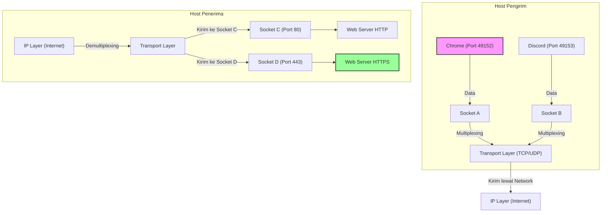
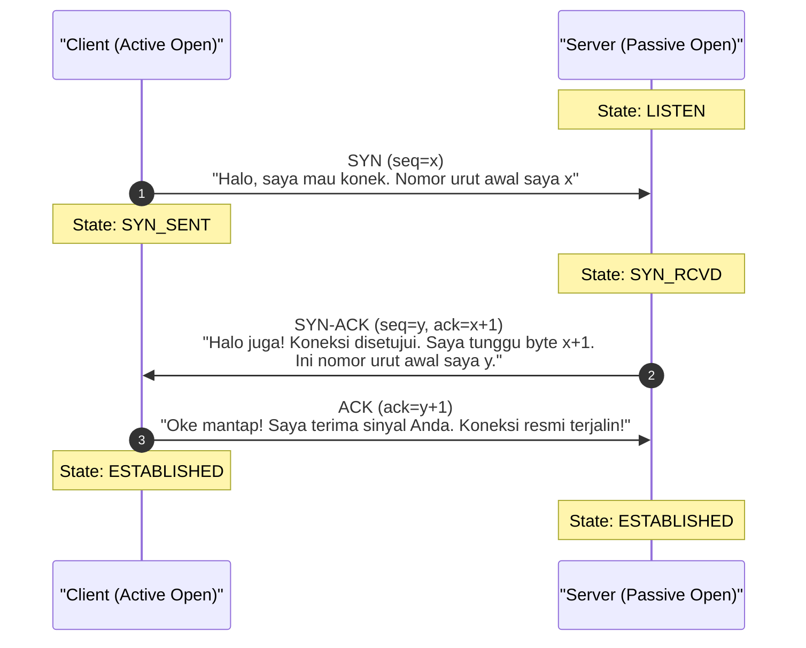
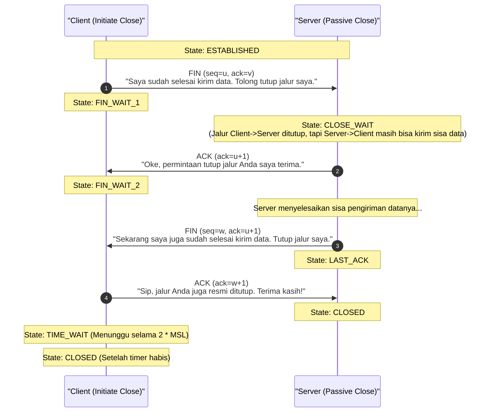
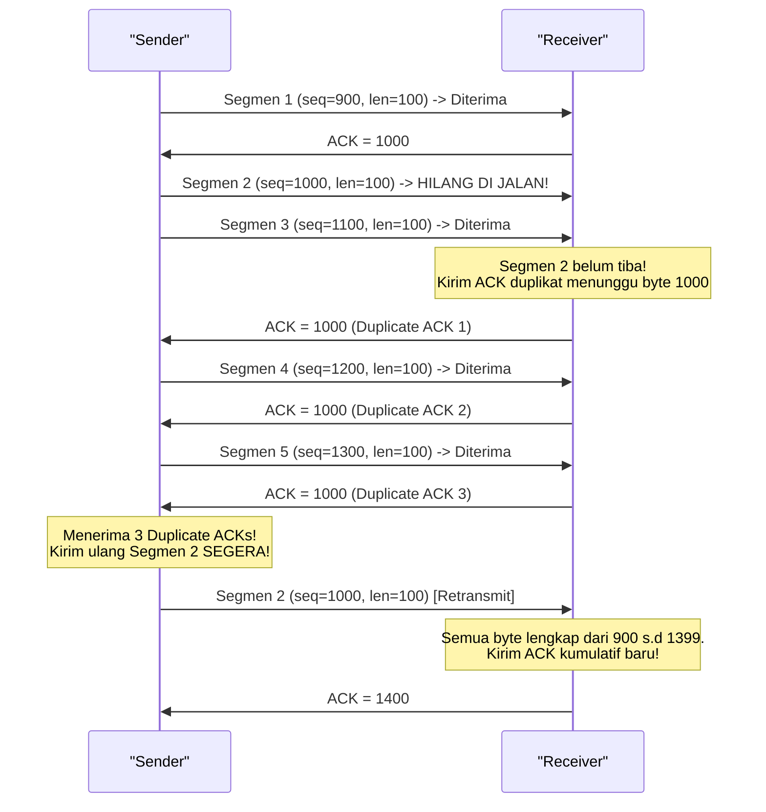

# Transport Layer Complete Guide: Mengupas Tuntas TCP, UDP, Aliran Data, & Keandalan Transmisi (Week 11)

Halo! Selamat datang kembali di seri catatan belajar **Jaringan Komputer**. Setelah pada materi sebelumnya kita sudah mengupas tuntas sistem pos dan persinyalan di Layer 3 lewat [[(Week 10) ICMP Complete Guide|ICMP Complete Guide (Week 10)]], sekarang kita naik satu tingkat ke **Layer 4 (Transport Layer)**!

Kalau Layer 3 (Internet/Network Layer) itu fokusnya adalah *bagaimana cara mengirimkan paket dari satu komputer ke komputer lain di ujung dunia (host-to-host delivery)*, maka **Transport Layer** memiliki tugas yang lebih intim: *bagaimana memastikan data dari aplikasi di komputer pengirim bisa sampai ke aplikasi yang tepat di komputer penerima secara andal, urut, dan efisien (process-to-process delivery)*.

Di panduan super lengkap ini, kita bakal bedah habis dari nol konsep dasar transportasi data, cara kerja soket (*sockets*), pembagian port, pertempuran klasik antara **TCP vs UDP**, hingga mekanisme canggih di balik layar TCP seperti *Three-Way Handshake*, *Sliding Window*, dan *Congestion Control*.

Yuk, kita kupas tuntas sampai ke akar-akarnya! 🚀

---

## 1. Analogi Dunia Nyata: Layanan Paket Pos Tercatat vs. Megafon / Kartu Pos

Biar kita punya *mental model* yang kuat sebelum melahap deretan istilah teknis, mari kita bayangkan dua cara berbeda dalam mengirimkan informasi di dunia nyata:

### Analogi TCP: Layanan Kurir Premium & Pos Tercatat
Bayangkan kamu sedang mengirimkan naskah buku setebal 100 halaman ke penerbit menggunakan kurir premium:
1. **Jabat Tangan Awal:** Sebelum mengirim naskah, kamu menelepon penerbit dulu untuk memastikan mereka siap menerima kiriman hari itu (*Established Connection*).
2. **Penomoran Halaman:** Kamu menulis nomor halaman `1` sampai `100` pada naskahmu. Jika ada halaman yang hilang atau urutannya berantakan karena tertiup angin, penerbit tahu mana yang hilang dan bisa menyusunnya kembali dengan benar (*Sequence & Acknowledgement Numbers*).
3. **Konfirmasi Penerimaan:** Setiap kali penerbit menerima 10 halaman, mereka mengirim pesan WA ke kamu: *"Halaman 1-10 sudah aman, silakan kirim halaman 11 dst."* (*Acknowledgement*).
4. **Pengiriman Ulang:** Jika dalam 5 menit kamu tidak mendapat konfirmasi untuk halaman 11-20, kamu berasumsi kurir kehilangan naskah itu dan kamu akan mencetaknya lagi lalu mengirimnya kembali (*Retransmission*).
5. **Kontrol Kecepatan:** Penerbit memberi tahu kamu: *"Meja kerja saya kecil, tolong kirim maksimal 10 halaman dulu sekali kirim, jangan langsung 100 halaman nanti berantakan!"* (*Flow Control*).

Inilah prinsip kerja **TCP (Transmission Control Protocol)**. Aman, andal, teratur, tapi butuh banyak obrolan tambahan (*overhead*).

### Analogi UDP: Teriak Lewat Megafon atau Kirim Kartu Pos
Sekarang, bayangkan kamu sedang berdiri di atas panggung konser dan ingin menyapa penonton menggunakan megafon:
1. Kamu langsung teriak saja tanpa perlu menelepon atau menanyakan apakah penonton sudah siap mendengarkan (*Connectionless*).
2. Kamu berteriak secepat mungkin. Jika ada penonton yang berkedip atau terganggu suara bising jalanan sehingga kehilangan 1-2 kata, kamu tidak akan mengulangi teriakanmu (*Best-Effort Delivery, No Retransmission*).
3. Kamu tidak peduli apakah penonton mendengar kata pertama dulu baru kata kedua, atau semuanya terdengar campur aduk (*No Sequencing*).

Inilah prinsip kerja **UDP (User Datagram Protocol)**. Sangat cepat, tanpa basa-basi jabat tangan, ringan, cocok untuk skenario di mana kecepatan adalah segalanya dan kehilangan sedikit data bukanlah kiamat.

---

## 2. Peran Krusial Transport Layer & Arsitektur Sockets

Protokol IP di Layer 3 hanya bertugas merutekan paket dari host sumber ke host tujuan menggunakan **IP Address**. Namun, sebuah komputer tidak hanya menjalankan satu aplikasi jaringan, kan? Kamu bisa saja sedang nonton *YouTube* di browser, sambil *chatting* di Discord, sekaligus men-download game di Steam secara bersamaan.

Bagaimana komputer bisa tahu paket mana yang harus dikirim ke Chrome, Discord, atau Steam? Di sinilah **Transport Layer** masuk membawa konsep **Sockets** dan **Port Numbers**!



### A. Multiplexing & Demultiplexing
* **Multiplexing (Mux):** Proses di sisi pengirim di mana Transport Layer mengumpulkan potongan data dari berbagai aplikasi yang berbeda (melalui soket masing-masing), menambahkan header Transport Layer yang berisi nomor port untuk membuat segmen data, lalu meneruskannya ke Network Layer di bawahnya.
* **Demultiplexing (Demux):** Proses di sisi penerima di mana Transport Layer menerima segmen dari Network Layer, memeriksa informasi port pada header segmen, lalu menyalurkan data tersebut ke soket aplikasi yang tepat.

### B. Jenis Demultiplexing: UDP vs TCP
Komputer membedakan cara menyalurkan paket berdasarkan protokol yang digunakan:

#### 1. Connectionless Demultiplexing (UDP)
Soket UDP diidentifikasi secara sederhana menggunakan **2-Tuple (Dua Parameter Utama)**:
$$\text{Socket UDP} = (\text{Destination IP}, \text{Destination Port})$$

> [!important] **Aturan Emas Demux UDP**
> Jika ada dua segmen UDP yang datang dari alamat IP pengirim yang berbeda atau nomor port pengirim yang berbeda, tetapi memiliki **Destination IP** dan **Destination Port** yang sama, maka kedua paket tersebut akan dimasukkan ke **soket UDP yang sama** di sisi penerima.

#### 2. Connection-Oriented Demultiplexing (TCP)
Soket TCP diidentifikasi menggunakan **4-Tuple (Empat Parameter Utama)**:
$$\text{Socket TCP} = (\text{Source IP}, \text{Source Port}, \text{Destination IP}, \text{Destination Port})$$

> [!important] **Aturan Emas Demux TCP**
> Dua segmen TCP yang datang dari pengirim berbeda atau port pengirim berbeda akan diarahkan ke **dua soket TCP yang berbeda**, meskipun tujuan akhirnya sama (misalnya, sama-sama menuju port 80 pada web server yang sama). 
> 
> Hal inilah yang memungkinkan sebuah web server HTTP (`10.0.0.1` port `80`) melayani ribuan koneksi dari ribuan pengunjung yang berbeda secara terpisah tanpa datanya tercampur!

### C. Pembagian Nomor Port (Port Numbers)
Port number adalah angka 16-bit, yang artinya ada total $2^{16} = 65.536$ kemungkinan port (dari port `0` hingga `65535`). Badan otoritas internet **IANA** membaginya menjadi tiga kategori:

| Rentang Port | Kategori | Penjelasan & Contoh |
| :--- | :--- | :--- |
| **0 - 1023** | **Well-Known Ports** | Dicadangkan untuk layanan/protokol standar internet yang populer.<br>• **SSH:** 22<br>• **DNS:** 53<br>• **HTTP:** 80<br>• **HTTPS:** 443 |
| **1024 - 49151** | **Registered Ports** | Digunakan oleh aplikasi pihak ketiga atau perusahaan komersial.<br>• **MySQL Database:** 3306<br>• **HTTP Alternative:** 8080 |
| **49152 - 65535** | **Dynamic / Ephemeral Ports** | Port sementara yang dialokasikan secara acak oleh OS klien saat membuka koneksi keluar ke server. |

---

## 3. User Datagram Protocol (UDP): Si Gesit Tanpa Beban

**UDP** (ditentukan dalam RFC 768) adalah protokol transport yang paling minimalis. Ia hanya menyediakan fungsi dasar Layer 4: multiplexing, demultiplexing, dan pengecekan error sederhana tanpa jaminan keandalan (*best-effort*).

### Karakteristik Utama UDP:
* **Connectionless:** Tanpa jabat tangan (*handshake*) awal. Klien langsung meluncurkan data begitu saja.
* **Stateless:** Tidak ada status (*state*) koneksi yang disimpan di pengirim maupun penerima.
* **Low Overhead Header:** Hanya menambahkan 8 byte informasi tambahan pada data.
* **No Congestion Control:** UDP akan memancarkan data secepat kemampuan aplikasi. Ini penting untuk aplikasi *real-time* yang tidak mau pengirimannya dihambat oleh kemacetan jaringan lokal.

### Format UDP Header (8 Bytes)
Saking sederhananya, header UDP hanya berisi 4 kolom utama:

| 16-bit Source Port | 16-bit Destination Port |
| :---: | :---: |
| **16-bit Length** | **16-bit Checksum** |

* **Length:** Menentukan ukuran total segmen UDP (Header + Payload Data) dalam satuan byte.
* **Checksum:** Digunakan untuk mendeteksi apakah terjadi kerusakan bit selama transmisi paket.

### A. Cara Kerja Checksum & Konsep Pseudo-Header
Meskipun UDP sederhana, ia tetap peduli terhadap integritas data. Checksum UDP menghitung komplemen-satu (*one's complement*) dari penjumlahan semua kata 16-bit dalam segmen tersebut.

> [!info] **Apa itu Pseudo-Header?**
> Saat menghitung checksum, UDP tidak hanya menghitung data di Layer 4 saja lho. Ia meminjam beberapa informasi dari Layer 3 (IP Layer) untuk membentuk **Pseudo-Header** yang diselipkan sementara saat kalkulasi checksum dilakukan.
> 
> Informasi tersebut meliputi:
> 1. **Source IP Address**
> 2. **Destination IP Address**
> 3. **Protocol ID** (Bernilai `17` untuk UDP)
> 4. **UDP Length**
> 
> *Kenapa kudu begini?* Biar UDP bisa mendeteksi jika terjadi kesalahan perutean di Layer 3 (misalnya, paket sampai di kartu jaringan komputer yang salah karena salah merutekan IP). Jika checksum tidak cocok karena IP tujuan berubah, paket akan langsung dibuang!

---

## 4. Transmission Control Protocol (TCP): Keandalan Mutlak

**TCP** (ditentukan dalam RFC 793) adalah raksasa pekerja keras di Transport Layer. Ia dirancang untuk mengubah media pengiriman yang tidak andal (seperti IP Layer) menjadi saluran komunikasi yang 100% andal, urut, dan bebas dari duplikasi data.

### Karakteristik Utama TCP:
* **Connection-Oriented:** Harus membuat koneksi logis terlebih dahulu sebelum mengirim data.
* **Point-to-Point:** Koneksi selalu terjadi tepat antara satu pengirim dan satu penerima (tidak mendukung multicast/broadcast).
* **Reliable & Ordered:** Menjamin data sampai dengan utuh dan dalam urutan yang tepat.
* **Full-Duplex:** Aliran data bisa mengalir ke dua arah secara bersamaan pada koneksi yang sama.
* **Flow & Congestion Control:** Menjaga agar pengirim tidak membuat penerima kebanjiran data atau merusak jalur jaringan yang sedang macet.

### Format TCP Header (Minimal 20 Bytes)
Header TCP jauh lebih gemuk dibandingkan UDP untuk mendukung fitur-fiturnya yang kompleks:

```text
 0                   1                   2                   3
 0 1 2 3 4 5 6 7 8 9 0 1 2 3 4 5 6 7 8 9 0 1 2 3 4 5 6 7 8 9 0 1
+-+-+-+-+-+-+-+-+-+-+-+-+-+-+-+-+-+-+-+-+-+-+-+-+-+-+-+-+-+-+-+-+
|          Source Port          |       Destination Port        |
+-+-+-+-+-+-+-+-+-+-+-+-+-+-+-+-+-+-+-+-+-+-+-+-+-+-+-+-+-+-+-+-+
|                        Sequence Number                        |
+-+-+-+-+-+-+-+-+-+-+-+-+-+-+-+-+-+-+-+-+-+-+-+-+-+-+-+-+-+-+-+-+
|                     Acknowledgment Number                     |
+-+-+-+-+-+-+-+-+-+-+-+-+-+-+-+-+-+-+-+-+-+-+-+-+-+-+-+-+-+-+-+-+
|  Data |           |U|A|P|R|S|F|                               |
| Offset| Reserved  |R|C|S|S|Y|I|            Window             |
| (4bit)|           |G|K|H|T|N|N|                               |
+-+-+-+-+-+-+-+-+-+-+-+-+-+-+-+-+-+-+-+-+-+-+-+-+-+-+-+-+-+-+-+-+
|           Checksum            |         Urgent Pointer        |
+-+-+-+-+-+-+-+-+-+-+-+-+-+-+-+-+-+-+-+-+-+-+-+-+-+-+-+-+-+-+-+-+
|                    Options (Variable Length)                  |
+-+-+-+-+-+-+-+-+-+-+-+-+-+-+-+-+-+-+-+-+-+-+-+-+-+-+-+-+-+-+-+-+
```

#### Deskripsi Field Kritis TCP:
* **Sequence Number (32-bit):** Menyimpan nomor urut untuk byte pertama dari data yang ada di segmen tersebut. Digunakan untuk perakitan ulang (*reassembly*).
* **Acknowledgment Number (32-bit):** Menyimpan nomor byte berikutnya yang diharapkan oleh penerima.
* **Data Offset (Header Length):** Panjang header TCP (karena ada bagian *Options* yang ukurannya bisa berubah-ubah).
* **Control Bits (Flags):** Bit penentu fungsi segmen:
  - `SYN` (Synchronize): Digunakan saat inisiasi koneksi.
  - `ACK` (Acknowledgment): Menunjukkan nomor acknowledgment valid.
  - `FIN` (Finish): Digunakan untuk memutuskan koneksi secara normal.
  - `RST` (Reset): Memutuskan koneksi secara paksa karena ada error fatal.
  - `PSH` (Push): Meminta OS segera menyerahkan data ke aplikasi tanpa menunggu buffer penuh.
  - `URG` (Urgent): Menandakan data mendesak yang ditunjuk oleh *Urgent Pointer*.
* **Window Size (16-bit):** Jumlah byte yang bersedia diterima oleh host penerima pada saat itu (kontrol aliran).

---

## 5. Siklus Hidup Koneksi TCP: Pembuatan & Pemutusan Koneksi

TCP adalah mesin status (*state machine*). Koneksi harus didirikan secara resmi melalui **Three-Way Handshake** dan diakhiri secara tertib via **Four-Way Handshake**.

### A. Inisiasi Koneksi: Three-Way Handshake

Sebelum mengirimkan data aplikasi, client dan server bertukar segmen kontrol untuk menyinkronkan nomor urut awal (*Initial Sequence Number / ISN*).



> [!important] **Kenapa Harus 3 Langkah? Kenapa Tidak 2 Saja?**
> Jawabannya adalah untuk **mencegah masalah paket lama yang terlambat (delayed segments)**. 
> 
> Bayangkan jika hanya butuh 2 langkah (SYN lalu SYN-ACK langsung konek). Misalkan klien mengirim paket SYN pertama, lalu paket itu tersangkut lama di router tengah jalan. Klien melakukan timeout, mengirim SYN baru, koneksi terjalin, mengirim data, lalu selesai ditutup. 
> 
> Beberapa menit kemudian, paket SYN pertama yang tersangkut tadi akhirnya sampai ke server. Server akan berpikir klien mau membuat koneksi baru, lalu langsung mengirim SYN-ACK dan mengalokasikan memori untuk koneksi tersebut. Karena klien merasa tidak pernah mengirim SYN tersebut baru-baru ini, klien mengabaikan balasan server. Akibatnya, server mengalami kebocoran memori (*half-open connection resources leak*). Dengan 3-way handshake, koneksi hanya terbentuk jika klien mengirimkan ACK langkah ketiga!

---

### B. Terminasi Koneksi: Four-Way Handshake

Karena koneksi TCP bersifat *full-duplex* (dua arah independen), setiap arah koneksi harus ditutup secara mandiri menggunakan bendera `FIN`.



> [!warning] **Mengapa Ada State TIME_WAIT Selama 2 MSL?**
> Klien yang melakukan penutupan aktif (*active close*) tidak langsung masuk ke state `CLOSED` setelah mengirim ACK terakhir. Ia wajib diam di state **`TIME_WAIT`** selama rentang waktu $2 \times \text{MSL}$ (Maximum Segment Lifetime, biasanya sekitar 2 hingga 4 menit).
> 
> Alasannya sangat vital:
> 1. **Menjamin ACK Terakhir Sampai:** Jika ACK terakhir klien hilang di jalan, server akan mengalami timeout dan mengirim ulang segmen `FIN` miliknya. Jika klien sudah masuk ke state `CLOSED`, ia akan merespons dengan segmen `RST` (Reset) yang membuat server mengira terjadi error pada koneksi. Dengan tetap berada di `TIME_WAIT`, klien bisa mendeteksi `FIN` ulang tersebut dan mengirim kembali ACK-nya.
> 2. **Pembersihan Jalur:** Membiarkan paket-paket lama yang masih berkeliaran di router-router internet mati secara alami sebelum alamat IP dan nomor port yang sama dialokasikan kembali untuk koneksi baru. Ini mencegah terjadinya pencampuran data antar sesi koneksi berbeda.

---

## 6. Protokol TCP Reliability: Bagaimana Cara Mengatasi Kehilangan Data?

TCP memperlakukan data sebagai aliran byte teratur (*byte stream*). Keandalan TCP ditopang oleh tiga pilar: **Sequence Numbers**, **Cumulative ACKs**, dan **Retransmission**.

### A. Logika Sequence & Acknowledgment Numbers
* **Sequence Number:** Berisi nomor urut byte data pertama yang ada di payload segmen tersebut.
* **Acknowledgment Number:** Nilai ini bersifat **kumulatif**. Jika Host A mengirimkan `ACK = 501`, artinya Host A mengonfirmasi telah sukses menerima semua byte dari nomor `0` sampai `500` dengan sempurna, dan ia sekarang sedang menunggu byte nomor `501`.

```text
Host A (Kirim Data)                               Host B (Terima & Balas ACK)
-------------------                               ---------------------------
Segmen 1: seq=1, len=100  ----------------------> [Terima byte 1-100]
                                                  Kirim ACK=101

Segmen 2: seq=101, len=200 ---------------------> [Terima byte 101-300]
                                                  Kirim ACK=301
```

---

### B. Mekanisme Retransmission (Pengiriman Ulang)
Jika sebuah segmen hilang di jalan, bagaimana TCP mendeteksinya? Ada dua metode utama:

#### 1. Retransmission Timeout (RTO)
Setiap kali TCP mengirim segmen, ia menyalakan pengukur waktu (*timer*). Jika timer habis sebelum ACK untuk segmen tersebut diterima, segmen dikirim ulang.

> [!important] **Bagaimana Cara Menghitung Nilai RTO yang Pas?**
> Nilai RTO tidak boleh kaku (misal dipatok selalu 1 detik). Mengapa? Karena kondisi latensi internet selalu berubah-ubah. Jika RTO terlalu cepat, akan terjadi pengiriman ulang palsu (*spurious retransmission*). Jika RTO terlalu lambat, pemulihan data yang hilang akan memakan waktu lama dan membuat aplikasi macet.
> 
> TCP menghitung RTO secara dinamis menggunakan statistik **Jacobson's Algorithm**:
> 
> 1. **Ukur SampleRTT:** Waktu nyata dari saat segmen dikirim hingga ACK-nya diterima.
> 2. **Hitung Rata-Rata Bergerak (EstimatedRTT):**
>    $$\text{EstimatedRTT} = (1 - \alpha) \times \text{EstimatedRTT} + \alpha \times \text{SampleRTT} \quad (\text{Umumnya } \alpha = 0,125)$$
> 3. **Hitung Variasi Fluktuasi RTT (DevRTT):**
>    $$\text{DevRTT} = (1 - \beta) \times \text{DevRTT} + \beta \times |\text{SampleRTT} - \text{EstimatedRTT}| \quad (\text{Umumnya } \beta = 0,25)$$
> 4. **Tentukan Interval RTO Akhir:**
>    $$\text{RTO} = \text{EstimatedRTT} + 4 \times \text{DevRTT}$$

#### 2. Fast Retransmit (Trik Cepat Tanpa Menunggu Timeout)
Timeout biasanya memakan waktu relatif lama. Jika jaringan hanya kehilangan satu segmen di tengah-tengah aliran segmen lainnya yang sukses sampai, penerima akan terus-menerus mengirimkan **Duplicate ACK** untuk byte yang hilang tersebut.



> [!tip] **Aturan Fast Retransmit**
> Ketika pengirim mendeteksi adanya **3 Duplicate ACKs** (total ada 4 ACK dengan nilai yang sama berurutan), ia yakin bahwa segmen yang dimaksud telah hilang. Pengirim akan langsung melakukan retransmisi segmen yang hilang tersebut **seketika itu juga**, tanpa harus menunggu timer RTO-nya habis (*expired*). Ini membuat transmisi data kembali lancar jauh lebih cepat!

---

## 7. TCP Flow Control (Kontrol Aliran): Melindungi Memori Penerima

Bayangkan komputer lamamu terhubung ke server super cepat. Server bisa mengirimkan data dengan kecepatan gigabit, sedangkan PC lamamu hanya mampu memproses data di memori dengan kecepatan megabit. Jika tidak ada yang mengontrol, memori PC kamu akan penuh (*buffer overflow*) dan paket-paket baru terpaksa dibuang sia-sia.

Di sinilah **Flow Control** bertugas menyelamatkan memori penerima dengan mekanisme **Sliding Window**.

### A. Konsep Kerja Receiver Window (`rwnd`)
Penerima mengalokasikan area memori bernama **Receive Buffer (RcvBuffer)** untuk menampung data yang datang sebelum dibaca oleh aplikasi (seperti browser atau database).

```text
+-------------------------------------------------------------+
|                     Receive Buffer                          |
+--------------------------+-----------------------+----------+
|  Data Terbaca Aplikasi   | Data Belum Terbaca    |  Sisa    |
|  (Sudah Di-ACK & Keluar) | (Sudah Di-ACK di buffer)|  Free    |
|                          |                       |  Space   |
+--------------------------+-----------------------+----------+
                                                   ^----------^
                                                     Ini rwnd!
```

Kita definisikan parameter penentu `rwnd` (Receiver Window):
* $\text{LastByteReceived}$: Byte terakhir yang masuk dari kabel jaringan ke buffer penerima.
* $\text{LastByteRead}$: Byte terakhir yang diambil oleh aplikasi dari buffer.

Sisa ruang kosong buffer yang siap menerima data (`rwnd`) dihitung dengan rumus:
$$\text{rwnd} = \text{RcvBuffer} - [\text{LastByteReceived} - \text{LastByteRead}]$$

Nilai `rwnd` ini secara dinamis disisipkan pada kolom **Window Size** di header segmen balik (ACK) yang dikirim ke pengirim.

### B. Batasan Pengirim (Sender Constraint)
Pengirim wajib memastikan jumlah data yang dikirim namun belum di-ACK tidak melebihi nilai `rwnd` terakhir yang diiklankan oleh penerima:
$$\text{LastByteSent} - \text{LastByteAcked} \le \text{rwnd}$$

### C. Solusi Kondisi Zero Window & Probe Segment
Jika memori penerima benar-benar penuh, ia akan mengiklankan `rwnd = 0`. Akibatnya, pengirim akan berhenti mengirimkan data total.

*Masalah:* Ketika aplikasi penerima akhirnya membaca buffer dan mengosongkan memori, penerima mengirimkan ACK baru yang mengiklankan `rwnd > 0`. Namun, jika ACK baru ini hilang di jalan, kedua pihak akan saling menunggu selamanya (*deadlock*): pengirim menunggu kabar slot kosong, penerima menunggu data baru datang.

*Solusi:* TCP memecahkan kebuntuan ini dengan menyalakan **Persist Timer**. Jika `rwnd = 0`, pengirim akan mengirimkan **Zero Window Probe Segment** secara berkala (segmen kecil ukuran 1-byte). Penerima terpaksa membalas segmen probe ini dengan ACK yang memperbarui informasi status kapasitas buffernya (`rwnd`).

---

## 8. TCP Congestion Control (Kontrol Kongesti): Menyelamatkan Jaringan Internet

Apa perbedaan mendasar antara **Flow Control** dan **Congestion Control**?
* **Flow Control:** Mencegah pengirim membanjiri memori **host penerima** (masalah lokal di ujung koneksi).
* **Congestion Control:** Mencegah pengirim membanjiri kapasitas jalur **router dan kabel jaringan internet** di sepanjang rute transmisi (masalah global di tengah jaringan).

Jika terlalu banyak perangkat mengirim data terlalu cepat melampaui batas kapasitas link internet, router di tengah jalan akan mengalami penumpukan antrean (*queue buffer overflow*). Akibatnya, paket-paket data akan dibuang, waktu tunggu RTT membengkak drastis, dan jaringan bisa mengalami **Congestion Collapse** (kemacetan total di mana sebagian besar bandwidth habis hanya untuk mengirim paket retransmisi yang terus-menerus hilang).

### A. Mekanisme Congestion Window (`cwnd`)
TCP mengontrol laju pengiriman berdasarkan estimasi kapasitas jaringan dengan memperkenalkan variabel **Congestion Window (`cwnd`)**.

Sekarang, batas maksimum data yang boleh dikirim oleh pengirim dibatasi oleh nilai terkecil di antara kapasitas memori penerima (`rwnd`) dan kapasitas kemacetan jaringan (`cwnd`):
$$\text{Max Data Outstanding} = \min(\text{cwnd}, \text{rwnd})$$

Laju pengiriman rata-rata TCP secara kasar adalah:
$$\text{Rate} \approx \frac{\text{cwnd}}{\text{RTT}} \text{ (Byte/Detik)}$$

---

### B. Tiga Fase Algoritma Kontrol Kongesti TCP (TCP Reno)

TCP menggunakan pendekatan *Additive-Increase, Multiplicative-Decrease* (AIMD). Ia secara perlahan menaikkan laju pengiriman saat jaringan aman, dan langsung memotong drastis laju pengiriman begitu mendeteksi adanya paket hilang.

#### 1. Slow Start (Awal Lambat, Tumbuh Eksponensial)
Ketika koneksi pertama kali dibuka, TCP tidak tahu seberapa lebar jalur internetnya. 
* Mulai dengan nilai $\text{cwnd} = 1 \text{ MSS}$ (Maximum Segment Size, sekitar 1460 byte).
* Setiap kali menerima 1 ACK valid, naikkan nilai $\text{cwnd}$ sebesar $1 \text{ MSS}$. 
* Efeknya: setiap RTT, nilai **`cwnd` tumbuh secara eksponensial (menjadi dua kali lipat)**: $1 \rightarrow 2 \rightarrow 4 \rightarrow 8 \rightarrow 16 \rightarrow \dots$
* Fase ini berlanjut sampai `cwnd` menyentuh nilai batas ambang **`ssthresh` (Slow Start Threshold)** atau ketika terjadi kehilangan paket (*packet loss*).

#### 2. Congestion Avoidance (Pertumbuhan Linier)
Setelah $\text{cwnd} \ge \text{ssthresh}$, jalur jaringan dianggap sudah hampir penuh. Agar aman, TCP beralih ke pertumbuhan yang lebih hati-hati.
* Setiap RTT, naikkan $\text{cwnd}$ sebesar **$1 \text{ MSS}$ secara linier**.
* Cara kerjanya: setiap kali menerima ACK tunggal, naikkan $\text{cwnd}$ sebesar:
  $$\Delta \text{cwnd} = \text{MSS} \times \left( \frac{\text{MSS}}{\text{cwnd}} \right)$$

#### 3. Penanganan Kejadian Kehilangan Paket (Loss Events)
Bagaimana TCP bereaksi jika terjadi kehilangan paket? Reaksinya berbeda tergantung cara ia mendeteksinya:

* **Skenario A: Terjadi Triple Duplicate ACKs (Indikasi Jaringan Masih Mengalirkan Paket)**
  Artinya terjadi kemacetan ringan. TCP Reno mengaktifkan fase **Fast Recovery**:
  1. Ambang batas diubah: $\text{ssthresh} = \frac{\text{cwnd}}{2}$.
  2. Nilai window dipotong setengah: $\text{cwnd} = \text{ssthresh} + 3 \text{ MSS}$.
  3. Transmisi berlanjut langsung ke fase **Congestion Avoidance** (tidak mengulang dari Slow Start).

* **Skenario B: Terjadi Timeout (Indikasi Kemacetan Parah/Jalur Putus)**
  Artinya jaringan benar-benar macet total hingga tidak ada paket yang bisa lewat untuk memicu duplicate ACK.
  1. Ambang batas diubah: $\text{ssthresh} = \frac{\text{cwnd}}{2}$.
  2. Nilai window di-reset total: $\text{cwnd} = 1 \text{ MSS}$.
  3. Pengirim mengulang transmisi dari fase **Slow Start** dari nol.

```text
cwnd (MSS)
  ^
32|                                         / \ (Loss dideteksi via 3 Dup ACKs)
  |                                        /   \------ (ssthresh dipotong setengah)
24|                       / \             /           \ Linear (Congestion Avoidance)
  |                      /   \           /             \
16|                     /     \---------/
  |                    /       Linear
 8|       / \         /        (Congestion Avoidance)
  |      /   \-------/
 0+-----+-----+-----+-----+-----+-----+-----+-----+-----> Waktu (RTT)
     Slow  Slow   Linear
    Start  Start
           (Loss dideteksi via Timeout)
```

---

## 9. Evolusi Transport Layer Modern: Protokol QUIC & HTTP/3

Meskipun TCP sangat andal, ia memiliki beberapa kekurangan bawaan yang membuatnya terasa lambat untuk dunia web modern:
1. **Head-of-Line (HoL) Blocking:** Jika satu segmen TCP hilang di jaringan, seluruh segmen berikutnya yang sudah tiba di buffer penerima terpaksa ditahan dan tidak boleh diserahkan ke aplikasi sampai segmen yang hilang tersebut sukses dikirim ulang. Hal ini terjadi karena TCP melihat data sebagai satu aliran byte terurut tunggal.
2. **Latensi Koneksi Tinggi:** Membuka situs web HTTPS modern membutuhkan jabat tangan berlapis: Jabat tangan TCP (1 RTT) ditambah jabat tangan enkripsi TLS 1.3 (1 RTT). Total butuh waktu tunggu minimal 2 RTT sebelum data halaman web pertama bisa dikirim.

```text
Koneksi HTTPS Tradisional (TCP + TLS):
Client                                                  Server
  | --- TCP SYN -----------------------------------------> |
  | <-- TCP SYN-ACK -------------------------------------- | (1 RTT)
  | --- TCP ACK + TLS Client Hello -----------------------> |
  | <-- TLS Server Hello + Certs ------------------------- | (2 RTT)
  | --- Data Request HTTP/HTTPS --------------------------> |

Koneksi QUIC Modern (Built-in TLS 1.3 over UDP):
Client                                                  Server
  | --- QUIC Connection Request + TLS Hello -------------> |
  | <-- QUIC Connection Accepted + TLS Finished ---------- | (1 RTT / Data langsung mengalir!)
```

### Lahirnya Protokol QUIC (Quick UDP Internet Connections)
Untuk mengatasi masalah ini, Google merancang **QUIC** yang kini distandardisasi sebagai fondasi dari **HTTP/3**. 

* **Berjalan di Atas UDP:** QUIC sengaja dibangun di atas UDP agar tidak terikat dengan implementasi kernel TCP pada sistem operasi yang lambat diperbarui di seluruh dunia.
* **Multiplexing Tanpa HoL Blocking:** QUIC membagi aliran data menjadi beberapa aliran independen (*streams*). Jika paket dari *stream A* hilang, *stream B* tetap bisa berjalan lancar menyerahkan datanya ke browser tanpa tertahan.
* **Jabat Tangan 0-RTT/1-RTT:** QUIC menggabungkan proses jabat tangan koneksi dan negosiasi enkripsi keamanan (TLS 1.3 built-in) dalam satu langkah transmisi. Untuk koneksi berulang ke server yang sama, data bisa langsung dikirim seketika tanpa jabat tangan sama sekali (0-RTT)!

---

## Cheat Sheet Persiapan Ujian Transport Layer

* **Protokol Layer 4:** TCP (Keandalan, Flow & Congestion Control, Stateful) dan UDP (Ringan, Cepat, Stateless).
* **Mux & Demux:** TCP menggunakan 4-Tuple (Source IP/Port, Dst IP/Port) untuk memisahkan koneksi unik; UDP hanya menggunakan 2-Tuple (Dst IP, Dst Port).
* **Flags Utama TCP:**
  - `SYN` = Menandai inisiasi koneksi (jabat tangan).
  - `ACK` = Memberi tahu nomor urut berikutnya yang ditunggu.
  - `FIN` = Meminta penutupan koneksi secara damai.
  - `RST` = Mematikan koneksi secara instan karena ada galat fatal.
* **Cumulative ACK:** Nomor ACK merepresentasikan byte data terkecil berikutnya yang diharapkan penerima, mengonfirmasi semua byte sebelumnya telah diterima dengan utuh.
* **Sliding Window:** Membatasi jumlah data yang boleh dikirim tanpa ACK berdasarkan kapasitas ruang kosong memori buffer penerima (`rwnd`) untuk menghindari luberan memori.
* **Fast Retransmit:** Mengirim ulang segmen hilang secara instan ketika menerima 3 Duplicate ACK berurutan, menghindari waktu tunggu timeout yang lambat.
* **Slow Start vs Congestion Avoidance:** Slow Start menggandakan `cwnd` setiap RTT (eksponensial) hingga menyentuh `ssthresh`. Congestion Avoidance meningkatkan `cwnd` sebesar 1 MSS setiap RTT (linier).
* **Penanganan Kehilangan:** Kehilangan via *Timeout* me-reset `cwnd` ke 1 MSS dan ssthresh ke $\frac{cwnd}{2}$ (kemacetan parah). Kehilangan via *3 Dup ACKs* memotong `cwnd` setengah dan langsung lanjut ke fase linier (Fast Recovery).
* **QUIC & HTTP/3:** Protokol modern berbasis UDP yang menyatukan koneksi dan enkripsi TLS 1.3 untuk menghilangkan latensi handshake ganda dan mengatasi *Head-of-Line Blocking* pada TCP.

Semoga panduan lengkap ini membantumu memahami seluruh mekanisme internal Transport Layer secara mendalam dan siap menghadapi berbagai ujian jaringan komputer dengan percaya diri! Selamat belajar! 🚀
