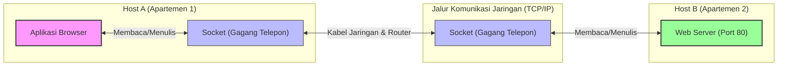
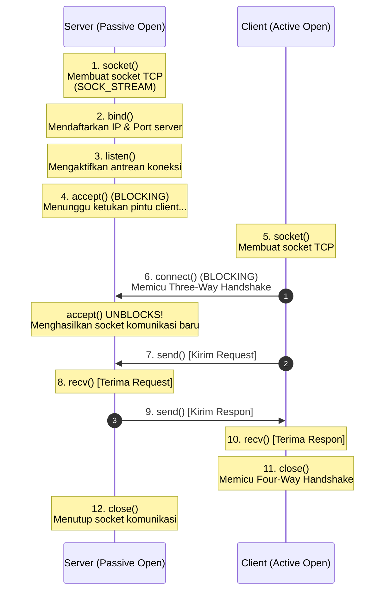
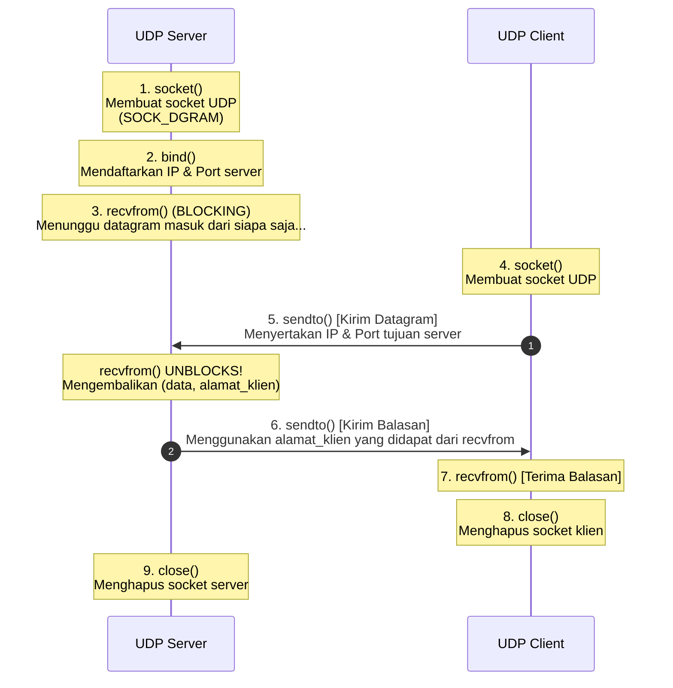

# Network Programming Complete Guide: Menguasai TCP & UDP Socket Programming Berbasis Python (Week 12)

Halo! Selamat datang kembali di seri catatan belajar **Jaringan Komputer**. Setelah di [[(Week 11) Transport Layer Complete Guide|Transport Layer Complete Guide (Week 11)]] kita sudah membongkar habis teori di balik layar TCP dan UDP—mulai dari jabat tangan, kontrol aliran (*flow control*), hingga manajemen kemacetan (*congestion control*)—sekarang saatnya kita turun ke lapangan!

Di materi Week 12 ini, kita bakal mempraktikkan teori-teori tersebut ke dalam kode program nyata menggunakan **Socket Programming** berbasis bahasa pemrograman Python. Kita bakal bedah bareng-bareng bagaimana sistem operasi (OS) menjembatani aplikasi kita dengan jaringan, membedah siklus hidup (*lifecycle*) soket TCP dan UDP, hingga mengupas trik-trik *advanced* untuk menghindari galat (*bug*) menyebalkan yang sering bikin bingung mahasiswa saat praktikum.

Yuk, siapin kopi dan terminal Linux kalian, mari kita bongkar sampai tuntas! 🚀

---

## 1. Mental Model: Apa Sih Sebenarnya "Socket" Itu?

Sebelum menulis baris kode pertama, kita kudu punya *mental model* yang kuat tentang apa itu soket (*socket*). 

Secara definisi teknis:
> [!info] **Definisi Soket (Socket)**
> **Socket** adalah antarmuka pemrograman aplikasi (API) yang disediakan oleh kernel Sistem Operasi (OS) sebagai jembatan/pintu gerbang komunikasi logis bagi aplikasi untuk mengirim dan menerima data melalui jaringan (menggunakan protokol TCP atau UDP).

Biar gampang dibayangkan, mari kita gunakan analogi **Gedung Apartemen & Interkom**:

* **IP Address** itu diibaratkan sebagai **Alamat Fisik Gedung Apartemen**. IP menunjukkan ke mana paket data harus dikirim agar sampai di gedung yang tepat.
* **Port Number** diibaratkan sebagai **Nomor Kamar/Apartemen** di dalam gedung tersebut. Port mengarahkan paket ke aplikasi spesifik yang berjalan di dalam host (misal port 80 untuk Web Server, port 22 untuk SSH).
* **Socket** adalah **Gagang Telepon/Interkom** yang terpasang di dinding kamar apartemenmu. 
  * Kamu tidak bisa langsung melempar suara ke luar jendela begitu saja agar sampai ke kamar apartemen temanmu di kota lain.
  * Kamu kudu mengangkat gagang interkom tersebut (*create socket*), menyambungkannya ke nomor kamar tujuan (*connect*), lalu baru bisa saling berbicara (*send/recv*).



### Paradigma Client-Server
Dalam pemrograman jaringan, komunikasi hampir selalu melibatkan dua peran utama ini:
1. **Server (Pihak Pasif):** Bekerja seperti loket pendaftaran di rumah sakit yang buka 24 jam. Server melakukan *binding* ke port tertentu yang sudah diketahui (*well-known port*), lalu duduk manis menunggu klien datang mengetuk pintu koneksi.
2. **Client (Pihak Aktif):** Bekerja seperti pasien yang datang mengunjungi loket. Klien bertugas menginisiasi komunikasi dengan menghubungi alamat IP dan port server secara aktif.

---

## 2. Arsitektur Soket: TCP vs. UDP

Seperti yang sudah kita pelajari pada materi [[(Week 11) Transport Layer Complete Guide|Transport Layer]], ada perbedaan mendasar antara TCP yang bersifat *connection-oriented* dan UDP yang bersifat *connectionless*. Perbedaan ini berdampak langsung pada API soket yang kita panggil di kode program kita.

### Parameter Identifikasi Soket (Mux/Demux)
Ingat aturan emas penentuan soket di sisi sistem operasi:

* **Soket TCP (4-Tuple):**
  $$\text{Soket TCP} = (\text{Source IP}, \text{Source Port}, \text{Destination IP}, \text{Destination Port})$$
  OS membedakan aliran data untuk setiap koneksi secara unik berdasarkan kombinasi 4 nilai ini. Makanya, satu aplikasi server TCP di port 80 bisa melayani ribuan klien berbeda lewat soket komunikasi yang berbeda pula.
  
* **Soket UDP (2-Tuple):**
  $$\text{Soket UDP} = (\text{Destination IP}, \text{Destination Port})$$
  OS hanya peduli paket UDP tersebut dikirim ke IP dan port mana. Semua paket dari pengirim mana pun yang menuju IP/port tersebut akan masuk ke antrean soket UDP yang sama.

---

## 3. Siklus Hidup & Alur Komunikasi Soket TCP

Karena TCP membutuhkan koneksi logis yang stabil sebelum bertukar data, siklus hidup soket TCP memiliki alur yang cukup ketat di kedua belah pihak.



Mari kita bedah setiap fungsi (*system call*) penting di atas beserta apa yang terjadi di tingkat kernel OS:

### A. `socket()`
Langkah awal untuk memesan soket ke OS. Di Python, fungsinya adalah:
```python
s = socket.socket(socket.AF_INET, socket.SOCK_STREAM)
```
* **`AF_INET` (Address Family - IPv4):** Menentukan bahwa kita akan menggunakan protokol pengalamatan IPv4. Jika mau pakai IPv6, kita kudu menggantinya dengan `AF_INET6`.
* **`SOCK_STREAM` (Socket Type - Stream):** Menandakan kita ingin membuat soket berbasis aliran data terurut yang andal, alias **TCP**.

### B. `bind((IP, Port))`
Mengaitkan soket yang baru dibuat dengan alamat IP dan Port tertentu pada mesin lokal.
* **Server:** **Kudu** memanggil `bind()` secara eksplisit agar klien tahu di alamat dan port berapa server tersebut bisa dihubungi. Contoh: `s.bind(('127.0.0.1', 1234))`.
* **Client:** **Tidak perlu** memanggil `bind()` secara manual. Saat klien memanggil `connect()`, kernel OS secara otomatis akan memilih satu port acak yang sedang kosong di rentang *dynamic/ephemeral ports* (`49152 - 65535`) untuk ditempelkan pada soket klien tersebut.

### C. `listen(backlog)`
Membuka pintu loket server agar siap mendengarkan koneksi masuk. Parameter `backlog` menentukan kapasitas antrean untuk koneksi yang sedang dalam proses jabat tangan (*handshake*).
> [!important] **Mekanisme Antrean Kernel saat `listen()`**
> Di dalam kernel OS, panggilan `listen()` akan menyiapkan dua antrean terpisah:
> 1. **Incomplete Connection Queue (SYN Queue):** Berisi koneksi dari klien yang baru mengirim paket `SYN` dan sedang menunggu jabat tangan langkah kedua (`SYN-ACK`).
> 2. **Completed Connection Queue (Accept Queue):** Berisi koneksi yang sudah sukses menyelesaikan *Three-Way Handshake* (koneksi berstatus `ESTABLISHED`) tetapi belum diambil oleh kode program kita menggunakan fungsi `accept()`.

### D. `accept()`
Fungsi ini bersifat **blocking** (artinya, program akan berhenti berproses di baris ini dan menunggu sampai ada koneksi masuk di *Accept Queue*).

> [!important] **Traps Ujian: Keajaiban Hasil Kembalian `accept()`**
> Ketika ada klien yang terhubung, fungsi `accept()` akan mengembalikan sepasang nilai:
> `client_sock, client_addr = s.accept()`
> 
> Perhatikan baik-baik: `accept()` menghasilkan **soket baru** (`client_sock`) yang terpisah dari soket utama (`s`).
> * **Soket Utama (`s`):** Hanya bertugas sebagai "resepsionis pintu depan". Soket ini tetap berada di state `LISTEN` untuk menyambut klien-klien baru berikutnya.
> * **Soket Baru (`client_sock`):** Bertugas sebagai "pelayan meja makan" yang khusus menangani komunikasi data (`send`/`recv`) dengan klien spesifik tersebut. 
> 
> Hal ini krusial agar server kita bisa menangani banyak klien secara konkuren (misalnya menggunakan multi-threading/asynchronous programming).

```text
       [ Klien Baru Datang ]
                 │
                 ▼
     ┌───────────────────────┐
     │ Soket Utama s (Port)  │  <─── "Resepsionis Pintu Depan"
     └───────────┬───────────┘
                 │ (Menerima koneksi baru)
                 ▼
     ┌───────────────────────┐
     │ Soket Baru client_sock│  <─── "Pelayan Khusus Klien A"
     │ (Terhubung ke Klien A)│
     └───────────────────────┘
```

### E. `connect((IP, Port))`
Dipanggil oleh klien untuk memulai jabat tangan *Three-Way Handshake* secara otomatis di tingkat kernel dengan server tujuan. Jika handshake berhasil, fungsi ini selesai memblokir (*unblocks*) dan data siap dikirim.

### F. `send()` & `recv()`
* **`send(data)`:** Menyalin data dari memori aplikasi ke dalam *Send Buffer* milik soket di kernel OS. OS yang akan mengatur kapan byte tersebut dibungkus menjadi segmen TCP dan dikirim lewat kartu jaringan fisik.
* **`recv(bufsize)`:** Mengambil data dari *Receive Buffer* milik soket di kernel OS ke dalam memori aplikasi kita. Jika *Receive Buffer* kosong, fungsi ini akan memblokir (*blocking*) eksekusi program sampai ada data baru yang masuk dari jaringan.
* **Mengapa TCP disebut Byte Stream?** TCP tidak peduli dengan batas pesan aplikasi kita. Jika klien memanggil `send(b"Halo")` lalu `send(b"Dunia")`, di sisi penerima data tersebut bisa saja terbaca sekaligus sebagai satu pesan `b"HaloDunia"` saat memanggil `recv(65535)`. Ini disebut masalah *framing*.

### G. `close()`
Memulai proses pemutusan koneksi logis (*Four-Way Handshake*). Panggilan ini membebaskan alokasi nomor port dan file descriptor di kernel OS.

---

## 4. Implementasi Kode TCP Python & Bedah Baris per Baris

Mari kita pelajari kode program TCP Server dan Client berikut. Di sini, kita akan menambahkan penanganan encoding/decoding string ke byte yang sering menjadi jebakan bagi pemula.

### A. Kode TCP Server (`tcp_server.py`)
```python
import socket
import sys

# 1. Bikin objek socket IPv4 & TCP
# AF_INET = IPv4, SOCK_STREAM = TCP
server_socket = socket.socket(socket.AF_INET, socket.SOCK_STREAM)

# Solusi agar port yang mati bisa langsung dipakai lagi (akan dibahas di bagian Advanced)
server_socket.setsockopt(socket.SOL_SOCKET, socket.SO_REUSEADDR, 1)

# Alamat IP dan port tempat server mendengarkan
SERVER_IP = '127.0.0.1'
SERVER_PORT = 1234

# 2. Asosiasikan socket ke IP & Port (bind)
server_socket.bind((SERVER_IP, SERVER_PORT))

# 3. Aktifkan mode mendengarkan koneksi dengan kapasitas antrean backlog = 1
server_socket.listen(1)
print(f"[*] Server TCP berjalan di {SERVER_IP}:{SERVER_PORT}...")

try:
    while True:
        # 4. Blokir eksekusi, tunggu klien terhubung
        # Mengembalikan objek socket baru untuk komunikasi dan alamat klien
        client_socket, client_address = server_socket.accept()
        print(f"[+] Klien terhubung dari IP: {client_address[0]} Port: {client_address[1]}")
        
        # 5. Terima data dari klien (maksimal buffer 65535 byte)
        # recv() mengembalikan tipe data BYTES
        raw_data = client_socket.recv(65535)
        
        if not raw_data:
            # Jika menerima data kosong, artinya klien menutup koneksi secara sepihak
            client_socket.close()
            continue
            
        # Konversi data bytes ke string Unicode agar bisa dibaca manusia
        message = raw_data.decode('utf-8')
        print(f"[Received] Data dari klien: '{message}'")
        
        # 6. Kirim balik data ke klien (echo server dengan tambahan teks)
        # Kita kudu mengonversi string balik ke bytes menggunakan encode()
        response_text = f"Kirim balik ke client >> {message}"
        client_socket.send(response_text.encode('utf-8'))
        
        # 7. Tutup socket komunikasi klien setelah melayani request
        client_socket.close()
        print(f"[-] Koneksi dengan {client_address[0]} ditutup.\n")

except KeyboardInterrupt:
    # Menangani penutupan server secara paksa menggunakan Ctrl+C secara bersih
    print("\n[*] Mematikan server TCP secara aman...")
    server_socket.close()
    sys.exit(0)
```

### B. Kode TCP Client (`tcp_client.py`)
```python
import socket

# 1. Bikin objek socket IPv4 & TCP
client_socket = socket.socket(socket.AF_INET, socket.SOCK_STREAM)

SERVER_IP = '127.0.0.1'
SERVER_PORT = 1234

print(f"[*] Menghubungi server di {SERVER_IP}:{SERVER_PORT}...")

# 2. Hubungkan ke server (memicu Three-Way Handshake)
client_socket.connect((SERVER_IP, SERVER_PORT))
print("[+] Koneksi berhasil terjalin!")

# Pesan yang ingin dikirim (tipe string Unicode)
message_str = "Halo semua, ini pakai TCP!!"

# 3. Kirim data (kudu dikonversi ke bytes menggunakan encode() atau prefix b)
client_socket.send(message_str.encode('utf-8'))
print(f"[Sent] Mengirim pesan: '{message_str}'")

# 4. Terima balasan dari server (blocking recv)
raw_response = client_socket.recv(65535)
response_str = raw_response.decode('utf-8')
print(f"[Received] Balasan dari server: '{response_str}'")

# 5. Tutup koneksi secara bersih
client_socket.close()
print("[*] Program klien selesai.")
```

> [!important] **Trap Mahasiswa: Perbedaan Tipe Data String vs Bytes di Python 3**
> Pada Python versi tua (Python 2), tipe string dan bytes dianggap sama. Namun di Python 3, keduanya dibedakan dengan sangat tegas:
> * **`str` (String):** Merupakan representasi teks Unicode yang dibaca manusia di layar (contoh: `"Halo"`).
> * **`bytes` (Bytes):** Merupakan deretan angka biner mentah 8-bit yang dikirim melalui kabel jaringan (contoh: `b"Halo"`).
> 
> **Aturan Emas Pemrograman Jaringan Python:**
> Soket hanya mau menerima dan mengirim tipe data **`bytes`**.
> * Sebelum mengirim data lewat soket, kamu **kudu** mengubah string menjadi bytes menggunakan fungsi `.encode('utf-8')` atau menggunakan awalan huruf `b` di depan string (contoh: `b"Halo"`).
> * Setelah menerima data dari soket, kamu **kudu** mengubah bytes tersebut kembali menjadi string menggunakan fungsi `.decode('utf-8')` agar bisa diolah sebagai teks biasa.
> 
> Kegagalan melakukan konversi ini akan memicu eror program: `TypeError: a bytes-like object is required, not 'str'`.

---

## 5. Siklus Hidup & Alur Komunikasi Soket UDP

Karena UDP bersifat *connectionless*, siklus hidup soket UDP jauh lebih ringkas. Tidak ada proses penjalinan koneksi logis (*handshake*), tidak ada status koneksi (*stateless*), dan tidak ada socket khusus hasil `accept()`.



Mari kita bedah fungsi-fungsi kritis pada komunikasi UDP:

### A. `socket(AF_INET, SOCK_DGRAM)`
* **`SOCK_DGRAM` (Socket Type - Datagram):** Menandakan kita ingin membuat soket berbasis datagram yang tidak menjamin urutan atau keandalan pengiriman, alias **UDP**.

### B. `recvfrom(bufsize)`
Fungsi ini menggantikan `recv()` pada TCP.
* Karena UDP bersifat *stateless*, server tidak memiliki jalur koneksi khusus yang terus menempel ke klien.
* Saat menerima data, server wajib mengetahui alamat IP dan port asal pengirim agar bisa membalasnya nanti.
* Oleh karena itu, fungsi `recvfrom()` mengembalikan dua nilai sekaligus dalam bentuk tuple:
  `data, sender_address = s.recvfrom(65535)`
  * `data`: Berisi isi pesan mentah (tipe bytes).
  * `sender_address`: Berisi tuple `(IP_Pengirim, Port_Pengirim)`.

### C. `sendto(data, (Destination_IP, Destination_Port))`
Fungsi ini menggantikan `send()` pada TCP. Karena tidak ada jalur koneksi yang terjalin sejak awal, setiap kali kita ingin melempar paket datagram UDP, kita wajib menuliskan alamat IP dan port tujuan secara eksplisit pada setiap panggilan fungsi.

---

## 6. Implementasi Kode UDP Python & Bedah Baris per Baris

Sekarang, mari kita pelajari bagaimana implementasi kode UDP Server dan Client pada Python.

### A. Kode UDP Server (`udp_server.py`)
```python
import socket
import sys

# 1. Bikin objek socket IPv4 & UDP
# SOCK_DGRAM = UDP
server_socket = socket.socket(socket.AF_INET, socket.SOCK_DGRAM)

SERVER_IP = '127.0.0.1'
SERVER_PORT = 4321

# 2. Asosiasikan socket ke IP & Port server
server_socket.bind((SERVER_IP, SERVER_PORT))
print(f"[*] Server UDP berjalan di {SERVER_IP}:{SERVER_PORT}...")

try:
    while True:
        # 3. Tunggu data masuk (blocking call)
        # Mengembalikan data bytes dan tuple alamat asal (IP, Port)
        raw_data, client_address = server_socket.recvfrom(65535)
        
        message = raw_data.decode('utf-8')
        print(f"[Received] Dari {client_address[0]}:{client_address[1]} -> '{message}'")
        
        # 4. Kirim balik balasan ke alamat asal pengirim datagram secara spesifik
        response_text = f"kirim balik ke client >> {message}"
        server_socket.sendto(response_text.encode('utf-8'), client_address)
        print(f"[Sent] Mengirim balasan ke {client_address[0]}:{client_address[1]}")

except KeyboardInterrupt:
    print("\n[*] Mematikan server UDP secara aman...")
    server_socket.close()
    sys.exit(0)
```

### B. Kode UDP Client (`udp_client.py`)
```python
import socket

# 1. Bikin objek socket IPv4 & UDP
client_socket = socket.socket(socket.AF_INET, socket.SOCK_DGRAM)

SERVER_IP = '127.0.0.1'
SERVER_PORT = 4321

message_str = "Halo semua, ini pakai UDP!!"

# 2. Kirim pesan langsung ke server tujuan tanpa connect terlebih dahulu
# Kita wajib menyertakan tuple (IP, Port) server tujuan di sendto()
client_socket.sendto(message_str.encode('utf-8'), (SERVER_IP, SERVER_PORT))
print(f"[Sent] Mengirim datagram ke {SERVER_IP}:{SERVER_PORT}")

# 3. Tunggu balasan dari server
# recvfrom() akan menangkap isi data beserta alamat server yang mengirim balik data tersebut
raw_response, server_address = client_socket.recvfrom(65535)

response_str = raw_response.decode('utf-8')
print(f"[Received] Balasan dari server {server_address[0]}:{server_address[1]}: '{response_str}'")

# 4. Tutup socket
client_socket.close()
print("[*] Program klien UDP selesai.")
```

---

## 7. Fitur Lanjutan & Tips Praktikum (Advanced Socket Programming)

Bagian ini membahas materi penting di luar catatan kuliah standar yang wajib kamu kuasai agar terhindar dari *bug* klasik saat ujian atau praktikum.

### A. Mengatasi Galat `Address already in use` dengan `SO_REUSEADDR`
Pernahkah kamu mematikan program TCP Server secara paksa menggunakan `Ctrl+C`, lalu saat kamu coba jalankan kembali server tersebut, muncul eror menyebalkan seperti ini?
`OSError: [Errno 98] Address already in use`

> [!warning] **Mengapa Ini Bisa Terjadi?**
> Sesuai penjelasan di [[(Week 11) Transport Layer Complete Guide#B. Terminasi Koneksi: Four-Way Handshake|Transport Layer Complete Guide (Week 11)]], pihak yang melakukan pemutusan koneksi secara aktif (dalam hal ini, server yang kita matikan paksa) wajib masuk ke state **`TIME_WAIT`** selama $2 \times \text{MSL}$ (sekitar 2-4 menit) di tingkat kernel OS sebelum port-nya benar-benar dibebaskan. Hal ini bertujuan untuk memastikan paket-paket lama yang tersangkut di jaringan menghilang secara alami dan tidak merusak koneksi baru.
> 
> Selama socket lama tersebut masih berada di state `TIME_WAIT`, kernel OS melarang aplikasi baru untuk melakukan `bind()` ke port yang sama demi alasan keamanan data.

#### Solusi Kode:
Untuk memaksa OS mengizinkan pemakaian port yang masih menggantung di state `TIME_WAIT` secara instan, kita wajib mengatur opsi soket bernama **`SO_REUSEADDR`** bernilai `1` (true) **sebelum** memanggil fungsi `bind()`.

```python
s = socket.socket(socket.AF_INET, socket.SOCK_STREAM)

# MENGATASI PORT LOCK TIME_WAIT
s.setsockopt(socket.SOL_SOCKET, socket.SO_REUSEADDR, 1)

s.bind(('127.0.0.1', 1234))
```
Dengan menambahkan satu baris sakti tersebut, kamu tidak perlu lagi menunggu 2 menit setiap kali selesai me-restart server praktikummu!

---

### B. Konsep "Connected UDP Socket"
Secara teori jaringan, protokol UDP tidak mengenal jabat tangan koneksi (*connectionless*). Namun menariknya, API soket sistem operasi (termasuk Python) mengizinkan kita memanggil fungsi `connect()` pada soket UDP.

```python
s = socket.socket(socket.AF_INET, socket.SOCK_DGRAM)
# Memanggil connect pada socket UDP!
s.connect(('127.0.0.1', 4321))
```

> [!important] **Apa Efek Memanggil `connect()` pada Soket UDP?**
> Panggilan `connect()` pada UDP **tidak mengirim paket jabat tangan sama sekali** ke target. Kernel OS hanya mencatat alamat IP dan Port remote tersebut ke dalam struktur data soket lokal secara permanen.
> 
> Dampaknya adalah:
> 1. **Bisa Pakai `send()` dan `recv()`:** Kita tidak perlu lagi menuliskan alamat tujuan di setiap panggilan `sendto()`. Kita bisa langsung memakai fungsi `send(data)` dan `recv(bufsize)` layaknya soket TCP.
> 2. **Penyaringan Paket Otomatis:** Soket kita hanya akan menerima datagram yang berasal dari alamat IP/Port yang didaftarkan di `connect()`. Paket dari pengirim tak dikenal akan dibuang secara otomatis oleh kernel OS.
> 3. **Efisiensi Kinerja Kernel:** Dibandingkan `sendto()`, memanggil `send()` pada connected UDP socket memiliki performa lebih cepat karena kernel tidak perlu terus-menerus mengecek rute dan menyalin alamat tujuan ke header paket pada setiap panggilan transmisi.

---

### C. Menutup Soket Secara Bersih via `try...finally`
Jika program Python kita tiba-tiba mengalami galat (*exception*) di tengah jalan saat berkomunikasi, eksekusi program akan terhenti sebelum sempat memanggil fungsi `.close()`. Akibatnya, alokasi memori soket dan port di kernel OS akan menggantung (*hanging socket*).

Biar aman, biasakan membungkus siklus hidup soket dalam blok `try...finally` agar soket dijamin pasti ditutup dalam kondisi eror apa pun.

```python
import socket

s = socket.socket(socket.AF_INET, socket.SOCK_STREAM)
s.setsockopt(socket.SOL_SOCKET, socket.SO_REUSEADDR, 1)

try:
    s.bind(('127.0.0.1', 1234))
    s.listen(5)
    while True:
        client_sock, client_addr = s.accept()
        try:
            # Lakukan pertukaran data di sini
            data = client_sock.recv(1024)
            client_sock.send(b"Respon")
        finally:
            # client_sock dijamin tertutup apa pun yang terjadi!
            client_sock.close()
finally:
    # server_socket utama dijamin tertutup saat server dimatikan paksa
    s.close()
    print("Socket utama server ditutup secara bersih.")
```

---

## Cheat Sheet Persiapan Ujian Pemrograman Jaringan

* **Socket:** Jembatan API logis antara aplikasi kita dengan protokol transport (TCP/UDP) di kernel OS.
* **TCP Socket Lifecycle:**
  * Server: `socket()` $\rightarrow$ `bind()` $\rightarrow$ `listen()` $\rightarrow$ `accept()` (blocking) $\rightarrow$ menghasilkan `client_sock` baru untuk komunikasi data $\rightarrow$ `close()`.
  * Client: `socket()` $\rightarrow$ `connect()` (memicu 3-way handshake) $\rightarrow$ `send()` / `recv()` $\rightarrow$ `close()`.
* **UDP Socket Lifecycle:**
  * Server: `socket()` $\rightarrow$ `bind()` $\rightarrow$ `recvfrom()` (blocking, mengembalikan data dan alamat pengirim) $\rightarrow$ `sendto()` $\rightarrow$ `close()`.
  * Client: `socket()` $\rightarrow$ `sendto()` $\rightarrow$ `recvfrom()` $\rightarrow$ `close()`.
* **Perbedaan str vs bytes (Python 3):** Soket hanya menerima data mentah tipe `bytes`. Klien/Server wajib melakukan `.encode('utf-8')` sebelum mengirim dan `.decode('utf-8')` setelah menerima.
* **Address already in use:** Disebabkan socket server lama masih tertahan di state `TIME_WAIT` (Four-Way Handshake). Diatasi dengan memanggil `s.setsockopt(socket.SOL_SOCKET, socket.SO_REUSEADDR, 1)` sebelum `bind()`.
* **Connected UDP Socket:** Memanggil `connect()` pada UDP hanya mengikat alamat IP/port tujuan secara logis di level kernel OS untuk menggunakan `send()`/`recv()`, menyaring paket dari luar, dan meningkatkan efisiensi pemrosesan paket.

Semoga panduan pemrograman jaringan Python ini membantumu memahami seluruh mekanisme internal soket secara mendalam dan siap melibas praktikum serta ujian dengan nilai sempurna! Selamat ngoding! 💻🚀
