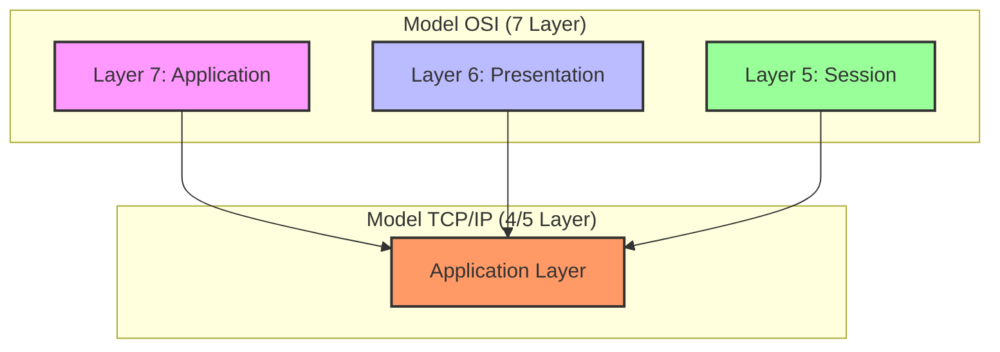
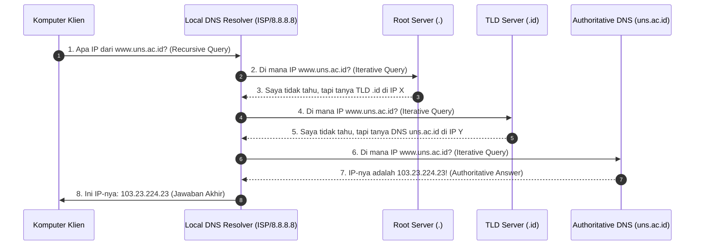
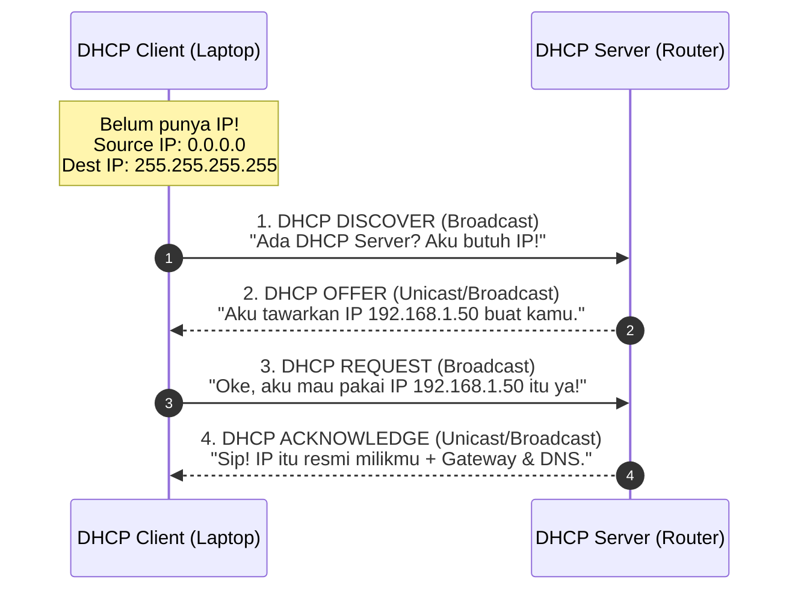
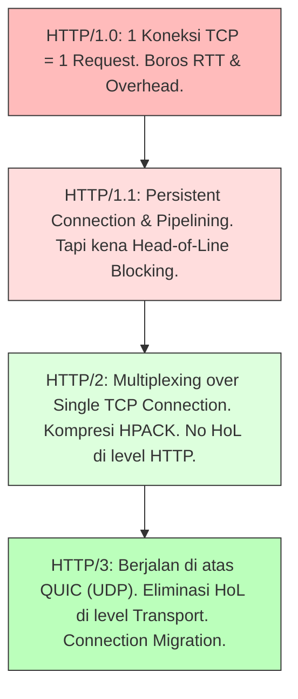
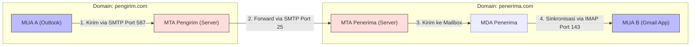

# Upper Layers Complete Guide: Mengupas Tuntas Application, Presentation, dan Session Layer (Week 13)

Halo! Selamat datang kembali di seri catatan belajar **Jaringan Komputer**. Setelah di [[(Week 11) Transport Layer Complete Guide|Transport Layer Complete Guide (Week 11)]] kita membahas habis-habisan tentang bagaimana data dikirimkan secara andal lewat TCP dan UDP, sekarang kita bakal naik ke kasta tertinggi di model jaringan komputer: **Layer Aplikasi, Presentasi, dan Sesi**!

Di materi Week 13 ini, kita akan membongkar bagaimana data yang tadinya cuma berupa aliran byte mentah (*byte stream*) diatur bentuknya, dikelola sesi komunikasinya, hingga disuguhkan ke hadapan pengguna dalam bentuk halaman web keren, email penting, atau konfigurasi IP otomatis. Kita tidak hanya akan membahas ringkasan kuliah saja, tapi kita bakal bongkar habis mekanisme protokol-protokol legendaris seperti DNS, DHCP, HTTP/HTTPS, serta SMTP/POP3/IMAP secara mendalam.

Yuk, ambil segelas kopi favoritmu, buka terminal kesayanganmu, dan mari kita bedah materi ini sampai tuntas! 🚀

---

## 1. Pendahuluan: Pemetaan Arsitektur OSI vs. TCP/IP

Jika kita melihat model referensi jaringan komputer, ada perbedaan mencolok antara **Model OSI (Open Systems Interconnection)** dan **Model TCP/IP** di lapisan teratas.

Dalam model OSI yang memiliki 7 layer, tiga lapisan teratas dipisahkan secara spesifik menjadi:
1. **Application Layer (Layer 7)**
2. **Presentation Layer (Layer 6)**
3. **Session Layer (Layer 5)**

Sedangkan pada model TCP/IP yang lebih praktis dan banyak diadopsi di dunia nyata, ketiga fungsi layer tersebut digabungkan ke dalam satu layer komprehensif yang bernama **Application Layer**.



> [!info] **Mengapa TCP/IP Menggabungkan Ketiganya?**
> Alasan utamanya adalah **fleksibilitas pengembangan software**. Protokol di level transport ke bawah (TCP, IP, Ethernet) diimplementasikan langsung di dalam *kernel* sistem operasi agar performa transmisinya cepat dan seragam. 
> 
> Namun, untuk urusan format data (Presentation) dan manajemen sesi aplikasi (Session), sistem operasi memberikan kebebasan penuh kepada developer aplikasi. Developer bisa mendefinisikan sendiri cara kompresi data mereka, jenis enkripsi yang dipakai, atau bagaimana aplikasi mengingat sesi pengguna tanpa perlu mengubah kode kernel OS. Makanya, dalam TCP/IP, semua urusan ini langsung ditaruh di level aplikasi (*User Space*).

---

## 2. Bedah Mendalam Layer 5, 6, dan 7 OSI

Biar kita punya fondasi yang super kokoh saat ujian atau praktikum, mari kita bedah tugas dan tanggung jawab masing-masing dari ketiga layer teratas ini secara mendetail dari sudut pandang model OSI.

### A. Session Layer (Layer 5) — "Sang Protokoler Pertemuan"
Session Layer bertugas untuk menciptakan, memelihara, dan menyelaraskan (*synchronize*) dialog atau koneksi antara dua aplikasi yang sedang berkomunikasi di jaringan.

Analogi gampangnya, bayangkan Session Layer seperti **Sekretaris/Protokoler Rapat** atau **Operator Telepon Jadul**:
* Dia yang mengatur kapan rapat dimulai (*session establishment*).
* Dia yang memastikan kedua belah pihak berbicara bergantian dan tidak saling tumpang tindih (*dialogue control*).
* Jika di tengah-tengah rapat ada gangguan suara, dia yang bertugas memulihkan jalannya rapat (*session recovery*).

Ada tiga fungsi utama Session Layer yang kudu kita pahami:
1. **Dialogue Control:** Mengatur arah komunikasi. Apakah komunikasi berjalan secara *simplex* (satu arah seperti radio siaran), *half-duplex* (bergantian seperti Walkie-Talkie), atau *full-duplex* (dua arah sekaligus seperti telepon seluler).
2. **Session Administration:** Mengelola alur mulai dari pembukaan sesi (*binding*), penjagaan agar sesi tetap hidup (*keep-alive*), hingga penutupan sesi (*unbinding*) secara bersih.
3. **Synchronization & Checkpointing (Sangat Krusial!):** 
   Jika kita mengirim berkas raksasa berukuran 10 Gigabyte lewat jaringan, dan tiba-tiba koneksi terputus di tengah jalan, kita pasti malas kalau harus mengulang unduhan dari nol, kan? 
   Session layer mengatasi masalah ini dengan menyisipkan **checkpoint** (titik sinkronisasi) setiap beberapa Megabyte. Jika koneksi putus di Megabyte ke-800, aplikasi hanya perlu melanjutkan proses pengunduhan mulai dari checkpoint terakhir di Megabyte ke-800 tersebut, bukan dari awal lagi.

---

### B. Presentation Layer (Layer 6) — "Penerjemah Bahasa & Diplomat"
Presentation Layer bertanggung jawab atas cara data diformat, dikompresi, dan diamankan (enkripsi) sebelum dikirimkan ke jaringan, serta memastikan perangkat penerima dapat menerjemahkan data tersebut dengan benar.

Analogi gampangnya, bayangkan Presentation Layer sebagai **Penerjemah Bahasa Internasional** atau **Diplomat**:
* Jika aplikasi pengirim berbicara menggunakan bahasa Mandarin dan penerima menggunakan bahasa Spanyol, Presentation Layer bertugas menerjemahkannya ke dalam bahasa universal yang disepakati bersama.

Fungsi utama Presentation Layer meliputi:
1. **Memformat dan Merepresentasikan Data:** 
   Perangkat komputer bisa berbeda arsitekturnya. Ada yang menggunakan pengodean karakter ASCII, EBCDIC, atau Unicode (UTF-8). Presentation Layer memastikan konversi antar-format pengodean ini berjalan mulus.
2. **Serialisasi dan Deserialisasi (Serialization & Deserialization):**
   Dalam software modern, data sering kali berupa objek kompleks dalam memori (misalnya *dictionary* di Python atau *object* di JavaScript). Agar data ini bisa dikirim lewat jaringan yang berbasis biner, objek tersebut harus dikonversi menjadi string teks terstruktur seperti **JSON**, **XML**, **YAML**, atau format biner efisien seperti **Protocol Buffers (Protobuf)**. Proses konversi objek memori menjadi string/biner disebut **Serialisasi**, sedangkan proses mengembalikannya lagi menjadi objek di sisi penerima disebut **Deserialisasi**.
3. **Kompresi Data:**
   Mengurangi ukuran data agar transmisi jaringan menjadi lebih efisien. 
   * *Lossless Compression:* Mengurangi ukuran tanpa membuang informasi sedikit pun (misal format ZIP, PNG, Gzip). Cocok untuk dokumen teks dan kode program.
   * *Lossy Compression:* Mengurangi ukuran secara drastis dengan membuang detail kecil yang tidak terlalu sensitif bagi indra manusia (misal format JPG, MP3, MP4). Cocok untuk media gambar, audio, dan video.
4. **Enkripsi dan Dekripsi:**
   Mengamankan data yang sensitif sebelum dilempar ke kabel jaringan. Protokol enkripsi modern seperti **SSL/TLS** (Secure Sockets Layer/Transport Layer Security) bekerja erat di perbatasan antara Presentation dan Session layer untuk memastikan kerahasiaan (*confidentiality*) data kita.

---

### C. Application Layer (Layer 7) — "Pelayan Restoran"
Application Layer adalah lapisan yang paling dekat dengan pengguna akhir. Layer ini menyediakan antarmuka pemrograman aplikasi (API) agar program aplikasi yang kita pakai sehari-hari dapat berinteraksi dengan infrastruktur jaringan di bawahnya.

Analogi gampangnya, bayangkan Application Layer seperti **Pelayan Restoran**:
* Kamu (pengguna) tidak perlu masuk ke dapur (jaringan komputer) untuk memasak makanan. Kamu cukup memesan menu lewat pelayan (Application Layer), dan pelayan tersebut yang akan membawakan pesananmu ke dapur lalu menyajikannya kembali ke mejamu.

> [!important] **Trap Ujian: Aplikasi vs. Protokol Aplikasi**
> Banyak mahasiswa salah mengira bahwa Google Chrome, Mozilla Firefox, atau WhatsApp adalah "Application Layer". **Salah besar!**
> 
> * **Google Chrome** adalah **Aplikasi Pengguna (Software Application)** yang berjalan di atas sistem operasi.
> * Chrome menggunakan protokol **HTTP/HTTPS** untuk meminta halaman web. Protokol **HTTP/HTTPS** inilah yang merupakan bagian dari **Application Layer**.
> 
> Singkatnya, aplikasi adalah programnya, sedangkan protokol aplikasi adalah aturan komunikasi yang dipakai oleh program tersebut.

---

## 3. Protokol Jaringan pada Application Layer TCP/IP

Model TCP/IP mendefinisikan berbagai protokol aplikasi untuk melayani berbagai kebutuhan komunikasi internet. Protokol-protokol ini menetapkan aturan format pesan, perintah, dan port transport (TCP/UDP) yang digunakan.

Berikut adalah tabel rangkuman protokol kunci di Application Layer:

| Nama Protokol | Fungsi Utama | Protokol Transport | Port Default |
| :--- | :--- | :--- | :--- |
| **DNS** (Domain Name System) | Menerjemahkan nama domain menjadi IP address | UDP (Utama) / TCP | 53 |
| **DHCP** (Dynamic Host Configuration Protocol) | Alokasi konfigurasi IP secara dinamis ke host | UDP | 67 (Server), 68 (Client) |
| **HTTP** (Hypertext Transfer Protocol) | Transfer data web/multimedia tanpa enkripsi | TCP | 80, 8080 |
| **HTTPS** (HTTP Secure) | Transfer data web terenkripsi SSL/TLS | TCP | 443 |
| **SMTP** (Simple Mail Transfer Protocol) | Pengiriman email antar mail server | TCP | 25, 587 (Submission) |
| **POP3** (Post Office Protocol v3) | Pengambilan email dari server (unduh & hapus) | TCP | 110 |
| **IMAP** (Internet Message Access Protocol) | Pengambilan email dari server (sinkronisasi) | TCP | 143 |
| **FTP** (File Transfer Protocol) | Transfer file antar perangkat | TCP | 20 (Data), 21 (Control) |
| **TFTP** (Trivial FTP) | Transfer file sederhana tanpa otentikasi | UDP | 69 |

---

## 4. Deep-Dive DNS (Domain Name System)

Domain Name System (DNS) sering dijuluki sebagai **"Buku Telepon Raksasa Internet"**. Manusia sangat hebat dalam mengingat nama (seperti `google.com` atau `cisco.com`), tetapi komputer hanya mengerti angka biner berupa *IP Address* (seperti `142.250.190.46` atau `2607:f8b0:4004:80c::200e`). DNS bertugas menjembatani kesenjangan ini.

### A. Hirarki DNS secara Terdistribusi
DNS tidak disimpan dalam satu server tunggal yang terpusat di dunia. Mengapa? Karena jika server tunggal itu mati, seluruh internet global akan lumpuh total! Makanya, database DNS didistribusikan secara hirarkis di ribuan server di seluruh dunia dengan struktur pohon terbalik (*inverted tree*):

1. **Root Name Servers (`.`):**
   Tingkat tertinggi dalam hirarki DNS. Server root tidak tahu IP dari `google.com`, tetapi mereka tahu di mana letak server yang mengelola Top-Level Domain (TLD) seperti `.com`, `.org`, atau `.id`. Ada 13 alamat IP server root logis di dunia (dikelola oleh ratusan server fisik menggunakan teknik *anycast*).
2. **Top-Level Domain (TLD) Servers:**
   Server yang mengelola domain tingkat atas.
   * *Generic TLD (gTLD):* `.com`, `.org`, `.net`, `.edu`.
   * *Country Code TLD (ccTLD):* `.id` (Indonesia), `.jp` (Jepang), `.uk` (Inggris).
3. **Authoritative Name Servers:**
   Server yang memiliki database resmi asli yang berisi pemetaan nama domain milik organisasi tertentu ke IP address-nya. Misalnya, server DNS milik kampus UNS berisi record resmi untuk domain `uns.ac.id`.
4. **Local DNS Server / Recursive Resolver:**
   Server DNS terdekat dari klien (biasanya disediakan oleh ISP seperti Indihome/Telkomsel, atau publik seperti Google DNS `8.8.8.8`). Resolver inilah yang bertugas berkeliling dunia menanyakan IP domain atas nama klien.

---

### B. Mekanisme Query DNS: Recursive vs. Iterative Query
Ketika komputer kita ingin mengetahui IP dari `www.uns.ac.id`, terjadi proses pencarian yang sangat cepat menggunakan dua jenis query:

* **Recursive Query (Klien ke Resolver):** Klien menuntut jawaban mutlak dari Resolver lokal: *"Tolong carikan IP dari `www.uns.ac.id`. Aku tidak mau tahu prosesnya, pokoknya berikan aku IP-nya atau katakan domain itu tidak ada!"*
* **Iterative Query (Resolver ke Server Hirarki):** Resolver berkeliling menanyakan satu per satu server secara bertahap. Server yang ditanya tidak memberikan jawaban langsung, melainkan memberikan rujukan server berikutnya: *"Aku tidak tahu IP-nya, tapi coba tanya ke TLD `.id` di alamat X."*



---

### C. Tipe Resource Records (RR) pada DNS
Database DNS menyimpan catatan pemetaan dalam format terstruktur yang disebut **Resource Records**. Beberapa tipe record yang wajib keluar saat ujian teori jaringan:

* **`A` Record (IPv4 Address):** Memetakan nama host langsung ke alamat IPv4 32-bit.
  * *Contoh:* `google.com. IN A 142.250.190.46`
* **`AAAA` Record (IPv6 Address):** Memetakan nama host ke alamat IPv6 128-bit.
  * *Contoh:* `google.com. IN AAAA 2607:f8b0:4004:80c::200e`
* **`CNAME` Record (Canonical Name):** Membuat alias untuk nama domain lain. Sangat berguna jika satu server fisik melayani banyak layanan sekaligus.
  * *Contoh:* `blog.kamu.com IN CNAME github.io` (mengarahkan pengunjung blog ke server Github).
* **`MX` Record (Mail Exchange):** Menentukan alamat server mail yang bertanggung jawab menerima email untuk nama domain tersebut. Record ini memiliki nilai prioritas (*preference value*).
  * *Contoh:* `uns.ac.id. IN MX 10 mail.uns.ac.id` (angka 10 menunjukkan tingkat prioritas).
* **`NS` Record (Name Server):** Menentukan server DNS mana yang bertindak sebagai pemegang otoritas resmi (*Authoritative*) untuk domain tersebut.
* **`TXT` Record (Text):** Menyimpan informasi teks bebas. Sering digunakan untuk verifikasi kepemilikan domain (seperti Google Search Console) atau keamanan email (SPF, DKIM).

---

## 5. Deep-Dive DHCP (Dynamic Host Configuration Protocol)

Bayangkan jika kamu membawa laptopmu ke kafe, kampus, dan rumah. Jika tidak ada DHCP, setiap kali kamu berpindah lokasi, kamu harus menyetel IP Address, Subnet Mask, Default Gateway, dan DNS Server secara manual di pengaturan laptopmu. Ribet banget, kan?

**DHCP** hadir untuk mengotomatisasi seluruh proses konfigurasi jaringan tersebut secara dinamis.

### A. Alur Transaksi DHCP: Proses DORA
Proses alokasi IP Address baru menggunakan protokol UDP (Server mendengarkan di **Port 67**, Client mendengarkan di **Port 68**). Alurnya dikenal dengan akronim **D-O-R-A**:



Mari kita bongkar detail pesan di balik D-O-R-A:

1. **DHCP Discover (Broadcast):**
   Karena klien belum memiliki alamat IP, klien akan mengirimkan paket broadcast dengan alamat asal IP `0.0.0.0` dan alamat tujuan IP broadcast global `255.255.255.255`. Paket ini akan menyebar ke seluruh komputer dalam satu jaringan lokal LAN untuk mencari keberadaan DHCP server.
2. **DHCP Offer (Unicast/Broadcast):**
   DHCP Server yang mendengar jeritan *Discover* tersebut akan membalas dengan menawarkan sebuah IP address yang masih kosong dari pool alokasinya (misal `192.168.1.50`), lengkap dengan subnet mask, IP default gateway, dan IP DNS server.
3. **DHCP Request (Broadcast):**
   Klien merespon tawaran tersebut. Kenapa pesan Request ini dikirim secara **broadcast** padahal sudah tahu IP server? 
   > [!important] **Alasan DHCP Request Harus Broadcast**
   > Dalam satu jaringan fisik LAN, bisa saja terdapat **lebih dari satu DHCP Server** yang aktif. Klien mungkin menerima beberapa penawaran (*DHCP Offer*). 
   > 
   > Dengan mengirimkan *DHCP Request* secara broadcast, klien secara terbuka mengumumkan: *"Halo semua server, aku memilih tawaran dari Server A dengan IP X ya!"*. Ini adalah sinyal bagi DHCP Server B atau C untuk melepaskan kembali IP yang sempat mereka tawarkan agar bisa dipakai perangkat lain.
4. **DHCP Acknowledge (ACK - Unicast/Broadcast):**
   Server yang tawarannya diterima akan mengirimkan paket konfirmasi akhir. Server mencatat alamat MAC (MAC Address) klien dan memetakan IP tersebut ke dalam tabel sewa (*lease table*). Klien sekarang resmi dapat berselancar di internet menggunakan konfigurasi tersebut.

---

### B. Konsep DHCP Lease Time & Status Perpanjangan (Renewal)
Alokasi IP dari DHCP server tidak bersifat permanen selamanya. IP tersebut dipinjamkan dalam jangka waktu tertentu yang disebut **Lease Time** (misal 24 jam).

Untuk memastikan koneksi klien tidak terputus secara tiba-tiba saat waktu sewa habis, sistem operasi klien akan otomatis melakukan negosiasi perpanjangan sewa di latar belakang:

* **T1 - Renewal State (50% dari Lease Time):** 
  Setelah waktu berjalan setengahnya (misal jam ke-12 dari sewa 24 jam), klien akan mengirimkan pesan **DHCP Request** secara *unicast* langsung ke DHCP Server asal untuk memperpanjang waktu sewa. Jika server membalas dengan **DHCP ACK**, waktu sewa di-reset kembali ke awal (24 jam).
* **T2 - Rebinding State (87.5% dari Lease Time):**
  Jika pada tahap T1 DHCP server asal tidak merespon (mungkin mati atau *offline*), klien akan menunggu hingga sisa waktu sewa tinggal 12.5% lagi. Pada tahap ini, klien akan mengirimkan **DHCP Request** secara *broadcast* untuk meminta perpanjangan sewa dari **DHCP server mana saja** yang bersedia di jaringan tersebut.
* **Lease Expired (100%):**
  Jika sampai detik terakhir sewa habis tidak ada respon, klien wajib segera melepaskan alamat IP tersebut, menghentikan komunikasi jaringan, dan mengulang proses dari tahap **DHCP Discover**.

---

## 6. Protokol Web: HTTP, HTTPS, dan HTML

Web browser yang kita pakai berkomunikasi dengan web server menggunakan protokol **HTTP (Hypertext Transfer Protocol)**. 

### A. Alur Lengkap Proses Mengakses Web Page
Biar terbayang proses *end-to-end* sejak kamu menekan tombol Enter di browser hingga halaman tampil di layar, mari kita trace alur URL berikut: `http://www.cisco.com/index.html`

```text
  [ User ketik URL ]
         │
         ▼
 1. Interpretasi URL ──► Protokol: http | Host: www.cisco.com | File: index.html
         │
         ▼
 2. Resolusi DNS ──────► Tanya resolver: "Berapa IP www.cisco.com?" ──► Dapat: 72.163.4.161
         │
         ▼
 3. TCP Handshake ─────► Bangun koneksi 3-Way Handshake ke IP 72.163.4.161 Port 80 (HTTP)
         │
         ▼
 4. HTTP Request ──────► Kirim pesan "GET /index.html HTTP/1.1" ke server
         │
         ▼
 5. HTTP Response ─────► Server balas dengan "HTTP/1.1 200 OK" + mengirimkan konten HTML
         │
         ▼
 6. Browser Rendering ─► Browser parsing HTML, gambar, stylesheet CSS -> Tampil di Layar!
```

---

### B. Anatomi Pesan HTTP (HTTP Message Format)
Pesan HTTP dikirimkan dalam bentuk teks biasa (plain text) yang terbagi menjadi dua jenis utama: **Request** (Klien ke Server) dan **Response** (Server ke Klien).

#### 1. HTTP Request Message
Format pesan request terdiri atas:
1. **Request Line:** Metode HTTP (misal `GET`), jalur berkas (path, misal `/index.html`), dan versi protokol (misal `HTTP/1.1`).
2. **Header Lines:** Informasi metadata tentang browser klien, encoding yang didukung, bahasa, kuki (*cookies*), dll.
3. **Blank Line:** Satu baris kosong sebagai pemisah mutlak antara header dan body.
4. **Entity Body:** Data yang dikirim (hanya ada pada metode POST atau PUT).

```http
GET /index.html HTTP/1.1
Host: www.cisco.com
User-Agent: Mozilla/5.0 (Windows NT 10.0; Win64; x64)
Accept-Language: id-ID,id;q=0.9
[Baris Kosong]
```

#### 2. HTTP Response Message
Format pesan response terdiri atas:
1. **Status Line:** Versi protokol, kode status numerik, dan pesan deskriptif (misal `HTTP/1.1 200 OK`).
2. **Header Lines:** Informasi server, tanggal, tipe konten (HTML/JSON/Image), panjang konten, dll.
3. **Blank Line:** Baris kosong pemisah.
4. **Entity Body:** Isi konten file yang diminta (kode HTML mentah, data gambar, dll).

```http
HTTP/1.1 200 OK
Date: Thu, 25 Jun 2026 01:40:00 GMT
Server: Apache/2.4.41 (Ubuntu)
Content-Type: text/html; charset=UTF-8
Content-Length: 125
[Baris Kosong]
<html>
  <head><title>Cisco</title></head>
  <body><h1>Selamat Datang di Cisco!</h1></body>
</html>
```

---

### C. Metode HTTP Umum
Metode request menunjukkan jenis aksi yang ingin dilakukan klien pada server target:

* **`GET`:** Klien meminta data/berkas dari server. Parameter data biasanya ditempel di URL (*query string*). Sifatnya *safe* dan *idempotent* (memanggil berkali-kali tidak akan mengubah data di server).
* **`POST`:** Klien mengirimkan data baru ke server (biasanya untuk pengisian formulir, unggah berkas, login). Data ditaruh di dalam *Entity Body*, bukan di URL.
* **`PUT`:** Klien mengunggah atau mengganti seluruh konten dari resource target yang ditentukan di URL. Jika resource belum ada, server akan membuatnya baru.
* **`PATCH`:** Mirip dengan `PUT`, tetapi hanya memodifikasi sebagian kecil data dari resource target tanpa perlu mengganti seluruh konten secara utuh.
* **`DELETE`:** Klien meminta server untuk menghapus resource spesifik di URL tujuan.

---

### D. Klasifikasi HTTP Status Codes
Kode status berupa 3 digit angka yang mengindikasikan apakah request berhasil atau gagal:

* **`1xx` (Informational):** Request diterima, proses sedang berjalan (e.g., `100 Continue`).
* **`2xx` (Success):** Request sukses diproses dengan baik.
  * `200 OK`: Request berhasil dan data dikirim di body.
  * `201 Created`: Request berhasil dan resource baru sukses dibuat di server.
* **`3xx` (Redirection):** Klien harus melakukan langkah tambahan untuk mengakses berkas karena lokasinya berpindah.
  * `301 Moved Permanently`: URL berkas sudah dipindahkan secara permanen ke alamat baru.
  * `302 Found` / `307 Temporary Redirect`: Berkas dipindahkan sementara waktu.
* **`4xx` (Client Error):** Terjadi kesalahan di sisi klien (salah ketik URL, belum login, dll).
  * `400 Bad Request`: Format request salah atau korup sehingga server bingung.
  * `401 Unauthorized`: Klien butuh otentikasi (login) terlebih dahulu.
  * `403 Forbidden`: Server menolak memberikan akses meskipun klien sudah login (masalah hak akses).
  * `404 Not Found`: Berkas yang diminta tidak ditemukan di server.
* **`5xx` (Server Error):** Server gagal memproses request karena ada masalah internal di sistem server.
  * `500 Internal Server Error`: Eror umum pada server (misal kode PHP/Python server mengalami *crash*).
  * `503 Service Unavailable`: Server sedang sibuk, kelebihan beban (*overloaded*), atau sedang dalam perbaikan (*maintenance*).

---

### E. Evolusi Versi HTTP: Dari Lambat ke Super Cepat
Teknologi web berkembang pesat. Sangat penting bagi kita untuk memahami bagaimana cara HTTP mentransmisikan data berevolusi dari waktu ke waktu:



1. **HTTP/1.0:**
   Setiap kali browser ingin meminta satu file (misal 1 gambar), browser harus membuka koneksi TCP baru, melakukan jabat tangan 3-way handshake, mengirim request, menerima response, dan langsung menutup koneksi TCP tersebut. Jika sebuah halaman web memiliki 50 gambar, browser harus melakukan 3-way handshake sebanyak 50 kali! Sangat boros waktu dan memori.
2. **HTTP/1.1:**
   Memperkenalkan **Persistent Connection (Keep-Alive)**. Satu koneksi TCP yang sudah terbuka bisa digunakan kembali untuk mengirim beberapa request file secara bergantian tanpa perlu ditutup segera. Namun, HTTP/1.1 memiliki kelemahan bernama **Head-of-Line (HoL) Blocking**: request harus diproses secara berurutan. Jika request pertama lambat diproses server (misal database query lama), request kedua dan seterusnya akan tertahan mengantre di belakang.
3. **HTTP/2:**
   Mengatasi HoL Blocking di level aplikasi menggunakan teknik **Multiplexing**. Data dipecah menjadi frame-frame kecil berlabel stream ID dan dikirimkan secara paralel bersamaan lewat satu koneksi TCP tunggal. HTTP/2 juga memperkenalkan kompresi header menggunakan algoritma **HPACK** dan fitur **Server Push** (server mengirim berkas CSS/JS sebelum browser memintanya secara eksplisit).
4. **HTTP/3 (QUIC Protocol):**
   Meskipun HTTP/2 sangat canggih, dia masih menderita HoL Blocking di level **Transport Layer (TCP)**. Jika satu paket TCP hilang di tengah jalan, TCP akan menghentikan pengiriman seluruh stream data sampai paket yang hilang tersebut dikirim ulang. 
   HTTP/3 membuang TCP dan menggantinya dengan protokol **QUIC** yang berjalan di atas **UDP**. Di HTTP/3, kehilangan satu paket di satu stream hanya akan menahan stream tersebut saja, sementara stream lainnya tetap berjalan mulus. HTTP/3 juga mendukung **Connection Migration**: jika kamu pindah dari Wi-Fi rumah ke jaringan seluler 4G/5G, koneksi download-mu tidak akan putus atau mengulang jabat tangan karena pengenal koneksinya menggunakan *Connection ID* bawaan QUIC, bukan kombinasi IP/Port (4-Tuple) lagi!

---

### F. HTTPS: Menambahkan Perisai Keamanan
HTTP standar mengirimkan seluruh pesan dalam bentuk teks biasa. Siapa pun yang menyadap jaringanmu (misalnya di Wi-Fi kafe gratisan lewat teknik *Man-in-the-Middle Attack*) bisa dengan mudah melihat password atau nomor kartu kredit yang kamu kirim.

Untuk mengatasinya, digunakanlah **HTTPS (HTTP Secure)** yang berjalan di atas enkripsi **SSL/TLS** pada port **443**:

> [!info] **Cara Kerja Enkripsi HTTPS (Hybrid Cryptosystem)**
> HTTPS memanfaatkan dua jenis enkripsi sekaligus untuk mendapatkan keamanan terbaik dengan kecepatan maksimal:
> 1. **Asymmetric Encryption (Enkripsi Asimetris):** 
>    Menggunakan sepasang kunci: *Public Key* (bisa disebar ke siapa saja) dan *Private Key* (disimpan rahasia oleh server). Skema ini dipakai di awal jabat tangan (*handshake*) untuk menukar kunci rahasia baru secara aman. Proses ini berat secara komputasi.
> 2. **Symmetric Encryption (Enkripsi Simetris):** 
>    Menggunakan satu kunci rahasia yang sama untuk enkripsi dan dekripsi. Kunci ini dibuat saat handshake asimetris selesai. Enkripsi simetris jauh lebih ringan dan cepat, sehingga digunakan untuk mengamankan data transaksi web asli yang dikirim sehari-hari.

---

## 7. Protokol Email: SMTP, POP3, dan IMAP

Komunikasi surat elektronik (email) beroperasi menggunakan metode **Store-and-Forward**. Pesan email dikirim dari klien, disimpan di server penerima, lalu diambil oleh klien tujuan saat mereka terhubung ke internet.

### A. Arsitektur Pengiriman Email
Ada tiga komponen penting yang bekerja di balik layar pengiriman email:

1. **MUA (Mail User Agent):** Aplikasi email yang dipakai pengguna untuk membaca dan menulis email (misal Microsoft Outlook, Mozilla Thunderbird, atau antarmuka Gmail di web browser).
2. **MTA (Mail Transfer Agent):** Server email yang bertugas menerima email dari MUA atau MTA lain, lalu meneruskannya (*forward*) ke server tujuan menggunakan protokol **SMTP** (misal Postfix, Sendmail, Exchange).
3. **MDA (Mail Delivery Agent):** Komponen server yang bertugas mengambil email dari MTA lokal dan menaruhnya ke dalam kotak surat (*mailbox*) fisik milik user penerima agar siap diambil nanti.



---

### B. SMTP (Simple Mail Transfer Protocol) — Protokol Pengirim
SMTP bertugas mengirimkan email dari klien ke server, atau meneruskan email antar-server email. 

* **Port Default:** **Port 25** (antar-server), **Port 587** (klien mengirim ke server dengan otentikasi TLS - *submission port*).
* **Karakteristik:** SMTP adalah **Push Protocol** (klien mendesak server untuk menerima data).
* **Alur Perintah SMTP Teks Biasa:**
  Saling bertukar salam dan perintah teks sederhana:
  * `HELO` / `EHLO`: Memulai percakapan klien-server.
  * `MAIL FROM`: Menentukan alamat pengirim email.
  * `RCPT TO`: Menentukan alamat penerima email.
  * `DATA`: Mengindikasikan isi pesan email siap diketik.
  * `QUIT`: Mengakhiri sesi komunikasi.

---

### C. POP3 vs. IMAP — Protokol Penarik (Receiver)
Karena SMTP hanya berfungsi untuk melempar/mengirim email, penerima email membutuhkan protokol lain untuk menarik (*pull*) email tersebut dari server ke perangkat lokal mereka. Dua protokol penerima yang paling terkenal adalah **POP3** dan **IMAP**.

Berikut adalah tabel perbandingan kritis antara POP3 dan IMAP:

| Fitur Utama | POP3 (Post Office Protocol v3) | IMAP (Internet Message Access Protocol) |
| :--- | :--- | :--- |
| **Port Default** | TCP Port 110 | TCP Port 143 |
| **Prinsip Kerja** | **Download & Delete (Unduh & Hapus)** | **Download & Sync (Unduh & Sinkronisasi)** |
| **Lokasi Penyimpanan Asli** | Diunduh ke komputer klien dan dihapus dari server. | Tetap tersimpan di database server utama. Klien hanya mengunduh salinan. |
| **Multi-Perangkat** | Buruk. Sekali email diunduh di laptop, email tersebut tidak akan tampil di HP karena sudah terhapus di server. | Luar biasa. Email tersinkronisasi rapi di laptop, HP, dan web mail secara *real-time*. |
| **Kapasitas Server** | Hemat penyimpanan server karena server langsung kosong setelah diunduh klien. | Boros penyimpanan server karena email disimpan selamanya kecuali dihapus manual oleh user. |
| **Akses Offline** | Sangat baik (karena semua email sudah diunduh utuh ke lokal). | Terbatas (hanya bisa membaca cache email yang sudah pernah dibuka sebelumnya). |

---

### D. Enkripsi Email (Secure Mail Protocols)
Sama seperti HTTP, versi standar SMTP, POP3, dan IMAP mengirimkan data tanpa enkripsi. Untuk mengamankan akun email dan kerahasiaan surat, kita wajib mengaktifkan port aman terenkripsi SSL/TLS:

* **SMTPS (SMTP Secure):** Berjalan di port **465** (atau menggunakan port **587** dengan perintah `STARTTLS`).
* **POP3S (POP3 Secure):** Berjalan di port **995**.
* **IMAPS (IMAP Secure):** Berjalan di port **993**.

---

## Cheat Sheet Persiapan Ujian: Layer 5, 6, dan 7

* **Model Perbandingan:** 3 Layer OSI teratas (Application, Presentation, Session) digabung menjadi 1 layer (Application) di model TCP/IP demi fleksibilitas software developer.
* **Session Layer (Layer 5):** Berperan mengelola sesi komunikasi. Ingat fitur **Checkpoint & Synchronization** untuk menjamin keamanan transfer berkas raksasa saat jaringan tidak stabil.
* **Presentation Layer (Layer 6):** Fokus pada representasi data. Ingat konsep **Serialisasi** (konversi objek memori ke JSON/XML) dan **Kompresi** (Lossless vs Lossy).
* **Application Layer (Layer 7):** Menyediakan interface protokol untuk aplikasi. Ingat perbedaan: *Web Browser* adalah programnya, sedangkan *HTTP* adalah protokol Application Layer-nya.
* **DNS (Port 53 UDP/TCP):** Hirarki terdistribusi (Root, TLD, Authoritative, Local Resolver). **Recursive Query** menuntut jawaban mutlak, sedangkan **Iterative Query** memberikan rujukan server bertahap.
* **DHCP (UDP Port 67/68):** Ingat alur **D-O-R-A** (Discover, Offer, Request, Acknowledge). Transaksi Request dikirim secara broadcast agar DHCP server lain tahu tawarannya ditolak. Perpanjangan IP dimulai pada 50% lease time (T1 - unicast) dan 87.5% lease time (T2 - broadcast).
* **HTTP vs. HTTPS (Port 80 vs. 443):** HTTPS mengamankan HTTP dengan enkripsi asimetris (saat handshake awal) dan enkripsi simetris (saat transfer data utama).
* **Evolusi HTTP:** HTTP/1.0 (satu koneksi per request), HTTP/1.1 (persistent connection, tapi kena HoL blocking aplikasi), HTTP/2 (multiplexing, HPACK), HTTP/3 (QUIC di atas UDP, eliminasi HoL transport, connection migration).
* **Email Protocols:** **SMTP** (Port 25/587) berfungsi mengirim email (*push*), **POP3** (Port 110) mengunduh dan menghapus email dari server, sedangkan **IMAP** (Port 143) menyinkronkan salinan email lintas perangkat.

Semoga panduan lengkap ini membantumu menguasai seluruh konsep teoretis dan teknis dari Application, Presentation, dan Session layer secara mendalam. Selamat belajar dan semoga sukses ujiannya! 💻🚀
