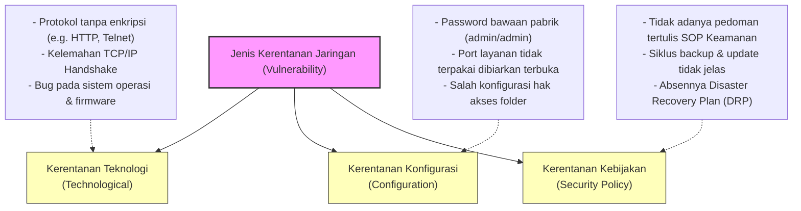
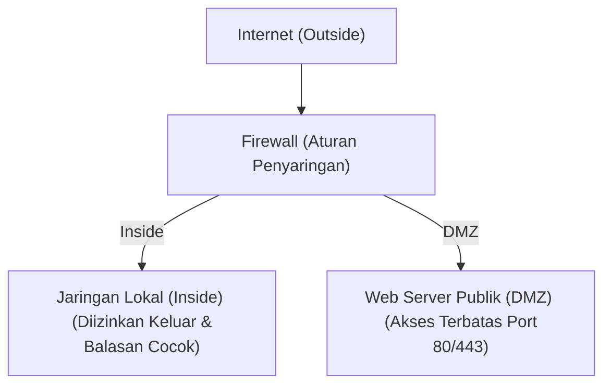

# Network Security Complete Guide: Melindungi Aset, Membedah Serangan, dan Mengamankan Infrastruktur Jaringan (Week 14)

Halo! Selamat datang kembali di seri catatan belajar **Jaringan Komputer**. Setelah pada materi sebelumnya kita sudah mengupas tuntas protokol di [[(Week 13) Application Presentation Session Layer Complete Guide|Application, Presentation, & Session Layer (Week 13)]] serta belajar cara bikin soket di [[(Week 12) Network Programming Complete Guide|Network Programming (Week 12)]], sekarang kita kudu menghadapi kenyataan pahit: **dunia jaringan itu penuh dengan bahaya**. 

Begitu komputer kita terhubung ke internet, ia langsung terekspos ke ribuan ancaman. Dari sekadar hacker iseng yang memindai port terbuka, malware yang menyebar otomatis, hingga serangan terstruktur seperti DDoS yang bisa melumpuhkan bisnis raksasa dalam hitungan menit. Oleh karena itu, memahami **Keamanan Jaringan (Network Security)** bukan lagi opsional, melainkan kebutuhan wajib bagi setiap *network engineer* dan praktisi IT.

Di panduan lengkap kali ini, kita bakal membongkar konsep keamanan jaringan secara mendalam dari nol. Kita akan membahas perbedaan mendasar ancaman (*threat*) dan kerentanan (*vulnerability*), membedah cara kerja berbagai jenis malware dan serangan siber, memahami teknik mitigasi melalui pencadangan dan pemutakhiran, mengkaji arsitektur kontrol akses AAA, hingga melihat bagaimana firewall menyaring lalu lintas internet untuk menjaga jaringan kita tetap aman.

Kuy, kita bedah materinya sampai tuntas! 🚀

---

## 1. Analogi & Mental Model: Kastil Abad Pertengahan

Sebelum masuk ke konfigurasi rumit, mari kita bangun *mental model* keamanan jaringan lewat analogi klasik: **Sistem Pertahanan Kastil Kerajaan**.

```text
               +-------------------------------------------+
               |               KASTIL UTAMA                |
               |         (Server & Data Sensitif)          |
               +-------------------------------------------+
                                     |
                       +---------------------------+
                       |       GERBANG UTAMA       |
                       |       & POS PENJAGA       |
                       |      (AAA Framework)      |
                       +---------------------------+
                                     |
                       +---------------------------+
                       |        PARIT KASTIL       |
                       |         (Firewall)        |
                       +---------------------------+
                                     |
                      === JALAN MASUK DARI LUAR ===
                            (Internet Publik)
```

Bayangkan jaringan komputer internal perusahaan kita itu seperti sebuah **Kastil Utama** yang menyimpan harta karun kerajaan (data penting seperti database, konfigurasi server, dan kredensial). 

* **Parit Kastil (The Moat):** Ini adalah **Firewall**. Parit ini melingkari kastil dan menyaring siapa saja yang mencoba mendekat. Hanya mereka yang menggunakan jembatan resmi yang diizinkan lewat. Firewall akan memeriksa paket data yang lewat dan membuang paket mencurigakan yang tidak memenuhi aturan.
* **Gerbang Utama & Pos Penjaga (Drawbridge & Guards):** Ini adalah **AAA (Authentication, Authorization, Accounting)**. Saat tamu menyeberangi parit, penjaga gerbang tidak langsung melepasnya masuk. Penjaga akan menanyakan kartu identitas/PIN (*Authentication*), mengecek daftar izin untuk menentukan ruangan mana saja yang boleh dikunjungi (*Authorization*), dan mencatat waktu masuk serta kegiatan tamu di dalam buku tamu kerajaan (*Accounting*).
* **Mata-mata yang Menyamar (Spies):** Ini adalah **Trojan Horse**. Mereka menyamar menjadi pelayan atau pedagang keliling yang ramah agar diizinkan masuk oleh penghuni kastil, namun begitu berada di dalam, mereka membuka gerbang belakang untuk pasukan musuh.
* **Ketapel Musuh (Trebuchet Attack):** Ini adalah **Denial of Service (DoS)**. Musuh tidak mencoba menyusup diam-diam, melainkan membombardir gerbang utama dengan batu besar tanpa henti hingga jalan masuk macet total dan penghuni kastil tidak bisa beraktivitas.
* **Tembok yang Retak (Cracks in the Wall):** Ini adalah **Vulnerability (Kerentanan)**. Celah fisik atau kelalaian konstruksi kastil yang bisa dimanfaatkan musuh untuk menyelinap tanpa terdeteksi oleh penjaga gerbang.

Dengan memikirkan jaringan kita sebagai kastil pertahanan berlapis (*defense-in-depth*), kita bisa melihat bahwa tidak ada satu pun alat yang bisa mengamankan segalanya sendirian. Kita butuh parit, penjaga gerbang, patroli dinding, hingga SOP yang ketat untuk menjaga keamanan kastil!

---

## 2. Security Threats vs. Vulnerabilities: Bedah Konsep dari Nol

Sering kali kita mendengar kata "ancaman" dan "kerentanan" dipakai bergantian secara keliru. Padahal, dalam dunia keamanan siber, kedua istilah ini mewakili hal yang sangat berbeda lho.

> [!important] **Definisi Mendasar: Threat vs. Vulnerability**
> * **Threat (Ancaman):** Faktor eksternal berupa potensi bahaya, kejadian, atau pelaku (*threat actor*) yang dapat merusak, mencuri, atau mengganggu aset kita. Ancaman bersifat pasif sebelum menemukan jalan masuk.
> * **Vulnerability (Kerentanan):** Kelemahan internal (*weakness*) pada sistem, konfigurasi, kebijakan, atau fisik jaringan yang dapat dieksploitasi oleh ancaman untuk menembus pertahanan kita.
> 
> *Mudahnya:* **Threat** adalah pencuri yang berniat membobol rumah kita, sedangkan **Vulnerability** adalah jendela rumah kita yang lupa dikunci.

### A. 4 Jenis Ancaman Utama (Network Threats)
Setelah seorang *threat actor* berhasil mengeksploitasi kerentanan dan menyusup ke dalam jaringan, ada empat jenis bahaya utama yang dapat menimpa organisasi kita:

1. **Pencurian Informasi (Information Theft):** 
   Aksi mencuri data sensitif (seperti data kartu kredit, informasi paten, kode sumber, atau data rekam medis) yang ditransmisikan melalui jaringan atau disimpan di server.
   * *Contoh:* Serangan **eavesdropping** (penyadapan) menggunakan alat *packet sniffer* pada jaringan Wi-Fi publik yang tidak terenkripsi.
2. **Kehilangan & Manipulasi Data (Data Loss & Manipulation):** 
   Aksi merusak, menghapus, atau mengubah data secara ilegal. Hal ini bisa merusak integritas informasi dan membuat sistem tidak dapat dipercaya.
   * *Contoh:* Penyusup masuk ke database transaksi bank dan mengubah saldo rekening mereka sendiri, atau mengirimkan ransomware untuk mengenkripsi seluruh file penting di server.
3. **Pencurian Identitas (Identity Theft):**
   Aksi mencuri kredensial pengguna (username, password, nomor jaminan sosial, token akses) untuk menyamar sebagai pengguna sah demi memperoleh hak akses khusus.
   * *Contoh:* Mengirimkan email tiruan (**phishing**) yang mengarahkan korban ke halaman login palsu untuk menangkap kredensial mereka.
4. **Gangguan Layanan (Disruption of Service):**
   Mencegah pengguna sah untuk mengakses layanan atau sumber daya jaringan yang mereka butuhkan.
   * *Contoh:* Membanjiri lalu lintas web server dengan jutaan paket palsu (**DoS/DDoS**) hingga server kehabisan sumber daya daya komputasi (*crash*) dan mati total.

---

### B. 3 Kategori Kerentanan Utama (Vulnerabilities)
Kerentanan adalah celah masuk bagi para penyerang. Secara umum, celah keamanan ini dikelompokkan menjadi tiga kategori:



1. **Kerentanan Teknologi (Technological Vulnerabilities):**
   Ini adalah kelemahan inheren yang terdapat pada protokol komunikasi, sistem operasi, maupun perangkat keras jaringan itu sendiri.
   * *Kelemahan Protokol:* Protokol lawas seperti Telnet, HTTP, FTP, dan POP3 mengirimkan data dalam bentuk teks polos (*plaintext*), sehingga sangat mudah disadap.
   * *Kelemahan Sistem Operasi:* Adanya bug seperti *buffer overflow* pada layanan sistem operasi yang dapat dimanfaatkan penyerang untuk mengeksekusi kode berbahaya secara jarak jauh (*Remote Code Execution*).
2. **Kerentanan Konfigurasi (Configuration Vulnerabilities):**
   Terjadi karena kelalaian atau ketidaktahuan administrator saat men-setup perangkat atau sistem di jaringan.
   * *Kredensial Default:* Membiarkan router menggunakan password bawaan pabrik seperti `admin/admin` atau `cisco/cisco`.
   * *Layanan Tidak Aman:* Lupa mematikan port atau layanan yang tidak digunakan (seperti membuka port SSH dan database ke internet publik tanpa batasan IP).
   * *Salah Konfigurasi Firewall:* Mengatur aturan firewall yang terlalu longgar secara tidak sengaja (misalnya menerapkan *any-to-any rule*).
3. **Kerentanan Kebijakan Keamanan (Security Policy Vulnerabilities):**
   Kelemahan non-teknis yang timbul karena organisasi tidak memiliki aturan, pedoman, atau prosedur keamanan yang jelas dan terdokumentasi.
   * *Kurangnya SOP:* Tidak ada prosedur wajib bagi karyawan untuk memperbarui password secara berkala atau menggunakan otentikasi multi-faktor (MFA).
   * *Faktor Politik & Budaya:* Manajemen enggan mengeluarkan biaya untuk keamanan atau menganggap prosedur keamanan hanya mempersulit alur kerja karyawan.
   * *Absennya Disaster Recovery:* Tidak ada rencana pemulihan bencana (*Disaster Recovery Plan*) jika sewaktu-waktu jaringan utama mati atau lumpuh karena serangan.

---

### C. Keamanan Fisik (Physical Security)
Selain ancaman siber, perangkat jaringan kita rentan terhadap kerusakan fisik. Jika seorang penyerang bisa menyentuh perangkat keras kita secara langsung, pertahanan perangkat lunak secanggih apa pun akan menjadi tidak berarti!

Terdapat 4 jenis ancaman fisik utama yang kudu kita mitigasi:

| Jenis Ancaman Fisik | Penjelasan Detil | Langkah Mitigasi Praktis |
| :--- | :--- | :--- |
| **Ancaman Perangkat Keras <br> (*Hardware Threat*)** | Kerusakan fisik pada server, router, switch, kabel backbone, dan komputer kerja akibat sabotase, pencurian, atau bencana alam. | - Menaruh perangkat di ruang server terkunci.<br>- Menggunakan rak server (*server rack*) yang memiliki kunci fisik.<br>- Memasang kamera pengawas (CCTV). |
| **Ancaman Lingkungan <br> (*Environmental Threat*)** | Suhu ruangan yang terlalu panas (*overheating*) atau terlalu dingin ekstrem, serta kelembaban udara yang dapat memicu korsleting listrik atau karat. | - Memasang pendingin ruangan khusus (HVAC) di ruang server.<br>- Memasang sensor pendeteksi suhu dan kelembaban otomatis. |
| **Ancaman Listrik <br> (*Electrical Threat*)** | Lonjakan daya tiba-tiba (*spikes*), penurunan tegangan (*brownouts*), gangguan gelombang elektromagnetik, atau mati listrik total (*blackouts*). | - Memasang **UPS (Uninterruptible Power Supply)** untuk cadangan daya sementara.<br>- Menyediakan generator listrik (Genset) cadangan.<br>- Memakai stabilizer tegangan listrik. |
| **Ancaman Pemeliharaan <br> (*Maintenance Threat*)** | Tata kabel yang acak-acakan (*spaghetti cabling*), penanganan komponen tanpa grounding listrik statis, atau ketiadaan suku cadang penting. | - Melakukan manajemen kabel yang rapi (*cable management*).<br>- Menyediakan suku cadang cadangan (*spare parts*) penting.<br>- Memberikan pelatihan penanganan komponen bagi staff IT. |

---

## 3. Malware & Kategori Serangan Jaringan (Network Attacks)

Mari kita bedah instrumen serangan yang biasa dipakai oleh para *threat actor* di lapangan.

### A. Malicious Software (Malware)
Malware adalah istilah payung untuk semua jenis kode atau aplikasi berbahaya yang dirancang untuk merusak sistem, mencuri data, atau menyusup ke host tanpa izin. Tiga jenis malware klasik yang wajib dibedakan cara kerjanya adalah:

* **Viruses:**
  * *Cara Kerja:* Virus adalah kode berbahaya yang **harus menempel pada file atau program inang (*host file*)**. Virus tidak bisa aktif sendirian.
  * *Penyebaran:* Membutuhkan **bantuan manusia** untuk menyebar. Misalnya, ketika Anda mengunduh file `.exe` dari internet dan mengeksekusinya, atau mencolokkan USB flashdisk yang terinfeksi ke komputer baru dan membuka file di dalamnya.
* **Worms:**
  * *Cara Kerja:* Perangkat lunak berbahaya yang **bersifat mandiri (*standalone*)**. Worm tidak memerlukan file inang untuk ditumpangi.
  * *Penyebaran:* **Tidak membutuhkan bantuan manusia**. Worm memanfaatkan kerentanan protokol jaringan untuk menduplikasi diri secara dinamis dan menyebar secara otomatis dari satu komputer ke komputer lain lewat jaringan. Karena menyebar secara eksponensial, worm sangat cepat memakan bandwidth jaringan dan memperlambat sistem.
* **Trojan Horses:**
  * *Cara Kerja:* Perangkat lunak berbahaya yang **menyamar sebagai aplikasi sah dan berguna** (seperti pemutar video gratis, game, atau utilitas sistem). 
  * *Penyebaran:* Pengguna terkecoh untuk mengunduh dan memasangnya secara manual. Begitu dipasang, Trojan akan melepaskan muatan berbahaya (*payload*), seperti membuat pintu belakang (*backdoor*) agar penyerang bisa mengendalikan komputer korban dari jarak jauh. Trojan tidak menduplikasi diri ke file lain.

Selain ketiga malware klasik di atas, kita juga harus mewaspadai varian modern seperti:
* **Ransomware:** Mengenkripsi semua dokumen dan database di komputer korban, lalu menampilkan pesan pemerasan yang menuntut tebusan uang (biasanya dalam bentuk cryptocurrency) untuk mendapatkan kunci dekripsi.
* **Spyware & Keyloggers:** Bekerja diam-diam di latar belakang untuk merekam aktivitas pengguna, memantau riwayat browsing, dan mencatat setiap ketukan tombol keyboard (*keystroke*) guna mencuri kredensial perbankan atau password penting.

---

### B. 3 Kategori Utama Serangan Jaringan (Network Attacks)
Serangan jaringan secara umum dibagi ke dalam tiga fase atau kategori utama:

#### 1. Reconnaissance Attack (Pengintaian)
Merupakan fase awal di mana penyerang melakukan pemetaan, pencarian informasi, dan identifikasi sistem untuk mencari tahu celah mana yang bisa ditembus.
* **Pasif:** Mengamati lalu lintas data tanpa berinteraksi langsung (misalnya melakukan penyadapan trafik jaringan dengan *packet sniffing*).
* **Aktif:** Mengirimkan paket stimulus ke target. Contohnya:
  * **Ping Sweep:** Mengirimkan paket ICMP Echo Request (detail mekanisme ICMP bisa diceki-ceki di [[(Week 10) ICMP Complete Guide|ICMP Complete Guide (Week 10)]]) ke seluruh rentang alamat IP untuk memetakan komputer mana saja yang sedang menyala di jaringan target.
  * **Port Scanning:** Menggunakan alat seperti `Nmap` untuk mengirimkan paket uji ke ribuan port TCP/UDP target guna mendeteksi layanan (*services*) apa saja yang sedang berjalan beserta versinya.

#### 2. Access Attack (Serangan Akses)
Setelah menemukan celah dari fase pengintaian, penyerang mencoba masuk ke sistem, memanipulasi data, atau meningkatkan hak istimewa (*privilege escalation*) mereka secara tidak sah.
* **Password Attacks:** Mencoba menebak kata sandi pengguna secara sistematis. Bisa menggunakan metode **Brute Force** (mencoba seluruh kombinasi karakter secara acak), **Dictionary Attack** (menguji kata-kata yang ada di kamus), atau **Rainbow Tables** (mencocokkan hash password dengan database hash yang sudah dihitung sebelumnya).
* **Trust Exploitation:** Memanfaatkan hak akses tepercaya dari sebuah komputer yang berada di dalam jaringan internal untuk menyerang server lain yang lebih sensitif. Jika satu PC karyawan di luar DMZ berhasil diretas, peretas menggunakannya untuk menembus server database internal.
* **Port Redirection:** Menggunakan komputer yang telah dikompromikan sebagai batu loncatan (*jump host*) untuk merutekan lalu lintas data ke sistem internal lain yang seharusnya tidak bisa diakses langsung dari internet luar.
* **Man-in-the-Middle (MitM):** Penyerang memposisikan dirinya secara logis di antara dua perangkat yang sedang berkomunikasi (misalnya dengan teknik *ARP Poisoning* atau *DNS Spoofing*) untuk menyadap, membaca, atau memodifikasi data yang ditransmisikan secara *real-time*.

#### 3. Denial of Service (DoS & DDoS)
Serangan yang bertujuan membuat layanan jaringan menjadi lambat, tidak stabil, atau mati total sehingga tidak dapat digunakan oleh pengguna yang sah.

> [!example] **Studi Kasus: Cara Kerja TCP SYN Flood**
> Salah satu bentuk serangan DoS yang paling terkenal di Layer 4 adalah **SYN Flood**. Serangan ini mengeksploitasi mekanisme jabat tangan tiga arah (*three-way handshake*) dari protokol TCP (kamu bisa bongkar detail segmentasi dan handshake TCP ini di [[(Week 11) Transport Layer Complete Guide|Transport Layer Complete Guide (Week 11)]]).
> 
> **Mekanisme Jabat Tangan TCP Normal:**
> 1. Klien mengirim paket **`SYN`** (meminta koneksi).
> 2. Server membalas dengan **`SYN-ACK`** dan mengalokasikan ruang memori buffer untuk sesi tersebut.
> 3. Klien membalas dengan **`ACK`** (koneksi terjalin, data siap dikirim).
> 
> **Mekanisme Serangan SYN Flood:**
> 1. Penyerang mengirimkan jutaan paket **`SYN`** secara terus menerus ke server target dengan memalsukan alamat IP asal (*spoofed IP address*) menjadi alamat IP fiktif atau IP yang tidak merespons.
> 2. Server menerima paket SYN, mengalokasikan ruang memori buffer di tabel koneksinya, lalu membalas dengan paket **`SYN-ACK`** ke alamat IP palsu tersebut.
> 3. Karena alamat IP asalnya palsu atau sengaja tidak merespons, server tidak pernah menerima paket balasan **`ACK`** penutup. Koneksi ini menggantung dalam status setengah terbuka (**`half-open connection`**).
> 4. Server harus menunggu hingga waktu tunggu (*timeout*) habis sebelum menghapus sesi menggantung tersebut. Selagi server menunggu, jutaan paket SYN baru terus berdatangan hingga memori buffer koneksi server terisi penuh. 
> 5. Akibatnya, server kehabisan sumber daya daya tampung koneksi dan mulai menolak permintaan koneksi baru dari pengguna asli yang sah!
> 
> ```mermaid
> sequenceDiagram
>     autonumber
>     actor Attacker as "Attacker (IP Palsu)"
>     participant Server as "Server Target"
>     actor User as "Pengguna Sah"
>     
>     Note over Attacker, Server: Sesi Serangan SYN Flood
>     Attacker->>Server: Kirim Paket SYN (IP Sumber Palsu)
>     Server->>Attacker: Balas SYN-ACK (Menggantung menunggu ACK)
>     Note over Server: Alokasikan memori buffer koneksi!<br/>Koneksi berstatus "Half-Open".
>     
>     Attacker->>Server: Kirim Paket SYN Lagi (IP Sumber Palsu Lain)
>     Server->>Attacker: Balas SYN-ACK (Menggantung)
>     Note over Server: Memori buffer koneksi penuh!
>     
>     Note over User, Server: Sesi Pengguna Sah
>     User->>Server: Kirim Paket SYN (Mau akses web)
>     Note over Server: Buffer penuh! Terpaksa membuang paket.<br/>(Koneksi Ditolak/RTO)
>     Server-->>User: (Koneksi Gagal)
> ```

---

## 4. Strategi Mitigasi Jaringan

Untuk melindungi aset berharga di kastil jaringan kita dari berbagai serangan di atas, kita kudu menerapkan strategi mitigasi berlapis.

### A. Backup Data & Konfigurasi (Strategi 3-2-1)
Pencadangan (*backup*) adalah benteng pertahanan terakhir kita. Jika jaringan kita terkena serangan ransomware yang merusak seluruh sistem, memiliki backup yang aman adalah satu-satunya cara mengembalikan operasional organisasi tanpa membayar pemeras.

Sangat direkomendasikan untuk menerapkan **Strategi Backup 3-2-1**:
* **3:** Miliki minimal **tiga salinan data** (1 data utama yang aktif digunakan + 2 data cadangan).
* **2:** Simpan salinan cadangan tersebut pada **dua media penyimpanan yang berbeda** (misalnya satu di harddisk eksternal lokal, dan satu lagi di server penyimpanan jaringan/NAS).
* **1:** Simpan minimal **satu salinan cadangan di lokasi luar kantor (*offsite* / cloud storage)** yang terpisah secara fisik dari jaringan utama. Hal ini untuk mengantisipasi jika lokasi utama mengalami bencana fisik seperti kebakaran, banjir, atau serangan ransomware yang menyebar ke seluruh perangkat lokal.

---

### B. Update, Update, dan Patch
Kerentanan perangkat lunak selalu ditemukan setiap hari. Oleh karena itu, menjaga perangkat lunak tetap mutakhir adalah kewajiban mutlak:
* **Upgrade:** Melakukan migrasi sistem secara menyeluruh ke versi mayor baru (misalnya melakukan migrasi dari Windows 10 ke Windows 11 karena dukungan keamanan Windows 10 akan dihentikan).
* **Update:** Memasang pembaruan minor dari vendor untuk menambahkan fitur baru sekaligus memperbaiki celah keamanan yang ditemukan.
* **Patch:** Memasang tambalan perangkat lunak spesifik untuk menutup kerentanan keamanan kritis tertentu secara instan (misalnya menambal celah keamanan protokol SMB agar terhindar dari penyebaran worm WannaCry).

---

### C. Framework AAA (Authentication, Authorization, Accounting)
AAA menyediakan kerangka kerja sistematis untuk mengontrol akses pengguna ke perangkat jaringan (seperti router dan switch) maupun sumber daya internal.

```text
+-------------------+      +-------------------+      +-------------------+
|  AUTHENTICATION   |      |   AUTHORIZATION   |      |    ACCOUNTING     |
|   "Siapa Anda?"   | ---> |  "Apa Hak Anda?"  | ---> | "Apa Kerja Anda?" |
|                   |      |                   |      |                   |
| Memverifikasi ID  |      | Menentukan akses  |      |  Mencatat log dan |
|  kredensial user  |      |   dan perintah    |      | aktivitas sesi    |
+-------------------+      +-------------------+      +-------------------+
```

Kembali ke analogi kartu kredit dari catatan kuliah Herdito Ibnu Dewangkoro:
* **Authentication (Otentikasi):** *Siapa Anda?* 
  Sistem memverifikasi identitas pengguna sebelum mengizinkan mereka terhubung ke jaringan. 
  * *Analogi:* Saat Anda ingin membayar belanjaan dengan kartu kredit, kasir meminta Anda memasukkan kartu dan mengetik PIN atau mencocokkan tanda tangan untuk membuktikan bahwa Anda adalah pemilik sah kartu tersebut.
* **Authorization (Otorisasi):** *Apa yang bisa Anda lakukan?*
  Menentukan tingkat akses, hak istimewa (*privileges*), atau perintah apa saja yang boleh dijalankan oleh pengguna yang telah berhasil masuk.
  * *Analogi:* Setelah PIN Anda terverifikasi, bank memeriksa apakah limit saldo kartu kredit Anda mencukupi untuk membeli barang seharga Rp 5.000.000. Jika limit Anda hanya Rp 2.000.000, transaksi akan ditolak karena melebihi otorisasi Anda.
* **Accounting (Akuntansi/Audit):** *Apa saja yang sudah Anda lakukan?*
  Mencatat riwayat aktivitas pengguna selama terhubung ke sistem (kapan mereka login/logout, perintah apa saja yang mereka ketik, berapa banyak data yang mereka kirim). Catatan ini sangat penting untuk kebutuhan audit forensik jika terjadi pelanggaran keamanan.
  * *Analogi:* Di akhir bulan, bank mengirimkan tagihan cetak (*billing statement*) yang mencatat secara rinci di toko mana saja Anda berbelanja, tanggal transaksi, dan jumlah nominal yang Anda habiskan.

#### Protokol Penggerak AAA: RADIUS vs. TACACS+
Untuk menerapkan kerangka kerja AAA terpusat pada banyak perangkat jaringan, biasanya kita menggunakan salah satu dari dua protokol standar industri berikut:

| Kriteria | RADIUS <br> (*Remote Authentication Dial-In User Service*) | TACACS+ <br> (*Terminal Access Controller Access-Control System Plus*) |
| :--- | :--- | :--- |
| **Protokol Transport** | **UDP** (Port 1812 untuk Autentikasi/Otorisasi, Port 1813 untuk Accounting). | **TCP** (Port 49). Lebih andal karena menjamin pengiriman paket kontrol akses bebas *packet loss*. |
| **Pemisahan AAA** | Menggabungkan fungsi *Authentication* dan *Authorization* ke dalam satu sesi transaksi. | Memisahkan fungsi *Authentication*, *Authorization*, dan *Accounting* secara ketat sebagai modul independen. |
| **Enkripsi Paket** | **Hanya mengenkripsi kolom password** di dalam payload. Bagian header, username, dan data akuntansi ditransmisikan secara teks polos (*plaintext*). | **Mengenkripsi seluruh isi paket data** (seluruh payload paket aman terenkripsi, hanya menyisakan header TACACS+ dasar tanpa enkripsi). |
| **Standar Industri** | Open standard (RFC 2865), kompatibel dengan hampir seluruh vendor perangkat keras di dunia. | Dikembangkan oleh Cisco (*Cisco Proprietary*), namun kini banyak didukung oleh vendor perangkat jaringan lainnya. |

---

### D. Teknologi Firewall
Firewall adalah sistem keamanan yang ditempatkan di perbatasan antara dua jaringan atau lebih (misalnya antara jaringan lokal kantor yang tepercaya dan internet publik yang tidak aman) untuk mengontrol aliran lalu lintas data berdasarkan aturan (*rules*) yang telah ditentukan.

#### Aturan Dasar Penyaringan Firewall
Firewall bekerja berdasarkan prinsip penyaringan lalu lintas dua arah:
1. **Inside to Outside (Dari Dalam Keluar):** Mengizinkan lalu lintas data dari pengguna di jaringan internal tepercaya untuk keluar menuju internet publik, dan secara otomatis mengizinkan paket respons balasan yang relevan untuk masuk kembali.
2. **Outside to Inside (Dari Luar Kedalam):** Memblokir semua paket data yang diinisiasi dari arah luar (internet) yang mencoba masuk ke dalam jaringan lokal secara sepihak, kecuali jika paket tersebut ditujukan untuk server publik di area khusus (DMZ) dan telah diatur izinnya secara eksplisit.



#### Evolusi Jenis-jenis Firewall
Seiring berkembangnya jenis serangan, teknologi firewall juga terus berevolusi demi memberikan perlindungan yang lebih kuat:

1. **Packet Filtering Firewall (Stateless):**
   * *Cara Kerja:* Memeriksa setiap paket data secara individual dan mandiri (*stateless*). Firewall membandingkan informasi pada header Layer 3 (IP asal/tujuan) dan Layer 4 (Port asal/tujuan, tipe protokol) dengan tabel aturan (*Access Control List* - ACL) yang ada.
   * *Kelemahan:* Sangat cepat dan efisien, namun **tidak mengingat konteks sesi koneksi**. Firewall jenis ini tidak tahu apakah paket yang datang dari luar merupakan bagian dari percakapan yang diinisiasi dari dalam jaringan atau merupakan paket siluman dari peretas.
2. **Stateful Inspection Firewall:**
   * *Cara Kerja:* Mengawasi status aktif dari seluruh sesi koneksi yang berjalan di jaringan menggunakan tabel pencatat status (**`State Table` / Connection Table**).
   * *Kelebihan:* Ketika komputer dari dalam mengirim paket keluar, firewall mencatat detail sesi tersebut (IP asal, port asal, IP tujuan, port tujuan) ke dalam *State Table*. Saat paket balasan datang dari luar, firewall mencocokkannya dengan tabel tersebut. Jika ada kecocokan sesi, paket langsung diizinkan lewat tanpa perlu mengevaluasi seluruh aturan ACL dari awal. Ini jauh lebih aman karena menutup celah paket siluman dari luar.
3. **Application Gateway / Proxy Firewall:**
   * *Cara Kerja:* Bertindak sebagai perantara penuh (*full proxy*) di Layer 7 (Application Layer). 
   * *Kelebihan:* Pengguna dari dalam tidak pernah terhubung langsung ke server internet tujuan. Pengguna terhubung ke Proxy, lalu Proxy yang akan mengunduh data dari internet tujuan, menyaring kontennya di level aplikasi (misalnya memblokir situs web dengan kata kunci tertentu, menyaring script berbahaya), baru kemudian meneruskan data bersih tersebut ke pengguna internal. Sangat aman, namun memerlukan sumber daya komputasi tinggi sehingga berpotensi memperlambat performa jaringan.
4. **Next-Generation Firewall (NGFW):**
   * *Cara Kerja:* Firewall modern terintegrasi yang menggabungkan fitur Stateful Inspection tradisional dengan fitur keamanan canggih lainnya dalam satu perangkat.
   * *Fitur Unggulan:* 
     * **Deep Packet Inspection (DPI):** Memeriksa hingga ke dalam isi payload paket, bukan hanya header luar.
     * **Intrusion Prevention System (IPS):** Mendeteksi dan memblokir tanda-tanda serangan aktif (*signature-based attack*) secara otomatis di jalur lalu lintas data (*in-line*).
     * **Application Awareness:** Dapat mengenali dan mengontrol aplikasi spesifik terlepas dari port yang digunakan (misalnya memblokir lalu lintas BitTorrent meskipun ia mencoba menyamar lewat port HTTP biasa).
     * **SSL/TLS Decryption:** Mendekripsi lalu lintas data terenkripsi untuk mendeteksi apakah ada malware tersembunyi di dalamnya sebelum dienkripsi ulang dan diteruskan ke tujuan.

---

## 5. Ringkasan Cepat untuk Persiapan Ujian (Cheat Sheet)

* **Threat vs. Vulnerability:** *Threat* adalah potensi bahaya eksternal (aktor/kejadian), sedangkan *Vulnerability* adalah kelemahan internal sistem (bug/salah konfigurasi).
* **4 Ancaman Utama:** *Information Theft* (penyadapan), *Data Loss/Manipulation* (perusakan data), *Identity Theft* (phishing), *Disruption of Service* (DoS/DDoS).
* **3 Jenis Kerentanan:** *Technological* (protokol plaintext), *Configuration* (password default), *Security Policy* (absennya SOP).
* **Keamanan Fisik:** Meliputi mitigasi ancaman *Hardware* (ruangan terkunci), *Environmental* (sensor AC), *Electrical* (UPS/genset), dan *Maintenance* (rapi kabel).
* **Virus vs. Worm vs. Trojan:**
  * **Virus:** Butuh inang, butuh interaksi manusia untuk menyebar.
  * **Worm:** Mandiri (*standalone*), menyebar otomatis lewat port jaringan tanpa campur tangan manusia.
  * **Trojan:** Menyamar sebagai aplikasi baik, tidak mereplikasi diri, butuh instalasi manual oleh pengguna.
* **TCP SYN Flood:** Serangan DoS di Layer 4 yang memanfaatkan jabat tangan tiga arah TCP dengan memalsukan IP asal sehingga server menggantung dalam status *half-open* dan kehabisan memori buffer koneksi.
* **AAA Framework:**
  * **Authentication:** Memverifikasi siapa pengguna (*username/password*).
  * **Authorization:** Menentukan apa yang boleh dilakukan (*hak akses*).
  * **Accounting:** Mencatat apa saja yang telah dilakukan (*audit logs*).
* **RADIUS vs. TACACS+:**
  * **RADIUS:** Berbasis UDP, hanya mengenkripsi kata sandi, menggabungkan Authentication & Authorization.
  * **TACACS+:** Berbasis TCP (port 49), mengenkripsi seluruh isi paket data, memisahkan modul AAA secara ketat.
* **Stateful vs. Stateless Firewall:**
  * **Stateless (Packet Filtering):** Memeriksa paket secara independen berdasarkan header IP/Port saja tanpa mengingat sesi.
  * **Stateful:** Mencatat status sesi aktif dalam *State Table* untuk memastikan paket balasan dari luar berasal dari koneksi yang sah.
* **Next-Generation Firewall (NGFW):** Firewall modern dengan integrasi *Deep Packet Inspection* (DPI), *Application Awareness*, *IPS*, dan dekripsi SSL/TLS.

---

Semoga panduan lengkap ini membantumu memahami arsitektur keamanan jaringan secara menyeluruh, siap menghadapi praktikum, dan sukses dalam ujian Jaringan Komputer! Tetap jaga keamanan kastil jaringannmu! 🛡️🚀
