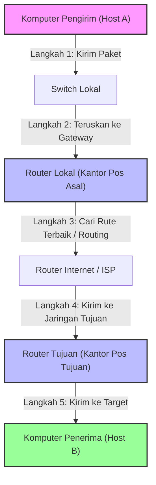
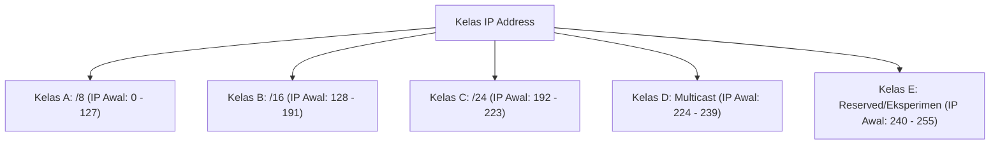
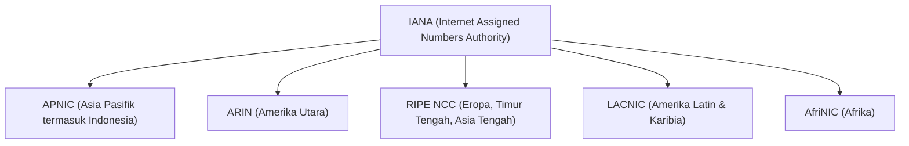

# IPv4 Complete Guide: Bongkar Habis Protokol L3, Subnetting, & Mekanisme Pengiriman Data (Week 7)

Halo! Selamat datang di panduan lengkap buat materi **Jaringan Komputer Week 7**. Di sini kita bakal bongkar habis materi **IPv4 (Internet Protocol Version 4)**. Kita nggak cuma bahas apa yang ada di slide kuliah aja, tapi kita bakal kupas tuntas konsep-konsep di balik layar yang sering bikin bingung pas ujian, lengkap dengan analogi seru, *step-by-step* matematika biner, hingga logika ANDing.

Yuk, siapin kopi atau teh, kita mulai belajar bareng!

---

## 1. Analogi Sistem Pos: Gimana Sih Konsep Dasar IP Addressing & Routing?

Sebelum kita pusing ngeliat deretan angka biner 32-bit, mari kita bayangkan gimana cara kerja **Sistem Pengiriman Surat POS** di dunia nyata. 

Bayangkan kamu mau ngirim surat cinta ke temanmu yang beda kota. Apa aja yang kamu butuhkan?
1. **Alamat Tujuan Lengkap:** Kamu kudu nulis jalan, nomor rumah, RT/RW, kota, dan kode pos tujuan. Tanpa ini, tukang pos bakal kebingungan dan suratmu bakal nyasar.
2. **Amplop Standar (Format):** Surat kamu kudu dimasukin ke dalam amplop yang punya tempat khusus buat nulis alamat pengirim (asal) dan penerima (tujuan).
3. **Kantor Pos & Kurir (Router & Switch):** 
   - Pas kamu masukin surat ke kotak pos di dekat rumahmu (**Local Switch**), surat itu bakal dikumpulin ke kantor pos cabang terdekat.
   - Kantor pos cabang (**Default Gateway / Router Utama**) bakal ngeliat kode pos tujuan. Kalau kode posnya beda kota, kantor pos cabang bakal ngirim surat itu pake truk ke kantor pos kota tujuan melalui rute-rute jalan raya (**Routing**).

Di dunia jaringan komputer, **IP Address** itu persis kayak alamat rumah plus kode pos tadi. **IP Packet Header** adalah amplop standarnya, sedangkan **Router** adalah kantor pos yang bertugas meneruskan surat kita sampai ke kota seberang.



---

## 2. Pengantar Internet Protocol (IP) & Layer 3

> [!info] **Definisi Internet Protocol (IP)**
> **Internet Protocol (IP)** adalah protokol utama yang bekerja di **Layer 3 (Network Layer)** pada model OSI. Tugas utamanya adalah menangani **logical addressing** (pengalamatan logis) dan **routing** (perutean) paket data dari satu host ke host lain di jaringan yang berbeda (host-to-host delivery).

Karakteristik penting dari IP yang kudu kamu ingat buat ujian:
* **Connectionless:** IP nggak bikin koneksi langsung (*handshake*) ke penerima sebelum ngirim data. Pokoknya paket langsung dikirim aja. (Urusan koneksi aman itu tugas protokol Layer 4 kayak TCP).
* **Best Effort (Unreliable):** IP nggak ngejamin paket bakal sampai 100% tanpa error atau berurutan. Kalau ada paket yang rusak atau hilang di jalan, IP bakal nge-drop paket itu begitu aja. Pengiriman ulang paket yang hilang adalah tanggung jawab Layer di atasnya (TCP).
* **Media Independent:** IP nggak peduli paket datanya dikirim lewat kabel tembaga (Ethernet), serat optik (Fiber Optic), atau udara (Wi-Fi). Paket IP bakal dibungkus sesuai media fisik yang dilewatinya.

### Kenapa sih ada IPv4 dan IPv6?
* **IPv4** menggunakan alamat **32-bit**, yang artinya secara teoretis cuma bisa menampung sekitar $2^{32} \approx 4,29 \text{ miliar}$ alamat unik. Dulu tahun 1980-an angka ini keliatan gede banget. Tapi sekarang, dengan adanya *smartphone*, IoT, smart TV, dkk., alamat IPv4 ini sudah habis!
* **IPv6** lahir sebagai solusi dengan panjang alamat **128-bit**, yang sanggup menampung hingga $2^{128} \approx 3,4 \times 10^{38}$ alamat (sangat cukup bahkan jika setiap butir pasir di bumi dikasih IP address sendiri!). 
* Di panduan ini, kita bakal fokus membedah **IPv4** dulu ya!

---

## 3. Senjata Wajib: Konversi Desimal ke Biner (dan Sebaliknya)

Komputer itu cuma tahu angka `0` dan `1` (biner), sedangkan manusia lebih gampang baca angka desimal (seperti `192.168.1.1`). Makanya, kita kudu lancar melakukan konversi ini di luar kepala.

### A. Tabel Perpangkatan Dua (Kunci Utama)
Sebelum ngerjain konversi, hapalin dulu deretan angka perpangkatan 2 untuk 8 bit (1 oktet) dari kiri ke kanan:

| Posisi Bit (dari kiri) | 1 | 2 | 3 | 4 | 5 | 6 | 7 | 8 |
| :--- | :---: | :---: | :---: | :---: | :---: | :---: | :---: | :---: |
| **Pangkat Basis 2** | $2^7$ | $2^6$ | $2^5$ | $2^4$ | $2^3$ | $2^2$ | $2^1$ | $2^0$ |
| **Nilai Desimal** | **128** | **64** | **32** | **16** | **8** | **4** | **2** | **1** |

---

### B. Konversi Biner ke Desimal
Caranya gampang banget. Tulis bit binermu di bawah tabel di atas, lalu jumlahkan semua nilai desimal yang bit binernya bernilai `1`.

> [!example] **Contoh Konversi Biner ke Desimal**
> **Soal:** Konversikan $(10101000)_2$ ke desimal!
> 
> **Langkah Kerja:**
> Masukkan ke tabel kecocokan nilai:
> * Bit 1 (128) $\rightarrow$ `1`
> * Bit 2 (64) $\rightarrow$ `0`
> * Bit 3 (32) $\rightarrow$ `1`
> * Bit 4 (16) $\rightarrow$ `0`
> * Bit 5 (8) $\rightarrow$ `1`
> * Bit 6 (4) $\rightarrow$ `0`
> * Bit 7 (2) $\rightarrow$ `0`
> * Bit 8 (1) $\rightarrow$ `0`
> 
> Tulis dalam persamaan matematika formal:
> $$\begin{aligned}
> (10101000)_2 &= (1 \times 128) + (0 \times 64) + (1 \times 32) + (0 \times 16) + (1 \times 8) + (0 \times 4) + (0 \times 2) + (0 \times 1) \\
> &= 128 + 0 + 32 + 0 + 8 + 0 + 0 + 0 \\
> &= (168)_{10}
> \end{aligned}$$
> Jadi, biner `10101000` setara dengan desimal **168**.

---

### C. Konversi Desimal ke Biner
Di slide perkuliahan dijelasin pake metode pembagian berulang dengan angka 2. Tapi di sini, kita bakal pakai **Trik Cepat: Metode Pengurangan Bit**. Cara ini jauh lebih cepat buat coret-coretan pas ujian!

> [!tip] **Trik Cepat Pengurangan Bit**
> Mulailah dari bit paling kiri (128). Tanyakan: *"Apakah angka desimal kita bisa dikurangi nilai kolom ini?"*
> * **Bisa (angka desimal $\ge$ nilai kolom):** Tulis `1` di kolom tersebut, lalu kurangi angka desimalmu dengan nilai kolom itu. Sisa hasil pengurangannya lanjut diuji ke kolom berikutnya.
> * **Nggak Bisa (angka desimal < nilai kolom):** Tulis `0`, lalu langsung lanjut uji sisa angka tadi ke kolom berikutnya tanpa melakukan pengurangan.

Mari kita coba dengan contoh angka desimal **172**.

> [!example] **Contoh Konversi Desimal ke Biner dengan Trik Cepat**
> **Soal:** Konversikan $(172)_{10}$ ke biner!
> 
> **Proses Berpikir:**
> 1. Mulai dari **128**: Apakah $172 \ge 128$? **Ya!** Tulis bit `1`. Sisa $= 172 - 128 = 44$.
> 2. Lanjut ke **64**: Apakah $44 \ge 64$? **Tidak!** Tulis bit `0`. Sisa tetap $44$.
> 3. Lanjut ke **32**: Apakah $44 \ge 32$? **Ya!** Tulis bit `1`. Sisa $= 44 - 32 = 12$.
> 4. Lanjut ke **16**: Apakah $12 \ge 16$? **Tidak!** Tulis bit `0`. Sisa tetap $12$.
> 5. Lanjut ke **8**: Apakah $12 \ge 8$? **Ya!** Tulis bit `1`. Sisa $= 12 - 8 = 4$.
> 6. Lanjut ke **4**: Apakah $4 \ge 4$? **Ya!** Tulis bit `1`. Sisa $= 4 - 4 = 0$.
> 7. Karena sisa sudah `0`, bit sisanya (**2** dan **1**) otomatis kita isi `0` dan `0`.
> 
> Jika digabungkan:
> * Kolom: 128 | 64 | 32 | 16 | 8 | 4 | 2 | 1
> * Bit: `1` | `0` | `1` | `0` | `1` | `1` | `0` | `0`
> 
> Jadi, $(172)_{10} = (10101100)_2$. Cepat banget, kan?

---

## 4. Struktur Alamat IPv4 & Logika ANDing

Alamat IPv4 itu panjangnya **32-bit**. Biar gampang dibaca manusia, alamat ini dibagi menjadi 4 bagian masing-masing 8-bit (disebut **oktet**) yang dipisahkan oleh tanda titik (Format: *Dotted Decimal Notation*).
Contoh: `192.168.10.10`

### A. Pembagian Wilayah: Network Portion vs Host Portion
IP Address itu sebenarnya gabungan dari dua informasi:
1. **Network Portion (Bagian Jaringan):** Mengidentifikasi alamat wilayah jalan/jaringannya. Semua perangkat yang berada di dalam satu segmen kabel/jaringan fisik yang sama **wajib** memiliki *Network Portion* yang sama.
2. **Host Portion (Bagian Perangkat):** Mengidentifikasi perangkat spesifik (seperti PC, laptop, HP, printer, router interface) di jaringan tersebut. *Host Portion* ini harus unik, nggak boleh ada dua perangkat dengan host portion yang sama di jaringan yang sama (kalau sama, bakal terjadi *IP Address Conflict*).

Lalu, gimana cara komputer tahu mana batas antara *Network Portion* dan *Host Portion*? Jawabannya ada pada **Subnet Mask**.

---

### B. Subnet Mask & Operasi Logika ANDing
Subnet Mask juga berupa alamat biner 32-bit. Kuncinya sederhana: **Bit biner bernilai `1` di subnet mask menandakan area Network, sedangkan bit `0` menandakan area Host.**

Untuk mencari **Network Address** (alamat jalan/jaringan), komputer melakukan operasi logika biner **AND** antara IP Address dengan Subnet Mask miliknya secara bit-by-bit.

> [!important] **Tabel Kebenaran Logika AND**
> Operasi AND mirip perkalian biner. Hasilnya hanya akan bernilai `1` jika kedua input bernilai `1`.
> * $1 \text{ AND } 1 = 1$
> * $1 \text{ AND } 0 = 0$
> * $0 \text{ AND } 1 = 0$
> * $0 \text{ AND } 0 = 0$

> [!example] **Ilustrasi Nyata Operasi ANDing**
> Misalkan sebuah PC dikonfigurasi dengan:
> * **IP Address:** `192.168.10.10`
> * **Subnet Mask:** `255.255.255.0`
> 
> Mari kita konversikan keduanya ke biner dan lakukan operasi ANDing bit-by-bit:
> ```text
> IP Address:    192      . 168      . 10       . 10
> Biner IP:      11000000 . 10101000 . 00001010 . 00001010
> Mask Biner:    11111111 . 11111111 . 11111111 . 00000000 (255.255.255.0)
>                ----------------------------------------- [AND]
> Hasil Biner:   11000000 . 10101000 . 00001010 . 00000000
> Hasil Desimal: 192      . 168      . 10       . 0
> ```
> Hasil ANDing di atas adalah `192.168.10.0`. Inilah yang disebut dengan **Network Address**. 
> 
> *Kenapa ini penting?* Jika PC A (`192.168.10.10`) ingin mengirim paket data ke PC B (`192.168.10.25`), PC A akan meng-AND-kan IP PC B dengan mask miliknya. Karena hasilnya sama-sama `192.168.10.0`, PC A tahu bahwa PC B berada di jaringan lokal yang sama, jadi paket bisa langsung dikirim lewat Switch tanpa bantuan Router.

---

### C. Notasi CIDR (Classless Inter-Domain Routing) / Prefix Length
Menulis subnet mask desimal sepanjang `255.255.255.0` itu dinilai kurang efisien. Makanya, para insinyur jaringan membuat notasi singkat yang dinamakan **Prefix Length** (ditulis dengan tanda garis miring `/` diikuti jumlah bit bernilai `1` pada subnet mask).

Contoh: Subnet mask `255.255.255.0` memiliki 24 bit bernilai `1` berurutan dari kiri (`11111111.11111111.11111111.00000000`), sehingga ditulis sebagai **/24**.

Berikut tabel referensi cepat yang kudu kita pahami (khususnya untuk oktet terakhir):

| Subnet Mask Desimal | Subnet Mask Oktet Terakhir (Biner) | Panjang Prefix | Jumlah Bit Host Tersisa |
| :--- | :--- | :--- | :---: |
| `255.255.255.0` | `11111111.11111111.11111111.00000000` | `/24` | 8 bit |
| `255.255.255.128` | `11111111.11111111.11111111.10000000` | `/25` | 7 bit |
| `255.255.255.192` | `11111111.11111111.11111111.11000000` | `/26` | 6 bit |
| `255.255.255.224` | `11111111.11111111.11111111.11100000` | `/27` | 5 bit |
| `255.255.255.240` | `11111111.11111111.11111111.11110000` | `/28` | 4 bit |
| `255.255.255.248` | `11111111.11111111.11111111.11111000` | `/29` | 3 bit |
| `255.255.255.252` | `11111111.11111111.11111111.11111100` | `/30` | 2 bit |
| `255.255.255.254` | `11111111.11111111.11111111.11111110` | `/31` | 1 bit |
| `255.255.255.255` | `11111111.11111111.11111111.11111111` | `/32` | 0 bit |

---

## 5. Tiga Jenis Alamat dalam Satu Subnet

Dalam setiap segmen subnet yang valid, alamat IP dibagi lagi berdasarkan fungsinya menjadi tiga kategori:

1. **Network Address:** Alamat pengenal bagi seluruh segmen jaringan tersebut. Alamat ini didapat ketika **semua bit pada Host Portion bernilai `0`**. Alamat ini tidak boleh dipasang di perangkat apa pun.
2. **Host Address:** Rentang alamat IP yang aman dan valid untuk dikonfigurasikan secara manual atau dinamis pada kartu jaringan perangkat (PC, HP, Server, Router Interface).
   - **First Host:** IP pertama setelah Network Address (Host portion diakhiri bit `1`).
   - **Last Host:** IP terakhir sebelum Broadcast Address (Host portion diakhiri bit `0`).
3. **Broadcast Address:** Alamat khusus yang dipakai oleh perangkat untuk mengirimkan paket ke seluruh host di subnet yang sama secara serentak. Alamat ini didapat ketika **semua bit pada Host Portion bernilai `1`**. Alamat ini juga dilarang keras dipasang pada interface perangkat.

### Rumus Matematika Subnetting
Untuk menghitung berapa jumlah host valid yang bisa ditampung oleh suatu subnet mask/prefix, kita menggunakan rumus:
$$\text{Jumlah Host Valid} = 2^{(32 - \text{Prefix Length})} - 2$$

> [!important] **Kenapa sih harus dikurangi 2?**
> Karena dari total kombinasi bit host yang ada ($2^n$), ada 2 alamat khusus yang sifatnya *reserved* untuk fungsi protokol jaringan standar, yaitu **Network Address** (semua bit host `0`) dan **Broadcast Address** (semua bit host `1`). Keduanya tidak boleh dipasang pada interface perangkat komputer.

---

### Bedah Kasus Soal Kuliah (IPv4 `6.6.6.10/29`)

Biar makin mantap, yuk kita bongkar soal latihan mandiri yang ada di catatan perkulian kemarin.

**Pertanyaan:** Diketahui sebuah server memiliki alamat IPv4 `6.6.6.10` dengan subnet mask `255.255.255.248`. Tentukan analisis parameternya!

**Langkah Analisis Pembahasan:**

1. **Konversi ke Biner:**
   - IP Address: `6.6.6.10` $\rightarrow$ `00000110.00000110.00000110.00001010`
   - Subnet Mask: `255.255.255.248` $\rightarrow$ `11111111.11111111.11111111.11111000`
2. **Menentukan Prefix Length:**
   Hitung jumlah bit `1` di subnet mask biner. Totalnya ada 29 bit. Jadi notasi CIDR-nya adalah **/29**.
3. **Mencari Network Address:**
   Lakukan operasi ANDing bit-by-bit pada oktet keempat (karena oktet 1, 2, dan 3 mask-nya adalah 255/full `1`, nilainya pasti tetap):
   - Oktet 4 IP: `10` $\rightarrow$ `0000 1010`
   - Oktet 4 Mask: `248` $\rightarrow$ `1111 1000`
   - Hasil ANDing: `0000 1000` $\rightarrow$ setara desimal **8**.
   - Jadi, **Network Address = `6.6.6.8`**.
4. **Menghitung Jumlah Host Valid:**
   Jumlah bit host sisa $= 32 - 29 = 3$ bit.
   $$\text{Jumlah Host} = 2^3 - 2 = 8 - 2 = \mathbf{6 \text{ host}}$$
5. **Menentukan Broadcast Address:**
   Ambil biner Network Address, lalu ubah 3 bit host portion paling kanan (yang tadinya `0`) menjadi bernilai `1`:
   - Network Oktet 4: `0000 1000` (8)
   - Set bit host jadi `1`: `0000 1111` $\rightarrow$ setara desimal **15**.
   - Jadi, **Broadcast Address = `6.6.6.15`**.
6. **Memetakan Rentang IP Host Valid:**
   - **First Host:** Network Address $+ 1 = \mathbf{6.6.6.9}$
   - **Last Host:** Broadcast Address $- 1 = \mathbf{6.6.6.14}$
   - Jadi rentang IP yang bisa dipakai server di subnet ini adalah `6.6.6.9` s.d. `6.6.6.14`. IP server kita (`6.6.6.10`) masuk dalam rentang ini dengan aman!

---

## 6. Jenis-Jenis Alamat IPv4

Berdasarkan kegunaan dan aturan standarnya, alamat IPv4 dikelompokkan ke dalam beberapa tipe:

### A. Public IP vs Private IP (RFC 1918)
* **Public IP Address:** Alamat IP unik sedunia yang didaftarkan secara resmi. Alamat ini bisa langsung dikenali dan dirutekan di internet global.
* **Private IP Address:** Alamat IP yang dicadangkan khusus untuk jaringan internal/lokal (intranet) di rumah, sekolah, atau kantor. Alamat IP ini **tidak boleh dirutekan di internet** (kalau ada paket IP private nyasar ke router internet/ISP, paket itu bakal langsung dibuang). 

Tabel pembagian rentang IP Private berdasarkan dokumen standardisasi **RFC 1918**:

| Kelas Blok | Rentang IP Address | Subnet Mask Bawaan (Prefix) |
| :---: | :--- | :---: |
| **Kelas A** | `10.0.0.0` s.d. `10.255.255.255` | `10.0.0.0/8` |
| **Kelas B** | `172.16.0.0` s.d. `172.31.255.255` | `172.16.0.0/12` |
| **Kelas C** | `192.168.0.0` s.d. `192.168.255.255` | `192.168.0.0/16` |

---

### B. IP Address Penggunaan Spesial
* **Loopback Address (`127.0.0.0/8`):** Sering ditulis sebagai `127.0.0.1`. Ini alamat "diri sendiri" (*localhost*). Digunakan untuk menguji apakah protokol TCP/IP di sistem operasi komputer kita berfungsi dengan baik tanpa harus mengirim sinyal keluar ke kartu jaringan fisik.
* **Link-Local / APIPA Address (`169.254.0.0/16`):** Jika komputer kita diset konfigurasi IP otomatis (DHCP Client) tapi gagal mendapatkan IP dari router/DHCP Server setelah beberapa waktu, sistem operasi secara mandiri akan memberikan IP dari rentang ini. Jika komputermu dapat IP `169.254.x.x`, itu tanda bahwa koneksi kabel/Wi-Fi kamu sedang bermasalah atau DHCP Server-nya sedang mati!

---

### C. Sejarah Klasifikasi IP: Classful vs Classless Addressing
Secara historis (tahun 1981), alokasi IP dibagi berdasarkan kelas-kelas kaku (*Classful Addressing*):



> [!important] **Kenapa sistem Classful ditinggalkan?**
> Karena pembagiannya sangat tidak efisien (boros). Contohnya, kalau ada perusahaan besar butuh $70.000$ alamat IP, mereka terpaksa dikasih alokasi Kelas A (menyediakan hingga 16 juta host). Akibatnya, ada sisa belasan juta IP yang hangus/sia-sia dan tidak bisa dipakai orang lain.
> 
> Makanya sejak tahun 1993, industri beralih total ke **Classless Addressing** menggunakan teknologi **CIDR (Classless Inter-Domain Routing)** dan **VLSM (Variable Length Subnet Mask)** yang mengizinkan pembagian subnet mask secara fleksibel dan presisi sesuai kebutuhan riil organisasi.

---

### D. Manajemen Alamat IP Tingkat Global
Siapa sih yang mengatur pembagian IP sedunia?
* **IANA (Internet Assigned Numbers Authority):** Lembaga pusat yang mengontrol pembagian nomor parameter protokol internet secara global, termasuk membagi blok IP besar ke wilayah regional.
* **RIR (Regional Internet Registry):** Entitas regional yang menerima blok IP dari IANA lalu mendistribusikannya ke ISP/perusahaan lokal di wilayah masing-masing. Ada 5 RIR di dunia:



---

## 7. Segmentasi Jaringan (Network Segmentation)

### A. Broadcast Domain & Masalah "Trafik Berlebih"
Saat perangkat melakukan pencarian alamat fisik hardware (**ARP Request**) atau meminta IP otomatis (**DHCP Discover**), perangkat tersebut mengirimkan paket **Broadcast** (alamat tujuan biner semua `1` / desimal `255.255.255.255`).

* **Switch** (Layer 2) bertugas memancarkan kembali (*flood*) paket broadcast ini ke seluruh port yang terhubung dengannya.
* Batas akhir penyebaran broadcast ini hanya bisa dihentikan oleh **Router** (Layer 3). Makanya, setiap port fisik router adalah pembatas dari sebuah **Broadcast Domain**.

> [!warning] **Bahaya Broadcast Domain Terlalu Besar**
> Bayangkan kalau ada 1000 PC berada dalam satu jaringan tanpa disekat (satu Broadcast Domain besar). Setiap kali ada 1 PC ngirim broadcast, 999 PC lainnya terpaksa menerima paket itu, memprosesnya di CPU mereka, lalu membuangnya jika tidak cocok. Hal ini bikin **bandwidth jaringan habis** dan **performa CPU komputer menurun drastis** (sering disebut masalah *Excessive Broadcast* atau *Broadcast Storm*).

---

### B. Solusi: Subnetting (Membagi Wilayah)
Subnetting adalah teknik memecah satu blok jaringan besar (misal `/16`) menjadi sub-sub jaringan yang lebih kecil (misal dipecah-pecah menjadi beberapa subnet `/24`).

```text
Tanpa Subnetting (1 Broadcast Domain Raksasa):
[1000 PC saling berteriak di ruangan yang sama] -> Bising!

Dengan Subnetting (Dibagi menjadi Subnet-Subnet kecil):
[Ruang 1: 200 PC] |sekat Router| [Ruang 2: 200 PC] |sekat Router| [Ruang 3: 200 PC] ...
-> Suasana tenang dan tertib!
```

### C. Alasan Utama Segmentasi Jaringan:
1. **Security (Keamanan):** Memudahkan pemasangan Firewall di router pembatas. Contohnya, kita bisa memblokir PC mahasiswa di `Subnet Mahasiswa` agar tidak bisa nge-ping server nilai di `Subnet Server Akademik`.
2. **Kinerja Jaringan:** Mengurangi trafik broadcast yang tidak perlu di segmen lain.
3. **Isolasi Masalah:** Jika terjadi infeksi malware/virus di salah satu komputer di lantai 1 yang mengirim trafik spam, efeknya hanya akan mengacaukan subnet lantai 1 saja. Subnet lantai 2 dan lantai 3 tetap aman berjalan normal.

### D. Kriteria Pembagian Subnet di Lapangan:
* **Lokasi Geografis:** Subnet Lantai 1, Subnet Gedung A, Subnet Kampus Solo, Subnet Kampus Kentingan.
* **Fungsi Organisasi:** Subnet Dosen, Subnet Mahasiswa, Subnet Staff Keuangan, Subnet IT Support.
* **Tipe Perangkat:** Subnet khusus Server, Subnet khusus Printer, Subnet khusus VoIP Phone, Subnet khusus User PC.

---

## Ringkasan Formula Cepat Ujian

* **Mencari Network ID:** Lakukan operasi AND biner antara IP dan Subnet Mask.
* **Mencari Jumlah Host:** $2^{(32 - \text{Prefix})} - 2$.
* **Mencari Broadcast ID:** Set bit host portion menjadi `1` semua pada alamat Network biner.
* **First Host:** Network Address $+ 1$ desimal.
* **Last Host:** Broadcast Address $- 1$ desimal.

Semoga panduan lengkap ini bikin kamu makin paham konsep IPv4 sampai ke akar-akarnya, ya! Jangan sungkan buat baca pelan-pelan bagian konversi biner dan contoh soal `6.6.6.10/29` biar makin lihai pas ujian nanti. Semangat belajarnya! 🚀
