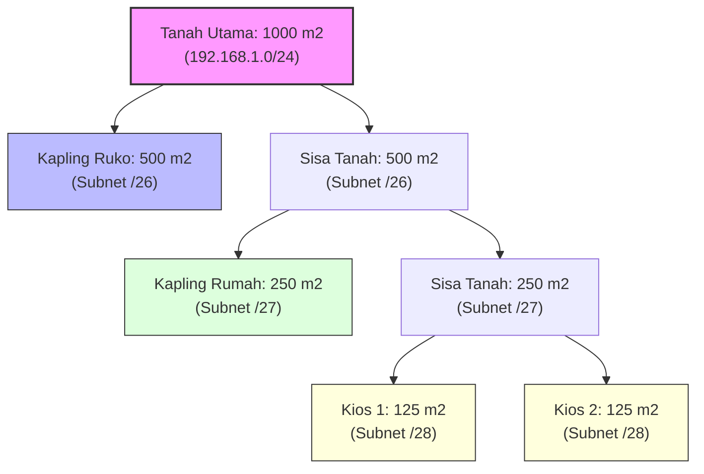
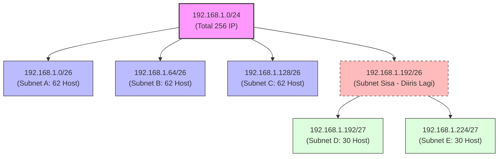

# IPv4 Subnetting & VLSM Complete Guide: Perhitungan Tradisional, VLSM, dan Trik Cepat Ujian (Week 8)

Halo! Ketemu lagi di materi **Jaringan Komputer Week 8**. Di materi sebelumnya, yaitu [[(Week 7) IPv4 Complete Guide|IPv4 Complete Guide (Week 7)]], kita udah belajar bareng soal struktur alamat IPv4 dasar, logika ANDing, dan cara ngerjain parameter IP. 

Nah, sekarang kita bakal naik tingkat ke materi yang jadi "momok" banyak mahasiswa pas ujian: **Subnetting** dan **VLSM (Variable Length Subnet Mask)**. Di sini kita bakal kupas tuntas teorinya dari nol, ngebongkar trik cepat hitungan tanpa biner (*Magic Number*), hingga ngerjain studi kasus VLSM secara terstruktur dan rapi. Yuk, mari kita bongkar!

---

## 1. Analogi Kapling Tanah: Membangun Intuisi Subnetting & VLSM

Sebelum masuk ke rumus matematika dan biner, ayo kita pakai analogi dunia nyata biar otak kita langsung klik dengan konsepnya.

### A. Subnetting Tradisional: Pembagian Kapling Sama Rata
Bayangkan kamu punya sebidang tanah raksasa seluas $1000 \text{ m}^2$ (**IP Network Utama**). Kamu berencana membagi tanah ini menjadi 4 bagian kapling perumahan dengan ukuran yang sama rata untuk dijual ke 4 orang pembeli berbeda.
* Hasilnya: Masing-masing orang bakal dapet kapling berukuran persis $250 \text{ m}^2$. 
* Pembagian ini adil dan gampang dihitung. Ini mirip banget sama **Subnetting Tradisional**, di mana satu blok IP besar dibagi menjadi sub-jaringan (subnet) dengan ukuran mask (prefix) yang **sama persis**.

---

### B. VLSM: Pembagian Kapling Sesuai Kebutuhan
Sekarang bayangkan skenario kedua. Tanah seluas $1000 \text{ m}^2$ tersebut mau kamu bagi ke 4 pembeli dengan kebutuhan yang berbeda-beda:
* Pembeli 1 butuh tanah buat bangun ruko besar ($500 \text{ m}^2$).
* Pembeli 2 butuh tanah buat rumah tinggal sedang ($250 \text{ m}^2$).
* Pembeli 3 & 4 cuma butuh tanah kecil buat kios kelontong (masing-masing $125 \text{ m}^2$).

Kalau kamu pakai metode "bagi rata" ($250 \text{ m}^2$ per orang) kayak skenario pertama, ruko Pembeli 1 nggak bakal muat, sedangkan kios Pembeli 3 & 4 bakal kelebihan tanah kosong yang mubazir.

Makanya, kamu bagi tanahnya secara dinamis: $500 \text{ m}^2$ untuk ruko, sisa $500 \text{ m}^2$ tanah di-iris lagi jadi satu kapling $250 \text{ m}^2$ untuk rumah, dan sisa tanah terakhir $250 \text{ m}^2$ di-iris lagi jadi dua kapling $125 \text{ m}^2$ untuk kios. 

Inilah konsep **VLSM (Variable Length Subnet Mask)**! Kita membagi-bagi ruang alamat IP secara bertingkat dengan ukuran mask (prefix) yang **berbeda-beda** agar pas dengan kebutuhan perangkat (host) masing-masing cabang, tanpa membuang-buang IP secara mubazir.



---

## 2. Konsep Dasar IPv4 Subnetting & Peminjaman Bit

> [!info] **Definisi Subnetting**
> **Subnetting** adalah proses membagi suatu IP Network Address besar menjadi beberapa sub-jaringan (*subnet*) yang lebih kecil secara logis. Setiap subnet yang terbentuk akan bertindak sebagai **Broadcast Domain** tersendiri yang terpisah secara fisik/logis melalui perangkat Router.

Bagaimana cara melakukan subnetting secara teknis? Kuncinya adalah **Bit Borrowing (Peminjaman Bit)**. 

Kita meminjam beberapa bit dari porsi **Host** untuk dijadikan porsi **Network**. Akibatnya, bit network bertambah panjang (prefix membesar), sedangkan bit host berkurang pendek.

```text
Struktur IP Sebelum Subnetting (Misal /24):
[======== NETWORK PORTION: 24 BIT ========][== HOST PORTION: 8 BIT ==]

Struktur IP Setelah Subnetting (Misal meminjam 2 bit host, jadi /26):
[======== NETWORK PORTION: 24 BIT ========][ Borrowed: 2 bit ][= Host: 6 bit =]
|<---------- NEW NETWORK PORTION: 26 BIT ----------->|<-- HOST: 6 bit -->|
```

### Rumus Matematika Subnetting Tradisional:
Ada dua rumus utama yang wajib kamu hapal di luar kepala:

1. **Jumlah Subnet Baru yang Terbentuk:**
   $$\text{Jumlah Subnet} = 2^n$$
   Di mana $n$ adalah **jumlah bit host yang dipinjam** menjadi bit network.
2. **Jumlah Host Valid per Subnet:**
   $$\text{Jumlah Host} = 2^h - 2$$
   Di mana $h$ adalah **jumlah sisa bit host** yang tidak dipinjam.

> [!important] **Ingat Kembali Pengurangan 2 Host!**
> Nilai host selalu dikurangi 2 karena dalam setiap subnet, alamat pertama adalah **Network Address** (bit host bernilai `0` semua) dan alamat terakhir adalah **Broadcast Address** (bit host bernilai `1` semua). Keduanya tidak boleh dipasang pada interface PC/Router.

---

## 3. Studi Kasus Subnetting Tradisional (Kupas Tuntas)

Mari kita bedah tiga kasus subnetting tradisional yang ada di catatan perkuliahan UNS dengan penjelasan matematika langkah-demi-langkah.

### Kasus A: Membuat 100 Subnet pada Prefix `/16`
**Skenario:** Sebuah perusahaan besar memiliki alokasi IP Private `172.16.0.0/16`. Perusahaan ini membutuhkan minimal **100 subnet** untuk cabang-cabangnya.

**Langkah Analisis:**
1. **Mencari bit host yang perlu dipinjam ($n$):**
   Kita harus mencari nilai $n$ sehingga:
   $$2^n \ge 100$$
   * Jika $n = 6 \implies 2^6 = 64$ (Kurang, tidak memenuhi syarat 100 subnet).
   * Jika $n = 7 \implies 2^7 = 128$ (Cukup! Kita bisa membuat hingga 128 subnet).
   * Jadi, kita memutuskan untuk meminjam **7 bit**.
2. **Menentukan Prefix Baru:**
   $$\text{Prefix Baru} = \text{Prefix Awal} + n = 16 + 7 = \mathbf{/23}$$
3. **Menghitung Sisa Bit Host ($h$):**
   $$h = 32 - \text{Prefix Baru} = 32 - 23 = \mathbf{9 \text{ bit}}$$
4. **Menghitung Jumlah Host per Subnet:**
   $$\text{Jumlah Host} = 2^9 - 2 = 512 - 2 = \mathbf{510 \text{ host per subnet}}$$
5. **Kesimpulan:** Dengan mengubah mask menjadi `/23` (atau desimal `255.255.254.0`), perusahaan berhasil mendapatkan 128 subnet yang masing-masing sanggup menampung hingga 510 host.

---

### Kasus B: Membuat 1000 Subnet pada Prefix `/8`
**Skenario:** Sebuah Small ISP memiliki alokasi IP `10.0.0.0/8` dan ingin membaginya menjadi minimal **1000 subnet** untuk pelanggan perumahan.

**Langkah Analisis:**
1. **Mencari bit host yang perlu dipinjam ($n$):**
   Kita harus mencari nilai $n$ sehingga:
   $$2^n \ge 1000$$
   * Kita tahu bahwa $2^9 = 512$ (Kurang).
   * Nilai yang pas adalah $2^{10} = 1024$ subnet.
   * Jadi, kita meminjam **10 bit**.
2. **Menentukan Prefix Baru:**
   $$\text{Prefix Baru} = \text{Prefix Awal} + n = 8 + 10 = \mathbf{/18}$$
3. **Menghitung Sisa Bit Host ($h$):**
   $$h = 32 - 18 = \mathbf{14 \text{ bit}}$$
4. **Menghitung Jumlah Host per Subnet:**
   $$\text{Jumlah Host} = 2^{14} - 2 = 16384 - 2 = \mathbf{16382 \text{ host per subnet}}$$
5. **Kesimpulan:** Menggunakan prefix `/18` (`255.255.192.0`) menghasilkan 1024 subnet dengan kapasitas host raksasa (16.382 host per subnet).

---

### Kasus C: Mengefisienkan IPv4 untuk 5 Cabang
**Skenario:** Perusahaan memiliki alokasi `172.16.0.0/22` dari ISP. Perusahaan ini memiliki **5 cabang fisik** dan **5 koneksi internet (link WAN)** ke ISP. Total subnet yang dibutuhkan adalah **10 subnet**. Kebutuhan host terbesar ada di Corporate Headquarters, yaitu **40 host address**.

**Langkah Analisis:**
1. **Analisis Alokasi Awal:**
   - IP: `172.16.0.0/22` $\implies$ Prefix `/22` memiliki bit host $= 32 - 22 = 10$ bit (menyediakan total $2^{10} - 2 = 1022$ host).
2. **Analisis Persyaratan Kebutuhan:**
   - Kebutuhan subnet $= 10$ subnet.
   - Kebutuhan host maksimal $= 40$ host.
3. **Peminjaman Bit (Subnetting Tradisional):**
   - Untuk mengakomodasi 40 host, kita perlu sisa bit host ($h$) minimal:
     $$2^h - 2 \ge 40 \implies 2^h \ge 42 \implies h = 6 \text{ bit} \quad (2^6 - 2 = 62 \text{ host})$$
   - Berapa bit network yang bisa dipinjam ($n$) dari porsi host awal (10 bit)?
     $$\text{Bit yang bisa dipinjam} = 10 - h = 10 - 6 = \mathbf{4 \text{ bit}}$$
   - Mari kita cek apakah jumlah subnet dengan meminjam 4 bit ($2^n = 2^4 = 16$ subnet) mencukupi kebutuhan 10 subnet kita? **Sangat cukup!** (Bahkan tersisa $16 - 10 = 6$ subnet untuk rencana pengembangan masa depan).
4. **Menentukan Prefix Baru:**
   $$\text{Prefix Baru} = 22 + 4 = \mathbf{/26}$$
   Dalam desimal, prefix `/26` setara dengan subnet mask **`255.255.255.192`**.

---

## 4. Trik Ujian: Rumus Cepat "Magic Number"

Saat ujian tertulis, waktu kita sangat terbatas. Mengonversi biner 32-bit untuk mencari batasan subnet (*subnet boundary*) satu-per-satu bakal menghabiskan waktu. 

Ada trik cepat namanya **Trik Magic Number** untuk menentukan rentang IP Address di setiap subnet dalam hitungan detik!

> [!tip] **Trik Cepat Magic Number**
> **Langkah 1:** Perhatikan oktet tempat subnet mask mengalami perubahan (bukan bernilai `255` atau `0`).
> **Langkah 2:** Hitung Magic Number dengan rumus:
> $$\text{Magic Number} = 256 - \text{Nilai Desimal Subnet Mask pada Oktet Tersebut}$$
> **Langkah 3:** Blok subnet berikutnya adalah kelipatan dari Magic Number ini (dimulai dari `0`).

Mari kita uji trik ini untuk subnet mask `/26` (`255.255.255.192`).

> [!example] **Aplikasi Trik Magic Number**
> * Oktet yang mengalami perubahan adalah **oktet 4** (bernilai **192**).
> * Hitung Magic Number:
>   $$\text{Magic Number} = 256 - 192 = \mathbf{64}$$
> * Ini artinya, Network Address pada oktet ke-4 akan selalu berjalan kelipatan 64!
> * Daftar Subnet yang terbentuk:
>   - Subnet 1: `172.16.0.0`
>   - Subnet 2: `172.16.0.64`
>   - Subnet 3: `172.16.0.128`
>   - Subnet 4: `172.16.0.192`
>   - Subnet 5: `172.16.1.0` (setelah 255 terlampaui), dst.
> * Mari ceki-ceki parameter untuk **Subnet 2 (172.16.0.64/26)**:
>   - **Network ID:** `172.16.0.64` (Awal blok)
>   - **First Host:** Network ID $+ 1 = \mathbf{172.16.0.65}$
>   - **Broadcast ID:** Blok berikutnya $- 1 = 128 - 1 = \mathbf{172.16.0.127}$
>   - **Last Host:** Broadcast ID $- 1 = \mathbf{172.16.0.126}$
> 
> Tidak perlu coret-coretan biner 32 bit, kita bisa langsung dapat jawabannya!

---

## 5. Variable Length Subnet Mask (VLSM)

### Mengapa Subnetting Tradisional Belum Cukup?
Pada subnetting tradisional, ukuran setiap subnet **wajib sama**. Hal ini memicu pemborosan IP yang parah (*wasted addresses*), terutama pada tautan point-to-point (seperti koneksi WAN antar router) yang secara fisik **hanya membutuhkan 2 IP Address** (IP interface Router A dan Router B).

Jika kita membagi jaringan menggunakan subnetting tradisional `/26` (menyediakan 62 host per subnet):
* Setiap link WAN hanya memakai 2 IP.
* Sisa IP yang terbuang sia-sia $= 62 - 2 = \mathbf{60 \text{ IP Address per WAN Link!}}$

Untuk mengatasi masalah ini, kita menggunakan **VLSM**. 

> [!important] **Aturan Emas Penerapan VLSM (Golden Rule)**
> Saat mendesain skema alamat menggunakan VLSM, **selalu urutkan daftar kebutuhan jaringan dari jumlah kebutuhan host terbesar ke yang paling kecil.**
> 
> Jika kamu melanggar aturan ini (misal membagi subnet kecil terlebih dahulu), rentang IP kamu kemungkinan besar akan saling tumpang tindih (*overlapping*) dan kacau di tengah jalan.

---

## 6. Contoh Penerapan VLSM (Langkah-demi-Langkah)

Mari kita bedah studi kasus yang ada di slide kuliah UNS dengan sangat mendalam.

**Studi Kasus:**
Kita memiliki alokasi IP Network utama **`192.168.1.0/24`**. Kita diminta mendesain jaringan untuk memenuhi kebutuhan **5 subnet** berikut:
* 3 subnet dengan kapasitas masing-masing **62 host** (Subnet A, Subnet B, Subnet C).
* 2 subnet dengan kapasitas masing-masing **30 host** (Subnet D, Subnet E).

---

### Langkah 1: Memenuhi Kebutuhan Terbesar (3 Subnet @ 62 Host)
Sesuai *Golden Rule*, kita wajib mengerjakan kebutuhan host terbesar terlebih dahulu. 
Kebutuhan host $= 62$ IP.
* Rumus host: $2^h - 2 \ge 62 \implies 2^h \ge 64 \implies h = 6$ bit host.
* Panjang prefix baru $= 32 - h = 32 - 6 = \mathbf{/26}$.
* Jumlah IP per blok $= 2^6 = 64$ IP (termasuk Network & Broadcast).

Kita bagi blok utama `192.168.1.0/24` menjadi subnet-subnet berukuran `/26` (berjalan dengan kelipatan Magic Number $256 - 192 = 64$):
1. **Subnet A (62 host):** **`192.168.1.0/26`** (Memakai rentang IP `.1` s.d `.62`)
2. **Subnet B (62 host):** **`192.168.1.64/26`** (Memakai rentang IP `.65` s.d `.126`)
3. **Subnet C (62 host):** **`192.168.1.128/26`** (Memakai rentang IP `.129` s.d `.190`)
4. **Subnet Sisa (Cadangan):** **`192.168.1.192/26`** (Belum terpakai, ini yang akan kita iris kembali).

---

### Langkah 2: Memenuhi Kebutuhan Berikutnya (2 Subnet @ 30 Host)
Sekarang kita perlu membagi sisa alamat untuk mengakomodasi 2 subnet dengan kebutuhan 30 host. Kita akan mengambil **Subnet Sisa** dari Langkah 1, yaitu **`192.168.1.192/26`**, dan memecahnya dengan prefix yang lebih spesifik.

Kebutuhan host $= 30$ IP.
* Rumus host: $2^h - 2 \ge 30 \implies 2^h \ge 32 \implies h = 5$ bit host.
* Panjang prefix baru $= 32 - 5 = \mathbf{/27}$.
* Nilai mask desimal oktet 4 untuk `/27` $= 128 + 64 + 32 = 224$ (Subnet Mask: `255.255.255.224`).
* Jumlah IP per blok $= 2^5 = 32$ IP. Kelipatan jalannya adalah **32**.

Mari kita iris `192.168.1.192/26` (yang bernilai total 64 IP dari `.192` s.d `.255`) menjadi subnet-subnet berukuran 32 IP:
1. **Subnet D (30 host):** **`192.168.1.192/27`** (Blok dimulai dari `.192` s.d `.223`)
2. **Subnet E (30 host):** **`192.168.1.224/27`** (Blok dimulai dari `.224` s.d `.255`)

Selesai! Seluruh kebutuhan 5 subnet telah terpenuhi dengan efisiensi tinggi tanpa membuang ruang alamat IP.

---

### B. Diagram Pohon VLSM (Visualisasi Hierarki Subnet)

Biar kebayang alur pengirisan IP di atas, mari kita lihat diagram pohon pembagian alamat (*Address Tree Diagram*) berikut:



---


---

## Cheat-Sheet Rumus Cepat Ujian Subnetting

* **Magic Number** $= 256 - \text{Mask Desimal}$. Kelipatan angka ini adalah alamat network subnet-subnet berikutnya.
* **Mencari Network ID Cepat:** Bagi nilai oktet IP-mu dengan Magic Number, bulatkan ke bawah, lalu kalikan kembali dengan Magic Number.
* **Urutan VLSM:** Selalu urutkan dari **Host Terbesar** ke **Host Terkecil**. Jangan sampai terbalik!

Semoga panduan lengkap ini mempermudah kamu memahami materi IPv4 Subnetting & VLSM Week 8. Selamat belajar dan semoga sukses ujian Jaringan Komputernya! 🚀
