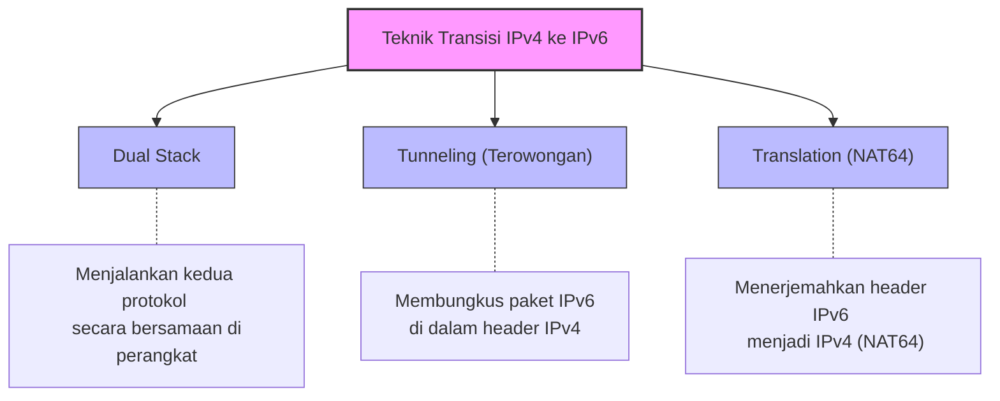
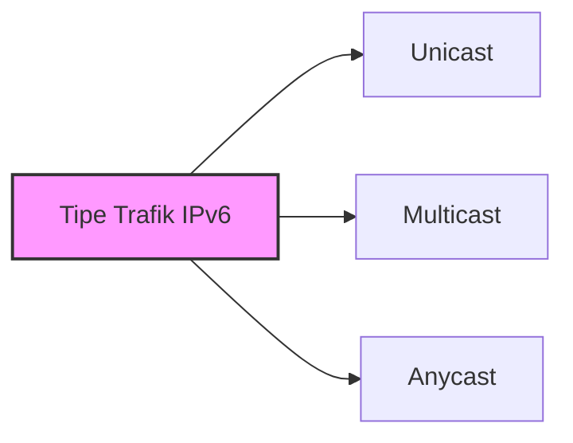
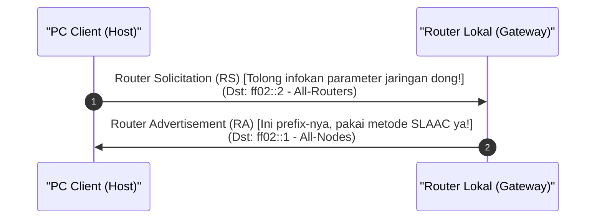

# IPv6 Complete Guide: Kupas Tuntas Era Baru Pengalamatan Layer 3, Konfigurasi Dinamis, & Strategi Transisi (Week 9)

Halo! Selamat datang kembali di seri catatan belajar **Jaringan Komputer**. Setelah sebelumnya kita sudah membongkar habis seluk-beluk [[(Week 7) IPv4 Complete Guide|IPv4 Complete Guide (Week 7)]] dan pusing-pusing ngerjain subnetting di [[(Week 8) IPv4 Subnetting Complete Guide|IPv4 Subnetting Complete Guide (Week 8)]], kali ini kita bakal melangkah ke masa depan internet: **IPv6 (Internet Protocol Version 6)**!

Materi IPv6 ini sering banget dianggap momok karena format alamatnya yang panjang banget, pakai heksadesimal, dan punya mekanisme otomatisasi yang beda jauh dari IPv4. Tapi tenang aja, di panduan ini kita bakal bahas semuanya dari nol dengan analogi santai, trik cepat kompresi alamat, langkah demi langkah EUI-64, sampai cara kerja transisi jaringan.

Yuk, tarik napas dalam-dalam, mari kita bongkar! 🚀

---

## 1. Kenapa Sih Kita Kudu Pindah ke IPv6? (The Big Picture)

Bayangkan sebuah kota metropolitan yang awalnya menetapkan format plat nomor kendaraan dengan pola **1 Huruf - 4 Angka** (misal: `B 1234`). Pada awal tahun 1980-an, format ini dirasa aman karena jumlah mobil masih sedikit. Namun, seiring berjalannya waktu, jumlah penduduk melonjak, satu keluarga bisa punya tiga mobil, ditambah lagi sepeda motor dan ojek online yang menjamur. Walhasil, polisi kehabisan kombinasi plat nomor!

Untuk mengatasinya, polisi terpaksa mengubah sistem plat nomor menjadi format baru yang jauh lebih panjang (misal: `B 1234 ABC`). 

Nah, **IPv4** itu persis seperti plat nomor versi lama. Panjangnya yang cuma **32-bit** membuat jumlah maksimal IP address di dunia hanya sekitar $2^{32} \approx 4,29$ miliar alamat. Di era Internet of Things (IoT) sekarang—di mana smart TV, kulkas, AC, mesin cuci, lampu, hingga jam tangan kita butuh koneksi internet—jumlah alamat tersebut sudah **habis lho!**

Sebagai penyelamat, hadirlah **IPv6** dengan panjang alamat **128-bit**! 

> [!info] **Seberapa Gede Sih Alamat IPv6?**
> Dengan 128-bit, IPv6 menyediakan sekitar **$2^{128}$** alamat unik, atau tepatnya:
> $$340.282.366.920.938.463.463.374.607.431.768.211.456$$
> (Itu dibaca: *340 undecillion* alamat!). Analogi populernya, angka ini cukup untuk memberikan IP address unik untuk setiap butir pasir di seluruh permukaan bumi! Jadi, kita nggak bakal kehabisan IP address lagi sampai ratusan tahun ke depan.

### Perbandingan Cepat: IPv4 vs IPv6

Biar gampang ceki-ceki pas ujian, berikut tabel perbandingan mendasar antara IPv4 dan IPv6:

| Parameter | IPv4 | IPv6 |
| :--- | :--- | :--- |
| **Panjang Alamat** | 32 bit (4 Byte) | 128 bit (16 Byte) |
| **Format Penulisan** | Desimal dipisah titik (*Dotted Decimal*) | Heksadesimal dipisah titik dua (*Colon-Hex*) |
| **Contoh Alamat** | `192.168.1.10` | `2001:0db8:85a3:0000:0000:8a2e:0370:7334` |
| **Jumlah Alamat** | $\approx 4,29 \times 10^9$ | $\approx 3,4 \times 10^{38}$ |
| **Metode Broadcast** | Ada (Digunakan untuk ARP, DHCP, dll.) | **Tidak Ada!** (Digantikan oleh Multicast) |
| **Konfigurasi IP** | Manual atau DHCPv4 | Manual, SLAAC, atau DHCPv6 |
| **Ketergantungan NAT** | Sangat tinggi (untuk menghemat IP) | Tidak butuh NAT! (Kembali ke prinsip *end-to-end*) |

---

## 2. Strategi Transisi: Hidup Berdampingan (Coexistence)

Kita tidak bisa mematikan internet di seluruh dunia dalam satu malam hanya untuk mengubah semua perangkat ke IPv6. Makanya, IPv4 dan IPv6 kudu bisa hidup berdampingan secara harmonis untuk waktu yang cukup lama. 

Untuk menjembatani masa transisi ini, IETF merancang tiga teknik utama:



### A. Dual Stack
Pada metode ini, setiap perangkat (host maupun router) dikonfigurasikan dengan **dua protokol sekaligus**: IPv4 dan IPv6 secara paralel. 
* Jika berkomunikasi dengan perangkat IPv4, mereka memakai jalur IPv4.
* Jika berkomunikasi dengan perangkat IPv6, mereka otomatis memakai jalur IPv6.
* *Analogi:* Seseorang yang menguasai Bahasa Indonesia dan Bahasa Inggris sekaligus. Dia tinggal memilih bahasa mana yang cocok tergantung lawan bicaranya.

### B. Tunneling
Metode ini digunakan saat ada dua jaringan IPv6 terpisah yang ingin saling berkomunikasi, tetapi mereka harus melewati "jalan tol" jaringan yang masih murni IPv4. 
* Caranya: Router pengirim membungkus seluruh paket IPv6 ke dalam payload paket IPv4 (proses enkapsulasi). 
* Router penerima di ujung sana akan membuka bungkus paket IPv4 tersebut dan meneruskan paket IPv6 aslinya ke tujuan akhir.
* *Analogi:* Mobil listrik baru (IPv6) yang mau melintasi jalan tol khusus mobil diesel (IPv4). Agar bisa lewat, mobil listrik itu dinaikkan ke atas truk pengangkut diesel (IPv4 Tunnel) untuk menyeberang sampai gerbang keluar tol.

### C. Translation (NAT64)
Teknik ini membolehkan perangkat yang *hanya* mendukung IPv6 (IPv6-only) mengobrol langsung dengan server/perangkat yang *hanya* memiliki IPv4 (IPv4-only).
* Router penerjemah (NAT64 Gateway) akan membongkar header IPv6 dari paket masuk, lalu secara dinamis menerjemahkannya menjadi header IPv4 (dan sebaliknya untuk paket balasan).
* *Catatan:* Teknik ini sebaiknya hanya dipakai sebagai opsi darurat terakhir jika komunikasi native benar-benar tidak memungkinkan.

---

## 3. Senjata Wajib: Konversi Heksadesimal dan Biner

Karena IPv6 ditulis dalam format heksadesimal, kita wajib menguasai konversi antara bilangan Heksadesimal (Hex) dan Biner. 

> [!important] **Aturan Emas Konversi Hex-Biner**
> * Bilangan heksadesimal berbasis 16, menggunakan digit `0` sampai `9` dan huruf `A` sampai `F` (A=10, B=11, C=12, D=13, E=14, F=15).
> * **Satu digit heksadesimal mewakili tepat 4 bit biner (disebut dengan istilah *nibble*).**

### Tabel Referensi Cepat (Hapalan Ujian)

| Desimal | Heksadesimal | Biner (4-bit) | Desimal | Heksadesimal | Biner (4-bit) |
| :---: | :---: | :---: | :---: | :---: | :---: |
| 0 | **0** | `0000` | 8 | **8** | `1000` |
| 1 | **1** | `0001` | 9 | **9** | `1001` |
| 2 | **2** | `0010` | 10 | **A** | `1010` |
| 3 | **3** | `0011` | 11 | **B** | `1011` |
| 4 | **4** | `0100` | 12 | **C** | `1100` |
| 5 | **5** | `0101` | 13 | **D** | `1101` |
| 6 | **6** | `0110` | 14 | **E** | `1110` |
| 7 | **7** | `0111` | 15 | **F** | `1111` |

---

### A. Contoh Konversi Heksadesimal ke Biner

Cara ngerjainnya gampang banget! Cukup pisahkan setiap karakter heksadesimal, lalu ubah masing-masing menjadi 4-bit biner berdasarkan tabel di atas.

> [!example] **Mengonversi `3F8A` ke Biner**
> **Soal:** Konversikan nilai heksadesimal `3F8A` menjadi biner!
> 
> **Langkah Kerja:**
> 1. Pecah per digit: `3`, `F`, `8`, dan `A`.
> 2. Cari padanan binernya:
>    - `3` $\rightarrow$ `0011`
>    - `F` $\rightarrow$ `1111`
>    - `8` $\rightarrow$ `1000`
>    - `A` $\rightarrow$ `1010`
> 3. Gabungkan hasilnya:
>    $$(3\text{F}8\text{A})_{16} = (0011111110001010)_2$$

---

### B. Contoh Konversi Biner ke Heksadesimal

Sebaliknya, jika kamu punya deretan biner panjang, kelompokkan biner tersebut mulai **dari arah kanan** menjadi kelompok-kelompok kecil berisi masing-masing 4 bit. Setelah itu, ubah tiap kelompok menjadi satu karakter hex.

> [!example] **Mengonversi Biner ke Heksadesimal**
> **Soal:** Konversikan biner `110101100011` ke heksadesimal!
> 
> **Langkah Kerja:**
> 1. Kelompokkan per 4 bit dari kanan: `1101` | `0110` | `0011`
> 2. Cari padanan heksadesimalnya:
>    - `1101` (desimal 13) $\rightarrow$ `D`
>    - `0110` (desimal 6) $\rightarrow$ `6`
>    - `0011` (desimal 3) $\rightarrow$ `3`
> 3. Gabungkan hasilnya:
>    $$(110101100011)_2 = (\text{D}63)_{16}$$

---

## 4. Format & Aturan Kompresi Alamat IPv6

Secara default, alamat IPv6 ditulis dengan format **8 kelompok** yang dipisahkan oleh tanda titik dua (`:`). Masing-masing kelompok berisi 4 digit heksadesimal (total 16 bit per kelompok, yang biasa disebut dengan istilah **hextet**).

$$\text{Format:} \quad \text{X:X:X:X:X:X:X:X}$$
$$\text{Contoh Alamat Panjang:} \quad \text{2001:0db8:0000:0000:0008:0800:200c:417a}$$

Menulis alamat sepanjang 32 karakter hex tentu melelahkan dan rawan typo. Makanya, ada dua aturan resmi untuk memampatkan (kompresi) penulisan IPv6:

---

### Aturan 1: Menghapus Nol di Depan (Omitting Leading Zeros)

Di dalam hextet mana pun, nilai nol yang posisinya berada di paling depan (sebelah kiri) boleh dihapus.
* `0db8` bisa ditulis menjadi `db8`
* `000a` bisa ditulis menjadi `a`
* `0000` bisa ditulis menjadi `0`

> [!warning] **Aturan Kritis**
> Aturan ini **hanya** berlaku untuk nol yang di depan (*leading zeros*). Nol yang posisinya di belakang (*trailing zeros*) **dilarang keras dihapus**, karena akan mengubah nilai alamat tersebut!
> * `ab00` $\rightarrow$ tetap ditulis `ab00` (tidak boleh dikompresi jadi `ab`).

---

### Aturan 2: Menggunakan Titik Dua Ganda (Double Colon - `::`)

Satu kelompok hextet berurutan yang seluruh nilainya berisi nol (`0000` atau `0`) bisa digantikan dengan tanda **titik dua ganda (`::`)**.

> [!important] **Aturan Emas Double Colon**
> Singkatan `::` **hanya boleh digunakan sekali saja** di dalam satu alamat IPv6! 
> 
> *Kenapa?* Karena jika kita menggunakannya dua kali, router atau komputer akan mengalami ambiguitas (kebingungan) saat mencoba mengembalikan alamat tersebut ke bentuk aslinya.
> 
> **Contoh Kasus Ambigu (Mengapa dilarang?):**
> Misalkan ada alamat ringkas: `2001:db8::abcd::1`
> Karena total hextet IPv6 harus berjumlah 8, router tidak akan tahu berapa jumlah kelompok angka nol yang hilang di `::` pertama dan `::` kedua. Apakah polanya 3 kelompok di kiri dan 1 kelompok di kanan? Atau 2 di kiri dan 2 di kanan? Tidak ada kepastian matematika!

---

### 📝 Latihan Soal Mandiri: Mengompresi & Membongkar Alamat

Mari kita integrasikan pemahaman teori di atas ke dalam latihan soal nyata yang sering keluar di kuis kelas.

#### Soal 1: Kompresi Alamat IPv6
Kompresilah alamat IPv6 berikut semaksimal mungkin:
$$\text{Alamat Asli:} \quad \text{2001:0db8:0000:0000:000f:0000:0000:0001}$$

**Langkah Kerja:**
1. Terapkan Aturan 1 (Hapus nol di depan hextet):
   `2001:db8:0:0:f:0:0:1`
2. Terapkan Aturan 2 (Ganti deretan nol berurutan dengan `::`):
   Di sini kita punya dua wilayah nol berurutan: ada dua hextet nol (`0:0`) di bagian kiri, dan ada dua hextet nol (`0:0`) di bagian kanan.
   *Karena `::` cuma boleh dipasang sekali*, pilihlah deretan nol yang paling panjang untuk diganti. Karena panjangnya sama-sama 2, kita bebas memilih salah satu. Umumnya kita pilih deretan nol pertama (sebelah kiri) untuk memaksimalkan kompresi visual.
   `2001:db8::f:0:0:1` (Hextet nol kanan tetap ditulis manual).
   *Alternatif:* `2001:db8:0:0:f::1` (Ini juga valid, tapi secara konvensi biasanya kita ambil kiri).
3. **Hasil Akhir Kompresi Terpendek:** `2001:db8::f:0:0:1`

#### Soal 2: Membongkar Alamat IPv6 (Decompress)
Kembalikan alamat IPv6 terkompresi berikut ke format aslinya (32 digit lengkap):
$$\text{Alamat Terkompresi:} \quad \text{fe80::21a:2bff:fe3c:4d5e}$$

**Langkah Kerja:**
1. Hitung jumlah hextet yang terlihat jelas di alamat terkompresi:
   Hextet terlihat: `fe80` (1), `21a` (2), `2bff` (3), `fe3c` (4), `4d5e` (5). Total ada 5 hextet.
2. Hitung berapa hextet yang disembunyikan oleh tanda `::`:
   $$\text{Jumlah hextet hilang} = 8 - 5 = 3 \text{ hextet}$$
3. Masukkan kembali 3 hextet nol (`0000`) di posisi tanda `::`:
   `fe80:0000:0000:0000:21a:2bff:fe3c:4d5e`
4. Kembalikan leading zeros (nol di depan) di tiap hextet agar masing-masing kembali memiliki 4 digit:
   - `21a` $\rightarrow$ `021a`
   - `fe80`, `2bff`, `fe3c`, `4d5e` sudah punya 4 digit.
5. **Hasil Akhir Dekompresi:** `fe80:0000:0000:0000:021a:2bff:fe3c:4d5e`

---

## 5. Tiga Jenis Komunikasi IPv6

Sama seperti IPv4, IPv6 membagi lalu lintas data berdasarkan target penerimanya. Bedanya, di IPv6 **tidak ada istilah broadcast!**



* **Unicast:** Komunikasi *one-to-one* (satu-ke-satu). Paket dikirimkan dari satu interface pengirim ke satu interface penerima spesifik.
* **Multicast:** Komunikasi *one-to-many* (satu-ke-banyak). Paket dikirim ke sebuah alamat grup khusus. Semua perangkat yang bergabung ke grup tersebut akan memproses paket tersebut.
* **Anycast:** Komunikasi *one-to-nearest* (satu-ke-terdekat). Ini adalah fitur unik di mana sebuah IP address unicast yang sama dipasang di beberapa perangkat berbeda (biasanya server DNS atau CDN tersebar). Router akan mengarahkan paket ke perangkat terdekat secara fisik/rute routing.
  * *Analogi:* Kamu mau stor tunai uang di Bank BCA. Kamu tidak peduli kantor cabang BCA mana yang kamu datangi, pokoknya kamu bakal pergi ke kantor cabang Bank BCA terdekat dari posisimu saat itu.

> [!important] **Kenapa Broadcast Dihapus di IPv6?**
> Pada IPv4, paket broadcast dikirim ke semua host di subnet tanpa pandang bulu. Hal ini sering mengakibatkan penumpukan sampah trafik (*excessive broadcast*) yang membebani kinerja kartu jaringan (NIC) dan CPU komputer-komputer client yang sebenarnya tidak butuh data tersebut. 
> 
> Sebagai solusinya, IPv6 menggunakan alamat **Multicast khusus** (seperti *all-nodes multicast* `ff02::1`) sehingga kartu jaringan bisa menyaring paket di level hardware tanpa mengganggu kinerja CPU utama jika paket tersebut tidak relevan.

---

## 6. Kupas Tuntas Unicast Addresses: GUA vs LLA

Setiap interface perangkat yang menjalankan IPv6 biasanya dikonfigurasikan dengan **lebih dari satu alamat IP**. Dua jenis IP unicast yang paling penting dan wajib kamu pahami untuk ujian adalah **GUA** dan **LLA**.

---

### A. Global Unicast Address (GUA)

GUA adalah alamat IP yang bersifat publik secara global. Alamat ini unik di seluruh dunia dan bisa dirutekan (*routable*) melintasi internet luas, mirip seperti IP Publik pada IPv4.

> [!info] **Rentang Alamat GUA**
> Saat ini, blok GUA yang didistribusikan secara resmi ke seluruh dunia dimulai dengan biner `001` pada hextet pertamanya. Hal ini membuat range GUA selalu berada dalam rentang heksadesimal **`2000::/3`** (dari `2000::` sampai `3fff:ffff:ffff:ffff:ffff:ffff:ffff:ffff`).

#### Struktur Tiga Bagian GUA (Menggunakan standar prefix `/64`):

```text
|<------------------------- 128 Bit IPv6 Address ------------------------->|
|                                                                          |
|<------------- Network Portion (64 bit) ------------>|<-- Host Part (64) ->|
|                                                     |                    |
+----------------------------------+------------------+--------------------+
|  Global Routing Prefix (48 bit)  | Subnet ID (16)   | Interface ID (64)  |
+----------------------------------+------------------+--------------------+
| Diatur oleh ISP / Global         | Diatur internal  | Mengidentifikasi   |
| (Contoh: 2001:db8:acad::/48)     | perusahaan       | host unik          |
```

1. **Global Routing Prefix (48 bit):** Bagian jaringan yang dialokasikan oleh ISP ke organisasi atau pelanggan.
2. **Subnet ID (16 bit):** Bagian yang digunakan secara internal oleh organisasi untuk membagi jaringannya menjadi sub-sub jaringan (subnet). Dengan 16 bit, sebuah organisasi bisa membuat hingga **$2^{16} = 65.536$ subnet unik!** Luar biasa besar dibanding IPv4.
3. **Interface ID (64 bit):** Bagian yang mewakili host/perangkat fisik itu sendiri. Standar internasional mewajibkan Interface ID sebesar 64-bit agar kompatibel dengan teknologi autokonfigurasi otomatis (SLAAC).

---

### B. Link-Local Address (LLA)

LLA adalah alamat IP yang bersifat lokal dan **tidak bisa dirutekan** melintasi router ke jaringan luar. LLA hanya berlaku untuk komunikasi antar perangkat yang berada dalam satu segmen kabel fisik/link lokal yang sama (satu broadcast domain).

> [!important] **Mengapa LLA Sangat Krusial?**
> * **Kewajiban Interface:** Setiap kartu jaringan yang mengaktifkan IPv6 **wajib** memiliki LLA. Interface tidak bisa berkomunikasi di jaringan IPv6 jika tidak memiliki LLA, meskipun interface tersebut sudah dikonfigurasikan dengan IP publik GUA!
> * **Default Gateway Utama:** Host-host di jaringan lokal menggunakan LLA milik router lokal sebagai alamat Default Gateway mereka (bukan IP publik router).
> * **Range Alamat:** LLA berada dalam blok range **`fe80::/10`**. Ini berarti 10 bit pertama bernilai biner `1111 1110 10`, yang membuat hextet pertamanya selalu berkisar antara **`fe80`** hingga **`febf`**. Secara umum di lapangan, LLA selalu diawali dengan prefix `fe80::/64`.

---

## 7. Cara Konfigurasi Alamat IPv6

Untuk memasang alamat IPv6 pada perangkat, kita bisa menggunakan metode statis (manual) atau dinamis (otomatis).

### A. Konfigurasi Statis (Cisco CLI)

Di router Cisco, kita mengaktifkan perutean IPv6 terlebih dahulu sebelum mengonfigurasi alamat pada interface:

```text
Router(config)# ipv6 unicast-routing
Router(config)# interface gigabitEthernet 0/0/0
! Memasang IP Publik (GUA) secara manual
Router(config-if)# ipv6 address 2001:db8:acad:1::1/64
! Memasang IP Lokal (LLA) secara manual
Router(config-if)# ipv6 address fe80::1 link-local
Router(config-if)# no shutdown
```

---

### B. Konfigurasi Dinamis (Mekanisme ICMPv6 RS & RA)

Salah satu kehebatan IPv6 adalah kemampuannya melakukan autokonfigurasi otomatis tanpa butuh campur tangan admin jaringan. Mekanisme ini digerakkan oleh protokol **ICMPv6** melalui dua pesan utama:
1. **Router Solicitation (RS - Tipe 133):** Dikirim oleh Host (PC/Laptop) dengan alamat tujuan *all-routers multicast* (`ff02::2`) untuk mendeteksi apakah ada router aktif di link lokal tersebut.
2. **Router Advertisement (RA - Tipe 134):** Dikirim oleh Router secara berkala (atau langsung sebagai balasan atas pesan RS) ke alamat *all-nodes multicast* (`ff02::1`). Pesan RA ini berisi informasi prefix jaringan lokal, prefix length, default gateway, serta petunjuk konfigurasi apa yang harus dipakai host.



Ada tiga opsi metode alokasi alamat dinamis yang bisa diinstruksikan oleh pesan RA:

1. **SLAAC (Stateless Address Autoconfiguration):**
   * Router menginfokan: *"Ini prefix jaringan lokalmu (misal `2001:db8:acad:1::/64`). Silakan buat sendiri Interface ID-mu untuk melengkapinya. Jangan tanya ke DHCP server, karena tidak ada DHCP server di sini!"*
   * Host akan menggabungkan prefix dari router dengan Interface ID buatannya sendiri (lewat metode EUI-64 atau angka acak).
2. **SLAAC dengan Stateless DHCPv6:**
   * Router menginfokan: *"Gunakan prefix ini untuk membuat IP address-mu sendiri via SLAAC. Tapi untuk informasi server DNS dan nama domain, silakan tanya ke server DHCPv6 ya!"*
   * Disebut *stateless* karena server DHCPv6 tidak perlu mencatat atau melacak IP apa yang dipakai oleh host. Server hanya memberikan info tambahan seperti DNS saja.
3. **Stateful DHCPv6 (Sama seperti IPv4 DHCP):**
   * Router menginfokan: *"Jangan bikin IP sendiri! Hubungi server DHCPv6 sekarang juga untuk meminta IP address, subnet mask, dan DNS lengkap."*
   * Server DHCPv6 bertindak *stateful* karena memantau, mencatat, dan mengelola database pemakaian IP perangkat di jaringan.

---

## 8. Membedah Proses EUI-64 (Extended Unique Identifier)

Saat host menggunakan metode **SLAAC**, ia mendapatkan prefix 64-bit dari router. Sisa 64-bit berikutnya (Interface ID) harus digenerate sendiri. Salah satu metode standar untuk membuat Interface ID 64-bit ini secara unik adalah menggunakan **EUI-64** yang memanfaatkan MAC Address fisik kartu jaringan (48-bit).

> [!important] **Alur Algoritma EUI-64 (Wajib Diingat!)**
> 1. Bagi MAC Address 48-bit (12 karakter hex) tepat di tengah-tengah menjadi dua bagian masing-masing 24-bit.
> 2. Sisipkan nilai heksadesimal **`FFFE`** (16-bit) tepat di tengah pembagian tadi.
> 3. Ubah oktet pertama MAC Address ke dalam biner 8-bit, lalu **balikkan bit ke-7** (jika bit ke-7 bernilai `0` ubah jadi `1`, dan sebaliknya). Bit ini dinamakan *U/L (Universal/Local) bit*.
> 4. Kembalikan heksadesimal baru tersebut ke dalam format IPv6 hextet.

---

### 📝 Contoh Soal Bedah Kasus: Menghitung EUI-64

Mari kita kerjakan contoh soal bertahap agar kamu tidak bingung saat ujian esai.

**Soal:** Sebuah interface komputer memiliki MAC Address **`00:90:27:17:FC:0F`**. Jika komputer tersebut menerima prefix IPv6 **`2001:db8:acad:1::/64`** dari router, tentukan alamat IPv6 GUA yang terbentuk menggunakan metode EUI-64!

**Langkah Kerja:**

**Langkah 1: Belah MAC Address tepat di tengah**
* Bagian Kiri: `00:90:27`
* Bagian Kanan: `17:FC:0F`

**Langkah 2: Sisipkan `FFFE` di tengah-tengah**
Maka alamatnya menjadi: `00:90:27` + `FF:FE` + `17:FC:0F` $\rightarrow$ **`0090:27FF:FE17:FC0F`**

**Langkah 3: Memodifikasi Bit ke-7 pada Oktet Pertama**
* Oktet pertama kita adalah **`00`** (dalam heksadesimal).
* Mari kita konversikan `00` hex menjadi 8-bit biner:
  $$\text{Oktet 1 (Hex } 00) = (0000 \ 0000)_2$$
* Sekarang, mari hitung posisi bit dari arah kiri (bit ke-1 di paling kiri, bit ke-8 di paling kanan):
  * Bit 1: `0`
  * Bit 2: `0`
  * Bit 3: `0`
  * Bit 4: `0`
  * Bit 5: `0`
  * Bit 6: `0`
  * **Bit 7: `0`** $\leftarrow$ Ini bit yang kudu kita balik!
  * Bit 8: `0`
* Balikkan bit ke-7 dari `0` menjadi **`1`**:
  $$\text{Hasil Biner Baru} = (0000 \ 0010)_2$$
* Konversikan kembali biner `0000 0010` ini ke heksadesimal:
  $$(0000 \ 0010)_2 = (\mathbf{02})_{16}$$
* Berarti oktet pertama kita berubah dari `00` menjadi `02`.

**Langkah 4: Rakit Interface ID**
Ganti oktet awal `00` pada hasil Langkah 2 dengan `02`:
$$\text{Interface ID} = \mathbf{02}90:27\text{FF}:\text{FE}17:\text{FC}0\text{F}$$

**Langkah 5: Gabungkan dengan Prefix Jaringan**
Gabungkan prefix `2001:db8:acad:1::/64` dengan Interface ID yang baru terbentuk:
$$\text{Alamat IPv6 Lengkap} = \mathbf{2001:db8:acad:1:0290:27ff:fe17:fc0f}$$

---

## 9. IPv6 Multicast & Solicited-Node Multicast

Alamat IPv6 Multicast selalu diawali dengan prefix **`ff00::/8`** (hextet pertama diawali dengan biner `1111 1111` / hex `FF`).

### A. Well-Known Multicast Address
Beberapa alamat multicast yang dicadangkan untuk keperluan protokol standar:
* **`ff02::1` (All-Nodes Multicast Group):** Menjangkau semua perangkat yang aktif menjalankan IPv6 pada link lokal tersebut. Ini adalah pengganti mutlak dari trafik broadcast IPv4.
* **`ff02::2` (All-Routers Multicast Group):** Menjangkau seluruh router IPv6 yang terhubung di link lokal tersebut.

---

### B. Solicited-Node Multicast Address

Ini adalah jenis multicast pintar yang menggantikan fungsi ARP (Address Resolution Protocol) pada IPv4. Saat perangkat ingin mengirimkan data tapi belum tahu MAC Address fisik dari IP tujuan, ia akan mengirim paket ke alamat **Solicited-Node Multicast** milik IP target tersebut.

> [!tip] **Kenapa Solicited-Node Sangat Efisien?**
> Alamat ini dipetakan secara khusus ke MAC Address multicast Ethernet tingkat hardware. Walhasil, kartu jaringan (NIC) perangkat lain yang tidak berkepentingan bisa langsung memfilter dan membuang paket ini di level hardware tanpa perlu menginterupsi CPU komputer client sama sekali.

#### Cara Menghitung Alamat Solicited-Node Multicast:
Alamat ini dibentuk dengan menggabungkan prefix tetap **`ff02::1:ff00:0/104`** dengan **24-bit terakhir (6 digit hex terakhir)** dari alamat Unicast (GUA atau LLA) target.

$$\text{Format Permanen:} \quad \text{ff02::1:ffXX:XXXX}$$
*(Di mana `XX:XXXX` diambil dari 24-bit paling belakang alamat IP target).*

---

### 📝 Contoh Soal: Menentukan Solicited-Node Multicast

**Soal:** Sebuah server memiliki alamat IPv6 GUA **`2001:db8:acad:1::a1b2:c3d4`**. Tentukan alamat Solicited-Node Multicast untuk server tersebut!

**Langkah Kerja:**
1. Ambil 24-bit terakhir dari alamat IPv6 GUA tersebut. 
   Ingat, 24-bit setara dengan **6 digit heksadesimal terakhir**.
   Alamat target: `2001:db8:acad:1::a1b2:c3d4`
   Dua hextet terakhir adalah `a1b2` dan `c3d4`.
   Jika dijabarkan lengkap: `...:a1b2:c3d4`. 
   Enam digit hex paling belakang adalah: **`b2c3d4`**.
2. Tempelkan 6 digit hex tersebut di belakang template permanen `ff02::1:ff`:
   $$\text{Hasil} = \text{ff02::1:ff} + \mathbf{b2c3d4} \rightarrow \mathbf{ff02::1:ffb2:c3d4}$$
3. **Hasil Akhir:** Alamat Solicited-Node Multicast server tersebut adalah **`ff02::1:ffb2:c3d4`**.

---

## Ringkasan Formula Cepat Ujian (Cheat Sheet)

* **Panjang Bit:** IPv6 memiliki 128 bit yang terbagi menjadi 8 hextet (tiap hextet $= 16$ bit $= 4$ digit hex).
* **Kompresi Nol Ganda (`::`):** Hanya boleh digunakan **satu kali** per alamat.
* **Range GUA (IP Publik):** Dimulai dengan prefix `2000::/3`.
* **Range LLA (IP Lokal):** Dimulai dengan prefix `fe80::/10`.
* **EUI-64 Rule:** Belah MAC Address tengah-tengah, sisipkan `FFFE`, lalu balikkan bit ke-7 pada oktet pertama.
* **Solicited-Node Multicast:** Ambil 6 digit hex terakhir dari IP Unicast, tempel di belakang `ff02::1:ff`.

Semoga panduan lengkap IPv6 ini membantu kamu memahami konsep-konsep di Layer 3 secara mendalam! Jangan lupa untuk mencoba latihan soal EUI-64 dan kompresi alamat secara mandiri ya biar makin terlatih pas ujian nanti. Tetap semangat belajarnya! 🚀
