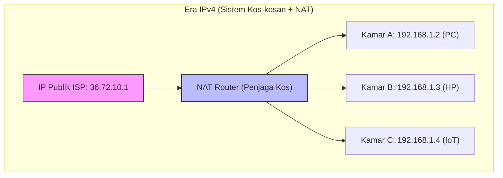
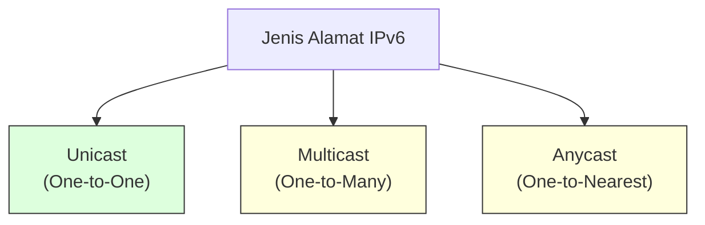
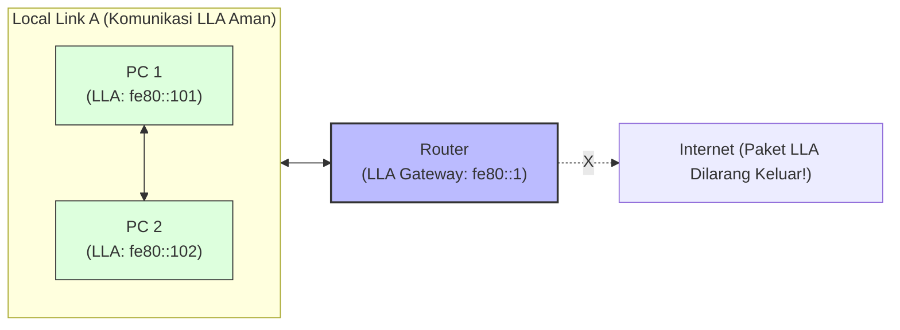
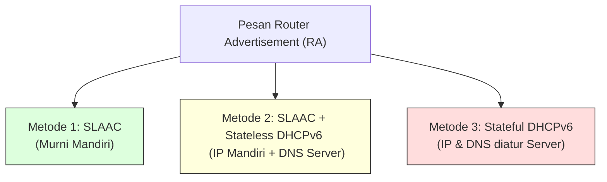
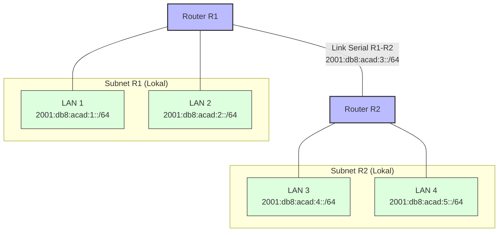

# IPv6 & IPv6 Subnetting Complete Guide: Cara Kerja, Pengalamatan, dan Desain Subnetting Tanpa Pusing (Week 9)

Halo! Ketemu lagi di materi **Jaringan Komputer Week 9**. Di materi-materi sebelumnya, kita udah tuntas ngebahas [[(Week 7) IPv4 Complete Guide|IPv4 Complete Guide (Week 7)]] dan [[(Week 8) IPv4 Subnetting Complete Guide|IPv4 Subnetting & VLSM Complete Guide (Week 8)]]. Kita udah liat betapa rumitnya manajemen alamat IPv4 demi menghemat ruang IP yang makin hari makin sekarat.

Nah, di materi kali ini, kita bakal berkenalan dengan sang penerus takhta: **IPv6**. Kita bakal bedah tuntas mulai dari konsep dasar kenapa kita butuh IPv6, aturan penulisan heksadesimalnya yang kelihatan panjang tapi sebisa mungkin kita permudah dengan aturan kompresi, pembagian jenis alamatnya (GUA & LLA), cara konfigurasi dinamis (SLAAC & DHCPv6), hingga melakukan **Subnetting IPv6** yang—kabar baiknya—jauh lebih manusiawi dan gampang dibanding IPv4!

Yuk, siapin cemilan dan mari kita bongkar!

---

## 1. Analogi Planet Megapolitan: Membangun Intuisi IPv6

Sebelum masuk ke detail teknis, mari kita bangun *mental model* dengan analogi dunia nyata.

Bayangkan **IPv4** itu seperti sebuah kota kecil di era 1980-an. Alamat rumahnya pendek dan gampang diingat (misal: Jalan Mawar No. 10). Namun seiring berjalannya waktu, terjadi ledakan penduduk (munculnya *smartphone*, laptop, IoT, Smart TV, AC pintar, dll.). Nomor rumah di kota tersebut habis! 

Untuk mengakalinya, kita memakai sistem **NAT (Network Address Translation)**—seperti menyekat satu rumah besar menjadi puluhan kamar kost. Orang luar hanya tahu alamat rumah kost utamanya (IP Publik), sedangkan kamar-kamar di dalam (IP Private) hanya diketahui secara lokal. Sistem ini ribet karena kurir paket (router internet) tidak bisa mengirim barang langsung ke pintu kamar kita tanpa bantuan penjaga kost (NAT Router).



Sekarang, bayangkan **IPv6** sebagai **Planet Megapolitan Masa Depan**. Ukurannya sangat raksasa dengan ruang yang hampir tanpa batas. Karena alamatnya memiliki panjang 128 bit, jumlah alamat unik yang tersedia adalah sekitar $2^{128} \approx 3.4 \times 10^{38}$ (340 Desiliun!). 

Angka ini sangat besar, lho. Bahkan jika setiap butir pasir di bumi atau setiap perangkat elektronik pintar yang diproduksi umat manusia dikasih IP address sendiri-sendiri, alamat IPv6 ini tidak akan habis. 

Hasilnya? Kita tidak butuh lagi sistem kos-kosan (NAT). Setiap perangkat pintar di rumah kita bisa langsung punya alamat "koordinat GPS global" sendiri yang unik secara internasional (IP Publik). Paket data bisa dikirim langsung dari ujung dunia ke ujung dunia tanpa perlu diterjemahkan lagi di tengah jalan (*End-to-End Connectivity*).

---

## 2. Pengantar IPv6: Kenapa Harus Pindah?

> [!info] **Definisi IPv6 (Internet Protocol Version 6)**
> **IPv6** adalah protokol layer network (Layer 3) yang dirancang oleh IETF (*Internet Engineering Task Force*) untuk menggantikan IPv4 yang telah kehabisan ruang alamat. IPv6 menggunakan sistem pengalamatan **128-bit** (dibandingkan IPv4 yang hanya 32-bit), memberikan ruang alamat yang jauh lebih besar serta peningkatan performa header dan keamanan bawaan.

Selain jumlah alamatnya yang super banyak, ada beberapa alasan krusial kenapa dunia kudu migrasi ke IPv6:
1. **Menghilangkan NAT:** Tanpa NAT, komunikasi menjadi lebih cepat, latensi berkurang, dan aplikasi *peer-to-peer* (seperti VoIP, online gaming, dan VPN) bisa berjalan lebih lancar tanpa kendala *port forwarding*.
2. **Header yang Lebih Efisien:** Header IPv6 dirancang dengan ukuran tetap (40 byte) dan field yang lebih sedikit. Router bisa memproses paket dengan lebih cepat karena tidak perlu menghitung ulang checksum di setiap lompatan (*hop*).
3. **Autokonfigurasi Bawaan (SLAAC):** Perangkat bisa mengonfigurasi alamat IP-nya sendiri secara otomatis segera setelah dicolokkan ke jaringan, tanpa perlu DHCP server!
4. **Keamanan Terintegrasi:** Protokol IPSec (IP Security) merupakan fitur opsional yang sangat didukung dan terintegrasi secara standar di IPv6 untuk enkripsi dan autentikasi paket.
5. **Tidak Ada Broadcast:** IPv6 menghilangkan lalu lintas *broadcast* yang sering bikin banjir jaringan lokal. Sebagai gantinya, IPv6 menggunakan **Multicast** dan **Anycast** yang jauh lebih terarah.

---

## 3. Aturan Main: Format Penulisan & Kompresi Alamat IPv6

Karena alamat IPv6 itu panjangnya 128 bit, menulisnya dalam biner (`0` dan `1`) atau desimal bertitik (seperti IPv4) bakal bikin mata pusing. Makanya, IPv6 ditulis dalam format **Heksadesimal (Hex)** yang dipisahkan oleh titik dua (`:`).

### A. Format Standar Alamat IPv6
Sebuah alamat IPv6 dibagi menjadi **8 bagian** yang disebut dengan **Hextet** (tiap hextet mewakili 16 bit atau 4 digit heksadesimal).
$$\text{Format:} \quad X:X:X:X:X:X:X:X$$
Di mana setiap $X$ adalah 4 digit heksadesimal (0-9, A-F). Contoh alamat IPv6 mentah:
`2001:0db8:acad:0000:0000:0000:0000:0001`

> [!important] **Kunci Konversi Heksadesimal ke Biner**
> Setiap 1 digit heksadesimal mewakili tepat **4 bit** biner (*nibble*).
> * $0 \text{ (Hex)} = 0000 \text{ (Biner)}$
> * $9 \text{ (Hex)} = 1001 \text{ (Biner)}$
> * $\text{A (Hex)} = 1010 \text{ (Biner)} \quad (10)$
> * $\text{F (Hex)} = 1111 \text{ (Biner)} \quad (15)$
> 
> Maka, 1 Hextet (4 digit Hex) $= 4 \times 4 \text{ bit} = \mathbf{16\text{ bit}}$.
> Dan total 8 Hextet $= 8 \times 16 \text{ bit} = \mathbf{128\text{ bit}}$.

---

### B. Dua Aturan Emas Kompresi IPv6
Alamat IPv6 yang panjangnya 32 karakter heksadesimal tentu melelahkan untuk ditulis. Untungnya, ada 2 aturan resmi untuk menyingkat penulisannya tanpa mengubah nilai asli alamat tersebut:

#### Aturan 1: Menghilangkan leading zeros (Nol di Depan Hextet)
Kita boleh membuang angka nol yang berada di bagian depan (kiri) dari setiap hextet. 
* `0db8` disingkat menjadi `db8`
   * `00ab` disingkat menjadi `ab`
   * `0009` disingkat menjadi `9`
   * `0000` disingkat menjadi `0`
* *Peringatan:* Aturan ini **TIDAK berlaku** untuk angka nol di belakang (kanan). Contoh: `20a0` tidak boleh disingkat menjadi `20a` karena akan mengubah nilainya.

#### Aturan 2: Menggunakan Double Colon (Titik Dua Ganda `::`)
Jika ada satu atau beberapa hextet berisi **nol semua (`0000`) yang berurutan**, kita bisa mengganti seluruh hextet nol tersebut dengan tanda titik dua ganda (`::`).
* `2001:db8:acad:0000:0000:0000:0000:0001` disingkat menjadi **`2001:db8:acad::1`**.
* *Aturan Mutlak:* Tanda `::` **hanya boleh digunakan SATU KALI saja** dalam satu alamat IPv6. Jika digunakan dua kali, router akan kebingungan (ambigu) menentukan jumlah hextet nol yang disembunyikan di masing-masing bagian.

---

> [!example] Worked Example: Kompresi & Dekompresi IPv6
> Biar lancar pas ujian, mari kita ceki-ceki contoh latihan kompresi dan dekompresi berikut:
> 
> **Kasus 1: Kompresi Alamat IPv6** 
> **Soal:** Singkatlah alamat `2001:0db8:0000:0000:000f:0000:0000:00ab`!
> * **Langkah 1 (Buang nol di depan):** 
>   `2001:db8:0:0:f:0:0:ab`
> * **Langkah 2 (Cari blok nol terpanjang untuk dijadikan `::` ):** 
>   Ada dua blok nol berurutan: Hextet 3-4 (panjang 2 hextet) dan Hextet 6-7 (panjang 2 hextet). Karena panjangnya sama, kita pilih salah satu saja (misal blok pertama) untuk diganti `::`. Sisa blok nol lainnya ditulis sebagai angka `0`.
> * **Hasil Akhir:** **`2001:db8::f:0:0:ab`** (atau `2001:db8:0:0:f::ab`).

**Kasus 2: Dekompresi (Mengembalikan Alamat ke Format Utuh 32 Digit)**
* **Soal:** Kembalikan alamat `fe80::260:3eff:fe11:67cf` ke bentuk aslinya!
* **Langkah 1 (Hitung hextet yang terlihat):**
  Hextet yang tampak: `fe80` (1), `260` (2), `3eff` (3), `fe11` (4), `67cf` (5). Total ada 5 hextet.
* **Langkah 2 (Cari jumlah hextet nol yang hilang):**
  Karena total hextet utuh harus berjumlah 8, maka hextet nol yang tersembunyi di balik `::` adalah $8 - 5 = \mathbf{3\text{ hextet}}$.
* **Langkah 3 (Masukkan kembali nol dan kembalikan 4 digit per hextet):**
  - Ganti `::` dengan 3 blok `0000:0000:0000` di posisi yang tepat.
  - Tambahkan kembali nol di depan pada hextet yang kurang dari 4 digit (`260` menjadi `0260`).
* **Hasil Akhir:** **`fe80:0000:0000:0000:0260:3eff:fe11:67cf`**.

---

## 4. Tiga Pilar Lalu Lintas IPv6: Unicast, Multicast, & Anycast

IPv6 mengelompokkan lalu lintas data ke dalam 3 jenis alamat transmisi:



1. **Unicast (One-to-One):** Digunakan untuk mengirim paket dari satu antarmuka perangkat (*interface*) ke satu antarmuka tujuan secara spesifik. Ini mirip seperti obrolan pribadi dua arah.
2. **Multicast (One-to-Many):** Digunakan untuk mengirimkan satu paket data ke sekelompok perangkat (*multicast group*) secara bersamaan. Sangat efisien untuk aplikasi streaming video atau pertukaran informasi tabel routing.
3. **Anycast (One-to-Nearest):** Alamat unicast yang dipasang pada beberapa perangkat yang berbeda (biasanya router server DNS global). Ketika paket dikirim ke alamat anycast, router jaringan akan meneruskannya ke perangkat **terdekat** berdasarkan metrik perutean (*routing table*).

> [!important] **Kabar Penting Ujian: Kemana Pergi Broadcast?**
> IPv6 **tidak mengenal istilah Broadcast Address**! Untuk fungsi broadcast (seperti mencari semua perangkat di jaringan lokal), IPv6 menggunakan alamat khusus **All-nodes Multicast Address (`ff02::1`)**. Hal ini menghemat resource CPU host lain karena kartu jaringan (NIC) bisa memfilter paket multicast secara hardware tanpa mengganggu prosesor utama.

---

## 5. Bedah Detail Alamat Unicast: GUA vs LLA

Setiap kartu jaringan (antarmuka) perangkat yang menjalankan IPv6 biasanya memiliki **lebih dari satu alamat IPv6**. Dua jenis alamat unicast yang paling krusial adalah **GUA** dan **LLA**.

### A. Global Unicast Address (GUA)
GUA adalah alamat IP publik di era IPv6. Alamat ini bersifat unik di seluruh dunia dan dapat dirutekan secara langsung di internet global (*globally routable*).

* **Rentang Prefix:** Saat ini, IANA hanya mendistribusikan GUA yang dimulai dengan prefix biner `001`, yang setara dengan rentang heksadesimal **`2000::/3`** (yaitu semua alamat yang dimulai dari hextet pertama **`2000`** sampai **`3fff`**).
* **Struktur Standar GUA (Prefix `/64`):**
  Untuk memudahkan pengelolaan, IETF menyarankan penggunaan prefix `/64` untuk subjaringan lokal. Strukturnya dibagi menjadi 3 bagian:

```text
|<-------------- 64 Bit Network Portion -------------->|<--- 64 Bit Host Portion --->|
[ 48-bit Global Routing Prefix ][ 16-bit Subnet ID ]   [    64-bit Interface ID     ]
```

1. **Global Routing Prefix (48 bit):** Bagian jaringan yang dialokasikan oleh ISP atau badan registry regional (seperti APNIC untuk wilayah Indonesia) kepada suatu organisasi.
2. **Subnet ID (16 bit):** Kolom khusus yang dialokasikan bagi administrator jaringan internal untuk mendesain cabang subjaringan (subnet).
3. **Interface ID (64 bit):** Setara dengan *Host ID* pada IPv4. Digunakan untuk mengidentifikasi fisik antarmuka perangkat secara unik pada subjaringan tersebut.

---

### B. Link-Local Address (LLA)
LLA adalah alamat IP khusus yang **wajib** dimiliki oleh setiap antarmuka perangkat IPv6. Alamat ini hanya berlaku secara lokal di dalam segmen kabel/subjaringan yang sama (*local-link*) dan **tidak bisa dirutekan** ke luar router.

* **Rentang Prefix:** LLA selalu menggunakan prefix **`fe80::/10`**. Ini artinya hextet pertama LLA akan selalu berkisar antara **`fe80`** hingga **`febf`** (dalam prakteknya, hampir selalu berupa `fe80::`).
* **Fungsi Utama LLA:**
   1. Menjadi pintu gerbang utama perangkat menuju internet (**Default Gateway**). PC akan mengarahkan paketnya ke LLA milik Router.
   2. Digunakan oleh protokol dinamis seperti routing protocol (OSPFv3, RIPng) untuk bertukar informasi tabel perutean antar router tetangga.
   3. Mengizinkan komunikasi antar perangkat dalam satu LAN terjalin secara instan meskipun jaringan tersebut tidak terhubung ke ISP atau tidak punya DHCP server.



---

## 6. Autokonfigurasi Dinamis: Cara Kerja SLAAC & DHCPv6

Untuk mendapatkan alamat IP secara otomatis (dinamis), perangkat IPv6 menggunakan protokol **ICMPv6** melalui pertukaran pesan **Router Solicitation (RS)** dan **Router Advertisement (RA)**.

1. **Router Solicitation (RS):** Dikirim oleh host ke alamat multicast *All-routers* (`ff02::2`) untuk memanggil router IPv6 terdekat agar segera mengirimkan informasi konfigurasi.
2. **Router Advertisement (RA):** Dikirim secara berkala atau sebagai balasan RS oleh router ke alamat multicast *All-nodes* (`ff02::1`). RA berisi informasi prefix global, panjang prefix, default gateway, dan metode autokonfigurasi yang harus dipakai host.

Ada 3 metode alokasi dinamis berdasarkan informasi di dalam pesan RA:



### 1. SLAAC (Stateless Address Autoconfiguration)
Host akan menggunakan informasi prefix `/64` yang ada di dalam RA untuk dijadikan porsi network-nya. Lalu, host secara **mandiri** membuat 64-bit Interface ID miliknya tanpa bantuan server DHCP. 

Bagaimana host membuat Interface ID-nya sendiri agar tidak bentrok? Ada dua cara:
* **Random Generation:** Sistem operasi modern (Windows, macOS) secara acak membuat angka 64-bit untuk menghindari pelacakan privasi.
* **Proses EUI-64 (Extended Unique Identifier 64):** Host memanfaatkan MAC Address kartu jaringannya yang sepanjang 48 bit untuk diubah menjadi 64 bit.

---

### > [!important] **Prosedur Konversi EUI-64 (Tips Soal Ujian)**
> Mengubah MAC Address 48 bit menjadi Interface ID 64 bit menggunakan metode EUI-64 dilakukan lewat 3 langkah berikut:
> 1. **Bagi MAC Address** menjadi dua bagian sama panjang di tengah (masing-masing 24 bit).
> 2. **Sisipkan nilai heksadesimal `fffe`** di tengah-tengah pecahan tersebut.
> 3. **Balik (flip) bit ke-7** (Universal/Local bit) pada oktet pertama MAC Address tersebut. Jika bit ke-7 bernilai `0` ubah jadi `1`, dan sebaliknya.
> 
> **Contoh Soal EUI-64:**
> Diketahui MAC Address perangkat: `fc:99:47:75:ce:e0`. Tentukan Interface ID EUI-64-nya!
> 
> * **Langkah 1 (Bagi dua & Sisipkan `fffe`):**
>   `fc:99:47` + `fffe` + `75:ce:e0` $\rightarrow$ `fc99:47ff:fe75:cee0`
> * **Langkah 2 (Fokus ke oktet pertama):**
>   Oktet pertama adalah `fc`. Ubah `fc` ke biner:
>   `f` $= 1111$
>   `c` $= 1100$
>   Biner dari `fc` $= 111111\mathbf{0}0$
>   *Ceki-ceki bit ke-7 dari kiri:* Nilainya adalah `0` (ditebalkan).
> * **Langkah 3 (Balik bit ke-7):**
>   Ubah bit ke-7 menjadi `1` $\rightarrow$ $111111\mathbf{1}0$.
>   Konversikan kembali biner $1111 1110$ ke heksadesimal $\rightarrow$ **`fe`**.
> * **Hasil Akhir:** Ganti `fc` dengan `fe` di alamat Langkah 1.
>   Interface ID EUI-64 $= \mathbf{fe99:47ff:fe75:cee0}$.

---

### 2. SLAAC and Stateless DHCPv6
Host membuat alamat IP dan default gateway sendiri menggunakan informasi prefix dari RA. Namun, host akan menghubungi server DHCPv6 secara *stateless* (tidak menyimpan log penyewaan IP) hanya untuk meminta informasi tambahan seperti alamat DNS Server dan nama domain.

### 3. Stateful DHCPv6
Mirip dengan DHCP pada IPv4. Host mengabaikan informasi prefix di dalam RA dan menyerahkan seluruh konfigurasi alamat IP (GUA), DNS Server, dan data lainnya kepada server DHCPv6 secara terpusat (*stateful*).

---

## 7. Konsep & Perhitungan Subnetting IPv6 (Satu Prefix `/64`)

Subnetting IPv6 dirancang dengan sangat indah dan sederhana. Jika pada IPv4 kita harus pusing meminjam bit eceran dari area host (membuat prefix aneh-aneh seperti `/26`, `/27`, `/29`), pada IPv6 kita hampir selalu memecah jaringan di batas **Subnet ID** yang berukuran **16 bit**, menghasilkan prefix standar **`/64`**.

### Kenapa harus `/64`?
IETF menyarankan subjaringan LAN lokal selalu memakai prefix `/64` karena proses autokonfigurasi dinamis (SLAAC) memerlukan Interface ID sepanjang tepat 64 bit. Jika kita memotong subnet menjadi lebih kecil (misal `/80` atau `/120`), fitur SLAAC pada perangkat client tidak akan berfungsi!

---

### Rumus Matematika Subnetting IPv6
Mari kita bongkar perhitungan matematika subnetting standar jika kita mendapatkan alokasi **`2001:db8:acad::/48`** dari ISP:

* **Bit Subnet ID yang Tersedia ($n$):**
  $$\text{Bit Subnet ID} = \text{Target Prefix} - \text{Prefix Awal} = 64 - 48 = \mathbf{16\text{ bit}}$$
* **Jumlah Subnet Baru yang Terbentuk:**
  $$\text{Jumlah Subnet} = 2^n = 2^{16} = \mathbf{65.536\text{ Subnet}}$$
* **Jumlah Host Valid per Subnet:**
  Jumlah bit host sisa (Interface ID) $= 128 - 64 = 64$ bit.
  $$\text{Jumlah Host} = 2^{64} = \mathbf{18.446.744.073.709.551.616\text{ alamat IP}}$$

---

### Increment Heksadesimal pada Subnet ID
Karena kolom Subnet ID berada pada **hextet keempat** dari alamat IPv6 (`2001:db8:acad:[Subnet ID]::/64`), kita cukup melakukan *increment* heksadesimal dari nilai `0000` hingga `ffff`.

| Nomor Subnet | Subnet ID (Hex) | Alamat Prefix Subnet /64 |
| :---: | :---: | :--- |
| Subnet 1 | `0000` | `2001:db8:acad:0000::/64` $\rightarrow$ `2001:db8:acad::/64` |
| Subnet 2 | `0001` | `2001:db8:acad:0001::/64` $\rightarrow$ `2001:db8:acad:1::/64` |
| Subnet 3 | `0002` | `2001:db8:acad:0002::/64` $\rightarrow$ `2001:db8:acad:2::/64` |
| Subnet 4 | `0003` | `2001:db8:acad:0003::/64` $\rightarrow$ `2001:db8:acad:3::/64` |
| ... | ... | ... |
| Subnet 65536 | `ffff` | `2001:db8:acad:ffff::/64` |

Sangat praktis! Kita hanya perlu menghitung maju heksadesimal pada hextet keempat tanpa coret-coret biner sama sekali.

---

## 8. Studi Kasus: Alokasi Subnet di Topologi Jaringan UNS

Mari kita bedah secara mendalam studi kasus alokasi alamat IPv6 berdasarkan silabus perkuliahan.

**Skenario:**
Sebuah jaringan kampus memiliki topologi yang membutuhkan **5 buah subnet**:
* 4 subnet dialokasikan untuk segmen LAN lokal.
* 1 subnet dialokasikan untuk *serial link* (koneksi point-to-point antar Router R1 dan R2).
* Alokasi IP utama dari ISP: **`2001:db8:acad::/48`**.

### A. Desain Alokasi Subnet
Administrator jaringan memilih untuk membagi blok tersebut ke dalam prefix `/64` secara berurutan menggunakan Subnet ID `0001` hingga `0005`:

1. **LAN 1 (R1 Interface G0/0/0):** `2001:db8:acad:1::/64`
2. **LAN 2 (R1 Interface G0/0/1):** `2001:db8:acad:2::/64`
3. **Link Serial (Antar R1-R2 S0/1/0):** `2001:db8:acad:3::/64`
4. **LAN 3 (R2 Interface G0/0/0):** `2001:db8:acad:4::/64`
5. **LAN 4 (R2 Interface G0/0/1):** `2001:db8:acad:5::/64`

### B. Visualisasi Topologi Jaringan
Berikut visualisasi hubungan antar router dan alokasi subjaringannya:



---

### C. Rincian IP Host Valid dalam Subnet
Mari kita kupas tuntas rentang IP address yang bisa dipasang pada host di **Subnet LAN 1 (`2001:db8:acad:1::/64`)**:

* **IPv6 Network Address:** `2001:db8:acad:1::/64`
* **Subnet Router Anycast Address:** `2001:db8:acad:1::` (IP pertama dengan Interface ID berisi bit `0` semua. IP ini dicadangkan untuk router, sebaiknya tidak dipasang di PC client).
* **IP Valid Pertama (First Host IP):** `2001:db8:acad:1::1` (Biasanya dipasang sebagai IP interface gateway Router).
* **IP Valid Kedua:** `2001:db8:acad:1::2`
* **IP Valid Ketiga:** `2001:db8:acad:1::3`
* ...
* **IP Valid Terakhir (Last Host IP):** `2001:db8:acad:1:ffff:ffff:ffff:ffff`

> [!tip] **Beda Aturan Broadcast IPv6 vs IPv4**
> Berbeda dengan IPv4 di mana IP terakhir (Broadcast ID) dan IP pertama (Network ID) dilarang keras dipasang pada perangkat, pada IPv6 **tidak ada Broadcast Address**. IP terakhir (`ffff:ffff:ffff:ffff`) secara teoretis valid dan aman untuk dipasang pada perangkat client, meskipun demi kerapian administrasi kita biasanya menggunakan angka urut kecil (`::1`, `::2`, dst.) atau IP hasil autokonfigurasi acak.

---

## 9. Konfigurasi Router Cisco IOS pada Subnet IPv6

Setelah mendesain alokasi subnet, mari kita terapkan konfigurasi CLI (*Command Line Interface*) pada Cisco Router untuk mengaktifkan perutean IPv6 dan memasang IP address ke masing-masing interface.

### A. Aktifkan Routing IPv6 Global
Sebelum mengonfigurasi IP pada interface, kita **wajib** menjalankan perintah berikut di mode konfigurasi global:
```bash
Router(config)# ipv6 unicast-routing
```
> [!warning] **Bahaya Mengabaikan `ipv6 unicast-routing`!**
> Jika kamu lupa mengetikkan perintah `ipv6 unicast-routing`, Cisco Router hanya akan berfungsi seperti perangkat host biasa. Router tetap bisa dipasangi IP, tapi **tidak akan mau meneruskan paket data antar interface** dan tidak akan mengirimkan ICMPv6 Router Advertisement (RA) ke client LAN!

---

### B. Skrip Konfigurasi Interface Router R1
Berikut adalah konfigurasi lengkap untuk antarmuka LAN dan Serial pada Router R1:

```bash
! ==========================================
! KONFIGURASI INTERFACE ROUTER R1
! ==========================================

! 1. Konfigurasi Interface LAN 1
R1(config)# interface gigabitethernet 0/0/0
R1(config-if)# description Gateway LAN 1 (Dosen & Staff)
R1(config-if)# ipv6 address 2001:db8:acad:1::1/64
R1(config-if)# ipv6 address fe80::1 link-local
R1(config-if)# no shutdown
R1(config-if)# exit

! 2. Konfigurasi Interface LAN 2
R1(config)# interface gigabitethernet 0/0/1
R1(config-if)# description Gateway LAN 2 (Mahasiswa UNS)
R1(config-if)# ipv6 address 2001:db8:acad:2::1/64
R1(config-if)# ipv6 address fe80::1 link-local
R1(config-if)# no shutdown
R1(config-if)# exit

! 3. Konfigurasi Interface Serial 0/1/0 (Point-to-Point ke R2)
R1(config)# interface serial 0/1/0
R1(config-if)# description Link Serial ke Router R2
R1(config-if)# ipv6 address 2001:db8:acad:3::1/64
R1(config-if)# ipv6 address fe80::1 link-local
R1(config-if)# no shutdown
R1(config-if)# exit
```

---

### C. Skrip Konfigurasi Interface Router R2
Berikut konfigurasi tandingannya pada Router R2:

```bash
! ==========================================
! KONFIGURASI INTERFACE ROUTER R2
! ==========================================

! 1. Konfigurasi Interface LAN 3
R2(config)# interface gigabitethernet 0/0/0
R2(config-if)# description Gateway LAN 3 (Lab Komputer)
R2(config-if)# ipv6 address 2001:db8:acad:4::1/64
R2(config-if)# ipv6 address fe80::2 link-local
R2(config-if)# no shutdown
R2(config-if)# exit

! 2. Konfigurasi Interface LAN 4
R2(config)# interface gigabitethernet 0/0/1
R2(config-if)# description Gateway LAN 4 (Server Internal)
R2(config-if)# ipv6 address 2001:db8:acad:5::1/64
R2(config-if)# ipv6 address fe80::2 link-local
R2(config-if)# no shutdown
R2(config-if)# exit

! 3. Konfigurasi Interface Serial 0/1/0 (Point-to-Point ke R1)
R2(config)# interface serial 0/1/0
R2(config-if)# description Link Serial ke Router R1
R2(config-if)# ipv6 address 2001:db8:acad:3::2/64
R2(config-if)# ipv6 address fe80::2 link-local
R2(config-if)# no shutdown
R2(config-if)# exit
```

> [!tip] **Trik Pro Dunia Nyata: Konfigurasi LLA Manual**
> Perhatikan perintah `ipv6 address fe80::1 link-local` di atas. Secara bawaan, Cisco Router akan membuat LLA secara otomatis memakai proses EUI-64 (sehingga menghasilkan IP LLA yang panjang dan susah dibaca seperti `fe80::260:3eff:fe11:67cf`).
> 
> Dengan memaksa LLA di-set secara manual menjadi `fe80::1` (pada R1) dan `fe80::2` (pada R2), kita akan sangat dimudahkan dalam melakukan troubleshooting jaringan. Klien di LAN 1 & 2 cukup menghapal default gateway mereka adalah `fe80::1`.

---

### D. Perintah Verifikasi Jaringan IPv6
Untuk memastikan konfigurasi kita sudah berjalan dengan benar, gunakan perintah verifikasi berikut di mode EXEC Router (`#`):
* `show ipv6 interface brief` : Melihat status UP/DOWN interface beserta alamat GUA dan LLA yang terpasang.
* `show ipv6 route` : Melihat tabel perutean IPv6 untuk memastikan semua subnet lokal dan link serial sudah terdaftar di dalam sistem routing.

---


---

## Cheat-Sheet Cepat Ujian IPv6 & Subnetting

* **Panjang Bit:** IPv6 $= 128$ bit ($16$ byte). Ditulis dalam 8 hextet heksadesimal.
* **Aturan Double Colon (`::`):** Hanya boleh muncul **1 kali** dalam satu alamat IP.
* **Prefix GUA:** Mulai dari `2000::/3` (digit hex pertama antara `2` s.d. `3`).
* **Prefix LLA:** Mulai dari `fe80::/10` (digit hex pertama `fe80` s.d. `febf`).
* **All-Nodes Multicast (`ff02::1`):** Pengganti fungsi *broadcast* di IPv4.
* **All-Routers Multicast (`ff02::2`):** Digunakan host untuk mengirim pesan Router Solicitation (RS).
* **Command Routing IPv6:** `ipv6 unicast-routing` (harus diketik pertama kali!).
* **Standard LAN Subnet Prefix:** Selalu gunakan **`/64`** agar fungsi autokonfigurasi SLAAC tidak rusak.
* **SLAAC EUI-64:** Bagi MAC address di tengah, sisipkan `fffe`, lalu balik bit ke-7 pada oktet pertama.

Semoga panduan lengkap ini mempermudah kamu memahami materi IPv6 dan Subnetting untuk persiapan ujian Jaringan Komputer, ya! Selamat belajar dan sukses selalu! 🚀
