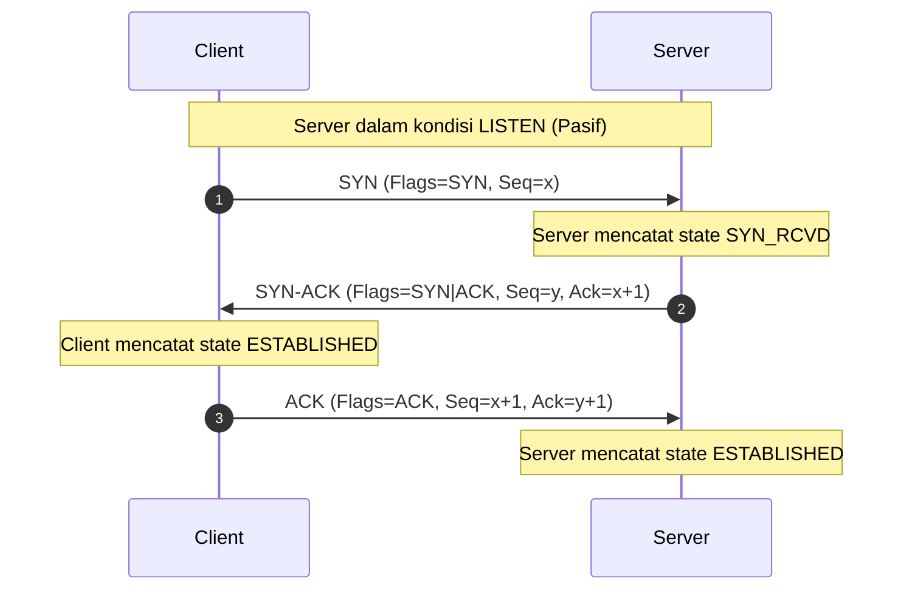
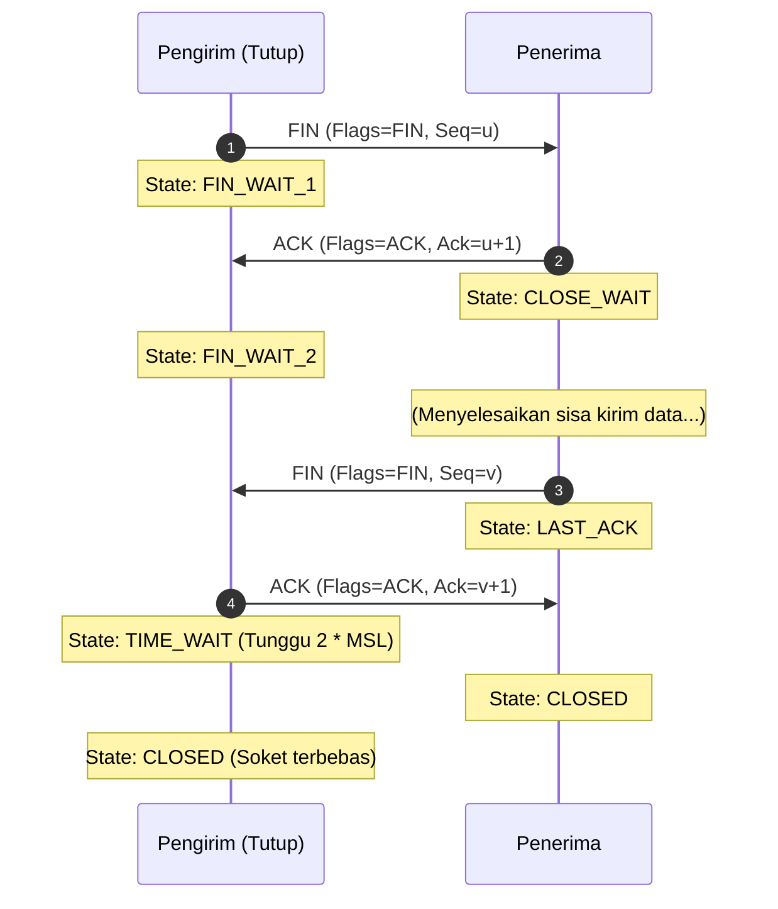

# Computer Network Master Cheatsheet: Kelolosan Ujian Jarkom (Week 7 - Week 14)

Halo! Ini adalah **Master Cheatsheet** yang dirancang khusus buat kamu yang pengen me-review seluruh materi kuliah Jaringan Komputer (Week 7 s.d. Week 14) dalam waktu singkat. Catatan ini super padat, penuh tabel perbandingan, diagram alur, dan trik cepat coret-coretan ujian.

> [!tip] **Cara Terbaik Pakai Cheatsheet Ini:**
> Gunakan dokumen ini sebagai referensi cepat saat mengerjakan soal latihan. Jika butuh penjelasan konsep yang lebih mendalam dari dasar, kamu bisa langsung klik internal *wikilinks* yang mengarah ke masing-masing panduan lengkap mingguan.

---

## 📅 Peta Materi & Navigasi Cepat

* **Layer 3 (Network Layer):**
  * [[(Week 7) IPv4 Complete Guide|Week 7: IPv4 Address & Struktur Header]]
  * [[(Week 8) IPv4 Subnetting Complete Guide|Week 8: Subnetting Tradisional & VLSM]]
  * [[(Week 9a) IPv6 Complete Guide|Week 9a: IPv6 Format & Konfigurasi Dinamis]]
  * [[(Week 9b) IPv6 Subnetting Complete Guide|Week 9b: IPv6 Subnetting & Topologi]]
  * [[(Week 10) ICMP Complete Guide|Week 10: ICMP Protocol & Diagnostik]]
* **Layer 4 (Transport Layer):**
  * [[(Week 11) Transport Layer Complete Guide|Week 11: TCP vs UDP, Handshake, Congestion Control]]
  * [[(Week 11) Transport Layer Practice|Week 11: Soal Latihan & Pembahasan Komprehensif]]
* **Application & Socket (Layer 5-7):**
  * [[(Week 12) Network Programming Complete Guide|Week 12: Socket Programming TCP/UDP Python]]
  * [[(Week 13) Application Presentation Session Layer Complete Guide|Week 13: DNS, DHCP, HTTP/HTTPS, Email Protocols]]
* **Network Security:**
  * [[(Week 14) Network Security Complete Guide|Week 14: Ancaman, AAA Framework, RADIUS vs TACACS+, Firewall]]

---

## 🛠️ Week 7 & 8: IPv4 Addressing, Subnetting & VLSM

### A. Struktur Alamat & Aturan Dasar
* **Panjang Alamat:** 32-bit (4 Oktet, dipisahkan titik). Contoh: `192.168.10.1`.
* **Network Portion vs. Host Portion:** Batas ditentukan oleh **Subnet Mask** (bit `1` = Network, bit `0` = Host).
* **Operasi ANDing:** Komputer melakukan bitwise AND antara IP dan Mask untuk mendapatkan **Network Address**.

> [!important] **3 Jenis Alamat dalam Satu Subnet**
> 1. **Network Address:** Bit host bernilai `0` semua. (Tidak bisa dipasang ke perangkat).
> 2. **Broadcast Address:** Bit host bernilai `1` semua. (Digunakan untuk kirim ke semua host).
> 3. **Host Address (Valid):** Rentang IP di antara Network dan Broadcast.
>    $$\text{Jumlah Host Valid} = 2^{(32 - \text{Prefix Length})} - 2$$
>    *(Dikurangi 2 karena Network ID dan Broadcast ID bersifat reserved).*

### B. Blok Private IP (RFC 1918)
IP Private tidak boleh dirutekan di internet global (dibuang oleh router ISP):
* **Kelas A:** `10.0.0.0` s.d. `10.255.255.255` (`10.0.0.0/8`)
* **Kelas B:** `172.16.0.0` s.d. `172.31.255.255` (`172.16.0.0/12`)
* **Kelas C:** `192.168.0.0` s.d. `192.168.255.255` (`192.168.0.0/16`)
* **IP Spesial:**
  * **Loopback:** `127.0.0.1` (localhost - tes TCP/IP internal).
  * **APIPA/Link-Local:** `169.254.0.0/16` (jika gagal dapat IP dari DHCP server).

### C. Trik Cepat Ujian: Magic Number Method
Untuk menghitung parameter subnetting dalam hitungan detik tanpa konversi biner penuh:

> [!tip] **Rumus Magic Number**
> $$\text{Magic Number} = 256 - \text{Mask Oktet Kritis}$$
> *(Oktet kritis adalah oktet terakhir yang bernilai bukan 255 atau 0).*

* **Contoh Kasus:** Diberikan IP `192.168.10.150/26`.
  1. Prefix `/26` artinya mask-nya `255.255.255.192` (oktet 4 kritis).
  2. $\text{Magic Number} = 256 - 192 = \mathbf{64}$.
  3. Kelipatan Network ID (kelipatan 64): `0`, `64`, `128`, `192`.
  4. IP kita (`150`) berada di antara **128** dan **192**.
  5. Parameter yang didapat:
     - **Network ID:** `192.168.10.128`
     - **First Host:** `192.168.10.129`
     - **Last Host:** `192.168.10.190`
     - **Broadcast ID:** `192.168.10.191` (Network berikutnya `192` dikurangi 1).

### D. Algoritma VLSM (Variable Length Subnet Mask)
1. **Urutkan kebutuhan host** dari yang **paling besar ke paling kecil** (Wajib!).
2. Alokasikan block subnet pertama pada IP dasar jaringan menggunakan prefix yang pas.
3. IP setelah broadcast subnet pertama menjadi IP Network dasar untuk subnet berikutnya.
4. Ulangi proses hingga semua segmen terpenuhi.

---

## 🌐 Week 9a & 9b: IPv6 & Subnetting

### A. Perbandingan Dasar IPv4 vs IPv6
| Parameter | IPv4 | IPv6 |
| :--- | :--- | :--- |
| **Panjang Bit** | 32 bit (4 Byte) | 128 bit (16 Byte) |
| **Sistem Bilangan** | Desimal dipisah titik (`.`) | Heksadesimal dipisah titik dua (`:`) |
| **NAT** | Wajib (karena IP terbatas) | Tidak butuh (kembali ke *End-to-End*) |
| **Broadcast** | Ada | **Dihapus!** (Diganti oleh Multicast) |
| **Header** | Ukuran variabel (20-60 Byte) | Ukuran tetap (40 Byte) - Lebih efisien |

### B. Aturan Emas Kompresi IPv6
1. **Hapus Leading Zeros:** Nol di depan hextet boleh dibuang. (`0db8` $\rightarrow$ `db8`).
2. **Double Colon (`::`):** Blok nol berurutan (`0000:0000`) boleh diganti `::` **hanya sekali** per alamat IP.
   * *Contoh:* `2001:0db8:0000:0000:0008:0000:0000:0001` $\rightarrow$ `2001:db8::8:0:0:1` (blok nol pertama dikompres).

### C. Pembagian Jenis Alamat Unicast
* **Global Unicast Address (GUA):** IP Publik global. Dimulai dengan prefix **`2000::/3`** (hextet pertama diawali digit `2` atau `3`).
* **Link-Local Address (LLA):** IP lokal segmen kabel, wajib di setiap interface, digunakan sebagai Default Gateway. Dimulai dengan prefix **`fe80::/10`**.

### D. Prosedur Konversi EUI-64
Digunakan oleh host untuk membuat Interface ID 64-bit sendiri dari MAC Address 48-bit:
1. **Belah MAC Address** di tengah menjadi 24-bit kiri dan 24-bit kanan.
2. **Sisipkan `fffe`** tepat di tengah pembelahan tersebut.
3. **Balik bit ke-7** pada oktet pertama MAC Address (U/L bit).

> [!example] **Contoh Hitung EUI-64**
> MAC: `00:90:27:17:FC:0F`
> 1. Belah & sisipkan: `0090:27FF:FE17:FC0F`
> 2. Oktet pertama `00` (biner: `00000000`). Balik bit ke-7 (dari kiri) menjadi `1` $\rightarrow$ `00000010` (hex: `02`).
> 3. Hasil Interface ID: `0290:27ff:fe17:fc0f`.

### E. Solicited-Node Multicast Address
Menggantikan fungsi ARP di IPv4 untuk mencari MAC Address tetangga.
* **Rumus:** Tempelkan **6 digit heksadesimal terakhir** dari IP Unicast target ke belakang prefix permanen **`ff02::1:ff00:0/104`**.
* *Contoh:* IP `2001:db8::a1b2:c3d4` $\rightarrow$ Solicited-Node Multicast: **`ff02::1:ffb2:c3d4`**.

### F. Cara Kerja Autokonfigurasi Dinamis (ICMPv6 RS/RA)
1. **RS (Router Solicitation - Tipe 133):** Host memanggil router lewat multicast `ff02::2` (All-routers).
2. **RA (Router Advertisement - Tipe 134):** Router mengumumkan prefix jaringan ke multicast `ff02::1` (All-nodes).
   - **Metode 1: SLAAC** (Murni mandiri, host buat IP sendiri dari prefix RA).
   - **Metode 2: SLAAC + Stateless DHCPv6** (IP dari SLAAC, DNS dari DHCPv6).
   - **Metode 3: Stateful DHCPv6** (IP & DNS sepenuhnya dikelola DHCPv6 Server).

### G. Subnetting IPv6
Subnetting IPv6 sangat mudah karena dipotong tepat pada batas **Subnet ID (16 bit)** di hextet ke-4 untuk menghasilkan prefix standar **`/64`**.
* **Alokasi ISP:** `2001:db8:acad::/48`.
* **Subnetting (increment hextet 4):**
  - Subnet 1: `2001:db8:acad:0000::/64` $\rightarrow$ `2001:db8:acad::/64`
  - Subnet 2: `2001:db8:acad:0001::/64` $\rightarrow$ `2001:db8:acad:1::/64`
  - Subnet 3: `2001:db8:acad:0002::/64` $\rightarrow$ `2001:db8:acad:2::/64`

---

## 📡 Week 10: ICMP & Jaringan Diagnostik

### A. Enkapsulasi & Header ICMP
* ICMP bekerja di **Layer 3**, tetapi datanya dibungkus di dalam payload paket IP.
* **Header Dasar (8 Byte):**
  - **Type (1 Byte):** Jenis kategori pesan.
  - **Code (1 Byte):** Detail spesifik penyebab error.
  - **Checksum (2 Byte):** Deteksi error header.

### B. Klasifikasi Pesan Kritis
1. **Error Reporting Messages:**
   - `Type 3` (IPv4) / `Type 1` (IPv6): **Destination Unreachable** (Tujuan tidak dapat dicapai).
     - *Code 0:* Net Unreachable (Rute jalan tidak ada).
     - *Code 1:* Host Unreachable (PC target mati/tidak terhubung).
     - *Code 3:* Port Unreachable (Aplikasi di target tidak aktif - khas UDP).
   - `Type 11` (IPv4/v6): **Time Exceeded** (TTL habis di perjalanan, mencegah paket berputar selamanya / *routing loop*).
2. **Query / Informational Messages:**
   - `Type 8` / `Type 128`: **Echo Request** (Ping kirim).
   - `Type 0` / `Type 129`: **Echo Reply** (Ping balas).

### C. Path MTU Discovery (PMTUD)
Mekanisme mencari ukuran paket terbesar (MTU) tanpa fragmentasi sepanjang jalur router:
1. Host mengirim paket IP dengan bit **DF (Don't Fragment) = 1**.
2. Jika ada router yang memiliki link MTU lebih kecil dari paket tersebut, router membuang paket dan membalas dengan **ICMP Type 3 Code 4 (Fragmentation Needed and DF Set)** sambil menyertakan ukuran MTU jalurnya.
3. Host mengecilkan ukuran paket dan mencoba lagi hingga sampai ke tujuan.

### D. ICMPv6 Neighbor Discovery Protocol (NDP)
Menggantikan ARP dan Router Discovery di IPv6:
* **RS & RA (Router Solicitation & Advertisement):** Untuk konfigurasi IP otomatis dan penemuan default gateway.
* **NS (Neighbor Solicitation - Tipe 135):** Meminta MAC Address target (dikirim ke Solicited-Node Multicast).
* **NA (Neighbor Advertisement - Tipe 136):** Membalas dengan MAC Address target (unicast).
* **DAD (Duplicate Address Detection):** Mengirimkan NS ke IP-nya sendiri untuk memastikan tidak ada orang lain yang memakai IP yang sama sebelum ia mengaktifkannya.

### E. Cara Kerja Ping & Traceroute
* **Ping:** Mengirim ICMP Echo Request (`Type 8`) dan menunggu Echo Reply (`Type 0`). Mengukur RTT (*Round Trip Time*).
* **Traceroute:**
  1. Mengirim paket dengan **TTL = 1**. Router pertama mengurangi TTL menjadi 0, membuang paket, dan membalas dengan **ICMP Time Exceeded (`Type 11`)**. Host mencatat IP router tersebut.
  2. Mengirim paket berikutnya dengan **TTL = 2**, mencatat router kedua, dan seterusnya hingga sampai tujuan.
  - *Perbedaan:* Windows (`tracert`) menggunakan ICMP Echo Request, sedangkan Linux/Unix (`traceroute`) default menggunakan paket UDP port tinggi (33434+).

---

## 🤝 Week 11: Transport Layer (TCP vs UDP)

### A. Tabel Perbandingan Karakteristik Utama
| Fitur | TCP (Transmission Control Protocol) | UDP (User Datagram Protocol) |
| :--- | :--- | :--- |
| **Sifat Hubungan** | Connection-Oriented (butuh *handshake*) | Connectionless (kirim langsung) |
| **Keandalan** | Reliable (ada konfirmasi penerimaan / ACK) | Unreliable (Best effort, bisa hilang/acak) |
| **Flow & Congestion** | Ada (Mengatur kecepatan kirim) | Tidak ada (Kirim secepat mungkin) |
| **Header Size** | Minimal 20 Byte | Tetap 8 Byte |
| **Contoh Aplikasi** | HTTP, HTTPS, SSH, FTP, SMTP | DNS, DHCP, VoIP, Game Online, TFTP |

### B. Header Format
* **UDP Header (8 Byte):** Source Port (2B), Destination Port (2B), Length (2B), Checksum (2B).
* **TCP Header (Min 20 Byte):** Source/Dst Port, Sequence Number (32-bit), Acknowledgment Number (32-bit), Header Length (Data Offset), Flags (SYN, ACK, FIN, RST, PSH, URG), Window Size (Flow Control), Checksum.

### C. Siklus Hidup Koneksi TCP (State Machine)
#### 1. Pembuatan Koneksi (Three-Way Handshake)
Membuka sesi komunikasi dan menyinkronkan Initial Sequence Number (ISN).



#### 2. Pemutusan Koneksi (Four-Way Handshake)
Menutup sesi komunikasi secara bersih dari kedua arah (full-duplex).



> [!important] **Kenapa ada state TIME_WAIT?**
> State `TIME_WAIT` (berdurasi 2 MSL - *Maximum Segment Lifetime*) wajib dijalankan oleh pihak yang melakukan penutupan aktif agar:
> 1. Menjamin ACK terakhir benar-benar sampai ke pihak pasif (jika ACK hilang, pihak pasif akan mengirim ulang FIN, dan pihak aktif bisa mengirim ulang ACK).
> 2. Mencegah paket lama yang tersesat di internet masuk kembali ke koneksi baru dengan alamat port yang sama.

### D. Mekanisme Retransmission (Keandalan TCP)
1. **RTO (Retransmission Timeout):** Jika pengirim tidak menerima ACK untuk suatu paket hingga waktu RTO habis, paket akan dikirim ulang. RTO dihitung secara dinamis dari RTT (*Round Trip Time*).
2. **Fast Retransmit:** Jika pengirim menerima **3 buah Duplicate ACK** (ACK dengan nomor yang sama berturut-turut), pengirim tahu bahwa ada paket hilang di tengah jalan tanpa harus menunggu timer RTO habis, dan langsung mengirim ulang paket tersebut.

### E. Flow Control & Congestion Control
* **Flow Control (Sliding Window):** Melindungi memori buffer penerima agar tidak luber. Penerima mengumumkan kapasitas kosong buffernya lewat field **Window Size** di header TCP. Pengirim tidak boleh mengirim data melebihi ukuran Window Size tersebut.
* **Congestion Control:** Melindungi jaringan internet agar tidak macet total (*congestion collapse*). Menggunakan variabel **Congestion Window (cwnd)**:
  - **Slow Start:** cwnd dimulai dari 1 MSS (Maximum Segment Size) dan naik secara **eksponensial** ($1 \rightarrow 2 \rightarrow 4 \rightarrow 8$) setiap menerima ACK, hingga menyentuh nilai ambang batas **ssthresh**.
  - **Congestion Avoidance:** Setelah melewati ssthresh, kenaikan cwnd berubah menjadi **linear** ($+1$ MSS setiap RTT) untuk berhati-hati.
  - **Fast Recovery (TCP Reno):** Jika terjadi kehilangan data yang dideteksi lewat 3 Duplicate ACK, ssthresh diturunkan menjadi setengah cwnd saat itu, cwnd diset sama dengan ssthresh baru $+ 3$ MSS, lalu langsung masuk ke fase Congestion Avoidance tanpa mengulang dari Slow Start.

---

## 💻 Week 12: Pemrograman Jaringan (Socket API)

### A. Alur Siklus Hidup Socket TCP vs UDP
```text
TCP Server API Flow:
socket() -> bind() -> listen() -> accept() [Block] -> send()/recv() -> close()
                                     | (Membuka port komunikasi baru khusus klien)
TCP Client API Flow:                 v
socket() -------------------------> connect() -> send()/recv() -> close()

UDP Server API Flow:
socket() -> bind() -> recvfrom() [Block] -> sendto() -> close()

UDP Client API Flow:
socket() -----------> sendto() -----------> recvfrom() -> close()
```

### B. Rangkuman Fungsi Soket Python (`import socket`)
* `socket.socket(family, type)`: Membuat objek soket.
  - `family=socket.AF_INET` (IPv4) atau `socket.AF_INET6` (IPv6).
  - `type=socket.SOCK_STREAM` (TCP) atau `socket.SOCK_DGRAM` (UDP).
* `bind((IP, Port))`: Mengikat soket ke alamat IP dan nomor Port lokal (khusus server).
* `listen(backlog)`: Mengaktifkan mode pendengaran koneksi masuk TCP.
* `accept()`: Menunggu koneksi TCP masuk. Menghasilkan tuple `(conn_socket, client_address)`. Fungsi ini bersifat *blocking*.
* `connect((IP, Port))`: Menghubungkan client TCP ke server (memulai 3-way handshake).
* `send(bytes)` / `recv(bufsize)`: Mengirim/menerima data pada soket TCP.
* `sendto(bytes, (IP, Port))` / `recvfrom(bufsize)`: Mengirim/menerima data pada soket UDP. `recvfrom` mengembalikan tuple `(data, sender_address)`.
* `close()`: Menutup dan membebaskan resource soket.

### C. Tips Praktis & Penanganan Error Ujian
1. **Error `Address already in use`:** Terjadi karena socket server lama dimatikan mendadak dan port-nya masih tertahan di kernel OS dalam state `TIME_WAIT`.
   * *Solusi:* Set opsi soket reuse address sebelum bind:
     ```python
     s = socket.socket(socket.AF_INET, socket.SOCK_STREAM)
     s.setsockopt(socket.SOL_SOCKET, socket.SO_REUSEADDR, 1) # Solusi jitu!
     s.bind(('localhost', 8080))
     ```
2. **String vs. Bytes (Python 3):** Data jaringan wajib dikirim dalam bentuk mentah biner (`bytes`).
   * *Sebelum dikirim:* Panggil `.encode('utf-8')` pada string.
   * *Setelah diterima:* Panggil `.decode('utf-8')` pada objek bytes untuk diubah kembali ke string.

---

## 🍽️ Week 13: Application, Presentation, & Session Layer (OSI 5-7)

### A. Peran Tiga Layer OSI Teratas
* **Session Layer (Layer 5):** Mengelola dialog dan sesi komunikasi.
  - *Fitur Kunci:* **Checkpoint & Synchronization** (menyisipkan penanda berkala saat transfer file besar agar jika koneksi putus, pengiriman bisa dilanjutkan dari checkpoint terakhir tanpa mengulang dari awal).
* **Presentation Layer (Layer 6):** Menerjemahkan format representasi data agar dipahami kedua belah pihak.
  - *Fungsi Kunci:* **Serialisasi** (JSON/XML), **Enkripsi** (SSL/TLS), dan **Kompresi** (Lossy/Lossless).
* **Application Layer (Layer 7):** Menyediakan antarmuka protokol langsung untuk aplikasi pengguna. (Contoh: HTTP untuk web browser, SMTP untuk aplikasi email).

### B. Deep-Dive DNS (Domain Name System - Port 53 UDP/TCP)
DNS menerjemahkan nama domain (seperti `uns.ac.id`) menjadi IP Address.
* **Mekanisme Query:**
  - **Recursive Query:** Client meminta jawaban mutlak ke Local Resolver DNS. Resolver harus mencarikan jawabannya sampai dapat (atau return error jika domain memang tidak ada).
  - **Iterative Query:** Resolver menghubungi server DNS bertahap (Root DNS $\rightarrow$ TLD DNS $\rightarrow$ Authoritative DNS) untuk meminta rujukan alamat server DNS berikutnya jika ia belum tahu jawabannya.
* **Tipe Resource Records (RR) DNS Kritis:**
  - **A:** Memetakan domain ke IPv4.
  - **AAAA:** Memetakan domain ke IPv6.
  - **CNAME:** Alias nama domain (misal `www` ke domain utama).
  - **MX:** Alamat Mail Server penerima email untuk domain tersebut.
  - **NS:** Server nama otoritatif untuk domain tersebut.
  - **TXT:** Teks catatan tambahan (sering digunakan untuk verifikasi domain/DKIM/SPF).

### C. Deep-Dive DHCP (Dynamic Host Configuration Protocol - Port 67/68 UDP)
Protokol alokasi parameter IP secara dinamis ke klien.
* **Proses Transaksi D-O-R-A:**
  1. **Discover (Broadcast):** *"Halo, ada DHCP Server aktif di sini? Saya butuh IP!"*
  2. **Offer (Unicast/Broadcast):** *"Saya DHCP Server, ini tawaran IP `192.168.1.50` buat kamu."*
  3. **Request (Broadcast):** *"Oke, saya ambil tawaran IP `192.168.1.50` tersebut ya!"* (Dikirim secara broadcast agar server DHCP lain tahu tawarannya ditolak).
  4. **Acknowledge (Unicast/Broadcast):** *"Sip, IP resmi dicatat atas namamu selama 24 jam!"*
* **Lease Time & Perpanjangan (Renewal):**
  - **T1 (50% Lease Time):** Klien mengirimkan DHCP Request secara **unicast** ke server asal untuk memperpanjang sewa.
  - **T2 (87.5% Lease Time):** Jika server asal tidak merespons, klien mengirimkan DHCP Request secara **broadcast** mencari server DHCP cadangan lain di jaringan.

### D. Protokol Web: HTTP, HTTPS, & Evolusinya
* **HTTP Status Code:**
  - `1xx`: Informational.
  - `2xx`: Success (`200 OK`).
  - `3xx`: Redirection (`301 Moved Permanently`).
  - `4xx`: Client Error (`400 Bad Request`, `401 Unauthorized`, `403 Forbidden`, `404 Not Found`).
  - `5xx`: Server Error (`500 Internal Server Error`, `502 Bad Gateway`, `503 Service Unavailable`).
* **Evolusi HTTP:**
  - **HTTP/1.1:** Mendukung *Persistent Connection* (satu koneksi TCP bisa dipakai berkali-kali), tapi rentan terkena **Head-of-Line (HoL) Blocking** di level aplikasi (antrean request menyumbat data di belakangnya).
  - **HTTP/2:** Mengenalkan *Multiplexing* (bisa kirim banyak request/response secara paralel di satu koneksi TCP) dan kompresi header HPACK. Namun, jika ada satu paket TCP hilang, seluruh aliran data macet (HoL Blocking di level transport).
  - **HTTP/3:** Mengganti TCP dengan protokol **QUIC** di atas **UDP**. Menghilangkan HoL Blocking sepenuhnya, mempercepat handshake awal, dan mendukung *Connection Migration* (koneksi tidak putus meskipun pengguna pindah dari Wi-Fi ke data seluler).
* **HTTPS (Port 443):** Mengamankan HTTP dengan enkripsi **SSL/TLS**:
  - *Handshake Awal:* Menggunakan **Enkripsi Asimetris** (Public & Private Key) untuk bertukar kunci enkripsi utama secara aman.
  - *Transfer Data Utama:* Menggunakan **Enkripsi Simetris** (Satu kunci bersama hasil pertukaran) demi kecepatan proses enkripsi data.

### E. Protokol Email
* **SMTP (Port 25 / Secure 587):** Protokol pengirim email (*push* dari client ke server, atau server ke server).
* **POP3 (Port 110 / Secure 995):** Protokol penarik email (*pull*). Mengunduh email dari server lalu **menghapusnya** dari server secara default (tidak ramah multi-perangkat).
* **IMAP (Port 143 / Secure 993):** Protokol penarik email. **Sinkronisasi** salinan email di server, perubahan di client ter-update di server (cocok untuk multi-perangkat).

---

## 🛡️ Week 14: Network Security

### A. Threat vs. Vulnerability
* **Threat (Ancaman):** Bahaya potensial dari pihak luar (seperti aktor peretas, malware, atau bencana alam) yang dapat merusak aset organisasi.
* **Vulnerability (Kerentanan):** Kelemahan internal pada desain sistem, kode software, atau kelalaian konfigurasi manusia yang dapat dieksploitasi oleh ancaman.

### B. Klasifikasi Malware
* **Virus:** Malware yang membutuhkan file inang (*host file*) untuk menumpang hidup dan **butuh tindakan aktif manusia** (seperti membuka file exe infeksi) untuk menyebar.
* **Worm:** Malware mandiri (*standalone*) yang dapat **menyebar secara otomatis** melintasi port jaringan tanpa interaksi manusia, memanfaatkan kerentanan celah keamanan OS.
* **Trojan Horse:** Malware yang **menyamar sebagai aplikasi berguna** agar diinstal sukarela oleh pengguna, namun diam-diam membuka pintu belakang (*backdoor*) untuk peretas.

### C. Serangan TCP SYN Flood (DoS Layer 4)
* **Mekanisme:** Peretas mengirimkan paket **SYN** secara terus-menerus ke server target dengan alamat IP pengirim yang dipalsukan (*spoofed*). Server membalas dengan **SYN-ACK** dan menunggu **ACK** balasan. Karena IP pengirim palsu, ACK tidak pernah datang. Buffer memori server menggantung dalam status **Half-Open (SYN_RCVD)** hingga memori habis dan server mogok melayani pengguna sah.
* *Mitigasi:* Pemasangan fitur **SYN Cookies** di firewall/server (tidak mengalokasikan memori buffer hingga handshake 3 arah benar-benar selesai).

### D. AAA Security Framework
* **Authentication (Autentikasi):** Menjawab pertanyaan *"Siapa kamu?"* (Verifikasi identitas lewat Username & Password, Token, atau Biometrik).
* **Authorization (Otorisasi):** Menjawab pertanyaan *"Apa yang boleh kamu lakukan?"* (Penetapan hak akses, misal admin boleh edit data, tamu hanya boleh baca).
* **Accounting (Audit):** Menjawab pertanyaan *"Apa saja yang sudah kamu lakukan?"* (Pencatatan log aktivitas, waktu masuk, dan perintah yang dieksekusi untuk kebutuhan audit).

### E. Protokol Penggerak AAA
| Fitur | RADIUS | TACACS+ |
| :--- | :--- | :--- |
| **Protokol Transport** | UDP (Port 1812/1813) | TCP (Port 49) - Lebih andal |
| **Enkripsi** | Hanya mengenkripsi password | Mengenkripsi **seluruh** payload paket data |
| **Arsitektur AAA** | Menggabungkan *Authentication* & *Authorization* | Memisahkan modul AAA secara ketat dan fleksibel |

### F. Teknologi Firewall
* **Stateless Firewall (Packet Filtering):** Menyaring paket secara mandiri berdasarkan informasi header luar (Source IP, Dst IP, Port) tanpa peduli riwayat sesi paket sebelumnya.
* **Stateful Firewall:** Mencatat riwayat koneksi aktif ke dalam **State Table**. Jika paket balasan datang dari luar, firewall mencocokkannya dengan State Table. Paket hanya diloloskan jika merupakan respon atas koneksi sah yang diinisiasi dari dalam jaringan internal.
* **Next-Generation Firewall (NGFW):** Firewall modern yang menggabungkan Stateful Inspection dengan fitur keamanan canggih:
  - **Deep Packet Inspection (DPI):** Memeriksa isi payload paket data di tingkat aplikasi (bukan cuma header).
  - **IPS (Intrusion Prevention System):** Memblokir serangan aktif secara langsung (*in-line*).
  - **Application Awareness:** Mengenali aplikasi sebenarnya (misal mendeteksi lalu lintas game online meskipun disamarkan lewat port HTTP 80).
  - **SSL/TLS Decryption:** Mendekripsi paket aman untuk disaring dari malware, lalu dienkripsi kembali.

---

Semoga Master Cheatsheet ini membantu kamu menguasai konsep dan rumus kritis dengan cepat untuk melibas kuis, tugas, praktikum, dan ujian Jaringan Komputer dengan nilai maksimal! Sukses belajarnya! 🚀🛡️
