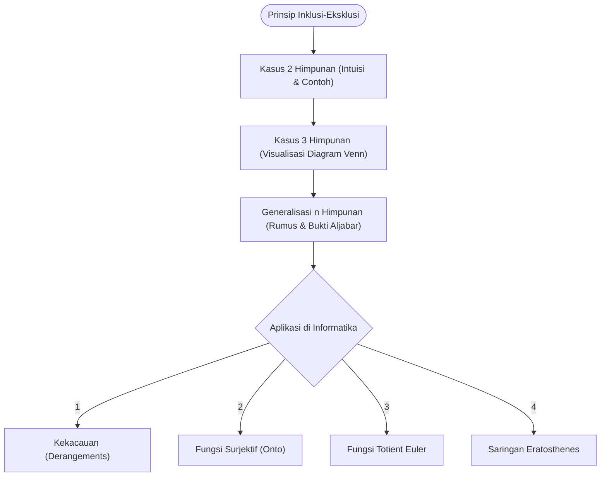

# Panduan Lengkap Belajar Prinsip Inklusi-Eksklusi (Dari Nol Sampai Pro)

Halo! Selamat datang di panduan belajar **Prinsip Inklusi-Eksklusi** (Inclusion-Exclusion Principle). Kalau kamu lagi belajar Matematika Diskrit I dan pernah bingung pas ngerjain soal hitung-menghitung himpunan yang saling tumpang tindih (overlap), kamu berada di tempat yang tepat!

Di sini, kita bakal bongkar konsep ini dari dasar banget (intuisi gambar diagram Venn) sampai ke rumus umum $n$ himpunan yang super rigor. Nggak cuma itu, kita juga bakal ceki-ceki penerapannya di dunia nyata dan informatika—mulai dari masalah bagi-bagi kado acak, fungsi surjektif (onto), fungsi Totient Euler, sampai cara ngitung bilangan prima pakai saringan matematika. 

Siap? Ambil kopi atau teh dulu, dan yuk kita mulai!

---

## Peta Jalan Pembelajaran

Biar belajarnya terarah dan nggak kesasar, berikut adalah alur pembahasan yang bakal kita lewati di panduan ini:

---

## 1. Masalah Overlap dan Kenapa Kita Butuh Inklusi-Eksklusi

Bayangin kita punya sekumpulan mahasiswa Informatika angkatan 2026. Kita mau ngitung ada berapa banyak mahasiswa yang ikut **Klub Matematika** ($A$), **Klub Programming** ($B$), atau keduanya.

Kalau kita langsung ngejumlahin anggota Klub Matematika ditambah anggota Klub Programming ($|A| + |B|$), kira-kira hasilnya bakal bener nggak? 

> [!warning] Hati-hati: Ada yang Dihitung Dobel!
> Kalau ada mahasiswa yang gabung di **kedua klub** sekaligus ($A \cap B$), mereka bakal terhitung dua kali: sekali pas kita ngitung anggota Klub Matematika, dan sekali lagi pas ngitung Klub Programming. 
> 
> Biar hasil penjumlahannya adil dan akurat, kita kudu **mengurangi** (mengeksklusi) mahasiswa yang ikut kedua klub tersebut sebanyak satu kali. Itulah inti dari **Prinsip Inklusi-Eksklusi**!

---

## 2. Kasus Dasar: 2 Himpunan

Mari kita formalisasikan intuisi di atas ke dalam rumus matematika.

> [!important] Rumus Inklusi-Eksklusi 2 Himpunan
> Untuk dua himpunan berhingga $A$ dan $B$, ukuran (kardinalitas) dari gabungan kedua himpunan tersebut adalah:
> $$ |A \cup B| = |A| + |B| - |A \cap B| $$
> - **Inklusi (Memasukkan):** Kita tambah $|A|$ dan $|B|$ ke dalam hitungan.
> - **Eksklusi (Mengeluarkan):** Kita kurangi bagian irisan $|A \cap B|$ karena bagian ini terhitung dua kali.

> [!example] Contoh Soal: Menghitung Anggota Klub
> **Soal:** Di suatu kelas Informatika, ada 40 mahasiswa yang suka Matematika Diskrit ($A$), 35 mahasiswa yang suka Algoritma ($B$), dan 15 mahasiswa yang suka kedua-duanya. Berapa banyak mahasiswa yang suka Matematika Diskrit atau Algoritma?
> 
> **Cara Ngerjain:**
> Kita kumpulin dulu data yang kita punya:
> - Banyaknya pecinta Matematika Diskrit: $|A| = 40$
> - Banyaknya pecinta Algoritma: $|B| = 35$
> - Banyaknya yang suka dua-duanya: $|A \cap B| = 15$
> 
> Sekarang kita masukin ke rumus 2 himpunan:
> $$ |A \cup B| = |A| + |B| - |A \cap B| $$
> $$ |A \cup B| = 40 + 35 - 15 = 60 $$
> 
> Jadi, ada **60 mahasiswa** yang menyukai minimal salah satu dari kedua mata kuliah tersebut. Gampang banget, kan?

---

## 3. Naik Level: Kasus 3 Himpunan

Gimana kalau himpunannya ditambah satu lagi? Katakanlah ada **Klub Desain** ($C$). Sekarang kita mau nyari tahu ukuran gabungan tiga himpunan, yaitu $|A \cup B \cup C|$.

Mari kita urai langkah demi langkah biar kebayang intuisinya:
1. **Langkah Pertama (Inklusi):** Kita jumlahkan semua himpunan tunggal: $|A| + |B| + |C|$.
2. **Langkah Kedua (Eksklusi):** Sekarang, area irisan dua himpunan ($A \cap B$, $A \cap C$, dan $B \cap C$) terhitung dua kali. Maka kita kudu kurangkan semuanya: 
   $$ - |A \cap B| - |A \cap C| - |B \cap C| $$
3. **Langkah Ketiga (Inklusi Kembali):** Nah, ceki-ceki bagian tengah banget tempat ketiga himpunan beririsan ($A \cap B \cap C$). 
   - Di langkah 1, bagian ini ditambahkan **3 kali** (sekali di $A$, sekali di $B$, sekali di $C$).
   - Di langkah 2, bagian ini dikurangkan **3 kali** (sekali di $A \cap B$, sekali di $A \cap C$, sekali di $B \cap C$).
   - Netto-nya? Bagian tengah ini terhitung sebanyak $3 - 3 = 0$ kali! Alias hilang sepenuhnya dari hitungan.
   - Biar adil, kita kudu tambahkan kembali bagian tengah ini sebanyak **1 kali**: $+ |A \cap B \cap C|$.

Bila ditulis utuh, jadinya kayak gini:

> [!important] Rumus Inklusi-Eksklusi 3 Himpunan
> Untuk tiga himpunan berhingga $A$, $B$, dan $C$:
> $$ |A \cup B \cup C| = |A| + |B| + |C| - (|A \cap B| + |A \cap C| + |B \cap C|) + |A \cap B \cap C| $$

> [!example] Contoh Soal: Survei Bahasa Pemrograman
> **Soal:** Sebuah survei dilakukan terhadap 100 mahasiswa tentang bahasa pemrograman yang mereka kuasai (Python, C++, Java). Hasilnya menunjukkan:
> - 50 mahasiswa menguasai Python ($P$)
> - 40 mahasiswa menguasai C++ ($C$)
> - 30 mahasiswa menguasai Java ($J$)
> - 20 mahasiswa menguasai Python & C++ ($P \cap C$)
> - 15 mahasiswa menguasai Python & Java ($P \cap J$)
> - 10 mahasiswa menguasai C++ & Java ($C \cap J$)
> - 5 mahasiswa menguasai ketiganya ($P \cap C \cap J$)
> 
> Hitunglah:
> 1. Berapa banyak mahasiswa yang menguasai minimal salah satu dari ketiga bahasa tersebut?
> 2. Berapa banyak mahasiswa yang tidak menguasai satu pun dari ketiga bahasa tersebut?
> 
> **Cara Ngerjain:**
> 
> **Pertanyaan 1:**
> Langsung pakai rumus 3 himpunan kita tadi:
> $$ |P \cup C \cup J| = |P| + |C| + |J| - (|P \cap C| + |P \cap J| + |C \cap J|) + |P \cap C \cap J| $$
> $$ |P \cup C \cup J| = 50 + 40 + 30 - (20 + 15 + 10) + 5 $$
> $$ |P \cup C \cup J| = 120 - 45 + 5 = 80 $$
> Jadi, ada **80 mahasiswa** yang menguasai minimal satu bahasa pemrograman.
> 
> **Pertanyaan 2:**
> Total mahasiswa yang disurvei adalah Semesta ($|U| = 100$). Mahasiswa yang tidak menguasai bahasa apapun berada di luar gabungan ketiga himpunan tersebut:
> $$ |\text{Tidak menguasai}| = |U| - |P \cup C \cup J| $$
> $$ |\text{Tidak menguasai}| = 100 - 80 = 20 $$
> Jadi, ada **20 mahasiswa** yang sama sekali tidak menguasai Python, C++, maupun Java.

---

## 4. Generalisasi untuk $n$ Himpunan

Sekarang, kita bakal buat versi umumnya untuk $n$ buah himpunan ($A_1, A_2, \dots, A_n$). Polanya sebenarnya mirip banget: kita jumlahkan himpunan tunggal, kurangi irisan berpasangan (2 himpunan), tambahkan irisan bertiga (3 himpunan), kurangi irisan berempat (4 himpunan), dan seterusnya sampai irisan ke-$n$.

> [!important] Teorema: Bentuk Umum Prinsip Inklusi-Eksklusi
> Untuk himpunan berhingga $A_1, A_2, \dots, A_n$, ukuran gabungannya diberikan oleh:
> $$ |A_1 \cup A_2 \cup \dots \cup A_n| = \sum_{i=1}^n |A_i| - \sum_{1 \le i < j \le n} |A_i \cap A_j| + \sum_{1 \le i < j < k \le n} |A_i \cap A_j \cap A_k| - \dots + (-1)^{n-1} |A_1 \cap A_2 \cap \dots \cap A_n| $$
> Atau secara ringkas ditulis sebagai:
> $$ \left| \bigcup_{i=1}^n A_i \right| = \sum_{k=1}^n (-1)^{k-1} \sum_{1 \le i_1 < i_2 < \dots < i_k \le n} |A_{i_1} \cap A_{i_2} \cap \dots \cap A_{i_k}| $$

Meskipun rumusnya kelihatan serem dan panjang, tenang aja! Kita bisa buktikan kebenaran rumus ini dengan cara yang sangat elegan menggunakan aljabar kombinatorik dasar.

### Pembuktian Matematis secara Rigor

Mari kita buktikan bahwa setiap elemen $x$ yang berada di dalam gabungan himpunan-himpunan tersebut terhitung **tepat 1 kali** di ruas kanan persamaan.

Katakanlah elemen $x$ berada di tepat $k$ buah himpunan dari total $n$ himpunan yang ada (di mana $1 \le k \le n$). 
- Elemen $x$ harusnya terhitung tepat $1$ kali di ruas kiri ($|\bigcup A_i|$).
- Sekarang, mari kita hitung berapa kali elemen $x$ ini dihitung di ruas kanan:
  1. Pada suku pertama $\sum |A_i|$, elemen $x$ muncul di $k$ buah himpunan, sehingga terhitung sebanyak $\binom{k}{1}$ kali.
  2. Pada suku kedua $\sum |A_i \cap A_j|$, elemen $x$ muncul di setiap irisan dari pasangan $k$ himpunan tersebut. Banyaknya pasangan adalah $\binom{k}{2}$ kali.
  3. Secara umum, pada suku yang melibatkan irisan $m$ himpunan, elemen $x$ akan terhitung sebanyak $\binom{k}{m}$ kali.

Maka, total kontribusi perhitungan elemen $x$ di ruas kanan adalah:
$$ \text{Total Hitung} = \binom{k}{1} - \binom{k}{2} + \binom{k}{3} - \dots + (-1)^{k-1}\binom{k}{k} $$

Ingat kembali rumus **Teorema Binomial** untuk $(1 - 1)^k$:
$$ 0 = (1 - 1)^k = \sum_{m=0}^k \binom{k}{m} (-1)^m (1)^{k-m} $$
$$ 0 = \binom{k}{0} - \binom{k}{1} + \binom{k}{2} - \binom{k}{3} + \dots + (-1)^k \binom{k}{k} $$

Karena $\binom{k}{0} = 1$, kita bisa pindahkan suku-suku lainnya ke ruas kiri:
$$ 1 = \binom{k}{1} - \binom{k}{2} + \binom{k}{3} - \dots + (-1)^{k-1}\binom{k}{k} $$

Lihat deh! Bagian ruas kanan persamaan di atas persis sama dengan rumus **Total Hitung** kita.
$$ \text{Total Hitung} = 1 $$

Terbukti! Setiap elemen $x$ yang masuk ke dalam gabungan himpunan-himpunan tersebut bakal terhitung **tepat satu kali** di ruas kanan. Matematika itu indah banget ya? $\blacksquare$

### Prinsip Inklusi-Eksklusi Bentuk Komplemen

Seringkali di kalkulasi komputer, kita justru ingin menghitung elemen semesta $U$ yang **tidak memenuhi satu pun sifat** dari himpunan $A_1, A_2, \dots, A_n$. Ini biasanya disebut bentuk komplemen.

Kardinalitas dari irisan komplemen-komplemen himpunan tersebut adalah:

> [!tip] Rumus Komplemen Inklusi-Eksklusi
> $$ |\overline{A_1} \cap \overline{A_2} \cap \dots \cap \overline{A_n}| = |U| - \left| \bigcup_{i=1}^n A_i \right| $$
> Jika kita definisikan $N = |U|$ dan $s_k$ sebagai jumlah ukuran irisan semua kombinasi $k$ buah himpunan:
> $$ s_1 = \sum |A_i|, \quad s_2 = \sum |A_i \cap A_j|, \quad \dots $$
> Maka jumlah elemen yang tidak masuk ke himpunan manapun adalah:
> $$ N_{\text{none}} = N - s_1 + s_2 - s_3 + \dots + (-1)^n s_n $$

---

## 5. Aplikasi Riil dan Informatika

Prinsip Inklusi-Eksklusi punya banyak aplikasi penting dalam ilmu komputer dan teori bilangan. Mari kita bedah empat aplikasi paling populer!

### Aplikasi A: Masalah Kekacauan (Derangements)

Bayangin ada acara tukar kado akhir tahun (*Secret Santa*). Ada $n$ orang yang ngumpulin kado mereka, lalu kado-kado tersebut diacak secara acak dan dibagikan kembali ke setiap orang. Berapa banyak cara membagikan kado sedemikian rupa sehingga **tidak ada satu pun** orang yang menerima kadonya sendiri?

Di matematika, susunan permutasi di mana tidak ada elemen yang kembali ke posisi asalnya disebut **Derangement** (ditulis sebagai $D_n$).

Mari kita bongkar rumus $D_n$ pakai bentuk komplemen Inklusi-Eksklusi:
1. Semesta $U$ adalah seluruh kemungkinan permutasi dari $n$ elemen, maka $|U| = n!$.
2. Kita definisikan sifat $P_i$ sebagai kejadian di mana orang ke-$i$ mendapatkan kadonya sendiri. Himpunan permutasi yang memenuhi sifat $P_i$ ditulis sebagai $A_i$.
3. Kita mau menghitung $D_n = |\overline{A_1} \cap \overline{A_2} \cap \dots \cap \overline{A_n}|$.
4. Berapa ukuran irisan $k$ buah himpunan?
   - Untuk $A_{i_1} \cap \dots \cap A_{i_k}$, berarti ada $k$ orang tertentu yang *kudu* dapet kado mereka sendiri (posisinya terkunci).
   - Sisa $n - k$ orang lainnya bebas diatur posisi kadonya, yang bisa disusun dalam $(n-k)!$ cara.
   - Karena kita bisa memilih $k$ orang dari $n$ orang dengan $\binom{n}{k}$ cara, maka nilai $s_k$ adalah:
     $$ s_k = \binom{n}{k} (n-k)! = \frac{n!}{k!(n-k)!} (n-k)! = \frac{n!}{k!} $$
5. Masukkan ke rumus komplemen:
   $$ D_n = n! - s_1 + s_2 - s_3 + \dots + (-1)^n s_n $$
   $$ D_n = n! - \frac{n!}{1!} + \frac{n!}{2!} - \frac{n!}{3!} + \dots + (-1)^n \frac{n!}{n!} $$
   $$ D_n = n! \left( 1 - \frac{1}{1!} + \frac{1}{2!} - \frac{1}{3!} + \dots + \frac{(-1)^n}{n!} \right) = n! \sum_{i=0}^n \frac{(-1)^i}{i!} $$

> [!important] Rumus Derangement ($D_n$)
> $$ D_n = n! \sum_{i=0}^n \frac{(-1)^i}{i!} $$

> [!example] Contoh Soal: Menghitung Kekacauan ($D_4$)
> **Soal:** Ada 4 orang mahasiswa yang mengumpulkan tugas pemrograman mereka. Sang asisten dosen mengembalikan tugas tersebut secara acak. Ada berapa cara pengembalian tugas tersebut sehingga tidak ada mahasiswa yang mendapatkan tugasnya sendiri?
> 
> **Cara Ngerjain:**
> Di sini nilai $n = 4$. Kita hitung menggunakan rumus derangement:
> $$ D_4 = 4! \left( 1 - \frac{1}{1!} + \frac{1}{2!} - \frac{1}{3!} + \frac{1}{4!} \right) $$
> $$ D_4 = 24 \left( 1 - 1 + \frac{1}{2} - \frac{1}{6} + \frac{1}{24} \right) $$
> $$ D_4 = 24 \left( \frac{12 - 4 + 1}{24} \right) = 9 \text{ cara} $$
> 
> Biar makin mantap, yuk kita list secara manual 9 kemungkinan kekacauan dari posisi asal $(1, 2, 3, 4)$:
> 1. $(2, 1, 4, 3)$
> 2. $(2, 3, 4, 1)$
> 3. $(2, 4, 1, 3)$
> 4. $(3, 1, 4, 2)$
> 5. $(3, 4, 1, 2)$
> 6. $(3, 4, 2, 1)$
> 7. $(4, 1, 2, 3)$
> 8. $(4, 3, 1, 2)$
> 9. $(4, 3, 2, 1)$
> 
> Cek satu-satu deh, nggak ada satu pun angka di atas yang menempati indeks asalnya!
> 
> *Fakta Seru:* Kalau kita hitung probabilitas terjadinya derangement untuk $n$ yang sangat besar ($\lim_{n \to \infty} \frac{D_n}{n!}$), nilainya bakal mendekati $\frac{1}{e} \approx 0.36787$. Artinya, ada sekitar $36.8\%$ peluang kado terbagi secara kacau balau tanpa ada satu pun orang yang dapet kadonya sendiri!

---

### Aplikasi B: Menghitung Fungsi Surjektif (Onto)

Dalam topik [[../Relations/Complete Guide|Relasi dan Fungsi]], kita tahu bahwa fungsi surjektif (onto) adalah fungsi di mana semua elemen di kodomain memiliki minimal satu pasangan di domain.

Misalkan kita punya domain $X$ dengan $|X| = m$ dan kodomain $Y$ dengan $|Y| = n$. Kita mau tahu berapa banyak fungsi surjektif yang bisa dibuat dari $X$ ke $Y$.

1. Total seluruh fungsi yang mungkin dari $X$ ke $Y$ adalah $n^m$.
2. Misalkan elemen di kodomain adalah $Y = \{y_1, y_2, \dots, y_n\}$.
3. Sebuah fungsi dikatakan **tidak surjektif** jika ada minimal satu elemen $y_i$ di kodomain yang tidak terjangkau (missed).
4. Definisikan $A_i$ sebagai himpunan fungsi yang tidak memetakan elemen apapun ke $y_i$.
5. Kita mau mencari fungsi yang memetakan ke semua elemen, yang berarti fungsi tersebut tidak boleh miss elemen manapun: $|\overline{A_1} \cap \overline{A_2} \cap \dots \cap \overline{A_n}|$.
6. Ukuran irisan $k$ buah himpunan:
   - Irisan $A_{i_1} \cap \dots \cap A_{i_k}$ berarti fungsi tersebut "menghindari" $k$ buah elemen di kodomain.
   - Artinya, fungsi tersebut hanya memetakan ke sisa $n - k$ elemen di kodomain. Banyaknya fungsi seperti ini adalah $(n-k)^m$.
   - Ada sebanyak $\binom{n}{k}$ kombinasi cara memilih elemen yang dihindari.
   - Sehingga, $s_k = \binom{n}{k} (n-k)^m$.

Menggunakan Prinsip Inklusi-Eksklusi, kita dapatkan rumus fungsi surjektif:

> [!important] Rumus Banyaknya Fungsi Surjektif (Onto)
> Banyaknya fungsi surjektif dari domain berukuran $m$ ke kodomain berukuran $n$ adalah:
> $$ N_{\text{onto}} = n^m - \binom{n}{1}(n-1)^m + \binom{n}{2}(n-2)^m - \dots + (-1)^{n-1}\binom{n}{n-1}1^m $$
> Atau secara umum:
> $$ N_{\text{onto}} = \sum_{i=0}^{n-1} (-1)^i \binom{n}{i} (n-i)^m $$

> [!example] Contoh Soal: Menghitung Fungsi Onto
> **Soal:** Hitung banyaknya fungsi surjektif dari himpunan $X$ beranggotakan 4 elemen ke himpunan $Y$ beranggotakan 3 elemen.
> 
> **Cara Ngerjain:**
> Di sini $m = 4$ dan $n = 3$. Masukkan nilai ke rumus:
> $$ N_{\text{onto}} = 3^4 - \binom{3}{1}(3-1)^4 + \binom{3}{2}(3-2)^4 $$
> $$ N_{\text{onto}} = 81 - 3(2^4) + 3(1^4) $$
> $$ N_{\text{onto}} = 81 - 3(16) + 3(1) $$
> $$ N_{\text{onto}} = 81 - 48 + 3 = 36 $$
> 
> Jadi, ada **36 fungsi surjektif** yang mungkin dibentuk.

---

### Aplikasi C: Fungsi Totient Euler ($\phi(n)$)

Di teori bilangan dan kriptografi (seperti algoritma RSA), kita sering menggunakan **Fungsi Totient Euler** $\phi(n)$, yaitu banyaknya bilangan bulat positif kurang dari atau sama dengan $n$ yang relatif prima (coprime) dengan $n$.

Dua bilangan dikatakan relatif prima jika FPB (Faktor Persekutuan Terbesar) mereka adalah 1. Gimana cara nyari $\phi(n)$ pakai Inklusi-Eksklusi?

Misalkan faktorisasi prima dari bilangan $n$ adalah:
$$ n = p_1^{a_1} p_2^{a_2} \dots p_r^{a_r} $$
Sebuah bilangan $x \le n$ dikatakan relatif prima dengan $n$ jika $x$ **tidak habis dibagi** oleh satu pun faktor prima dari $n$ ($p_1, p_2, \dots, p_r$).

1. Semesta kita adalah bilangan bulat $\{1, 2, \dots, n\}$, sehingga $|U| = n$.
2. Definisikan $A_i$ sebagai himpunan bilangan bulat $\le n$ yang habis dibagi oleh $p_i$.
   - Ukuran $|A_i| = \frac{n}{p_i}$
   - Ukuran irisan $|A_i \cap A_j| = \frac{n}{p_i p_j}$ (karena habis dibagi $p_i$ dan $p_j$, berarti habis dibagi $p_i \times p_j$).
3. Kita ingin menghitung bilangan yang tidak masuk himpunan manapun: $\phi(n) = |\overline{A_1} \cap \dots \cap \overline{A_r}|$.
4. Masukkan ke rumus komplemen Inklusi-Eksklusi:
   $$ \phi(n) = n - \sum_{i} \frac{n}{p_i} + \sum_{i < j} \frac{n}{p_i p_j} - \dots + (-1)^r \frac{n}{p_1 p_2 \dots p_r} $$
5. Faktorkan keluar nilai $n$:
   $$ \phi(n) = n \left( 1 - \sum \frac{1}{p_i} + \sum \frac{1}{p_i p_j} - \dots + (-1)^r \frac{1}{p_1 \dots p_r} \right) $$
   Bentuk aljabar di dalam kurung di atas bisa disederhanakan secara cantik menjadi perkalian faktor-faktor berikut:
   $$ \phi(n) = n \left(1 - \frac{1}{p_1}\right) \left(1 - \frac{1}{p_2}\right) \dots \left(1 - \frac{1}{p_r}\right) $$

> [!important] Rumus Fungsi Totient Euler
> $$ \phi(n) = n \prod_{p | n} \left(1 - \frac{1}{p}\right) $$
> (Di mana perkalian dilakukan untuk semua faktor prima unik $p$ dari $n$).

> [!example] Contoh Soal: Menghitung $\phi(60)$
> **Soal:** Hitung berapa banyak bilangan bulat positif kurang dari atau sama dengan 60 yang relatif prima dengan 60.
> 
> **Cara Ngerjain:**
> 1. Faktorkan bilangan 60 ke dalam bentuk prima:
>    $$ 60 = 2^2 \times 3 \times 5 $$
>    Faktor-faktor prima unik dari 60 adalah **2, 3, dan 5**.
> 2. Masukkan ke rumus Totient Euler:
>    $$ \phi(60) = 60 \left(1 - \frac{1}{2}\right) \left(1 - \frac{1}{3}\right) \left(1 - \frac{1}{5}\right) $$
>    $$ \phi(60) = 60 \times \frac{1}{2} \times \frac{2}{3} \times \frac{4}{5} $$
>    $$ \phi(60) = 60 \times \frac{8}{30} = 16 $$
> 
> Jadi, ada **16 bilangan** yang relatif prima dengan 60. Cepat sekali tanpa perlu mendaftar satu-satu!

---

### Aplikasi D: Saringan Eratosthenes (Menghitung Bilangan Prima)

Saringan Eratosthenes adalah algoritma klasik untuk mencari bilangan prima. Kita bisa menggunakan konsep ini bersama Inklusi-Eksklusi untuk menghitung ada berapa banyak bilangan prima di bawah suatu batas tertentu $N$.

Ingat aturan dasar: Setiap bilangan komposit $x \le N$ pasti memiliki faktor prima yang nilainya kurang dari atau sama dengan $\sqrt{N}$.

> [!example] Contoh Soal: Menghitung Banyaknya Bilangan Prima $\le 100$
> **Soal:** Hitung ada berapa banyak bilangan prima di rentang 1 sampai 100.
> 
> **Cara Ngerjain:**
> 1. Batas atas kita adalah $N = 100$. Nilai $\sqrt{100} = 10$.
> 2. Bilangan prima yang kurang dari atau sama dengan 10 adalah **2, 3, 5, dan 7**.
> 3. Setiap bilangan komposit $\le 100$ pasti habis dibagi oleh salah satu dari 2, 3, 5, atau 7.
> 4. Mari kita hitung berapa banyak bilangan bulat di semesta $U = \{1, 2, \dots, 100\}$ yang *tidak* habis dibagi oleh 2, 3, 5, maupun 7. 
>    - $|U| = 100$
>    - Definisikan $A_p$ sebagai himpunan bilangan bulat $\le 100$ yang habis dibagi $p$.
> 5. Cari nilai pembagian bulatnya (menggunakan fungsi floor $\lfloor \rfloor$):
>    - **Irisan 1 himpunan ($s_1$):**
>      $$ |A_2| = \lfloor 100/2 \rfloor = 50 $$
>      $$ |A_3| = \lfloor 100/3 \rfloor = 33 $$
>      $$ |A_5| = \lfloor 100/5 \rfloor = 20 $$
>      $$ |A_7| = \lfloor 100/7 \rfloor = 14 $$
>      $$ s_1 = 50 + 33 + 20 + 14 = 117 $$
> 
>    - **Irisan 2 himpunan ($s_2$):**
>      $$ |A_2 \cap A_3| = \lfloor 100/6 \rfloor = 16 $$
>      $$ |A_2 \cap A_5| = \lfloor 100/10 \rfloor = 10 $$
>      $$ |A_2 \cap A_7| = \lfloor 100/14 \rfloor = 7 $$
>      $$ |A_3 \cap A_5| = \lfloor 100/15 \rfloor = 6 $$
>      $$ |A_3 \cap A_7| = \lfloor 100/21 \rfloor = 4 $$
>      $$ |A_5 \cap A_7| = \lfloor 100/35 \rfloor = 2 $$
>      $$ s_2 = 16 + 10 + 7 + 6 + 4 + 2 = 45 $$
> 
>    - **Irisan 3 himpunan ($s_3$):**
>      $$ |A_2 \cap A_3 \cap A_5| = \lfloor 100/30 \rfloor = 3 $$
>      $$ |A_2 \cap A_3 \cap A_7| = \lfloor 100/42 \rfloor = 2 $$
>      $$ |A_2 \cap A_5 \cap A_7| = \lfloor 100/70 \rfloor = 1 $$
>      $$ |A_3 \cap A_5 \cap A_7| = \lfloor 100/105 \rfloor = 0 $$
>      $$ s_3 = 3 + 2 + 1 + 0 = 6 $$
> 
>    - **Irisan 4 himpunan ($s_4$):**
>      $$ |A_2 \cap A_3 \cap A_5 \cap A_7| = \lfloor 100/210 \rfloor = 0 $$
>      $$ s_4 = 0 $$
> 
> 6. Hitung jumlah bilangan yang *tidak* habis dibagi 2, 3, 5, maupun 7:
>    $$ N_{\text{none}} = |U| - s_1 + s_2 - s_3 + s_4 $$
>    $$ N_{\text{none}} = 100 - 117 + 45 - 6 + 0 = 22 $$
> 
> 7. Mari kita analisis isi dari 22 bilangan tersebut. Mereka adalah bilangan-bilangan yang tidak habis dibagi 2, 3, 5, maupun 7. Angka-angka tersebut adalah:
>    - Angka **1** (karena 1 tidak habis dibagi siapapun, tapi 1 bukan prima).
>    - Bilangan prima yang **lebih besar dari 10** (yaitu 11, 13, 17, 19, 23, 29, 31, 37, 41, 43, 47, 53, 59, 61, 67, 71, 73, 79, 83, 89, 97 - total ada 21 bilangan).
> 
> 8. Jadi, untuk mencari total bilangan prima $\le 100$, rumusnya adalah:
>    $$ \text{Total Prima} = N_{\text{none}} - 1 (\text{angka 1}) + 4 (\text{prima 2, 3, 5, 7 yang tadi dieliminasi}) $$
>    $$ \text{Total Prima} = 22 - 1 + 4 = 25 $$
> 
> Jadi, ada tepat **25 bilangan prima** yang kurang dari atau sama dengan 100!

---

## Hubungan dengan Topik Lainnya

Prinsip Inklusi-Eksklusi ini juga erat hubungannya dengan beberapa bab matematika diskrit lainnya yang sudah kita bahas:
- **Pencacahan (Counting):** Bab ini merupakan kelanjutan langsung dari aturan penjumlahan dan pengurangan dasar.
- **Fungsi Pembangkit:** Kita bisa menyelesaikan kasus pencacahan inklusi-eksklusi yang lebih rumit menggunakan koefisien dari ekspansi [[../Generating_Functions/01 GF Introduction|Fungsi Pembangkit]].
- **Kompleksitas Algoritma:** Dalam pemrograman, optimasi pencacahan menggunakan Inklusi-Eksklusi sering digunakan untuk memangkas kompleksitas waktu dari eksponensial menjadi polinomial.

---

## Kesimpulan

Selamat! Kamu sekarang sudah menguasai konsep **Prinsip Inklusi-Eksklusi** dari dasarnya hingga aplikasi tingkat lanjut di ilmu komputer. Menguasai prinsip ini bakal mempermudah kamu saat merancang algoritma kombinatorika yang efisien atau saat menyelesaikan soal-soal matematika diskrit yang rumit. 

Kalau kamu mau menguji pemahaman konsep rekursif lainnya, langsung ceki-ceki panduan tentang [[../Recurrence_Relations/Recurrence Relations Complete Guide|Relasi Rekursif]]. Semangat belajarnya ya!
