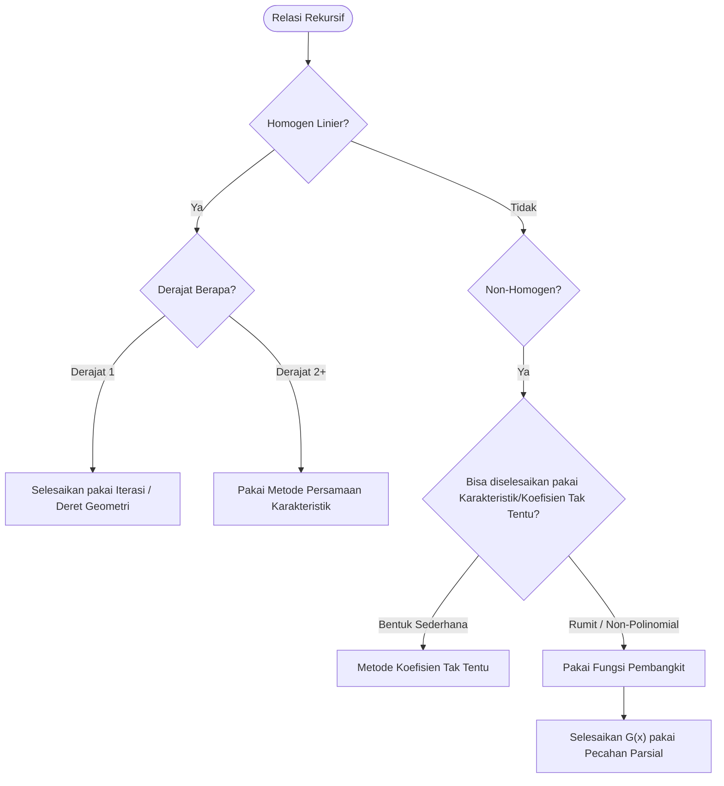

# Panduan Lengkap Belajar Relasi Rekursif (Biar Paham dari Nol)

Halo! Selamat datang di panduan belajar **Relasi Rekursif** (Recurrence Relations). Di sini, kita bakal bahas topiknya pelan-pelan dari konsep paling dasar (barisan & deret) sampai teknik tingkat dewa pakai Fungsi Pembangkit (Generating Functions). 

Entah kamu lagi mumet nyari kompleksitas waktu dari algoritma rekursif atau lagi nyari tahu ada berapa cara buat naik tangga, materi di sini bakal ngebantu banget buat mata kuliah Matematika Diskrit I kamu. Yuk, kita mulai!

---

## Flowchart Cara Milih Metode

Biar nggak bingung pas ketemu soal relasi rekursif, kamu bisa pakai diagram keputusan di bawah ini buat milih metode mana yang paling pas buat dipakai:

---

## 1. Pengenalan Deret Diskrit (Discrete Series)

Sebelum masuk ke relasi rekursif, kita kudu/harus paham dulu konsep dasar **barisan** (sequence) dan **deret** (series).

> [!info] Definisi Gampangnya: Barisan vs. Deret
> - **Barisan** itu daftar angka yang berurutan. Biasanya kita tulis suku-sukunya sebagai $a_0, a_1, a_2, \ldots, a_n$.
>   *Contoh:* Barisan bilangan genap positif itu $2, 4, 6, 8, 10, \dots$ Di sini, suku pertamanya $a_1 = 2$, suku keduanya $a_2 = 4$, dst.
> - **Deret** itu jumlah dari suku-suku yang ada di barisan. Kalau barisan kita itu $a_n$, maka deret untuk $n$ suku pertama itu:
>   $$S_n = a_1 + a_2 + \dots + a_n = \sum_{i=1}^n a_i$$

### Deret Geometri
Nah, salah satu jenis barisan yang paling penting itu **barisan geometri**. Di barisan ini, tiap suku didapat dari mengalikan suku sebelumnya dengan suatu konstanta yang disebut *rasio* ($r$). Bentuk barisannya kayak gini: $a, ar, ar^2, ar^3, \dots, ar^n$.

Jumlah dari $n+1$ suku pertama (dari $ar^0$ sampai $ar^n$) disebut **deret geometri berhingga**:

> [!important] Rumus Deret Geometri Berhingga
> $$ S_n = \sum_{i=0}^n ar^i = a \frac{1 - r^{n+1}}{1 - r} \quad \text{(kalau } r \neq 1 \text{)} $$

> [!example] Contoh Soal: Deret Geometri Berhingga
> **Soal:** Hitung jumlah dari deret ini: $3 + 6 + 12 + 24 + 48$.
> 
> **Cara Ngerjain:**
> Deret ini adalah deret geometri dengan suku awal $a = 3$ dan rasio $r = 2$. Karena ada 5 suku, berarti nilai $n = 4$ (karena indeks mulai dari 0 sampai 4).
> $$ S_4 = 3 \frac{1 - 2^5}{1 - 2} = 3 \frac{1 - 32}{-1} = 3 \times 31 = 93. $$

### Deret Tak Hingga (Infinite Series)
Gimana kalau kita tambah terus sukunya sampai kiamat (tak hingga)? Nah, ini namanya **deret tak hingga**. Kalau nilai rasio $|r| < 1$, suku-sukunya bakal makin lama makin kecil mendekati nol, dan jumlah totalnya bakal mendekati suatu nilai konstan tertentu:

> [!tip] Rumus Deret Geometri Tak Hingga
> $$ S_\infty = \sum_{i=0}^\infty ar^i = \frac{a}{1 - r} \quad \text{untuk } |r| < 1 $$
> *Catat rumus ini ya! Rumus ini bakal sering banget kepakai pas kita masuk ke bab [[../Generating_Functions/01 GF Introduction|Fungsi Pembangkit]].*

---

## 2. Apa sih Relasi Rekursif itu?

Biasanya, kita mendefinisikan suku ke-$n$ dari suatu barisan secara langsung/eksplisit. Contohnya $a_n = 2n$. Kalau kamu mau tahu suku ke-5 ($a_5$), tinggal masukin aja $n=5$ dan ketemu hasilnya $10$. Ini namanya **solusi closed-form** (rumus langsung).

Tapi, kadang-kadang jauh lebih gampang kalau kita mendefinisikan suku ke-$n$ berdasarkan suku-suku *sebelumnya*.

> [!info] Definisi: Relasi Rekursif
> **Relasi rekursif** untuk suatu barisan $\{a_n\}$ adalah sebuah persamaan yang menyatakan suku $a_n$ menggunakan satu atau beberapa suku sebelumnya, yaitu $a_{n-1}, a_{n-2}, \dots, a_0$.
> 
> Biar barisannya bisa terdefinisi dengan unik dan jelas, relasi rekursif wajib punya **kondisi awal** (initial conditions) yang menentukan nilai mulainya barisan tersebut.

> [!example] Contoh Soal: Barisan Fibonacci
> Barisan Fibonacci itu contoh relasi rekursif yang paling legendaris. Aturannya simpel: tiap angka adalah hasil penjumlahan dari dua angka sebelumnya.
> - **Persamaan Rekursif:** $f_n = f_{n-1} + f_{n-2}$ untuk $n \geq 2$
> - **Kondisi Awal:** $f_0 = 0$, $f_1 = 1$
> 
> Dari aturan ini, kita bisa hitung suku-suku berikutnya:
> - $f_2 = f_1 + f_0 = 1 + 0 = 1$
> - $f_3 = f_2 + f_1 = 1 + 1 = 2$
> - $f_4 = f_3 + f_2 = 2 + 1 = 3$
> - $f_5 = f_4 + f_3 = 3 + 2 = 5$
> 
> Barisannya jadi kayak gini: $0, 1, 1, 2, 3, 5, 8, 13, 21, \dots$

Meskipun gampang dihitung satu-satu secara manual, bayangin kalau kamu disuruh nyari suku ke-100 ($f_{100}$). Pegel kan? Makanya, misi utama kita di bab ini adalah nyari **closed-form** (rumus instan langsung jadi) dari relasi rekursif tersebut biar kita bisa langsung dapet nilai suku ke-berapapun tanpa perlu ngitung dari awal.

---

## 3. Menyelesaikan Rekursi dengan Metode Iterasi & Substitusi

Kalau kamu nemu relasi rekursif yang relatif simpel—terutama pas lagi nyari kompleksitas waktu algoritma (biasanya ditulis sebagai $T(n)$)—cara paling gampang adalah dengan "membongkar" atau mengulur persamaan tersebut. Cara ini disebut metode iterasi atau substitusi.

### Metode Iterasi (Unrolling)
Inti dari metode ini adalah menjabarkan relasi rekursif itu berulang kali sampai kamu melihat ada pola matematis tertentu yang terbentuk, lalu arahkan ke kondisi awal (base case).

> [!example] Contoh Soal: Menara Hanoi (Tower of Hanoi)
> Game Menara Hanoi mengharuskan kita mindahin $n$ piringan dari satu tiang ke tiang lain dengan aturan tertentu. Jumlah langkah minimal $H_n$ untuk mindahin $n$ piringan adalah:
> - $H_n = 2H_{n-1} + 1$
> - Kondisi awal: $H_1 = 1$
> 
> Mari kita bongkar $H_n$:
> 1. $H_n = 2H_{n-1} + 1$
> 2. Substitusi nilai $H_{n-1} = 2H_{n-2} + 1$:
>    $$H_n = 2(2H_{n-2} + 1) + 1 = 2^2 H_{n-2} + 2 + 1$$
> 3. Substitusi nilai $H_{n-2} = 2H_{n-3} + 1$:
>    $$H_n = 2^2(2H_{n-3} + 1) + 2 + 1 = 2^3 H_{n-3} + 2^2 + 2 + 1$$
> 
> Kelihatan polanya? Setelah kita substitusi sebanyak $k$ kali, rumusnya bakal jadi:
> $$ H_n = 2^k H_{n-k} + 2^{k-1} + 2^{k-2} + \dots + 2^1 + 2^0 $$
> Kita mau proses ini berhenti pas mencapai kondisi awal $H_1$. Ini terjadi pas $n - k = 1$, yang berarti nilai $k = n - 1$. Yuk, kita masukin $k = n - 1$ ke pola kita tadi:
> $$ H_n = 2^{n-1} H_1 + 2^{n-2} + 2^{n-3} + \dots + 2^1 + 2^0 $$
> Karena $H_1 = 1$, maka:
> $$ H_n = 2^{n-1} + 2^{n-2} + \dots + 2^1 + 2^0 $$
> Nah! Bagian kanan ini kan **deret geometri** dengan suku awal $a=1$, rasio $r=2$, dan ada sebanyak $n$ suku. Tinggal pakai rumus deret geometri kita sebelumnya:
> $$ H_n = 1 \cdot \frac{1 - 2^n}{1 - 2} = 2^n - 1 $$
> 
> **Solusi closed-form:** $H_n = 2^n - 1$. Jadi, kalau ada 64 piringan, kamu butuh $2^{64} - 1$ langkah!

### Metode Substitusi (Tebak dan Buktikan)
Kadang, proses membongkar/iterasi itu bisa bikin pusing karena polanya ruwet. Kalau pakai metode substitusi, kita tebak dulu rumus jadinya kira-kira kayak gimana, terus kita buktikan tebakan kita itu pakai **Induksi Matematika**.

1. **Tebakan:** $H_n = 2^n - 1$
2. **Basis Induksi:** Untuk $n=1$, $H_1 = 2^1 - 1 = 1$. Tebakan kita benar karena cocok sama kondisi awal.
3. **Langkah Induksi:** Asumsikan tebakan ini benar untuk suku ke-$(n-1)$, yaitu $H_{n-1} = 2^{n-1} - 1$. Sekarang kita harus membuktikan kalau rumus ini juga berlaku untuk suku ke-$n$.
   $$H_n = 2H_{n-1} + 1$$
   Masukkan asumsi kita tadi ke rumus:
   $$H_n = 2(2^{n-1} - 1) + 1 = 2^n - 2 + 1 = 2^n - 1$$
   Terbukti! Langkah induksi selesai dan tebakan kita $100\%$ valid.

---

## 4. Menyelesaikan Relasi Rekursif Linier Homogen

Untuk jenis rekursi yang namanya **Relasi Rekursif Linier Homogen dengan Koefisien Konstanta**, ada cara matematis yang terstruktur banget buat nyari rumusnya secara instan tanpa perlu tebak-tebak buah manggis.

> [!note] Pahami Dulu Istilahnya
> - **Linier:** Suku-suku sebelumnya ($a_{n-1}, a_{n-2}$, dsb.) cuma berpangkat satu (nggak ada bentuk kuadrat $a_{n-1}^2$ atau perkalian antar suku $a_{n-1}a_{n-2}$).
> - **Homogen:** Nggak ada fungsi tambahan dari $n$ atau konstanta yang numpang lewat (contoh: $a_n = 2a_{n-1}$ itu homogen, tapi $a_n = 2a_{n-1} + 1$ itu non-homogen karena ada $+1$).
> - **Koefisien Konstanta:** Pengali suku-sukunya berupa angka biasa (kayak $5$, $-6$), bukan variabel (bukan $n$).
> - **Derajat:** Seberapa jauh ke belakang relasi ini melihat (misal: $a_n = a_{n-1} + a_{n-2}$ itu derajat 2 karena butuh 2 suku sebelumnya).
> 
> **Bentuk Umumnya:**
> $$ a_n = c_1 a_{n-1} + c_2 a_{n-2} + \dots + c_k a_{n-k} $$

### Metode Persamaan Karakteristik
Ide dasarnya adalah kita asumsikan solusinya berbentuk geometri, yaitu $a_n = r^n$ dengan $r \neq 0$. Kenapa? Karena pertumbuhan barisan linier homogen itu mirip dengan pertumbuhan deret geometri.

Misalnya kita punya relasi derajat 2: $a_n = c_1 a_{n-1} + c_2 a_{n-2}$.
Kita substitusikan $a_n = r^n$ lalu bagi kedua ruas dengan $r^{n-2}$:
$$ r^2 - c_1 r - c_2 = 0 $$
Persamaan kuadrat ini namanya **Persamaan Karakteristik**. Akar-akar dari persamaan ini ($r_1$ dan $r_2$) yang bakal nentuin gimana bentuk rumus jadinya. Ada dua kasus utama buat derajat 2:

> [!important] Teorema: Akar Real Berbeda
> Kalau persamaan karakteristik punya akar yang berbeda ($r_1 \neq r_2$), maka rumus umumnya adalah:
> $$ a_n = \alpha_1 r_1^n + \alpha_2 r_2^n $$
> *(Di mana $\alpha_1$ dan $\alpha_2$ adalah konstanta yang bisa kita cari pakai kondisi awal).*

> [!example] Contoh Soal: Akar Berbeda
> **Soal:** Selesaikan $a_n = 5a_{n-1} - 6a_{n-2}$ dengan kondisi awal $a_0 = 1, a_1 = 4$.
> 
> **Cara Ngerjain:**
> 1. **Persamaan Karakteristik:** Ubah persamaan jadi $r^2 - 5r + 6 = 0$.
> 2. **Cari Akar-akarnya:** FAKTORKAN! Kita dapet $(r - 2)(r - 3) = 0$, jadi akarnya $r_1 = 2$ dan $r_2 = 3$.
> 3. **Tulis Solusi Umum:** $a_n = \alpha_1 2^n + \alpha_2 3^n$.
> 4. **Gunakan Kondisi Awal:**
>    - Untuk $n=0 \implies 1 = \alpha_1 2^0 + \alpha_2 3^0 \implies 1 = \alpha_1 + \alpha_2$
>    - Untuk $n=1 \implies 4 = \alpha_1 2^1 + \alpha_2 3^1 \implies 4 = 2\alpha_1 + 3\alpha_2$
> 5. **Cari Nilai $\alpha_1, \alpha_2$ pakai eliminasi/substitusi:**
>    Kalikan persamaan pertama dengan 2: $2 = 2\alpha_1 + 2\alpha_2$.
>    Kurangi persamaan kedua dengan persamaan barusan: $2 = \alpha_2$.
>    Berarti $\alpha_1 = 1 - 2 = -1$.
> 6. **Rumus Jadi:** $a_n = -1 \cdot 2^n + 2 \cdot 3^n = 2 \cdot 3^n - 2^n$.

> [!important] Teorema: Akar Kembar (Repeated Root)
> Kalau persamaan karakteristiknya cuma menghasilkan satu akar kembar ($r_1 = r_2 = r$), maka rumus umumnya adalah:
> $$ a_n = \alpha_1 r^n + \alpha_2 n r^n $$
> *Catatan: Perkalian dengan $n$ di suku kedua itu wajib hukumnya biar kedua suku tersebut independen secara linier.*

---

## 5. Pengenalan Fungsi Pembangkit (Generating Functions)

Sekarang kita masuk ke dunia "sihir" matematika. Bayangin kalau kamu punya barisan tak hingga, terus kamu pengen kompres seluruh barisan itu jadi **satu buah fungsi aljabar tunggal**. Nah, itulah yang disebut **Fungsi Pembangkit**!

> [!info] Definisi: Fungsi Pembangkit Biasa (Ordinary Generating Function - OGF)
> Untuk suatu barisan $a_0, a_1, a_2, \ldots$, Fungsi Pembangkit Biasa $G(x)$ didefinisikan sebagai polinomial tak hingga (deret pangkat):
> $$ G(x) = a_0 + a_1 x + a_2 x^2 + a_3 x^3 + \dots = \sum_{n=0}^\infty a_n x^n $$
> *Catatan: Buat penjelasan lebih detail soal jenis-jenis fungsi pembangkit, kamu bisa baca [[../Generating_Functions/02 GF Ordinary|Catatan Ordinary Generating Functions]] atau langsung cek katalognya di [[../Generating_Functions/00 GF Index|Library Fungsi Pembangkit]].*

Di sini, variabel $x$ itu cuma formalitas (placeholder) aja. Kita nggak bakal ngeganti $x$ pakai angka. Kita cuma pakai $x^n$ sebagai "wadah" atau "laci" buat naruh suku ke-$n$ ($a_n$) sebagai koefisiennya.

> [!example] Contoh Soal: Fungsi Pembangkit Sederhana
> 1. **Barisan Angka 1 Semua ($1, 1, 1, \dots$):**
>    $$ G(x) = 1 + x + x^2 + x^3 + \dots = \frac{1}{1 - x} $$
> 2. **Barisan Perpangkatan 2 ($1, 2, 4, 8, \dots$):**
>    $$ G(x) = 1 + 2x + 4x^2 + 8x^3 + \dots = \frac{1}{1 - 2x} $$
>    *Secara umum, fungsi $\frac{1}{1 - cx}$ itu bakal menghasilkan barisan geometri $c^n$. Kamu bisa lihat koleksi pola lainnya di [[../Generating_Functions/06 GF Pattern Library|Pattern Library Fungsi Pembangkit]].*

---

## 6. Menyelesaikan Rekursi pakai Fungsi Pembangkit

Fungsi pembangkit itu ampuh banget buat nyelesaiin relasi rekursif (terutama yang non-homogen) karena metode ini mengubah masalah barisan diskrit menjadi masalah aljabar fungsi biasa.

> [!tip] 4 Langkah Sakti Ngerjain Rekursi pakai Fungsi Pembangkit
> 1. **Tulis relasi rekursifnya** sedemikian rupa biar semua suku barisan ada di satu ruas (contoh: $a_n - 5a_{n-1} + 6a_{n-2} = 0$).
> 2. **Kalikan kedua ruas dengan $x^n$ lalu jumlahkan (sum)** dari $n=k$ sampai $\infty$ (di mana $k$ adalah derajat relasi rekursifnya).
> 3. **Ubah bentuk penjumlahan tadi menjadi fungsi $G(x)$**, lalu gunakan aljabar biasa buat nyari rumus $G(x)$ nya.
> 4. **Ubah kembali fungsi $G(x)$** menjadi deret pangkat (biasanya pakai metode Pecahan Parsial) dan ambil koefisien dari $x^n$ sebagai solusi $a_n$.
> 
> *Pengen lihat contoh soal lainnya? Langsung ceki-ceki catatan tentang [[../Generating_Functions/03 GF Recurrences|Penyelesaian Rekursi dengan Fungsi Pembangkit]].*

Mari kita selesaikan lagi soal $a_n = 5a_{n-1} - 6a_{n-2}$ dengan $a_0 = 1, a_1 = 4$ pakai cara keren ini.

### Langkah 1 & 2: Kalikan $x^n$ dan Jumlahkan
$$ \sum_{n=2}^\infty a_n x^n - 5 \sum_{n=2}^\infty a_{n-1} x^n + 6 \sum_{n=2}^\infty a_{n-2} x^n = 0 $$

Kita hubungkan bentuk penjumlahan di atas dengan fungsi pembangkit utama kita $G(x) = \sum_{n=0}^\infty a_n x^n$:
- Penjumlahan pertama: $\sum_{n=2}^\infty a_n x^n = G(x) - a_0 - a_1 x$
- Penjumlahan kedua: $5 \sum_{n=2}^\infty a_{n-1} x^n = 5x(G(x) - a_0)$
- Penjumlahan ketiga: $6 \sum_{n=2}^\infty a_{n-2} x^n = 6x^2 G(x)$

Substitusikan balik ke persamaan:
$$ (G(x) - a_0 - a_1 x) - 5x(G(x) - a_0) + 6x^2 G(x) = 0 $$

### Langkah 3: Cari Persamaan $G(x)$
Masukkan kondisi awal $a_0 = 1$ dan $a_1 = 4$:
$$ (G(x) - 1 - 4x) - 5x(G(x) - 1) + 6x^2 G(x) = 0 $$
$$ G(x)[1 - 5x + 6x^2] - 1 + x = 0 $$
$$ G(x) = \frac{1 - x}{1 - 5x + 6x^2} = \frac{1 - x}{(1 - 2x)(1 - 3x)} $$

### Langkah 4: Pecahan Parsial & Cari Solusinya
Ubah bentuk pecahan tadi biar bisa dipecah:
$$ \frac{1 - x}{(1 - 2x)(1 - 3x)} = \frac{A}{1 - 2x} + \frac{B}{1 - 3x} $$
Cari nilai $A$ dan $B$ pakai aljabar biasa:
- Untuk $x = 1/2 \implies A = -1$.
- Untuk $x = 1/3 \implies B = 2$.

Kita dapet:
$$ G(x) = \frac{-1}{1 - 2x} + \frac{2}{1 - 3x} $$
Karena fungsi $\frac{1}{1-cx}$ menghasilkan barisan $c^n$, maka solusi akhirnya adalah:
$$ a_n = 2 \cdot 3^n - 2^n $$

---

## 7. Penerapan Fungsi Pembangkit

Fungsi pembangkit itu bukan cuma pajangan buat nyelesaiin rekursi doang, tapi juga jembatan penting antara matematika diskrit dengan kalkulus.

### Masalah Menghitung Kombinasi (Masalah Tukar Uang / Change-Making)
> [!example] Contoh Penerapan: Masalah Tukar Uang
> **Soal:** Ada berapa banyak cara buat menukar uang senilai $N$ rupiah pakai koin pecahan 1 rupiah, 5 rupiah, dan 10 rupiah?
> 
> **Cara Ngerjain:**
> Kita bikin fungsi polinomial buat tiap jenis koin:
> - Koin 1 rupiah: $(1 + x + x^2 + x^3 + \dots) = \frac{1}{1-x}$
> - Koin 5 rupiah: $(1 + x^5 + x^{10} + x^{15} + \dots) = \frac{1}{1-x^5}$
> - Koin 10 rupiah: $(1 + x^{10} + x^{20} + \dots) = \frac{1}{1-x^{10}}$
> 
> Banyaknya cara buat menukar uang senilai $N$ rupiah adalah **koefisien dari suku $x^N$** pada hasil perkalian ketiga fungsi di atas:
> $$ G(x) = \frac{1}{1-x} \cdot \frac{1}{1-x^5} \cdot \frac{1}{1-x^{10}} $$
> *Mau tahu pembahasan lebih dalam soal problem kombinasi kayak gini? Yuk baca selengkapnya di [[../Generating_Functions/04 GF Applications|Catatan Aplikasi Fungsi Pembangkit]].*

### Hubungan ke Kalkulus (Deret Taylor)
Deret pangkat yang kita pakai di fungsi pembangkit itu nyambung banget sama **Deret Taylor** di kalkulus. Contohnya, fungsi eksponensial $e^x$ punya deret Taylor kayak gini:
$$ e^x = \sum_{n=0}^\infty \frac{x^n}{n!} = 1 + x + \frac{x^2}{2!} + \frac{x^3}{3!} + \dots $$
Artinya, fungsi $e^x$ adalah fungsi pembangkit dari barisan $a_n = \frac{1}{n!}$. Fungsi jenis ini dinamakan **Exponential Generating Function** (EGF) dan sering banget dipakai buat ngitung masalah permutasi yang memperhatikan urutan.

---

## Kesimpulan
Keren! Kamu udah belajar dari nol tentang deret diskrit dasar sampai ke konsep Fungsi Pembangkit tingkat lanjut. Dengan menguasai metode-metode ini—mulai dari iterasi, persamaan karakteristik, sampai fungsi pembangkit—kamu udah punya senjata lengkap buat naklukin soal-soal matematika diskrit dan analisis algoritma. Semangat belajarnya ya!
