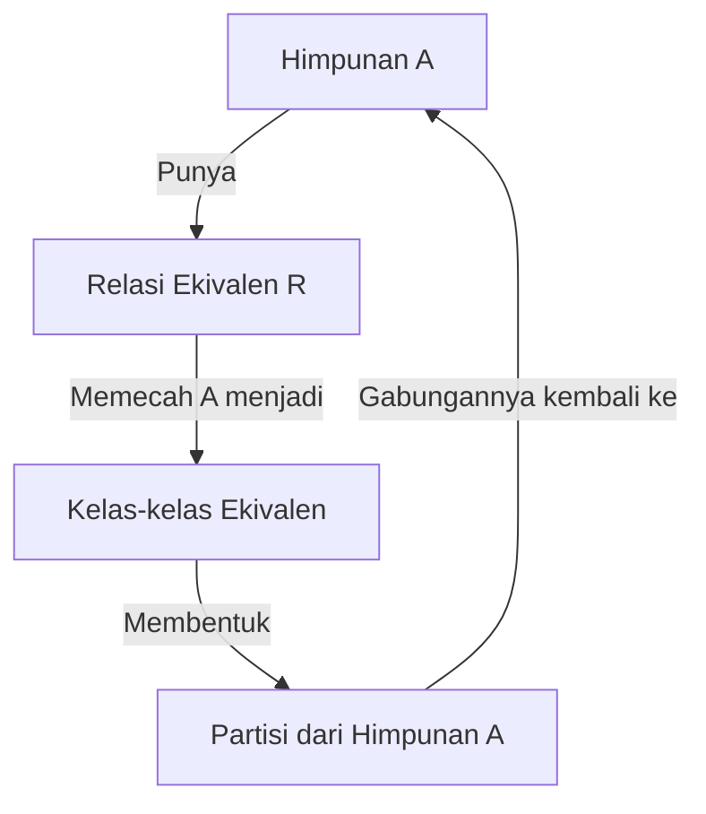

# Panduan Lengkap: Relasi (Relations)

Halo! Di panduan ini, kita bakal bongkar habis-habisan soal **Relasi**. Kalau sebelumnya kita udah belajar soal [[20_Brain_Atlas/20_Concepts/Mathematics/Himpunan|himpunan]] dan [[20_Brain_Atlas/20_Concepts/Mathematics/Fungsi|fungsi]] (inget, fungsi itu sebenarnya tipe khusus dari relasi lho!), sekarang kita bakal fokus ke relasinya itu sendiri. Di mata kuliah Matematika Diskrit, relasi ini penting banget, apalagi kalau kamu nanti belajar soal basis data (database), graf, sampai ke *state machine*. 

Sesuai dengan silabus, kita bakal bahas mulai dari sifat-sifat relasi, relasi n-ary, *closure*, sampai ke relasi ekivalen. Yuk, kita mulai dari awal!

## 1. Apa Itu Relasi? (Intuisi Dasarnya)

Bayangin kamu punya dua himpunan. Himpunan pertama (sebut aja $A$) isinya daftar mahasiswa, dan himpunan kedua ($B$) isinya daftar mata kuliah. Gimana caranya kita ngehubungin mahasiswa sama mata kuliah yang diambil? Nah, jembatan penghubung inilah yang kita sebut sebagai **Relasi**.

Secara matematis, relasi dari himpunan $A$ ke himpunan $B$ itu cuma subset dari *Cartesian product* $A \times B$.

> [!info] Definisi: Relasi Biner
> Misalkan $A$ dan $B$ adalah himpunan. Sebuah **relasi biner** $R$ dari $A$ ke $B$ adalah himpunan bagian dari $A \times B$.
> Artinya, $R \subseteq \{(a, b) \mid a \in A \text{ dan } b \in B\}$.
> Kalau pasangan $(a, b)$ ada di dalam relasi $R$, kita bisa nulisnya $a \mathrel{R} b$.

Kalau $A = B$, kita nyebutnya **relasi pada himpunan $A$**.

> [!example] Contoh Relasi
> Misalkan kita punya himpunan $A = \{1, 2, 3\}$. Kita mau bikin relasi $R$ di mana $a < b$.
> Maka, $R = \{(1, 2), (1, 3), (2, 3)\}$.
> Simpel banget kan? Kita cuma nyari pasangan-pasangan mana aja dari $A \times A$ yang memenuhi syarat "lebih kecil dari".

Kita bisa ngegambarin relasi ini pakai **matriks** (pakai 1 kalau ada relasi, 0 kalau nggak) atau pakai **graf berarah** (titiknya itu anggota himpunan, panahnya itu relasinya).

## 2. Sifat-sifat Relasi

Nah, ini bagian serunya. Relasi pada sebuah himpunan $A$ itu punya sifat-sifat unik. Kita kudu ceki-ceki sifat apa aja yang dimiliki sebuah relasi biar gampang dianalisis nanti.

> [!important] 5 Sifat Utama Relasi
> 1. **Refleksif (Reflexive)**
> 2. **Simetris (Symmetric)**
> 3. **Asimetris (Asymmetric)**
> 4. **Antisimetris (Antisymmetric)**
> 5. **Transitif (Transitive)**

Mari kita bedah satu-satu!

### a. Refleksif
Relasi $R$ pada himpunan $A$ disebut **refleksif** kalau *semua* elemen di $A$ berelasi dengan dirinya sendiri.
**Syarat matematis:** $\forall a \in A, (a, a) \in R$.

> [!example] Contoh Refleksif
> $A = \{1, 2, 3\}$. 
> $R_1 = \{(1,1), (2,2), (3,3), (1,2)\}$ $\rightarrow$ **Refleksif**, karena (1,1), (2,2), dan (3,3) semuanya ada.
> $R_2 = \{(1,1), (3,3), (1,2)\}$ $\rightarrow$ **Tidak refleksif**, karena (2,2) nggak ada. Kasihan angka 2 ditinggalin.

### b. Simetris
Relasi disebut **simetris** kalau hubungan mereka "bolak-balik". Kalau $a$ berelasi dengan $b$, maka $b$ juga harus berelasi dengan $a$. Kayak temenan di Facebook, kalau kamu temenan sama Budi, Budi juga temenan sama kamu.
**Syarat matematis:** $\forall a, b \in A$, jika $(a, b) \in R$, maka $(b, a) \in R$.

### c. Asimetris
Ini kebalikannya. Kalau $a$ berelasi dengan $b$, maka $b$ **nggak boleh** berelasi dengan $a$. 
**Syarat matematis:** $\forall a, b \in A$, jika $(a, b) \in R$, maka $(b, a) \notin R$.
*Catatan: Relasi asimetris otomatis nggak punya elemen refleksif $(a,a)$.*

### d. Antisimetris
Nah, ini yang kadang suka bikin bingung. Antisimetris itu artinya: kalau $a$ berelasi dengan $b$ **DAN** $b$ berelasi dengan $a$, maka $a$ itu **pasti** sama dengan $b$. Kalau $a \neq b$, mereka nggak boleh bolak-balik berelasi. Kayak relasi $\le$ (kurang dari sama dengan). Kalau $x \le y$ dan $y \le x$, ya pasti $x = y$.
**Syarat matematis:** $\forall a, b \in A$, jika $(a, b) \in R$ dan $(b, a) \in R$, maka $a = b$.

> [!example] Contoh Simetris vs Antisimetris
> $A = \{1, 2, 3\}$.
> $R = \{(1,2), (2,1), (1,3)\}$
> - **Simetris?** Nggak, karena ada (1,3) tapi nggak ada (3,1).
> - **Antisimetris?** Nggak, karena ada (1,2) dan (2,1) padahal $1 \neq 2$.

### e. Transitif
Sifat transitif ini kayak efek domino. Kalau $a$ temenan sama $b$, dan $b$ temenan sama $c$, maka $a$ temenan sama $c$.
**Syarat matematis:** $\forall a, b, c \in A$, jika $(a, b) \in R$ dan $(b, c) \in R$, maka $(a, c) \in R$.

> [!example] Contoh Transitif
> $A = \{1, 2, 3\}$.
> $R = \{(1,2), (2,3), (1,3)\}$ $\rightarrow$ **Transitif**.
> Kalau $(1,3)$-nya kita hapus, jadi nggak transitif lagi!

## 3. Relasi n-ary dan Aplikasinya (Basis Data)

Sejauh ini kita ngomongin relasi biner (menghubungkan 2 himpunan atau elemen). Tapi di dunia nyata, relasi itu bisa menghubungkan banyak hal sekaligus. Inilah yang kita panggil **relasi n-ary**.

> [!info] Definisi: Relasi n-ary
> Misalkan kita punya $n$ buah himpunan: $A_1, A_2, \dots, A_n$.
> Relasi n-ary $R$ pada himpunan-himpunan tersebut adalah subset dari $A_1 \times A_2 \times \dots \times A_n$.

Anggota dari relasi n-ary ini disebut $n$-tuple: $(a_1, a_2, \dots, a_n)$.

**Buat apa sih belajar ginian?**
Jawabannya: **Database Relasional (Relational Database)!**
Kalau kamu bikin tabel di SQL, tabel itu sebenarnya adalah relasi n-ary. Kolom-kolom di tabel itu merepresentasikan himpunan $A_1, A_2, \dots, A_n$ (yang kita sebut *domain*), dan tiap baris di tabel itu adalah satu $n$-tuple.

> [!example] Tabel Mahasiswa sebagai Relasi n-ary
> Misal kita punya relasi 3-ary (ternary) bernama `Mahasiswa`:
> $A_1 =$ NIM (String)
> $A_2 =$ Nama (String)
> $A_3 =$ IPK (Float)
> 
> Relasi `Mahasiswa` mungkin isinya: `\{("101", "Andi", 3.5), ("102", "Budi", 3.8)\}`.
> Operasi-operasi kayak `SELECT`, `PROJECT`, dan `JOIN` di basis data itu aslinya berasal dari operasi matematika pada relasi n-ary ini lho!

## 4. Closure dari Sebuah Relasi

Terkadang kita punya sebuah relasi yang kurang "lengkap". Misalnya, kita pengen relasi kita itu refleksif, tapi ada beberapa elemen yang bolong. Nah, kita bisa nambahin elemen-elemen baru sesedikit mungkin ke relasi tersebut biar dia jadi refleksif. Inilah intuisi di balik **Closure**.

> [!important] Definisi Closure
> Closure dari relasi $R$ terhadap properti $P$ adalah relasi terkecil $S$ yang mengandung $R$ ($R \subseteq S$) dan $S$ memiliki properti $P$.

Ada 3 closure yang paling sering dicari:

1. **Reflexive Closure:** Gampang banget, tinggal tambahin elemen diagonal $(a,a)$ untuk semua $a \in A$ yang belum ada di $R$. Secara matematis: $R \cup \{(a,a) \mid a \in A\}$.
2. **Symmetric Closure:** Kalau ada $(a,b)$ tapi nggak ada $(b,a)$, ya tinggal tambahin $(b,a)$-nya. Matematisnya: $R \cup R^{-1}$, di mana $R^{-1}$ adalah invers atau kebalikan dari relasi.
3. **Transitive Closure:** Nah, ini yang paling menantang. Kalau ada jalur dari $a$ ke $b$ lewat elemen lain, kita harus nambahin jalur langsung dari $a$ ke $b$. Biasanya disimbolin pake $R^*$.

> [!example] Mencari Transitive Closure
> $A = \{1, 2, 3\}$.
> $R = \{(1,2), (2,3)\}$
> Biar transitif, karena ada (1,2) dan (2,3), kita kudu nambahin $(1,3)$.
> Jadi, transitive closure-nya adalah $R^* = \{(1,2), (2,3), (1,3)\}$.

Untuk graf yang gede banget, nyari transitive closure itu nggak bisa pake feeling doang. Di ilmu komputer, kita biasanya ngerjain ini pakai algoritma khusus, misalnya **Algoritma Warshall**.

## 5. Relasi Ekivalen (Equivalence Relations)

Relasi ekivalen adalah relasi yang ngebantu kita mengelompokkan barang-barang yang "dianggap sama" ke dalam suatu kategori.

> [!tip] Syarat Relasi Ekivalen (RST)
> Sebuah relasi disebut **relasi ekivalen** jika dan hanya jika relasi tersebut memenuhi 3 sifat sekaligus:
> 1. **R**efleksif
> 2. **S**imetris
> 3. **T**ransitif

**Kenapa harus tiga sifat ini?**
Bayangin relasi "sebaya dengan" (umurnya sama). 
- **Refleksif:** Aku pasti sebaya dengan diriku sendiri.
- **Simetris:** Kalau aku sebaya dengan Andi, maka Andi pasti sebaya denganku.
- **Transitif:** Kalau aku sebaya dengan Andi, dan Andi sebaya dengan Budi, maka aku pasti sebaya dengan Budi.
Karena memenuhi ketiganya, "sebaya dengan" adalah relasi ekivalen!

### Equivalence Classes (Kelas Ekivalen)

Kalau kita udah punya relasi ekivalen, himpunan awal kita bakal terpecah-pecah jadi kelompok-kelompok kecil. Kelompok-kelompok ini disebut **kelas ekivalen (Equivalence Classes)**.

Elemen-elemen yang ada di satu kelas ekivalen itu saling berelasi satu sama lain.

> [!example] Modulo sebagai Relasi Ekivalen
> Misal relasi $R$ pada bilangan bulat $\mathbb{Z}$: $a \mathrel{R} b$ jika $a \equiv b \pmod 3$ (artinya $a$ dan $b$ punya sisa bagi yang sama kalau dibagi 3).
> Ini adalah relasi ekivalen. Dia bakal memecah bilangan bulat jadi 3 kelas ekivalen:
> - Kelas sisa 0: $\{\dots, -3, 0, 3, 6, 9, \dots\}$ $\rightarrow$ dilambangkan $[0]$
> - Kelas sisa 1: $\{\dots, -2, 1, 4, 7, 10, \dots\}$ $\rightarrow$ dilambangkan $[1]$
> - Kelas sisa 2: $\{\dots, -1, 2, 5, 8, 11, \dots\}$ $\rightarrow$ dilambangkan $[2]$

### Partisi Himpunan

Hubungan erat dari kelas ekivalen adalah **Partisi**. Kelas-kelas ekivalen dari sebuah himpunan $A$ itu selalu membentuk partisi dari $A$. 
Maksudnya partisi itu:
1. Irisan antar kelas itu kosong (nggak ada elemen yang masuk di dua kelas berbeda).
2. Kalau semua kelas digabungin, hasilnya balik jadi himpunan $A$ secara utuh.

Berikut diagram buat gambarin hubungan Relasi Ekivalen, Kelas Ekivalen, dan Partisi:

---

Mantap! Sampai di sini kita udah ngebahas semua konsep utama soal relasi sesuai RPS:
- Sifat-sifat dasar (Refleksif, Simetris, Asimetris, Antisimetris, Transitif).
- Konsep Relasi n-ary dan aplikasinya di *database*.
- Gimana cara ngelengkapin relasi pakai *Closure*.
- Gimana relasi ekivalen ngebentuk kelompok-kelompok (kelas ekivalen) yang mempartisi himpunan.

Biar makin nyantol, coba bayangin berbagai hubungan di dunia nyata (kayak graf pertemanan atau rute peta) lalu petakan ke sifat-sifat relasi di atas. Semangat belajarnya, dan *happy studying*!
