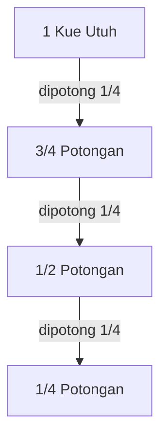

# BAB 1: Pola Bilangan — Rahasia Keteraturan Angka di Alam Semesta! 🔢✨

Pernah terpikir nggak, kenapa susunan biji bunga matahari, kelopak bunga daisy, cangkang kerang Nautilus, sampai formasi kursi di bioskop atau tumpukan gelas di kafe bisa terlihat begitu rapi dan estetis? 

Ternyata, alam semesta dan kehidupan sehari-hari kita dipenuhi oleh aturan rahasia matematika bernama **Pola Bilangan**! 

Yuk, kita santai sejenak dan jalan-jalan ke dunia angka buat membongkar gimana pola-pola ajaib ini bekerja dan bikin matematika jadi seru banget! 🚀

---

## 1. Apa Itu Pola Bilangan? (Dan Kenapa Kita Perlu Tahu?) 🤔

Secara sederhana, **Pola Bilangan** adalah susunan angka-angka yang membentuk suatu aturan atau pola tertentu yang teratur dan konsisten. 

Bayangkan seperti kamu menyusun lego atau batu bata: kalau susunannya teratur, kamu bisa memprediksi seperti apa bentuk bangunan lego di tingkat berikutnya tanpa harus memasangnya satu per satu!



### Mengenal Istilah Suku ($U$) 🏷️
Di dalam pola bilangan, tiap-tiap angka dalam urutan disebut sebagai **Suku**, yang disimbolkan dengan huruf kapital **$U$**:
* Suku ke-1 dinotasikan sebagai $U_1$ (suku pertama / awal mula)
* Suku ke-2 dinotasikan sebagai $U_2$
* Suku ke-3 dinotasikan sebagai $U_3$
* Suku ke-$n$ dinotasikan sebagai $U_n$ (rumus umum untuk mencari suku urutan ke berapa pun yang kamu mau!).

> [!WARNING]
> **Jebakan Miskonsepsi #1: Membedakan Urutan ($n$) vs Nilai Suku ($U_n$)**  
> Sering kali siswa tertukar antara **$n$** dan **$U_n$**!  
> * **$n$** adalah **Nomor Urutan / Posisi** (misal: "suku ke-5", maka $n = 5$). Nilai $n$ selalu berupa bilangan bulat positif ($1, 2, 3, \dots$).
> * **$U_n$** adalah **Nilai Angka** yang ada di posisi ke-$n$ tersebut (misal: pada barisan $2, 4, 6, 8, 10$, nilai suku ke-5 adalah $U_5 = 10$).
> 
> *Tips mudah:* $n$ itu seperti **nomor antrean**, sedangkan $U_n$ adalah **orang yang memegang nomor antrean** tersebut!

> [!NOTE]
> **Kenapa Belajar Pola Bilangan Itu Keren?**  
> Menguasai pola bilangan bakal mengasah kemampuan pemecahan masalah (*Critical Thinking*) dan bikin kamu jago menemukan rahasia tersembunyi di balik deretan data angka. Kamu bisa memprediksi jumlah kursi bioskop, perhitungan kelinci/bakteri, sampai rahasia kode pemrograman!

---

## 2. Galeri Jenis-Jenis Pola Bilangan Populer 🎨

Yuk, kita kenalan sama 9 jenis pola bilangan yang paling sering muncul di sekitar kita:

---

### 2.1 Pola Bilangan Ganjil 1️⃣3️⃣5️⃣
* **Konsep Santai**: Susunan angka ganjil asli yang kalau dibagi 2 pasti ada sisa $1$.
* **Barisan Angka**: $1, 3, 5, 7, 9, 11, 13, \dots$
* **Visualisasi Objek**:
  ```mermaid
  graph LR
      subgraph S1["n = 1"]
          A1["●<br/>(Total: 1)"]
      end
      subgraph S2["n = 2"]
          A2["● ● ●<br/>(Total: 3)"]
      end
      subgraph S3["n = 3"]
          A3["● ● ● ● ●<br/>(Total: 5)"]
      end
      S1 -->|"+2"| S2 -->|"+2"| S3
  ```
* **Rumus Ajaib $U_n$**:
  $$U_n = 2n - 1$$
* **Contoh Cepat**: Berapa suku ke-20 ($U_{20}$)? Tinggal masukkan $n=20 \to U_{20} = 2(20) - 1 = 39$. Gampang kan?

---

### 2.2 Pola Bilangan Genap 2️⃣4️⃣6️⃣
* **Konsep Santai**: Susunan angka genap yang habis dibagi 2 tanpa sisa.
* **Barisan Angka**: $2, 4, 6, 8, 10, 12, 14, \dots$
* **Visualisasi Objek**:
  ```mermaid
  graph LR
      subgraph S1["n = 1"]
          A1["● ●<br/>(Total: 2)"]
      end
      subgraph S2["n = 2"]
          A2["● ● ● ●<br/>(Total: 4)"]
      end
      subgraph S3["n = 3"]
          A3["● ● ● ● ● ●<br/>(Total: 6)"]
      end
      S1 -->|"+2"| S2 -->|"+2"| S3
  ```
* **Rumus Ajaib $U_n$**:
  $$U_n = 2n$$
* **Contoh Cepat**: Suku ke-15 ($U_{15}$) adalah $U_{15} = 2(15) = 30$.

---

### 2.3 Pola Bilangan Persegi (Kuadrat) ⬛
* **Konsep Santai**: Jumlah objeknya kalau disusun bakal membentuk bidang persegi (bujur sangkar). Nilainya merupakan hasil kuadrat urutan sukunya.
* **Barisan Angka**: $1, 4, 9, 16, 25, 36, 49, 64, \dots$
* **Visualisasi Objek**:
  ```mermaid
  graph LR
      subgraph S1["n = 1 (1x1)"]
          A1["●<br/>(Total: 1)"]
      end
      subgraph S2["n = 2 (2x2)"]
          A2["● ●<br/>● ●<br/>(Total: 4)"]
      end
      subgraph S3["n = 3 (3x3)"]
          A3["● ● ●<br/>● ● ●<br/>● ● ●<br/>(Total: 9)"]
      end
      S1 -->|"1² = 1"| S2 -->|"2² = 4"| S3 -->|"3² = 9"| S4["..."]
  ```
* **Rumus Ajaib $U_n$**:
  $$U_n = n^2$$
* **Contoh Cepat**: Suku ke-25 ($U_{25}$) adalah $25^2 = 625$.

---

### 2.4 Pola Bilangan Persegi Panjang ▭
* **Konsep Santai**: Susunan titik yang membentuk pola persegi panjang, di mana panjangnya selalu $(n+1)$ dan lebarnya $n$.
* **Barisan Angka**: $2, 6, 12, 20, 30, 42, 56, \dots$
* **Visualisasi Objek**:
  ```mermaid
  graph LR
      subgraph S1["n = 1 (1x2)"]
          A1["● ●<br/>(Total: 2)"]
      end
      subgraph S2["n = 2 (2x3)"]
          A2["● ● ●<br/>● ● ●<br/>(Total: 6)"]
      end
      subgraph S3["n = 3 (3x4)"]
          A3["● ● ● ●<br/>● ● ● ●<br/>● ● ● ●<br/>(Total: 12)"]
      end
      S1 -->|"1×2 = 2"| S2 -->|"2×3 = 6"| S3 -->|"3×4 = 12"| S4["..."]
  ```
* **Rumus Ajaib $U_n$**:
  $$U_n = n(n + 1)$$
* **Contoh Cepat**: Suku ke-8 ($U_8$) adalah $8 \times (8 + 1) = 8 \times 9 = 72$.

---

### 2.5 Pola Bilangan Segitiga 🔺
* **Konsep Santai**: Susunan titik yang membentuk segitiga sama sisi. Uniknya, nilainya persis separuh dari pola persegi panjang!
* **Barisan Angka**: $1, 3, 6, 10, 15, 21, 28, \dots$
* **Visualisasi Objek**:
  ```mermaid
  graph LR
      subgraph S1["n = 1"]
          A1["●<br/>(Total: 1)"]
      end
      subgraph S2["n = 2"]
          A2["●<br/>● ●<br/>(Total: 3)"]
      end
      subgraph S3["n = 3"]
          A3["●<br/>● ●<br/>● ● ●<br/>(Total: 6)"]
      end
      subgraph S4["n = 4"]
          A4["●<br/>● ●<br/>● ● ●<br/>● ● ● ●<br/>(Total: 10)"]
      end
      S1 -->|"+2"| S2 -->|"+3"| S3 -->|"+4"| S4
  ```
* **Pola Penjumlahan**: $1 \to (+2) \to 3 \to (+3) \to 6 \to (+4) \to 10 \to (+5) \to 15$.
* **Rumus Ajaib $U_n$**:
  $$U_n = \frac{n(n + 1)}{2}$$
* **Contoh Cepat**: Suku ke-10 ($U_{10}$) adalah $\frac{10 \times 11}{2} = 55$.

---

### 2.6 Pola Bilangan Segitiga Pascal 🔺🏛️
* **Konsep Santai**: Ditemukan oleh matematikawan Prancis bernama **Blaise Pascal**. Aturannya unik banget: pinggirannya selalu angka $1$, dan angka di dalamnya adalah hasil penjumlahan dua angka tepat di atasnya!

* **Visual Penjumlahan Menara Segitiga Pascal**:
  ```mermaid
  graph TD
      R1_1["1"]
      
      R2_1["1"]
      R2_2["1"]
      
      R3_1["1"]
      R3_2["2"]
      R3_3["1"]
      
      R4_1["1"]
      R4_2["3"]
      R4_3["3"]
      R4_4["1"]
      
      R5_1["1"]
      R5_2["4"]
      R5_3["6"]
      R5_4["4"]
      R5_5["1"]

      R1_1 --> R2_1
      R1_1 --> R2_2

      R2_1 --> R3_1
      R2_1 --> R3_2
      R2_2 --> R3_2
      R2_2 --> R3_3

      R3_1 --> R4_1
      R3_1 --> R4_2
      R3_2 --> R4_2
      R3_2 --> R4_3
      R3_3 --> R4_3
      R3_3 --> R4_4

      R4_1 --> R5_1
      R4_1 --> R5_2
      R4_2 --> R5_2
      R4_2 --> R5_3
      R4_3 --> R5_3
      R4_3 --> R5_4
      R4_4 --> R5_4
      R4_4 --> R5_5
  ```

* **Susunan Piramida & Total Angka Tiap Baris**:
  ```text
                  1                 ───> Baris 1 (Total: 1  = 2⁰)
                1   1               ───> Baris 2 (Total: 2  = 2¹)
              1   2   1             ───> Baris 3 (Total: 4  = 2²)
            1   3   3   1           ───> Baris 4 (Total: 8  = 2³)
          1   4   6   4   1         ───> Baris 5 (Total: 16 = 2⁴)
        1   5  10  10   5   1       ───> Baris 6 (Total: 32 = 2⁵)
  ```

* **Rumus Jumlah Angka Baris ke-$n$**:
  $$U_n = 2^{n - 1}$$
* **Contoh Cepat**: Jumlah angka pada baris ke-9 ($U_9$) adalah $2^{9-1} = 2^8 = 256$.

---

### 2.7 Pola Bilangan Aritmetika (Selisih Tetap) ➕
* **Konsep Santai**: Barisan angka yang selisih/bedanya ($b$) antar dua suku berurutan selalu sama persis.
* **Bentuk Umum**: $a, (a+b), (a+2b), (a+3b), \dots$
* **Rumus Ajaib $U_n$**:
  $$U_n = a + (n - 1)b$$
  *(dengan $a = U_1$ sebagai suku pertama, dan $b = U_2 - U_1$ sebagai beda/selisih).*
* **Contoh Cepat**: Barisan $4, 9, 14, 19, 24, \dots$ punya $a=4$ dan $b=5$. Suku ke-10 ($U_{10}$) = $4 + (10-1)5 = 4 + 45 = 49$.

---

### 2.8 Pola Bilangan Geometri (Pengali Tetap) ✖️
* **Konsep Santai**: Barisan angka yang perkaliannya/rasionya ($r$) antar dua suku berurutan selalu konstan.
* **Bentuk Umum**: $a, ar, ar^2, ar^3, \dots$
* **Rumus Ajaib $U_n$**:
  $$U_n = a \cdot r^{n - 1}$$
  *(dengan $a = U_1$ sebagai suku pertama, dan $r = \frac{U_2}{U_1}$ sebagai rasio pengali).*
* **Contoh Cepat**: Barisan pembelahan bakteri $2, 4, 8, 16, 32, \dots$ punya $a=2$ dan $r=2$. Suku ke-7 ($U_7$) = $2 \cdot 2^{7-1} = 2 \cdot 64 = 128$.

> [!WARNING]
> **Jebakan Miskonsepsi #2: Barisan Turun (Beda Negatif $b < 0$ & Rasio Pecahan $0 < r < 1$)**  
> Tidak semua barisan makin ke kanan nilainya makin besar!  
> 1. **Aritmetika Turun ($b < 0$)**: Jika angka semakin mengecil (contoh: $20, 17, 14, 11, \dots$), bedanya bernilai **negatif** ($b = 17 - 20 = -3$). Wajib gunakan tanda minus saat menghitung: $U_n = 20 + (n-1)(-3)$.
> 2. **Geometri Turun ($0 < r < 1$)**: Jika angka mengecil secara rasional (contoh: $80, 40, 20, 10, \dots$), rasionya berupa **pecahan** ($r = \frac{40}{80} = \frac{1}{2}$). Jangan pernah keliru menganggap ini barisan pengurangan biasa!

---

### 2.9 Pola Bilangan Fibonacci 🌀
* **Konsep Santai**: Barisan paling ajaib di alam semesta! Suku berikutnya adalah hasil **penjumlahan dari dua suku tepat sebelumnya**.
* **Barisan Angka**: $1, 1, 2, 3, 5, 8, 13, 21, 34, 55, \dots$
* **Rumus Rekursif**:
  $$U_n = U_{n-1} + U_{n-2} \quad (\text{mulai } n \ge 3)$$
* **Fakta Keren**: Pola Fibonacci inilah yang menentukan jumlah spiral pada biji bunga matahari, kelopak bunga, dan pola cangkang kerang!

---

## 3. Mengenal Deret Matematika ($S_n$) — Menjumlahkan Suku-Suku Ajaib! ➕✨

Pernahkah kamu penasaran berapa **total jumlah seluruh angka** dari suku pertama sampai suku ke-$n$? 

Kalau **Barisan** bertugas mencatat urutan angkanya ($U_1, U_2, U_3, \dots, U_n$), maka **Deret** bertugas **menjumlahkan seluruh suku-suku tersebut**! 

* **Notasi Deret**: Disimbolkan dengan **$S_n$** (singkatan dari *Sum of $n$ terms* / Jumlah $n$ suku pertama).
  $$S_n = U_1 + U_2 + U_3 + \dots + U_n$$

> [!WARNING]
> **Jebakan Miskonsepsi #3: Membedakan $U_n$ (Suku Tunggal) vs $S_n$ (Akumulasi Jumlah)**  
> Ini jebakan nomor satu di soal cerita ujian! Perhatikan kata kunci pertanyaannya:  
> * **Gunakan $U_n$** jika soal menanyakan **nilai pada satu posisi tertentu** (contoh: *"Berapa banyak buku pada rak ke-10?"* atau *"Berapa tinggi pohon pada bulan ke-5?"*).  
> * **Gunakan $S_n$** jika soal menanyakan **total gabungan / akumulasi seluruh suku** dari awal sampai posisi tertentu (contoh: *"Berapa total seluruh buku di rak 1 sampai 10?"* atau *"Berapa jumlah seluruh kursi di gedung bioskop?"*).

> [!TIP]
> **Kisah Hebat Gauss Kecil (Trik Penjumlahan Cepat)**  
> Saat matematikawan jenius **Carl Friedrich Gauss** masih berusia 10 tahun, gurunya memberi tugas hukuman: *"Jumlahkan seluruh angka dari 1 sampai 100!"*  
> Bayangkan $1 + 2 + 3 + \dots + 99 + 100$. Teman-temannya menghitung satu per satu, tapi Gauss hanya butuh beberapa detik!  
> **Caranya?** Gauss memasangkan angka dari depan dan belakang:
> * $1 + 100 = 101$
> * $2 + 99 = 101$
> * $3 + 98 = 101$  
> Ada 50 pasangan yang nilainya $101$, jadi hasilnya: $50 \times 101 = 5.050$!  
> Trik pasangan Gauss inilah yang menjadi cikal bakal **Rumus Deret Aritmetika**! 🧠💡

---

### 3.1 Deret Aritmetika (Jumlah Suku Beda Tetap) ➕
Deret Aritmetika adalah penjumlahan suku-suku dari barisan aritmetika.

* **Rumus Ajaib $S_n$**:
  Jika diketahui suku pertama ($a$) dan suku terakhir ($U_n$):
  $$S_n = \frac{n}{2} (a + U_n)$$
  
  Jika suku terakhir ($U_n$) belum diketahui:
  $$S_n = \frac{n}{2} \left[ 2a + (n - 1)b \right]$$

* **Contoh Cepat**: 
  Di sebuah bioskop, baris ke-1 ada $10$ kursi ($a=10$), dan setiap baris ke belakang bertambah $4$ kursi ($b=4$). Berapa **total kursi** jika bioskop tersebut memiliki $12$ baris kursi ($n=12$)?
  $$\begin{aligned}
  S_{12} &= \frac{12}{2} \left[ 2(10) + (12 - 1)4 \right] \\
  &= 6 \left[ 20 + (11 \times 4) \right] \\
  &= 6 \left[ 20 + 44 \right] = 6 \times 64 = 384 \text{ kursi.}
  \end{aligned}$$

---

### 3.2 Deret Geometri (Jumlah Suku Pengali Tetap) ✖️
Deret Geometri adalah penjumlahan suku-suku dari barisan geometri.

* **Rumus Ajaib $S_n$**:
  * Untuk rasio $r > 1$ (barisan makin besar):
    $$S_n = \frac{a(r^n - 1)}{r - 1}$$
  * Untuk rasio $r < 1$ (barisan makin kecil):
    $$S_n = \frac{a(1 - r^n)}{1 - r}$$

* **Contoh Cepat**: 
  Mula-mula ada $3$ sel amuba ($a=3$) yang membelah diri menjadi $2$ kali lipat tiap jam ($r=2$). Berapa **total jumlah sel** yang dihasilkan dari generasi awal sampai pembelahan ke-5 ($n=5$)?
  $$S_5 = \frac{3(2^5 - 1)}{2 - 1} = \frac{3(32 - 1)}{1} = 3 \times 31 = 93 \text{ sel.}$$

---

### 3.3 Hubungan $S_n$ dengan $U_n$ & Deret Khusus 🔗

#### 1. Hubungan $S_n$ dan $U_n$
Jika kamu tahu rumus jumlah suku ($S_n$), kamu bisa menemukan nilai suku ke-$n$ ($U_n$) tanpa harus menghitung dari awal dengan rumus:
$$U_n = S_n - S_{n-1}$$
*(Artinya: Suku ke-$n$ adalah Total Jumlah $n$ Suku dikurangi Total Jumlah $(n-1)$ Suku).*

#### 2. Deret Khusus (Jumlah Pola Geometris & Angka Populer)
Selain deret aritmetika dan geometri umum, terdapat beberapa rumus cepat jumlah suku pertama ($S_n$) untuk pola bilangan khusus:

* **Jumlah $n$ Bilangan Ganjil Pertama**:
  $$S_n = 1 + 3 + 5 + \dots + (2n-1) = n^2$$
* **Jumlah $n$ Bilangan Genap Pertama**:
  $$S_n = 2 + 4 + 6 + \dots + 2n = n(n+1)$$
* **Deret Pola Persegi (Jumlah Kuadrat Bilangan Asli)**:
  $$S_n = 1^2 + 2^2 + 3^2 + \dots + n^2 = \frac{n(n+1)(2n+1)}{6}$$
  *Penjelasan Konsep:* Menjumlahkan luas bidang persegi dari ukuran $1\times 1$ hingga $n\times n$ (membentuk akumulasi tumpukan piramida kuadrat).
* **Deret Pola Persegi Panjang**:
  $$S_n = (1\times 2) + (2\times 3) + (3\times 4) + \dots + n(n+1) = \frac{n(n+1)(n+2)}{3}$$
  *Penjelasan Konsep:* Menjumlahkan seluruh pasangan produk dua bilangan asli berurutan.
* **Deret Pola Segitiga (Bilangan Tetrahedral)**:
  $$S_n = 1 + 3 + 6 + 10 + \dots + \frac{n(n+1)}{2} = \frac{n(n+1)(n+2)}{6}$$
  *Penjelasan Konsep:* Akumulasi penjumlahan dari suku-suku pola segitiga, membentuk tumpukan piramida segitiga 3 dimensi (tetrahedron).

---

## 4. Trik Detektif: Cara Menebak Rumus Barisan Acak 🕵️‍♂️

Gimana kalau di ujian kamu dikasih deretan angka yang nggak ada di daftar atas? Jangan panik! Gunakan langkah-langkah detektif ini:

### Langkah 1: Cek Selisih Antar Suku (Tingkat 1)
Kurangkan suku-suku berurutan: $U_2 - U_1, U_3 - U_2, U_4 - U_3, \dots$
* Kalau selisihnya **sama terus** $\to$ Fix ini **Aritmetika** ($U_n = a + (n-1)b$).
* Kalau selisihnya **berubah tapi teratur** $\to$ Ini **Barisan Bertingkat (Berderajat 2 / Kuadrat)**.

---

### Langkah 2: Analisis Barisan Bertingkat (Manual vs Aljabar Formal)

#### A. Pendekatan Manual (Cepat untuk Suku-Suku Dekat)
Misal barisannya: $3, 8, 14, 21, 29, \dots$
* **Selisih Tingkat 1**:
  * $8 - 3 = +5$
  * $14 - 8 = +6$
  * $21 - 14 = +7$
  * $29 - 21 = +8$
* Selisihnya selalu bertambah $+1$ tiap langkah!
* Berarti selisih berikutnya adalah $+9$ dan $+10$.
* Suku ke-6 ($U_6$) = $29 + 9 = 38$
* Suku ke-7 ($U_7$) = $38 + 10 = 48$. Mudah banget kan untuk suku yang dekat?

---

#### B. Metode Aljabar Formal 3 Langkah ($U_n = an^2 + bn + c$)
Bagaimana kalau soal menanyakan suku yang sangat jauh, seperti **$U_{50}$**?  
Menghitung manual satu per satu akan memakan waktu terlalu lama. Gunakan **Metode Aljabar 3 Persamaan Kunci**:

$$\begin{aligned}
\text{1. Selisih Konstan Tingkat 2} &\implies 2a = \text{tingkat 2} \\
\text{2. Selisih Pertama Tingkat 1} &\implies 3a + b = U_2 - U_1 \\
\text{3. Suku Pertama } (U_1) &\implies a + b + c = U_1
\end{aligned}$$

#### Contoh Soal Terbimbing: Mencari Rumus $U_n$ dan $U_{50}$ Barisan Bertingkat
Diketahui barisan bertingkat: **$5, 11, 19, 29, 41, \dots$**. Tentukan rumus suku ke-$n$ ($U_n$) dan hitung nilai $U_{50}$!

* **Langkah 1: Skema Selisih Bertingkat (Piramida Penurunan)**

  ![[diagram_mathematics_number_patterns_multilevel_scheme.webp|Skema Pola Bilangan Bertingkat Dua]]


  > [!TIP]
  > **📌 3 Angka Kunci Diagonal Kiri (Bahan Rumus $U_n = an^2 + bn + c$):**  
  > Ambil angka paling kiri dari setiap tingkat untuk dimasukkan ke 3 persamaan kunci:  
  > 1. **Angka pertama barisan utama**: $5 \implies a + b + c = 5$  
  > 2. **Angka pertama selisih tingkat 1**: $+6 \implies 3a + b = 6$  
  > 3. **Angka konstan selisih tingkat 2**: $+2 \implies 2a = 2$


* **Langkah 2: Selesaikan 3 Persamaan Aljabar**
  1. **Persamaan Tingkat 2 (Cari nilai $a$)**:
     $$2a = 2 \implies a = \frac{2}{2} = 1$$
  2. **Persamaan Tingkat 1 (Cari nilai $b$)**:
     $$3a + b = 6 \implies 3(1) + b = 6 \implies 3 + b = 6 \implies b = 3$$
  3. **Persamaan Suku Pertama (Cari nilai $c$)**:
     $$a + b + c = 5 \implies 1 + 3 + c = 5 \implies 4 + c = 5 \implies c = 1$$

* **Langkah 3: Tulis Rumus Umum $U_n$**
  $$U_n = an^2 + bn + c \implies U_n = n^2 + 3n + 1$$

* **Langkah 4: Hitung Suku ke-50 ($U_{50}$)**
  $$\begin{aligned}
  U_{50} &= (50)^2 + 3(50) + 1 \\
  &= 2500 + 150 + 1 = 2651
  \end{aligned}$$

> [!TIP]
> **Perbandingan Efisiensi:**  
> Jika dihitung manual, kamu harus mencari 49 selisih berurutan! Dengan rumus aljabar $U_n = n^2 + 3n + 1$, nilai $U_{50} = 2651$ langsung ditemukan secara presisi. 🚀

---

## 5. Contoh Soal Terbimbing (Bahas Tuntas Santai!) 💡

### Contoh Soal 1: Penataan Buku Perpustakaan 📚
* **Soal**: Pak Marno minta Andi menyusun buku di rak perpustakaan. Rak ke-1 ada $6$ buku, rak ke-2 ada $11$ buku, rak ke-3 ada $16$ buku, dan rak ke-4 ada $21$ buku. Berapa banyak buku di rak ke-10 ($U_{10}$)?

* **Pembahasan Santai**:
  1. Cek barisannya: $6, 11, 16, 21, \dots$
  2. Suku awal ($a$) = $6$
  3. Selisih/beda ($b$) = $11 - 6 = 5$ (selisihnya konstan $+5$, berarti Aritmetika!)
  4. Masukkan ke rumus $U_n = a + (n-1)b$:
     $$U_{10} = 6 + (10 - 1) \times 5 = 6 + (9 \times 5) = 6 + 45 = 51$$
  * **Kesimpulan**: Di rak ke-10 bakal ada **51 buah buku**.

---

### Contoh Soal 2: Pola Bertingkat Sederhana 📈
* **Soal**: Diketahui barisan $4, 6, 9, 13, 18, \dots$. Tentukan dua suku berikutnya ($U_6$ dan $U_7$)!

* **Pembahasan Santai**:
  1. Mari kita bedah selisihnya:
     * $6 - 4 = +2$
     * $9 - 6 = +3$
     * $13 - 9 = +4$
     * $18 - 13 = +5$
  2. Selisihnya berurutan nambah $+1$ ($+2, +3, +4, +5, \dots$).
  3. Selisih berikutnya pasti $+6$ dan $+7$.
  4. Suku ke-6 ($U_6$) = $18 + 6 = 24$.
  5. Suku ke-7 ($U_7$) = $24 + 7 = 31$.
  * **Kesimpulan**: Dua suku berikutnya adalah **24 dan 31**.

---

### Contoh Soal 3: Total Kursi Gedung Bioskop (Deret Aritmetika) 🎟️
* **Soal**: Sebuah gedung pertunjukan memiliki $15$ baris kursi. Baris terdepan berisi $20$ kursi, baris kedua $24$ kursi, baris ketiga $28$ kursi, dan seterusnya bertambah $4$ kursi untuk tiap baris di belakangnya. Berapa total seluruh kursi di gedung pertunjukan tersebut ($S_{15}$)?

* **Pembahasan Santai**:
  1. Identifikasi data: $a = 20$, $b = 4$, $n = 15$.
  2. Karena ditanya **total seluruh kursi**, gunakan rumus Deret Aritmetika ($S_n$):
     $$S_n = \frac{n}{2} \left[ 2a + (n-1)b \right]$$
  3. Hitung $S_{15}$:
     $$S_{15} = \frac{15}{2} \left[ 2(20) + (15-1)4 \right] = 7,5 \times \left[ 40 + (14 \times 4) \right] = 7,5 \times (40 + 56) = 7,5 \times 96 = 720$$
  * **Kesimpulan**: Total seluruh kursi di gedung pertunjukan adalah **720 kursi**.

---

## 6. Ringkasan Cheatsheet Rumus Ajaib ⚡

| Jenis Pola / Barisan | Rumus Suku ke-$n$ ($U_n$) | Rumus Jumlah $n$ Suku Pertama ($S_n$) |
| :--- | :--- | :--- |
| **Ganjil** | $U_n = 2n - 1$ | $S_n = n^2$ |
| **Genap** | $U_n = 2n$ | $S_n = n(n + 1)$ |
| **Persegi** | $U_n = n^2$ | $S_n = \frac{n(n+1)(2n+1)}{6}$ |
| **Persegi Panjang** | $U_n = n(n + 1)$ | $S_n = \frac{n(n+1)(n+2)}{3}$ |
| **Segitiga** | $U_n = \frac{n(n + 1)}{2}$ | $S_n = \frac{n(n+1)(n+2)}{6}$ |
| **Segitiga Pascal** (Total Baris) | $U_n = 2^{n-1}$ | $S_n = 2^n - 1$ |
| **Aritmetika** | $U_n = a + (n-1)b$ | $S_n = \frac{n}{2}(a + U_n)$ atau $S_n = \frac{n}{2}[2a + (n-1)b]$ |
| **Geometri** | $U_n = a \cdot r^{n-1}$ | $S_n = \frac{a(r^n - 1)}{r - 1}$ (jika $r>1$) atau $\frac{a(1 - r^n)}{1 - r}$ (jika $r<1$) |
| **Fibonacci** | $U_n = U_{n-1} + U_{n-2}$ | $S_n = U_{n+2} - 1$ |

---

> **Yuk, Refleksi Sejenak!**  
> Belajar pola bilangan dan deret membuktikan kalau matematika itu bukan cuma sekadar angka yang bikin pusing, tapi bahasa alam semesta yang rapi dan indah. *Keep learning and stay curious!* ✨

---

## 📝 Lembar Kerja & Soal Evaluasi Terkait
- 📝 [[LKPD_dan_Soal_Pola_Bilangan]]
- 🍎 [[index_teaching|Teaching Resources Hub]]

