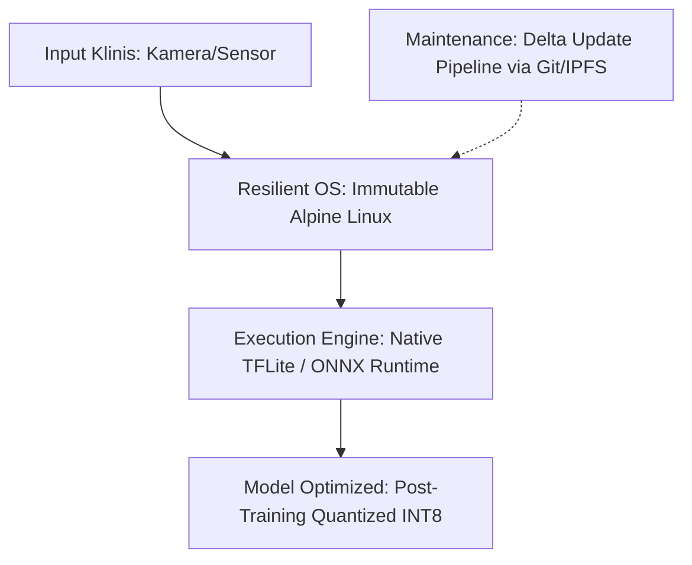

# Kajian Justifikasi Pivot: Mengapa Kita Harus Drop WebAssembly (WASM)?

Dokumen ini merangkum argumen teknis dan strategis untuk melakukan *pivot* arsitektur [[Cetak Biru KTI]] dengan menghapus layer WebAssembly (WasmEdge + WASI-NN). Jadikan dokumen ini sebagai bahan diskusi tim.

---

## 1. Reality Check: Hubungan WASM vs Masalah 3T

Setelah membedah ulang tiga pain point utama di daerah 3T (Bandwidth, Hardware, Listrik), peran WASM ternyata **tidak menyelesaikan masalah tersebut secara langsung**:

*   **Bandwidth Rendah (Konektivitas):** Diselesaikan oleh *on-device local inference* (offline). Runtime apapun (Python, C++, TFLite, WASM) bisa berjalan secara offline.
*   **Hardware Terbatas (RPi 4):** Diselesaikan oleh model quantization (INT8/FP16) dan runtime yang ringan. TFLite atau ONNX Runtime secara native justru memiliki footprint memori yang lebih kecil dibanding berjalan di atas emulator/sandbox WASM.
*   **Listrik Tidak Stabil:** Diselesaikan di layer OS (Immutable OS, watchdog, journaling file system), bukan di runtime aplikasi.

> [!IMPORTANT]
> WASM dirancang untuk **keamanan sandboxing** dan **portabilitas lintas platform (heterogen)**. Di Puskesmas 3T, hardware bersifat *homogen* (Raspberry Pi 4) dan *single-purpose* (hanya menjalankan satu model klinis). Keunggulan isolasi WASM menjadi tidak relevan.

---

## 2. Argumen Teknis untuk Drop WASM

Berikut adalah tiga alasan kuat mengapa tim harus drop WASM demi keberhasilan proyek KTI ini:

### A. Risiko Kompilasi & Support ARM64 (Risiko Sangat Tinggi)
Riset terbaru menunjukkan bahwa WasmEdge dengan backend WASI-NN **tidak menyediakan pre-built plugin TFLite untuk Linux ARM64** (hanya tersedia untuk Android AArch64 atau x86_64).
*   **Dampak:** Tim harus melakukan kompilasi WasmEdge dan plugin WASI-NN langsung dari source di RPi 4.
*   **Risiko:** Jika terjadi error dependensi, ketidakcocokan ABI (*Application Binary Interface*), atau crash compiler di ARM, seluruh proyek bisa terhenti total karena runtime eksekusi gagal di-build.

### B. Masalah Efisiensi Quantization (Performance Overhead)
Quantization INT8 tidak otomatis membuat model berjalan lebih cepat di RPi 4.
*   ONNX Runtime dan TFLite memiliki optimasi kernel ARM native yang matang.
*   Jika dijalankan di atas WASM, overhead proses translasi instruksi dan operasi kuantisasi/dekuantisasi justru berpotensi membuat model INT8 berjalan **lebih lambat** daripada model FP32 native (sebagaimana terdokumentasi di beberapa benchmark MobileNetV2 di RPi 4).

### C. Kompleksitas Integrasi (Overengineering)
Menjaga interaksi antara modul WASM dengan sistem operasi host (misalnya untuk membaca kamera atau menyimpan data sensor) membutuhkan konfigurasi WASI socket atau IPC (*Inter-Process Communication*) yang rumit. Ini membuang waktu pengerjaan KTI yang seharusnya bisa difokuskan pada pengujian model klinis.

---

## 3. Proposal Pivot: Arsitektur Resilient Edge Baru

Kita menggeser fokus novelty dari **WASM runtime isolation** (yang artificial) ke **Inference & Resiliency Pipeline** (yang secara nyata menyelesaikan masalah 3T).

### Keunggulan Arsitektur Baru:
1.  **Feasibility 100%:** Menggunakan stack yang matang dan terbukti berjalan stabil di ARM64 (Python + TFLite/ONNX Runtime).
2.  **Argumen Sistem Tetap Kuat:** Fokus riset bergeser ke bagaimana *Immutable OS* menjaga sistem dari mati listrik tiba-tiba, dan bagaimana *Delta Update* menghemat bandwidth 3T saat update model.
3.  **Metodologi Benchmarking yang Jujur:** Kita bisa membandingkan performa akurasi vs latency dari berbagai metode kuantisasi (FP32 vs FP16 vs INT8) secara native di RPi 4.

---

## 4. Poin Diskusi untuk Rapat Tim

1.  **Penerimaan Novelty:** Apakah tim sepakat bahwa mempertahankan WASM hanya untuk "terlihat keren" justru menjadi bom waktu saat sesi tanya jawab dengan juri yang kritis?
2.  **Pembagian Kerja Baru:** Jika WASM di-drop, resource tim bisa dialihkan untuk mematangkan **Immutable OS (Alpine Linux read-only)** dan **Delta-Update pipeline**. Siapa yang akan memegang bagian ini?
3.  **Penentuan Model Klinis:** Kita harus segera memilih satu model klinis konkret (misalnya screening TBC dari X-Ray atau Malaria dari blood smear) untuk mulai membuat baseline benchmark native.
