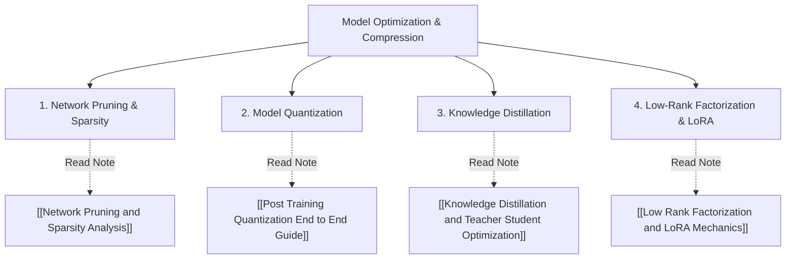

# Fundamentals of Machine Learning Optimization and Compression: Overview Map

Dokumen ini berfungsi sebagai **peta taksonomi dan navigasi utama** untuk empat pilar fundamental kompresi dan optimasi jaringan saraf (*Deep Learning Model Compression*). Setiap pilar telah diurai secara mendalam ke dalam catatan bacaan terfokus (*dedicated reading notes*):

---

## 1. Network Pruning & Sparsity Analysis
* **Fokus:** Menghapus parameter berlebih berdasarkan analisis *saliency*orde dua (ekspansi Taylor & *Optimal Brain Damage*) untuk meminimalkan kenaikan *loss* empiris.
* **Master Reading:** [[Network Pruning and Sparsity Analysis]]

---

## 2. Model Quantization
* **Fokus:** Mengonversi representasi *floating-point* ($32$-bit `FP32`) ke *integer* presisi rendah ($8$-bit `INT8`) menggunakan pemetaan afin (faktor skala $S$, titik nol $Z$) serta algoritma kalibrasi (MinMax, MSE, KL-Divergence).
* **Master Reading:** [[Post Training Quantization End to End Guide]]

---

## 3. Knowledge Distillation (Teacher-Student)
* **Fokus:** Mentransfer *"Dark Knowledge"* dari model besar (*Teacher*) ke model kecil (*Student*) melalui manipulasi distribusi *softmax* dengan *Temperature Scaling* ($T > 1$) dan peminimalan *KL Divergence*.
* **Master Reading:** [[Knowledge Distillation and Teacher Student Optimization]]

---

## 4. Low-Rank Factorization & LoRA
* **Fokus:** Memanfaatkan *low intrinsic rank* pada matriks bobot jaringan saraf menggunakan dekomposisi nilai singular (*SVD*) dan *Low-Rank Adaptation* ($W = W_0 + BA$) untuk pelatihan parameter yang efisien.
* **Master Reading:** [[Low Rank Factorization and LoRA Mechanics]]
