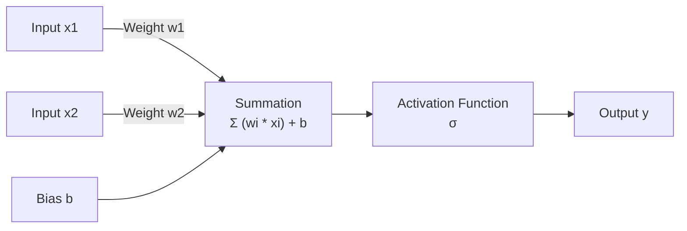

## The reading

In machine learning, **parameters** are the internal configuration variables that a model learns from training data. They represent the model's "memory" or "knowledge" and are directly adjusted by the training algorithm to make accurate predictions.

### 1. Intuition: The Sound Mixing Board Analogy
Imagine a massive sound mixing board used in a recording studio, equipped with thousands of knobs, dials, and sliders.

*   **The Mixing Board:** This is the machine learning model.
*   **The Sound Inputs:** These are the input features (e.g., raw audio signals from singers, guitars, and drums).
*   **The Output Mix:** This is the model's prediction (e.g., a balanced, clear musical output).
*   **The Knobs and Sliders:** These are the **parameters** (weights and biases).

When you first turn on the board, all the knobs are set to random positions, and the output sounds terrible. The sound engineer (the training algorithm) listens to the output, compares it to how the song should sound, and slowly adjusts each knob. Through trial and error (training), the engineer finds the exact position for every knob. Once the mix is perfect, the knob settings are locked in. The positions of those knobs are the parameters of the model.

### 2. Mathematical Definition: Weights and Biases
In deep learning and neural networks, model parameters are divided into two main types: **weights** and **biases**.

#### Weights ($w$)
Weights represent the strength of the connection between inputs and outputs. They act as multipliers that determine how much influence a specific input has on the final prediction:
*   A **positive weight** means the input directly increases the output.
*   A **negative weight** means the input decreases the output.
*   A **weight near zero** means the input is ignored.

#### Biases ($b$)
Biases represent default offsets added to the sum of the weighted inputs. They allow the model to shift its predictions up or down, regardless of the input values. A bias acts as a model's "default assumption" before seeing any data.

#### The Equation
For a single neuron with a single input $x$, the pre-activation output $z$ is:
$$z = w \cdot x + b$$

For multiple inputs, this expands to:
$$z = (w_1 \cdot x_1) + (w_2 \cdot x_2) + \dots + (w_n \cdot x_n) + b$$
Or in vector notation:
$$z = W^T X + b$$

The final output is computed by passing $z$ through a non-linear activation function $\sigma(z)$ (e.g., ReLU or Sigmoid):
$$y = \sigma(z)$$

### 3. How Parameters are Learned (Training)
Parameters are not set by human programmers. Instead, they are learned automatically through an iterative optimization process:

1.  **Initialization:** Parameters are starting with random, small decimal values.
2.  **Forward Pass:** The model makes a prediction on a training sample using its current parameters.
3.  **Loss Evaluation:** A *loss function* measures the error (difference) between the model's prediction and the actual correct answer (ground truth).
4.  **Backward Pass (Backpropagation):** The model calculates the gradient (the direction and magnitude of error) for each parameter.
5.  **Parameter Update (Gradient Descent):** The training algorithm nudges each parameter in the direction that reduces the loss:
    $$W \leftarrow W - \alpha \cdot \frac{\partial L}{\partial W}$$
    Where $\alpha$ is the learning rate. This cycle repeats millions of times until the parameters stabilize.

### 4. Parameters vs. Hyperparameters
A common source of confusion is the distinction between parameters and hyperparameters.

| Dimension | Parameters (Learned) | Hyperparameters (Configured) |
| :--- | :--- | :--- |
| **Origin** | Learned automatically from the data during training. | Set manually by the developer/data scientist. |
| **Purpose** | Defines the model's actual predictive capability. | Controls the behavior of the training algorithm. |
| **Modification** | Constantly updated via optimization (gradient descent). | Remains constant throughout a single training run. |
| **Examples** | Connection weights, layer biases, convolution kernels. | Learning rate, batch size, number of epochs, number of layers. |

### 5. Scale and Storage Implications
The number of parameters in a model determines its capacity to learn complex patterns:
*   **Linear Regression:** Typically has 2 parameters ($w$ and $b$).
*   **MobileNetV2 (mobile computer vision):** ~3.4 million parameters.
*   **ResNet-50 (standard image classifier):** ~25 million parameters.
*   **GPT-3 (large language model):** 175 billion parameters.

Because parameters are stored as high-precision decimals (usually 32-bit floating-point numbers requiring 4 bytes each), a 175-billion parameter model requires:
$$\text{Storage} = 175,000,000,000 \times 4 \text{ bytes} \approx 700 \text{ GB}$$
This massive memory requirement is why techniques like **[[Post-Training Quantization]]** are necessary to compress these weights into 8-bit integers (INT8) or 4-bit integers (INT4) for deployment on consumer hardware.

## Related Generated Readings
- [[Post Training Quantization End to End Guide]]
- [[Single Board Computers Architecture and Use Cases]]

## Concepts to extract
- [x] [[Model Parameters]]
