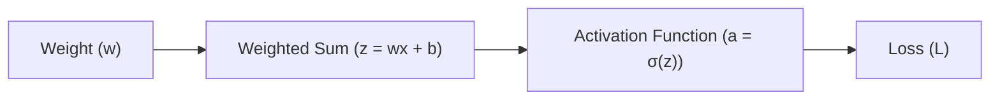
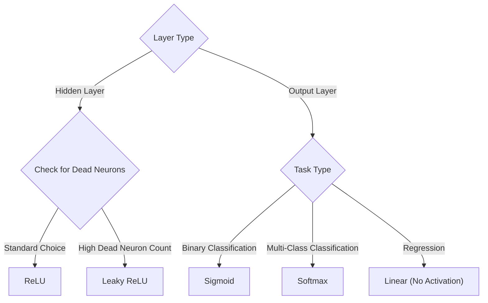

## The reading

This reading synthesizes the foundational concepts of activation functions in artificial neural networks, how they enable learning through backpropagation, and the mathematical relationship between activation slopes and weight adjustments.

---

### 1. The Core Purpose: Breaking Linearity

A single neuron performs a linear combination of its inputs, weights, and bias:
$$z = \sum (w_i \cdot x_i) + b$$

Without an activation function, the output of the neuron is simply $a = z$. Stacking multiple layers of linear neurons does not increase the learning capacity of the model. Mathematically, stacking two linear layers results in:
$$a_2 = W_2(W_1 X + b_1) + b_2 = (W_2 W_1) X + (W_2 b_1 + b_2) = W_{\text{combined}} X + b_{\text{combined}}$$

Since any sequence of linear operations collapses into a single linear operation, a 100-layer network without activation functions is mathematically equivalent to a single-layer model (limited to drawing straight lines). 

An **activation function** ($\sigma$) introduces non-linearity:
$$a = \sigma(z)$$

This allows neural networks to warp, bend, and shape the data space, enabling them to learn complex decision boundaries for tasks like image recognition and natural language processing.

---

### 2. The Mechanics of Learning: Dials, Loss, and Gradients

To train a neural network, we adjust its parameters to minimize error:
*   **Weights ($w$):** The adjustable parameters (or "dials") within the network.
*   **Loss ($L$):** A metric measuring prediction error (the difference between the model's output and the true target).

The derivative of the loss with respect to a weight ($\frac{\partial L}{\partial w}$) measures the **sensitivity** of the error to changes in that weight:
$$\frac{\partial L}{\partial w} \approx \frac{\Delta \text{ Loss}}{\Delta \text{ Weight}}$$

During optimization (Gradient Descent), weights are adjusted in the opposite direction of the gradient to reduce error:
$$w_{\text{new}} = w_{\text{old}} - \eta \cdot \frac{\partial L}{\partial w}$$
where $\eta$ is the learning rate.

*   **Positive Gradient ($\frac{\partial L}{\partial w} > 0$):** Increasing the weight increases the error. The weight must be adjusted downward.
*   **Negative Gradient ($\frac{\partial L}{\partial w} < 0$):** Increasing the weight decreases the error. The weight must be adjusted upward.
*   **Zero Gradient ($\frac{\partial L}{\partial w} \approx 0$):** Tweaking the weight has no impact on the error. The weight remains unchanged, and learning stalls.

---

### 3. How Errors Flow Back: The Chain Rule

Weights are nested deep within neural layers. During backpropagation, we calculate how a weight change propagates through the network to affect the final loss:

By the calculus **chain rule**, the gradient $\frac{\partial L}{\partial w}$ is computed by multiplying the derivatives along this path:
$$\frac{\partial L}{\partial w} = \frac{\partial L}{\partial a} \cdot \frac{\partial a}{\partial z} \cdot \frac{\partial z}{\partial w}$$

Evaluating these individual terms yields:
*   $\frac{\partial L}{\partial a}$: How the error changes with respect to the neuron's output.
*   $\frac{\partial a}{\partial z} = \sigma'(z)$: The **derivative (slope) of the activation function**.
*   $\frac{\partial z}{\partial w} = x$: The input signal passing through the weight connection.

Combining these gives the gradient update equation:
$$\frac{\partial L}{\partial w} = \frac{\partial L}{\partial a} \cdot \sigma'(z) \cdot x$$

#### The Zero-Slope Stall (Vanishing Gradient)
Because $\sigma'(z)$ is a multiplier in this chain, if the slope of the activation function is close to zero, the entire gradient collapses to zero:
$$\frac{\partial L}{\partial w} \approx \frac{\partial L}{\partial a} \cdot 0 \cdot x = 0$$

Consequently, $w_{\text{new}} = w_{\text{old}}$, and the weights stop updating. This phenomenon is known as the **vanishing gradient problem**.

---

### 4. Common Activation Functions

#### Sigmoid Function
*   **Formula:** $\sigma(z) = \frac{1}{1 + e^{-z}}$
*   **Range:** $(0, 1)$
*   **Primary Use Case:** Output layer of binary classifiers (outputs probability).
*   **Drawback:** Vanishing Gradient. For very large positive or negative inputs, the function flatlines, causing the derivative $\sigma'(z)$ to approach $0$.

#### Tanh (Hyperbolic Tangent) Function
*   **Formula:** $\tanh(z) = \frac{e^z - e^{-z}}{e^z + e^{-z}}$
*   **Range:** $(-1, 1)$
*   **Primary Use Case:** Hidden layers of neural networks.
*   **Advantage:** Zero-centered output helps speed up convergence during training.
*   **Drawback:** Still saturates at extreme inputs, leading to vanishing gradients.

#### ReLU (Rectified Linear Unit)
*   **Formula:** $f(z) = \max(0, z)$
*   **Range:** $[0, \infty)$
*   **Primary Use Case:** Hidden layers of modern deep networks.
*   **Advantages:** Simple to compute (fast) and does not saturate for positive inputs (slope is constant at $1.0$).
*   **Drawback:** *Dying ReLU*. If a neuron's weights are adjusted such that it only receives negative inputs, it will output $0$ with a slope of $0$ permanently. The neuron dies and ceases to learn.

#### Leaky ReLU
*   **Formula:** $f(z) = \max(\alpha z, z)$ where $\alpha \approx 0.01$.
*   **Range:** $(-\infty, \infty)$
*   **Primary Use Case:** Solves the Dying ReLU problem.
*   **Advantage:** Provides a small, non-zero slope ($0.01$) for negative inputs, keeping the gradient alive.

#### Softmax Function
*   **Formula:** $\text{Softmax}(z_i) = \frac{e^{z_i}}{\sum_{j} e^{z_j}}$
*   **Range:** $(0, 1)$ (the sum of all outputs equals exactly $1.0$).
*   **Primary Use Case:** Output layer for multi-class classification.
*   **Advantage:** Converts raw scores into mutually exclusive class probabilities.

---

### 5. Architectural Guide: Selecting Activation Functions

## Related Generated Readings
- [[Machine Learning Roadmap]]
- [[Post Training Quantization End to End Guide]]

## Concepts to extract
- [x] [[Activation Functions]]
- [x] [[Sigmoid Function]]
- [x] [[Tanh Function]]
- [x] [[ReLU Function]]
- [x] [[Leaky ReLU Function]]
- [x] [[Softmax Function]]
