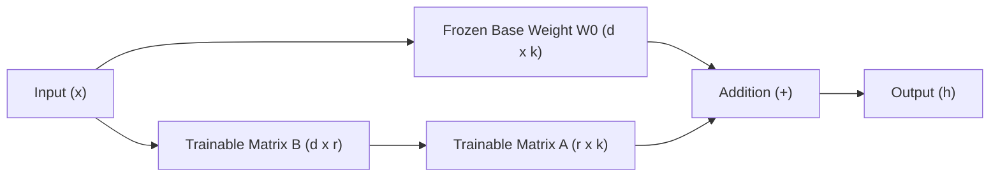

# Low-Rank Factorization and LoRA Mechanics

Over-parameterized deep neural networks contain weight matrices $W \in \mathbb{R}^{d \times k}$ whose intrinsic information capacity resides in a significantly lower-dimensional subspace (*low intrinsic rank*). Low-rank factorization techniques exploit this property to accelerate inference and enable parameter-efficient fine-tuning (PEFT).

---

## 1. Singular Value Decomposition (SVD)

Any real weight matrix $W \in \mathbb{R}^{d \times k}$ can be factorized via SVD:

$$W = U \Sigma V^T$$

Where:
- $U \in \mathbb{R}^{d \times d}$ and $V \in \mathbb{R}^{k \times k}$ are orthogonal matrices.
- $\Sigma \in \mathbb{R}^{d \times k}$ contains singular values $\sigma_1 \geq \sigma_2 \geq \dots \geq \sigma_{\min(d,k)} \geq 0$.

Truncating $\Sigma$ to retain only the top $r$ singular values ($r \ll \min(d,k)$) yields the optimal rank-$r$ approximation $\hat{W}$ under the Frobenius norm (**Eckart-Young-Mirsky Theorem**):

$$\hat{W} = U_r \Sigma_r V_r^T$$

This reduces computational matrix multiplication complexity from $\mathcal{O}(d \cdot k)$ to $\mathcal{O}(r \cdot (d + k))$.

---

## 2. Low-Rank Adaptation (LoRA)

During fine-tuning of large foundation models, Low-Rank Adaptation (LoRA) freezes frozen base weights $W_0 \in \mathbb{R}^{d \times k}$ and parametrizes the weight update matrix $\Delta W$ using two low-rank matrices $A \in \mathbb{R}^{r \times k}$ and $B \in \mathbb{R}^{d \times r}$:

$$W = W_0 + \Delta W = W_0 + B A$$

### Forward Pass Execution
For input vector $x \in \mathbb{R}^{1 \times d}$:

$$h = x W_0 + \frac{\gamma}{r} (x B) A$$

Where $\frac{\gamma}{r}$ is a scaling hyperparameter.

### Advantages
1. **Memory Efficiency:** Reduces trainable parameters by $>99\%$ (e.g., training millions of parameters instead of 7+ billion).
2. **Zero Inference Latency:** Matrix product $B A$ can be pre-merged into $W_0$ prior to deployment ($W_{\text{deploy}} = W_0 + B A$).

---

## Related Generated Readings
- [[Fundamentals of Machine Learning Optimization and Compression]]
- [[Network Pruning and Sparsity Analysis]]
- [[Knowledge Distillation and Teacher Student Optimization]]
- [[Post Training Quantization End to End Guide]]
