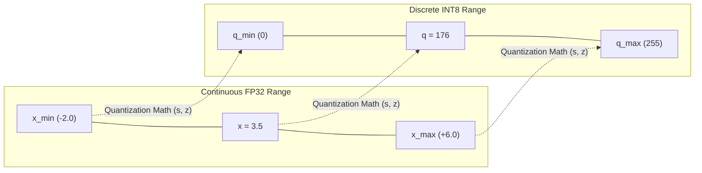
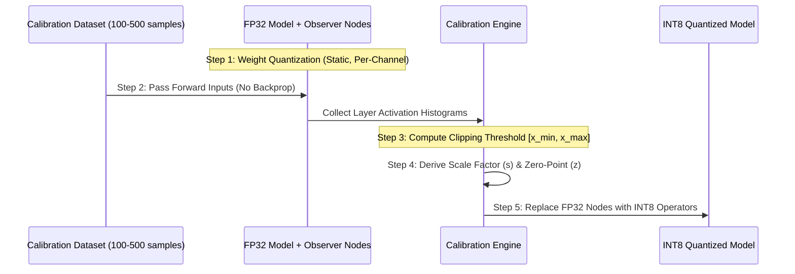

## Executive Summary & Fundamental Intuition

**Post-Training Quantization (PTQ)** is a model compression methodology that converts high-precision floating-point numbers (such as 32-bit `FP32` or 16-bit `FP16`/`BF16`) in a pre-trained neural network into lower-precision discrete integer formats (typically 8-bit `INT8` or 4-bit `INT4`). 

Unlike **Quantization-Aware Training (QAT)**—which modifies the training loop and retrains the model with backpropagation—PTQ is executed entirely **post-hoc** (after model training is complete). It requires no full training data and no gradient computation, relying instead on offline scanning of model weights and a tiny calibration dataset (e.g., 100–500 input samples) to determine precision parameters.

```
+-----------------------------------------------------------------------------------+
| Continuous FP32 Space  (-infinity ... -2.4 ... 0.0 ... +3.6 ... +infinity)        |
+-----------------------------------------------------------------------------------+
                                         |
                       Affine Mapping (Scale s, Zero-Point z)
                                         v
+-----------------------------------------------------------------------------------+
| Discrete INT8 Space    [0, 1, 2, ..., z=102, ..., 176, ..., 255]                    |
+-----------------------------------------------------------------------------------+
```

### The Beginner's Mental Model
Imagine measuring distances using a continuous laser measuring tool versus a standard wooden ruler marked with fixed 1-millimeter notches:
- **`FP32` (Continuous)** can represent microscopic fractional differences (e.g., $0.000003412$), but requires a huge memory storage box (4 bytes per number) and heavy arithmetic machinery.
- **`INT8` (Discrete)** forces every measurement to land into one of 256 pre-defined integer "buckets" ($0, 1, 2, \dots, 255$). 
- The goal of PTQ is to map the continuous range of neural network activations and weights onto these 256 discrete buckets with **minimal loss of model accuracy**, while cutting memory usage by **$75\%$** and boosting inference speed by **$2\times$ to $4\times$**.

---

## 1. Motivation: Hardware Bottlenecks of FP32 Inference

Modern deep neural networks rely on 32-bit single-precision floating-point numbers (`FP32`) during training to accommodate minute gradient updates during backpropagation. However, deploying `FP32` models to production creates severe computational and hardware bottlenecks:

### 1. Storage & DRAM Memory Footprint
Each `FP32` value consumes 32 bits (4 bytes). A neural network with 1 billion parameters requires:
$$\text{Memory} = 1,000,000,000 \times 4 \text{ bytes} = 4 \text{ GB}$$
Converting the weights to `INT8` (1 byte per parameter) immediately reduces storage to **1 GB**.

### 2. Memory Bandwidth Bottleneck (Roofline Model)
In modern hardware (GPUs, CPUs, Edge NPUs), fetching data from off-chip DRAM to processing cores (ALUs / Tensor Cores) consumes **orders of magnitude more energy and latency** than executing the actual math. 
- A single `FP32` DRAM read consumes $\approx 100\text{--}200\times$ more energy than an 8-bit integer addition.
- In memory-bound workloads (such as the autoregressive token decoding phase of LLMs), reducing bandwidth traffic by $4\times$ translates directly into a $3\times\text{--}4\times$ latency reduction.

### 3. Arithmetic Compute Density
Integer Multiply-Accumulate (MAC) units occupy a fraction of the silicon die area required by Floating-Point Units (FPUs). Hardware accelerators (such as NVIDIA Tensor Cores with `dp4a` instructions, ARM NEON, or Intel AVX-512 VNNI) can execute **four 8-bit integer operations in a single clock cycle per lane**, doubling throughput over FP16 and quadrupling it over FP32.

---

## 2. Mathematical Foundations of Quantization

Quantization projects a continuous floating-point interval $[x_{\min}, x_{\max}]$ onto a discrete integer interval $[q_{\min}, q_{\max}]$. For signed `INT8`, $[q_{\min}, q_{\max}] = [-128, 127]$. For unsigned `INT8`, $[q_{\min}, q_{\max}] = [0, 255]$.



### The Affine Quantization Equations

#### Quantization (Floating-Point to Integer):
$$x_q = \text{clamp}\left( \text{round}\left( \frac{x}{s} \right) + z, \, q_{\min}, \, q_{\max} \right)$$

where the clamping function is defined as:
$$\text{clamp}(v, l, u) = \max(l, \, \min(v, u))$$

#### Dequantization (Integer back to Floating-Point Approximation):
$$\hat{x} = s \cdot (x_q - z)$$

#### Deriving Scale Factor ($s$) and Zero-Point ($z$)
1. **Scale Factor ($s$)**: Represents the step size (resolution) of each discrete integer bucket in floating-point units.
   $$s = \frac{x_{\max} - x_{\min}}{q_{\max} - q_{\min}}$$

2. **Zero-Point ($z$)**: An integer value within $[q_{\min}, q_{\max}]$ that maps **exactly** to the real floating-point value $0.0$.
   $$z = \text{round}\left( q_{\min} - \frac{x_{\min}}{s} \right)$$

---

### Step-by-Step Numerical Example

Let us manually walk through quantizing a single value $x = 3.5$ using an unsigned 8-bit integer format (`INT8` where $q_{\min} = 0, q_{\max} = 255$).

Suppose activation observations indicate range $[x_{\min}, x_{\max}] = [-2.0, +6.0]$.

1. **Calculate Scale Factor ($s$)**:
   $$s = \frac{6.0 - (-2.0)}{255 - 0} = \frac{8.0}{255} \approx 0.03137255$$

2. **Calculate Zero-Point ($z$)**:
   $$z = \text{round}\left( 0 - \frac{-2.0}{0.03137255} \right) = \text{round}(63.75) = 64$$

3. **Quantize $x = 3.5$**:
   $$\frac{x}{s} = \frac{3.5}{0.03137255} \approx 111.5607$$
   $$x_q = \text{round}(111.5607) + 64 = 112 + 64 = 176$$
   Thus, $x = 3.5$ maps to integer index **$176$**.

4. **Dequantize $x_q = 176$ to evaluate quantization error**:
   $$\hat{x} = s \cdot (176 - 64) = 0.03137255 \times 112 = 3.5137256$$
   $$\text{Quantization Error} = |\hat{x} - x| = |3.5137256 - 3.5| = 0.0137256$$

---

## 3. Structural Variants of Quantization

### A. Asymmetric vs. Symmetric Quantization

| Dimension | Asymmetric (Affine) Quantization | Symmetric Quantization |
| :--- | :--- | :--- |
| **Zero-Point ($z$)** | Arbitrary integer within $[q_{\min}, q_{\max}]$ | Fixed rigidly at $z = 0$ |
| **Real Interval** | Directly covers $[x_{\min}, x_{\max}]$ | Forced symmetric interval $[-R, R]$, where $R = \max(|x_{\min}|, |x_{\max}|)$ |
| **Integer Interval** | Full Unsigned $[0, 255]$ or Signed $[-128, 127]$ | Signed range $[-127, 127]$ (leaving $-128$ unused for symmetry) |
| **Scale Equation** | $s = \frac{x_{\max} - x_{\min}}{q_{\max} - q_{\min}}$ | $s = \frac{\max(|x_{\min}|, |x_{\max}|)}{127}$ |
| **Hardware Efficiency** | Lower: matrix multiplication requires computing scalar zero-point offset cross-terms. | Higher: $z=0$ simplifies dot product $A_q W_q$ directly into native hardware integer SIMD/Tensor Core instructions. |

```
Asymmetric Range:  [-2.0]----------------[0.0]------------------------[+6.0]
                   (z = 64 maps to 0.0)

Symmetric Range:   [-6.0]----------------[0.0]------------------------[+6.0]
                   (z = 0 maps to 0.0)
```

### B. Uniform vs. Non-Uniform Quantization
- **Uniform Quantization**: Bucket step size $s$ is constant across the entire dynamic range. Standard across hardware engines (ONNX Runtime, TensorRT, PyTorch AO).
- **Non-Uniform Quantization**: Bucket step sizes vary dynamically across the numerical distribution (e.g., logarithmic quantization or NormalFloat NF4 in QLoRA). Achieves higher information density for Gaussian weight distributions, but requires custom lookup-table hardware.

### C. Quantization Granularity: Per-Tensor vs. Per-Channel (Per-Axis)
- **Per-Tensor Quantization**: A single scale factor $s$ and zero-point $z$ are computed for an entire 3D or 4D tensor. Simple, but vulnerable when individual output channels have drastically different magnitude distributions.
- **Per-Channel (Per-Axis) Quantization**: A distinct scale factor $s_c$ and zero-point $z_c$ are assigned to each output channel $c$ (e.g., along dimension 0 of weight matrix $W$). Crucial for weight matrices in Convolutional and Linear layers to prevent large-magnitude channels from squashing precision in small-magnitude channels.

---

## 4. Activation Calibration Algorithms

While weight matrices $W$ are frozen and can be scanned offline, dynamic activation tensors $A$ vary with each inference input. Calibration runs a small dataset (100–500 representative samples) through the model to determine optimal activation range bounds $[x_{\min}, x_{\max}]$.



Selecting $[x_{\min}, x_{\max}]$ requires balancing two competing sources of error:
1. **Clipping Loss**: Truncating values outside $[x_{\min}, x_{\max}]$.
2. **Rounding Loss**: Increasing step size $s$ (due to a wide range) degrades resolution for values inside $[x_{\min}, x_{\max}]$.

---

### Calibration Algorithm 1: MinMax Observer
The MinMax calibration algorithm sets bounds to the absolute minimum and maximum recorded activation values:
$$x_{\min} = \min(\text{Activations}), \quad x_{\max} = \max(\text{Activations})$$

- **Pros**: Simple, fast, guarantees **zero clipping loss**.
- **Cons**: Severe degradation if activation outliers exist. A single outlier spike (e.g., $x = 120.0$ when $99.9\%$ of values lie within $[-2.0, 2.0]$) stretches $s$ dramatically, collapsing resolution for $99.9\%$ of the neural network's signals.

---

### Calibration Algorithm 2: MSE (Mean Squared Error) Minimization
MSE calibration searches for a saturation threshold $\alpha$ that minimizes the $L_2$ norm between the unquantized tensor $A$ and the quantized/dequantized tensor $\hat{A}(\alpha)$:

$$\alpha^* = \arg\min_{\alpha} \frac{1}{N} \sum_{i=1}^{N} \left( A_i - \hat{A}_i(\alpha) \right)^2$$

- **Method**: Scans potential thresholds $\alpha \in [\max(|A|) \times 0.5, \, \max(|A|)]$ in discrete steps, quantizes and dequantizes $A$ for each step, and selects $\alpha^*$ with the lowest reconstruction error.
- **Trade-off**: Intentionally clips rare outlier activations to achieve significantly finer integer resolution for the vast majority of in-distribution values.

---

### Calibration Algorithm 3: Entropy / KL-Divergence (NVIDIA TensorRT Method)
The KL-Divergence calibration algorithm treats the FP32 activation tensor as a probability distribution $P$ and seeks a clipping threshold $T$ that minimizes information loss (divergence) between $P$ and the quantized distribution $Q$.

```
FP32 Histogram P:   [ ||||||||||||||||||||||||| |  |     | ]  (2048 high-res bins)
                                              ^ Truncate at threshold T
Quantized Distribution Q: [ || || || || || || || ]            (128 INT8 bins)
```

#### Step-by-Step Execution Protocol:
1. Collect a fine-grained histogram of FP32 activation magnitudes $P$ across the calibration dataset using $2048$ bins.
2. Iterate candidate thresholds $T$ from bin index $128$ up to $2048$:
   a. **Truncate** histogram $P$ at bin $T$. Values beyond bin $T$ are clipped into bin $T$.
   b. **Quantize** truncated histogram $P_{1..T}$ down to $128$ integer bins.
   c. **Expand** quantized 128-bin distribution back to $T$ bins by distributing probabilities evenly across original bin widths to produce reference distribution $Q$.
   d. Compute **Kullback-Leibler Divergence**:
      $$D_{\text{KL}}(P \parallel Q) = \sum_{i=1}^{T} P[i] \cdot \log\left( \frac{P[i]}{Q[i]} \right)$$
3. Select threshold $T^*$ that yields the absolute **minimum $D_{\text{KL}}$ value**.

---

## 5. From-Scratch Production Python Implementation

Below is a self-contained PyTorch/Python module demonstrating asymmetric/symmetric quantization, MinMax calibration, MSE calibration, and an end-to-end quantized linear forward pass.

```python
import torch
import torch.nn as nn
import numpy as np

class Quantizer:
    """
    Core Affine Quantization Engine for PyTorch Tensors.
    Supports both Symmetric and Asymmetric INT8 Quantization.
    """
    def __init__(self, num_bits=8, symmetric=False):
        self.num_bits = num_bits
        self.symmetric = symmetric
        if symmetric:
            self.qmin = -(2 ** (num_bits - 1) - 1) # -127 for signed int8
            self.qmax = 2 ** (num_bits - 1) - 1   # +127
        else:
            self.qmin = 0                          # 0 for unsigned int8
            self.qmax = 2 ** num_bits - 1          # 255

    def derive_params(self, x_min: float, x_max: float):
        """Derives scale factor (s) and zero-point (z) from bounds."""
        if self.symmetric:
            max_val = max(abs(x_min), abs(x_max))
            scale = max_val / self.qmax if max_val != 0 else 1.0
            zero_point = 0
        else:
            scale = (x_max - x_min) / (self.qmax - self.qmin) if x_max != x_min else 1.0
            zero_point = int(np.round(self.qmin - x_min / scale))
            zero_point = int(np.clip(zero_point, self.qmin, self.qmax))
        return scale, zero_point

    def quantize(self, x: torch.Tensor, scale: float, zero_point: int) -> torch.Tensor:
        """Projects FP32 Tensor onto Integer Grid."""
        q_tensor = torch.round(x / scale) + zero_point
        return torch.clamp(q_tensor, self.qmin, self.qmax).to(torch.int32)

    def dequantize(self, q_tensor: torch.Tensor, scale: float, zero_point: int) -> torch.Tensor:
        """Reconstructs FP32 Approximation from Integer Tensor."""
        return scale * (q_tensor.to(torch.float32) - zero_point)


class MSEObserver:
    """
    Observer that finds clipping bounds [x_min, x_max] by minimizing MSE.
    """
    def __init__(self, quantizer: Quantizer, num_steps: int = 50):
        self.quantizer = quantizer
        self.num_steps = num_steps

    def calibrate(self, activation_tensor: torch.Tensor):
        abs_max = activation_tensor.abs().max().item()
        best_mse = float('inf')
        best_min, best_max = -abs_max, abs_max

        # Scan candidate thresholds from 50% to 100% of max magnitude
        for step in range(1, self.num_steps + 1):
            alpha = abs_max * (0.5 + 0.5 * step / self.num_steps)
            x_min, x_max = -alpha, alpha
            scale, zp = self.quantizer.derive_params(x_min, x_max)

            # Measure reconstruction error
            q = self.quantizer.quantize(activation_tensor, scale, zp)
            deq = self.quantizer.dequantize(q, scale, zp)
            mse = torch.mean((activation_tensor - deq) ** 2).item()

            if mse < best_mse:
                best_mse = mse
                best_min, best_max = x_min, x_max

        return self.quantizer.derive_params(best_min, best_max)


class QuantizedLinear(nn.Module):
    """
    Simulated Integer Matrix Multiplication Layer (INT8 Weight x INT8 Input).
    """
    def __init__(self, weight_fp32: torch.Tensor, bias_fp32: torch.Tensor = None):
        super().__init__()
        self.quantizer_w = Quantizer(num_bits=8, symmetric=True)
        self.quantizer_a = Quantizer(num_bits=8, symmetric=False)

        # 1. Quantize Static Weights Offline (Symmetric Per-Tensor for simplicity)
        w_min, w_max = weight_fp32.min().item(), weight_fp32.max().item()
        self.scale_w, self.zp_w = self.quantizer_w.derive_params(w_min, w_max)
        self.weight_int8 = self.quantizer_w.quantize(weight_fp32, self.scale_w, self.zp_w)

        self.bias_fp32 = bias_fp32
        self.scale_a = None
        self.zp_a = None

    def calibrate_activations(self, calibration_inputs: torch.Tensor):
        """Step 2 & 3: Calibrate dynamic activation thresholds using MSE."""
        observer = MSEObserver(self.quantizer_a)
        self.scale_a, self.zp_a = observer.calibrate(calibration_inputs)

    def forward(self, input_fp32: torch.Tensor) -> torch.Tensor:
        """Step 5: Integer Forward Pass & Output Dequantization."""
        assert self.scale_a is not None, "Layer must be calibrated before forward pass!"
        
        # Quantize Input Activation
        input_int8 = self.quantizer_a.quantize(input_fp32, self.scale_a, self.zp_a)

        # Execute Integer Matrix Multiplication: (A_q - z_a) @ (W_q - z_w)^T
        # Note: Since weight is symmetric (zp_w = 0), term simplifies to (A_q - z_a) @ W_q^T
        a_shifted = input_int8 - self.zp_a
        acc_int32 = torch.matmul(a_shifted.to(torch.float32), self.weight_int8.to(torch.float32).t())

        # Scale Output back to FP32 space: output = scale_a * scale_w * acc_int32
        output_fp32 = (self.scale_a * self.scale_w) * acc_int32

        if self.bias_fp32 is not None:
            output_fp32 += self.bias_fp32

        return output_fp32


# Verification Script
if __name__ == "__main__":
    torch.manual_seed(42)
    print("--- PTQ From-Scratch Execution Test ---")

    # Instantiate FP32 Linear Layer weights & test input
    weight_fp32 = torch.randn(64, 128)
    bias_fp32 = torch.randn(64)
    x_test = torch.randn(32, 128) * 2.0  # Input with scale factor 2.0

    # True FP32 Reference Output
    y_true = torch.matmul(x_test, weight_fp32.t()) + bias_fp32

    # Quantized Layer Deployment
    q_linear = QuantizedLinear(weight_fp32, bias_fp32)
    q_linear.calibrate_activations(x_test)  # Run Calibration Pass
    y_quant = q_linear(x_test)              # Run Integer Inference

    # Evaluate Precision
    mae_error = torch.mean(torch.abs(y_true - y_quant)).item()
    cosine_sim = torch.nn.functional.cosine_similarity(y_true.flatten(), y_quant.flatten(), dim=0).item()

    print(f"Mean Absolute Error (MAE): {mae_error:.5f}")
    print(f"Cosine Similarity (FP32 vs INT8): {cosine_sim:.5f}")
```

---

## 6. System Trade-offs, Edge Cases & Failure Modes

### 1. Integer Accumulator Overflow (`INT32` Safeguard)
When multiplying two 8-bit integers (`INT8` $\times$ `INT8`), the product requires up to **16 bits** ($127 \times 127 = 16,129$). Accumulating these products across a matrix dot product of dimension $K$ (e.g., $K = 4096$ in modern transformers) causes sums that easily exceed 16-bit limits.
- **System Safeguard**: Hardware matrix engines compute integer matrix products into a **32-bit integer (`INT32`) accumulator register** before downscaling back to `INT8` via output scaling factors.

### 2. Activation Outliers in Large Language Models (LLMs)
As neural networks scale beyond 6.7B parameters, systematic high-magnitude activation outliers emerge in specific channels (e.g., values reaching $+100.0$ while normal activations remain near $\approx 1.0$).
- Standard PTQ calibration fails because clipping these outliers damages model perplexity, while keeping them squashes $99.9\%$ of activations into 1 or 2 integer bins.
- **Advanced Remedies**:
  - **SmoothQuant**: Mathematically migrates quantization difficulty from activations to weights via diagonal per-channel scaling matrices ($Y = (A \cdot S^{-1}) \cdot (S \cdot W)$).
  - **GPTQ / AWQ**: Uses second-order Hessian inverse optimization or activation-aware channel protection for 4-bit weight-only quantization.

---

## Complete Source Map & References

1. **PyTorch AO Quantization Architecture**: [PyTorch Quantization Docs](https://pytorch.org/docs/stable/quantization.html)
2. **NVIDIA TensorRT INT8 Calibration Engine**: [NVIDIA Developer Blog](https://developer.nvidia.com/blog/int8-inference-engine-for-deep-learning/)
3. **SmoothQuant: Accurate and Efficient Post-Training Quantization for Large Language Models**: [arXiv:2211.10438](https://arxiv.org/abs/2211.10438)
4. **GPTQ: Accurate Post-Training Quantization for Generative Pre-trained Transformers**: [arXiv:2210.17323](https://arxiv.org/abs/2210.17323)

---

## Atomic Concepts to Extract & Link
- [x] [[Post-Training Quantization]]
- [x] [[Scale Factor and Zero-Point]]
- [x] [[Quantization Calibration]]
- [x] [[Symmetric vs Asymmetric Quantization]]
- [x] [[Per-Tensor vs Per-Channel Quantization]]
