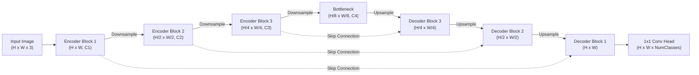

# Encoder-Decoder Architectures in Image Segmentation: Complete Study Guide

Dokumen ini adalah materi pembelajaran terstruktur mengenai **Arsitektur Encoder-Decoder pada Segmentasi Citra (*Image Segmentation*)**. Materi disusun secara progresif: dimulai dari intuisi dasar tanpa rumus rumit, berlanjut ke anatomi mekanis, evolusi model-model klasik hingga modern, dinamika fungsi loss, hingga implementasi kode PyTorch modular.

---

## 1. Executive Summary & Mental Model Dasar

### 1.1 Analogi Buku Mewarnai: Taksonomi Tugas Computer Vision
Untuk memahami segmentasi citra, bayangkan kamu memiliki foto pemandangan jalan raya yang berisi mobil, pohon, dan aspal:

```
+-----------------------------------------------------------------------------+
| 1. Image Classification  --> "Ada mobil di foto ini." (1 label per gambar)  |
| 2. Object Detection      --> "Mobil ada di kotak [x, y, w, h]." (Bounding box) |
| 3. Semantic Segmentation --> "Piksel [10, 24] adalah mobil, [10, 25] aspal."  |
| 4. Instance Segmentation --> "Ini piksel Mobil A, ini piksel Mobil B."      |
+-----------------------------------------------------------------------------+
```

* **Semantic Segmentation:** Mengelompokkan setiap piksel ke dalam kelas kategori tertentu tanpa membedakan individu objek (semua mobil diberi satu warna seragam).
* **Instance Segmentation:** Mengelompokkan piksel dan membedakan tiap individu objek (Mobil #1 warna merah, Mobil #2 warna biru).
* **Panoptic Segmentation:** Menggabungkan *semantic* (latar seperti langit/jalan) dan *instance* (objek terhitung seperti orang/mobil).

---

### 1.2 Dilema Fundamental: "What" vs "Where"

```
Resolusi Spasial Tinggi (H x W)                     Resolusi Semantik Tinggi
Detail Tepi Tajam                                    Pemahaman Konteks Global
Batas Piksel Akurat                                  Tahu Objek Apa Ini
       │                                                     │
       ▼                                                     ▼
 [ ENCODER ] ────────────────────────────────────────► [ BOTTLENECK ]
   (Mengecilkan ukuran citra demi memahami makna)
                                                             │
                                                             ▼
 [ OUTPUT MASK ] ◄──────────────────────────────────── [ DECODER ]
   (Mengembalikan ukuran citra demi mewarnai piksel)
```

Mengapa kita tidak bisa langsung mengolah citra pada ukuran aslinya dari awal sampai akhir tanpa memperkecilnya?
1. **Kebutuhan Receptive Field:** Jika ukuran citra dipertahankan penuh, konvolusi standar hanya melihat area lokal kecil ($3 \times 3$ piksel). Model tidak bisa memahami bahwa susunan piksel cokelat adalah bagian dari punggung kucing berukuran besar.
2. **Kebutuhan Lokalisasi Presisi:** Begitu citra diperkecil (*downsampling*) melalui pooling, kita tahu pasti ada kucing di dalam gambar, namun posisi koordinat batas kumis/bulunya hilang tereduksi.

**Arsitektur Encoder-Decoder diciptakan untuk menyelesaikan kompromi ini secara sistematis.**

---

## 2. Anatomi Komponen Arsitektur Encoder-Decoder

Arsitektur segmentasi citra terdiri dari 5 blok utama:



---

### 2.1 Encoder (Jalur Kontraksi / Analisis)
* **Fungsi:** Mengambil citra RGB input $X \in \mathbb{R}^{H \times W \times 3}$, mengekstrak fitur semantik hierarkis dari level rendah (tepi, sudut, gradien warna) ke level tinggi (tekstur, bagian objek, kelas semantik).
* **Mekanisme Downsampling:**
  * **Max Pooling:** Mengambil nilai maksimum lokal pada jendela $2 \times 2$ dengan stride 2 (mereduksi dimensi spasial menjadi separuh).
  * **Strided Convolution:** Konvolusi dengan $\text{stride} = 2$ yang mempelajari parameter downsampling secara adaptif.
* **Backbone Populer:** ResNet-34/50, VGG-16, EfficientNet, ConvNeXt, Swin Transformer.

---

### 2.2 Bottleneck (Representasi Laten)
* Titik tengah jaringan dengan resolusi spasial terkecil namun kedalaman channel terbesar.
* Berisi kompresi informasi murni: *"Apa objek utama dalam gambar dan bagaimana relasi spasial globalnya?"*.

---

### 2.3 Decoder (Jalur Ekspansi / Rekonstruksi)
* **Fungsi:** Membesarkan kembali resolusi spasial secara bertahap dari $\frac{H}{2^k} \times \frac{W}{2^k}$ menuju $H \times W$.
* **Mekanisme Upsampling:**

```
+--------------------------------------------------------------------------------------+
| 1. Nearest / Bilinear Interpolation (Non-learnable, Cepat, Bebas Artefak)            |
|    Mengisi piksel baru dengan rata-rata bobot jarak piksel tetangganya.              |
+--------------------------------------------------------------------------------------+
| 2. Transposed Convolution / Deconvolution (Learnable, Fleksibel)                     |
|    Konvolusi dengan padding internal yang menghasilkan tensor output lebih besar.   |
|    Potensi isu: Checkerboard Artifacts jika kernel size tidak habis dibagi stride.   |
+--------------------------------------------------------------------------------------+
| 3. Sub-Pixel Convolution / PixelShuffle (Efisien)                                    |
|    Mengatur ulang kanal ke dimensi spasial: (H x W x C*r^2) -> (r*H x r*W x C).      |
+--------------------------------------------------------------------------------------+
```

---

### 2.4 Skip Connections (Jembatan Penyelamat Detail)
Ketika decoder melakukan upsampling dari bottleneck, fitur yang dihasilkan cenderung **halus/buram (*blurry*)** di sekitar batas objek karena resolusi asli sudah hilang saat pooling.

* **Solusi Skip Connection:** Menghubungkan langsung lapisan Encoder level $i$ ke Decoder level $i$.
* **Dua Pendekatan Utama:**
  1. **Concatenation (U-Net):** Menempelkan channel encoder ke decoder:
     $$\text{Fitur Gabungan} = [\mathbf{F}_{\text{encoder}} \,;\, \mathbf{F}_{\text{decoder\_up}}]$$
     Menjaga informasi spasial asli tetap utuh untuk diproses oleh konvolusi berikutnya.
  2. **Element-wise Addition (FPN / ResNet-style):** Menjumlahkan nilai tensor setelah disamakan jumlah channel-nya dengan konvolusi $1 \times 1$:
     $$\text{Fitur Gabungan} = \mathbf{F}_{\text{encoder}} + \mathbf{F}_{\text{decoder\_up}}$$
     Lebih hemat komputasi dan memori daripada concatenation.

---

### 2.5 Prediction Head
* Lapisan konvolusi $1 \times 1$ di ujung decoder yang mengubah jumlah channel dari $C_{\text{final}}$ menjadi $K$ (jumlah kelas target).
* **Fungsi Aktivasi Output:**
  * **Sigmoid:** $\sigma(z) = \frac{1}{1 + e^{-z}}$ untuk segmentasi biner (Background vs Objek) atau multi-label.
  * **Softmax:** $\text{Softmax}(z_i) = \frac{e^{z_i}}{\sum_{j=1}^K e^{z_j}}$ untuk segmentasi multi-kelas yang saling eksklusif per piksel.

---

## 3. Komparasi Arsitektur Monumental

```
+---------------+---------------------+-------------------------+-----------------------------------+
| Arsitektur    | Rilis | Tipe Skip   | Mekanisme Unggulan      | Karakteristik Utama               |
+---------------+---------------------+-------------------------+-----------------------------------+
| FCN           | 2015  | Addition    | 1x1 Conv + Skip Sum     | Fondasi awal segmentasi end-to-end|
| U-Net         | 2015  | Concatenate | Simetris U + Cat Skips  | Standar emas citra medis / presisi|
| SegNet        | 2015  | Index Reuse | Max-Unpooling Indices   | Sangat hemat memori GPU           |
| DeepLabv3+    | 2018  | Moduler     | Atrous Conv + ASPP      | Sangat kuat pada multi-scale      |
| SegFormer     | 2021  | All-MLP     | Hierarchical ViT + MLP  | Bebas posisi encoding, efisien    |
+---------------+---------------------+-------------------------+-----------------------------------+
```

### 3.1 U-Net (Ronneberger et al., 2015)
* **Kelebihan:** Mampu belajar dari jumlah dataset yang relatif kecil (sangat populer pada citra medis MRI, CT-Scan, mikroskopis).
* **Fitur Kunci:** Saluran *copy and crop / concatenate* yang mempertahankan detail tepi sel/organ secara piksel-sempurna.

### 3.2 SegNet (Badrinarayanan et al., 2015)
* **Kelebihan:** Tidak perlu mentransfer seluruh tensor besar dari encoder ke decoder.
* **Fitur Kunci:** Encoder hanya mencatat koordinat indeks piksel terbesar saat *max-pooling* ($2 \times 2$), lalu decoder menempatkan kembali aktivasi ke koordinat indeks tersebut (*max-unpooling*).

### 3.3 DeepLabv3+ (Chen et al., 2018)
* **Atrous (Dilated) Convolution:** Memperbesar jangkauan pandang filter tanpa memperkecil ukuran gambar dan tanpa menambah bobot parameter:
  $$y[i] = \sum_k x[i + r \cdot k] \cdot w[k]$$
  dengan $r$ adalah *dilation rate*.
* **ASPP (Atrous Spatial Pyramid Pooling):** Menjalankan beberapa konvolusi dilated secara paralel dengan nilai $r = (6, 12, 18)$ untuk menangkap objek kecil, sedang, dan besar secara simultan.

---

## 4. Fungsi Loss (Objective Functions)

Segmentasi citra menghadapi tantangan **Extreme Class Imbalance** (misalnya: 99% piksel adalah latar belakang hitam, hanya 1% piksel yang merupakan tumor atau goresan cacat material).

---

### 4.1 Pixel-wise Cross-Entropy Loss
Dihitung secara independen pada setiap piksel:
$$\mathcal{L}_{\text{CE}} = - \frac{1}{N} \sum_{i=1}^N \sum_{c=1}^K y_{i,c} \log(\hat{p}_{i,c})$$
* **Kelemahan:** Jika background mendominasi, model akan dengan mudah mencapai akurasi 99% hanya dengan menebak semua piksel sebagai background.

---

### 4.2 Dice Loss (Sørensen–Dice Coefficient)
Mengukur rasio tumpang tindih (*overlap*) area prediksi terhadap area target sebenarnya:
$$\text{DSC} = \frac{2 |X \cap Y|}{|X| + |Y|}$$

Versi diferensiabel (*Soft-Dice Loss*) untuk pelatihan:
$$\mathcal{L}_{\text{Dice}} = 1 - \frac{2 \sum_{i=1}^N y_i \hat{p}_i + \epsilon}{\sum_{i=1}^N y_i + \sum_{i=1}^N \hat{p}_i + \epsilon}$$
* Nilai $\epsilon$ (smooth factor, misal $10^{-5}$) mencegah pembagian dengan nol.
* **Kelebihan:** Tidak terpengaruh oleh dominasi luas ukuran latar belakang.

---

### 4.3 Focal Loss (Lin et al.)
Memodifikasi Cross-Entropy dengan menambahkan *modulating factor* $(1 - p_t)^\gamma$:
$$\mathcal{L}_{\text{Focal}} = - \alpha_t (1 - p_t)^\gamma \log(p_t)$$
* Jika piksel mudah ditebak ($p_t \approx 0.99$), faktor $(1 - p_t)^\gamma \approx 0$, sehingga gradiennya ditekan.
* Model dipaksa fokus belajar pada piksel-piksel sulit di perbatasan objek.

---

### 4.4 Praktek Terbaik: Combo Loss
Kombinasi linear antara Cross-Entropy/Focal Loss dan Dice Loss memberikan stabilitas gradien terbaik:
$$\mathcal{L}_{\text{Total}} = \mathcal{L}_{\text{BCE/CE}} + \lambda \mathcal{L}_{\text{Dice}}$$

---

## 5. Metrik Evaluasi

1. **Intersection over Union (IoU / Jaccard Index):**
   $$\text{IoU} = \frac{|A \cap B|}{|A \cup B|} = \frac{\text{TP}}{\text{TP} + \text{FP} + \text{FN}}$$
2. **Mean IoU (mIoU):** Rata-rata nilai IoU di seluruh kelas target $K$.
3. **Dice Similarity Coefficient (DSC / F1-Score):**
   $$\text{DSC} = \frac{2 \cdot \text{TP}}{2 \cdot \text{TP} + \text{FP} + \text{FN}}$$

---

## 6. Implementasi PyTorch: Arsitektur Minimal U-Net

Berikut adalah implementasi modular U-Net minimal yang siap dipelajari dan dieksekusi:

```python
import torch
import torch.nn as nn
import torch.nn.functional as F

class DoubleConv(nn.Module):
    """(Conv3x3 -> BatchNorm -> ReLU) * 2"""
    def __init__(self, in_channels, out_channels):
        super().__init__()
        self.block = nn.Sequential(
            nn.Conv2d(in_channels, out_channels, kernel_size=3, padding=1, bias=False),
            nn.BatchNorm2d(out_channels),
            nn.ReLU(inplace=True),
            nn.Conv2d(out_channels, out_channels, kernel_size=3, padding=1, bias=False),
            nn.BatchNorm2d(out_channels),
            nn.ReLU(inplace=True)
        )

    def forward(self, x):
        return self.block(x)

class SimpleUNet(nn.Module):
    def __init__(self, in_channels=3, num_classes=1):
        super().__init__()
        # Encoder (Downsampling)
        self.inc = DoubleConv(in_channels, 64)
        self.down1 = nn.Sequential(nn.MaxPool2d(2), DoubleConv(64, 128))
        self.down2 = nn.Sequential(nn.MaxPool2d(2), DoubleConv(128, 256))
        
        # Bottleneck
        self.bottleneck = nn.Sequential(nn.MaxPool2d(2), DoubleConv(256, 512))
        
        # Decoder (Upsampling & Skip Connections)
        self.up1 = nn.ConvTranspose2d(512, 256, kernel_size=2, stride=2)
        self.conv_up1 = DoubleConv(512, 256) # 256 (dari up) + 256 (dari skip down2)
        
        self.up2 = nn.ConvTranspose2d(256, 128, kernel_size=2, stride=2)
        self.conv_up2 = DoubleConv(256, 128) # 128 + 128
        
        self.up3 = nn.ConvTranspose2d(128, 64, kernel_size=2, stride=2)
        self.conv_up3 = DoubleConv(128, 64)   # 64 + 64
        
        # Output Head
        self.outc = nn.Conv2d(64, num_classes, kernel_size=1)

    def forward(self, x):
        # Jalur Kontraksi (Encoder)
        x1 = self.inc(x)         # Resolusi penuh [B, 64, H, W]
        x2 = self.down1(x1)      # [B, 128, H/2, W/2]
        x3 = self.down2(x2)      # [B, 256, H/4, W/4]
        
        # Bottleneck
        xb = self.bottleneck(x3) # [B, 512, H/8, W/8]
        
        # Jalur Ekspansi (Decoder) + Skip Concatenation
        u1 = self.up1(xb)
        u1 = torch.cat([u1, x3], dim=1)
        d1 = self.conv_up1(u1)
        
        u2 = self.up2(d1)
        u2 = torch.cat([u2, x2], dim=1)
        d2 = self.conv_up2(u2)
        
        u3 = self.up3(d2)
        u3 = torch.cat([u3, x1], dim=1)
        d3 = self.conv_up3(u3)
        
        logits = self.outc(d3)   # [B, num_classes, H, W]
        return logits

# Verifikasi Dimensi Tensor
if __name__ == "__main__":
    model = SimpleUNet(in_channels=3, num_classes=1)
    dummy_input = torch.randn(2, 3, 256, 256)
    output = model(dummy_input)
    print(f"Input Shape : {dummy_input.shape}")
    print(f"Output Shape: {output.shape}")
    assert output.shape == (2, 1, 256, 256), "Dimensi output tidak sesuai!"
```

---

## 7. Roadmap Belajar Mandiri (Self-Study Checklist)

Gunakan daftar centang berikut untuk mengukur progres pemahaman:

- [ ] **Level 1 (Intuisi):** Mampu menjelaskan perbedaan klasifikasi, deteksi, dan segmentasi citra tanpa rumus.
- [ ] **Level 2 (Mekanisme):** Memahami mengapa *skip connection* krusial pada segmentasi berbasis encoder-decoder.
- [ ] **Level 3 (Arsitektur):** Mengetahui perbedaan strategi rekonstruksi antara U-Net (Concatenation) dan SegNet (Max-unpooling indices).
- [ ] **Level 4 (Optimasi):** Mengetahui penyebab kegagalan Cross-Entropy pada objek kecil dan cara Dice Loss mengatasinya.
- [ ] **Level 5 (Implementasi):** Mampu men-debug dimensi tensor $[B, C, H, W]$ pada jalur *forward pass* PyTorch.

---

## Concepts to Extract
- [ ] [[Semantic Segmentation]]
- [ ] [[Encoder-Decoder Architecture]]
- [ ] [[Skip Connections in Segmentation]]
- [ ] [[U-Net Architecture]]
- [ ] [[Dice Loss]]
- [ ] [[Atrous Spatial Pyramid Pooling]]
