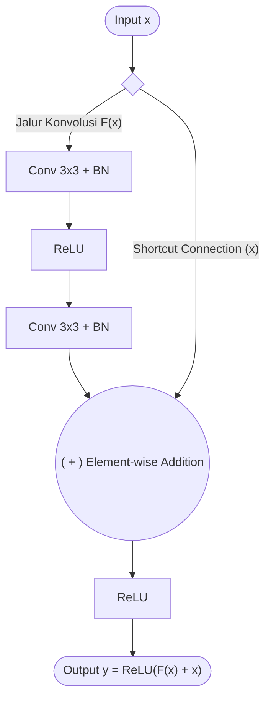
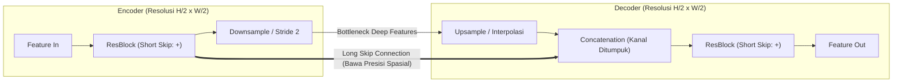

Residual block adalah unit modular arsitektur deep learning yang memperkenalkan jalur pintas (*shortcut connection* atau *identity mapping*) untuk mengalirkan representasi input langsung melompati serangkaian lapisan konvolusi via penjumlahan elemen demi elemen ($+ x$). Alih-alih memaksa jaringan mempelajari pemetaan representasi penuh $\mathcal{H}(x)$ dari nol, residual block mengubah target pembelajaran menjadi fungsi selisih (residual) $\mathcal{F}(x) = \mathcal{H}(x) - x$, sehingga output blok menjadi $y = \mathcal{F}(x) + x$. Paradigma ini meniadakan *degradation problem* pada jaringan ultra-dalam dan menjadi blok pembangun (*building block*) standar, baik sebagai backbone ekstraksi fitur maupun pada arsitektur segmentasi citra densitas tinggi seperti [[Image Segmentation Architecture|ResUNet]].



---

## Masalah Mendasar: Degradation Problem

Sebelum ResNet (He et al., 2015), menambah kedalaman jaringan konvolusi terbentur batas empiris: setelah kedalaman tertentu, akurasi jenuh lalu anjlok drastis. 

Fenomena ini bukan disebabkan oleh **overfitting** (karena *training error* pun ikut memburuk, bukan hanya *testing error*), melainkan **degradation problem**:
1. **Vanishing/Exploding Gradient:** Saat backpropagation melintasi puluhan lapisan berantai, perkalian matriks bobot berulang ($\prod W_l$) menyebabkan gradien menuju nol atau tak terhingga.
2. **Kesulitan Belajar Identity Mapping:** Secara teoretis, menambahkan lapisan pada model seharusnya tidak pernah memperburuk performa; lapisan tambahan cukup berfungsi sebagai fungsi identitas ($f(x) = x$). Namun, tumpukan non-linearitas ($\text{ReLU}(\mathbf{W}x + b)$) sangat sulit mengonvergenkan bobotnya menjadi matriks identitas murni.

---

## Formulasi Matematis & Aliran Gradien

Residual block mendefinisikan ulang pemetaan yang diinginkan:

$$\mathcal{H}(x) = \mathcal{F}(x) + x \implies \mathcal{F}(x) = \mathcal{H}(x) - x$$

**Keterangan Variabel:**
* $x$: Tensor input yang masuk ke dalam blok (representasi fitur dari lapisan sebelumnya).
* $\mathcal{H}(x)$: Pemetaan ideal (*underlying mapping*) yang diharapkan dipelajari oleh blok jaringan secara utuh.
* $\mathcal{F}(x)$: Pemetaan residual (*residual mapping*) yang secara riil dipelajari oleh tumpukan konvolusi berbobot di dalam blok.
* $+ x$: Jalur pintas (*identity shortcut*) yang meneruskan input asli tanpa manipulasi bobot parameter.

Jika pemetaan optimal mendekati fungsi identitas, optimiser cukup mendorong bobot parameter konvolusi $\mathcal{F}(x)$ menuju nol ($\mathcal{F}(x) \to 0$), tugas optimasi yang jauh lebih mudah daripada mencari representasi identitas via perkalian bobot.

### Jalan Bebas Hambatan untuk Gradien
Keunggulan utama formulasi ini tampak jelas saat menghitung turunan berantai (*chain rule*) saat backpropagation terhadap fungsi rugi (*loss*) $\mathcal{E}$:

$$\frac{\partial \mathcal{E}}{\partial x} = \frac{\partial \mathcal{E}}{\partial y} \cdot \frac{\partial y}{\partial x} = \frac{\partial \mathcal{E}}{\partial y} \left( \frac{\partial \mathcal{F}(x)}{\partial x} + 1 \right)$$

**Keterangan Variabel:**
* $\mathcal{E}$: Nilai fungsi rugi/galat total (*loss function error*) dari model.
* $y$: Output akhir dari blok sebelum aktivasi non-linear ($y = \mathcal{F}(x) + x$).
* $\frac{\partial \mathcal{E}}{\partial y}$: Sinyal gradien loss yang merambat mundur (*backpropagated*) dari lapisan di atasnya/setelahnya.
* $\frac{\partial \mathcal{E}}{\partial x}$: Gradien loss terhadap input blok $x$, yang akan dioper ke lapisan-lapisan di bawahnya.
* $\frac{\partial \mathcal{F}(x)}{\partial x}$: Gradien yang merambat melewati bobot-bobot lapisan konvolusi di jalur utama (rentan mengecil jika lapisan sangat dalam).
* $+ 1$: Turunan analitis langsung dari identity shortcut ($\frac{\partial x}{\partial x} = 1$), bertindak sebagai konduktor gradien konstan tanpa redaman bobot matriks.

---

## Anatomi & Varian Blok

### 1. Basic Block vs. Bottleneck Block
Terdapat dua varian utama tergantung kebutuhan komputasi dan kedalaman arsitektur:

* **Basic Block (ResNet-18 / ResNet-34):** Terdiri dari dua konvolusi berukuran sama ($3 \times 3 \to 3 \times 3$). Cocok untuk komputasi menengah.
* **Bottleneck Block (ResNet-50 / 101 / 152):** Menggunakan strategi kompresi-ekspansi tiga tingkat:
  1. $1 \times 1$ Conv: Mempersempit jumlah channel (mengurangi dimensi).
  2. $3 \times 3$ Conv: Memproses representasi spasial pada resolusi channel rendah.
  3. $1 \times 1$ Conv: Mengembalikan/memperluas channel ke dimensi target.  
  *Desain ini memangkas jumlah parameter dan FLOPs secara signifikan.*

### 2. Penyesuaian Dimensi (Projection Shortcut)
Operasi penjumlahan elemen demi elemen $\mathcal{F}(x) + x$ mensyaratkan dimensi spasial $(H, W)$ dan jumlah channel $C$ antara $\mathcal{F}(x)$ dan $x$ identik.

$$y = \mathcal{F}(x) + W_s x$$

**Keterangan Variabel:**
* $y$: Tensor output akhir blok.
* $\mathcal{F}(x)$: Output dari tumpukan konvolusi utama dengan resolusi spasial $(H_{out}, W_{out})$ dan kanal $C_{out}$.
* $x$: Tensor input awal dengan resolusi spasial $(H_{in}, W_{in})$ dan kanal $C_{in}$.
* $W_s$: Matriks proyeksi linier berupa konvolusi $1 \times 1$ (dengan stride yang sama dengan $\mathcal{F}$) untuk menyamakan resolusi spasial dan jumlah kanal $x$ agar tepat berukuran $(H_{out}, W_{out}, C_{out})$.

---

## Implementasi PyTorch

Berikut implementasi modular `ResidualBlock` standar yang menangani *identity mapping* maupun *projection shortcut*:

```python
import torch
import torch.nn as nn

class ResidualBlock(nn.Module):
    def __init__(self, in_channels: int, out_channels: int, stride: int = 1):
        super().__init__()
        
        # Jalur Konvolusi Utama F(x)
        self.conv_path = nn.Sequential(
            nn.Conv2d(in_channels, out_channels, kernel_size=3, stride=stride, padding=1, bias=False),
            nn.BatchNorm2d(out_channels),
            nn.ReLU(inplace=True),
            nn.Conv2d(out_channels, out_channels, kernel_size=3, stride=1, padding=1, bias=False),
            nn.BatchNorm2d(out_channels)
        )
        
        # Jalur Pintas Shortcut (Identity vs Projection)
        self.shortcut = nn.Sequential()
        if stride != 1 or in_channels != out_channels:
            self.shortcut = nn.Sequential(
                nn.Conv2d(in_channels, out_channels, kernel_size=1, stride=stride, bias=False),
                nn.BatchNorm2d(out_channels)
            )
            
        self.relu = nn.ReLU(inplace=True)

    def forward(self, x: torch.Tensor) -> torch.Tensor:
        identity = self.shortcut(x)
        out = self.conv_path(x) + identity
        return self.relu(out)

# Verifikasi dimensi
if __name__ == "__main__":
    x = torch.randn(2, 64, 32, 32)
    # Kasus 1: Dimensi tetap (Identity Shortcut murni)
    block_same = ResidualBlock(in_channels=64, out_channels=64, stride=1)
    print("Same dim output:", block_same(x).shape)  # [2, 64, 32, 32]
    
    # Kasus 2: Resolusi turun, channel naik (Projection Shortcut 1x1)
    block_down = ResidualBlock(in_channels=64, out_channels=128, stride=2)
    print("Downsample output:", block_down(x).shape)  # [2, 128, 16, 16]
```

---

## Peran dalam Segmentasi Citra (Image Segmentation)

Dalam domain segmentasi citra seperti [[Image Segmentation Architecture]], residual block bukan sekadar alat klasifikasi, melainkan komponen struktural penting:

### 1. Backbone Encoder (Ekstraksi Fitur Tanpa Degradasi)
Model segmentasi membutuhkan pemahaman semantik global tingkat tinggi tanpa kehilangan sinyal spasial. Menggunakan tumpukan residual block sebagai encoder (seperti *ResNet-34* atau *ResNet-50* yang sudah di-*pretrain* pada ImageNet) mempercepat konvergensi dan menghasilkan peta fitur yang kaya.

### 2. ResUNet: Residual Block di Encoder & Decoder
Pada arsitektur **ResUNet**, tumpukan konvolusi ganda klasik pada U-Net (`Conv-ReLU-Conv-ReLU`) diganti seutuhnya dengan Residual Block pada setiap tingkat resolusi, baik saat encoding maupun decoding. Hal ini memfasilitasi propagasi informasi yang jauh lebih lancar pada segmentasi citra beresolusi tinggi.

### 3. Klarifikasi: Short Skip vs. Long Skip Connection
Sering muncul kerancuan mengenai istilah *skip connection*. Keduanya memiliki peran komplementer:



| Karakteristik | Short Skip Connection (ResBlock) | Long Skip Connection (U-Net) |
| :--- | :--- | :--- |
| **Lokasi** | **Intra-blok** (lokal, di dalam satu tahap encoder/decoder) | **Inter-stage** (global, dari tahap Encoder melintasi langsung ke Decoder) |
| **Operasi Matematis** | **Addition ($+$):** $\mathcal{F}(x) + x$ (elemen dijumlahkan) | **Concatenation:** $[x_{enc}, x_{dec}]$ (kanal ditumpuk) |
| **Tujuan Utama** | Mencegah vanishing gradient & mempermudah optimasi identitas | Menyelamatkan detail koordinat dan batas tepi objek yang hilang akibat downsampling |

---

> [!abstract]- Quick Reference
> * **Persamaan Blok:** $y = \text{ReLU}(\mathcal{F}(x) + W_s x)$
> * **Persamaan Gradien:** $\frac{\partial \mathcal{E}}{\partial x} = \frac{\partial \mathcal{E}}{\partial y} \left( \frac{\partial \mathcal{F}(x)}{\partial x} + 1 \right)$
> * **Kapan butuh $W_s$ (Conv $1 \times 1$):** Saat $C_{in} \neq C_{out}$ atau $\text{stride} > 1$.
> * **Basic vs Bottleneck:** Basic ($3 \times 3 \to 3 \times 3$, ResNet-18/34); Bottleneck ($1 \times 1 \to 3 \times 3 \to 1 \times 1$, ResNet-50+).
> * **Operasi Penggabungan:** Penjumlahan elemen demi elemen (*element-wise addition*), bukan *concatenation*.

---

> [!question]- Practice
> **Soal 1:** Sebuah Residual Block menerima input tensor berdimensi $(B, 64, 64, 64)$. Blok tersebut menggunakan $\text{stride} = 2$ pada konvolusi pertama dan menaikkan kanal menjadi $128$. Berapa kernel size, stride, dan jumlah filter pada lapisan projection shortcut $W_s$?
> > [!check]- Answer
> > Lapisan projection shortcut $W_s$ membutuhkan konvolusi $1 \times 1$ dengan kernel size $1 \times 1$, $\text{stride} = 2$, dan $128$ filter (out_channels = 128). Ini mengubah tensor shortcut dari $(B, 64, 64, 64)$ menjadi $(B, 128, 32, 32)$ sehingga cocok dijumlahkan dengan output $\mathcal{F}(x)$.
>
> **Soal 2:** Mengapa pada Residual Block operasi penggabungan menggunakan *addition* ($+$) alih-alih *concatenation* seperti pada U-Net atau DenseNet?
> > [!check]- Answer
> > Penjumlahan ($+$) mempertahankan ukuran dimensi channel sehingga jumlah parameter di lapisan berikutnya tidak membengkak secara eksponensial. Selain itu, secara matematis penjumlahan langsung menurunkan suku $+1$ pada aliran gradien analitis, yang secara eksplisit memfasilitasi *identity mapping*.

---

> [!info]- Going Deeper
> * **He et al. (2015):** *Deep Residual Learning for Image Recognition* — Paper fundamental penemu ResNet ([arXiv:1512.03385](https://arxiv.org/abs/1512.03385)).
> * **DenseNet (Huang et al., 2017):** Mengeksplorasi koneksi berulang dengan operasi *concatenation* alih-alih *addition*.
> * **ConvNeXt (Liu et al., 2022):** Memodernisasi arsitektur ResNet murni dengan inspirasi dari Vision Transformer (ViT).
