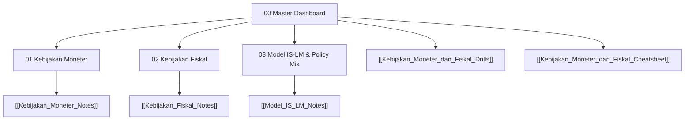

# 🎓 Master Dashboard — Kebijakan Moneter dan Fiskal

> [!info] **Master Navigation Hub:** Akses cepat ke seluruh modul pembelajaran mandiri (*Self Study Modules*), bank soal latihan (*Active Recall Drills*), dan lembar acuan cepat (*Formula Cheatsheet*).

---

## 🗺️ 1. Master Macroeconomic Landscape

![[diagram_self_study_kebijakan_moneter_fiskal_macro_map.webp]]

---

## 🗂️ 2. Modul Pembelajaran Utuh

| Modul # | Nama Modul | Cakupan Utama | Tautan Berkas | Status Belajar |
| :---: | :--- | :--- | :--- | :---: |
| **01** | **Kebijakan Moneter** | Bank Indonesia, Operasi Pasar Terbuka (OPT), BI-Rate, GWM, & Jalur MTKM | [[Kebijakan_Moneter_Notes]] | 🟢 Selesai |
| **02** | **Kebijakan Fiskal** | APBN, Belanja Negara ($G$), Perpajakan ($T$), & Pengganda Fiskal ($K_g, K_t$) | [[Kebijakan_Fiskal_Notes]] | 🟢 Selesai |
| **03** | **Model IS-LM & Policy Mix** | Keseimbangan Pasar Barang & Uang, *Crowding-Out Effect*, & Sinergi Kebijakan | [[Model_IS_LM_Notes]] | 🟢 Selesai |

---

## 🛠️ 3. Bank Soal & Kartu Acuan Terpadu

- 🧠 **Active Recall & Practice Drills:** [[Kebijakan_Moneter_dan_Fiskal_Drills]]
  *(Berisi soal HOTS analisis dan kalkulasi numerik IS-LM untuk ketiga modul beserta kunci jawaban)*
- ⚡ **Formula & Policy Cheatsheet:** [[Kebijakan_Moneter_dan_Fiskal_Cheatsheet]]
  *(Berisi kompendium rumus pengganda, matriks perbandingan instrumen, dan analisis kasus ekstrem)*

---

## 🎯 4. Study Progress Tracker

- [x] Memahami instrumen kuantitatif Moneter (OPT, BI-Rate, GWM).
- [x] Menguasai alur 4 jalur Mekanisme Transmisi Kebijakan Moneter (MTKM).
- [x] Mengikuti matematika derivasi Pengganda Belanja ($K_g$) dan Pengganda Pajak ($K_t$).
- [x] Menurunkan fungsi matematis Kurva IS dan Kurva LM.
- [x] Menghitung titik keseimbangan simultan ($Y^*, r^*$) dan besarnya efek *Crowding-Out*.
- [x] Menyelesaikan latihan soal di `Kebijakan_Moneter_dan_Fiskal_Drills.md`.
