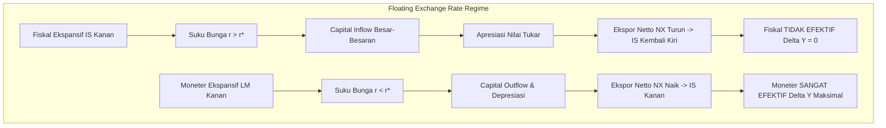

# 🎓 Modul 03: Model IS-LM — Derivasi Matriks, Crowding-Out, & Model Mundell-Fleming

> [!info] **Master Dashboard:** [[00_Master_Dashboard]] | **Drills:** [[Kebijakan_Moneter_dan_Fiskal_Drills]] | **Cheatsheet:** [[Kebijakan_Moneter_dan_Fiskal_Cheatsheet]]
> **Topics Covered:** Derivasi Matriks Aljabar & Teorema Cramer IS-LM, Formulasi Eksplisit *Crowding-Out Effect*, Ekstensi Ekonomi Terbuka Mundell-Fleming (IS-LM-BP), dan Trilema Makroekonomi (*Impossible Trinity*).

---

## 📌 1. Overview & Core Context
- **Latar Belakang & Motivasi:** Model IS-LM tidak boleh hanya difahami secara grafik visual intuitif, melainkan sebagai sistem persamaan simultan dua variabel acak endogen ($Y$ dan $r$). Dengan formalisme matriks aljabar linier, kita dapat menurunkan ekspresi eksak dari setiap pengganda kebijakan moneter dan fiskal, serta menganalisis efektivitasnya dalam rejim ekonomi terbuka (Model Mundell-Fleming).
- **High-Level Takeaway:**
  1. **Solusi Aljabar Matriks:** Menggunakan Aturan Cramer untuk memecahkan sistem simultan IS-LM.
  2. **Derivasi Eksak Crowding-Out:** Menghitung secara matematis besarnya output yang hilang akibat efek suku bunga.
  3. **Mundell-Fleming & Trilemma:** Dalam ekonomi terbuka dengan mobilitas modal sempurna, efektivitas moneter vs fiskal ditentukan 100% oleh rejim nilai tukar (*floating* vs *fixed*).

---

## 📖 2. Mathematical Microfoundations & Theoretical Deep-Dive

### 2.1 Derivasi Matriks Aljabar IS-LM & Teorema Cramer

Struktur Persamaan Simultan:
1. **Pasar Barang (IS):** $Y = C_0 + c(1-t)Y + I_0 - br + G_0 \implies [1 - c(1-t)]Y + br = A_0$
   *(di mana $A_0 = C_0 + I_0 + G_0$ adalah total pengeluaran otonom).*
2. **Pasar Uang (LM):** $kY - hr = \frac{M^s}{P}$

#### A. Bentuk Matriks Sistem $A \cdot x = d$

$$ \begin{bmatrix} 1 - c(1-t) & b \\ k & -h \end{bmatrix} \begin{bmatrix} Y \\ r \end{bmatrix} = \begin{bmatrix} A_0 \\ \frac{M^s}{P} \end{bmatrix} $$

Determinan Matriks Koefisien ($\det(A)$):
$$ \Delta = \det(A) = [1 - c(1-t)](-h) - (b)(k) = - [h(1 - c(1-t)) + bk] $$

#### B. Solusi Eksplisit Menggunakan Aturan Cramer (*Cramer's Rule*)

1. **Solusi Pendapatan Nasional Keseimbangan ($Y^*$):**
   $$ \det(A_Y) = \det \begin{bmatrix} A_0 & b \\ \frac{M^s}{P} & -h \end{bmatrix} = -h A_0 - b \left(\frac{M^s}{P}\right) $$
   $$ Y^* = \frac{\det(A_Y)}{\det(A)} = \frac{-h A_0 - b (\frac{M^s}{P})}{- [h(1 - c(1-t)) + bk]} = \frac{h A_0 + b \left(\frac{M^s}{P}\right)}{h(1 - c(1-t)) + bk} $$

2. **Solusi Suku Bunga Keseimbangan ($r^*$):**
   $$ \det(A_r) = \det \begin{bmatrix} 1 - c(1-t) & A_0 \\ k & \frac{M^s}{P} \end{bmatrix} = [1 - c(1-t)]\left(\frac{M^s}{P}\right) - k A_0 $$
   $$ r^* = \frac{\det(A_r)}{\det(A)} = \frac{k A_0 - [1 - c(1-t)]\left(\frac{M^s}{P}\right)}{h(1 - c(1-t)) + bk} $$

#### C. Pengganda Kebijakan Eksplisit (*Policy Multipliers*)

- **Pengganda Fiskal IS-LM ($\frac{\partial Y^*}{\partial G}$):**
  $$ \alpha_G = \frac{\partial Y^*}{\partial G} = \frac{h}{h(1 - c(1-t)) + bk} $$
- **Pengganda Moneter IS-LM ($\frac{\partial Y^*}{\partial (M^s/P)}$):**
  $$ \alpha_M = \frac{\partial Y^*}{\partial (M^s/P)} = \frac{b}{h(1 - c(1-t)) + bk} $$
- **Sensitivitas Suku Bunga terhadap Fiskal ($\frac{\partial r^*}{\partial G}$):**
  $$ \frac{\partial r^*}{\partial G} = \frac{k}{h(1 - c(1-t)) + bk} > 0 $$

---

### 2.2 Formulasi Matematis Eksplisit Crowding-Out Effect

Pengganda Keynesian tanpa efek suku bunga (LM horizontal): $K_{Keynes} = \frac{1}{1 - c(1-t)}$.

Perbedaan antara pertumbuhan output tanpa suku bunga vs pertumbuhan output nyata pada IS-LM:

$$ \text{Loss of Output (Crowding Out)} = \left[ K_{Keynes} - \alpha_G \right] \Delta G $$

$$ \text{Loss} = \left[ \frac{1}{1 - c(1-t)} - \frac{h}{h(1 - c(1-t)) + bk} \right] \Delta G $$

$$ \text{Loss} = \left[ \frac{h(1 - c(1-t)) + bk - h(1 - c(1-t))}{(1 - c(1-t))[h(1 - c(1-t)) + bk]} \right] \Delta G $$

$$ \text{Crowding-Out Effect} = \frac{bk}{(1 - c(1-t)) [h(1 - c(1-t)) + bk]} \cdot \Delta G $$

**Kesimpulan Matematis:** Besarnya efek *crowding-out* berbanding lurus dengan sensitivitas investasi terhadap suku bunga ($b$) dan sensitivitas permintaan uang terhadap pendapatan ($k$).

---

### 2.3 Ekstensi Ekonomi Terbuka: Model Mundell-Fleming (IS-LM-BP)

Dalam ekonomi terbuka kecil dengan mobilitas modal sempurna, suku bunga domestik terikat pada suku bunga internasional ($r = r^*$). Keseimbangan Neraca Pembayaran diwakili oleh garis horizontal $BP$.



#### A. Rejim Nilai Tukar Mengambang (*Floating Exchange Rate*)
1. **Kebijakan Fiskal Ekspansif:**
   $G \uparrow \implies IS \text{ Kanan} \implies r > r^* \implies \text{Capital Inflow} \implies \text{Apresiasi Mata Uang} \implies NX \downarrow \implies IS \text{ Kembali ke Posisi Semula}$.
   **Hasil:** $\Delta Y = 0$ (Kebijakan Fiskal **Sama Sekali Tidak Efektif**).
2. **Kebijakan Moneter Ekspansif:**
   $M^s \uparrow \implies LM \text{ Kanan} \implies r < r^* \implies \text{Capital Outflow} \implies \text{Depresiasi Mata Uang} \implies NX \uparrow \implies IS \text{ Bergeser Kanan}$.
   **Hasil:** $\Delta Y$ meningkat pesat (Kebijakan Moneter **Sangat Efektif**).

#### B. Rejim Nilai Tukar Tetap (*Fixed Exchange Rate*)
1. **Kebijakan Fiskal Ekspansif:**
   $G \uparrow \implies IS \text{ Kanan} \implies r > r^* \implies \text{Tekanan Apresiasi} \implies \text{Bank Sentral Harus Intervensi Membeli Valas/Mencetak Rupiah} \implies M^s \uparrow \implies LM \text{ Bergeser Kanan}$.
   **Hasil:** $\Delta Y$ meningkat sangat besar (Kebijakan Fiskal **Sangat Efektif**).
2. **Kebijakan Moneter Ekspansif:**
   $M^s \uparrow \implies LM \text{ Kanan} \implies r < r^* \implies \text{Tekanan Depresiasi} \implies \text{Bank Sentral Menjual Valas} \implies M^s \downarrow \implies LM \text{ Kembali Kiri}$.
   **Hasil:** $\Delta Y = 0$ (Kebijakan Moneter **Sama Sekali Tidak Efektif**).

---

### 2.4 Trilema Makroekonomi (*The Impossible Trinity*)

Sebuah negara hanya dapat memilih **2 dari 3** pilihan kebijakan makroekonomi berikut secara bersamaan:

```
                      1. Mobilitas Modal Bebas
                                 ▲
                                / \
                               /   \
                              /     \
                             /       \
                            /  Pilihan \
                           /   Negara   \
                          /              \
2. Otoritas Moneter ◄────┴───────────────┴────► 3. Nilai Tukar Tetap
   Independen                                      (Fixed Exchange Rate)
```

- **Pilihan A (Indonesia, AS, EU):** Mobilitas Modal Bebas + Otoritas Moneter Independen $\implies$ **Nilai Tukar Mengambang (Floating)**.
- **Pilihan B (Hong Kong, Arab Saudi):** Mobilitas Modal Bebas + Nilai Tukar Tetap $\implies$ **Menyerahkan Independensi Moneter (Mengikuti suku bunga Fed/USD)**.
- **Pilihan C (China era lama):** Otoritas Moneter Independen + Nilai Tukar Tetap $\implies$ **Kontrol Modal Ketat (*Capital Controls*)**.

---

## ⚡ 3. Matriks Ringkasan & Formulasi Utama

| Parameter / Rejim | Pengganda Matematika | Efektivitas Kebijakan |
| :--- | :--- | :--- |
| **Pengganda Fiskal IS-LM** | $\alpha_G = \frac{h}{h(1-c(1-t)) + bk}$ | Selalu lebih kecil dibanding pengganda Keynes murni. |
| **Pengganda Moneter IS-LM** | $\alpha_M = \frac{b}{h(1-c(1-t)) + bk}$ | Berbanding lurus dengan sensitivitas investasi $b$. |
| **Formula Crowding-Out** | $\text{Loss} = \frac{bk}{(1-c(1-t))[h(1-c(1-t))+bk]} \Delta G$ | Besarnya kerugian output swasta akibat $r \uparrow$. |
| **Floating Rate (Mundell-Fleming)** | Moneter: $\Delta Y > 0$, Fiskal: $\Delta Y = 0$ | Kurs menyesuaikan $NX$ untuk menyeimbangkan pasar. |
| **Fixed Rate (Mundell-Fleming)** | Fiskal: $\Delta Y > 0$, Moneter: $\Delta Y = 0$ | Bank sentral mengorbankan $M^s$ demi mematok kurs. |
