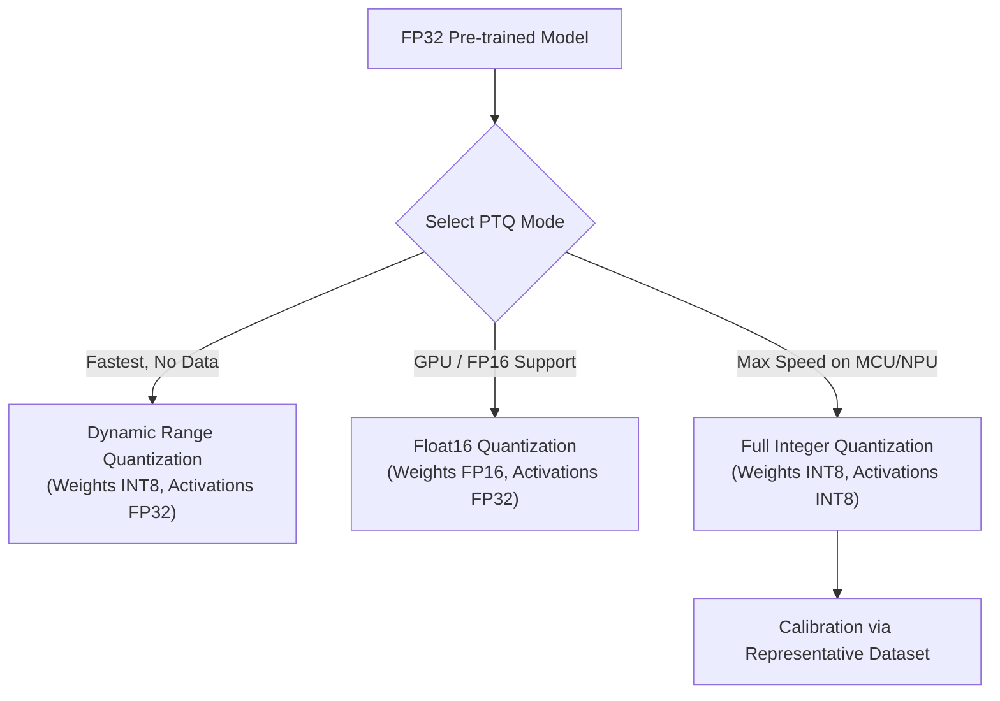

## Why I'm reading this
To explore practical deployment workflows for Post-Training Quantization using framework-level tools like TensorFlow Lite (`tflite_converter`) and PyTorch (`torch.quantization`) targeting mobile and embedded edge hardware.

## Key findings / notes

Deploying state-of-the-art deep neural networks on resource-constrained edge hardware (e.g., smartphones, microcontrollers, embedded IoT devices) faces severe constraints in memory bandwidth, storage capacity, and compute energy. Post-Training Quantization (PTQ) addresses these bottlenecks by lowering weight and activation precision after training.

### 1. Primary Deployment Challenges Addressed by PTQ
- **High Computational Cost:** 32-bit floating-point arithmetic (FP32) demands significantly higher latency and clock cycle energy compared to 8-bit integer matrix operations.
- **Memory Bandwidth Bottleneck:** Fetching large FP32 weight tensors from off-chip DRAM to processing cores limits inference throughput. INT8 quantization cuts memory access traffic by $75\%$.
- **Binary Model Footprint:** High-parameter count models become unmanageable to store or deliver over-the-air (OTA) to mobile applications without compression.

---

### 2. Practical Flavors of PTQ in Edge Frameworks (TensorFlow Lite)



#### 1. Dynamic Range Quantization
- **Mechanism:** Model weights are stored offline in 8-bit integer format (`INT8`). At runtime, weights are dynamically converted back to floating-point (`FP32`) during execution, and activations remain in `FP32`.
- **Implementation (TFLite):** 
  ```python
  converter = tf.lite.TFLiteConverter.from_saved_model(saved_model_dir)
  converter.optimizations = [tf.lite.Optimize.Default]
  tflite_quant_model = converter.convert()
  ```
- **Trade-offs:** Provides an instant $\approx 4\times$ reduction in model size without requiring a calibration dataset. However, compute latency savings are limited because inner matrix operations still execute in floating-point.

#### 2. Float16 Quantization
- **Mechanism:** Model weights are downscaled from FP32 to 16-bit floating-point (`FP16`).
- **Implementation (TFLite):**
  ```python
  converter.optimizations = [tf.lite.Optimize.Default]
  converter.target_spec.supported_types = [tf.float16]
  ```
- **Trade-offs:** Cuts model memory footprint in half ($\approx 2\times$) with virtually zero loss in numerical precision. Ideal for deployment on GPUs or mobile NPUs with hardware-native FP16 acceleration.

#### 3. Full Integer Quantization
- **Mechanism:** Both weights and activations are quantized to `INT8`. To quantize dynamic activations, `TFLiteConverter` requires a `representative_dataset` generator function to run calibration passes.
- **Trade-offs:** Maximum latency reduction and energy efficiency, unlocking compatibility with integer-only hardware accelerators (e.g., Ethos NPU, ARM Cortex-M microcontrollers).

---

## Quotes / snippets worth keeping
> "Whether employed for memory footprint reduction, boosting inference speed or enhancing model capabilities with edge accelerators, Post Training Quantization is a relevant tool in the machine learning development pipeline." — Peter Agida

## Concepts to extract
- [x] [[Post-Training Quantization]]
