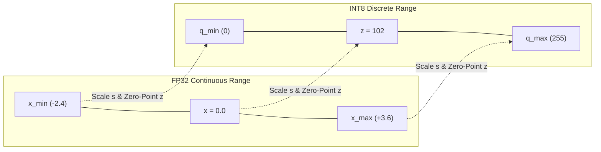

## Why I'm reading this
To understand how Post-Training Quantization (PTQ) optimizes pre-trained deep learning models for edge and production deployment by reducing numerical precision (e.g., FP32 to INT8/INT4) without full retraining or massive compute overhead.

## Key findings / notes

Post-Training Quantization (PTQ) is a model compression technique that converts weight parameters and layer activations from high-precision floating-point formats (such as 32-bit FP32 or 16-bit FP16/BF16) into lower-precision discrete representations (such as 8-bit INT8 or 4-bit INT4) after full model training is complete. Think of floating-point numbers as writing values down to 7 decimal places (e.g., $1.2345678$), whereas quantization groups numbers into discrete "integer bins" (e.g., $[0, 255]$). Unlike Quantization-Aware Training (QAT), which simulates low-precision quantization errors during the gradient descent training loop, PTQ operates entirely post-hoc via lightweight forward-pass calibration, eliminating the need for full retraining pipelines or massive original training datasets.

---

### 1. Mathematical Foundations: Scale Factor and Zero-Point

At its core, quantization maps a continuous range of real numbers $[x_{\min}, x_{\max}]$ onto a discrete grid of integers $[q_{\min}, q_{\max}]$ (e.g., $[0, 255]$ for unsigned INT8, or $[-128, 127]$ for signed INT8).

To bridge these two spaces, quantization relies on two fundamental parameters:
1. **Scale Factor ($s$):** The step size or "bin width", representing how much distance in real floating-point space is covered by a single integer step.
2. **Zero-Point ($z$):** The integer index in quantized space that corresponds *exactly* to the real number $0.0$ in floating-point space. Keeping zero exact is critical because neural networks rely heavily on zero-padding and sparse activations (e.g., ReLU).



#### Affine (Asymmetric) Quantization
In asymmetric quantization, the real-world zero ($0.0$) maps to an explicit integer offset $z$:

$$\text{Quantization:} \quad x_q = \text{clamp}\left( \text{round}\left( \frac{x}{s} \right) + z, \, q_{\min}, \, q_{\max} \right)$$

**Step-by-Step Breakdown of the Quantization Formula:**
- **Divide by $s$ ($\frac{x}{s}$):** Measures how many scale-units (steps) away $x$ is from zero.
- **$\text{round}(\cdot)$:** Snaps the continuous step count to the nearest discrete integer.
- **Add $z$ ($+ z$):** Shifts the zero-centered step count so it aligns with the integer range starting at $q_{\min}$.
- **$\text{clamp}(\cdot, q_{\min}, q_{\max}$):** Constrains out-of-bounds values to ensure no integer overflow occurs outside $[q_{\min}, q_{\max}]$.

The scale factor $s$ and zero-point $z$ are derived directly from the dynamic range $[x_{\min}, x_{\max}]$:

$$s = \frac{x_{\max} - x_{\min}}{q_{\max} - q_{\min}}$$

$$z = \text{round}\left( q_{\min} - \frac{x_{\min}}{s} \right)$$

Dequantization reconstructs an approximation of the original floating-point value $\hat{x}$:

$$\text{Dequantization:} \quad \hat{x} = s \cdot (x_q - z)$$

> [!example] Concrete Numerical Walkthrough
> Suppose an activation layer produces FP32 values in the range $[-2.0, 3.1]$, and we want to quantize to UINT8 $[0, 255]$:
> 
> 1. **Compute Scale $s$:**
>    $$s = \frac{3.1 - (-2.0)}{255 - 0} = \frac{5.1}{255} = 0.02$$
> 2. **Compute Zero-Point $z$:**
>    $$z = \text{round}\left( 0 - \frac{-2.0}{0.02} \right) = \text{round}(100) = 100$$
> 3. **Quantize $x = 1.5$:**
>    $$x_q = \text{round}\left( \frac{1.5}{0.02} \right) + 100 = \text{round}(75) + 100 = 175$$
> 4. **Dequantize back to FP32 ($\hat{x}$):**
>    $$\hat{x} = 0.02 \cdot (175 - 100) = 0.02 \cdot 75 = 1.5 \quad (\text{Exact recovery in this case!})$$
> 5. **Handling Outliers ($x = 4.0$):**
>    $$\text{Unclamped step} = \text{round}\left( \frac{4.0}{0.02} \right) + 100 = 200 + 100 = 300$$
>    $$\text{Clamped } x_q = \text{clamp}(300, 0, 255) = 255 \implies \hat{x} = 0.02 \cdot (255 - 100) = 3.1$$

#### Symmetric Quantization
Symmetric quantization simplifies the mapping by forcing the zero-point to $z = 0$. This requires enforcing a zero-centered floating-point range $[-R, R]$, where $R = \max(|x_{\min}|, |x_{\max}|)$.

For signed INT8 ($[-127, 127]$):

$$s = \frac{R}{127}$$

$$x_q = \text{clamp}\left( \text{round}\left( \frac{x}{s} \right), \, -127, \, 127 \right)$$

*Hardware Trade-off:* 
- **Why Symmetric is Faster:** In matrix multiplication ($\sum w_i a_i$), having $z = 0$ removes the scalar offset term $z$ entirely from inner dot-product loops. GPU Tensor Cores and CPU SIMD integer instructions can execute raw integer MAC (Multiply-Accumulate) operations directly without extra scalar subtractions.
- **Why Asymmetric is More Precise:** If activation distributions are heavily skewed—such as post-ReLU layers where all values are $\ge 0$ (e.g., $[0, 10.0]$)—symmetric quantization forces the dynamic range to $[-10.0, 10.0]$. This wastes half of the 256 available integer bins on negative numbers that never occur!

---

### 2. Quantization Granularity

Granularity dictates how many parameters share a single set of scale and zero-point values:

- **Per-Tensor Quantization:** A single scale $s$ and zero-point $z$ are calculated for an entire weight tensor or activation map.
  - *Analogy:* Buying one single shoe size for an entire sports team.
  - *Trade-off:* Lowest memory metadata overhead, but high quantization error if different channels have vastly different value ranges.
- **Per-Channel (Per-Axis) Quantization:** Each output channel (row/column of a weight matrix or feature map of a conv kernel) gets its own dedicated scale factor $s_c$ and zero-point $z_c$.
  - *Analogy:* Providing custom shoe sizes for each individual player.
  - *Trade-off:* Dramatically preserves accuracy for layers where one channel ranges $[-0.1, 0.1]$ and another ranges $[-10, 10]$, with minimal memory overhead added.

---

### 3. Activation Calibration Strategies

Unlike weight matrices (which are fixed after training), layer activations ($A$) vary dynamically depending on the user's input. To determine optimal clipping bounds $[x_{\min}, x_{\max}]$ without retraining, PTQ passes a small, representative **calibration dataset** (typically 100–500 sample inputs) through the model to observe activation distributions.

```
Full Activation Distribution (Continuous FP32)
   ┌────────────────────────────────────────────────────────┐
   │                  ▄████████▄                            │
   │               ▄██████████████▄                         │
   │  Outlier    ▄██████████████████▄              Outlier  │
  ─┴───────────┬─┴──────────────────┴─┬─────────────────────┴──
             x_min                  x_max   <-- Clipping Thresholds
```

| Calibration Method | Mechanism & Intuition | Pros & Cons |
| :--- | :--- | :--- |
| **Min-Max** | Sets $x_{\min}$ and $x_{\max}$ to the absolute recorded minimum and maximum values across calibration samples. | **Simple**, but vulnerable: A single extreme activation outlier stretches scale step $s$, squashing 99% of normal values into just a few integer bins. |
| **MSE Minimization** | Grid-searches a clipping threshold $\alpha$ that minimizes the Mean Squared Error between FP32 values and dequantized values: $\min_{\alpha} \|x - \hat{x}\|_2^2$. | **Balanced**: Intentionally clips out extreme 1% outliers to achieve a smaller step size $s$ for the remaining 99% of values. |
| **Entropy (KL-Divergence)** | Treats activation histograms as probability distributions and minimizes Information Loss: $D_{KL}(P_{\text{FP32}} \| Q_{\text{INT8}})$. | **Industry Standard** (e.g., NVIDIA TensorRT): Preserves the fundamental shape and information density of activation distributions. |

---

### 4. Advanced Error Mitigation & LLM PTQ Algorithms

In Large Language Models (LLMs) with tens of billions of parameters, standard INT8 quantization often causes severe degradation or model collapse. This occurs because LLMs naturally develop **systematic activation outliers**—specific hidden dimensions where activation magnitudes spike up to $100\times$ higher than normal.

Specialized PTQ algorithms mitigate this structural problem:

#### 1. Bias Correction
Quantization often introduces a systematic directional shift (mean error) in layer outputs. Bias correction adjusts the layer's trained bias vector post-calibration to absorb this mean drift:

$$b_{\text{new}} = b_{\text{old}} + (\mu_{\text{FP32}} - \mu_{\text{INT8}})$$

#### 2. SmoothQuant (Mathematical Channel Rescaling)
- **Intuition:** Activations are hard to quantize because of extreme outliers, but weights are easy to quantize because their values are uniform. SmoothQuant mathematically "migrates" quantization difficulty from activations to weights.
- **Mechanism:** It applies a per-channel smoothing scale factor $s_j = \frac{\max(|A_j|)^\gamma}{\max(|W_j|)^{1-\gamma}}$ (where $\gamma \in [0, 1]$ controls migration intensity):

$$Y = (A \cdot \text{diag}(s)^{-1}) \cdot (\text{diag}(s) \cdot W)$$

By dividing activations by $s$ (shrinking activation outliers) and multiplying weights by $s$ (slightly expanding uniform weight ranges), both activations and weights can be uniformly quantized to INT8 without accuracy loss.

#### 3. GPTQ (Second-Order Hessian Optimization)
- **Intuition:** The "Domino Compensation" approach. When quantizing a weight matrix, quantizing one weight column introduces error. GPTQ updates the remaining unquantized weights to explicitly counteract that error before moving to the next column.
- **Mechanism:** Using the inverse Hessian matrix of the loss function $H^{-1}$ (which measures local curvature of error), GPTQ quantizes column $w_1$ and immediately updates remaining unquantized weights $W_{\text{remaining}}$:

$$w_q = \text{quant}(w_1), \quad W_{\text{remaining}} \leftarrow W_{\text{remaining}} - \frac{w_1 - w_q}{[H^{-1}]_{11}} \cdot H^{-1}_{:, 1}$$

This enables aggressive **4-bit weight-only (INT4) quantization** on 70B+ parameter models with virtually zero perplexity loss.

#### 4. AWQ (Activation-Aware Weight Quantization)
- **Intuition:** Not all weights are created equal. Weights corresponding to high-magnitude activations carry vital information ("VIP weights").
- **Mechanism:** AWQ observes activation channels during calibration to identify the top 1% most salient weight channels. Instead of keeping them in FP16 (which breaks tensor layout), AWQ protects them by applying an per-channel scaling factor to diminish quantization rounding error on those specific columns.

---

### 5. Architectural & Paradigm Comparison: PTQ vs. QAT

| Dimension | Post-Training Quantization (PTQ) | Quantization-Aware Training (QAT) |
| :--- | :--- | :--- |
| **Pipeline Requirement** | Post-hoc conversion (no retraining loop) | Full training/fine-tuning loop with simulated quantization noise |
| **Data Requirement** | Lightweight calibration set (100–500 samples) | Full training dataset |
| **Compute / Time Cost** | Low (Minutes on a single GPU) | High (Hours to days on training cluster) |
| **Accuracy Preservation** | Excellent for INT8; relies on SmoothQuant/GPTQ for INT4 | Maximum possible accuracy preservation (close to 0 degradation) |
| **Primary Use Cases** | Rapid model deployment, LLM edge compression, ONNX/TensorRT export | Safety-critical edge vision models, severe low-bit quantization (INT2/INT3) |

---

## Quotes / snippets worth keeping
> "Calibration is not an afterthought; it is the empirical foundation upon which reliable quantization parameters rest." — S L Happy

> "At its heart, quantization is the process of reducing the number of bits used to represent a number... transforming heavy, powerful models into lightweight, nimble performers." — S L Happy

## Concepts to extract
- [x] [[Post-Training Quantization]]
