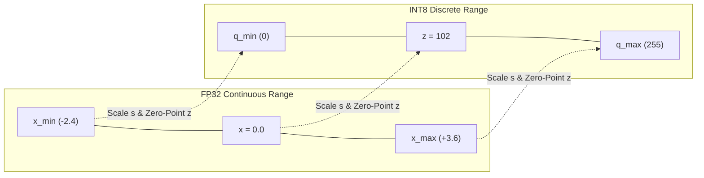

## Why I'm reading this
To understand how Post-Training Quantization (PTQ) optimizes pre-trained deep learning models for edge and production deployment by reducing numerical precision (e.g., FP32 to INT8/INT4) without full retraining or massive compute overhead.

## Key findings / notes

Post-Training Quantization (PTQ) is a model compression technique that converts weight parameters and layer activations from high-precision floating-point formats (such as 32-bit FP32 or 16-bit FP16/BF16) into lower-precision discrete representations (such as 8-bit INT8 or 4-bit INT4) after full model training is complete. Unlike Quantization-Aware Training (QAT), which simulates low-precision quantization errors during the gradient descent training loop, PTQ operates entirely offline or via lightweight forward-pass calibration, eliminating the need for full retraining pipelines or massive original training datasets.

### 1. Mathematical Foundations: Scale Factor and Zero-Point
Quantization relies on an affine linear mapping that translates a continuous range of real numbers $[x_{\min}, x_{\max}]$ into a discrete range of integers $[q_{\min}, q_{\max}]$ (e.g., $[0, 255]$ for unsigned INT8, or $[-128, 127]$ for signed INT8).

#### Affine (Asymmetric) Quantization
In asymmetric quantization, zero in floating-point space is mapped to an explicit integer $z$ (zero-point) in integer space:
$$x_q = \text{clamp}\left( \text{round}\left( \frac{x}{s} \right) + z, \, q_{\min}, \, q_{\max} \right)$$

Where the scale factor $s$ and zero-point $z$ are calculated as:
$$s = \frac{x_{\max} - x_{\min}}{q_{\max} - q_{\min}}$$
$$z = \text{round}\left( q_{\min} - \frac{x_{\min}}{s} \right)$$

Dequantization maps the integer back to a floating-point approximation $\hat{x}$:
$$\hat{x} = s \cdot (x_q - z)$$

#### Symmetric Quantization
Symmetric quantization fixes the zero-point at $z = 0$ by enforcing a symmetric floating-point range $[-R, R]$, where $R = \max(|x_{\min}|, |x_{\max}|)$. For signed INT8 ($[-127, 127]$):
$$s = \frac{R}{127}$$
$$x_q = \text{clamp}\left( \text{round}\left( \frac{x}{s} \right), \, -127, \, 127 \right)$$

*Mathematical Trade-off:* Symmetric quantization eliminates the zero-point term $z$ from inner matrix multiplication loops ($\sum w_i a_i$), allowing SIMD hardware and GPU Tensor Cores to execute raw integer dot-products without extra scalar offsets. However, if the activation distribution is heavily skewed (e.g., after ReLU where all values are $\ge 0$), symmetric quantization wastes nearly half of the available integer bit-width representation.

---

### 2. Quantization Granularity
- **Per-Tensor Quantization:** A single scale $s$ and zero-point $z$ are shared across the entire tensor. While memory overhead for storing parameters is minimal, per-tensor quantization suffers when dynamic ranges vary widely across output channels.
- **Per-Channel (Per-Axis) Quantization:** Each output channel of a weight matrix or convolutional kernel gets its own dedicated scale factor $s_c$ and zero-point $z_c$. This dramatically reduces quantization error for layers with heterogeneous magnitude distributions without significantly increasing runtime metadata.

---

### 3. Activation Calibration Strategies
Because layer activations ($A$) are dynamic and input-dependent, PTQ passes a small, representative calibration dataset (typically 100–500 samples) through the model to observe activation histograms and determine optimal clipping bounds $[x_{\min}, x_{\max}]$.

| Calibration Method | Mechanism | Pros & Cons |
| :--- | :--- | :--- |
| **Min-Max** | Sets $x_{\min}$ and $x_{\max}$ to absolute recorded minimum and maximum. | Simple, but vulnerable to extreme outliers that stretch step size $s$ and squash precision for $99\%$ of values. |
| **MSE Minimization** | Grid-searches clipping threshold $\alpha$ that minimizes mean squared error $\|x - \hat{x}\|_2^2$. | Balances clipping noise (truncating extreme values) against rounding noise (bin granularity). |
| **Entropy (KL-Divergence)** | Minimizes $D_{KL}(P_{\text{FP32}} \| Q_{\text{INT8}})$, treating activation histograms as probability distributions. | Standard in NVIDIA TensorRT. Preserves information density and relative distribution shape. |

---

### 4. Advanced Error Mitigation & LLM PTQ Algorithms
For massive architectures such as Large Language Models (LLMs), standard INT8 PTQ can degrade accuracy due to systematic activation outliers (e.g., specific channels exhibiting magnitude spikes up to $100\times$ larger than normal). Specialized PTQ algorithms mitigate this:

1. **Bias Correction:** Adjusts layer bias vectors post-calibration to compensate for systematic shift in activation means:
   $$b_{\text{new}} = b_{\text{old}} + (\mu_{\text{FP32}} - \mu_{\text{INT8}})$$
2. **SmoothQuant:** Mathematically shifts quantization difficulty from activations to weights by applying an per-channel scaling factor $s_j$:
   $$Y = (A \cdot \text{diag}(s)^{-1}) \cdot (\text{diag}(s) \cdot W)$$
   This suppresses activation outliers while keeping weight distributions within manageable bounds for uniform INT8 quantization.
3. **GPTQ (Second-Order Hessian Optimization):** Quantizes weights column-by-column, using the inverse Hessian matrix of the loss function $H^{-1}$ to update the remaining unquantized weights:
   $$w_q = \text{quant}(w_1), \quad W_{\text{remaining}} \leftarrow W_{\text{remaining}} - \frac{w_1 - w_q}{[H^{-1}]_{11}} \cdot H^{-1}_{:, 1}$$
   Enables 4-bit weight-only quantization (INT4) on multi-billion parameter LLMs with negligible perplexity loss.
4. **AWQ (Activation-Aware Weight Quantization):** Identifies the top $1\%$ salient weight channels that correspond to high-magnitude activations, selectively protecting them via scaling rather than treating all weights equally.

---

### 5. Architectural & Paradigm Comparison: PTQ vs. QAT

| Dimension | Post-Training Quantization (PTQ) | Quantization-Aware Training (QAT) |
| :--- | :--- | :--- |
| **Training Pipeline Required** | None (Post-hoc conversion) | Full training loop with fake quantization nodes |
| **Data Requirement** | 100–500 calibration samples | Full training dataset |
| **Execution Time** | Minutes | Hours to Days |
| **Accuracy Recovery** | High for INT8; needs LLM methods for INT4 | Maximum accuracy preservation |
| **Hardware Compatibility** | TensorRT, TFLite, ONNX Runtime, OpenVINO | Native target runtime engine |

---

## Quotes / snippets worth keeping
> "Calibration is not an afterthought; it is the empirical foundation upon which reliable quantization parameters rest." — S L Happy

> "At its heart, quantization is the process of reducing the number of bits used to represent a number... transforming heavy, powerful models into lightweight, nimble performers." — S L Happy

## Concepts to extract
- [x] [[Post-Training Quantization]]
